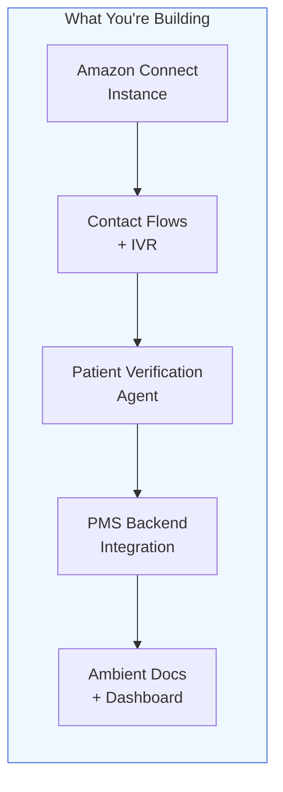

# Amazon Connect Health Setup Guide for PMS Integration

**Document ID:** PMS-EXP-AMAZONCONNECTHEALTH-001
**Version:** 1.0
**Date:** 2026-03-07
**Applies To:** PMS project (all platforms)
**Prerequisites Level:** Intermediate

---

## Table of Contents

1. [Overview](#1-overview)
2. [Prerequisites](#2-prerequisites)
3. [Part A: Provision Amazon Connect Instance](#3-part-a-provision-amazon-connect-instance)
4. [Part B: Integrate with PMS Backend](#4-part-b-integrate-with-pms-backend)
5. [Part C: Integrate with PMS Frontend](#5-part-c-integrate-with-pms-frontend)
6. [Part D: Testing and Verification](#6-part-d-testing-and-verification)
7. [Troubleshooting](#7-troubleshooting)
8. [Reference Commands](#8-reference-commands)

---

## 1. Overview

This guide walks you through setting up Amazon Connect Health with PMS. By the end, you will have:

- An Amazon Connect instance configured with healthcare IVR contact flows
- Patient Verification Agent integrated with PMS patient records
- Ambient Documentation Agent capturing clinical notes from encounters
- A call center analytics dashboard in the PMS frontend
- HIPAA-compliant encryption, audit logging, and access controls



---

## 2. Prerequisites

### 2.1 Required Software

| Software | Minimum Version | Check Command |
|----------|----------------|---------------|
| Python | 3.11+ | `python3 --version` |
| boto3 | 1.35+ | `pip show boto3` |
| AWS CLI | 2.15+ | `aws --version` |
| Node.js | 20+ | `node --version` |
| Docker | 24.0+ | `docker --version` |
| PostgreSQL | 16+ | `psql --version` |

### 2.2 Installation of Prerequisites

**AWS CLI** (if not installed):

```bash
# macOS
brew install awscli

# Verify
aws --version
```

**boto3 and AWS SDK dependencies**:

```bash
pip install boto3>=1.35 botocore amazon-connect-client
```

**AWS credentials configuration**:

```bash
aws configure
# AWS Access Key ID: [your-key]
# AWS Secret Access Key: [your-secret]
# Default region name: us-east-1
# Default output format: json
```

### 2.3 AWS Account Requirements

Before proceeding, ensure:

1. **AWS BAA executed**: Your AWS account must have a signed Business Associate Agreement. Verify at AWS Artifact console.
2. **HIPAA-eligible services only**: The account should be configured to restrict usage to HIPAA-eligible services.
3. **IAM permissions**: Your IAM user/role needs `AmazonConnect*`, `AmazonConnectHealth*`, `s3:*`, `kms:*`, `logs:*` permissions.

```bash
# Verify BAA status — use the AWS Artifact console (CLI does not support list-agreements):
# https://console.aws.amazon.com/artifact/home → Agreements → look for AWS BAA

# Verify IAM permissions
aws sts get-caller-identity
aws connect list-instances --region us-east-1
```

### 2.4 Verify PMS Services

```bash
# Backend
curl -s http://localhost:8000/api/health | jq .status
# Expected: "healthy"

# Frontend
curl -s http://localhost:3000 -o /dev/null -w "%{http_code}"
# Expected: 200

# PostgreSQL
psql -h localhost -p 5432 -U pms -c "SELECT 1;"
# Expected: 1
```

**Checkpoint:** AWS CLI configured with HIPAA-eligible account, BAA verified (via console), PMS services running.

---

## 3. Part A: Provision Amazon Connect Instance

### Step 1: Create the Amazon Connect instance

```bash
# Create a HIPAA-eligible Amazon Connect instance
aws connect create-instance \
  --identity-management-type CONNECT_MANAGED \
  --instance-alias "pms-health-contact-center" \
  --inbound-calls-enabled \
  --outbound-calls-enabled \
  --region us-east-1
```

You can view your instance in the AWS Console at:
https://us-east-1.console.aws.amazon.com/connect/v2/app/instances

Save the returned `InstanceId`:

```bash
export CONNECT_INSTANCE_ID="your-instance-id-here"
```

### Step 2: Configure encryption with AWS KMS

```bash
# Create a KMS key for PHI encryption
aws kms create-key \
  --description "PMS Connect Health PHI Encryption Key" \
  --key-usage ENCRYPT_DECRYPT \
  --region us-east-1

# Save the full ARN (not just the key ID) — the Connect API requires the full ARN
export KMS_KEY_ARN="arn:aws:kms:us-east-1:ACCOUNT:key/your-key-id"

# Create the S3 bucket for call recordings
aws s3 mb s3://pms-connect-health-recordings --region us-east-1

# Associate KMS key with Connect instance for call recordings
# IMPORTANT: The KeyId field requires the full KMS key ARN, not just the key ID
aws connect associate-instance-storage-config \
  --instance-id $CONNECT_INSTANCE_ID \
  --resource-type CALL_RECORDINGS \
  --storage-config '{
    "StorageType": "S3",
    "S3Config": {
      "BucketName": "pms-connect-health-recordings",
      "BucketPrefix": "recordings/",
      "EncryptionConfig": {
        "EncryptionType": "KMS",
        "KeyId": "'"$KMS_KEY_ARN"'"
      }
    }
  }' \
  --region us-east-1
```

### Step 3: Claim a phone number

```bash
# List available phone numbers
aws connect search-available-phone-numbers \
  --target-arn "arn:aws:connect:us-east-1:ACCOUNT:instance/$CONNECT_INSTANCE_ID" \
  --phone-number-country-code US \
  --phone-number-type TOLL_FREE \
  --region us-east-1

# Claim the phone number
aws connect claim-phone-number \
  --target-arn "arn:aws:connect:us-east-1:ACCOUNT:instance/$CONNECT_INSTANCE_ID" \
  --phone-number "+18005551234" \
  --region us-east-1
```

### Step 4: Create healthcare queues and routing profiles

```bash
# Create the patient access queue
aws connect create-queue \
  --instance-id $CONNECT_INSTANCE_ID \
  --name "PatientAccess" \
  --description "Patient verification, scheduling, and general inquiries" \
  --hours-of-operation-id "$HOURS_ID" \
  --region us-east-1

# Create the clinical support queue
aws connect create-queue \
  --instance-id $CONNECT_INSTANCE_ID \
  --name "ClinicalSupport" \
  --description "Clinical questions, prescription refills, test results" \
  --hours-of-operation-id "$HOURS_ID" \
  --region us-east-1
```

### Step 5: Enable Amazon Connect Health agents

The Connect Health API uses a domain/subscription model. First create a domain, then create a subscription within it.

> **Note:** The CLI commands are under `aws connecthealth`. Available subcommands include:
> `create-domain`, `create-subscription`, `activate-subscription`, `list-domains`, `list-subscriptions`,
> `get-domain`, `get-subscription`, `get-medical-scribe-listening-session`, `start-patient-insights-job`.

```bash
# Step 5a: Create a Connect Health domain with your KMS key
aws connecthealth create-domain \
  --name "pms-health-agent" \
  --kms-key-arn "$KMS_KEY_ARN" \
  --region us-east-1

# Save the returned domain ID (format: dom-XXXXXXXXX)
export CONNECT_HEALTH_DOMAIN_ID="your-domain-id"

# Step 5b: Create a subscription within the domain
aws connecthealth create-subscription \
  --domain-id $CONNECT_HEALTH_DOMAIN_ID \
  --region us-east-1

# Save the returned subscription ID (format: sub-XXXXXXXXXXXXXXXXXXXXX)
export CONNECT_HEALTH_SUBSCRIPTION_ID="your-subscription-id"

# Step 5c: Verify domain and subscription status
aws connecthealth get-domain \
  --domain-id $CONNECT_HEALTH_DOMAIN_ID \
  --region us-east-1

aws connecthealth get-subscription \
  --domain-id $CONNECT_HEALTH_DOMAIN_ID \
  --subscription-id $CONNECT_HEALTH_SUBSCRIPTION_ID \
  --region us-east-1
# Expected status: "ACTIVE" for both
```

### Step 6: Create the environment configuration

```bash
cat > .env.connect-health << 'EOF'
# Amazon Connect Health Configuration
AWS_REGION=us-east-1
CONNECT_INSTANCE_ID=your-instance-id
CONNECT_INSTANCE_ARN=arn:aws:connect:us-east-1:ACCOUNT:instance/your-instance-id
CONNECT_HEALTH_ENDPOINT=https://connect-health.us-east-1.amazonaws.com
KMS_KEY_ARN=arn:aws:kms:us-east-1:ACCOUNT:key/your-kms-key-id
CONNECT_PHONE_NUMBER=+18005551234
CONNECT_HEALTH_DOMAIN_ID=your-domain-id
CONNECT_HEALTH_SUBSCRIPTION_ID=your-subscription-id

# S3 Buckets
RECORDINGS_BUCKET=pms-connect-health-recordings
TRANSCRIPTS_BUCKET=pms-connect-health-transcripts

# Amazon Connect Health Pricing
CONNECT_HEALTH_PRICE_PER_USER=99.00
MAX_ENCOUNTERS_PER_USER=600
EOF
```

**Checkpoint:** Amazon Connect instance provisioned with KMS encryption, phone number claimed, healthcare queues created, and Connect Health domain/subscription active.

---

## 4. Part B: Integrate with PMS Backend

### Step 1: Create the Connect Health service module

```python
# pms-backend/services/connect_health.py
"""Amazon Connect Health integration service for PMS."""
import boto3
import json
import logging
from datetime import datetime, timezone
from typing import Optional

logger = logging.getLogger(__name__)


class ConnectHealthService:
    """Manages Amazon Connect Health agent interactions."""

    def __init__(self, instance_id: str, region: str = "us-east-1"):
        self.instance_id = instance_id
        self.region = region
        self.connect_client = boto3.client("connect", region_name=region)
        self.connect_health_client = boto3.client(
            "connecthealth", region_name=region
        )
        self.s3_client = boto3.client("s3", region_name=region)

    # ── Patient Verification ──────────────────────────────────

    async def verify_patient(
        self,
        contact_id: str,
        spoken_name: str,
        spoken_dob: str,
        caller_phone: str,
    ) -> dict:
        """
        Verify patient identity using Connect Health Patient Verification Agent.
        Cross-references spoken responses against PMS patient records.
        """
        response = self.connect_health_client.verify_patient_identity(
            InstanceId=self.instance_id,
            ContactId=contact_id,
            VerificationData={
                "SpokenName": spoken_name,
                "SpokenDateOfBirth": spoken_dob,
                "CallerPhoneNumber": caller_phone,
            },
        )

        return {
            "verified": response["VerificationResult"]["IsVerified"],
            "confidence": response["VerificationResult"]["ConfidenceScore"],
            "patient_id": response["VerificationResult"].get("MatchedPatientId"),
            "verification_method": response["VerificationResult"]["Method"],
            "timestamp": datetime.now(timezone.utc).isoformat(),
        }

    # ── Ambient Documentation ─────────────────────────────────

    async def start_ambient_session(
        self,
        encounter_id: str,
        patient_id: str,
        specialty: str = "ophthalmology",
        note_template: str = "SOAP",
    ) -> dict:
        """Start an ambient documentation session for a clinical encounter."""
        response = self.connect_health_client.start_ambient_session(
            InstanceId=self.instance_id,
            SessionConfig={
                "EncounterId": encounter_id,
                "PatientId": patient_id,
                "Specialty": specialty,
                "NoteTemplate": note_template,
                "Language": "en-US",
                "EnableTranscript": True,
            },
        )

        return {
            "session_id": response["SessionId"],
            "stream_url": response["AudioStreamUrl"],
            "status": "active",
            "started_at": datetime.now(timezone.utc).isoformat(),
        }

    async def stop_ambient_session(self, session_id: str) -> dict:
        """Stop an ambient session and retrieve generated clinical note."""
        response = self.connect_health_client.stop_ambient_session(
            InstanceId=self.instance_id,
            SessionId=session_id,
        )

        return {
            "session_id": session_id,
            "status": "completed",
            "clinical_note": response["GeneratedNote"],
            "transcript_url": response.get("TranscriptUrl"),
            "icd10_suggestions": response.get("SuggestedCodes", {}).get(
                "ICD10", []
            ),
            "cpt_suggestions": response.get("SuggestedCodes", {}).get("CPT", []),
            "confidence_scores": response.get("ConfidenceScores", {}),
            "completed_at": datetime.now(timezone.utc).isoformat(),
        }

    # ── Patient Insights ──────────────────────────────────────

    async def get_patient_insights(self, patient_id: str) -> dict:
        """Get pre-visit summary for a patient from Connect Health."""
        response = self.connect_health_client.get_patient_insights(
            InstanceId=self.instance_id,
            PatientId=patient_id,
            InsightTypes=[
                "MEDICAL_HISTORY_SUMMARY",
                "ACTIVE_MEDICATIONS",
                "RECENT_ENCOUNTERS",
                "CARE_GAPS",
                "PENDING_ORDERS",
            ],
        )

        return {
            "patient_id": patient_id,
            "summary": response["InsightsSummary"],
            "medical_history": response.get("MedicalHistory", []),
            "active_medications": response.get("ActiveMedications", []),
            "recent_encounters": response.get("RecentEncounters", []),
            "care_gaps": response.get("CareGaps", []),
            "generated_at": datetime.now(timezone.utc).isoformat(),
        }

    # ── Call Center Metrics ───────────────────────────────────

    async def get_call_center_metrics(self) -> dict:
        """Retrieve real-time call center metrics."""
        response = self.connect_client.get_current_metric_data(
            InstanceId=self.instance_id,
            Filters={
                "Queues": [],  # All queues
                "Channels": ["VOICE", "CHAT"],
            },
            CurrentMetrics=[
                {"Name": "AGENTS_ONLINE", "Unit": "COUNT"},
                {"Name": "CONTACTS_IN_QUEUE", "Unit": "COUNT"},
                {"Name": "OLDEST_CONTACT_AGE", "Unit": "SECONDS"},
                {"Name": "AGENTS_AVAILABLE", "Unit": "COUNT"},
            ],
        )

        metrics = {}
        for result in response.get("MetricResults", []):
            for metric in result.get("Collections", []):
                metrics[metric["Metric"]["Name"]] = metric["Value"]

        return {
            "agents_online": metrics.get("AGENTS_ONLINE", 0),
            "contacts_in_queue": metrics.get("CONTACTS_IN_QUEUE", 0),
            "longest_wait_seconds": metrics.get("OLDEST_CONTACT_AGE", 0),
            "agents_available": metrics.get("AGENTS_AVAILABLE", 0),
            "timestamp": datetime.now(timezone.utc).isoformat(),
        }
```

### Step 2: Create FastAPI router

```python
# pms-backend/routers/connect_health.py
"""Amazon Connect Health API endpoints for PMS."""
from fastapi import APIRouter, Depends, HTTPException
from pydantic import BaseModel
from typing import Optional

from services.connect_health import ConnectHealthService
from core.config import settings
from core.audit import audit_log

router = APIRouter(prefix="/api/connect-health", tags=["connect-health"])


def get_connect_service() -> ConnectHealthService:
    return ConnectHealthService(
        instance_id=settings.CONNECT_INSTANCE_ID,
        region=settings.AWS_REGION,
    )


# ── Patient Verification ─────────────────────────────────────

class VerifyPatientRequest(BaseModel):
    contact_id: str
    spoken_name: str
    spoken_dob: str
    caller_phone: str


@router.post("/verify-patient")
async def verify_patient(
    req: VerifyPatientRequest,
    service: ConnectHealthService = Depends(get_connect_service),
):
    """Verify patient identity via Connect Health Patient Verification Agent."""
    result = await service.verify_patient(
        contact_id=req.contact_id,
        spoken_name=req.spoken_name,
        spoken_dob=req.spoken_dob,
        caller_phone=req.caller_phone,
    )
    await audit_log(
        action="patient_verification",
        resource_type="patient",
        resource_id=result.get("patient_id"),
        details={"verified": result["verified"], "method": result["verification_method"]},
    )
    return result


# ── Ambient Documentation ────────────────────────────────────

class StartAmbientRequest(BaseModel):
    encounter_id: str
    patient_id: str
    specialty: str = "ophthalmology"
    note_template: str = "SOAP"


class StopAmbientRequest(BaseModel):
    session_id: str
    encounter_id: str


@router.post("/ambient/start")
async def start_ambient(
    req: StartAmbientRequest,
    service: ConnectHealthService = Depends(get_connect_service),
):
    """Start ambient documentation for a clinical encounter."""
    result = await service.start_ambient_session(
        encounter_id=req.encounter_id,
        patient_id=req.patient_id,
        specialty=req.specialty,
        note_template=req.note_template,
    )
    await audit_log(
        action="ambient_session_start",
        resource_type="encounter",
        resource_id=req.encounter_id,
        details={"session_id": result["session_id"], "specialty": req.specialty},
    )
    return result


@router.post("/ambient/stop")
async def stop_ambient(
    req: StopAmbientRequest,
    service: ConnectHealthService = Depends(get_connect_service),
):
    """Stop ambient session and retrieve generated clinical note."""
    result = await service.stop_ambient_session(session_id=req.session_id)
    await audit_log(
        action="ambient_session_stop",
        resource_type="encounter",
        resource_id=req.encounter_id,
        details={
            "session_id": req.session_id,
            "has_note": bool(result.get("clinical_note")),
        },
    )
    return result


# ── Patient Insights ─────────────────────────────────────────

@router.get("/insights/{patient_id}")
async def get_patient_insights(
    patient_id: str,
    service: ConnectHealthService = Depends(get_connect_service),
):
    """Get pre-visit summary from Connect Health Patient Insights Agent."""
    result = await service.get_patient_insights(patient_id=patient_id)
    await audit_log(
        action="patient_insights_view",
        resource_type="patient",
        resource_id=patient_id,
    )
    return result


# ── Call Center Metrics ──────────────────────────────────────

@router.get("/metrics")
async def get_metrics(
    service: ConnectHealthService = Depends(get_connect_service),
):
    """Get real-time call center metrics."""
    return await service.get_call_center_metrics()
```

### Step 3: Create the PostgreSQL schema for Connect Health data

```sql
-- connect_health_schema.sql
CREATE TABLE IF NOT EXISTS connect_health_verifications (
    id UUID PRIMARY KEY DEFAULT gen_random_uuid(),
    contact_id VARCHAR(100) NOT NULL,
    patient_id UUID REFERENCES patients(id),
    caller_phone VARCHAR(20),
    verified BOOLEAN NOT NULL,
    confidence_score DECIMAL(5,4),
    verification_method VARCHAR(50),
    created_at TIMESTAMPTZ NOT NULL DEFAULT NOW()
);

CREATE TABLE IF NOT EXISTS connect_health_ambient_sessions (
    id UUID PRIMARY KEY DEFAULT gen_random_uuid(),
    session_id VARCHAR(100) UNIQUE NOT NULL,
    encounter_id UUID REFERENCES encounters(id),
    patient_id UUID REFERENCES patients(id),
    specialty VARCHAR(50) NOT NULL,
    note_template VARCHAR(50) NOT NULL,
    status VARCHAR(20) NOT NULL DEFAULT 'active',
    clinical_note TEXT,
    transcript_url TEXT,
    icd10_codes JSONB DEFAULT '[]',
    cpt_codes JSONB DEFAULT '[]',
    confidence_scores JSONB DEFAULT '{}',
    started_at TIMESTAMPTZ NOT NULL DEFAULT NOW(),
    completed_at TIMESTAMPTZ
);

CREATE TABLE IF NOT EXISTS connect_health_call_metrics (
    id UUID PRIMARY KEY DEFAULT gen_random_uuid(),
    agents_online INTEGER,
    contacts_in_queue INTEGER,
    longest_wait_seconds INTEGER,
    agents_available INTEGER,
    recorded_at TIMESTAMPTZ NOT NULL DEFAULT NOW()
);

CREATE INDEX idx_verifications_patient ON connect_health_verifications(patient_id);
CREATE INDEX idx_verifications_contact ON connect_health_verifications(contact_id);
CREATE INDEX idx_ambient_encounter ON connect_health_ambient_sessions(encounter_id);
CREATE INDEX idx_ambient_status ON connect_health_ambient_sessions(status);
CREATE INDEX idx_metrics_time ON connect_health_call_metrics(recorded_at);
```

```bash
psql -h localhost -p 5432 -U pms -d pms -f connect_health_schema.sql
```

### Step 4: Create Lambda function for Contact Flow integration

When a patient calls, the Amazon Connect contact flow invokes this Lambda to look up patient data in PMS:

```python
# lambda/pms_patient_lookup.py
"""Lambda function invoked by Amazon Connect contact flows to look up patients in PMS."""
import json
import httpx
import os

PMS_BACKEND_URL = os.environ.get("PMS_BACKEND_URL", "http://pms-backend:8000")
PMS_API_KEY = os.environ.get("PMS_API_KEY")


def lambda_handler(event, context):
    """
    Called by Amazon Connect contact flow.
    Input: event['Details']['ContactData']['CustomerEndpoint']['Address'] (phone number)
    Output: Patient data attributes for contact flow.
    """
    caller_phone = event["Details"]["ContactData"]["CustomerEndpoint"]["Address"]

    # Normalize phone number
    phone_normalized = caller_phone.replace("+1", "").replace("-", "").replace(" ", "")

    try:
        with httpx.Client(timeout=10) as client:
            response = client.get(
                f"{PMS_BACKEND_URL}/api/patients",
                params={"phone": phone_normalized},
                headers={"Authorization": f"Bearer {PMS_API_KEY}"},
            )
            response.raise_for_status()
            patients = response.json()

        if patients and len(patients) > 0:
            patient = patients[0]
            return {
                "patientFound": "true",
                "patientId": str(patient["id"]),
                "patientName": f"{patient['first_name']} {patient['last_name']}",
                "patientDOB": patient["date_of_birth"],
                "insuranceId": patient.get("insurance_id", ""),
                "lastVisitDate": patient.get("last_visit_date", ""),
            }
        else:
            return {
                "patientFound": "false",
                "patientId": "",
                "patientName": "",
            }

    except Exception as e:
        print(f"Error looking up patient: {e}")
        return {
            "patientFound": "error",
            "errorMessage": str(e),
        }
```

**Checkpoint:** PMS backend integrated with Amazon Connect Health via `ConnectHealthService` class. FastAPI router provides endpoints for patient verification, ambient documentation, patient insights, and call center metrics. Lambda function bridges contact flows to PMS patient data.

---

## 5. Part C: Integrate with PMS Frontend

### Step 1: Install Amazon Connect Health SDK

```bash
cd pms-frontend
npm install amazon-connect-streams @aws-sdk/client-connecthealth
```

### Step 2: Create environment configuration

```bash
# .env.local
NEXT_PUBLIC_CONNECT_INSTANCE_URL=https://pms-health-contact-center.my.connect.aws
NEXT_PUBLIC_CONNECT_HEALTH_API=/api/connect-health
NEXT_PUBLIC_AWS_REGION=us-east-1
```

### Step 3: Create the Ambient Documentation component

```typescript
// components/connect-health/AmbientDocumentation.tsx
"use client";

import { useState, useCallback } from "react";

interface AmbientSession {
  session_id: string;
  stream_url: string;
  status: string;
  started_at: string;
}

interface AmbientResult {
  clinical_note: string;
  icd10_suggestions: Array<{ code: string; description: string; confidence: number }>;
  cpt_suggestions: Array<{ code: string; description: string; confidence: number }>;
  transcript_url?: string;
}

interface Props {
  encounterId: string;
  patientId: string;
  specialty?: string;
}

export default function AmbientDocumentation({
  encounterId,
  patientId,
  specialty = "ophthalmology",
}: Props) {
  const [session, setSession] = useState<AmbientSession | null>(null);
  const [result, setResult] = useState<AmbientResult | null>(null);
  const [isRecording, setIsRecording] = useState(false);
  const [noteAccepted, setNoteAccepted] = useState(false);

  const startSession = useCallback(async () => {
    const res = await fetch("/api/connect-health/ambient/start", {
      method: "POST",
      headers: { "Content-Type": "application/json" },
      body: JSON.stringify({
        encounter_id: encounterId,
        patient_id: patientId,
        specialty,
        note_template: "SOAP",
      }),
    });
    const data = await res.json();
    setSession(data);
    setIsRecording(true);
  }, [encounterId, patientId, specialty]);

  const stopSession = useCallback(async () => {
    if (!session) return;
    const res = await fetch("/api/connect-health/ambient/stop", {
      method: "POST",
      headers: { "Content-Type": "application/json" },
      body: JSON.stringify({
        session_id: session.session_id,
        encounter_id: encounterId,
      }),
    });
    const data = await res.json();
    setResult(data);
    setIsRecording(false);
  }, [session, encounterId]);

  const acceptNote = useCallback(async () => {
    if (!result) return;
    // Write accepted note back to encounter
    await fetch(`/api/encounters/${encounterId}/notes`, {
      method: "PUT",
      headers: { "Content-Type": "application/json" },
      body: JSON.stringify({
        clinical_note: result.clinical_note,
        icd10_codes: result.icd10_suggestions.filter((c) => c.confidence > 0.8),
        cpt_codes: result.cpt_suggestions.filter((c) => c.confidence > 0.8),
        source: "amazon_connect_health_ambient",
      }),
    });
    setNoteAccepted(true);
  }, [result, encounterId]);

  return (
    <div className="border rounded-lg p-4 space-y-4">
      <div className="flex items-center justify-between">
        <h3 className="text-lg font-semibold">Ambient Documentation</h3>
        <span className="text-xs text-gray-500">
          Powered by Amazon Connect Health
        </span>
      </div>

      {/* Recording Controls */}
      {!isRecording && !result && (
        <button
          onClick={startSession}
          className="w-full py-3 bg-green-600 text-white rounded-lg hover:bg-green-700 flex items-center justify-center gap-2"
        >
          <span className="w-3 h-3 bg-red-500 rounded-full" />
          Start Ambient Listening
        </button>
      )}

      {isRecording && (
        <div className="space-y-3">
          <div className="flex items-center gap-2 text-green-700 bg-green-50 p-3 rounded">
            <span className="w-3 h-3 bg-red-500 rounded-full animate-pulse" />
            <span>Listening to encounter...</span>
          </div>
          <button
            onClick={stopSession}
            className="w-full py-3 bg-red-600 text-white rounded-lg hover:bg-red-700"
          >
            Stop & Generate Note
          </button>
        </div>
      )}

      {/* Generated Note */}
      {result && !noteAccepted && (
        <div className="space-y-4">
          <div className="bg-blue-50 border border-blue-200 rounded p-4">
            <h4 className="font-semibold mb-2">Generated Clinical Note</h4>
            <pre className="whitespace-pre-wrap text-sm font-mono">
              {result.clinical_note}
            </pre>
          </div>

          {/* Suggested Codes */}
          {result.icd10_suggestions.length > 0 && (
            <div>
              <h4 className="font-semibold text-sm mb-1">Suggested ICD-10 Codes</h4>
              <div className="space-y-1">
                {result.icd10_suggestions.map((code) => (
                  <div
                    key={code.code}
                    className="flex items-center justify-between text-sm bg-gray-50 p-2 rounded"
                  >
                    <span>
                      <strong>{code.code}</strong> — {code.description}
                    </span>
                    <span
                      className={`text-xs px-2 py-0.5 rounded ${
                        code.confidence > 0.9
                          ? "bg-green-100 text-green-800"
                          : "bg-yellow-100 text-yellow-800"
                      }`}
                    >
                      {(code.confidence * 100).toFixed(0)}%
                    </span>
                  </div>
                ))}
              </div>
            </div>
          )}

          <div className="flex gap-2">
            <button
              onClick={acceptNote}
              className="flex-1 py-2 bg-blue-600 text-white rounded hover:bg-blue-700"
            >
              Accept & Save to Encounter
            </button>
            <button
              onClick={() => setResult(null)}
              className="px-4 py-2 border rounded hover:bg-gray-50"
            >
              Discard
            </button>
          </div>
        </div>
      )}

      {noteAccepted && (
        <div className="bg-green-50 border border-green-200 rounded p-3 text-green-800">
          Note saved to encounter successfully.
        </div>
      )}
    </div>
  );
}
```

### Step 4: Create the Call Center Dashboard component

```typescript
// components/connect-health/CallCenterDashboard.tsx
"use client";

import { useEffect, useState } from "react";

interface Metrics {
  agents_online: number;
  contacts_in_queue: number;
  longest_wait_seconds: number;
  agents_available: number;
  timestamp: string;
}

export default function CallCenterDashboard() {
  const [metrics, setMetrics] = useState<Metrics | null>(null);

  useEffect(() => {
    const fetchMetrics = async () => {
      const res = await fetch("/api/connect-health/metrics");
      const data = await res.json();
      setMetrics(data);
    };

    fetchMetrics();
    const interval = setInterval(fetchMetrics, 15000); // Refresh every 15s
    return () => clearInterval(interval);
  }, []);

  if (!metrics) return <div className="animate-pulse h-24 bg-gray-100 rounded" />;

  const cards = [
    {
      label: "Agents Online",
      value: metrics.agents_online,
      color: "bg-blue-50 text-blue-800",
    },
    {
      label: "Available",
      value: metrics.agents_available,
      color: "bg-green-50 text-green-800",
    },
    {
      label: "In Queue",
      value: metrics.contacts_in_queue,
      color: metrics.contacts_in_queue > 5
        ? "bg-red-50 text-red-800"
        : "bg-gray-50 text-gray-800",
    },
    {
      label: "Longest Wait",
      value: `${Math.floor(metrics.longest_wait_seconds / 60)}m ${metrics.longest_wait_seconds % 60}s`,
      color: metrics.longest_wait_seconds > 120
        ? "bg-red-50 text-red-800"
        : "bg-gray-50 text-gray-800",
    },
  ];

  return (
    <div className="space-y-3">
      <h3 className="text-lg font-semibold">Call Center — Live</h3>
      <div className="grid grid-cols-2 md:grid-cols-4 gap-3">
        {cards.map((card) => (
          <div key={card.label} className={`rounded-lg p-4 ${card.color}`}>
            <div className="text-2xl font-bold">{card.value}</div>
            <div className="text-sm">{card.label}</div>
          </div>
        ))}
      </div>
      <div className="text-xs text-gray-400">
        Updated: {new Date(metrics.timestamp).toLocaleTimeString()}
      </div>
    </div>
  );
}
```

**Checkpoint:** PMS frontend has AmbientDocumentation component for clinical encounters and CallCenterDashboard for real-time call center monitoring. Components connect to PMS backend which proxies to Amazon Connect Health APIs.

---

## 6. Part D: Testing and Verification

### Step 1: Verify Amazon Connect instance and Connect Health

```bash
# Check instance status
aws connect describe-instance \
  --instance-id $CONNECT_INSTANCE_ID \
  --region us-east-1 | jq '.Instance.InstanceStatus'
# Expected: "ACTIVE"

# Verify Connect Health domain
aws connecthealth get-domain \
  --domain-id $CONNECT_HEALTH_DOMAIN_ID \
  --region us-east-1 | jq '.status'
# Expected: "ACTIVE"

# List Connect Health subscriptions
aws connecthealth list-subscriptions \
  --domain-id $CONNECT_HEALTH_DOMAIN_ID \
  --region us-east-1
# Expected: at least one subscription with status "ACTIVE"
```

### Step 2: Test PMS backend endpoints

```bash
# Test call center metrics
curl -s http://localhost:8000/api/connect-health/metrics | jq .
# Expected: { "agents_online": ..., "contacts_in_queue": ..., ... }

# Test patient insights (requires patient to exist)
curl -s http://localhost:8000/api/connect-health/insights/test-patient-001 | jq .
# Expected: { "patient_id": "test-patient-001", "summary": ..., ... }
```

### Step 3: Test ambient documentation flow

```bash
# Start ambient session
curl -s -X POST http://localhost:8000/api/connect-health/ambient/start \
  -H "Content-Type: application/json" \
  -d '{
    "encounter_id": "test-encounter-001",
    "patient_id": "test-patient-001",
    "specialty": "ophthalmology",
    "note_template": "SOAP"
  }' | jq .
# Expected: { "session_id": "...", "stream_url": "...", "status": "active" }

# Stop and get note (after recording)
curl -s -X POST http://localhost:8000/api/connect-health/ambient/stop \
  -H "Content-Type: application/json" \
  -d '{
    "session_id": "SESSION_ID_FROM_ABOVE",
    "encounter_id": "test-encounter-001"
  }' | jq .
# Expected: { "clinical_note": "...", "icd10_suggestions": [...], ... }
```

### Step 4: Test contact flow Lambda

```bash
# Invoke Lambda locally (using SAM CLI)
sam local invoke PmsPatientLookup \
  --event '{"Details":{"ContactData":{"CustomerEndpoint":{"Address":"+15125551234"}}}}' \
  --env-vars env.json
# Expected: { "patientFound": "true", "patientName": "...", ... }
```

**Checkpoint:** Amazon Connect instance active, PMS backend endpoints returning data, ambient documentation flow working end-to-end, Lambda function resolving patient data from phone number.

---

## 7. Troubleshooting

### Amazon Connect instance not accessible

**Symptom:** `aws connect describe-instance` returns `AccessDeniedException`.

**Fix:** Ensure IAM role has `connect:DescribeInstance` permission. Check that you're in the correct AWS region:
```bash
aws connect list-instances --region us-east-1
```

### Patient Verification returns low confidence

**Symptom:** Verification succeeds but confidence score is below 0.7.

**Fix:** Ensure patient data in PMS has normalized phone numbers (no dashes, country code stripped). Verify name spelling matches PMS records. Enable fuzzy matching:
```python
# In Lambda, normalize before lookup
phone_normalized = caller_phone.lstrip("+1").replace("-", "")
```

### Ambient documentation generates empty note

**Symptom:** `clinical_note` field is empty or contains only template headers.

**Fix:**
1. Verify microphone permissions in browser (for frontend integration)
2. Check that the audio stream URL is accessible from the client
3. Ensure the specialty is supported (ophthalmology is supported under the 22+ specialties)
4. Verify session lasted at least 30 seconds (very short sessions may not generate content)

### boto3 ConnectHealth client not found

**Symptom:** `botocore.exceptions.UnknownServiceError: Unknown service: 'connecthealth'`

**Fix:** Update boto3 to the latest version (Connect Health was added in March 2026):
```bash
pip install --upgrade boto3 botocore
```

> **Note on CLI commands:** The `aws connecthealth` CLI uses a domain/subscription model.
> There is no `enable-agent`, `list-agents`, or `describe-agent` subcommand. The available
> subcommands are: `create-domain`, `create-subscription`, `activate-subscription`,
> `deactivate-subscription`, `delete-domain`, `get-domain`, `get-subscription`,
> `get-medical-scribe-listening-session`, `get-patient-insights-job`, `list-domains`,
> `list-subscriptions`, `start-patient-insights-job`, `list-tags-for-resource`,
> `tag-resource`, `untag-resource`. Run `aws connecthealth help` to see the full list.

### Call recordings not encrypted

**Symptom:** S3 objects lack KMS encryption metadata.

**Fix:** Verify KMS key association:
```bash
aws connect list-instance-storage-configs \
  --instance-id $CONNECT_INSTANCE_ID \
  --resource-type CALL_RECORDINGS \
  --region us-east-1
```
Re-associate if needed with the correct KMS key ID.

---

## 8. Reference Commands

### Daily Development Workflow

```bash
# Check Connect instance status
aws connect describe-instance --instance-id $CONNECT_INSTANCE_ID --region us-east-1 | jq .Instance.InstanceStatus

# View active ambient sessions
curl -s http://localhost:8000/api/connect-health/ambient/active | jq .

# Get real-time metrics
curl -s http://localhost:8000/api/connect-health/metrics | jq .

# Check CloudTrail for recent API calls
aws cloudtrail lookup-events \
  --lookup-attributes AttributeKey=EventSource,AttributeValue=connect.amazonaws.com \
  --max-results 10 --region us-east-1 | jq '.Events[].EventName'
```

### Management Commands

```bash
# List all queues
aws connect list-queues --instance-id $CONNECT_INSTANCE_ID --region us-east-1 | jq '.QueueSummaryList[].Name'

# List phone numbers
aws connect list-phone-numbers-v2 --target-arn $CONNECT_INSTANCE_ARN --region us-east-1

# List contact flows
aws connect list-contact-flows --instance-id $CONNECT_INSTANCE_ID --region us-east-1 | jq '.ContactFlowSummaryList[].Name'

# Get historical metrics (last 24h)
aws connect get-metric-data-v2 \
  --resource-arn $CONNECT_INSTANCE_ARN \
  --start-time $(date -v-1d -u +%Y-%m-%dT%H:%M:%SZ) \
  --end-time $(date -u +%Y-%m-%dT%H:%M:%SZ) \
  --filters '[{"FilterKey":"QUEUE","FilterValues":["PatientAccess"]}]' \
  --metrics '[{"Name":"AVG_HANDLE_TIME"},{"Name":"CONTACTS_HANDLED"},{"Name":"ABANDONMENT_RATE"}]' \
  --region us-east-1
```

### Useful URLs

| Resource | URL |
|----------|-----|
| Amazon Connect Admin Console | `https://pms-health-contact-center.my.connect.aws` |
| Connect Health Docs | https://docs.aws.amazon.com/connecthealth/latest/userguide/ |
| Connect API Reference | https://docs.aws.amazon.com/connect/latest/APIReference/ |
| boto3 Connect Reference | https://boto3.amazonaws.com/v1/documentation/api/latest/reference/services/connect.html |
| CloudWatch Logs | https://console.aws.amazon.com/cloudwatch/home?region=us-east-1#logsV2:log-groups |
| PMS Backend Health | http://localhost:8000/api/health |
| PMS Frontend | http://localhost:3000 |

---

## Next Steps

1. Follow the [Developer Tutorial](51-AmazonConnectHealth-Developer-Tutorial.md) to build your first patient verification and ambient documentation flow
2. Configure specialty-specific note templates for ophthalmology encounters
3. Set up call center agent workspace with PMS patient context panels
4. Enable Appointment Management Agent when it reaches GA

## Resources

- [Amazon Connect Health Product Page](https://aws.amazon.com/health/connect-health/)
- [Amazon Connect Health Documentation](https://docs.aws.amazon.com/connecthealth/latest/userguide/what-is-service.html)
- [Amazon Connect Health FAQs](https://aws.amazon.com/health/connect-health/faqs/)
- [Amazon Connect Admin Guide](https://docs.aws.amazon.com/connect/latest/adminguide/)
- [HIPAA Best Practices for Amazon Connect](https://docs.aws.amazon.com/connect/latest/adminguide/compliance-validation-best-practices-HIPAA.html)
- [boto3 Amazon Connect](https://boto3.amazonaws.com/v1/documentation/api/latest/reference/services/connect.html)
- [PRD: Amazon Connect Health PMS Integration](51-PRD-AmazonConnectHealth-PMS-Integration.md)
