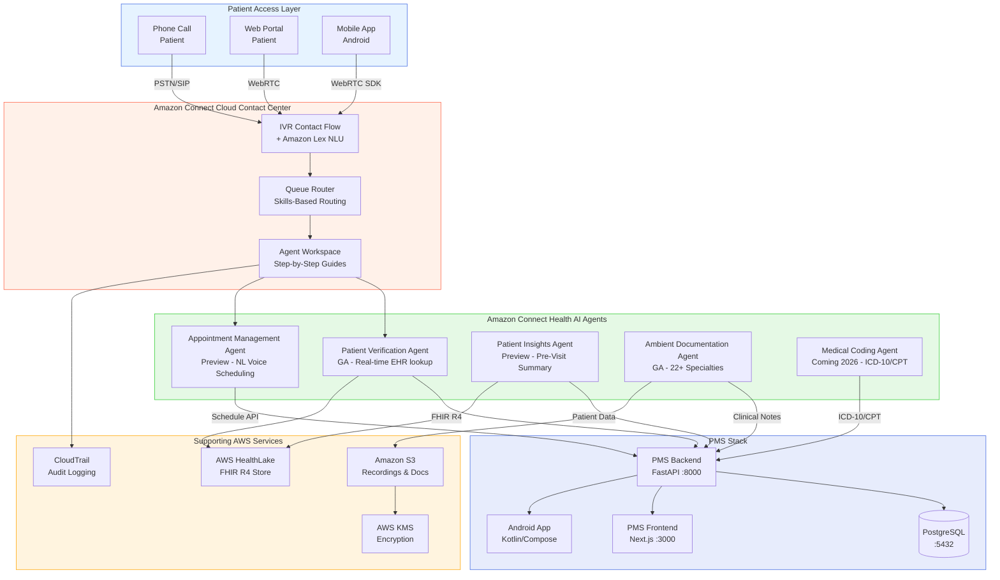

# Product Requirements Document: Amazon Connect Health Integration into Patient Management System (PMS)

**Document ID:** PRD-PMS-AMAZONCONNECTHEALTH-001
**Version:** 1.0
**Date:** 2026-03-07
**Author:** Ammar (CEO, MPS Inc.)
**Status:** Draft

---

## 1. Executive Summary

Amazon Connect Health is a purpose-built agentic AI platform launched by AWS on March 5, 2026, that extends Amazon Connect's cloud contact center capabilities with five healthcare-specific AI agents: patient verification, appointment management, patient insights (pre-visit summaries), ambient clinical documentation, and automated medical coding. It is the first industry-specific extension of Amazon Connect, which crossed $1B ARR in 2025, and directly competes with Microsoft's DAX Copilot (Nuance) while offering broader workflow coverage — from the initial patient phone call through post-visit billing.

Integrating Amazon Connect Health into PMS would transform two critical operational bottlenecks: (1) the patient access center, where front-desk and call-center staff manually verify identity, check eligibility, and schedule appointments across multiple systems, and (2) the clinical encounter workflow, where clinicians spend significant time on documentation and coding. Amazon Connect Health's unified SDK enables embedding ambient documentation, patient verification, and medical coding directly into the PMS frontend and backend without building separate AI pipelines.

At $99/user/month for up to 600 encounters, the solution is cost-competitive with building equivalent capabilities in-house (Experiments 10, 21, 30, 33 for voice/transcription; Experiment 07 for medical ASR). The managed nature eliminates GPU infrastructure requirements for transcription and provides 22+ specialty support out of the box, with FHIR R4 integration for EHR data exchange and native Epic compatibility.

---

## 2. Problem Statement

PMS currently faces two major operational bottlenecks that Amazon Connect Health directly addresses:

**Patient Access Center Inefficiency:** Front-desk staff and call-center agents manually verify patient identity by asking for name, DOB, insurance ID, and cross-referencing across PMS screens. Each verification takes 2-3 minutes per call. For a practice handling 200+ calls/day, this consumes 6-10 hours of staff time daily. Call abandonment rates in ophthalmology practices average 15-25% due to long hold times. There is no automated scheduling system — staff manually check provider calendars, room availability, and insurance authorization status.

**Clinical Documentation Burden:** Clinicians spend an estimated 2 hours on documentation for every 1 hour of patient care. Current PMS experiments (Exp 10 Speechmatics, Exp 21 Voxtral, Exp 07 MedASR) provide speech-to-text transcription but require PMS to build the entire clinical note generation, specialty template formatting, and EHR integration pipeline. No existing experiment provides end-to-end ambient documentation that listens to the encounter and produces formatted clinical notes ready for EHR insertion.

**Medical Coding Gap:** After documentation, clinicians or coding staff must manually assign ICD-10 diagnosis codes and CPT procedure codes. This is error-prone, delays billing, and contributes to revenue cycle inefficiency. No existing PMS experiment addresses automated medical coding.

---

## 3. Proposed Solution

### 3.1 Architecture Overview

### 3.2 Deployment Model

- **Fully managed cloud service**: Amazon Connect Health is a SaaS offering — no self-hosted infrastructure required
- **HIPAA eligible**: Amazon Connect has been HIPAA eligible since 2017; requires executed Business Associate Agreement (BAA) with AWS
- **AWS Region**: Deploy in us-east-1 or us-west-2 (HIPAA-eligible regions)
- **Encryption**: AWS KMS for data at rest; TLS 1.2+ for data in transit
- **Audit logging**: CloudTrail captures all API calls; CloudWatch for operational monitoring
- **Data residency**: All PHI remains within AWS HIPAA-eligible services; no PHI egress to non-BAA services
- **Integration method**: Unified SDK embedded into PMS backend (Python/boto3) and frontend (JavaScript SDK)

---

## 4. PMS Data Sources

| PMS API | Amazon Connect Health Integration |
|---------|----------------------------------|
| `/api/patients` | **Patient Verification Agent** queries patient demographics (name, DOB, phone, insurance ID) for real-time identity matching during inbound calls. **Patient Insights Agent** retrieves medical history for pre-visit summaries. |
| `/api/encounters` | **Ambient Documentation Agent** writes generated clinical notes back as encounter records. **Patient Insights Agent** reads recent encounters for context. |
| `/api/prescriptions` | **Patient Insights Agent** retrieves active medications for pre-visit summary. **Ambient Documentation Agent** captures medication changes discussed during encounter. |
| `/api/reports` | **Medical Coding Agent** submits ICD-10/CPT codes for billing reports. Call center analytics feed into operational reporting. |
| `/api/appointments` (new) | **Appointment Management Agent** reads/writes provider schedules, checks room availability, verifies insurance eligibility before booking. |

---

## 5. Component/Module Definitions

### 5.1 Amazon Connect Instance Manager

**Description:** Provisions and configures the Amazon Connect instance with healthcare-specific contact flows, queues, and routing profiles for the PMS call center.

**Input:** Practice configuration (hours, providers, specialties, phone numbers)
**Output:** Configured Amazon Connect instance with IVR flows, queues, and agent workspace
**PMS APIs:** None (infrastructure setup)

### 5.2 Patient Verification Integration Service

**Description:** Bridges the Amazon Connect Health Patient Verification Agent with PMS patient records. When a patient calls, the agent conversationally verifies identity by cross-referencing spoken responses against PMS data in real time.

**Input:** Inbound call with caller phone number, spoken name/DOB
**Output:** Verified patient identity, linked PMS patient record
**PMS APIs:** `/api/patients` (read — demographics lookup by phone, name, DOB)

### 5.3 Appointment Scheduling Bridge

**Description:** Connects the Amazon Connect Health Appointment Management Agent (preview) to PMS scheduling data. Enables patients to book, reschedule, or cancel appointments via natural language voice interaction 24/7.

**Input:** Patient request (voice), provider availability, insurance status
**Output:** Confirmed appointment in PMS, confirmation SMS/email
**PMS APIs:** `/api/appointments` (read/write), `/api/patients` (read — insurance verification)

### 5.4 Ambient Documentation Service

**Description:** Integrates the Amazon Connect Health Ambient Documentation Agent into the PMS clinical encounter workflow. Captures clinician-patient conversations via the unified SDK, generates structured clinical notes formatted to PMS templates, and writes them back to the encounter record.

**Input:** Real-time audio stream from encounter (microphone in exam room or telehealth)
**Output:** Structured clinical note (SOAP, H&P, procedure note) mapped to PMS encounter fields
**PMS APIs:** `/api/encounters` (write — clinical notes), `/api/patients` (read — context)

### 5.5 Medical Coding Service

**Description:** Takes generated clinical notes and produces ICD-10 diagnosis codes and CPT procedure codes with confidence scores and source traceability. Codes are staged for clinician review before submission.

**Input:** Clinical note text from encounter
**Output:** Suggested ICD-10 and CPT codes with confidence scores
**PMS APIs:** `/api/encounters` (read — clinical notes), `/api/reports` (write — billing codes)

### 5.6 Patient Insights Dashboard Component

**Description:** Displays pre-visit summaries generated by the Patient Insights Agent in the PMS frontend. Shows relevant medical history, recent encounters, active medications, pending orders, and care gaps before the clinician enters the exam room.

**Input:** Patient ID, upcoming appointment
**Output:** Rendered pre-visit summary card in PMS frontend
**PMS APIs:** `/api/patients`, `/api/encounters`, `/api/prescriptions` (all read)

### 5.7 Call Center Analytics Service

**Description:** Ingests Amazon Connect contact metrics (call volume, wait times, abandonment rates, verification times) into PMS reporting dashboards for operational management.

**Input:** Amazon Connect real-time and historical metrics
**Output:** Call center performance dashboard in PMS
**PMS APIs:** `/api/reports` (write — call center metrics)

---

## 6. Non-Functional Requirements

### 6.1 Security and HIPAA Compliance

- **BAA required**: Execute AWS Business Associate Agreement before any PHI processing
- **Encryption at rest**: AWS KMS customer-managed keys (CMK) for all stored data (recordings, transcripts, notes)
- **Encryption in transit**: TLS 1.2+ for all API calls and audio streams
- **Access control**: IAM roles with least-privilege policies; MFA for admin console access
- **Audit logging**: CloudTrail for all API calls; CloudWatch Logs for contact flow events; PMS audit table for all PHI access
- **Data retention**: Configure S3 lifecycle policies aligned with HIPAA retention (7 years for clinical records)
- **PHI isolation**: Dedicated Amazon Connect instance (not shared); VPC endpoints for private API access
- **Recording consent**: IVR flow must announce call recording; state-specific two-party consent compliance

### 6.2 Performance

| Metric | Target |
|--------|--------|
| Patient verification time | < 30 seconds (vs 2-3 min manual) |
| Ambient note generation latency | < 10 seconds after encounter ends |
| IVR response time | < 2 seconds per turn |
| Call abandonment rate | < 10% (from 15-25% baseline) |
| Scheduling completion rate | > 80% without agent escalation |
| Medical coding accuracy | > 95% for top 50 CPT codes |
| API call latency (boto3) | < 500ms p99 |

### 6.3 Infrastructure

- **AWS Account**: Dedicated healthcare AWS account with HIPAA-eligible services only
- **Amazon Connect Instance**: 1 instance per practice/region
- **Networking**: VPC with private subnets for PMS backend; VPC endpoints for Connect APIs
- **Phone numbers**: Claim DID numbers through Amazon Connect (toll-free and local)
- **Agent workstations**: Web-based agent workspace (Chrome/Edge); no desktop software required
- **SDK integration**: `amazon-connect-health-sdk` (JavaScript) for frontend; `boto3` for backend

---

## 7. Implementation Phases

### Phase 1: Contact Center Foundation (Weeks 1-3, Sprint 1-2)

- Execute AWS BAA and provision HIPAA-eligible account
- Create Amazon Connect instance with healthcare IVR contact flows
- Configure queues, routing profiles, and agent workspace
- Integrate Patient Verification Agent with PMS `/api/patients`
- Deploy basic call center analytics to PMS dashboard
- Train front-desk staff on agent workspace

### Phase 2: Ambient Documentation (Weeks 4-6, Sprint 3-4)

- Integrate Amazon Connect Health unified SDK into PMS frontend
- Configure Ambient Documentation Agent for ophthalmology specialty templates
- Build encounter-to-note pipeline: audio capture → note generation → encounter write-back
- Implement clinician review workflow in PMS frontend
- Test with synthetic encounters across 5 common ophthalmology visit types

### Phase 3: Advanced Agents & Coding (Weeks 7-10, Sprint 5-6)

- Integrate Appointment Management Agent (when GA) with PMS scheduling
- Deploy Patient Insights Agent for pre-visit summaries
- Integrate Medical Coding Agent (when available) with billing workflow
- Build comprehensive call center analytics dashboard
- Implement telehealth audio bridge for remote encounters

---

## 8. Success Metrics

| Metric | Target | Measurement Method |
|--------|--------|--------------------|
| Patient verification time | < 30 sec (80% reduction) | Amazon Connect contact metrics |
| Call abandonment rate | < 10% | Amazon Connect dashboard |
| Documentation time per encounter | 50% reduction | Clinician time tracking |
| Note accuracy | > 95% clinician acceptance | Review rate in PMS |
| Coding accuracy | > 95% for top 50 CPT codes | Audit sampling |
| Staff hours saved/week | > 40 hours | Operational tracking |
| Patient satisfaction (CSAT) | > 4.5/5.0 | Post-call survey |
| Cost per encounter | < $0.50 (including all agents) | AWS billing / encounter count |

---

## 9. Risks and Mitigations

| Risk | Impact | Mitigation |
|------|--------|------------|
| Ambient documentation misses critical clinical details | Patient safety | Mandatory clinician review before note finalization; never auto-sign notes |
| Medical coding generates incorrect billing codes | Revenue/compliance | Staged review workflow; coding staff validates before claim submission |
| Call recording in two-party consent states | Legal liability | IVR prompt announces recording; consent logged; opt-out path available |
| AWS service outage affects patient access | Business continuity | Fallback to manual verification; local PMS continues operating |
| Vendor lock-in to AWS ecosystem | Strategic flexibility | Abstract integration behind PMS service layer; standard FHIR data export |
| Voice AI misidentifies patient | PHI breach | Multi-factor verification (phone + DOB + name); no single-factor match |
| $99/user/month cost at scale | Budget overrun | Start with 5-10 clinician licenses; measure ROI before expanding |
| Appointment scheduling agent books incorrectly | Operational disruption | Human confirmation step; scheduling constraints in PMS enforced |

---

## 10. Dependencies

| Dependency | Version/Type | Purpose |
|------------|-------------|---------|
| AWS Account | HIPAA-eligible | Infrastructure foundation |
| AWS BAA | Executed | HIPAA compliance |
| Amazon Connect | Current | Cloud contact center platform |
| Amazon Connect Health | GA (March 2026) | Healthcare AI agents |
| Amazon Connect Health SDK | Unified SDK | Frontend/backend integration |
| boto3 | ≥ 1.35 | Python SDK for AWS APIs |
| AWS HealthLake | Optional | FHIR R4 data store |
| Amazon S3 | Current | Recording and document storage |
| AWS KMS | Current | Encryption key management |
| CloudTrail | Current | Audit logging |
| Phone numbers (DID) | US toll-free/local | Patient calling |
| PMS Backend | FastAPI :8000 | API integration target |
| PMS Frontend | Next.js :3000 | SDK embedding target |

---

## 11. Comparison with Existing Experiments

| Aspect | Exp 10: Speechmatics | Exp 21: Voxtral | Exp 30: ElevenLabs | Exp 33: Speechmatics Flow | **Exp 51: Amazon Connect Health** |
|--------|----------------------|-----------------|--------------------|--------------------------|---------------------------------|
| **Type** | ASR (speech-to-text) | ASR (open-weight) | TTS + STT + Voice Agents | Voice agent (ASR+LLM+TTS) | Full contact center + clinical AI |
| **Scope** | Transcription only | Transcription only | Voice synthesis + basic STT | Conversational voice agent | Patient verification, scheduling, ambient docs, coding |
| **Self-hosted** | Cloud API | Self-hosted GPU | Cloud API | Cloud API | Fully managed AWS |
| **Clinical notes** | No | No | No | No | **Yes — ambient documentation** |
| **Medical coding** | No | No | No | No | **Yes — ICD-10/CPT** |
| **Contact center** | No | No | No | No | **Yes — full IVR/queuing/routing** |
| **Pricing** | Per-minute API | GPU infrastructure | Per-character | Per-minute API | $99/user/month (600 encounters) |
| **HIPAA** | BAA available | Self-hosted (no egress) | BAA available | BAA available | BAA required |

**Complementary relationship:** Amazon Connect Health replaces the need to build ambient documentation and medical coding pipelines from scratch. Experiments 10/21 remain valuable as self-hosted ASR fallbacks for edge/offline scenarios (Jetson Thor). Experiment 33 (Speechmatics Flow) could complement Connect Health for specialized voice agent workflows not covered by the five built-in agents.

This experiment also complements:
- **Experiment 47 (Availity)**: Patient verification agent can trigger eligibility checks via Availity during scheduling
- **Experiment 48 (FHIR PA)**: Ambient documentation output can feed PA decision engine with clinical justification
- **Experiment 05 (OpenClaw)**: Agentic workflows can orchestrate across Connect Health agents and PMS backend

---

## 12. Research Sources

### Official Documentation
- [Amazon Connect Health Product Page](https://aws.amazon.com/health/connect-health/) — Feature overview, availability status, pricing
- [What is Amazon Connect Health?](https://docs.aws.amazon.com/connecthealth/latest/userguide/what-is-service.html) — Official AWS documentation and user guide
- [Amazon Connect Health FAQs](https://aws.amazon.com/health/connect-health/faqs/) — Technical Q&A and integration details
- [Amazon Connect Health Pricing](https://aws.amazon.com/health/connect-health/pricing/) — $99/user/month pricing structure

### Architecture & Technical
- [Introducing Amazon Connect Health — AWS Blog](https://aws.amazon.com/blogs/industries/introducing-amazon-connect-health-agentic-ai-for-healthcare-built-for-the-people-who-deliver-it/) — Detailed architecture, five agents, SDK details
- [Boto3 Amazon Connect Documentation](https://boto3.amazonaws.com/v1/documentation/api/latest/reference/services/connect.html) — Python SDK API reference
- [HIPAA Best Practices for Amazon Connect](https://docs.aws.amazon.com/connect/latest/adminguide/compliance-validation-best-practices-HIPAA.html) — Security configuration guidance

### Industry Analysis
- [AWS Launches Amazon Connect Health — TechCrunch](https://techcrunch.com/2026/03/05/aws-amazon-connect-health-ai-agent-platform-health-care-providers/) — Market positioning and competitive analysis
- [Amazon Makes Healthcare AI Bet — GeekWire](https://www.geekwire.com/2026/amazon-makes-new-bet-on-healthcare-ai-challenging-microsoft-in-the-doctors-office/) — Comparison with Microsoft DAX Copilot
- [AWS Introduces Amazon Connect Health — SiliconANGLE](https://siliconangle.com/2026/03/05/aws-introduces-amazon-connect-health-ai-agents-reduce-administrative-burden-healthcare/) — UC San Diego Health results and deployment timeline

---

## 13. Appendix: Related Documents

- [Amazon Connect Health Setup Guide](51-AmazonConnectHealth-PMS-Developer-Setup-Guide.md) — Installation, configuration, and integration with PMS
- [Amazon Connect Health Developer Tutorial](51-AmazonConnectHealth-Developer-Tutorial.md) — Hands-on onboarding with patient verification and ambient documentation
- [Amazon Connect Health Official Docs](https://docs.aws.amazon.com/connecthealth/latest/userguide/what-is-service.html)
- [Amazon Connect Admin Guide](https://docs.aws.amazon.com/connect/latest/adminguide/)
