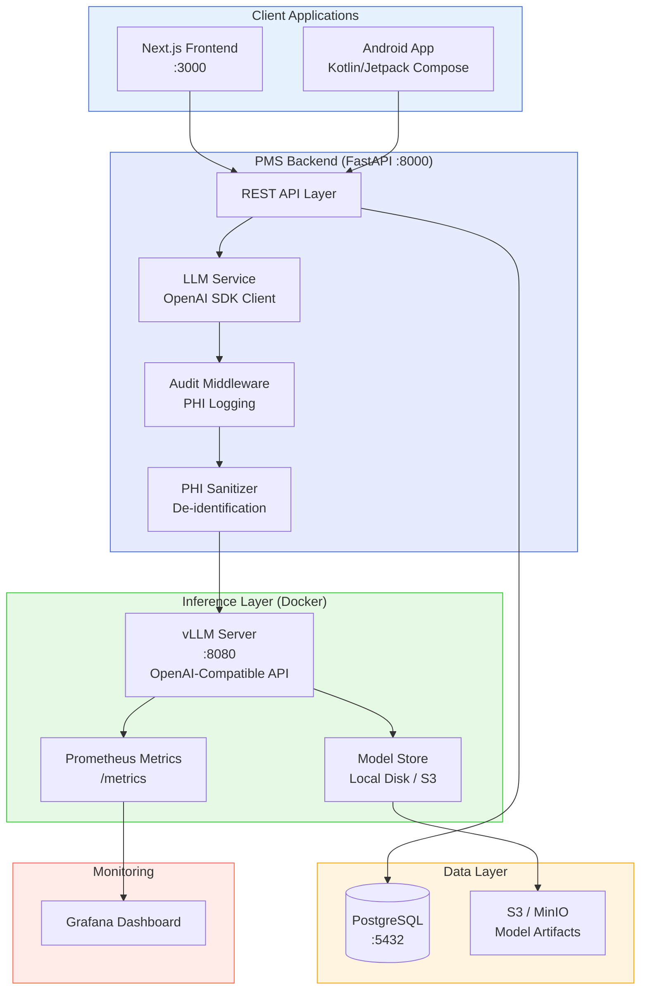

# Product Requirements Document: vLLM Integration into Patient Management System (PMS)

**Document ID:** PRD-PMS-VLLM-001
**Version:** 1.0
**Date:** 2026-03-08
**Author:** Ammar (CEO, MPS Inc.)
**Status:** Draft

---

## 1. Executive Summary

vLLM is a high-throughput, memory-efficient inference and serving engine for large language models (LLMs). Originally developed at UC Berkeley, it has become the most widely adopted open-source LLM serving framework with 66,800+ GitHub stars and backing from NVIDIA, AMD, Intel, and IBM. Its core innovation — PagedAttention — manages GPU memory like a virtual memory system, enabling up to 4x better memory efficiency and dramatically higher concurrent request throughput compared to alternatives.

Integrating vLLM into PMS enables fully self-hosted, HIPAA-compliant AI capabilities across clinical workflows: ambient documentation summarization, ICD-10/CPT code suggestion, patient communication drafting, medication interaction analysis, and prior authorization letter generation. Unlike cloud-based LLM APIs (OpenAI, Anthropic, AWS Bedrock), vLLM keeps all PHI within the organization's infrastructure boundary — no data leaves the network.

The integration positions PMS to serve healthcare-specific open-source models (Meditron, BioMistral, OpenBioLLM) through a standard OpenAI-compatible API, meaning existing and future AI features can switch between vLLM and commercial APIs without code changes. This is the "inference backbone" that all PMS AI features will route through.

## 2. Problem Statement

PMS currently has no self-hosted LLM inference capability. AI features either rely on external cloud APIs (which transmit PHI over the internet, require BAAs with each vendor, and incur per-token costs) or don't exist at all. Specific gaps:

1. **Clinical documentation burden**: Clinicians spend 25+ minutes per encounter documenting SOAP notes, looking up diagnosis codes, and drafting referral letters. Previous experiments (Exp 10: Speechmatics, Exp 21: Voxtral, Exp 51: Amazon Connect Health) addressed speech-to-text but not the downstream NLP tasks of summarization and coding.

2. **No PHI-safe AI inference**: Patient data cannot be sent to external LLM APIs without HIPAA BAAs and careful data handling. A self-hosted inference engine eliminates this risk entirely.

3. **Cost escalation**: Cloud LLM API costs scale linearly with usage. At 100+ encounters/day with multi-turn prompts, monthly API costs can exceed $5,000. A self-hosted GPU server has fixed infrastructure cost regardless of volume.

4. **Latency and availability**: Cloud API calls add 500ms-2s latency and depend on internet connectivity. Self-hosted inference provides sub-100ms time-to-first-token at the network edge.

## 3. Proposed Solution

### 3.1 Architecture Overview

### 3.2 Deployment Model

- **Self-hosted Docker**: vLLM runs as a Docker container (`vllm/vllm-openai`) with NVIDIA GPU passthrough. Deployed alongside the existing PMS Docker Compose stack.
- **Air-gapped capable**: Models pre-downloaded and mounted as local volumes. No internet access required at runtime.
- **TLS encryption**: vLLM supports native `--ssl-certfile`/`--ssl-keyfile` for encrypted transport between PMS backend and vLLM.
- **API key authentication**: `--api-key` flag protects `/v1/*` endpoints with bearer token auth.
- **Network isolation**: vLLM container exposed only on the Docker internal network — never directly accessible from clients. Only the PMS backend (FastAPI) communicates with vLLM.

## 4. PMS Data Sources

| PMS API | How vLLM Uses It | Direction |
|---------|------------------|-----------|
| Patient Records (`/api/patients`) | Patient demographics and history feed context for note generation and communication drafting | PMS → vLLM (read) |
| Encounter Records (`/api/encounters`) | Encounter transcripts and notes are summarized; generated notes are saved back | PMS ↔ vLLM (read/write) |
| Medication & Prescription (`/api/prescriptions`) | Medication lists provide context for interaction checking and prior auth letters | PMS → vLLM (read) |
| Reporting (`/api/reports`) | Aggregated metrics on AI utilization, code suggestion accuracy, and clinician acceptance rates | vLLM metrics → PMS (write) |
| Audit Log (`/api/audit`) | Every LLM inference request logged with user, patient context, prompt hash, and response hash | PMS → PG (write) |

## 5. Component/Module Definitions

### 5.1 LLM Service (`pms-backend/src/pms/services/llm_service.py`)

Central service class wrapping the OpenAI Python SDK pointed at the vLLM server. All PMS modules call this service — never vLLM directly.

- **Input**: Prompt template name, context variables (patient data, encounter notes, etc.)
- **Output**: Structured LLM response (text, JSON, or tool calls)
- **PMS APIs used**: None directly — called by other services

### 5.2 Clinical Note Summarizer

Generates SOAP notes from encounter transcripts or ambient documentation output.

- **Input**: Raw transcript (from Exp 10/21/51), patient context, specialty
- **Output**: Structured SOAP note, key findings list
- **PMS APIs used**: `/api/encounters`, `/api/patients`

### 5.3 Medical Code Suggester

Suggests ICD-10 diagnosis codes and CPT procedure codes from clinical notes.

- **Input**: Clinical note text, specialty context
- **Output**: Ranked list of codes with confidence scores and source traceability
- **PMS APIs used**: `/api/encounters`

### 5.4 Patient Communication Drafter

Generates patient-facing communications (appointment reminders, post-visit instructions, referral letters).

- **Input**: Communication type, patient demographics, encounter summary
- **Output**: Draft text at appropriate reading level (6th grade default)
- **PMS APIs used**: `/api/patients`, `/api/encounters`

### 5.5 Prior Authorization Letter Generator

Generates payer-specific prior authorization letters with clinical justification.

- **Input**: Procedure code, diagnosis codes, patient history, payer requirements
- **Output**: Formatted letter with clinical evidence citations
- **PMS APIs used**: `/api/patients`, `/api/encounters`, `/api/prescriptions`

### 5.6 Medication Interaction Analyzer

Analyzes medication lists for potential interactions and contraindications.

- **Input**: Current medication list, proposed new medication
- **Output**: Interaction risk assessment with severity, evidence, and recommendations
- **PMS APIs used**: `/api/prescriptions`

## 6. Non-Functional Requirements

### 6.1 Security and HIPAA Compliance

| Requirement | Implementation |
|-------------|----------------|
| PHI never leaves infrastructure | vLLM on internal Docker network; no external API calls |
| Encryption in transit | TLS between FastAPI and vLLM (`--ssl-certfile`) |
| Encryption at rest | Model files on encrypted volumes; PostgreSQL TDE |
| Access control | API key auth on vLLM; RBAC in FastAPI middleware |
| Audit logging | Every inference request logged: user, patient context (hashed), prompt template, timestamp |
| PHI minimization | Sanitizer strips unnecessary PHI before sending to vLLM; use codes/IDs over raw data when possible |
| No model training on PHI | Inference-only mode; vLLM does not fine-tune or store training data |
| Monitoring endpoint protection | `/metrics` endpoint behind reverse proxy with auth |

### 6.2 Performance

| Metric | Target | Notes |
|--------|--------|-------|
| Time-to-first-token (TTFT) | < 200ms | For 7B model on single GPU |
| Throughput | > 100 tokens/sec per request | Streaming to client |
| Concurrent users | 10+ simultaneous requests | With continuous batching |
| End-to-end latency | < 5 seconds | For typical 500-token clinical note |
| GPU memory utilization | < 90% | Leave headroom for KV cache growth |
| Availability | 99.5% | Docker restart policy + health checks |

### 6.3 Infrastructure

| Resource | Minimum | Recommended |
|----------|---------|-------------|
| GPU | 1x NVIDIA GPU, 24GB VRAM (RTX 3090/A10G) | 1x A100 80GB or 2x RTX 4090 |
| System RAM | 32 GB | 64 GB |
| Disk | 50 GB (model storage) | 200 GB NVMe SSD |
| Docker | 24.0+ with NVIDIA Container Toolkit | Latest stable |
| Network | Internal Docker network | Isolated VLAN for inference |

## 7. Implementation Phases

### Phase 1: Foundation (2 sprints)
- Deploy vLLM Docker container with Llama 3.1 8B-Instruct
- Create `LLMService` in PMS backend with OpenAI SDK client
- Implement audit logging middleware for all LLM requests
- Add vLLM to Docker Compose with GPU passthrough
- Health check endpoint and Prometheus metrics collection
- Basic TLS and API key configuration

### Phase 2: Core Clinical Features (3 sprints)
- Clinical note summarization (SOAP format)
- ICD-10/CPT code suggestion with confidence scores
- Patient communication drafting
- PHI sanitization pipeline
- Frontend components: note review/accept, code suggestion overlay
- Clinician feedback loop (accept/reject/edit tracking)

### Phase 3: Advanced Features (2 sprints)
- Prior authorization letter generation
- Medication interaction analysis
- Multi-model serving (general + healthcare-specialized models via LoRA)
- Model A/B testing framework
- Performance optimization (speculative decoding, prefix caching)
- Grafana dashboard for inference metrics

## 8. Success Metrics

| Metric | Target | Measurement |
|--------|--------|-------------|
| Documentation time reduction | 50% decrease | Time from encounter end to note completion |
| Coding accuracy | > 90% ICD-10 match with clinician | Accepted vs suggested codes |
| Clinician adoption | > 80% of clinicians using AI assist within 3 months | Usage logs per clinician |
| Cost per inference | < $0.001 per request (amortized) | GPU cost / total requests per month |
| PHI incidents | Zero | Security audit and monitoring |
| System uptime | > 99.5% | Docker health check monitoring |
| Latency P95 | < 3 seconds for note generation | Prometheus histogram |

## 9. Risks and Mitigations

| Risk | Impact | Mitigation |
|------|--------|------------|
| GPU hardware failure | Service outage for AI features | Graceful degradation — PMS functions without AI; alert on GPU health |
| Model hallucination in clinical context | Incorrect medical information | Clinician-in-the-loop review required; confidence thresholds; never auto-submit |
| PHI leakage through model outputs | HIPAA violation | Input sanitization; output filtering; audit logging; no model training on PHI |
| Model size exceeds available VRAM | Cannot load model | Use quantized models (AWQ/GPTQ); reduce max context length; use smaller model |
| vLLM version incompatibility | Deployment issues | Pin Docker image versions; test upgrades in staging |
| Clinician distrust of AI suggestions | Low adoption | Transparent confidence scores; source traceability; gradual rollout |
| Regulatory changes (FDA SaMD) | Compliance requirements | Monitor FDA guidance on clinical decision support; document intended use |

## 10. Dependencies

| Dependency | Version | Purpose |
|------------|---------|---------|
| vLLM | 0.17.x | LLM inference engine |
| NVIDIA Container Toolkit | Latest | GPU passthrough for Docker |
| NVIDIA Driver | 535+ | CUDA support |
| openai (Python SDK) | 1.x | Client library for OpenAI-compatible API |
| Llama 3.1 8B-Instruct | Latest | Primary general-purpose model |
| Meditron-7B or BioMistral-7B | Latest | Healthcare-specialized model (Phase 2) |
| Prometheus | 2.x | Metrics collection |
| Grafana | 10.x | Metrics visualization |

## 11. Comparison with Existing Experiments

| Experiment | Relationship to vLLM |
|------------|---------------------|
| **Exp 10: Speechmatics** (cloud ASR) | **Upstream** — ASR produces transcripts; vLLM summarizes them into clinical notes |
| **Exp 21: Voxtral** (self-hosted ASR) | **Upstream** — Same as Exp 10 but self-hosted; pairs with vLLM for fully air-gapped pipeline |
| **Exp 33: Speechmatics Flow** (voice agents) | **Complementary** — Flow handles conversation; vLLM handles post-conversation NLP |
| **Exp 51: Amazon Connect Health** (cloud contact center) | **Alternative for some features** — Connect Health includes ambient docs + coding, but cloud-only and $99/user/month. vLLM provides self-hosted alternative for the NLP components |
| **Exp 05: OpenClaw** (agentic workflows) | **Complementary** — OpenClaw orchestrates multi-step workflows; vLLM provides the inference backbone |
| **Exp 47: Availity** (eligibility/PA) | **Complementary** — vLLM generates PA clinical justification letters; Availity handles submission |

vLLM is unique in that it is an **infrastructure component** rather than an application feature. It serves as the inference backbone that many other experiments and features can leverage.

## 12. Research Sources

**Official Documentation:**
- [vLLM Documentation](https://docs.vllm.ai/en/stable/) — Engine arguments, deployment guides, API reference
- [vLLM GitHub Repository](https://github.com/vllm-project/vllm) — Source code, 66.8K+ stars, Apache 2.0 license
- [vLLM Blog](https://blog.vllm.ai) — Release notes, architecture deep-dives

**Performance & Benchmarks:**
- [Red Hat: Ollama vs vLLM Deep-Dive Benchmarking](https://developers.redhat.com/articles/2025/08/08/ollama-vs-vllm-deep-dive-performance-benchmarking) — Throughput comparison at various concurrency levels
- [Red Hat: vLLM or llama.cpp](https://developers.redhat.com/articles/2025/09/30/vllm-or-llamacpp-choosing-right-llm-inference-engine-your-use-case) — Use-case decision framework
- [Northflank: vLLM vs TensorRT-LLM](https://northflank.com/blog/vllm-vs-tensorrt-llm-and-how-to-run-them) — TTFT and throughput benchmarks

**Healthcare & HIPAA:**
- [TechMagic: HIPAA Compliance AI Guide](https://www.techmagic.co/blog/hipaa-compliant-llms) — Self-hosted LLM HIPAA architecture patterns
- [SiliconFlow: Best Open Source LLM for Healthcare 2026](https://www.siliconflow.com/articles/en/best-open-source-LLM-for-healthcare) — Healthcare model comparison and benchmarks
- [HuggingFace: Open Medical-LLM Leaderboard](https://huggingface.co/blog/leaderboard-medicalllm) — Medical LLM benchmark rankings

**Deployment & Security:**
- [vLLM Docker Deployment Guide](https://docs.vllm.ai/en/stable/deployment/docker/) — Container setup and GPU passthrough
- [vLLM Security Documentation](https://docs.vllm.ai/en/stable/usage/security/) — TLS, API key, authentication

## 13. Appendix: Related Documents

- [vLLM Setup Guide](52-vLLM-PMS-Developer-Setup-Guide.md)
- [vLLM Developer Tutorial](52-vLLM-Developer-Tutorial.md)
- [Amazon Connect Health PRD](51-PRD-AmazonConnectHealth-PMS-Integration.md)
- [Voxtral Developer Tutorial](21-Voxtral-Developer-Tutorial.md)
