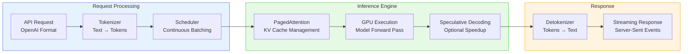
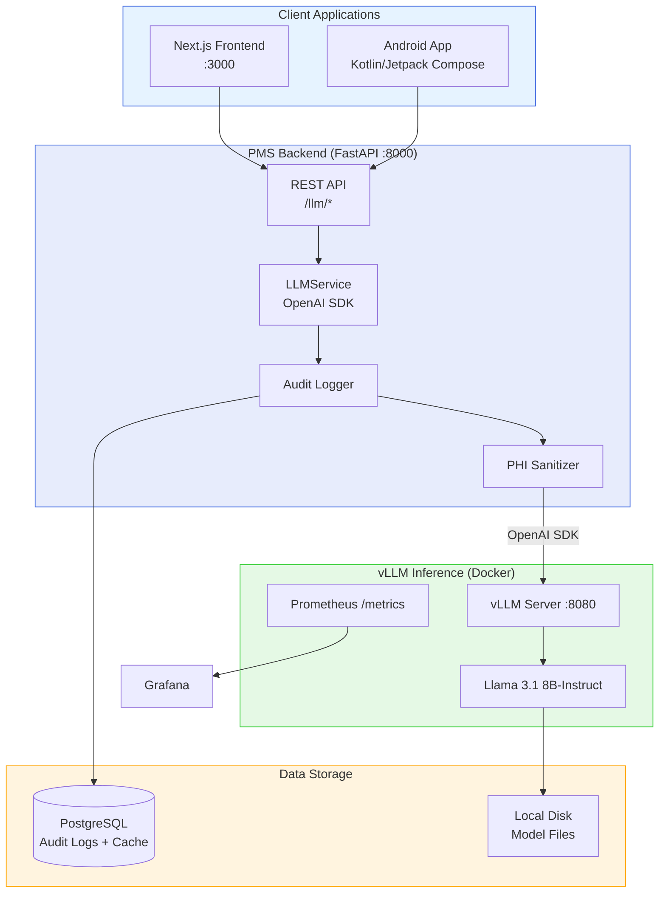

# vLLM Developer Onboarding Tutorial

**Welcome to the MPS PMS vLLM Integration Team**

This tutorial will take you from zero to building your first self-hosted LLM integration with the PMS. By the end, you will understand how vLLM works, have a running local inference server, and have built and tested clinical note generation, medical code suggestion, and patient communication drafting — all running on your own GPU with no data leaving your network.

**Document ID:** PMS-EXP-VLLM-002
**Version:** 1.1
**Date:** 2026-03-09
**Applies To:** PMS project (all platforms)
**Prerequisite:** [vLLM Setup Guide](52-vLLM-PMS-Developer-Setup-Guide.md)
**Estimated time:** 2-3 hours
**Difficulty:** Beginner-friendly

---

## What You Will Learn

1. What vLLM is and why self-hosted LLM inference matters for healthcare
2. How PagedAttention and continuous batching deliver high throughput
3. How the OpenAI-compatible API enables drop-in integration
4. How to generate SOAP clinical notes from encounter transcripts
5. How to suggest ICD-10 and CPT codes with confidence scores
6. How to draft patient communications at appropriate reading levels
7. How to check medication interactions using LLM reasoning
8. How to monitor inference performance with Prometheus metrics
9. How HIPAA compliance is maintained with self-hosted inference
10. How vLLM compares to cloud APIs, Ollama, and other inference engines

---

## Part 1: Understanding vLLM (15 min read)

### 1.1 What Problem Does vLLM Solve?

Consider Dr. Patel's afternoon at Texas Retina Associates:

**After each encounter**, she spends 25 minutes documenting — typing SOAP notes, looking up ICD-10 codes (H35.3211 for wet AMD right eye), selecting CPT codes (67028 for intravitreal injection), and dictating referral letters. She sees 25 patients per day. That's over 10 hours per day on documentation — more than the encounters themselves.

**AI can help**, but there's a problem: sending patient conversations and medical records to OpenAI or Anthropic means PHI transits over the internet. Even with a BAA, the compliance team is uncomfortable. And at $0.01-0.03 per 1K tokens, costs add up to $5,000+/month at scale.

**vLLM solves this** by running LLM inference entirely on your own GPU. No data leaves the building. Fixed infrastructure cost regardless of volume. Sub-100ms time-to-first-token. And because it exposes an OpenAI-compatible API, switching between vLLM and cloud APIs requires changing one URL — not rewriting your application.

### 1.2 How vLLM Works — The Key Pieces



**PagedAttention** (the core innovation): Traditional LLM serving pre-allocates a fixed block of GPU memory for each request's KV cache (the model's "working memory"). This wastes 60-80% of GPU memory on padding. PagedAttention borrows the idea of virtual memory from operating systems — it splits the KV cache into small pages allocated on demand. Result: up to 4x better memory utilization, which means 4x more concurrent requests on the same GPU.

**FlashAttention 4** (new in v0.17): vLLM now integrates the next-generation FlashAttention 4 backend, delivering significant attention computation speedups on modern NVIDIA GPUs. Combined with PagedAttention, this gives the best possible memory efficiency and throughput.

**Continuous Batching**: Instead of waiting to form a batch of N requests, vLLM dynamically adds and removes requests from the batch at every decoding step. If one request finishes, its slot is immediately given to a waiting request. This keeps the GPU at near-100% utilization.

**Performance Modes** (new in v0.17): The `--performance-mode` flag provides pre-tuned configurations:
- `interactivity` — Low latency, fast time-to-first-token (ideal for clinical workflows)
- `throughput` — Maximum tokens/sec (ideal for batch processing)
- `balanced` — Default, balances both

**OpenAI-Compatible API**: vLLM serves the exact same `/v1/chat/completions`, `/v1/completions`, and `/v1/embeddings` endpoints as the OpenAI API. Any code using the OpenAI Python SDK works with vLLM by changing one line: `base_url="http://localhost:8080/v1"`. v0.17 also adds Anthropic API compatibility (thinking blocks, `count_tokens`) and a Responses API with structured outputs.

### 1.3 How vLLM Fits with Other PMS Technologies

| Experiment | What It Does | Relationship to vLLM |
|-----------|-------------|---------------------|
| Exp 10: Speechmatics | Cloud ASR (speech-to-text) | **Upstream** — ASR produces transcripts; vLLM summarizes them |
| Exp 21: Voxtral | Self-hosted ASR (GPU) | **Upstream** — Self-hosted ASR → self-hosted NLP = fully air-gapped |
| Exp 30: ElevenLabs | TTS + voice agents | **Complementary** — vLLM generates text; ElevenLabs speaks it |
| Exp 33: Speechmatics Flow | Conversational voice agents | **Complementary** — Flow handles dialogue; vLLM handles clinical NLP |
| Exp 47: Availity | Eligibility/prior auth | **Complementary** — vLLM generates PA letters; Availity submits them |
| Exp 51: Connect Health | Cloud contact center + AI | **Alternative** — Connect Health is managed; vLLM is self-hosted |

### 1.4 Key Vocabulary

| Term | Meaning |
|------|---------|
| **Inference** | Running a trained model to generate predictions (text) — not training |
| **PagedAttention** | vLLM's memory management system that allocates KV cache in pages instead of contiguous blocks |
| **KV Cache** | Key-Value cache storing intermediate attention states; grows with sequence length |
| **Continuous Batching** | Dynamic scheduling that adds/removes requests from GPU batches at every step |
| **TTFT** | Time to First Token — latency from request received to first token generated |
| **Throughput** | Tokens per second generated across all concurrent requests |
| **Quantization** | Reducing model precision (FP16 → INT8/INT4) to use less memory at slight accuracy cost |
| **Tensor Parallelism** | Splitting model weights across multiple GPUs for larger models |
| **LoRA** | Low-Rank Adaptation — efficient fine-tuning method; vLLM can serve multiple LoRA adapters from one base model |
| **Speculative Decoding** | Using a smaller "draft" model to predict tokens, verified by the main model for speedup. v0.17 supports Eagle3 with CUDA graphs |
| **GGUF** | Model format used by llama.cpp; vLLM supports it but prefers HuggingFace format |
| **Structured Output** | Constraining LLM generation to valid JSON schema |
| **Performance Mode** | v0.17 pre-tuned profiles (`interactivity`, `throughput`, `balanced`) that set multiple engine parameters at once |
| **FlashAttention 4** | Next-generation attention computation backend, integrated in v0.17 |
| **Weight Offloading** | Moving model layers to CPU when GPU VRAM is insufficient; v0.17 V2 adds prefetching to hide latency |
| **Elastic Expert Parallelism** | Dynamic GPU scaling for Mixture-of-Experts models (new in v0.17) |
| **QLoRA** | Quantized LoRA adapters; v0.17 enables loading quantized adapters directly without full-precision conversion |
| **GDN** | Gated Delta Networks — architecture used by Qwen3.5 (newly supported in v0.17) |

### 1.5 Our Architecture



**Key principle**: Clients never talk to vLLM directly. All requests flow through the PMS backend, which handles authentication, audit logging, PHI sanitization, and result caching.

---

## Part 2: Environment Verification (15 min)

### 2.1 Checklist

```bash
# 1. NVIDIA GPU available
nvidia-smi --query-gpu=name,memory.total --format=csv,noheader
# Expected: GPU name and VRAM (e.g., "NVIDIA GeForce RTX 3090, 24576 MiB")

# 2. Docker with GPU support
docker run --rm --gpus all nvidia/cuda:12.4.0-base-ubuntu22.04 nvidia-smi
# Expected: nvidia-smi output inside container

# 3. vLLM server running
curl -s http://localhost:8080/health
# Expected: 200 OK (empty body)

# 4. Model loaded
curl -s http://localhost:8080/v1/models \
  -H "Authorization: Bearer $VLLM_API_KEY" | jq '.data[].id'
# Expected: "meta-llama/Llama-3.1-8B-Instruct"

# 5. PMS backend running
curl -s http://localhost:8000/health | jq .status
# Expected: "ok"

# 6. PMS frontend running
curl -s http://localhost:3000 -o /dev/null -w "%{http_code}"
# Expected: 200
```

### 2.2 Quick Test

```bash
# End-to-end test: PMS backend → vLLM → response
curl -s -X POST http://localhost:8000/llm/chat \
  -H "Content-Type: application/json" \
  -d '{"messages": [{"role": "user", "content": "What is ICD-10 code E11.9?"}]}' | jq .response
# Expected: Response explaining E11.9 is Type 2 diabetes mellitus without complications
```

If this returns a response, your full pipeline is working.

---

## Part 3: Build Your First Integration (45 min)

### 3.1 What We Are Building

We'll build a complete **ophthalmology encounter documentation pipeline**:

1. Take an encounter transcript (simulating what ASR from Exp 10/21 would produce)
2. Generate a structured SOAP clinical note using vLLM
3. Suggest ICD-10 diagnosis codes from the note
4. Suggest CPT procedure codes from the note
5. Draft a patient follow-up letter

### 3.2 Create the Test Transcript

```python
# scripts/test_vllm_pipeline.py
"""End-to-end vLLM clinical documentation pipeline."""
import httpx
import json
import time

PMS_URL = "http://localhost:8000"

ENCOUNTER_TRANSCRIPT = """
Dr. Patel: Good morning, Maria. How have your eyes been since your last injection?

Maria Garcia: Good morning, doctor. My right eye has been a little blurry this week,
especially when reading. The left eye seems fine.

Dr. Patel: Let me take a look. I'm going to do an OCT scan of both eyes today.
The OCT shows some subretinal fluid in the right eye. The left eye looks stable.
Your visual acuity today is 20/40 in the right eye and 20/25 in the left.

Maria Garcia: Is that worse than last time?

Dr. Patel: The right eye was 20/30 last visit, so yes, slightly decreased.
Given the fluid and the decreased vision, I'd recommend we do another
Eylea injection in the right eye today. We'll keep the left eye on monitoring.

Maria Garcia: Okay, let's do it.

Dr. Patel: I'll numb the eye first with topical anesthesia, then prep with
betadine, and administer the 2mg Eylea injection. You'll feel some pressure
but it shouldn't be painful. All done. The injection went smoothly.
I'd like to see you back in 4 weeks for another OCT.

Maria Garcia: Thank you, doctor.
"""


def run_pipeline():
    print("=" * 60)
    print("vLLM CLINICAL DOCUMENTATION PIPELINE")
    print("=" * 60)

    with httpx.Client(base_url=PMS_URL, timeout=120) as client:
        # Step 1: Generate SOAP note
        print("\n[1] Generating SOAP note from transcript...")
        t0 = time.time()
        resp = client.post("/llm/summarize", json={
            "transcript": ENCOUNTER_TRANSCRIPT,
            "specialty": "ophthalmology",
            "template": "SOAP",
        })
        note = resp.json()["note"]
        t1 = time.time()
        print(f"    Generated in {t1 - t0:.1f}s")
        print(f"\n{'─' * 60}")
        print("GENERATED SOAP NOTE")
        print(f"{'─' * 60}")
        print(note)

        # Step 2: Suggest ICD-10 codes
        print(f"\n[2] Suggesting ICD-10 codes...")
        t0 = time.time()
        resp = client.post("/llm/suggest-codes", json={
            "clinical_note": note,
            "code_type": "icd10",
        })
        icd10_raw = resp.json()["codes"]
        t1 = time.time()
        print(f"    Generated in {t1 - t0:.1f}s")
        print(f"\n{'─' * 60}")
        print("ICD-10 SUGGESTIONS")
        print(f"{'─' * 60}")
        try:
            codes = json.loads(icd10_raw) if isinstance(icd10_raw, str) else icd10_raw
            if isinstance(codes, dict):
                codes = codes.get("codes", codes.get("suggestions", [codes]))
            for code in codes:
                conf = code.get("confidence", 0) * 100
                print(f"  [{conf:.0f}%] {code['code']} — {code['description']}")
        except (json.JSONDecodeError, TypeError):
            print(f"  Raw response: {icd10_raw}")

        # Step 3: Suggest CPT codes
        print(f"\n[3] Suggesting CPT codes...")
        t0 = time.time()
        resp = client.post("/llm/suggest-codes", json={
            "clinical_note": note,
            "code_type": "cpt",
        })
        cpt_raw = resp.json()["codes"]
        t1 = time.time()
        print(f"    Generated in {t1 - t0:.1f}s")
        print(f"\n{'─' * 60}")
        print("CPT SUGGESTIONS")
        print(f"{'─' * 60}")
        try:
            codes = json.loads(cpt_raw) if isinstance(cpt_raw, str) else cpt_raw
            if isinstance(codes, dict):
                codes = codes.get("codes", codes.get("suggestions", [codes]))
            for code in codes:
                conf = code.get("confidence", 0) * 100
                print(f"  [{conf:.0f}%] {code['code']} — {code['description']}")
        except (json.JSONDecodeError, TypeError):
            print(f"  Raw response: {cpt_raw}")

        # Step 4: Draft follow-up letter
        print(f"\n[4] Drafting patient follow-up letter...")
        t0 = time.time()
        resp = client.post("/llm/draft-letter", json={
            "letter_type": "post-visit follow-up",
            "patient_name": "Maria Garcia",
            "context": (
                "Patient received intravitreal Eylea injection in right eye for wet AMD. "
                "Follow-up in 4 weeks for OCT. Continue current medications. "
                "Call if vision changes, pain, or flashing lights."
            ),
        })
        letter = resp.json()["letter"]
        t1 = time.time()
        print(f"    Generated in {t1 - t0:.1f}s")
        print(f"\n{'─' * 60}")
        print("PATIENT FOLLOW-UP LETTER")
        print(f"{'─' * 60}")
        print(letter)

    print(f"\n{'═' * 60}")
    print("PIPELINE COMPLETE")
    print(f"{'═' * 60}")


if __name__ == "__main__":
    run_pipeline()
```

### 3.3 Run the Pipeline

```bash
pip install httpx  # if not already installed
python scripts/test_vllm_pipeline.py
```

Expected output: A complete SOAP note, ICD-10 codes (H35.3211, E11.9, I10), CPT codes (67028, 92134, 92014), and a patient-friendly follow-up letter — all generated locally on your GPU.

### 3.4 Test Medication Interaction Checking

```python
# scripts/test_vllm_interactions.py
"""Test medication interaction checking with vLLM."""
import httpx

PMS_URL = "http://localhost:8000"


def check_interactions():
    print("=" * 60)
    print("MEDICATION INTERACTION CHECK")
    print("=" * 60)

    with httpx.Client(base_url=PMS_URL, timeout=120) as client:
        resp = client.post("/llm/check-interactions", json={
            "medications": [
                "Eylea (aflibercept) 2mg intravitreal every 8 weeks",
                "Metformin 1000mg twice daily",
                "Lisinopril 10mg once daily",
            ],
            "proposed_medication": "Warfarin 5mg daily",
        })
        result = resp.json()["result"]

    print(f"\nCurrent medications:")
    print(f"  - Eylea (aflibercept) 2mg intravitreal q8w")
    print(f"  - Metformin 1000mg BID")
    print(f"  - Lisinopril 10mg QD")
    print(f"\nProposed: Warfarin 5mg daily")
    print(f"\n{'─' * 60}")
    print("INTERACTION ANALYSIS")
    print(f"{'─' * 60}")
    print(result)


if __name__ == "__main__":
    check_interactions()
```

```bash
python scripts/test_vllm_interactions.py
```

### 3.5 Review the Complete Workflow

At this point you've built and tested:

1. **SOAP note generation** — Transcript → structured clinical note
2. **ICD-10 code suggestion** — Clinical note → diagnosis codes with confidence
3. **CPT code suggestion** — Clinical note → procedure codes with confidence
4. **Patient communication** — Context → plain-language follow-up letter
5. **Medication interactions** — Drug list → interaction analysis

All running on local GPU, no data leaving the network, using the same OpenAI SDK that works with cloud APIs.

---

## Part 4: Evaluating Strengths and Weaknesses (15 min)

### 4.1 Strengths

- **No PHI leaves the network**: All inference runs locally — the strongest HIPAA posture possible
- **OpenAI API compatibility**: Drop-in replacement for cloud APIs; switch with one URL change. v0.17 also adds Anthropic API and Responses API support
- **Highest throughput at scale**: 14-24x faster than HuggingFace Transformers, 19x faster than Ollama under concurrency. v0.17 adds FlashAttention 4 and pooling optimizations (13.9% throughput improvement)
- **PagedAttention memory efficiency**: Serves 4x more concurrent users per GPU than naive approaches
- **Performance modes**: New `--performance-mode` flag (v0.17) simplifies tuning — no more manual tweaking of dozens of parameters
- **Extensive model support**: Llama, Mistral, Qwen (including Qwen3.5 with GDN), DeepSeek, healthcare models (Meditron, BioMistral, OpenBioLLM), plus native ASR models (FunASR, Qwen3-ASR) in v0.17
- **Quantized LoRA adapters**: v0.17 natively loads QLoRA adapters — serve multiple healthcare-specialized adaptations from a single base model without full-precision overhead
- **Weight Offloading V2**: Serve 70B models on consumer GPUs by offloading weights to CPU with intelligent prefetching
- **Production-ready**: Used by Amazon, IBM, Red Hat, and thousands of companies in production
- **Apache 2.0 license**: No restrictions on commercial or healthcare use
- **Built-in monitoring**: Prometheus metrics (including new MFU counters in v0.17), OpenTelemetry tracing, no extra setup
- **Multi-GPU scaling**: Tensor parallelism for 70B+ models across GPUs; v0.17 adds Elastic Expert Parallelism for dynamic MoE scaling

### 4.2 Weaknesses

- **Requires GPU**: Minimum 24 GB VRAM for production-quality 7B models (CPU mode is very slow). Weight Offloading V2 (v0.17) partially mitigates this but adds latency
- **Setup complexity**: More complex than Ollama (`docker run` with GPU flags, model download, API key config) — though `--performance-mode` simplifies tuning significantly
- **Model quality gap**: Open-source 7-8B models are less capable than GPT-4 or Claude for complex medical reasoning — though healthcare-tuned models and newer architectures like Qwen3.5 close the gap
- **No built-in RBAC**: Authentication is limited to a single API key; fine-grained access control must be implemented in the application layer
- **Memory management**: Long context windows can cause OOM; requires careful `max-model-len` and `gpu-memory-utilization` tuning
- **No built-in audit logging**: vLLM logs requests at INFO level but doesn't provide HIPAA-grade audit trails — must be implemented in FastAPI middleware
- **Breaking changes between versions**: v0.17 introduces PyTorch 2.10 requirement, changes KV Load Failure Policy default to "fail", and removes per-request logits processors. Always test upgrades in staging
- **CUDA 12.9+ compatibility**: Known CUBLAS_STATUS_INVALID_VALUE issue on CUDA 12.9+ requires workarounds

### 4.3 When to Use vLLM vs Alternatives

| Scenario | Best Choice | Why |
|----------|-------------|-----|
| Production multi-user clinical AI | **vLLM** | Best throughput under concurrency; FlashAttention 4 in v0.17 |
| Developer laptop prototyping | **Ollama** | Simplest setup, no GPU config needed |
| Edge device / offline | **llama.cpp** | Runs on CPU, minimal dependencies |
| Maximum NVIDIA performance | **TensorRT-LLM** | Compiled kernels, lowest latency |
| Best model quality needed | **Cloud API** (OpenAI/Anthropic) | GPT-4/Claude still lead on complex reasoning |
| Quick evaluation of models | **Ollama** | `ollama run model` — one command |
| Air-gapped production | **vLLM** | Docker + local models, proven at scale |
| Budget-constrained | **llama.cpp** or **Ollama** | No GPU required |
| Combined ASR + NLP pipeline | **vLLM** | v0.17 native ASR model support (FunASR, Qwen3-ASR) |
| Large models on limited VRAM | **vLLM** | v0.17 Weight Offloading V2 with prefetching |

### 4.4 HIPAA / Healthcare Considerations

- **Data residency**: vLLM runs entirely on your infrastructure. No PHI crosses network boundaries. This is the gold standard for HIPAA compliance.
- **Encryption in transit**: Enable TLS with `--ssl-certfile` / `--ssl-keyfile`. Required in production.
- **Access control**: Use `--api-key` for basic auth. Implement RBAC in the PMS FastAPI layer (who can trigger which AI features).
- **Audit logging**: Log every inference request in PostgreSQL: user ID, patient context (hashed), prompt template used, timestamp. Never log raw PHI in application logs.
- **PHI minimization**: The PHI Sanitizer should strip unnecessary identifying information before sending to vLLM. Use patient IDs and codes rather than full names and addresses when possible.
- **Model provenance**: Document which model version is deployed. Healthcare AI audits require knowing exactly what model generated a clinical recommendation.
- **No training on PHI**: vLLM is inference-only. It does not fine-tune or retain data between requests. Confirm this in your compliance documentation.
- **FDA considerations**: If AI suggestions influence clinical decisions, they may fall under FDA Software as a Medical Device (SaMD) guidance. Current PMS design keeps clinician-in-the-loop with required review before acceptance.

---

## Part 5: Debugging Common Issues (15 min read)

### Issue 1: vLLM returns gibberish or repetitive text

**Symptom:** Generated notes contain repeated phrases or nonsensical text.

**Cause:** Temperature too high, or model not following instruction format correctly.

**Fix:**
```python
# Lower temperature for clinical tasks (more deterministic)
temperature=0.3  # Instead of default 0.7-1.0

# Ensure system prompt is clear and specific
# Bad: "Write a note"
# Good: "You are a medical scribe specializing in ophthalmology..."
```

### Issue 2: JSON output from code suggestion is malformed

**Symptom:** `json.JSONDecodeError` when parsing code suggestions.

**Cause:** Model generates text around the JSON (e.g., "Here are the codes: [...]").

**Fix:** Use structured output mode:
```python
response_format={"type": "json_object"}
```
And explicitly instruct: "Return ONLY a valid JSON array, no other text."

### Issue 3: Very long generation times (>30 seconds)

**Symptom:** Simple requests take 30+ seconds.

**Cause:** GPU is saturated with concurrent requests, or context length is too long.

**Fix:**
```bash
# Check GPU utilization
nvidia-smi

# If GPU memory is at 100%, reduce max context or concurrent requests
--max-model-len 4096  # Instead of 8192
--gpu-memory-utilization 0.85

# Monitor request queue
curl -s http://localhost:8080/metrics | grep vllm_num_requests
```

### Issue 4: Model doesn't know medical terminology

**Symptom:** General-purpose model gives vague or incorrect medical information.

**Cause:** Llama 3.1 8B is a generalist; it may lack depth in ophthalmology-specific terminology.

**Fix:** Use a healthcare-specialized model:
```bash
# Meditron-7B (medical-domain trained)
--model epfl-llm/meditron-7b

# BioMistral-7B (biomedical pretraining)
--model BioMistral/BioMistral-7B
```
Or implement retrieval-augmented generation (RAG) with ophthalmology guidelines.

### Issue 5: Docker container exits with "Killed"

**Symptom:** Container starts but gets killed during model loading.

**Cause:** System OOM killer — not enough system RAM for model loading (separate from GPU VRAM).

**Fix:** Ensure at least 32 GB system RAM. Check with:
```bash
free -h
# If RAM is limited, use --cpu-memory-pool-size to limit CPU memory usage
```

### Issue 6: CUBLAS_STATUS_INVALID_VALUE on CUDA 12.9+ (v0.17)

**Symptom:** CUBLAS errors when running vLLM 0.17 on systems with CUDA 12.9 or newer.

**Cause:** Known PyTorch 2.10 / CUDA 12.9+ compatibility issue.

**Fix:**
```bash
# Remove system CUDA paths from LD_LIBRARY_PATH
unset LD_LIBRARY_PATH
# Or install with auto torch backend detection
pip install vllm --torch-backend=auto
```

### Issue 7: KV cache failures after upgrading to v0.17

**Symptom:** Requests that previously worked now fail with KV cache load errors.

**Cause:** vLLM 0.17 changed the default `kv-load-failure-policy` from `"recompute"` to `"fail"`.

**Fix:**
```bash
# Restore previous behavior
--kv-load-failure-policy recompute
```

---

## Part 6: Practice Exercises (45 min)

### Option A: Build a Referral Letter Generator

Build an endpoint that generates specialist referral letters from encounter data.

**Hints:**
1. Create a new prompt template for referral letters (include referring provider, specialty, clinical indication)
2. Add a `/llm/referral-letter` endpoint
3. Populate context from `/api/patients/{id}` and `/api/encounters/{id}`
4. Target reading level: professional medical (for the receiving physician)
5. Include relevant ICD-10 codes and recent test results

### Option B: Implement Prompt Caching and Cost Tracking

Build a system that caches LLM responses and tracks inference costs.

**Hints:**
1. Hash the prompt + model + temperature as a cache key
2. Store responses in PostgreSQL with TTL (e.g., 24 hours)
3. Track tokens used per request (from vLLM response headers)
4. Calculate amortized cost: GPU hourly rate / total tokens served
5. Build a `/llm/stats` endpoint showing hit rate, total tokens, cost per request

### Option C: Build an A/B Testing Framework

Compare two models (e.g., Llama 3.1 8B vs Qwen3.5 with GDN) on clinical tasks.

**Hints:**
1. Serve both models (vLLM supports `--served-model-name` for aliasing)
2. Randomly route 50% of requests to each model
3. Store both outputs and the clinician's choice (accepted/rejected)
4. Calculate acceptance rate, edit distance, and code agreement per model
5. Dashboard showing which model performs better per task type

### Option D: Explore Native ASR + NLP Pipeline (v0.17)

Build a unified speech-to-text + clinical note pipeline using vLLM's native ASR support.

**Hints:**
1. Serve a Qwen3-ASR model alongside Llama 3.1 on the same vLLM instance
2. Pipe audio input through vLLM ASR → get transcript → pipe to Llama for SOAP note generation
3. Compare latency vs the separate ASR (Exp 10/21) + NLP pipeline
4. Measure GPU memory impact of serving both models simultaneously
5. This consolidates the inference stack — one engine for all AI tasks

---

## Part 7: Development Workflow and Conventions

### 7.1 File Organization

```
pms-backend/
├── src/pms/
│   ├── services/
│   │   └── llm_service.py          # LLM inference service (OpenAI SDK client)
│   ├── routers/
│   │   └── llm.py                  # FastAPI endpoints (/llm/*)
│   └── config.py                   # VLLM_BASE_URL, VLLM_API_KEY, etc.
├── docker-compose.yml              # vLLM service definition
└── .env                            # VLLM_* environment variables

pms-frontend/
├── src/components/
│   └── llm/
│       ├── NoteGenerator.tsx       # SOAP note generation UI
│       ├── CodeSuggestions.tsx      # ICD-10/CPT suggestion UI
│       └── PatientLetterDraft.tsx   # Communication drafting UI

scripts/
├── test_vllm_pipeline.py           # End-to-end pipeline test
└── test_vllm_interactions.py       # Medication interaction test
```

### 7.2 Naming Conventions

| Item | Convention | Example |
|------|-----------|---------|
| Service class | `LLMService` | `LLMService()` |
| API endpoint | `/llm/{action}` | `/llm/summarize` |
| Config variable | `VLLM_{KEY}` | `VLLM_BASE_URL` |
| React component | `{Feature}.tsx` | `NoteGenerator.tsx` |
| Prompt template | Method on `LLMService` | `summarize_note()` |
| Docker service | `vllm` | `docker compose up vllm` |

### 7.3 PR Checklist

- [ ] No PHI in prompts or logs (use IDs and codes, not raw patient data)
- [ ] All LLM requests go through `LLMService` (never call vLLM directly from routers)
- [ ] Audit log entry for every inference request
- [ ] Temperature set appropriately (0.1-0.3 for clinical tasks, 0.5-0.7 for drafting)
- [ ] Error handling for vLLM timeouts and connection failures
- [ ] Frontend shows loading state during inference
- [ ] Frontend requires clinician review before accepting AI output
- [ ] Confidence thresholds applied (don't show low-confidence suggestions)
- [ ] New prompt templates tested with at least 5 diverse inputs
- [ ] GPU memory impact assessed (new features shouldn't cause OOM)

### 7.4 Security Reminders

- **Never log PHI**: Log request metadata (user, template, timestamp) but never the prompt content or response content
- **Sanitize before inference**: Strip unnecessary PHI from prompts — use patient IDs not SSNs, diagnosis codes not narrative history where possible
- **Clinician-in-the-loop**: Every AI output must be reviewed by a licensed clinician before it enters the medical record
- **Model versioning**: Document which model version generated each output (store in audit log)
- **Network isolation**: vLLM should only be accessible from the PMS backend Docker network — never exposed to the internet or client applications
- **API key rotation**: Rotate `VLLM_API_KEY` quarterly; store in secrets manager in production
- **No fine-tuning on PHI**: If you fine-tune models, use de-identified synthetic data only

---

## Part 8: Quick Reference Card

### Key Commands

```bash
# Start vLLM
docker start vllm-server

# Stop vLLM
docker stop vllm-server

# View logs
docker logs -f vllm-server --tail 50

# GPU status
nvidia-smi

# Test inference
curl -s -X POST http://localhost:8080/v1/chat/completions \
  -H "Authorization: Bearer $VLLM_API_KEY" \
  -H "Content-Type: application/json" \
  -d '{"model":"meta-llama/Llama-3.1-8B-Instruct","messages":[{"role":"user","content":"hello"}],"max_tokens":50}' | jq '.choices[0].message.content'

# Test PMS pipeline
curl -s -X POST http://localhost:8000/llm/summarize \
  -H "Content-Type: application/json" \
  -d '{"transcript":"Patient has blurry vision OD","specialty":"ophthalmology"}' | jq .note

# Prometheus metrics
curl -s http://localhost:8080/metrics | grep vllm_request
```

### Key Files

| File | Purpose |
|------|---------|
| `src/pms/services/llm_service.py` | LLM inference service (core) |
| `src/pms/routers/llm.py` | FastAPI endpoints |
| `src/pms/config.py` | VLLM_* settings |
| `docker-compose.yml` | vLLM Docker service |
| `.env` | API key and model config |
| `NoteGenerator.tsx` | SOAP note generation UI |
| `CodeSuggestions.tsx` | Code suggestion UI |

### Key URLs

| Resource | URL |
|----------|-----|
| vLLM server | http://localhost:8080 |
| vLLM models | http://localhost:8080/v1/models |
| vLLM metrics | http://localhost:8080/metrics |
| PMS LLM endpoints | http://localhost:8000/llm/* |
| vLLM docs | https://docs.vllm.ai/en/stable/ |
| vLLM GitHub | https://github.com/vllm-project/vllm |
| Supported models | https://docs.vllm.ai/en/latest/models/supported_models/ |

### Starter Template

```python
from openai import AsyncOpenAI

client = AsyncOpenAI(
    base_url="http://localhost:8080/v1",
    api_key="your-key",
)

response = await client.chat.completions.create(
    model="meta-llama/Llama-3.1-8B-Instruct",
    messages=[
        {"role": "system", "content": "You are a medical scribe for ophthalmology."},
        {"role": "user", "content": "Summarize: Patient has wet AMD OD, VA 20/40, Eylea injection performed."},
    ],
    max_tokens=500,
    temperature=0.3,
)
print(response.choices[0].message.content)
```

---

## Next Steps

1. Review the [vLLM PRD](52-PRD-vLLM-PMS-Integration.md) for full component definitions and implementation phases
2. Evaluate Qwen3.5 (GDN architecture, newly supported in v0.17) as an alternative to Llama 3.1 for clinical tasks
3. Evaluate healthcare-specialized models: [Meditron](https://huggingface.co/epfl-llm/meditron-7b), [BioMistral](https://huggingface.co/BioMistral/BioMistral-7B), [OpenBioLLM](https://huggingface.co/aaditya/OpenBioLLM-Llama3-70B)
4. Test quantized LoRA adapters (QLoRA) for serving healthcare-tuned adaptations from a single base model
5. Explore v0.17 native ASR model support (FunASR, Qwen3-ASR) to consolidate speech-to-text and NLP inference
6. Implement PHI sanitization middleware in the FastAPI layer
7. Set up Grafana dashboard with vLLM Prometheus metrics (including new MFU counters)
8. Build the clinician feedback loop (accept/reject/edit tracking) for continuous quality improvement
