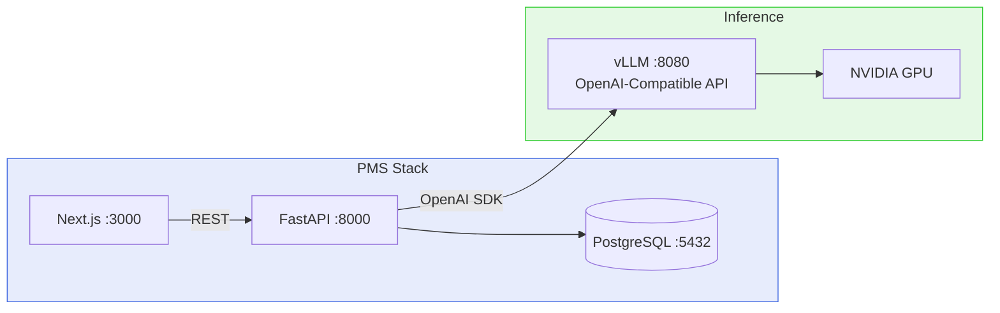

# vLLM Setup Guide for PMS Integration

**Document ID:** PMS-EXP-VLLM-001
**Version:** 1.1
**Date:** 2026-03-09
**Applies To:** PMS project (all platforms)
**Prerequisites Level:** Intermediate

---

## Table of Contents

1. [Overview](#1-overview)
2. [Prerequisites](#2-prerequisites)
3. [Part A: Install and Configure vLLM](#3-part-a-install-and-configure-vllm)
4. [Part B: Integrate with PMS Backend](#4-part-b-integrate-with-pms-backend)
5. [Part C: Integrate with PMS Frontend](#5-part-c-integrate-with-pms-frontend)
6. [Part D: Testing and Verification](#6-part-d-testing-and-verification)
7. [Troubleshooting](#7-troubleshooting)
8. [Reference Commands](#8-reference-commands)

---

## 1. Overview

This guide walks you through deploying vLLM as a self-hosted LLM inference engine for PMS. By the end, you will have:

- A vLLM server running in Docker with GPU acceleration
- An OpenAI-compatible API serving a healthcare-suitable model
- PMS backend connected to vLLM via the OpenAI Python SDK
- Frontend components for clinician interaction with AI-generated content
- Prometheus metrics collection for monitoring



---

## 2. Prerequisites

### 2.1 Required Software

| Software | Minimum Version | Check Command |
|----------|----------------|---------------|
| Docker | 24.0 | `docker --version` |
| NVIDIA Driver | 535 | `nvidia-smi` |
| NVIDIA Container Toolkit | Latest | `nvidia-ctk --version` |
| Python | 3.11 | `python3 --version` |
| Node.js | 18 | `node --version` |
| Git | 2.x | `git --version` |

### 2.2 GPU Verification

```bash
# Verify NVIDIA GPU is detected
nvidia-smi
# Expected: GPU name, driver version, CUDA version
# Minimum: 24 GB VRAM (RTX 3090, A10G, A100, RTX 4090)

# Verify NVIDIA Container Toolkit
docker run --rm --gpus all nvidia/cuda:12.4.0-base-ubuntu22.04 nvidia-smi
# Expected: Same output as above, running inside Docker
```

If `nvidia-smi` fails, install the NVIDIA driver:
```bash
# Ubuntu/Debian
sudo apt-get update && sudo apt-get install -y nvidia-driver-535

# macOS: NVIDIA GPUs are not supported on macOS. Use a Linux server or cloud GPU instance.
```

If the Docker GPU test fails, install NVIDIA Container Toolkit:
```bash
# Ubuntu/Debian
curl -fsSL https://nvidia.github.io/libnvidia-container/gpgkey | sudo gpg --dearmor -o /usr/share/keyrings/nvidia-container-toolkit-keyring.gpg
curl -s -L https://nvidia.github.io/libnvidia-container/stable/deb/nvidia-container-toolkit.list | \
  sed 's#deb https://#deb [signed-by=/usr/share/keyrings/nvidia-container-toolkit-keyring.gpg] https://#g' | \
  sudo tee /etc/apt/sources.list.d/nvidia-container-toolkit.list
sudo apt-get update && sudo apt-get install -y nvidia-container-toolkit
sudo nvidia-ctk runtime configure --runtime=docker
sudo systemctl restart docker
```

### 2.3 Verify PMS Services

```bash
# PMS backend
curl -s http://localhost:8000/health | jq .status
# Expected: "ok"

# PMS frontend
curl -s http://localhost:3000 -o /dev/null -w "%{http_code}"
# Expected: 200

# PostgreSQL
docker exec pms-backend-postgres-1 pg_isready
# Expected: accepting connections
```

---

## 3. Part A: Install and Configure vLLM

### Step 1: Download the model

We'll use Llama 3.1 8B-Instruct as the primary model. It balances quality, speed, and VRAM requirements (fits in 16 GB with FP16, 8 GB quantized).

```bash
# Install huggingface-cli if not present
pip install huggingface-hub

# Login (required for gated models like Llama)
huggingface-cli login
# Paste your HuggingFace token when prompted

# Download the model (this takes 10-20 minutes on fast connections)
huggingface-cli download meta-llama/Llama-3.1-8B-Instruct \
  --local-dir ~/.cache/huggingface/hub/models--meta-llama--Llama-3.1-8B-Instruct
```

> **Note:** Llama 3.1 requires accepting Meta's license at https://huggingface.co/meta-llama/Llama-3.1-8B-Instruct before download. For a non-gated alternative, use `Qwen/Qwen2.5-7B-Instruct` which requires no approval.

### Step 2: Generate an API key

```bash
# Generate a random API key for vLLM
export VLLM_API_KEY=$(openssl rand -hex 32)
echo "VLLM_API_KEY=$VLLM_API_KEY" >> ~/.env.vllm
echo "Save this key — you'll need it for the PMS backend configuration"
echo "Key: $VLLM_API_KEY"
```

### Step 3: Start vLLM with Docker

```bash
# Start vLLM v0.17 server
docker run -d \
  --name vllm-server \
  --runtime nvidia \
  --gpus all \
  -v ~/.cache/huggingface:/root/.cache/huggingface \
  -p 8080:8000 \
  --ipc=host \
  --restart unless-stopped \
  -e VLLM_API_KEY=$VLLM_API_KEY \
  vllm/vllm-openai:v0.17.0 \
  --model meta-llama/Llama-3.1-8B-Instruct \
  --max-model-len 8192 \
  --gpu-memory-utilization 0.90 \
  --performance-mode interactivity \
  --enable-auto-tool-choice \
  --tool-call-parser llama3_json

# Watch startup logs (model loading takes 30-60 seconds)
docker logs -f vllm-server
# Wait for: "INFO:     Uvicorn running on http://0.0.0.0:8000"
```

> **New in v0.17:** The `--performance-mode` flag simplifies tuning. Options:
> - `interactivity` — Optimizes for low latency (best for clinical workflows with real-time user interaction)
> - `throughput` — Optimizes for maximum tokens/sec (best for batch processing, e.g., nightly report generation)
> - `balanced` — Default, balances latency and throughput

### Step 4: Verify vLLM is running

```bash
# Health check
curl -s http://localhost:8080/health
# Expected: empty 200 response

# List models
curl -s http://localhost:8080/v1/models \
  -H "Authorization: Bearer $VLLM_API_KEY" | jq .
# Expected: { "data": [{ "id": "meta-llama/Llama-3.1-8B-Instruct", ... }] }

# Test a simple completion
curl -s http://localhost:8080/v1/chat/completions \
  -H "Authorization: Bearer $VLLM_API_KEY" \
  -H "Content-Type: application/json" \
  -d '{
    "model": "meta-llama/Llama-3.1-8B-Instruct",
    "messages": [{"role": "user", "content": "What is the ICD-10 code for type 2 diabetes?"}],
    "max_tokens": 100
  }' | jq '.choices[0].message.content'
# Expected: Response mentioning E11.9

# Check Prometheus metrics
curl -s http://localhost:8080/metrics | head -20
# Expected: Prometheus-format metrics
```

**Checkpoint:** vLLM is running in Docker, serving Llama 3.1 8B-Instruct on port 8080 with API key authentication. The OpenAI-compatible API responds to chat completion requests and Prometheus metrics are available.

---

## 4. Part B: Integrate with PMS Backend

### Step 1: Add dependencies

```bash
cd pms-backend

# Add openai SDK to pyproject.toml dependencies
# Under [project] dependencies, add:
#   "openai>=1.0.0",
```

Add `"openai>=1.0.0"` to the `dependencies` list in `pyproject.toml`.

### Step 2: Add configuration settings

Add the following to `src/pms/config.py` in the `Settings` class:

```python
# vLLM / LLM Inference
VLLM_BASE_URL: str = "http://localhost:8080/v1"
VLLM_API_KEY: str = ""
VLLM_MODEL: str = "meta-llama/Llama-3.1-8B-Instruct"
VLLM_MAX_TOKENS: int = 2048
VLLM_TEMPERATURE: float = 0.3
```

Add to `.env`:
```bash
VLLM_BASE_URL=http://vllm-server:8080/v1
VLLM_API_KEY=your-generated-key-here
VLLM_MODEL=meta-llama/Llama-3.1-8B-Instruct
```

### Step 3: Create the LLM service module

```python
# src/pms/services/llm_service.py
"""LLM inference service using vLLM via OpenAI-compatible API."""

import logging
from typing import Any

from openai import AsyncOpenAI

from pms.config import settings

logger = logging.getLogger(__name__)


class LLMService:
    """Provides LLM inference for PMS clinical workflows."""

    def __init__(self):
        self.client = AsyncOpenAI(
            base_url=settings.VLLM_BASE_URL,
            api_key=settings.VLLM_API_KEY,
        )
        self.model = settings.VLLM_MODEL
        self.max_tokens = settings.VLLM_MAX_TOKENS
        self.temperature = settings.VLLM_TEMPERATURE

    async def chat(
        self,
        messages: list[dict[str, str]],
        max_tokens: int | None = None,
        temperature: float | None = None,
        response_format: dict | None = None,
    ) -> str:
        """Send a chat completion request and return the response text."""
        response = await self.client.chat.completions.create(
            model=self.model,
            messages=messages,
            max_tokens=max_tokens or self.max_tokens,
            temperature=temperature or self.temperature,
            response_format=response_format,
        )
        return response.choices[0].message.content

    async def summarize_note(
        self,
        transcript: str,
        specialty: str = "ophthalmology",
        template: str = "SOAP",
    ) -> str:
        """Generate a clinical note from an encounter transcript."""
        system_prompt = (
            f"You are a medical scribe specializing in {specialty}. "
            f"Generate a structured {template} note from the following encounter transcript. "
            "Be precise, use standard medical terminology, and include all clinically relevant findings. "
            "Do not fabricate information not present in the transcript."
        )
        return await self.chat([
            {"role": "system", "content": system_prompt},
            {"role": "user", "content": transcript},
        ])

    async def suggest_codes(
        self,
        clinical_note: str,
        code_type: str = "icd10",
    ) -> str:
        """Suggest ICD-10 or CPT codes from a clinical note."""
        code_name = "ICD-10 diagnosis" if code_type == "icd10" else "CPT procedure"
        system_prompt = (
            f"You are a certified medical coder. Analyze the clinical note and suggest {code_name} codes. "
            "For each code, provide: code, description, and confidence (0.0-1.0). "
            "Return valid JSON array: [{\"code\": \"...\", \"description\": \"...\", \"confidence\": 0.95}]. "
            "Only return the JSON array, no other text."
        )
        return await self.chat(
            messages=[
                {"role": "system", "content": system_prompt},
                {"role": "user", "content": clinical_note},
            ],
            response_format={"type": "json_object"},
        )

    async def draft_patient_letter(
        self,
        letter_type: str,
        patient_name: str,
        context: str,
    ) -> str:
        """Draft a patient-facing communication."""
        system_prompt = (
            f"You are a healthcare communications specialist. Draft a {letter_type} letter "
            f"for patient {patient_name}. Use plain language at a 6th-grade reading level. "
            "Be warm, professional, and clear. Include all necessary medical details without jargon."
        )
        return await self.chat([
            {"role": "system", "content": system_prompt},
            {"role": "user", "content": context},
        ])

    async def check_interactions(
        self,
        medications: list[str],
        proposed_medication: str,
    ) -> str:
        """Check for medication interactions."""
        med_list = ", ".join(medications)
        system_prompt = (
            "You are a clinical pharmacist. Analyze potential drug interactions between "
            "the patient's current medications and a proposed new medication. "
            "For each interaction found, provide: severity (high/medium/low), "
            "the interacting drugs, the mechanism, and clinical recommendation. "
            "If no significant interactions are found, state that clearly."
        )
        return await self.chat([
            {"role": "system", "content": system_prompt},
            {"role": "user", "content": f"Current medications: {med_list}\nProposed: {proposed_medication}"},
        ])
```

### Step 4: Create the FastAPI router

```python
# src/pms/routers/llm.py
"""LLM inference endpoints for PMS."""

from fastapi import APIRouter
from pydantic import BaseModel

from pms.services.llm_service import LLMService

router = APIRouter(prefix="/llm", tags=["llm"])


class SummarizeRequest(BaseModel):
    transcript: str
    specialty: str = "ophthalmology"
    template: str = "SOAP"


class SuggestCodesRequest(BaseModel):
    clinical_note: str
    code_type: str = "icd10"  # "icd10" or "cpt"


class DraftLetterRequest(BaseModel):
    letter_type: str
    patient_name: str
    context: str


class CheckInteractionsRequest(BaseModel):
    medications: list[str]
    proposed_medication: str


class ChatRequest(BaseModel):
    messages: list[dict[str, str]]
    max_tokens: int | None = None
    temperature: float | None = None


@router.post("/summarize")
async def summarize_note(req: SummarizeRequest):
    service = LLMService()
    note = await service.summarize_note(req.transcript, req.specialty, req.template)
    return {"note": note}


@router.post("/suggest-codes")
async def suggest_codes(req: SuggestCodesRequest):
    service = LLMService()
    codes = await service.suggest_codes(req.clinical_note, req.code_type)
    return {"codes": codes}


@router.post("/draft-letter")
async def draft_letter(req: DraftLetterRequest):
    service = LLMService()
    letter = await service.draft_patient_letter(req.letter_type, req.patient_name, req.context)
    return {"letter": letter}


@router.post("/check-interactions")
async def check_interactions(req: CheckInteractionsRequest):
    service = LLMService()
    result = await service.check_interactions(req.medications, req.proposed_medication)
    return {"result": result}


@router.post("/chat")
async def chat(req: ChatRequest):
    service = LLMService()
    response = await service.chat(req.messages, req.max_tokens, req.temperature)
    return {"response": response}
```

### Step 5: Register the router

Add to `src/pms/main.py`:

```python
from pms.routers import llm
app.include_router(llm.router)
```

### Step 6: Update Docker Compose

Add the vLLM service to `docker-compose.yml`:

```yaml
services:
  vllm:
    image: vllm/vllm-openai:v0.17.0
    runtime: nvidia
    deploy:
      resources:
        reservations:
          devices:
            - driver: nvidia
              count: all
              capabilities: [gpu]
    volumes:
      - ~/.cache/huggingface:/root/.cache/huggingface
    ports:
      - "8080:8000"
    environment:
      - VLLM_API_KEY=${VLLM_API_KEY}
    command: >
      --model meta-llama/Llama-3.1-8B-Instruct
      --max-model-len 8192
      --gpu-memory-utilization 0.90
      --performance-mode interactivity
    ipc: host
    restart: unless-stopped
    healthcheck:
      test: ["CMD", "curl", "-f", "http://localhost:8000/health"]
      interval: 30s
      timeout: 10s
      retries: 5
      start_period: 120s

  backend:
    # ... existing config ...
    environment:
      - VLLM_BASE_URL=http://vllm:8000/v1
      - VLLM_API_KEY=${VLLM_API_KEY}
      - VLLM_MODEL=meta-llama/Llama-3.1-8B-Instruct
    depends_on:
      vllm:
        condition: service_healthy
```

**Checkpoint:** PMS backend integrated with vLLM. The `LLMService` class provides clinical note summarization, code suggestion, patient communication drafting, and medication interaction checking. FastAPI router exposes endpoints at `/llm/*`. Docker Compose includes vLLM as a service with GPU passthrough and health checks.

---

## 5. Part C: Integrate with PMS Frontend

> **Note:** The PMS frontend uses a custom `api` client (`@/lib/api`) and shadcn/ui-style components (`Card`, `Button`, `Badge`) with variants: Button `primary`/`secondary`/`danger`/`ghost`; Badge `default`/`success`/`warning`/`danger`/`info`.

### Step 1: Create the AI Note Generator component

```typescript
// src/components/llm/NoteGenerator.tsx
"use client";

import { useState, useCallback } from "react";
import { Card, CardContent, CardHeader, CardTitle } from "@/components/ui/card";
import { Button } from "@/components/ui/button";
import { api } from "@/lib/api";

interface Props {
  encounterId: string;
  transcript: string;
  specialty?: string;
}

export function NoteGenerator({ encounterId, transcript, specialty = "ophthalmology" }: Props) {
  const [note, setNote] = useState<string | null>(null);
  const [loading, setLoading] = useState(false);
  const [accepted, setAccepted] = useState(false);

  const generate = useCallback(async () => {
    setLoading(true);
    try {
      const data = await api.post<{ note: string }>("/llm/summarize", {
        transcript,
        specialty,
        template: "SOAP",
      });
      setNote(data.note);
    } finally {
      setLoading(false);
    }
  }, [transcript, specialty]);

  const accept = useCallback(async () => {
    if (!note) return;
    await api.patch(`/encounters/${encounterId}/notes`, {
      clinical_note: note,
      source: "vllm_llama3",
    });
    setAccepted(true);
  }, [note, encounterId]);

  return (
    <Card>
      <CardHeader>
        <CardTitle>AI Note Generator</CardTitle>
      </CardHeader>
      <CardContent className="space-y-4">
        {!note && !accepted && (
          <Button onClick={generate} disabled={loading} className="w-full">
            {loading ? "Generating..." : "Generate SOAP Note"}
          </Button>
        )}

        {note && !accepted && (
          <div className="space-y-3">
            <pre className="whitespace-pre-wrap rounded border bg-gray-50 p-4 font-mono text-sm">
              {note}
            </pre>
            <div className="flex gap-2">
              <Button onClick={accept} className="flex-1">Accept & Save</Button>
              <Button variant="secondary" onClick={() => setNote(null)}>Discard</Button>
            </div>
          </div>
        )}

        {accepted && (
          <div className="rounded border border-green-200 bg-green-50 p-3 text-green-800">
            Note saved to encounter.
          </div>
        )}
      </CardContent>
    </Card>
  );
}
```

### Step 2: Create the Code Suggestion component

```typescript
// src/components/llm/CodeSuggestions.tsx
"use client";

import { useState, useCallback } from "react";
import { Card, CardContent, CardHeader, CardTitle } from "@/components/ui/card";
import { Button } from "@/components/ui/button";
import { Badge } from "@/components/ui/badge";
import { api } from "@/lib/api";

interface CodeSuggestion {
  code: string;
  description: string;
  confidence: number;
}

interface Props {
  clinicalNote: string;
}

export function CodeSuggestions({ clinicalNote }: Props) {
  const [icd10, setIcd10] = useState<CodeSuggestion[]>([]);
  const [cpt, setCpt] = useState<CodeSuggestion[]>([]);
  const [loading, setLoading] = useState(false);

  const suggest = useCallback(async () => {
    setLoading(true);
    try {
      const [icdRes, cptRes] = await Promise.all([
        api.post<{ codes: string }>("/llm/suggest-codes", { clinical_note: clinicalNote, code_type: "icd10" }),
        api.post<{ codes: string }>("/llm/suggest-codes", { clinical_note: clinicalNote, code_type: "cpt" }),
      ]);
      setIcd10(JSON.parse(icdRes.codes));
      setCpt(JSON.parse(cptRes.codes));
    } finally {
      setLoading(false);
    }
  }, [clinicalNote]);

  const renderCodes = (codes: CodeSuggestion[], title: string) => (
    <div>
      <h4 className="mb-1 text-sm font-semibold">{title}</h4>
      <div className="space-y-1">
        {codes.map((c) => (
          <div key={c.code} className="flex items-center justify-between rounded bg-gray-50 p-2 text-sm">
            <span><strong>{c.code}</strong> — {c.description}</span>
            <Badge variant={c.confidence > 0.9 ? "success" : "warning"}>
              {(c.confidence * 100).toFixed(0)}%
            </Badge>
          </div>
        ))}
      </div>
    </div>
  );

  return (
    <Card>
      <CardHeader>
        <CardTitle>AI Code Suggestions</CardTitle>
      </CardHeader>
      <CardContent className="space-y-4">
        <Button onClick={suggest} disabled={loading || !clinicalNote} className="w-full">
          {loading ? "Analyzing..." : "Suggest ICD-10 & CPT Codes"}
        </Button>
        {icd10.length > 0 && renderCodes(icd10, "ICD-10 Diagnosis Codes")}
        {cpt.length > 0 && renderCodes(cpt, "CPT Procedure Codes")}
      </CardContent>
    </Card>
  );
}
```

**Checkpoint:** PMS frontend has NoteGenerator and CodeSuggestions components. Both use the PMS `api` client to call the backend `/llm/*` endpoints, which proxy to vLLM. Components follow PMS UI conventions with Card/Button/Badge components and correct variant names.

---

## 6. Part D: Testing and Verification

### Step 1: Verify vLLM server

```bash
# Health check
curl -s http://localhost:8080/health
# Expected: 200 OK

# List models
curl -s http://localhost:8080/v1/models \
  -H "Authorization: Bearer $VLLM_API_KEY" | jq '.data[].id'
# Expected: "meta-llama/Llama-3.1-8B-Instruct"

# Check GPU utilization
nvidia-smi --query-gpu=utilization.gpu,memory.used,memory.total --format=csv
# Expected: GPU active, memory used ~15-20 GB for 8B model
```

### Step 2: Test PMS backend LLM endpoints

```bash
# Test note summarization
curl -s -X POST http://localhost:8000/llm/summarize \
  -H "Content-Type: application/json" \
  -d '{
    "transcript": "Dr. Patel: Good morning Maria. How is your right eye? Maria: Still blurry when reading. Dr. Patel: OCT shows subretinal fluid. VA is 20/40 OD, 20/25 OS. I recommend another Eylea injection today.",
    "specialty": "ophthalmology",
    "template": "SOAP"
  }' | jq .note
# Expected: Structured SOAP note

# Test ICD-10 code suggestion
curl -s -X POST http://localhost:8000/llm/suggest-codes \
  -H "Content-Type: application/json" \
  -d '{
    "clinical_note": "Patient with wet age-related macular degeneration right eye. Intravitreal Eylea injection performed.",
    "code_type": "icd10"
  }' | jq .codes
# Expected: JSON with H35.3211 and related codes

# Test chat endpoint
curl -s -X POST http://localhost:8000/llm/chat \
  -H "Content-Type: application/json" \
  -d '{
    "messages": [{"role": "user", "content": "What is the standard treatment protocol for wet AMD?"}]
  }' | jq .response
# Expected: Medical response about anti-VEGF therapy
```

### Step 3: Test Prometheus metrics

```bash
# Get vLLM metrics
curl -s http://localhost:8080/metrics | grep -E "^vllm_" | head -20
# Expected: vllm_request_count, vllm_prompt_tokens_total, etc.
```

**Checkpoint:** vLLM serving model, PMS backend endpoints working, metrics available. Full pipeline: client → FastAPI → vLLM → GPU → response.

---

## 7. Troubleshooting

### vLLM container fails to start

**Symptom:** Container exits immediately; logs show CUDA errors.

**Fix:** Verify NVIDIA Container Toolkit is installed and Docker runtime is configured:
```bash
nvidia-ctk runtime configure --runtime=docker
sudo systemctl restart docker
docker run --rm --gpus all nvidia/cuda:12.4.0-base-ubuntu22.04 nvidia-smi
```

### CUBLAS_STATUS_INVALID_VALUE error (v0.17 / CUDA 12.9+)

**Symptom:** `CUBLAS_STATUS_INVALID_VALUE` error when running on CUDA 12.9 or newer.

**Fix:** This is a known issue in vLLM 0.17. Resolve by:
```bash
# Option 1: Remove system CUDA paths from LD_LIBRARY_PATH
unset LD_LIBRARY_PATH

# Option 2: Install with auto torch backend detection
pip install vllm --torch-backend=auto

# Option 3: Use the specific CUDA wheel index matching your CUDA version
```

### Out of memory (OOM) on model loading

**Symptom:** `torch.cuda.OutOfMemoryError` in vLLM logs.

**Fix:** Reduce GPU memory utilization, use a quantized model, or use Weight Offloading V2 (new in v0.17):
```bash
# Option 1: Lower memory utilization
--gpu-memory-utilization 0.85

# Option 2: Reduce context length
--max-model-len 4096

# Option 3: Use quantization (requires AWQ/GPTQ model variant)
--quantization awq

# Option 4 (v0.17): Use Weight Offloading V2 to offload layers to CPU
# Enables serving larger models on smaller GPUs with prefetching to hide latency
```

### Slow first request after startup

**Symptom:** First request takes 10-30 seconds.

**Fix:** This is expected — vLLM compiles CUDA kernels on first request. Subsequent requests will be fast. Send a warmup request after startup:
```bash
curl -s http://localhost:8080/v1/chat/completions \
  -H "Authorization: Bearer $VLLM_API_KEY" \
  -H "Content-Type: application/json" \
  -d '{"model":"meta-llama/Llama-3.1-8B-Instruct","messages":[{"role":"user","content":"hello"}],"max_tokens":1}'
```

### KV cache load failures after upgrading to v0.17

**Symptom:** Requests fail with KV cache load errors instead of recomputing (previous behavior).

**Fix:** vLLM 0.17 changed the default `kv-load-failure-policy` from `"recompute"` to `"fail"`. To restore old behavior:
```bash
--kv-load-failure-policy recompute
```

### 401 Unauthorized from PMS backend to vLLM

**Symptom:** `openai.AuthenticationError` in backend logs.

**Fix:** Ensure `VLLM_API_KEY` matches between vLLM container and PMS backend `.env`:
```bash
# Check vLLM key
docker inspect vllm-server | jq '.[0].Config.Env' | grep VLLM_API_KEY

# Check PMS backend key
grep VLLM_API_KEY pms-backend/.env
```

### Model not found

**Symptom:** `Model 'meta-llama/Llama-3.1-8B-Instruct' not found` error.

**Fix:** Ensure the HuggingFace cache is mounted correctly and the model is downloaded:
```bash
ls ~/.cache/huggingface/hub/models--meta-llama--Llama-3.1-8B-Instruct/
# Should contain snapshots/ directory with model files
```

### Port conflict with vLLM

**Symptom:** `Address already in use: 0.0.0.0:8080`.

**Fix:** vLLM defaults to port 8000 internally, mapped to 8080. Check for conflicts:
```bash
lsof -i :8080
# Kill the conflicting process or change the port mapping in docker run
```

---

## 8. Reference Commands

### Daily Development Workflow

```bash
# Start vLLM
docker start vllm-server

# Stop vLLM (saves GPU memory when not needed)
docker stop vllm-server

# View logs
docker logs -f vllm-server --tail 50

# Check GPU status
nvidia-smi

# Quick inference test
curl -s http://localhost:8080/v1/chat/completions \
  -H "Authorization: Bearer $VLLM_API_KEY" \
  -H "Content-Type: application/json" \
  -d '{"model":"meta-llama/Llama-3.1-8B-Instruct","messages":[{"role":"user","content":"Summarize: Patient has wet AMD OD"}],"max_tokens":200}' | jq '.choices[0].message.content'
```

### Management Commands

```bash
# Rebuild with different model
docker stop vllm-server && docker rm vllm-server
docker run -d --name vllm-server ... --model Qwen/Qwen2.5-7B-Instruct

# Update vLLM version (pin to specific release)
docker pull vllm/vllm-openai:v0.17.0
docker stop vllm-server && docker rm vllm-server
# Re-run docker run command

# Export metrics for Grafana
curl -s http://localhost:8080/metrics > vllm_metrics_$(date +%Y%m%d).txt
```

### Key URLs

| Resource | URL |
|----------|-----|
| vLLM server | http://localhost:8080 |
| vLLM API (models) | http://localhost:8080/v1/models |
| vLLM metrics | http://localhost:8080/metrics |
| vLLM health | http://localhost:8080/health |
| PMS LLM endpoints | http://localhost:8000/llm/* |
| vLLM docs | https://docs.vllm.ai/en/stable/ |
| vLLM GitHub | https://github.com/vllm-project/vllm |
| Supported models | https://docs.vllm.ai/en/latest/models/supported_models/ |

---

## Next Steps

1. Walk through the [vLLM Developer Tutorial](52-vLLM-Developer-Tutorial.md) for hands-on exercises
2. Evaluate healthcare-specific models (Meditron-7B, BioMistral-7B) for improved clinical accuracy
3. Set up Grafana dashboard for vLLM inference metrics
4. Implement PHI sanitization middleware before sending data to vLLM
5. Configure TLS encryption for production deployment

## Resources

- [vLLM Official Documentation](https://docs.vllm.ai/en/stable/)
- [vLLM GitHub](https://github.com/vllm-project/vllm)
- [OpenAI Python SDK](https://github.com/openai/openai-python)
- [vLLM Docker Deployment](https://docs.vllm.ai/en/stable/deployment/docker/)
- [vLLM Engine Arguments](https://docs.vllm.ai/en/stable/configuration/engine_args/)
- [Supported Models](https://docs.vllm.ai/en/latest/models/supported_models/)
- [PRD: vLLM PMS Integration](52-PRD-vLLM-PMS-Integration.md)
