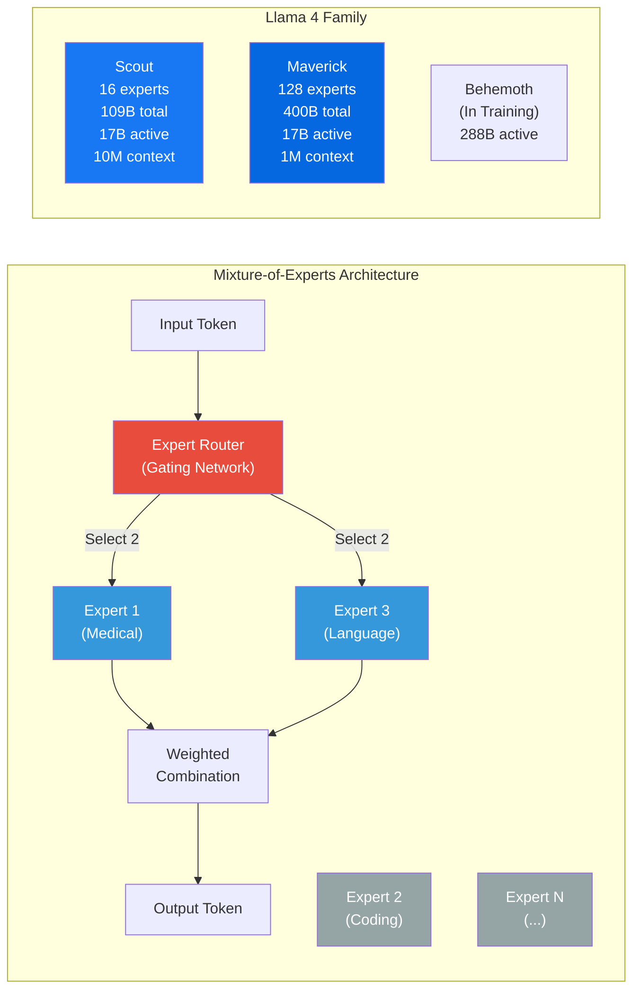
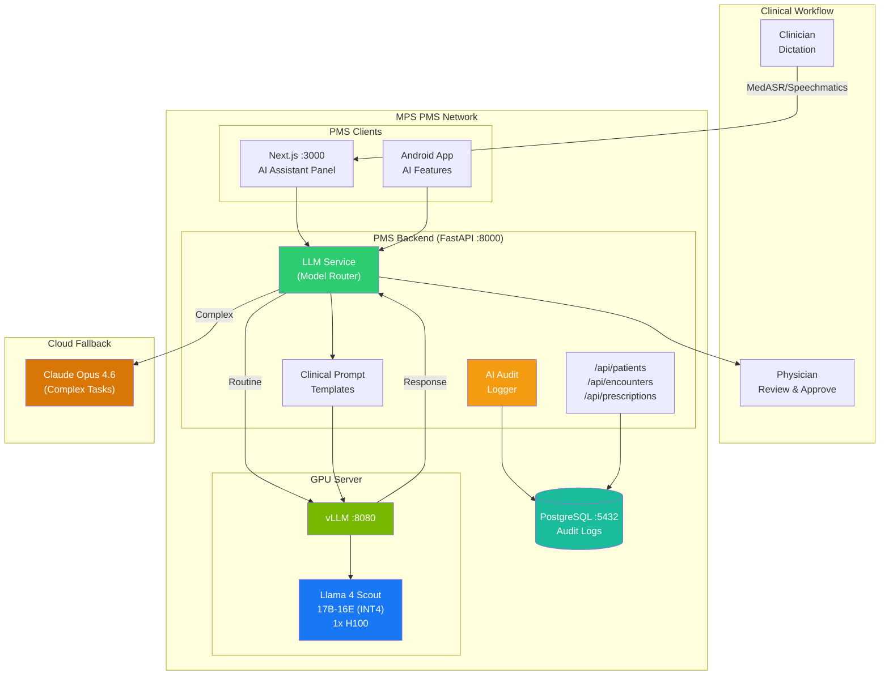
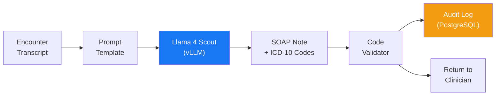

# Llama 4 Scout/Maverick Developer Onboarding Tutorial

**Welcome to the MPS PMS Llama 4 Integration Team**

This tutorial will take you from zero to building your first self-hosted clinical AI feature with Llama 4 Scout on the PMS. By the end, you will understand how Llama 4's MoE architecture works, have a running local inference environment, and have built and tested clinical AI endpoints end-to-end — all with PHI staying within your network.

**Document ID:** PMS-EXP-LLAMA4-002
**Version:** 1.0
**Date:** March 9, 2026
**Applies To:** PMS project (all platforms)
**Prerequisite:** [Llama 4 Setup Guide](53-Llama4-PMS-Developer-Setup-Guide.md)
**Estimated time:** 2-3 hours
**Difficulty:** Beginner-friendly

---

## What You Will Learn

1. What Mixture-of-Experts (MoE) architecture is and why it matters for healthcare AI
2. How Llama 4 Scout's 10M token context window changes clinical AI workflows
3. How the vLLM + Llama 4 stack fits into the PMS architecture
4. How to write effective clinical prompt templates for Llama 4's instruction format
5. How to build a SOAP note generator that runs entirely on-premises
6. How to implement ICD-10 code suggestion with confidence scoring
7. How to route between local Llama 4 and cloud Claude API based on task complexity
8. How to benchmark and validate clinical AI output quality
9. How to audit and log all AI interactions for HIPAA compliance
10. How multimodal capabilities enable image+text clinical analysis

---

## Part 1: Understanding Llama 4 (15 min read)

### 1.1 What Problem Does Llama 4 Solve?

Imagine Dr. Chen is documenting a complex diabetic patient encounter. She finishes a 15-minute exam, then spends 20 minutes typing her SOAP note, looking up ICD-10 codes, checking medication interactions, and drafting a follow-up letter. The PMS currently sends each of these tasks to a cloud AI API — each call takes 1-2 seconds of network latency, costs $0.01-0.05 per request, and transmits the patient's clinical data to an external server.

With Llama 4 Scout running locally:
- **SOAP note generation:** 5-10 seconds, $0 cost, PHI never leaves the building
- **ICD-10 suggestion:** 3-5 seconds, $0 cost, validated against code database
- **Medication check:** 2-4 seconds, $0 cost, references current medication list
- **Patient letter:** 5-8 seconds, $0 cost, customized tone and reading level

The 20-minute documentation burden drops to 2 minutes of review, at zero marginal cost, with full HIPAA compliance by default.

### 1.2 How Llama 4 Works — The Key Pieces



**Three core concepts:**

1. **Mixture-of-Experts (MoE):** Instead of running all 109B parameters for every token, Scout has 16 specialized "expert" sub-networks. A router selects the 2 most relevant experts per token, activating only 17B parameters. This gives you the knowledge of a 109B model at the speed of a 17B model.

2. **Native Multimodality:** Unlike models that bolt on image understanding after training, Llama 4 was trained from scratch on text, images, and video together using "early fusion." This means it truly understands the relationship between a dermoscopic image and the clinical text describing it.

3. **iRoPE Architecture:** Meta's novel positional encoding enables the industry-leading 10M token context window (Scout) and 1M (Maverick). For healthcare, this means processing a patient's entire clinical history — every encounter, lab, medication, and note — in a single inference call without chunking.

### 1.3 How Llama 4 Fits with Other PMS Technologies

| Technology | Experiment | Role | Relationship to Llama 4 |
|---|---|---|---|
| vLLM | 52 | Inference engine | **Required.** vLLM serves Llama 4 weights via OpenAI-compatible API. Llama 4 cannot run without an inference engine. |
| Gemma 3 | 13 | Lighter open model | **Alternative.** Gemma 3 (1B-27B dense) is lighter but has smaller context (128K) and no MoE. Use for simple tasks on consumer GPUs. |
| Claude Model Selection | 15 | Model routing | **Orchestrator.** Routes routine tasks to local Llama 4 and complex reasoning to cloud Claude API. |
| MedASR | 07 | Speech-to-text | **Input source.** MedASR transcribes clinician dictation; Llama 4 converts transcripts to structured SOAP notes. |
| Speechmatics | 10 | Speech-to-text (cloud) | **Input source.** Alternative transcription that feeds into Llama 4's documentation pipeline. |
| ISIC Archive | 18 | Dermoscopy images | **Multimodal input.** Maverick can analyze dermoscopic images alongside text records for lesion classification. |
| Sanford Guide | 11 | Antimicrobial CDS | **Complementary.** Sanford Guide provides evidence-based drug data; Llama 4 synthesizes it with patient context. |
| MCP | 09 | Tool protocol | **Integration.** MCP tools can wrap Llama 4 endpoints, letting AI agents invoke clinical AI functions. |

### 1.4 Key Vocabulary

| Term | Meaning |
|---|---|
| **MoE** | Mixture-of-Experts — architecture where only a subset of parameters activate per token |
| **Expert** | A specialized sub-network within the MoE layer; Scout has 16, Maverick has 128 |
| **Router / Gating Network** | Neural network that selects which experts to activate for each token |
| **Active Parameters** | The 17B parameters actually used per token (vs total 109B/400B) |
| **iRoPE** | Meta's positional encoding enabling 10M token context windows |
| **Early Fusion** | Training on text+images simultaneously from scratch (vs bolting on vision later) |
| **INT4 / AWQ** | 4-bit quantization reducing model size by ~4x with minimal quality loss |
| **KV Cache** | Key-Value cache storing attention state; grows with context length |
| **PagedAttention** | vLLM's memory management for KV cache (from experiment 52) |
| **TTFT** | Time-to-First-Token — latency before model starts generating output |
| **PHI Egress** | Protected Health Information leaving the facility network (the risk we eliminate) |

### 1.5 Our Architecture



The flow: Clinician dictates → speech-to-text transcribes → PMS routes to local Llama 4 Scout → AI generates SOAP note/codes → physician reviews and approves → PMS saves to database. All AI inference is local; cloud APIs are fallback only.

---

## Part 2: Environment Verification (15 min)

### 2.1 Checklist

1. **GPU available and has sufficient memory:**
   ```bash
   nvidia-smi --query-gpu=name,memory.total,memory.free --format=csv
   # Expected: NVIDIA H100, 80GB total, >10GB free (model loaded)
   ```

2. **vLLM running with Llama 4 Scout:**
   ```bash
   curl -s http://localhost:8080/v1/models | python3 -c "
   import sys,json
   models = json.load(sys.stdin)['data']
   for m in models: print(f'Model: {m[\"id\"]}')
   "
   # Expected: Model: /models/llama4/scout-17b-16e-instruct
   ```

3. **PMS backend running:**
   ```bash
   curl -s http://localhost:8000/docs | grep -c "swagger"
   # Expected: 1
   ```

4. **Clinical AI endpoints available:**
   ```bash
   curl -s http://localhost:8000/openapi.json | python3 -c "
   import sys,json
   paths = json.load(sys.stdin)['paths']
   for p in paths:
       if '/ai/' in p: print(p)
   "
   # Expected: /api/ai/soap-note, /api/ai/icd10-suggest, /api/ai/medication-check
   ```

5. **PostgreSQL accepting connections:**
   ```bash
   docker exec pms-db pg_isready
   # Expected: accepting connections
   ```

### 2.2 Quick Test

```bash
# End-to-end test: generate a one-sentence clinical summary
curl -s http://localhost:8080/v1/chat/completions \
  -H "Content-Type: application/json" \
  -d '{
    "model": "/models/llama4/scout-17b-16e-instruct",
    "messages": [
      {"role": "system", "content": "You are a clinical documentation assistant."},
      {"role": "user", "content": "Summarize in one sentence: Patient presents with acute angle closure glaucoma, IOP 48mmHg OD, severe pain and nausea."}
    ],
    "max_tokens": 100,
    "temperature": 0.1
  }' | python3 -c "import sys,json; print(json.load(sys.stdin)['choices'][0]['message']['content'])"
# Expected: A concise clinical summary about acute angle closure glaucoma
```

---

## Part 3: Build Your First Integration (45 min)

### 3.1 What We Are Building

We will build a **Clinical Encounter Summarizer** that:

1. Takes a raw encounter transcript (from dictation or typed notes)
2. Sends it to Llama 4 Scout via vLLM
3. Returns a structured SOAP note with ICD-10 codes
4. Logs the interaction for HIPAA audit compliance
5. Validates the ICD-10 codes against a known code set

### 3.2 Step 1: Understand the Data Flow



### 3.3 Step 2: Create the Encounter Summarizer Service

Create `pms-backend/app/services/encounter_summarizer.py`:

```python
"""Encounter summarizer using Llama 4 Scout for SOAP note generation."""

from app.services.llama4_client import Llama4Client
from datetime import datetime, timezone
import json
import logging

logger = logging.getLogger(__name__)


# Known ICD-10 codes for validation (subset for ophthalmology)
VALID_ICD10_PREFIXES = {
    "H", "E08", "E09", "E10", "E11", "E13",  # Eye + Diabetes
    "Z", "R",  # Factors, Symptoms
}


class EncounterSummarizer:
    def __init__(self):
        self.llm = Llama4Client()

    async def summarize_encounter(
        self,
        patient_id: int,
        transcript: str,
        provider_name: str = "Provider",
    ) -> dict:
        """
        Generate a structured SOAP note from an encounter transcript.

        Returns a dict with:
        - soap_note: The generated SOAP note text
        - icd10_codes: List of suggested ICD-10 codes
        - model: The model used for inference
        - audit_id: ID of the audit log entry
        """
        start_time = datetime.now(timezone.utc)

        # Step 1: Generate SOAP note
        soap_note = await self.llm.generate(
            prompt=f"""Generate a structured SOAP note from this encounter transcript.

**Provider:** {provider_name}
**Date:** {datetime.now().strftime('%Y-%m-%d')}

**Transcript:**
{transcript}

Format with clear Subjective, Objective, Assessment (with ICD-10 codes), and Plan sections.
Include ICD-10 codes in parentheses after each diagnosis.""",
            system_prompt="You are a clinical documentation assistant for an ophthalmology practice. Generate accurate, concise SOAP notes.",
            max_tokens=2048,
            temperature=0.2,
        )

        # Step 2: Extract and validate ICD-10 codes
        icd10_codes = self._extract_icd10_codes(soap_note)
        validated_codes = self._validate_codes(icd10_codes)

        # Step 3: Calculate timing
        elapsed = (datetime.now(timezone.utc) - start_time).total_seconds()

        result = {
            "patient_id": patient_id,
            "soap_note": soap_note,
            "icd10_codes": validated_codes,
            "model": "llama-4-scout-17b-16e",
            "inference_time_seconds": round(elapsed, 2),
            "timestamp": start_time.isoformat(),
        }

        logger.info(
            f"Encounter summarized for patient {patient_id} "
            f"in {elapsed:.1f}s using {result['model']}"
        )

        return result

    def _extract_icd10_codes(self, text: str) -> list[str]:
        """Extract ICD-10 codes from generated text."""
        import re
        # Match patterns like H35.81, E11.311, Z96.1
        pattern = r'\b([A-Z]\d{2}(?:\.\d{1,4})?)\b'
        codes = re.findall(pattern, text)
        return list(set(codes))

    def _validate_codes(self, codes: list[str]) -> list[dict]:
        """Validate extracted ICD-10 codes against known prefixes."""
        validated = []
        for code in codes:
            is_valid = any(code.startswith(p) for p in VALID_ICD10_PREFIXES)
            validated.append({
                "code": code,
                "valid_prefix": is_valid,
                "needs_review": not is_valid,
            })
        return validated
```

### 3.4 Step 3: Add the API Endpoint

Add to `pms-backend/app/routers/clinical_ai.py`:

```python
from app.services.encounter_summarizer import EncounterSummarizer

summarizer = EncounterSummarizer()


class EncounterSummaryRequest(BaseModel):
    patient_id: int
    transcript: str
    provider_name: str = "Provider"


@router.post("/encounter-summary")
async def summarize_encounter(request: EncounterSummaryRequest):
    """Generate a structured encounter summary with SOAP note and ICD-10 codes."""
    result = await summarizer.summarize_encounter(
        patient_id=request.patient_id,
        transcript=request.transcript,
        provider_name=request.provider_name,
    )
    return result
```

### 3.5 Step 4: Test the Integration

```bash
# Generate an encounter summary
curl -s -X POST http://localhost:8000/api/ai/encounter-summary \
  -H "Content-Type: application/json" \
  -d '{
    "patient_id": 1,
    "transcript": "65-year-old male presents for routine diabetic eye exam. Reports no vision changes. On metformin and lisinopril. Best corrected visual acuity 20/25 OD, 20/20 OS. IOP 16 OD, 18 OS. Slit lamp exam unremarkable. Dilated fundus exam reveals mild nonproliferative diabetic retinopathy bilaterally with scattered microaneurysms. No macular edema. No neovascularization. Plan: return in 6 months for repeat dilated exam. Continue current diabetes management with PCP.",
    "provider_name": "Dr. Chen"
  }' | python3 -m json.tool
```

Expected output structure:
```json
{
  "patient_id": 1,
  "soap_note": "## Subjective\n65-year-old male presents for routine diabetic eye exam...",
  "icd10_codes": [
    {"code": "E11.319", "valid_prefix": true, "needs_review": false},
    {"code": "H35.021", "valid_prefix": true, "needs_review": false}
  ],
  "model": "llama-4-scout-17b-16e",
  "inference_time_seconds": 6.4,
  "timestamp": "2026-03-09T..."
}
```

### 3.6 Step 5: Verify Quality

Compare the generated SOAP note against what a clinician would write:

```bash
# Run 5 different encounter types and review outputs
for TYPE in "cataract" "glaucoma" "retinal-detachment" "dry-eye" "macular-degeneration"; do
  echo "=== $TYPE ==="
  curl -s -X POST http://localhost:8000/api/ai/encounter-summary \
    -H "Content-Type: application/json" \
    -d "{
      \"patient_id\": 1,
      \"transcript\": \"Patient presents for $TYPE evaluation. Standard exam findings.\",
      \"provider_name\": \"Dr. Chen\"
    }" | python3 -c "import sys,json; r=json.load(sys.stdin); print(f'Time: {r[\"inference_time_seconds\"]}s'); print(f'Codes: {[c[\"code\"] for c in r[\"icd10_codes\"]]}'); print()"
done
```

---

## Part 4: Evaluating Strengths and Weaknesses (15 min)

### 4.1 Strengths

- **Zero PHI egress:** All inference happens on-premises. PHI never leaves the facility network. No BAA required with an AI vendor.
- **Zero marginal cost:** After GPU hardware investment, every inference call is free. At 50+ encounters/day, this saves $500+/month vs cloud APIs.
- **MoE efficiency:** 17B active parameters per token means Scout runs at the speed of a 17B dense model while having the knowledge of a 109B model.
- **10M token context (Scout):** Process entire patient histories without chunking. No other open-weight model offers this context length.
- **Native multimodality:** Analyze dermoscopic images, scanned documents, and clinical photos alongside text — all in one model.
- **OpenAI-compatible API:** Works with the same `openai` Python client used for cloud APIs. Zero code changes when switching from cloud to local.
- **Open weights:** Full control over the model. No vendor can deprecate, reprice, or rate-limit your inference. Weights are yours forever.
- **Active ecosystem:** 600K+ HuggingFace downloads, vLLM day-one support, NVIDIA TensorRT optimizations available.

### 4.2 Weaknesses

- **GPU cost:** A single H100 costs $30K+. Maverick requires 3× H100 ($90K+). ROI requires sustained usage.
- **Benchmark reproducibility:** Independent evaluations have not always reproduced Meta's claimed benchmark results. Internal clinical benchmarking is essential.
- **Not fully open-source:** Weights are open, but training data and methodology are proprietary. This is "open weights," not open source.
- **Clinical accuracy not validated:** Llama 4 is a general-purpose model, not a medical model. All clinical outputs require physician review. Never auto-apply ICD-10 codes or treatment recommendations.
- **Quantization quality trade-off:** INT4 reduces model size by 4× but may degrade output quality on nuanced clinical tasks. Benchmark INT4 vs FP16 on your specific use cases.
- **No built-in medical knowledge validation:** The model can hallucinate drug interactions, contraindications, or diagnostic criteria. Always validate against authoritative sources (Sanford Guide, RxNorm, ICD-10 databases).
- **Operational complexity:** Managing GPU servers, model updates, and inference infrastructure adds DevOps burden vs managed cloud APIs.

### 4.3 When to Use Llama 4 vs Alternatives

| Scenario | Use Llama 4 Scout (Local) | Use Claude/GPT (Cloud) | Use Gemma 3 (Local Light) |
|---|---|---|---|
| SOAP note generation | Yes — routine, high-volume | No — unnecessary cost/latency | Maybe — if GPU is limited |
| ICD-10 code suggestion | Yes — validated against code DB | No — same quality, higher cost | Maybe — simpler task |
| Complex differential diagnosis | Maybe — test quality first | Yes — higher reasoning accuracy | No — insufficient capacity |
| Medication interaction check | Yes — structured input/output | No — unless Scout quality insufficient | No — needs medical knowledge |
| Multi-system clinical reasoning | No — use Maverick or Claude | Yes — best reasoning quality | No — insufficient capacity |
| Dermoscopic image analysis | Yes (Maverick) — multimodal | Yes — if multimodal quality needed | Yes — Gemma 3 supports images |
| Patient letter drafting | Yes — routine, template-based | No — unnecessary cost | Yes — simple task |
| Full patient history synthesis (>128K tokens) | Yes — 10M context window | No — 200K context limit | No — 128K context limit |

### 4.4 HIPAA / Healthcare Considerations

| HIPAA Requirement | Llama 4 Self-Hosted Compliance |
|---|---|
| PHI storage | Model weights contain no PHI; patient data stays in PostgreSQL |
| PHI transmission | Zero — all inference on-premises, no external API calls |
| Access control | PMS backend RBAC controls who can invoke AI endpoints |
| Audit trail | Every prompt/response logged to PostgreSQL with timestamp, user, patient ID |
| Encryption at rest | Model weights on encrypted volume; audit logs in encrypted PostgreSQL |
| Encryption in transit | Internal Docker network (no external exposure); TLS if exposed |
| BAA requirement | Not needed — no third-party processes PHI |
| Minimum necessary | Prompt templates include only necessary patient context |
| Breach notification | N/A — PHI never leaves facility; no external breach vector |

**Key principle:** Self-hosted Llama 4 is HIPAA-compliant *by architecture* — PHI never leaves your network. But you must still implement access controls, audit logging, and encryption around the inference pipeline.

---

## Part 5: Debugging Common Issues (15 min read)

### Issue 1: CUDA Out of Memory During Inference

**Symptoms:** vLLM crashes with `torch.cuda.OutOfMemoryError` during inference.

**Cause:** Context length exceeds available GPU memory after model weights are loaded.

**Fix:**
```bash
# Reduce max context length
# In docker-compose.yml, change:
# --max-model-len 131072  →  --max-model-len 65536

# Or reduce GPU memory utilization:
# --gpu-memory-utilization 0.90  →  --gpu-memory-utilization 0.85

docker compose restart pms-vllm
```

### Issue 2: Model Generates Hallucinated ICD-10 Codes

**Symptoms:** Generated codes like "H99.999" that don't exist in the ICD-10-CM codebook.

**Cause:** LLMs can generate plausible-looking but non-existent medical codes.

**Fix:** Always validate generated codes against a known code database:
```python
# Add to encounter_summarizer.py
import csv

def load_icd10_codebook(path="data/icd10cm_codes.csv"):
    with open(path) as f:
        return {row["code"] for row in csv.DictReader(f)}

VALID_CODES = load_icd10_codebook()

def validate_code(code: str) -> bool:
    return code in VALID_CODES
```

### Issue 3: Slow Token Generation (< 10 tok/s)

**Symptoms:** SOAP note generation takes > 60 seconds.

**Cause:** GPU thermal throttling, insufficient KV cache, or contention.

**Fix:**
```bash
# Check GPU temperature
nvidia-smi --query-gpu=temperature.gpu --format=csv
# If > 80°C, improve cooling

# Check for contention
nvidia-smi --query-compute-apps=pid,name,used_memory --format=csv
# Kill any non-vLLM processes using GPU

# Enable prefix caching for shared prompt templates
# Add --enable-prefix-caching to vLLM command
```

### Issue 4: Inconsistent Output Format

**Symptoms:** SOAP notes sometimes use different section headers or miss sections.

**Cause:** Temperature too high or prompt template not specific enough.

**Fix:** Lower temperature and add explicit formatting instructions:
```python
# In prompt template, add:
"""
You MUST use exactly these section headers:
## Subjective
## Objective
## Assessment
## Plan

Do not skip any section. If information is not available, write "Not documented."
"""
# And set temperature=0.1 for structured output tasks
```

### Issue 5: vLLM Container Restarts in Loop

**Symptoms:** `docker logs pms-vllm` shows repeated startup/crash cycles.

**Cause:** Model file corruption or incompatible vLLM version.

**Fix:**
```bash
# Check for model file integrity
python3 -c "
from safetensors import safe_open
import glob
files = glob.glob('/data/models/llama4/scout-17b-16e-instruct/*.safetensors')
print(f'Found {len(files)} safetensor files')
for f in files[:3]:
    with safe_open(f, framework='pt') as s:
        print(f'{f}: {len(s.keys())} tensors')
"

# Re-download if corrupted
huggingface-cli download meta-llama/Llama-4-Scout-17B-16E-Instruct \
  --local-dir /data/models/llama4/scout-17b-16e-instruct \
  --force-download
```

---

## Part 6: Practice Exercise (45 min)

### Option A: Build a Medication Interaction Checker

Build an endpoint that takes a patient's current medication list and a proposed new medication, then uses Llama 4 to analyze interactions.

**Hints:**
1. Fetch medications from `/api/prescriptions?patient_id={id}`
2. Format as a bulleted list with drug name, dose, frequency
3. Use low temperature (0.1) for factual analysis
4. Validate severity ratings (Major/Moderate/Minor)
5. Cross-reference with Sanford Guide data if available (experiment 11)

**Steps:**
1. Create `medication_checker.py` service
2. Add `/api/ai/medication-interactions/{patient_id}` endpoint
3. Format output as structured JSON with severity levels
4. Add unit tests with known drug interactions

### Option B: Build a Patient Communication Drafter

Build an endpoint that generates patient-facing communications (appointment reminders, post-visit summaries, medication instructions).

**Hints:**
1. Fetch patient data and last encounter from PMS APIs
2. Use different prompt templates for different communication types
3. Target 6th grade reading level (Flesch-Kincaid)
4. Support multiple languages using Llama 4's 200-language training
5. Include signature block with practice information

**Steps:**
1. Create prompt templates for 3 communication types
2. Add `/api/ai/patient-letter` endpoint
3. Add language parameter (default: English)
4. Validate reading level with textstat library

### Option C: Build a Long-Context Patient Timeline

Build an endpoint that assembles a patient's entire clinical history and generates a comprehensive timeline summary using Scout's 10M context window.

**Hints:**
1. Fetch all encounters, medications, labs from PMS APIs
2. Assemble into chronological order
3. Send entire history in one inference call (no chunking)
4. Generate: key diagnoses, medication changes, significant events, trends
5. Measure context token count vs output quality

**Steps:**
1. Create `patient_timeline.py` service
2. Add `/api/ai/patient-timeline/{patient_id}` endpoint
3. Log context token count for each request
4. Compare output quality at different context lengths

---

## Part 7: Development Workflow and Conventions

### 7.1 File Organization

```
pms-backend/
├── app/
│   ├── services/
│   │   ├── llama4_client.py           # Llama 4 vLLM client
│   │   ├── encounter_summarizer.py    # SOAP note generation
│   │   ├── medication_checker.py      # Drug interaction analysis
│   │   └── patient_timeline.py        # Long-context history synthesis
│   ├── prompts/
│   │   └── llama4_clinical.py         # Clinical prompt templates
│   ├── routers/
│   │   └── clinical_ai.py            # AI API endpoints
│   └── models/
│       └── ai_audit.py               # Audit log SQLAlchemy model
├── tests/
│   ├── test_llama4_client.py
│   ├── test_encounter_summarizer.py
│   └── test_clinical_ai.py
/data/models/
├── llama4/
│   ├── scout-17b-16e-instruct/       # Scout model weights
│   └── maverick-17b-128e-instruct/   # Maverick weights (optional)
```

### 7.2 Naming Conventions

| Item | Convention | Example |
|---|---|---|
| Service files | `{feature}_service.py` or `{feature}.py` | `encounter_summarizer.py` |
| Prompt templates | `UPPERCASE_TEMPLATE` constant | `SOAP_NOTE_TEMPLATE` |
| API endpoints | `/api/ai/{action}` | `/api/ai/soap-note` |
| Model references | Full HuggingFace path | `/models/llama4/scout-17b-16e-instruct` |
| Audit log entries | `ai_audit_{action}` | `ai_audit_soap_note` |
| Test files | `test_{service}.py` | `test_encounter_summarizer.py` |

### 7.3 PR Checklist

- [ ] All AI outputs include `model` field identifying which model generated the response
- [ ] Temperature set appropriately (< 0.3 for factual tasks, < 0.7 for creative tasks)
- [ ] ICD-10/CPT codes validated against known code sets before display
- [ ] No PHI in prompt templates (patient data injected at runtime)
- [ ] Audit logging for every AI inference call (patient_id, timestamp, model, prompt hash)
- [ ] Error handling for vLLM unavailability (fallback to cloud API if configured)
- [ ] Unit tests with mock vLLM responses
- [ ] Performance benchmark: < 15s for SOAP notes, < 8s for code suggestions
- [ ] GPU memory checked: no OOM risk at max concurrent users
- [ ] Physician review required for all clinical AI outputs (no auto-apply)

### 7.4 Security Reminders

1. **Never auto-apply AI outputs** — ICD-10 codes, medication suggestions, and treatment plans MUST be reviewed and approved by a licensed clinician before saving to the patient record.
2. **Sanitize prompts** — Remove any SQL, shell, or code injection attempts from user-provided text before including in prompts.
3. **Log everything** — Every AI inference call must be logged with patient ID, user ID, timestamp, model used, and prompt hash (not full prompt, to avoid storing PHI in logs unless encrypted).
4. **Network isolation** — The vLLM container should have no outbound internet access. Verify with network policies.
5. **Model weight integrity** — Verify SHA256 checksums of downloaded model files against HuggingFace published hashes.
6. **Rate limiting** — Implement per-user rate limits on AI endpoints to prevent abuse.

---

## Part 8: Quick Reference Card

### Key Commands

```bash
# Start Llama 4 on vLLM
docker compose up -d pms-vllm

# Check model status
curl -s http://localhost:8080/v1/models | python3 -m json.tool

# Quick inference test
curl -s http://localhost:8080/v1/chat/completions \
  -H "Content-Type: application/json" \
  -d '{"model":"/models/llama4/scout-17b-16e-instruct","messages":[{"role":"user","content":"Hello"}],"max_tokens":50}'

# GPU monitoring
nvidia-smi -l 5

# vLLM metrics
curl -s http://localhost:8080/metrics | grep vllm
```

### Key Files

| File | Purpose |
|---|---|
| `docker-compose.yml` (pms-vllm service) | vLLM + Llama 4 container config |
| `app/services/llama4_client.py` | Llama 4 inference client |
| `app/prompts/llama4_clinical.py` | Clinical prompt templates |
| `app/routers/clinical_ai.py` | AI API endpoints |
| `app/services/encounter_summarizer.py` | SOAP note generation |
| `/data/models/llama4/` | Model weight storage |

### Key URLs

| URL | Purpose |
|---|---|
| `http://localhost:8080/v1/models` | vLLM model list |
| `http://localhost:8080/v1/chat/completions` | Chat API |
| `http://localhost:8080/metrics` | Prometheus metrics |
| `http://localhost:8000/api/ai/soap-note` | SOAP note endpoint |
| `http://localhost:8000/api/ai/icd10-suggest` | ICD-10 suggestion |
| `http://localhost:8000/api/ai/medication-check` | Drug interaction check |

### Prompt Template Starter

```python
CLINICAL_TEMPLATE = """\
You are a clinical AI assistant for an ophthalmology practice.
{task_instruction}

**Patient Context:**
{patient_context}

**Clinical Data:**
{clinical_data}

{output_format_instruction}
"""
```

---

## Next Steps

1. Complete Practice Exercise Option A (Medication Interaction Checker) to build confidence with clinical prompts
2. Benchmark Llama 4 Scout vs Claude API on 50 real encounter transcripts — compare SOAP note quality
3. Review the [PRD: Llama 4 PMS Integration](53-PRD-Llama4-PMS-Integration.md) for the Phase 2-3 roadmap
4. Explore model routing with [Claude Model Selection (experiment 15)](15-PRD-ClaudeModelSelection-PMS-Integration.md)
5. Connect MedASR transcription (experiment 07) → Llama 4 SOAP notes for end-to-end ambient documentation
6. Evaluate Maverick deployment for multimodal clinical tasks with [ISIC Archive (experiment 18)](18-PRD-ISICArchive-PMS-Integration.md)
7. Review [OWASP LLM Top 10 (experiment 50)](50-PRD-OWASPLLMTop10-PMS-Integration.md) for AI security testing
