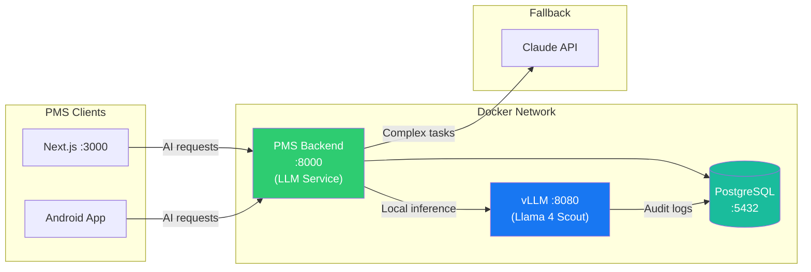

# Llama 4 Scout/Maverick Setup Guide for PMS Integration

**Document ID:** PMS-EXP-LLAMA4-001
**Version:** 1.0
**Date:** March 9, 2026
**Applies To:** PMS project (all platforms)
**Prerequisites Level:** Intermediate

---

## Table of Contents

1. [Overview](#1-overview)
2. [Prerequisites](#2-prerequisites)
3. [Part A: Download and Configure Llama 4 Models](#3-part-a-download-and-configure-llama-4-models)
4. [Part B: Integrate with PMS Backend](#4-part-b-integrate-with-pms-backend)
5. [Part C: Integrate with PMS Frontend](#5-part-c-integrate-with-pms-frontend)
6. [Part D: Testing and Verification](#6-part-d-testing-and-verification)
7. [Troubleshooting](#7-troubleshooting)
8. [Reference Commands](#8-reference-commands)

---

## 1. Overview

This guide walks you through deploying **Llama 4 Scout** (and optionally Maverick) on the existing vLLM inference engine and integrating it with the PMS backend and frontend. By the end, you will have:

- Llama 4 Scout (INT4) running on vLLM with OpenAI-compatible API
- Clinical prompt templates adapted for Llama 4's instruction format
- LLM Service model router updated to use Scout as primary local model
- SOAP note generation, ICD-10 code suggestion, and patient communication endpoints
- Frontend AI assistant panel connected to self-hosted Llama 4
- Audit logging for all AI inference requests

### Architecture at a Glance



---

## 2. Prerequisites

### 2.1 Required Software

| Software | Minimum Version | Check Command |
|---|---|---|
| Python | 3.12+ | `python3 --version` |
| Docker | 24.0+ | `docker --version` |
| Docker Compose | 2.20+ | `docker compose version` |
| NVIDIA Driver | 535+ | `nvidia-smi` |
| NVIDIA Container Toolkit | Latest | `nvidia-ctk --version` |
| CUDA | 12.x+ | `nvcc --version` |
| Node.js | 20 LTS+ | `node --version` |
| Git | 2.40+ | `git --version` |
| huggingface-cli | Latest | `huggingface-cli --version` |
| vLLM | 0.8.3+ | `docker exec pms-vllm python -c "import vllm; print(vllm.__version__)"` |

### 2.2 Installation of Prerequisites

**NVIDIA Container Toolkit (if not installed):**

```bash
# Add NVIDIA repository
curl -fsSL https://nvidia.github.io/libnvidia-container/gpgkey | sudo gpg --dearmor -o /usr/share/keyrings/nvidia-container-toolkit-keyring.gpg
curl -s -L https://nvidia.github.io/libnvidia-container/stable/deb/nvidia-container-toolkit.list | \
  sed 's#deb https://#deb [signed-by=/usr/share/keyrings/nvidia-container-toolkit-keyring.gpg] https://#g' | \
  sudo tee /etc/apt/sources.list.d/nvidia-container-toolkit.list

sudo apt-get update && sudo apt-get install -y nvidia-container-toolkit
sudo nvidia-ctk runtime configure --runtime=docker
sudo systemctl restart docker
```

**HuggingFace CLI (for model download):**

```bash
pip install huggingface_hub[cli]
huggingface-cli login
# Enter your HuggingFace token (requires accepting Meta's Llama 4 license)
```

### 2.3 Verify PMS Services

```bash
# Check PMS backend
curl -s http://localhost:8000/docs | head -5
# Expected: HTML page for FastAPI Swagger docs

# Check PMS frontend
curl -s http://localhost:3000 -o /dev/null -w "%{http_code}"
# Expected: 200

# Check PostgreSQL
docker exec pms-db pg_isready
# Expected: accepting connections

# Check GPU availability
nvidia-smi --query-gpu=name,memory.total,memory.free --format=csv
# Expected: NVIDIA H100 80GB (or equivalent), with >70GB free

# Check vLLM service (from experiment 52)
curl -s http://localhost:8080/v1/models | python3 -m json.tool
# Expected: JSON with loaded models list
```

---

## 3. Part A: Download and Configure Llama 4 Models

### Step 1: Accept the Llama 4 License

Visit [https://huggingface.co/meta-llama/Llama-4-Scout-17B-16E-Instruct](https://huggingface.co/meta-llama/Llama-4-Scout-17B-16E-Instruct) and accept Meta's Llama 4 Community License Agreement. This is required before downloading weights.

### Step 2: Download Llama 4 Scout Weights

```bash
# Create model storage directory
mkdir -p /data/models/llama4

# Download Scout (INT4 quantized — fits on single H100)
huggingface-cli download meta-llama/Llama-4-Scout-17B-16E-Instruct \
  --local-dir /data/models/llama4/scout-17b-16e-instruct \
  --local-dir-use-symlinks False
```

This downloads approximately 60 GB of model weights. Verify the download:

```bash
ls -lh /data/models/llama4/scout-17b-16e-instruct/
# Expected: config.json, tokenizer.json, model-*.safetensors files
```

### Step 3: Configure vLLM for Llama 4 Scout

Update the vLLM Docker service in `docker-compose.yml`:

```yaml
  pms-vllm:
    image: vllm/vllm-openai:v0.8.3
    container_name: pms-vllm
    runtime: nvidia
    environment:
      - NVIDIA_VISIBLE_DEVICES=0
    ports:
      - "8080:8080"
    volumes:
      - /data/models:/models
    command: >
      --model /models/llama4/scout-17b-16e-instruct
      --port 8080
      --tensor-parallel-size 1
      --max-model-len 131072
      --kv-cache-dtype fp8
      --quantization awq
      --gpu-memory-utilization 0.90
      --max-num-seqs 10
      --trust-remote-code
      --enable-prefix-caching
    deploy:
      resources:
        reservations:
          devices:
            - driver: nvidia
              count: 1
              capabilities: [gpu]
    depends_on:
      - pms-db
    networks:
      - pms-network
    restart: unless-stopped
```

Key configuration options:
- `--max-model-len 131072`: Start with 128K context; increase as GPU memory allows
- `--kv-cache-dtype fp8`: Doubles usable context window with minimal accuracy loss
- `--quantization awq`: INT4 quantization to fit on single H100
- `--enable-prefix-caching`: Reuses KV cache for shared prompt prefixes (clinical templates)
- `--max-num-seqs 10`: Maximum concurrent inference requests

### Step 4: Start vLLM with Llama 4 Scout

```bash
docker compose up -d pms-vllm
```

Monitor the loading process (takes 2-5 minutes):

```bash
docker logs -f pms-vllm
# Watch for: "INFO: Application startup complete"
# Watch for: "INFO: Uvicorn running on http://0.0.0.0:8080"
```

### Step 5: Verify Llama 4 Scout is Serving

```bash
# Check model is loaded
curl -s http://localhost:8080/v1/models | python3 -m json.tool
# Expected: {"data": [{"id": "/models/llama4/scout-17b-16e-instruct", ...}]}

# Test basic inference
curl -s http://localhost:8080/v1/chat/completions \
  -H "Content-Type: application/json" \
  -d '{
    "model": "/models/llama4/scout-17b-16e-instruct",
    "messages": [{"role": "user", "content": "What is HIPAA? Answer in one sentence."}],
    "max_tokens": 100
  }' | python3 -c "import sys,json; print(json.load(sys.stdin)['choices'][0]['message']['content'])"
```

**Checkpoint:** Llama 4 Scout is running on vLLM, accessible via OpenAI-compatible API at `http://localhost:8080`, and generating text responses.

---

## 4. Part B: Integrate with PMS Backend

### Step 1: Update the LLM Service Configuration

Add Llama 4 model configuration to the PMS backend. Update `pms-backend/app/config.py`:

```python
# LLM Model Configuration
LLAMA4_SCOUT_MODEL = "/models/llama4/scout-17b-16e-instruct"
LLAMA4_VLLM_URL = "http://pms-vllm:8080/v1"

# Model routing thresholds
MODEL_ROUTING = {
    "routine": {
        "model": LLAMA4_SCOUT_MODEL,
        "base_url": LLAMA4_VLLM_URL,
        "max_tokens": 4096,
    },
    "complex": {
        "model": "claude-opus-4-6",
        "base_url": "https://api.anthropic.com",
        "max_tokens": 8192,
    },
}
```

### Step 2: Create Clinical Prompt Templates

Create `pms-backend/app/prompts/llama4_clinical.py`:

```python
"""Clinical prompt templates optimized for Llama 4 Scout instruction format."""

SOAP_NOTE_TEMPLATE = """\
You are a clinical documentation assistant for an ophthalmology practice.
Generate a structured SOAP note from the following encounter transcript.

**Patient:** {patient_name} (DOB: {dob}, MRN: {mrn})
**Date:** {encounter_date}
**Provider:** {provider_name}

**Transcript:**
{transcript}

Generate a SOAP note with these sections:
- **Subjective:** Patient's chief complaint and history of present illness
- **Objective:** Clinical findings, exam results, measurements
- **Assessment:** Diagnosis with ICD-10 codes
- **Plan:** Treatment plan, follow-up, prescriptions

Format as structured markdown. Include ICD-10 codes in parentheses after each diagnosis.
"""

ICD10_SUGGESTION_TEMPLATE = """\
You are a medical coding assistant. Suggest the top 5 most appropriate ICD-10-CM codes
for the following clinical encounter.

**Encounter Summary:**
{encounter_summary}

For each code, provide:
1. ICD-10-CM code
2. Description
3. Confidence level (High/Medium/Low)
4. Supporting evidence from the encounter

Format as a numbered list.
"""

PATIENT_COMMUNICATION_TEMPLATE = """\
You are a patient communication assistant for an ophthalmology practice.
Draft a {communication_type} for the following patient.

**Patient:** {patient_name}
**Context:** {context}
**Tone:** Professional, warm, accessible (6th grade reading level)
**Language:** {language}

Draft the communication. Do not include any medical jargon without explanation.
"""

MEDICATION_INTERACTION_TEMPLATE = """\
You are a clinical pharmacology assistant. Analyze the following medication list
for potential interactions.

**Current Medications:**
{medication_list}

**New Prescription Being Considered:**
{new_medication}

For each interaction found:
1. Severity (Major/Moderate/Minor)
2. Mechanism of interaction
3. Clinical significance
4. Recommended action

If no significant interactions are found, state that clearly.
"""
```

### Step 3: Create the Llama 4 LLM Client

Create `pms-backend/app/services/llama4_client.py`:

```python
"""Client for Llama 4 inference via vLLM OpenAI-compatible API."""

from openai import AsyncOpenAI
from app.config import settings
import logging

logger = logging.getLogger(__name__)


class Llama4Client:
    def __init__(self):
        self.client = AsyncOpenAI(
            base_url=settings.LLAMA4_VLLM_URL,
            api_key="not-needed",  # vLLM doesn't require API key
        )
        self.model = settings.LLAMA4_SCOUT_MODEL

    async def generate(
        self,
        prompt: str,
        system_prompt: str = "You are a clinical AI assistant for a healthcare practice.",
        max_tokens: int = 4096,
        temperature: float = 0.3,
    ) -> str:
        """Generate a response using Llama 4 Scout via vLLM."""
        try:
            response = await self.client.chat.completions.create(
                model=self.model,
                messages=[
                    {"role": "system", "content": system_prompt},
                    {"role": "user", "content": prompt},
                ],
                max_tokens=max_tokens,
                temperature=temperature,
            )
            return response.choices[0].message.content
        except Exception as e:
            logger.error(f"Llama 4 inference failed: {e}")
            raise

    async def generate_soap_note(
        self, patient_data: dict, transcript: str
    ) -> str:
        """Generate a SOAP note from an encounter transcript."""
        from app.prompts.llama4_clinical import SOAP_NOTE_TEMPLATE

        prompt = SOAP_NOTE_TEMPLATE.format(
            patient_name=f"{patient_data['first_name']} {patient_data['last_name']}",
            dob=patient_data.get("date_of_birth", "Unknown"),
            mrn=patient_data.get("id", "Unknown"),
            encounter_date=patient_data.get("encounter_date", "Today"),
            provider_name=patient_data.get("provider_name", "Provider"),
            transcript=transcript,
        )
        return await self.generate(prompt, max_tokens=2048)

    async def suggest_icd10_codes(self, encounter_summary: str) -> str:
        """Suggest ICD-10 codes for an encounter."""
        from app.prompts.llama4_clinical import ICD10_SUGGESTION_TEMPLATE

        prompt = ICD10_SUGGESTION_TEMPLATE.format(
            encounter_summary=encounter_summary
        )
        return await self.generate(prompt, max_tokens=1024, temperature=0.1)

    async def check_medication_interactions(
        self, medication_list: str, new_medication: str
    ) -> str:
        """Check medication interactions for a new prescription."""
        from app.prompts.llama4_clinical import MEDICATION_INTERACTION_TEMPLATE

        prompt = MEDICATION_INTERACTION_TEMPLATE.format(
            medication_list=medication_list,
            new_medication=new_medication,
        )
        return await self.generate(prompt, max_tokens=1024, temperature=0.1)
```

### Step 4: Add Clinical AI API Endpoints

Create `pms-backend/app/routers/clinical_ai.py`:

```python
"""Clinical AI endpoints powered by Llama 4 Scout."""

from fastapi import APIRouter, HTTPException
from pydantic import BaseModel
from app.services.llama4_client import Llama4Client

router = APIRouter(prefix="/api/ai", tags=["Clinical AI"])
llama4 = Llama4Client()


class SOAPNoteRequest(BaseModel):
    patient_id: int
    transcript: str


class ICD10Request(BaseModel):
    encounter_summary: str


class MedicationCheckRequest(BaseModel):
    current_medications: list[str]
    new_medication: str


@router.post("/soap-note")
async def generate_soap_note(request: SOAPNoteRequest):
    """Generate a SOAP note from encounter transcript using Llama 4 Scout."""
    # Fetch patient data from PMS
    import httpx
    async with httpx.AsyncClient() as client:
        resp = await client.get(f"http://localhost:8000/api/patients/{request.patient_id}")
    if resp.status_code != 200:
        raise HTTPException(status_code=404, detail="Patient not found")

    patient_data = resp.json()
    soap_note = await llama4.generate_soap_note(patient_data, request.transcript)

    return {"patient_id": request.patient_id, "soap_note": soap_note, "model": "llama-4-scout"}


@router.post("/icd10-suggest")
async def suggest_icd10(request: ICD10Request):
    """Suggest ICD-10 codes for an encounter summary."""
    suggestions = await llama4.suggest_icd10_codes(request.encounter_summary)
    return {"suggestions": suggestions, "model": "llama-4-scout"}


@router.post("/medication-check")
async def check_medications(request: MedicationCheckRequest):
    """Check medication interactions for a new prescription."""
    med_list = "\n".join(f"- {med}" for med in request.current_medications)
    result = await llama4.check_medication_interactions(med_list, request.new_medication)
    return {"interactions": result, "model": "llama-4-scout"}
```

### Step 5: Verify Backend Integration

```bash
# Test SOAP note generation
curl -s -X POST http://localhost:8000/api/ai/soap-note \
  -H "Content-Type: application/json" \
  -d '{
    "patient_id": 1,
    "transcript": "Patient presents with blurred vision in right eye for 2 weeks. No pain. History of type 2 diabetes. Visual acuity OD 20/60, OS 20/20. Fundus exam shows microaneurysms and hard exudates in right macula consistent with diabetic macular edema."
  }' | python3 -m json.tool

# Test ICD-10 suggestion
curl -s -X POST http://localhost:8000/api/ai/icd10-suggest \
  -H "Content-Type: application/json" \
  -d '{"encounter_summary": "Patient with type 2 diabetes presenting with diabetic macular edema in right eye, moderate nonproliferative diabetic retinopathy bilateral"}' \
  | python3 -m json.tool

# Test medication interaction check
curl -s -X POST http://localhost:8000/api/ai/medication-check \
  -H "Content-Type: application/json" \
  -d '{
    "current_medications": ["Metformin 1000mg BID", "Lisinopril 10mg daily", "Aspirin 81mg daily"],
    "new_medication": "Aflibercept 2mg intravitreal injection"
  }' | python3 -m json.tool
```

**Checkpoint:** The PMS backend can call Llama 4 Scout via vLLM for SOAP notes, ICD-10 codes, and medication interaction checks. All inference happens locally — no PHI leaves the network.

---

## 5. Part C: Integrate with PMS Frontend

### Step 1: Add AI Environment Variables

Add to `pms-frontend/.env.local`:

```
NEXT_PUBLIC_AI_API_URL=http://localhost:8000/api/ai
```

### Step 2: Create the AI Client Utility

Create `pms-frontend/src/lib/ai-client.ts`:

```typescript
const AI_BASE = process.env.NEXT_PUBLIC_AI_API_URL || "http://localhost:8000/api/ai";

export async function generateSOAPNote(patientId: number, transcript: string) {
  const res = await fetch(`${AI_BASE}/soap-note`, {
    method: "POST",
    headers: { "Content-Type": "application/json" },
    body: JSON.stringify({ patient_id: patientId, transcript }),
  });
  if (!res.ok) throw new Error(`SOAP generation failed: ${res.statusText}`);
  return res.json();
}

export async function suggestICD10(encounterSummary: string) {
  const res = await fetch(`${AI_BASE}/icd10-suggest`, {
    method: "POST",
    headers: { "Content-Type": "application/json" },
    body: JSON.stringify({ encounter_summary: encounterSummary }),
  });
  if (!res.ok) throw new Error(`ICD-10 suggestion failed: ${res.statusText}`);
  return res.json();
}

export async function checkMedications(currentMeds: string[], newMed: string) {
  const res = await fetch(`${AI_BASE}/medication-check`, {
    method: "POST",
    headers: { "Content-Type": "application/json" },
    body: JSON.stringify({ current_medications: currentMeds, new_medication: newMed }),
  });
  if (!res.ok) throw new Error(`Medication check failed: ${res.statusText}`);
  return res.json();
}
```

### Step 3: Create the Clinical AI Assistant Panel

Create `pms-frontend/src/components/ai/ClinicalAIPanel.tsx`:

```tsx
"use client";

import { useState } from "react";
import { generateSOAPNote, suggestICD10 } from "@/lib/ai-client";

export function ClinicalAIPanel({ patientId }: { patientId: number }) {
  const [transcript, setTranscript] = useState("");
  const [soapNote, setSoapNote] = useState<string | null>(null);
  const [icdCodes, setIcdCodes] = useState<string | null>(null);
  const [loading, setLoading] = useState(false);
  const [activeTab, setActiveTab] = useState<"soap" | "icd10">("soap");

  const handleGenerateSOAP = async () => {
    setLoading(true);
    try {
      const result = await generateSOAPNote(patientId, transcript);
      setSoapNote(result.soap_note);
    } finally {
      setLoading(false);
    }
  };

  const handleSuggestICD10 = async () => {
    if (!soapNote) return;
    setLoading(true);
    try {
      const result = await suggestICD10(soapNote);
      setIcdCodes(result.suggestions);
    } finally {
      setLoading(false);
    }
  };

  return (
    <div className="border rounded-lg p-4 bg-white shadow-sm">
      <div className="flex items-center justify-between mb-4">
        <h3 className="text-lg font-semibold">Clinical AI Assistant</h3>
        <span className="text-xs bg-blue-100 text-blue-800 px-2 py-1 rounded">
          Llama 4 Scout (Local)
        </span>
      </div>

      <div className="flex gap-2 mb-4">
        <button
          onClick={() => setActiveTab("soap")}
          className={`px-3 py-1 rounded text-sm ${activeTab === "soap" ? "bg-blue-600 text-white" : "bg-gray-100"}`}
        >
          SOAP Note
        </button>
        <button
          onClick={() => setActiveTab("icd10")}
          className={`px-3 py-1 rounded text-sm ${activeTab === "icd10" ? "bg-blue-600 text-white" : "bg-gray-100"}`}
        >
          ICD-10 Codes
        </button>
      </div>

      {activeTab === "soap" && (
        <div>
          <textarea
            value={transcript}
            onChange={(e) => setTranscript(e.target.value)}
            placeholder="Paste encounter transcript here..."
            className="w-full border rounded p-2 h-32 text-sm"
          />
          <button
            onClick={handleGenerateSOAP}
            disabled={loading || !transcript}
            className="mt-2 bg-blue-600 text-white px-4 py-2 rounded hover:bg-blue-700 disabled:opacity-50"
          >
            {loading ? "Generating..." : "Generate SOAP Note"}
          </button>
          {soapNote && (
            <div className="mt-4 p-3 bg-gray-50 rounded text-sm whitespace-pre-wrap">
              {soapNote}
            </div>
          )}
        </div>
      )}

      {activeTab === "icd10" && (
        <div>
          <button
            onClick={handleSuggestICD10}
            disabled={loading || !soapNote}
            className="bg-green-600 text-white px-4 py-2 rounded hover:bg-green-700 disabled:opacity-50"
          >
            {loading ? "Analyzing..." : "Suggest ICD-10 Codes"}
          </button>
          <p className="text-xs text-gray-500 mt-1">
            Generate a SOAP note first, then suggest codes based on it.
          </p>
          {icdCodes && (
            <div className="mt-4 p-3 bg-gray-50 rounded text-sm whitespace-pre-wrap">
              {icdCodes}
            </div>
          )}
        </div>
      )}
    </div>
  );
}
```

### Step 4: Verify Frontend Integration

```bash
cd pms-frontend && npm run dev

# Open http://localhost:3000 and navigate to a patient encounter
# The ClinicalAIPanel component should show "Llama 4 Scout (Local)"
# Paste a transcript and click "Generate SOAP Note"
```

**Checkpoint:** The Next.js frontend displays a Clinical AI Assistant panel that generates SOAP notes and ICD-10 suggestions via Llama 4 Scout, with all inference happening locally.

---

## 6. Part D: Testing and Verification

### Step 1: vLLM Health Check

```bash
# Model loaded and serving
curl -s http://localhost:8080/v1/models | python3 -c "
import sys, json
data = json.load(sys.stdin)
for m in data['data']:
    print(f'Model: {m[\"id\"]}')
    print(f'Ready: True')
"

# GPU utilization
nvidia-smi --query-gpu=utilization.gpu,memory.used,memory.total --format=csv
```

### Step 2: Clinical AI Endpoint Tests

```bash
# SOAP note generation (expect < 15s response)
time curl -s -X POST http://localhost:8000/api/ai/soap-note \
  -H "Content-Type: application/json" \
  -d '{
    "patient_id": 1,
    "transcript": "Patient complains of floaters in left eye for 3 days. No flashes. No vision loss. Dilated exam shows small peripheral horseshoe tear at 2 oclock position OS. Recommend laser retinopexy."
  }' | python3 -c "import sys,json; r=json.load(sys.stdin); print(f'Model: {r[\"model\"]}'); print(r['soap_note'][:200])"

# ICD-10 suggestion (expect < 8s response)
time curl -s -X POST http://localhost:8000/api/ai/icd10-suggest \
  -H "Content-Type: application/json" \
  -d '{"encounter_summary": "Horseshoe retinal tear left eye, posterior vitreous detachment"}' \
  | python3 -c "import sys,json; print(json.load(sys.stdin)['suggestions'][:300])"

# Medication interaction check
curl -s -X POST http://localhost:8000/api/ai/medication-check \
  -H "Content-Type: application/json" \
  -d '{
    "current_medications": ["Warfarin 5mg daily", "Metoprolol 50mg BID"],
    "new_medication": "Prednisolone acetate 1% eye drops QID"
  }' | python3 -m json.tool
```

### Step 3: Performance Benchmark

```bash
# Measure tokens per second
curl -s http://localhost:8080/v1/chat/completions \
  -H "Content-Type: application/json" \
  -d '{
    "model": "/models/llama4/scout-17b-16e-instruct",
    "messages": [{"role": "user", "content": "List 10 common ophthalmology ICD-10 codes with descriptions."}],
    "max_tokens": 500,
    "stream": false
  }' | python3 -c "
import sys, json
r = json.load(sys.stdin)
usage = r['usage']
print(f'Prompt tokens: {usage[\"prompt_tokens\"]}')
print(f'Completion tokens: {usage[\"completion_tokens\"]}')
print(f'Total tokens: {usage[\"total_tokens\"]}')
"
```

### Step 4: Verify No PHI Egress

```bash
# Monitor outbound network traffic from vLLM container (should be empty)
docker exec pms-vllm ss -tnp | grep -v "127.0.0.1\|pms-"
# Expected: No external connections

# Verify vLLM container has no internet access
docker exec pms-vllm curl -s --max-time 3 https://api.anthropic.com 2>&1
# Expected: Connection timeout or refused
```

**Checkpoint:** All clinical AI endpoints return valid responses, inference stays local, GPU is utilized, and no PHI leaves the network.

---

## 7. Troubleshooting

### vLLM Fails to Load Llama 4 Scout

**Symptoms:** Container exits with `OutOfMemoryError` or `CUDA out of memory`.

**Fix:** Ensure INT4 quantization is enabled and GPU has 80GB VRAM:

```bash
# Check GPU memory
nvidia-smi

# If using A100 40GB, reduce context length:
# --max-model-len 32768 instead of 131072

# If quantization isn't working, try explicit AWQ:
# --quantization awq
```

### Model Generates Incoherent Output

**Symptoms:** Responses are garbled, repetitive, or off-topic.

**Fix:** Check temperature and ensure correct instruction format:

```bash
# Test with low temperature
curl -s http://localhost:8080/v1/chat/completions \
  -H "Content-Type: application/json" \
  -d '{
    "model": "/models/llama4/scout-17b-16e-instruct",
    "messages": [
      {"role": "system", "content": "You are a helpful assistant."},
      {"role": "user", "content": "Hello, how are you?"}
    ],
    "max_tokens": 100,
    "temperature": 0.1
  }' | python3 -m json.tool
```

### Slow Inference (< 10 tokens/sec)

**Symptoms:** SOAP note generation takes > 60 seconds.

**Fix:**
1. Enable prefix caching: `--enable-prefix-caching`
2. Reduce `--max-model-len` to free KV cache memory
3. Check GPU clock speed: `nvidia-smi -q -d CLOCK`
4. Ensure no other processes are using the GPU

### Connection Refused from PMS Backend to vLLM

**Symptoms:** `httpx.ConnectError` when calling `http://pms-vllm:8080`.

**Fix:** Ensure both containers are on the same Docker network:

```bash
docker network inspect pms-network | python3 -c "
import sys, json
data = json.load(sys.stdin)
for name, info in data[0]['Containers'].items():
    print(f'{info[\"Name\"]}: {info[\"IPv4Address\"]}')
"
```

### HuggingFace Download Fails

**Symptoms:** `401 Unauthorized` or `403 Forbidden` during model download.

**Fix:**
1. Verify you accepted Meta's license at the HuggingFace model page
2. Re-authenticate: `huggingface-cli login`
3. Check token permissions: `huggingface-cli whoami`

---

## 8. Reference Commands

### Daily Development

```bash
# Start vLLM with Llama 4
docker compose up -d pms-vllm

# View vLLM logs
docker logs -f pms-vllm

# Restart after config changes
docker compose restart pms-vllm

# Check GPU status
nvidia-smi -l 5  # Refresh every 5 seconds

# Quick inference test
curl -s http://localhost:8080/v1/chat/completions \
  -H "Content-Type: application/json" \
  -d '{"model":"/models/llama4/scout-17b-16e-instruct","messages":[{"role":"user","content":"Hello"}],"max_tokens":50}'
```

### Model Management

```bash
# List loaded models
curl -s http://localhost:8080/v1/models | python3 -m json.tool

# Check model memory usage
nvidia-smi --query-gpu=memory.used,memory.total --format=csv

# Download Maverick (optional, requires 3x H100)
huggingface-cli download meta-llama/Llama-4-Maverick-17B-128E-Instruct \
  --local-dir /data/models/llama4/maverick-17b-128e-instruct
```

### Monitoring

```bash
# vLLM metrics (Prometheus format)
curl -s http://localhost:8080/metrics | grep vllm

# Request count
curl -s http://localhost:8080/metrics | grep "vllm:num_requests_running"

# Token throughput
curl -s http://localhost:8080/metrics | grep "vllm:avg_generation_throughput"
```

### Useful URLs

| URL | Description |
|---|---|
| `http://localhost:8080/v1/models` | vLLM model list |
| `http://localhost:8080/v1/chat/completions` | Chat completions API |
| `http://localhost:8080/metrics` | Prometheus metrics |
| `http://localhost:8000/api/ai/docs` | Clinical AI Swagger UI |
| `http://localhost:8000/docs` | PMS Backend Swagger UI |

---

## Next Steps

1. Follow the [Llama 4 Developer Tutorial](53-Llama4-Developer-Tutorial.md) to build clinical AI features end-to-end
2. Review the [PRD: Llama 4 PMS Integration](53-PRD-Llama4-PMS-Integration.md) for the full implementation roadmap
3. Configure model routing with [Claude Model Selection (experiment 15)](15-PRD-ClaudeModelSelection-PMS-Integration.md)
4. Tune vLLM performance using the [vLLM Setup Guide (experiment 52)](52-vLLM-PMS-Developer-Setup-Guide.md)
5. Explore multimodal capabilities with dermoscopic images from [ISIC Archive (experiment 18)](18-PRD-ISICArchive-PMS-Integration.md)

---

## Resources

- [Meta Llama 4 Official Site](https://www.llama.com/models/llama-4/) — Model specifications and benchmarks
- [Llama 4 Scout on HuggingFace](https://huggingface.co/meta-llama/Llama-4-Scout-17B-16E-Instruct) — Model weights and community
- [vLLM Llama 4 Support](https://blog.vllm.ai/2025/04/05/llama4.html) — vLLM deployment guide
- [Llama 4 GPU Requirements](https://apxml.com/posts/llama-4-system-requirements) — Hardware sizing
- [Self-Hosted Llama for Regulated Industries](https://www.llama.com/docs/deployment/regulated-industry-self-hosting/) — HIPAA deployment
- [PRD: Llama 4 PMS Integration](53-PRD-Llama4-PMS-Integration.md) — Full product requirements
- [PRD: vLLM PMS Integration](52-PRD-vLLM-PMS-Integration.md) — Inference engine documentation
