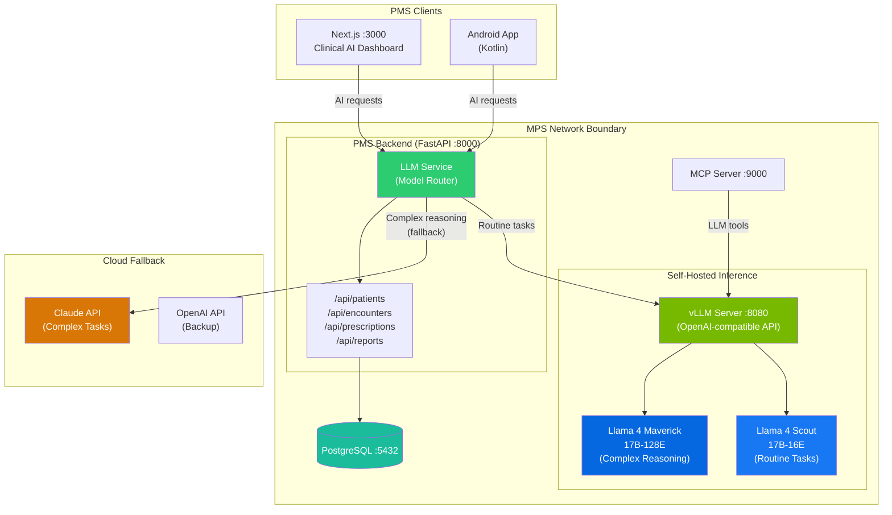

# Product Requirements Document: Llama 4 Scout/Maverick Integration into Patient Management System (PMS)

**Document ID:** PRD-PMS-LLAMA4-001
**Version:** 1.0
**Date:** March 9, 2026
**Author:** Ammar (CEO, MPS Inc.)
**Status:** Draft

---

## 1. Executive Summary

Llama 4 is Meta's latest family of open-weight, natively multimodal AI models built on a Mixture-of-Experts (MoE) architecture. The family includes **Llama 4 Scout** (17B active parameters, 16 experts, 109B total, 10M token context window) and **Llama 4 Maverick** (17B active parameters, 128 experts, 400B total, 1M token context window). Both models are trained on 40 trillion tokens across 200 languages with early-fusion multimodal capabilities spanning text, image, and video understanding. Scout fits on a single H100 GPU with INT4 quantization, while Maverick requires 3-5 H100 GPUs depending on quantization level.

Integrating Llama 4 into the PMS provides a **self-hosted, HIPAA-compliant AI backbone** that eliminates per-token cloud API costs and ensures PHI never leaves the facility network. The models' MoE architecture activates only 17B parameters per token — delivering inference speed comparable to much smaller models while maintaining the knowledge capacity of 100B+ parameter systems. Scout's industry-leading 10M token context window enables processing entire patient histories (thousands of encounters, lab results, and clinical notes) in a single inference call — a capability no other open-weight model offers.

Combined with the existing vLLM inference engine (experiment 52), Llama 4 gives the PMS a complete self-hosted AI stack: vLLM provides the optimized serving infrastructure, and Llama 4 provides the model weights. This replaces dependency on cloud APIs (Claude, GPT) for latency-sensitive clinical workflows like real-time encounter summarization, medication interaction analysis, and clinical decision support — while keeping cloud APIs available as fallback for complex reasoning tasks via the Claude Model Selection strategy (experiment 15).

---

## 2. Problem Statement

The current PMS relies on cloud-hosted AI APIs for clinical intelligence features:

- **Per-token cost at scale:** Every clinical note summarization, ICD-10 code suggestion, and patient communication draft incurs cloud API charges. At 50+ encounters per day with average 2,000 tokens each, API costs for AI-assisted documentation alone exceed $500/month and scale linearly.
- **PHI egress risk:** Sending patient encounter notes, medication lists, and clinical observations to external cloud APIs creates HIPAA compliance exposure. Even with BAAs, data leaves the facility's network boundary for every AI inference call.
- **Latency for real-time workflows:** Cloud API round-trips add 500ms-2s latency to clinical workflows. For real-time use cases — ambient documentation during encounters, medication interaction checks at point-of-prescribing — this latency disrupts clinical flow.
- **Context limitations:** Current cloud models support 128K-200K token context windows. Complex patients with 5+ years of encounter history, multiple specialists, and extensive lab records can exceed these limits, requiring chunking strategies that lose holistic clinical context.
- **Single-vendor dependency:** Relying exclusively on one cloud AI provider creates business continuity risk. API deprecations, pricing changes, or service outages directly impact PMS clinical features.
- **Limited multimodal clinical support:** The PMS handles dermoscopic images (experiment 18, ISIC Archive), wound photographs, and scanned clinical documents. Current text-only AI integration cannot reason over these visual clinical artifacts alongside text records.

---

## 3. Proposed Solution

Deploy **Llama 4 Scout** as the primary self-hosted model for routine clinical AI tasks, with **Llama 4 Maverick** available for complex multi-expert reasoning. Both models run on the existing vLLM inference engine (experiment 52) within the MPS network boundary, served via an OpenAI-compatible API.

### 3.1 Architecture Overview

### 3.2 Deployment Model

- **Self-hosted on GPU server:** Llama 4 Scout (INT4) runs on a single H100 80GB GPU within the MPS data center. Maverick (INT4) requires 3× H100 GPUs for full deployment.
- **Docker-based:** Both models run as vLLM Docker containers with GPU passthrough, integrated into the existing `docker-compose.yml` stack.
- **OpenAI-compatible API:** vLLM exposes Llama 4 models via the same OpenAI-compatible API used by the existing LLM Service, requiring zero code changes in the PMS backend.
- **HIPAA security envelope:** All inference happens within the MPS network boundary. Model weights are downloaded once and stored locally. No PHI leaves the facility during inference.
- **Model routing:** The LLM Service (experiment 15) routes requests to Scout for routine tasks (summarization, code suggestion, patient communication) and to Maverick or cloud APIs for complex clinical reasoning (differential diagnosis, multi-system drug interaction analysis).

---

## 4. PMS Data Sources

The Llama 4 integration interacts with all PMS data sources through the existing LLM Service:

| PMS API / Data Source | Llama 4 Use Case | Model | Context Needs |
|---|---|---|---|
| `/api/patients` | Patient record summarization, demographic data extraction | Scout | Low (< 4K tokens) |
| `/api/encounters` | SOAP note generation, encounter summarization, clinical timeline synthesis | Scout/Maverick | Medium-High (10K-100K tokens for full history) |
| `/api/prescriptions` | Medication interaction analysis, dosage verification, RxNorm code suggestion | Scout | Medium (5K-20K tokens) |
| `/api/reports` | Lab result interpretation, trend analysis, diagnostic report summarization | Scout | Medium (5K-50K tokens) |
| ISIC Archive images (exp 18) | Dermoscopic image classification assistance, visual clinical context | Maverick | Multimodal (text + image) |
| Clinical documents | Scanned referral letters, faxed records OCR and summarization | Scout | Multimodal (text + image) |

Scout's 10M token context window enables processing a patient's **entire clinical history** in a single inference call — no chunking, no context loss.

---

## 5. Component/Module Definitions

### 5.1 Llama 4 Model Configuration

**Description:** vLLM server configuration for serving Llama 4 Scout and Maverick models with optimal quantization and context settings.

- **Input:** Model weight files (downloaded from Meta/HuggingFace)
- **Output:** OpenAI-compatible API endpoint at `:8080`
- **PMS APIs used:** None (infrastructure component)

### 5.2 Clinical Prompt Templates

**Description:** Healthcare-specific prompt templates optimized for Llama 4's instruction format, covering all PMS clinical AI tasks.

- **Input:** PMS clinical data (encounter notes, medication lists, lab results) + task specification
- **Output:** Structured clinical AI responses (SOAP notes, ICD-10 codes, patient communications)
- **PMS APIs used:** `/api/encounters`, `/api/prescriptions`, `/api/reports`

### 5.3 Model Router Enhancement

**Description:** Extension of the existing LLM Service (experiment 15) to include Llama 4 Scout and Maverick as routing targets alongside cloud APIs.

- **Input:** AI request with task complexity classification
- **Output:** Routed request to optimal model (Scout → routine, Maverick → complex, Claude → highest complexity)
- **PMS APIs used:** All PMS endpoints (via existing LLM Service)

### 5.4 Multimodal Clinical Processor

**Description:** Pipeline for combining clinical images (dermoscopic photos, scanned documents) with text records for multimodal inference.

- **Input:** Clinical images (JPEG/PNG) + associated text records
- **Output:** Image-aware clinical analysis (lesion classification, document extraction)
- **PMS APIs used:** `/api/patients` (image records), ISIC Archive integration (experiment 18)

### 5.5 Long-Context Patient History Assembler

**Description:** Service that assembles a patient's complete clinical history into a single context window for comprehensive analysis.

- **Input:** Patient ID
- **Output:** Assembled clinical history (encounters, medications, labs, notes) within Scout's 10M token context
- **PMS APIs used:** `/api/patients`, `/api/encounters`, `/api/prescriptions`, `/api/reports`

---

## 6. Non-Functional Requirements

### 6.1 Security and HIPAA Compliance

| Requirement | Implementation |
|---|---|
| PHI isolation | All inference on-premises; no PHI transmitted to external services |
| Model weight security | Weights stored on encrypted volumes (AES-256); access restricted to vLLM service account |
| Prompt/response logging | All clinical prompts and responses logged to PostgreSQL audit table with retention per HIPAA (7 years) |
| Access control | LLM Service enforces RBAC — only authenticated clinicians can trigger clinical AI tasks |
| Input sanitization | All clinical text sanitized before prompt construction to prevent prompt injection |
| Output validation | AI-generated clinical content (ICD-10 codes, medication suggestions) validated against known code sets before display |
| Network isolation | vLLM container on internal Docker network only; no external port exposure |
| BAA not required | Self-hosted deployment eliminates need for Business Associate Agreement with AI vendor |

### 6.2 Performance

| Metric | Target (Scout) | Target (Maverick) |
|---|---|---|
| Time to first token | < 200ms | < 500ms |
| Token generation rate | > 40 tokens/sec | > 25 tokens/sec |
| Concurrent requests | 10 simultaneous | 5 simultaneous |
| Context assembly (full patient history) | < 3s for 100K tokens | < 5s for 500K tokens |
| SOAP note generation | < 10s end-to-end | < 15s end-to-end |
| ICD-10 code suggestion | < 5s for 5 suggestions | < 8s for 10 suggestions |
| Multimodal image+text analysis | N/A (text-primary) | < 15s per image |

### 6.3 Infrastructure

| Component | Specification |
|---|---|
| GPU (Scout INT4) | 1× NVIDIA H100 80GB (or 2× A100 80GB) |
| GPU (Maverick INT4) | 3× NVIDIA H100 80GB |
| CPU | 16+ cores recommended |
| RAM | 64 GB minimum, 128 GB recommended |
| Storage | 250 GB for model weights + quantized variants |
| Docker | NVIDIA Container Toolkit + GPU passthrough |
| vLLM version | v0.8.3+ (Llama 4 support) |
| Network | Internal Docker network; no external port exposure |

---

## 7. Implementation Phases

### Phase 1: Scout Foundation (Sprints 1-3, ~6 weeks)

- Download and validate Llama 4 Scout (INT4) model weights
- Configure vLLM server with Scout model and optimal settings
- Adapt existing clinical prompt templates for Llama 4 instruction format
- Update LLM Service model router to include Scout as primary routing target
- Implement SOAP note generation with Scout
- Benchmark Scout against current cloud API performance
- Add prompt/response audit logging

### Phase 2: Clinical Workflow Integration (Sprints 4-6, ~6 weeks)

- Implement ICD-10/CPT code suggestion pipeline
- Build medication interaction analysis with Scout
- Create patient communication drafting (appointment reminders, post-visit summaries)
- Implement Long-Context Patient History Assembler
- Build A/B testing framework: Scout vs cloud API quality comparison
- Performance tuning and load testing with concurrent clinical users

### Phase 3: Maverick + Multimodal (Sprints 7-9, ~6 weeks)

- Deploy Llama 4 Maverick for complex reasoning tasks
- Implement multimodal clinical processor (dermoscopic images + text)
- Build differential diagnosis assistant using Maverick's 128-expert architecture
- Integrate with ISIC Archive (experiment 18) for image-aware dermatology CDS
- Implement fallback chain: Scout → Maverick → Claude API
- Clinical validation study with physician review of AI outputs

---

## 8. Success Metrics

| Metric | Target | Measurement Method |
|---|---|---|
| Cloud API cost reduction | > 70% reduction in per-token AI costs | Monthly API billing comparison |
| SOAP note generation quality | > 90% physician acceptance rate (no edits needed) | Physician review of 100 generated notes |
| ICD-10 code accuracy | > 85% top-3 accuracy on encounter coding | Comparison against human coder selections |
| Inference latency (Scout) | < 200ms TTFT, > 40 tok/s generation | Prometheus metrics from vLLM |
| PHI egress elimination | 0 clinical AI calls to external APIs for routine tasks | Network traffic audit |
| Uptime | 99.5% availability for Scout inference | Uptime monitoring |
| Context utilization | Successfully process 100K+ token patient histories | Log analysis of context lengths |
| Clinician satisfaction | > 4.0/5.0 rating on AI-assisted workflows | Quarterly clinician survey |

---

## 9. Risks and Mitigations

| Risk | Impact | Mitigation |
|---|---|---|
| GPU hardware cost ($30K+ per H100) | High — significant capital expenditure | Start with Scout INT4 on single H100; defer Maverick until ROI proven on Scout. Consider cloud GPU rental (RunPod, Vast.ai) as interim solution. |
| Model hallucination on clinical content | High — incorrect medical information | Implement output validation against ICD-10/RxNorm code sets; require physician review for all clinical suggestions; never auto-apply AI outputs without human confirmation. |
| Benchmark reproducibility concerns | Medium — independent evaluations could not reproduce Meta's claimed benchmarks | Run internal clinical benchmarks on PMS-specific tasks before production deployment; don't rely solely on Meta's published numbers. |
| Quantization quality degradation | Medium — INT4 may reduce output quality vs FP16 | Benchmark INT4 vs FP16 on clinical tasks; upgrade to FP8/FP16 if quality gap exceeds 5% on clinical accuracy metrics. |
| Model update cadence | Low — Meta releases new versions periodically | Design model weight storage for easy swaps; version-pin in production; test new releases in staging before promotion. |
| Llama 4 license restrictions | Low — not fully open-source (open weights) | Review Meta's Llama 4 license for commercial healthcare use; license currently permits commercial use with no revenue cap. |
| GPU memory contention under load | Medium — concurrent requests may exceed GPU memory | Configure vLLM max concurrent requests; implement request queuing; monitor GPU memory utilization with alerts. |

---

## 10. Dependencies

| Dependency | Type | Version | Purpose |
|---|---|---|---|
| Llama 4 Scout weights | Model | 17B-16E-Instruct | Primary self-hosted model for routine clinical tasks |
| Llama 4 Maverick weights | Model | 17B-128E-Instruct | Complex reasoning and multimodal clinical analysis |
| vLLM | Inference engine | v0.8.3+ | Model serving with PagedAttention (experiment 52) |
| NVIDIA H100 GPU | Hardware | 80GB HBM3 | GPU compute for model inference |
| NVIDIA Container Toolkit | Docker plugin | Latest | GPU passthrough for Docker containers |
| CUDA | Driver | 12.x+ | GPU compute framework |
| FastAPI | Python framework | 0.110+ | PMS backend hosting LLM Service |
| PostgreSQL | Database | 16+ | Audit logging for prompts/responses |
| Claude API | Cloud service | Opus 4.6 | Fallback for highest-complexity tasks |
| `openai` Python package | Client library | 1.x+ | OpenAI-compatible client for vLLM requests |

---

## 11. Comparison with Existing Experiments

| Aspect | Llama 4 (This Experiment) | vLLM (Experiment 52) | Gemma 3 (Experiment 13) | Claude Model Selection (Experiment 15) |
|---|---|---|---|---|
| **What it provides** | Model weights (the "brain") | Inference engine (the "server") | Alternative open-weight model | Model routing strategy |
| **Parameters** | 17B active / 109B-400B total (MoE) | N/A (serving infrastructure) | 1B-27B (dense) | N/A (routing logic) |
| **Context window** | 10M (Scout) / 1M (Maverick) | Limited by model + GPU memory | 128K | Determined by target model |
| **Multimodal** | Native (text + image + video) | Supports multimodal models | Native (text + image) | Determined by target model |
| **Architecture** | Mixture-of-Experts (MoE) | N/A | Dense transformer | N/A |
| **GPU requirements** | 1× H100 (Scout INT4) | Shared with model | 1× consumer GPU (27B INT4) | No GPU (routing only) |
| **Complementarity** | Llama 4 provides the model that runs ON vLLM | vLLM is the required serving engine for Llama 4 | Gemma 3 is a lighter alternative for simpler tasks; Llama 4 handles complex/multimodal tasks | Model Selection routes between Llama 4 (local) and Claude (cloud) based on task complexity |

**Key relationship:** Experiments 52 (vLLM) and 53 (Llama 4) form a **complete self-hosted AI stack** — vLLM is the engine, Llama 4 is the fuel. Experiment 15 (Claude Model Selection) orchestrates when to use this local stack vs cloud APIs. Experiment 13 (Gemma 3) provides a lighter-weight alternative for resource-constrained deployments or simpler tasks where Scout's 109B parameters are overkill.

---

## 12. Research Sources

### Official Documentation
- [The Llama 4 Herd: Multimodal AI Innovation (Meta AI Blog)](https://ai.meta.com/blog/llama-4-multimodal-intelligence/) — Official announcement with architecture details, benchmark results, and training methodology
- [Llama 4 Model Card (llama.com)](https://www.llama.com/models/llama-4/) — Performance benchmarks, model specifications, and comparison tables
- [Llama 4 Scout on Hugging Face](https://huggingface.co/meta-llama/Llama-4-Scout-17B-16E) — Model weights, configuration, and community discussion
- [Llama 4 License (GitHub)](https://github.com/meta-llama/llama-models/blob/main/models/llama4/LICENSE) — Commercial use terms and restrictions

### Deployment & Infrastructure
- [Llama 4 in vLLM (vLLM Blog)](https://blog.vllm.ai/2025/04/05/llama4.html) — vLLM v0.8.3 support, GPU requirements, context window configuration
- [Deploy Llama 4 on GPU Cloud (Spheron)](https://www.spheron.network/blog/deploy-llama-4-gpu-cloud/) — Complete deployment guide with vLLM and quantization options
- [Llama 4 GPU System Requirements (APXML)](https://apxml.com/posts/llama-4-system-requirements) — Detailed GPU memory calculations for Scout and Maverick
- [NVIDIA Accelerates Llama 4 Inference (NVIDIA Blog)](https://developer.nvidia.com/blog/nvidia-accelerates-inference-on-meta-llama-4-scout-and-maverick/) — H100/Blackwell optimization and TensorRT-LLM support

### Security & Healthcare
- [Self-Hosted Llama for Regulated Industries (llama.com)](https://www.llama.com/docs/deployment/regulated-industry-self-hosting/) — HIPAA deployment guidance, PHI isolation patterns
- [HIPAA Compliance for LLMs in Healthcare (TechMagic)](https://www.techmagic.co/blog/hipaa-compliant-llms) — Self-hosted model compliance requirements

### Benchmarks & Evaluation
- [Llama 4 Comparison with Claude, GPT, Gemini (Bind AI)](https://blog.getbind.co/2025/04/06/llama-4-comparison-with-claude-3-7-sonnet-gpt-4-5-and-gemini-2-5/) — Independent benchmark comparison and reproducibility analysis

---

## 13. Appendix: Related Documents

- [Llama 4 Setup Guide](53-Llama4-PMS-Developer-Setup-Guide.md) — Step-by-step Llama 4 deployment on vLLM with PMS integration
- [Llama 4 Developer Tutorial](53-Llama4-Developer-Tutorial.md) — Hands-on onboarding: build clinical AI features with self-hosted Llama 4
- [PRD: vLLM PMS Integration](52-PRD-vLLM-PMS-Integration.md) — Required inference engine for serving Llama 4
- [PRD: Claude Model Selection](15-PRD-ClaudeModelSelection-PMS-Integration.md) — Model routing strategy (Llama 4 local + Claude cloud)
- [PRD: Gemma 3 PMS Integration](13-PRD-Gemma3-PMS-Integration.md) — Alternative lighter-weight open model
- [Meta Llama 4 Official Site](https://www.llama.com/models/llama-4/)
