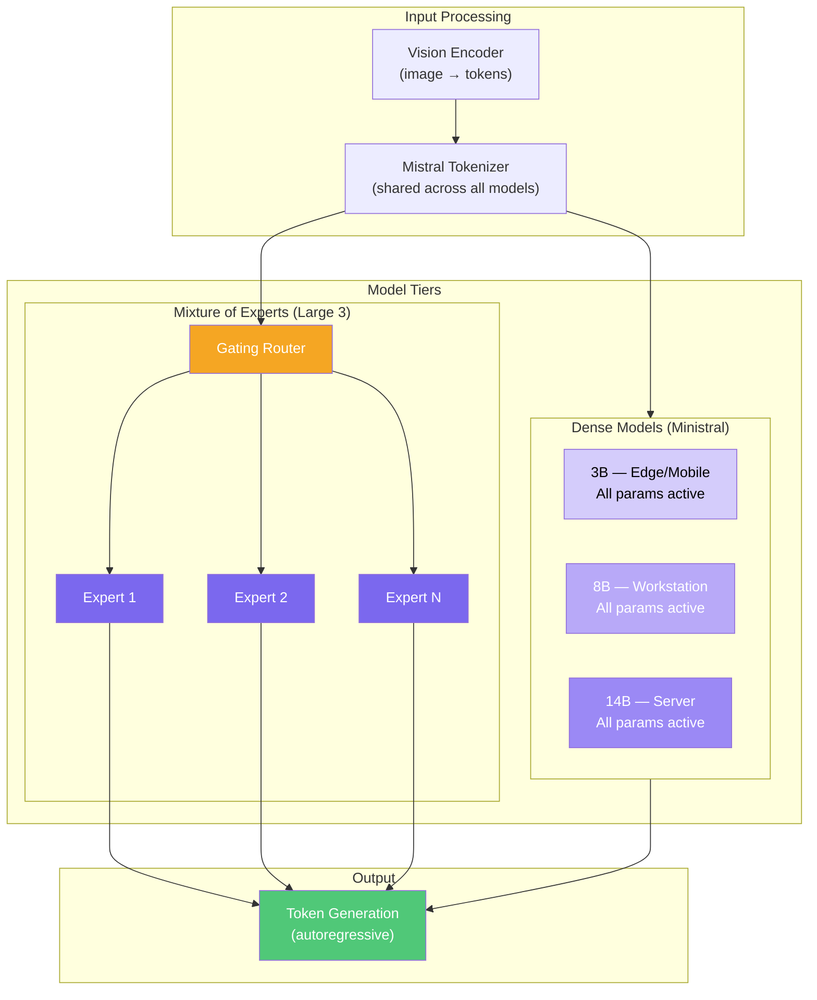
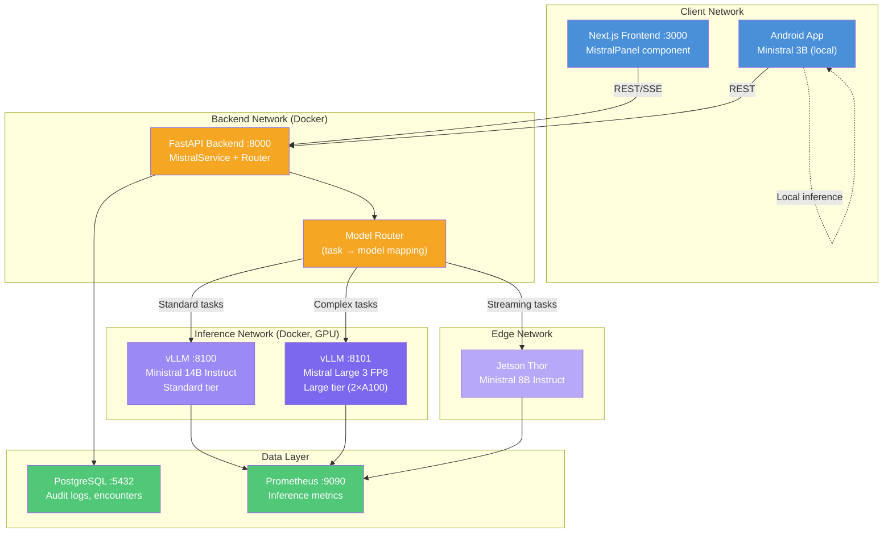

# Mistral 3 Family Developer Onboarding Tutorial

**Welcome to the MPS PMS Mistral 3 Integration Team**

This tutorial will take you from zero to building your first Mistral 3 integration with the PMS. By the end, you will understand how the Mistral 3 model family works, have a running local environment, and have built and tested a custom clinical workflow integration end-to-end.

**Document ID:** PMS-EXP-MISTRAL3-002
**Version:** 1.0
**Date:** 2026-03-09
**Applies To:** PMS project (all platforms)
**Prerequisite:** [Mistral 3 Setup Guide](54-Mistral3-PMS-Developer-Setup-Guide.md)
**Estimated time:** 2-3 hours
**Difficulty:** Beginner-friendly

---

## What You Will Learn

1. What the Mistral 3 model family is and why it matters for healthcare AI
2. How Mixture-of-Experts (MoE) architecture differs from dense models
3. How to choose the right model tier (3B / 8B / 14B / Large 3) for each clinical task
4. How Mistral 3 fits alongside Gemma 3, Qwen 3.5, and vLLM in the PMS AI stack
5. How to generate structured SOAP notes from encounter transcripts
6. How to build a medication interaction analyzer with reasoning chains
7. How to use Mistral 3's multimodal capabilities for clinical document analysis
8. How to stream AI responses in real-time to the PMS Frontend
9. How to evaluate and compare model quality across the Mistral 3 family
10. How to debug common inference issues and optimize performance

---

## Part 1: Understanding Mistral 3 (15 min read)

### 1.1 What Problem Does Mistral 3 Solve?

In a busy ophthalmology clinic, physicians spend significant time on documentation — writing SOAP notes, checking drug interactions, reading referral letters, and drafting patient communications. The PMS already integrates several AI models, but each has limitations:

- **Gemma 3 (27B):** Good for general tasks but too large for edge devices and lacks dedicated reasoning variants
- **Qwen 3.5 (32B):** Strong reasoning but no multimodal support, too large for tablets
- **Claude/GPT (cloud):** Excellent quality but sends PHI over the internet, variable costs

Mistral 3 solves this by providing a **single model family** spanning 3B to 675B parameters — all sharing the same tokenizer, instruction format, and quality characteristics. A clinic can run the 3B model on a tablet for quick triage, the 14B model on a workstation for note generation, and the 675B Large 3 for complex differential diagnosis — all on-premise, zero PHI egress, consistent output formatting.

### 1.2 How Mistral 3 Works — The Key Pieces



**Concept 1: Dense vs Sparse (MoE)**
- The Ministral models (3B, 8B, 14B) are **dense** — every parameter is used for every token. Simple, predictable, fast.
- Mistral Large 3 is **sparse MoE** — it has 675B total parameters but only activates 41B per token. A learned "router" selects which expert sub-networks to use for each token. This gives Large 3 the knowledge of a 675B model at the compute cost of a ~40B model.

**Concept 2: Variants (Base / Instruct / Reasoning)**
- **Base:** Pre-trained foundation; for fine-tuning only
- **Instruct:** Chat-optimized; follows instructions, answers questions — this is what we deploy for PMS
- **Reasoning:** Extended thinking mode; works through problems step-by-step before answering — use for complex clinical reasoning

**Concept 3: Multimodal**
All Mistral 3 models accept both text and images. This means the same model that generates SOAP notes can also read a scanned referral letter or analyze a clinical photograph.

### 1.3 How Mistral 3 Fits with Other PMS Technologies

| Aspect | Mistral 3 (Exp 54) | Gemma 3 (Exp 13) | Qwen 3.5 (Exp 20) | Claude API (Exp 15) |
|--------|--------------------|--------------------|---------------------|---------------------|
| **Hosting** | Self-hosted | Self-hosted | Self-hosted | Cloud API |
| **PHI Safety** | No egress | No egress | No egress | PHI de-identification required |
| **Size Range** | 3B – 675B | 27B only | 32B only | N/A (cloud) |
| **Edge Deploy** | Yes (3B) | No | No | No |
| **Multimodal** | Yes (all) | Yes (PaliGemma) | Limited | Yes |
| **Reasoning Mode** | Dedicated variant | No | Thinking mode | Extended thinking |
| **License** | Apache 2.0 | Gemma license | Apache 2.0 | Commercial |
| **Best For** | Full-stack (edge→server) | General clinical tasks | Complex reasoning | Highest-quality output |
| **PMS Role** | Primary on-premise backbone | Fallback / comparison | Reasoning specialist | Escalation tier |

### 1.4 Key Vocabulary

| Term | Meaning |
|------|---------|
| **MoE** | Mixture of Experts — architecture where a router activates a subset of expert networks per token |
| **Active Parameters** | Parameters used per inference step (41B for Large 3 out of 675B total) |
| **Dense Model** | Architecture where all parameters are used for every token (Ministral 3B/8B/14B) |
| **Instruct Variant** | Model fine-tuned to follow instructions and engage in conversations |
| **Reasoning Variant** | Model that "thinks" step-by-step before producing a final answer |
| **Tokenizer** | Component that converts text to/from numerical tokens; shared across all Mistral 3 models |
| **Context Window** | Maximum input + output length; 128K–256K tokens for Mistral 3 |
| **FP8 / NVFP4** | Quantization formats that reduce model size and memory usage with minimal quality loss |
| **Tensor Parallelism** | Splitting a model across multiple GPUs for faster inference |
| **PagedAttention** | vLLM's memory management technique that reduces GPU memory waste |
| **Gating Router** | Neural network in MoE that decides which experts handle each token |
| **Model Tier** | PMS concept: "standard" (Ministral 14B) vs "large" (Mistral Large 3) for routing |

### 1.5 Our Architecture



---

## Part 2: Environment Verification (15 min)

### 2.1 Checklist

Run each command and confirm the expected output:

1. **Docker is running:**
   ```bash
   docker info --format '{{.ServerVersion}}'
   # Expected: 24.x or higher
   ```

2. **GPU is available:**
   ```bash
   nvidia-smi --query-gpu=name,memory.total --format=csv,noheader
   # Expected: e.g., "NVIDIA A100-SXM4-80GB, 81920 MiB"
   ```

3. **Ministral 14B is serving:**
   ```bash
   curl -s http://localhost:8100/v1/models | python3 -c "import sys,json; print(json.load(sys.stdin)['data'][0]['id'])"
   # Expected: ministral-14b-instruct
   ```

4. **PMS Backend is running:**
   ```bash
   curl -s http://localhost:8000/api/ai/mistral/health | python3 -m json.tool
   # Expected: {"ministral-14b": "healthy", ...}
   ```

5. **PMS Frontend is running:**
   ```bash
   curl -s -o /dev/null -w "%{http_code}" http://localhost:3000
   # Expected: 200
   ```

### 2.2 Quick Test

Run a single end-to-end inference through the PMS Backend:

```bash
curl -s http://localhost:8000/api/ai/mistral/generate-note \
  -H "Content-Type: application/json" \
  -H "Authorization: Bearer $PMS_TOKEN" \
  -d '{
    "encounter_transcript": "Follow-up for glaucoma. IOP 14 both eyes on latanoprost. Stable fields. Continue current regimen.",
    "note_type": "progress"
  }' | python3 -m json.tool
```

If you see a structured progress note in the response, your environment is ready.

---

## Part 3: Build Your First Integration (45 min)

### 3.1 What We Are Building

We'll build an **Ophthalmology Encounter Summarizer** — a service that takes a raw encounter transcript, generates a structured SOAP note with ICD-10/CPT codes, and stores it alongside the encounter record in PostgreSQL.

The flow:
1. Physician dictates or types encounter notes
2. PMS Backend receives the transcript via `/api/encounters/{id}/summarize`
3. MistralService generates a structured SOAP note
4. The note is stored in the `encounter_ai_notes` table
5. Frontend displays the AI-generated note for physician review and approval

### 3.2 Create the Database Migration

Create `alembic/versions/xxxx_add_encounter_ai_notes.py`:

```python
"""Add encounter AI notes table.

Revision ID: a1b2c3d4e5f6
"""
from alembic import op
import sqlalchemy as sa
from sqlalchemy.dialects.postgresql import JSONB

revision = "a1b2c3d4e5f6"
down_revision = None  # Set to your latest revision


def upgrade():
    op.create_table(
        "encounter_ai_notes",
        sa.Column("id", sa.Integer(), primary_key=True),
        sa.Column("encounter_id", sa.Integer(), sa.ForeignKey("encounters.id"), nullable=False),
        sa.Column("note_type", sa.String(20), nullable=False),  # soap, progress, discharge
        sa.Column("model_name", sa.String(50), nullable=False),
        sa.Column("model_tier", sa.String(20), nullable=False),
        sa.Column("generated_note", sa.Text(), nullable=False),
        sa.Column("icd10_suggestions", JSONB, default=[]),
        sa.Column("cpt_suggestions", JSONB, default=[]),
        sa.Column("physician_approved", sa.Boolean(), default=False),
        sa.Column("physician_edits", sa.Text(), nullable=True),
        sa.Column("prompt_tokens", sa.Integer()),
        sa.Column("completion_tokens", sa.Integer()),
        sa.Column("latency_ms", sa.Float()),
        sa.Column("created_at", sa.DateTime(), server_default=sa.func.now()),
        sa.Column("approved_at", sa.DateTime(), nullable=True),
        sa.Column("approved_by", sa.Integer(), sa.ForeignKey("users.id"), nullable=True),
    )
    op.create_index("ix_encounter_ai_notes_encounter_id", "encounter_ai_notes", ["encounter_id"])


def downgrade():
    op.drop_table("encounter_ai_notes")
```

### 3.3 Create the SQLAlchemy Model

Add to `app/models/encounter_ai_note.py`:

```python
"""SQLAlchemy model for AI-generated encounter notes."""

from sqlalchemy import Column, Integer, String, Text, Boolean, Float, DateTime, ForeignKey
from sqlalchemy.dialects.postgresql import JSONB
from sqlalchemy.sql import func

from app.db.base import Base


class EncounterAINote(Base):
    __tablename__ = "encounter_ai_notes"

    id = Column(Integer, primary_key=True)
    encounter_id = Column(Integer, ForeignKey("encounters.id"), nullable=False)
    note_type = Column(String(20), nullable=False)
    model_name = Column(String(50), nullable=False)
    model_tier = Column(String(20), nullable=False)
    generated_note = Column(Text, nullable=False)
    icd10_suggestions = Column(JSONB, default=[])
    cpt_suggestions = Column(JSONB, default=[])
    physician_approved = Column(Boolean, default=False)
    physician_edits = Column(Text, nullable=True)
    prompt_tokens = Column(Integer)
    completion_tokens = Column(Integer)
    latency_ms = Column(Float)
    created_at = Column(DateTime, server_default=func.now())
    approved_at = Column(DateTime, nullable=True)
    approved_by = Column(Integer, ForeignKey("users.id"), nullable=True)
```

### 3.4 Create the Encounter Summarizer Service

Create `app/services/encounter_summarizer.py`:

```python
"""Encounter summarization service using Mistral 3."""

import json
import re
import time
import logging
from dataclasses import dataclass

from app.services.mistral_service import mistral_service

logger = logging.getLogger(__name__)

SUMMARIZER_SYSTEM_PROMPT = """You are an ophthalmology clinical documentation assistant for the MPS Patient Management System.

Given an encounter transcript, generate a structured SOAP note.

Output format (JSON):
{
  "subjective": "Patient's reported symptoms and history",
  "objective": "Clinical findings, measurements, test results",
  "assessment": "Clinical assessment and diagnoses",
  "plan": "Treatment plan and follow-up",
  "icd10_codes": [{"code": "H35.32", "description": "Exudative AMD, bilateral", "confidence": 0.92}],
  "cpt_codes": [{"code": "67028", "description": "Intravitreal injection", "confidence": 0.95}]
}

Rules:
- Only include findings explicitly stated in the transcript
- Do not fabricate measurements or findings
- Use standard ophthalmology terminology
- ICD-10 codes must be valid and specific (use laterality qualifiers)
- CPT codes must match the procedures described
- Confidence scores: 0.0-1.0 indicating certainty
- If uncertain about a code, include it with confidence < 0.7"""


@dataclass
class SummarizedNote:
    subjective: str
    objective: str
    assessment: str
    plan: str
    icd10_codes: list[dict]
    cpt_codes: list[dict]
    full_note: str
    model_name: str
    model_tier: str
    latency_ms: float


async def summarize_encounter(
    transcript: str,
    patient_context: str = "",
    note_type: str = "soap",
    user_id: str = "",
) -> SummarizedNote:
    """Generate a structured SOAP note from an encounter transcript."""

    # Choose model tier based on transcript complexity
    model_tier = "large" if len(transcript) > 5000 or "differential" in transcript.lower() else "standard"

    prompt = f"""Patient Context: {patient_context}

Encounter Transcript:
{transcript}

Generate a structured {note_type.upper()} note in JSON format."""

    start_time = time.monotonic()

    result = await mistral_service.generate(
        prompt=prompt,
        system_prompt=SUMMARIZER_SYSTEM_PROMPT,
        model_tier=model_tier,
        max_tokens=2048,
        temperature=0.1,
        user_id=user_id,
    )

    latency_ms = (time.monotonic() - start_time) * 1000

    # Parse JSON from response
    try:
        # Extract JSON from potential markdown code blocks
        json_match = re.search(r"```json\s*(.*?)\s*```", result, re.DOTALL)
        if json_match:
            parsed = json.loads(json_match.group(1))
        else:
            parsed = json.loads(result)
    except json.JSONDecodeError:
        logger.warning("Failed to parse JSON from Mistral response, using raw text")
        parsed = {
            "subjective": result,
            "objective": "",
            "assessment": "",
            "plan": "",
            "icd10_codes": [],
            "cpt_codes": [],
        }

    # Build the full formatted note
    full_note = f"""SUBJECTIVE:
{parsed.get('subjective', '')}

OBJECTIVE:
{parsed.get('objective', '')}

ASSESSMENT:
{parsed.get('assessment', '')}

PLAN:
{parsed.get('plan', '')}"""

    return SummarizedNote(
        subjective=parsed.get("subjective", ""),
        objective=parsed.get("objective", ""),
        assessment=parsed.get("assessment", ""),
        plan=parsed.get("plan", ""),
        icd10_codes=parsed.get("icd10_codes", []),
        cpt_codes=parsed.get("cpt_codes", []),
        full_note=full_note,
        model_name="ministral-14b-instruct" if model_tier == "standard" else "mistral-large-3",
        model_tier=model_tier,
        latency_ms=round(latency_ms, 1),
    )
```

### 3.5 Create the API Endpoint

Add to `app/api/endpoints/encounters.py` (or create a new file):

```python
"""Encounter summarization endpoints."""

from fastapi import APIRouter, Depends, HTTPException
from pydantic import BaseModel
from sqlalchemy.ext.asyncio import AsyncSession

from app.api.deps import get_current_user, get_db
from app.models.encounter_ai_note import EncounterAINote
from app.services.encounter_summarizer import summarize_encounter

router = APIRouter(prefix="/api/encounters", tags=["encounters"])


class SummarizeRequest(BaseModel):
    transcript: str
    patient_context: str = ""
    note_type: str = "soap"


class ApproveRequest(BaseModel):
    physician_edits: str | None = None


@router.post("/{encounter_id}/summarize")
async def summarize_encounter_endpoint(
    encounter_id: int,
    request: SummarizeRequest,
    current_user=Depends(get_current_user),
    db: AsyncSession = Depends(get_db),
):
    """Generate an AI SOAP note for an encounter."""

    note = await summarize_encounter(
        transcript=request.transcript,
        patient_context=request.patient_context,
        note_type=request.note_type,
        user_id=str(current_user.id),
    )

    # Store in database
    db_note = EncounterAINote(
        encounter_id=encounter_id,
        note_type=request.note_type,
        model_name=note.model_name,
        model_tier=note.model_tier,
        generated_note=note.full_note,
        icd10_suggestions=note.icd10_codes,
        cpt_suggestions=note.cpt_codes,
        latency_ms=note.latency_ms,
    )
    db.add(db_note)
    await db.commit()
    await db.refresh(db_note)

    return {
        "id": db_note.id,
        "note": {
            "subjective": note.subjective,
            "objective": note.objective,
            "assessment": note.assessment,
            "plan": note.plan,
        },
        "icd10_codes": note.icd10_codes,
        "cpt_codes": note.cpt_codes,
        "model": note.model_name,
        "latency_ms": note.latency_ms,
        "physician_approved": False,
    }


@router.post("/{encounter_id}/ai-notes/{note_id}/approve")
async def approve_ai_note(
    encounter_id: int,
    note_id: int,
    request: ApproveRequest,
    current_user=Depends(get_current_user),
    db: AsyncSession = Depends(get_db),
):
    """Physician approves (with optional edits) an AI-generated note."""
    from sqlalchemy import select, func

    result = await db.execute(
        select(EncounterAINote).where(
            EncounterAINote.id == note_id,
            EncounterAINote.encounter_id == encounter_id,
        )
    )
    db_note = result.scalar_one_or_none()
    if not db_note:
        raise HTTPException(status_code=404, detail="AI note not found")

    db_note.physician_approved = True
    db_note.approved_by = current_user.id
    db_note.approved_at = func.now()
    if request.physician_edits:
        db_note.physician_edits = request.physician_edits

    await db.commit()
    return {"status": "approved", "note_id": note_id}
```

### 3.6 Test the Integration

```bash
# Generate a SOAP note for encounter #1
curl -s http://localhost:8000/api/encounters/1/summarize \
  -H "Content-Type: application/json" \
  -H "Authorization: Bearer $PMS_TOKEN" \
  -d '{
    "transcript": "Patient is a 65-year-old female here for cataract evaluation. She reports progressive blurry vision in the left eye over the past 6 months, worse with driving at night. No pain, redness, or flashes. Past ocular history significant for dry eye syndrome. Current medications: artificial tears QID. Visual acuity OD 20/25, OS 20/60. IOP 16 OD, 17 OS. Slit lamp shows 2+ nuclear sclerotic cataract OS, trace cortical cataract OD. Dilated fundus exam unremarkable bilaterally. Assessment: Visually significant nuclear sclerotic cataract OS. Plan: Discussed risks, benefits, and alternatives of cataract surgery. Patient interested in proceeding. Schedule phacoemulsification with IOL implantation OS. Pre-op labs and clearance. Return in 2 weeks for pre-op measurements.",
    "patient_context": "65F, dry eye syndrome, bilateral cataracts (OS > OD)"
  }' | python3 -m json.tool
```

**Expected:** Structured SOAP note with ICD-10 codes like H25.11 (age-related nuclear cataract, right eye), H25.12 (left eye), and CPT code 66984 (phacoemulsification with IOL).

**Checkpoint:** You have built an end-to-end encounter summarizer that takes a transcript, generates a structured SOAP note via Mistral 3, stores it in PostgreSQL, and supports physician approval.

---

## Part 4: Evaluating Strengths and Weaknesses (15 min)

### 4.1 Strengths

1. **Unified model family:** Same tokenizer and instruction format from 3B to 675B — consistent prompt engineering across all tiers
2. **Apache 2.0 license:** No usage restrictions, no per-token fees, full commercial freedom
3. **Edge to server:** The 3B model runs on a phone; Large 3 handles complex reasoning — one vendor covers all deployment scenarios
4. **Multimodal native:** All variants handle images, enabling referral letter scanning and clinical photo analysis
5. **Strong multilingual support:** Best-in-class non-English performance, valuable for diverse patient populations
6. **MoE efficiency:** Large 3 delivers 675B-quality reasoning at 41B compute cost
7. **Reasoning variants:** Dedicated models that think step-by-step, ideal for differential diagnosis and drug interaction chains
8. **vLLM native support:** No custom forks needed; upstream vLLM works out of the box

### 4.2 Weaknesses

1. **Large 3 GPU requirements:** 2× A100 80GB for FP8, or 4× A6000 for FP16 — significant hardware investment
2. **No medical-specific fine-tune:** Unlike MedGemma, Mistral 3 has no healthcare-specific pretrained variant
3. **MoE inference memory:** Large 3 needs all 675B parameters in memory even though only 41B are active per token
4. **Younger ecosystem:** Fewer community fine-tunes and healthcare benchmarks compared to Llama or Gemma
5. **No built-in safety classifiers:** Must implement HIPAA-specific content filters externally
6. **French company jurisdiction:** EU data regulations (positive for GDPR, but adds legal complexity for US healthcare)
7. **Ministral 3B quality ceiling:** Very small model; suitable for triage only, not definitive clinical output

### 4.3 When to Use Mistral 3 vs Alternatives

| Scenario | Best Choice | Why |
|----------|-------------|-----|
| Quick patient intake triage (tablet) | **Ministral 3B** | Fits on 4GB VRAM, fast inference |
| Standard SOAP note generation | **Ministral 14B** | Good quality/speed balance on single GPU |
| Complex differential diagnosis | **Mistral Large 3** | MoE reasoning with 256K context |
| Medical image classification | **Gemma 3 + PaliGemma** (Exp 13) | Purpose-built medical vision model |
| Drug interaction with reasoning chain | **Mistral Large 3 Reasoning** or **Qwen 3.5** (Exp 20) | Dedicated thinking mode |
| Highest-quality clinical output | **Claude Opus** (Exp 15) | Still best for safety-critical tasks |
| Cost-optimized bulk summarization | **Ministral 8B** | Cheapest self-hosted option with adequate quality |
| Multilingual patient communication | **Mistral Large 3** | Best non-English performance |

### 4.4 HIPAA / Healthcare Considerations

| Consideration | Status | Notes |
|--------------|--------|-------|
| **PHI Isolation** | Excellent | Fully self-hosted; no data leaves the network |
| **Audit Logging** | Manual setup required | Must implement inference request logging in PMS Backend |
| **Access Control** | Via PMS Backend RBAC | vLLM has no built-in auth; secure via network isolation |
| **Encryption at Rest** | Infrastructure-level | Encrypt model storage and log volumes with LUKS |
| **Encryption in Transit** | TLS required | Configure nginx/traefik reverse proxy with TLS for vLLM endpoints |
| **BAA Coverage** | N/A (self-hosted) | No third-party BAA needed; covered by your infrastructure BAA |
| **Content Safety** | External filters needed | Implement input/output guardrails for clinical content |
| **Model Provenance** | Hugging Face checksums | Verify SHA-256 checksums on all downloaded model weights |
| **Data Retention** | 7-year minimum | Store inference audit logs per HIPAA retention requirements |

---

## Part 5: Debugging Common Issues (15 min read)

### Issue 1: "Model not found" Error

**Symptom:** `HTTP 404: Model 'ministral-14b-instruct' not found`
**Cause:** The `--served-model-name` in vLLM doesn't match the model name in your request
**Fix:**
```bash
# Check what model name vLLM is serving
curl -s http://localhost:8100/v1/models | python3 -m json.tool
# Use the exact "id" field from the response in your requests
```

### Issue 2: Slow First Response

**Symptom:** First request after startup takes 30+ seconds
**Cause:** vLLM compiles CUDA kernels on first inference (JIT compilation)
**Fix:** Send a warmup request after container starts:
```bash
# Add to your startup script
curl -s http://localhost:8100/v1/chat/completions \
  -d '{"model":"ministral-14b-instruct","messages":[{"role":"user","content":"hello"}],"max_tokens":1}' \
  > /dev/null
```

### Issue 3: JSON Parsing Failures

**Symptom:** `json.JSONDecodeError` when parsing model output
**Cause:** Model wraps JSON in markdown code blocks or adds commentary
**Fix:** Use the regex extraction pattern in the summarizer service (already implemented in Part 3). Additionally, consider using structured output / JSON mode:
```python
response = await client.chat.completions.create(
    model=model_name,
    messages=messages,
    response_format={"type": "json_object"},  # Forces valid JSON output
)
```

### Issue 4: CUDA Out of Memory During Inference

**Symptom:** `torch.cuda.OutOfMemoryError` under concurrent load
**Cause:** Too many concurrent requests filling the KV cache
**Fix:** Limit concurrency and reduce context length:
```bash
# In docker-compose.mistral.yml, add:
--max-num-seqs 4          # Max concurrent sequences
--max-model-len 16384     # Reduce from 32768
--gpu-memory-utilization 0.85  # Leave headroom
```

### Issue 5: Inconsistent Output Quality

**Symptom:** Same prompt produces very different quality outputs
**Cause:** Temperature too high or no system prompt
**Fix:** Always use low temperature (0.1) for clinical tasks and include the system prompt:
```python
# Clinical tasks should use deterministic settings
temperature=0.1
top_p=0.95
```

### Reading vLLM Logs

```bash
# Key log lines to watch for:
docker logs pms-mistral-14b 2>&1 | grep -E "(ERROR|WARNING|Avg|throughput)"

# Useful metrics:
# "Avg prompt throughput: X tokens/s" — should be > 1000 for 14B
# "Avg generation throughput: X tokens/s" — should be > 50 for 14B
# "GPU KV cache usage: X%" — alert if > 90%
```

---

## Part 6: Practice Exercise (45 min)

### Option A: Medication Interaction Analyzer

Build an endpoint that takes a list of medications and uses Mistral Large 3's reasoning variant to:
1. Identify all pairwise drug interactions
2. Rate severity (HIGH / MODERATE / LOW)
3. Provide clinical recommendations
4. Output structured JSON with interaction details

**Hints:**
- Use `model_tier="large"` for complex reasoning
- System prompt should specify ophthalmology-relevant interactions (e.g., topical steroids + systemic medications)
- Store results in a `medication_interactions` table for audit trail

### Option B: Referral Letter Scanner

Build a multimodal endpoint that accepts a scanned referral letter image and:
1. Extracts patient demographics, referring physician, and reason for referral
2. Maps diagnoses to ICD-10 codes
3. Identifies urgent vs routine classification
4. Pre-fills a new patient intake form

**Hints:**
- Use vLLM's multimodal endpoint with base64-encoded images
- Ministral 14B handles vision tasks well for document extraction
- Output should match the PMS patient intake schema

### Option C: Clinical Quality Dashboard

Build a batch processing pipeline that:
1. Retrieves the last 50 encounter transcripts from PostgreSQL
2. Generates SOAP notes for each using Ministral 14B
3. Compares AI-generated ICD-10 codes with manually entered codes
4. Produces a concordance report (agreement rate, common discrepancies)

**Hints:**
- Use `asyncio.gather` with semaphore (limit 4) for parallel inference
- Store results in a `quality_comparison` table
- Track per-model accuracy to inform Model Router decisions

---

## Part 7: Development Workflow and Conventions

### 7.1 File Organization

```
pms-backend/
├── app/
│   ├── api/endpoints/
│   │   ├── mistral.py              # Mistral-specific AI endpoints
│   │   └── encounters.py           # Encounter endpoints (includes AI summarization)
│   ├── services/
│   │   ├── mistral_service.py      # Mistral inference client
│   │   └── encounter_summarizer.py # Clinical note generation logic
│   ├── models/
│   │   └── encounter_ai_note.py    # SQLAlchemy model for AI notes
│   └── core/
│       └── config.py               # Mistral configuration (URLs, model names)
├── docker-compose.mistral.yml      # Mistral vLLM services
└── tests/
    └── test_mistral_service.py     # Inference service tests

pms-frontend/
├── src/
│   ├── hooks/
│   │   └── useMistralAI.ts         # React hook for Mistral API calls
│   └── components/ai/
│       └── MistralPanel.tsx         # AI panel with note generation and med check
```

### 7.2 Naming Conventions

| Item | Convention | Example |
|------|-----------|---------|
| Model tier constant | `UPPER_SNAKE` | `MISTRAL_14B_MODEL` |
| Service class | `PascalCase` | `MistralService` |
| API endpoint | `kebab-case` | `/api/ai/mistral/generate-note` |
| DB table | `snake_case` | `encounter_ai_notes` |
| Docker container | `pms-{model}` | `pms-mistral-14b` |
| Environment variable | `UPPER_SNAKE` | `MISTRAL_14B_BASE_URL` |
| React hook | `camelCase` | `useMistralAI` |
| React component | `PascalCase` | `MistralPanel` |

### 7.3 PR Checklist

- [ ] Mistral model tier is appropriate for the task complexity
- [ ] System prompt does not allow fabrication of clinical data
- [ ] Temperature is ≤ 0.2 for clinical output generation
- [ ] Inference audit logging is implemented (user ID, model, tokens, latency)
- [ ] Error handling for vLLM connection failures (graceful degradation)
- [ ] No PHI in log messages (use hashed patient IDs)
- [ ] JSON output parsing handles malformed responses
- [ ] Human-in-the-loop approval gate for clinical outputs
- [ ] Unit tests mock the MistralService (no real inference in CI)
- [ ] Docker compose changes are documented in this PR

### 7.4 Security Reminders

1. **Never expose vLLM ports (8100/8101) outside the Docker network** — all requests must go through the PMS Backend
2. **Never include raw PHI in system prompts** — de-identify or use hashed identifiers
3. **Always log inference requests** — include user ID, hashed patient ID, model, timestamp, and token counts
4. **Never trust model output as definitive clinical advice** — all outputs require physician review and approval
5. **Verify model weight checksums** after every download — compare against Hugging Face published SHA-256 hashes
6. **Encrypt model storage volumes** — use LUKS encryption for at-rest protection of model weights and inference logs
7. **Rotate API tokens regularly** — even though vLLM doesn't require auth, the PMS Backend JWT tokens should follow standard rotation policy

---

## Part 8: Quick Reference Card

### Key Commands

```bash
# Start all Mistral services
docker compose -f docker-compose.mistral.yml up -d

# Stop all Mistral services
docker compose -f docker-compose.mistral.yml down

# Check GPU usage
nvidia-smi

# View Ministral 14B logs
docker logs -f pms-mistral-14b --tail 20

# Test inference
curl -s http://localhost:8100/v1/chat/completions \
  -H "Content-Type: application/json" \
  -d '{"model":"ministral-14b-instruct","messages":[{"role":"user","content":"Hello"}],"max_tokens":50}'

# Check PMS integration health
curl -s http://localhost:8000/api/ai/mistral/health
```

### Key Files

| File | Purpose |
|------|---------|
| `docker-compose.mistral.yml` | Mistral vLLM container definitions |
| `app/services/mistral_service.py` | Inference client singleton |
| `app/services/encounter_summarizer.py` | SOAP note generation logic |
| `app/api/endpoints/mistral.py` | REST API endpoints |
| `src/hooks/useMistralAI.ts` | Frontend React hook |
| `src/components/ai/MistralPanel.tsx` | Frontend AI panel |
| `.env` | Mistral URLs and model configuration |

### Key URLs

| Resource | URL |
|----------|-----|
| Ministral 14B API | `http://localhost:8100/v1` |
| Mistral Large 3 API | `http://localhost:8101/v1` |
| PMS Mistral endpoints | `http://localhost:8000/api/ai/mistral/*` |
| PMS Frontend | `http://localhost:3000` |

### Starter Template: New Mistral Endpoint

```python
from fastapi import APIRouter, Depends
from pydantic import BaseModel
from app.services.mistral_service import mistral_service
from app.api.deps import get_current_user

router = APIRouter(prefix="/api/ai/mistral", tags=["mistral"])

class MyRequest(BaseModel):
    input_text: str

SYSTEM_PROMPT = """You are a clinical AI assistant. [Customize for your task]."""

@router.post("/my-endpoint")
async def my_endpoint(
    request: MyRequest,
    current_user=Depends(get_current_user),
):
    result = await mistral_service.generate(
        prompt=request.input_text,
        system_prompt=SYSTEM_PROMPT,
        model_tier="standard",  # or "large" for complex tasks
        max_tokens=1024,
        temperature=0.1,
        user_id=str(current_user.id),
    )
    return {"result": result}
```

---

## Next Steps

1. **Add Mistral to the Model Router** — Update Experiment 15's routing table to include Mistral 3 tiers alongside Gemma 3 and Qwen 3.5
2. **Deploy Ministral 8B on Jetson Thor** — Follow the edge deployment guide for real-time streaming inference
3. **Fine-tune on ophthalmology data** — Use the Instruct variant as a base for domain-specific fine-tuning with LoRA
4. **Build the quality comparison dashboard** — Run Mistral vs Gemma vs Qwen on the same clinical test set (Practice Exercise Option C)
5. **Integrate multimodal document analysis** — Use Mistral 3's vision capabilities for referral letter and insurance document scanning

### Related Documents

- [PRD: Mistral 3 PMS Integration](54-PRD-Mistral3-PMS-Integration.md)
- [Mistral 3 Setup Guide](54-Mistral3-PMS-Developer-Setup-Guide.md)
- [PRD: vLLM PMS Integration](52-PRD-vLLM-PMS-Integration.md)
- [Gemma 3 Developer Tutorial](13-Gemma3-Developer-Tutorial.md)
- [Qwen 3.5 Developer Tutorial](20-Qwen35-Developer-Tutorial.md)
- [Claude Model Selection Tutorial](15-ClaudeModelSelection-Developer-Tutorial.md)
- [Mistral AI Documentation](https://docs.mistral.ai/)
