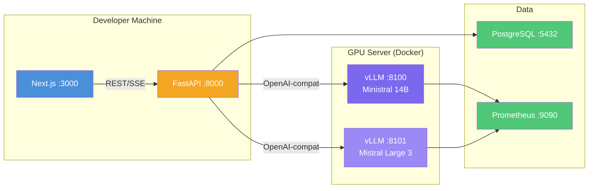

# Mistral 3 Family Setup Guide for PMS Integration

**Document ID:** PMS-EXP-MISTRAL3-001
**Version:** 1.0
**Date:** 2026-03-09
**Applies To:** PMS project (all platforms)
**Prerequisites Level:** Intermediate

---

## Table of Contents

1. [Overview](#1-overview)
2. [Prerequisites](#2-prerequisites)
3. [Part A: Deploy Ministral 14B on vLLM](#3-part-a-deploy-ministral-14b-on-vllm)
4. [Part B: Deploy Mistral Large 3 on vLLM](#4-part-b-deploy-mistral-large-3-on-vllm)
5. [Part C: Integrate with PMS Backend](#5-part-c-integrate-with-pms-backend)
6. [Part D: Integrate with PMS Frontend](#6-part-d-integrate-with-pms-frontend)
7. [Part E: Testing and Verification](#7-part-e-testing-and-verification)
8. [Troubleshooting](#8-troubleshooting)
9. [Reference Commands](#9-reference-commands)

---

## 1. Overview

This guide walks you through deploying the Mistral 3 model family (Ministral 14B, 8B, and Mistral Large 3) on self-hosted vLLM infrastructure, integrating them with the PMS Backend (FastAPI), and adding a model selection panel to the PMS Frontend (Next.js).

By the end of this guide you will have:
- Ministral 14B Instruct serving on vLLM via Docker (:8100)
- Mistral Large 3 serving on multi-GPU vLLM (:8101) — optional, requires 2× A100
- PMS Backend routes for clinical note generation, medication analysis, and document extraction
- Next.js AI panel component with model selector and streaming output
- Prometheus metrics for inference monitoring
- HIPAA-compliant audit logging on every inference request



---

## 2. Prerequisites

### 2.1 Required Software

| Software | Minimum Version | Check Command |
|----------|----------------|---------------|
| Docker | 24.0 | `docker --version` |
| Docker Compose | v2.20 | `docker compose version` |
| NVIDIA Driver | 535+ | `nvidia-smi` |
| NVIDIA Container Toolkit | 1.14.0 | `nvidia-ctk --version` |
| Python | 3.10+ | `python3 --version` |
| Node.js | 18+ | `node --version` |
| Git | 2.30+ | `git --version` |
| Hugging Face CLI | 0.20+ | `huggingface-cli --version` |

### 2.2 Installation of Prerequisites

**NVIDIA Container Toolkit** (if not installed):

```bash
# Ubuntu/Debian
curl -fsSL https://nvidia.github.io/libnvidia-container/gpgkey | \
  sudo gpg --dearmor -o /usr/share/keyrings/nvidia-container-toolkit-keyring.gpg
curl -s -L https://nvidia.github.io/libnvidia-container/stable/deb/nvidia-container-toolkit.list | \
  sed 's#deb https://#deb [signed-by=/usr/share/keyrings/nvidia-container-toolkit-keyring.gpg] https://#g' | \
  sudo tee /etc/apt/sources.list.d/nvidia-container-toolkit.list
sudo apt-get update && sudo apt-get install -y nvidia-container-toolkit
sudo nvidia-ctk runtime configure --runtime=docker
sudo systemctl restart docker
```

**Hugging Face CLI** (for downloading model weights):

```bash
pip install --upgrade huggingface_hub
huggingface-cli login
# Enter your HF token when prompted
```

### 2.3 Verify PMS Services

Confirm the PMS backend, frontend, and database are running:

```bash
# PostgreSQL
pg_isready -h localhost -p 5432
# Expected: localhost:5432 - accepting connections

# PMS Backend
curl -s http://localhost:8000/api/health | python3 -m json.tool
# Expected: {"status": "healthy"}

# PMS Frontend
curl -s -o /dev/null -w "%{http_code}" http://localhost:3000
# Expected: 200
```

---

## 3. Part A: Deploy Ministral 14B on vLLM

### Step 1: Download Ministral 14B Instruct Weights

```bash
# Create model storage directory
sudo mkdir -p /opt/pms/models/mistral
sudo chown $USER:$USER /opt/pms/models/mistral

# Download Ministral 14B Instruct
huggingface-cli download mistralai/Ministral-14B-Instruct-2512 \
  --local-dir /opt/pms/models/mistral/ministral-14b-instruct
```

### Step 2: Verify Model Checksum

```bash
# Verify SHA-256 integrity of downloaded files
cd /opt/pms/models/mistral/ministral-14b-instruct
sha256sum -c checksums.txt
# All files should report: OK
```

### Step 3: Create Docker Compose for Ministral 14B

Create `docker-compose.mistral.yml` in the PMS project root:

```yaml
# docker-compose.mistral.yml
version: "3.8"

services:
  mistral-14b:
    image: vllm/vllm-openai:latest
    container_name: pms-mistral-14b
    runtime: nvidia
    ports:
      - "8100:8000"
    volumes:
      - /opt/pms/models/mistral/ministral-14b-instruct:/model
      - /opt/pms/logs/mistral:/logs
    environment:
      - NVIDIA_VISIBLE_DEVICES=0
      - VLLM_LOGGING_LEVEL=INFO
    command: >
      --model /model
      --tokenizer-mode mistral
      --config-format mistral
      --load-format mistral
      --served-model-name ministral-14b-instruct
      --max-model-len 32768
      --gpu-memory-utilization 0.90
      --enable-prefix-caching
      --dtype bfloat16
      --host 0.0.0.0
      --port 8000
    deploy:
      resources:
        reservations:
          devices:
            - driver: nvidia
              count: 1
              capabilities: [gpu]
    healthcheck:
      test: ["CMD", "curl", "-f", "http://localhost:8000/health"]
      interval: 30s
      timeout: 10s
      retries: 5
      start_period: 120s
    restart: unless-stopped
    networks:
      - pms-network

networks:
  pms-network:
    external: true
```

### Step 4: Start the Service

```bash
# Create Docker network if it doesn't exist
docker network create pms-network 2>/dev/null || true

# Start Ministral 14B
docker compose -f docker-compose.mistral.yml up -d mistral-14b

# Watch logs until model loads
docker logs -f pms-mistral-14b 2>&1 | grep -m1 "Uvicorn running"
```

### Step 5: Verify Ministral 14B is Serving

```bash
# List available models
curl -s http://localhost:8100/v1/models | python3 -m json.tool

# Test a simple completion
curl -s http://localhost:8100/v1/chat/completions \
  -H "Content-Type: application/json" \
  -d '{
    "model": "ministral-14b-instruct",
    "messages": [{"role": "user", "content": "What is the ICD-10 code for type 2 diabetes?"}],
    "max_tokens": 100,
    "temperature": 0.1
  }' | python3 -m json.tool
```

**Expected output:** A JSON response containing the answer (E11 — Type 2 diabetes mellitus) with usage statistics.

**Checkpoint:** Ministral 14B Instruct is serving on port 8100 via the OpenAI-compatible API. You can send chat completion requests and receive structured responses.

---

## 4. Part B: Deploy Mistral Large 3 on vLLM

> **Note:** This section requires 2× A100 80GB GPUs (or 4× A6000 48GB). Skip to Part C if you only have a single GPU — Ministral 14B is sufficient for development.

### Step 1: Download Mistral Large 3 Weights (FP8)

```bash
# Download the FP8 quantized version to reduce VRAM requirements
huggingface-cli download mistralai/Mistral-Large-3-2512-FP8 \
  --local-dir /opt/pms/models/mistral/mistral-large-3-fp8
```

### Step 2: Add Large 3 to Docker Compose

Append to `docker-compose.mistral.yml`:

```yaml
  mistral-large-3:
    image: vllm/vllm-openai:latest
    container_name: pms-mistral-large-3
    runtime: nvidia
    ports:
      - "8101:8000"
    volumes:
      - /opt/pms/models/mistral/mistral-large-3-fp8:/model
      - /opt/pms/logs/mistral:/logs
    environment:
      - NVIDIA_VISIBLE_DEVICES=0,1
      - VLLM_LOGGING_LEVEL=INFO
    command: >
      --model /model
      --tokenizer-mode mistral
      --config-format mistral
      --load-format mistral
      --served-model-name mistral-large-3
      --tensor-parallel-size 2
      --max-model-len 65536
      --gpu-memory-utilization 0.92
      --enable-prefix-caching
      --dtype float16
      --host 0.0.0.0
      --port 8000
    deploy:
      resources:
        reservations:
          devices:
            - driver: nvidia
              count: 2
              capabilities: [gpu]
    healthcheck:
      test: ["CMD", "curl", "-f", "http://localhost:8000/health"]
      interval: 30s
      timeout: 10s
      retries: 10
      start_period: 300s
    restart: unless-stopped
    networks:
      - pms-network
```

### Step 3: Start Large 3

```bash
docker compose -f docker-compose.mistral.yml up -d mistral-large-3

# This model takes 3-5 minutes to load — watch progress
docker logs -f pms-mistral-large-3 2>&1 | grep -m1 "Uvicorn running"
```

### Step 4: Verify Large 3

```bash
curl -s http://localhost:8101/v1/chat/completions \
  -H "Content-Type: application/json" \
  -d '{
    "model": "mistral-large-3",
    "messages": [{"role": "user", "content": "Analyze potential drug interactions between metformin 1000mg BID and lisinopril 20mg daily for a 65-year-old patient with CKD stage 3."}],
    "max_tokens": 500,
    "temperature": 0.2
  }' | python3 -m json.tool
```

**Checkpoint:** Mistral Large 3 is serving on port 8101 with tensor parallelism across 2 GPUs. Complex clinical reasoning queries return detailed, structured responses.

---

## 5. Part C: Integrate with PMS Backend

### Step 1: Install Python Dependencies

```bash
cd /path/to/pms-backend
pip install mistralai openai httpx
```

### Step 2: Add Mistral Configuration

Add to your `.env` file:

```bash
# Mistral 3 Configuration
MISTRAL_14B_BASE_URL=http://localhost:8100/v1
MISTRAL_LARGE3_BASE_URL=http://localhost:8101/v1
MISTRAL_14B_MODEL=ministral-14b-instruct
MISTRAL_LARGE3_MODEL=mistral-large-3
MISTRAL_DEFAULT_TEMPERATURE=0.1
MISTRAL_MAX_TOKENS=2048
```

### Step 3: Create the Mistral Service

Create `app/services/mistral_service.py`:

```python
"""Mistral 3 inference service for PMS clinical workflows."""

import time
import logging
from typing import AsyncIterator

import httpx
from openai import AsyncOpenAI

from app.core.config import settings
from app.models.audit import InferenceAuditLog
from app.db.session import get_db

logger = logging.getLogger(__name__)


class MistralService:
    """Client for self-hosted Mistral 3 models via vLLM OpenAI-compatible API."""

    def __init__(self):
        self.client_14b = AsyncOpenAI(
            base_url=settings.MISTRAL_14B_BASE_URL,
            api_key="not-needed",  # Self-hosted, no API key required
        )
        self.client_large3 = AsyncOpenAI(
            base_url=settings.MISTRAL_LARGE3_BASE_URL,
            api_key="not-needed",
        )

    def _get_client(self, model_tier: str) -> tuple[AsyncOpenAI, str]:
        """Return the appropriate client and model name for the requested tier."""
        if model_tier == "large":
            return self.client_large3, settings.MISTRAL_LARGE3_MODEL
        return self.client_14b, settings.MISTRAL_14B_MODEL

    async def generate(
        self,
        prompt: str,
        system_prompt: str = "",
        model_tier: str = "standard",
        max_tokens: int | None = None,
        temperature: float | None = None,
        user_id: str = "",
        patient_id_hash: str = "",
    ) -> str:
        """Generate a completion from the appropriate Mistral model."""
        client, model_name = self._get_client(model_tier)
        max_tokens = max_tokens or settings.MISTRAL_MAX_TOKENS
        temperature = temperature or settings.MISTRAL_DEFAULT_TEMPERATURE

        messages = []
        if system_prompt:
            messages.append({"role": "system", "content": system_prompt})
        messages.append({"role": "user", "content": prompt})

        start_time = time.monotonic()

        response = await client.chat.completions.create(
            model=model_name,
            messages=messages,
            max_tokens=max_tokens,
            temperature=temperature,
        )

        latency_ms = (time.monotonic() - start_time) * 1000
        result = response.choices[0].message.content

        # Audit log
        logger.info(
            "mistral_inference",
            extra={
                "model": model_name,
                "user_id": user_id,
                "patient_id_hash": patient_id_hash,
                "prompt_tokens": response.usage.prompt_tokens,
                "completion_tokens": response.usage.completion_tokens,
                "latency_ms": round(latency_ms, 1),
            },
        )

        return result

    async def generate_stream(
        self,
        prompt: str,
        system_prompt: str = "",
        model_tier: str = "standard",
        max_tokens: int | None = None,
        temperature: float | None = None,
    ) -> AsyncIterator[str]:
        """Stream a completion from the appropriate Mistral model."""
        client, model_name = self._get_client(model_tier)
        max_tokens = max_tokens or settings.MISTRAL_MAX_TOKENS
        temperature = temperature or settings.MISTRAL_DEFAULT_TEMPERATURE

        messages = []
        if system_prompt:
            messages.append({"role": "system", "content": system_prompt})
        messages.append({"role": "user", "content": prompt})

        stream = await client.chat.completions.create(
            model=model_name,
            messages=messages,
            max_tokens=max_tokens,
            temperature=temperature,
            stream=True,
        )

        async for chunk in stream:
            if chunk.choices[0].delta.content:
                yield chunk.choices[0].delta.content

    async def health_check(self) -> dict:
        """Check health of all Mistral inference endpoints."""
        results = {}
        for name, url in [
            ("ministral-14b", settings.MISTRAL_14B_BASE_URL),
            ("mistral-large-3", settings.MISTRAL_LARGE3_BASE_URL),
        ]:
            try:
                async with httpx.AsyncClient(timeout=5.0) as http:
                    resp = await http.get(f"{url.rstrip('/v1')}/health")
                    results[name] = "healthy" if resp.status_code == 200 else "unhealthy"
            except httpx.ConnectError:
                results[name] = "unavailable"
        return results


# Singleton instance
mistral_service = MistralService()
```

### Step 4: Create Clinical Note Endpoint

Create `app/api/endpoints/mistral.py`:

```python
"""Mistral 3 clinical AI endpoints."""

from fastapi import APIRouter, Depends, HTTPException
from fastapi.responses import StreamingResponse
from pydantic import BaseModel

from app.services.mistral_service import mistral_service
from app.api.deps import get_current_user

router = APIRouter(prefix="/api/ai/mistral", tags=["mistral"])


class NoteRequest(BaseModel):
    encounter_transcript: str
    patient_context: str = ""
    note_type: str = "soap"  # soap, progress, discharge


class MedicationCheckRequest(BaseModel):
    medications: list[str]
    patient_age: int
    patient_conditions: list[str] = []


SOAP_SYSTEM_PROMPT = """You are a clinical documentation assistant for an ophthalmology practice.
Generate a structured SOAP note from the encounter transcript.
Include ICD-10 and CPT code suggestions with confidence levels.
Format: Subjective, Objective, Assessment, Plan sections.
Be precise with medical terminology. Do not fabricate findings not in the transcript."""

MEDICATION_SYSTEM_PROMPT = """You are a medication safety assistant.
Analyze the medication list for potential interactions, contraindications,
and dosage concerns. Reference standard clinical guidelines.
Flag severity: HIGH (contraindicated), MODERATE (monitor), LOW (minor).
Be conservative — flag uncertain interactions for pharmacist review."""


@router.post("/generate-note")
async def generate_clinical_note(
    request: NoteRequest,
    current_user=Depends(get_current_user),
):
    """Generate a structured clinical note from encounter transcript."""
    prompt = f"""Patient Context: {request.patient_context}

Encounter Transcript:
{request.encounter_transcript}

Generate a {request.note_type.upper()} note with ICD-10 and CPT code suggestions."""

    result = await mistral_service.generate(
        prompt=prompt,
        system_prompt=SOAP_SYSTEM_PROMPT,
        model_tier="large" if len(request.encounter_transcript) > 5000 else "standard",
        max_tokens=2048,
        user_id=current_user.id,
    )
    return {"note": result, "model_tier": "large" if len(request.encounter_transcript) > 5000 else "standard"}


@router.post("/check-medications")
async def check_medications(
    request: MedicationCheckRequest,
    current_user=Depends(get_current_user),
):
    """Analyze medications for interactions and safety concerns."""
    prompt = f"""Patient: {request.patient_age} years old
Conditions: {', '.join(request.patient_conditions) or 'None listed'}

Current Medications:
{chr(10).join(f'- {med}' for med in request.medications)}

Analyze for drug-drug interactions, age-related concerns, and condition contraindications."""

    result = await mistral_service.generate(
        prompt=prompt,
        system_prompt=MEDICATION_SYSTEM_PROMPT,
        model_tier="large",
        max_tokens=1500,
        user_id=current_user.id,
    )
    return {"analysis": result}


@router.post("/generate-note/stream")
async def generate_clinical_note_stream(
    request: NoteRequest,
    current_user=Depends(get_current_user),
):
    """Stream a clinical note generation for real-time display."""
    prompt = f"""Patient Context: {request.patient_context}

Encounter Transcript:
{request.encounter_transcript}

Generate a {request.note_type.upper()} note with ICD-10 and CPT code suggestions."""

    return StreamingResponse(
        mistral_service.generate_stream(
            prompt=prompt,
            system_prompt=SOAP_SYSTEM_PROMPT,
            model_tier="standard",
            max_tokens=2048,
        ),
        media_type="text/event-stream",
    )


@router.get("/health")
async def mistral_health():
    """Check health of Mistral inference endpoints."""
    return await mistral_service.health_check()
```

### Step 5: Register the Router

In your `app/api/router.py` or main app file:

```python
from app.api.endpoints.mistral import router as mistral_router

app.include_router(mistral_router)
```

**Checkpoint:** The PMS Backend has `/api/ai/mistral/generate-note`, `/api/ai/mistral/check-medications`, and `/api/ai/mistral/health` endpoints. Requests are routed to the appropriate Mistral model tier based on input complexity.

---

## 6. Part D: Integrate with PMS Frontend

### Step 1: Add Environment Variable

In `.env.local`:

```bash
NEXT_PUBLIC_MISTRAL_API_URL=/api/ai/mistral
```

### Step 2: Create the Mistral AI Hook

Create `src/hooks/useMistralAI.ts`:

```typescript
import { useState, useCallback } from "react";

interface NoteRequest {
  encounter_transcript: string;
  patient_context?: string;
  note_type?: "soap" | "progress" | "discharge";
}

interface MedicationCheckRequest {
  medications: string[];
  patient_age: number;
  patient_conditions?: string[];
}

export function useMistralAI() {
  const [loading, setLoading] = useState(false);
  const [error, setError] = useState<string | null>(null);

  const generateNote = useCallback(async (request: NoteRequest) => {
    setLoading(true);
    setError(null);
    try {
      const res = await fetch("/api/ai/mistral/generate-note", {
        method: "POST",
        headers: { "Content-Type": "application/json" },
        body: JSON.stringify(request),
      });
      if (!res.ok) throw new Error(`HTTP ${res.status}`);
      return await res.json();
    } catch (err) {
      setError(err instanceof Error ? err.message : "Unknown error");
      return null;
    } finally {
      setLoading(false);
    }
  }, []);

  const checkMedications = useCallback(
    async (request: MedicationCheckRequest) => {
      setLoading(true);
      setError(null);
      try {
        const res = await fetch("/api/ai/mistral/check-medications", {
          method: "POST",
          headers: { "Content-Type": "application/json" },
          body: JSON.stringify(request),
        });
        if (!res.ok) throw new Error(`HTTP ${res.status}`);
        return await res.json();
      } catch (err) {
        setError(err instanceof Error ? err.message : "Unknown error");
        return null;
      } finally {
        setLoading(false);
      }
    },
    []
  );

  const streamNote = useCallback(async function* (request: NoteRequest) {
    const res = await fetch("/api/ai/mistral/generate-note/stream", {
      method: "POST",
      headers: { "Content-Type": "application/json" },
      body: JSON.stringify(request),
    });
    if (!res.ok || !res.body) throw new Error(`HTTP ${res.status}`);

    const reader = res.body.getReader();
    const decoder = new TextDecoder();

    while (true) {
      const { done, value } = await reader.read();
      if (done) break;
      yield decoder.decode(value, { stream: true });
    }
  }, []);

  return { generateNote, checkMedications, streamNote, loading, error };
}
```

### Step 3: Create the AI Panel Component

Create `src/components/ai/MistralPanel.tsx`:

```tsx
"use client";

import { useState } from "react";
import { useMistralAI } from "@/hooks/useMistralAI";

export function MistralPanel() {
  const { generateNote, checkMedications, loading, error } = useMistralAI();
  const [result, setResult] = useState<string>("");
  const [activeTab, setActiveTab] = useState<"notes" | "medications">("notes");

  const handleGenerateNote = async (transcript: string) => {
    const response = await generateNote({
      encounter_transcript: transcript,
      note_type: "soap",
    });
    if (response) setResult(response.note);
  };

  const handleCheckMedications = async (
    meds: string[],
    age: number,
    conditions: string[]
  ) => {
    const response = await checkMedications({
      medications: meds,
      patient_age: age,
      patient_conditions: conditions,
    });
    if (response) setResult(response.analysis);
  };

  return (
    <div className="rounded-lg border border-gray-200 bg-white p-4 shadow-sm">
      <div className="mb-4 flex items-center justify-between">
        <h3 className="text-lg font-semibold text-gray-900">
          Mistral AI Assistant
        </h3>
        <span className="rounded-full bg-purple-100 px-2 py-1 text-xs text-purple-700">
          On-Premise
        </span>
      </div>

      {/* Tab selector */}
      <div className="mb-4 flex space-x-2">
        <button
          onClick={() => setActiveTab("notes")}
          className={`rounded-md px-3 py-1.5 text-sm font-medium ${
            activeTab === "notes"
              ? "bg-purple-600 text-white"
              : "bg-gray-100 text-gray-700 hover:bg-gray-200"
          }`}
        >
          Clinical Notes
        </button>
        <button
          onClick={() => setActiveTab("medications")}
          className={`rounded-md px-3 py-1.5 text-sm font-medium ${
            activeTab === "medications"
              ? "bg-purple-600 text-white"
              : "bg-gray-100 text-gray-700 hover:bg-gray-200"
          }`}
        >
          Medication Check
        </button>
      </div>

      {/* Output area */}
      {loading && (
        <div className="flex items-center space-x-2 text-sm text-gray-500">
          <div className="h-4 w-4 animate-spin rounded-full border-2 border-purple-600 border-t-transparent" />
          <span>Generating with Mistral (on-premise)...</span>
        </div>
      )}

      {error && (
        <div className="rounded-md bg-red-50 p-3 text-sm text-red-700">
          {error}
        </div>
      )}

      {result && (
        <div className="mt-4 rounded-md bg-gray-50 p-4">
          <pre className="whitespace-pre-wrap text-sm text-gray-800">
            {result}
          </pre>
        </div>
      )}
    </div>
  );
}
```

**Checkpoint:** The PMS Frontend has a `MistralPanel` component with tabs for clinical note generation and medication checking. It communicates with the Backend API, which routes to self-hosted Mistral models.

---

## 7. Part E: Testing and Verification

### Service Health Checks

```bash
# Check all Mistral services
curl -s http://localhost:8000/api/ai/mistral/health | python3 -m json.tool
# Expected: {"ministral-14b": "healthy", "mistral-large-3": "healthy"}

# Check vLLM directly
curl -s http://localhost:8100/health
# Expected: {"status":"healthy"}

# List models
curl -s http://localhost:8100/v1/models | python3 -m json.tool
```

### Functional Test: Clinical Note Generation

```bash
curl -s http://localhost:8000/api/ai/mistral/generate-note \
  -H "Content-Type: application/json" \
  -H "Authorization: Bearer $PMS_TOKEN" \
  -d '{
    "encounter_transcript": "Patient is a 72-year-old male presenting for follow-up of wet age-related macular degeneration in the right eye. Reports stable vision since last Eylea injection 4 weeks ago. No new floaters, flashes, or vision loss. OCT shows decreased subretinal fluid compared to prior visit. Visual acuity OD 20/40, OS 20/25. IOP 14 OD, 16 OS. Plan to continue Eylea 2mg intravitreal injection OD today, follow up in 4 weeks.",
    "patient_context": "72M, wet AMD OD, on Eylea q4w",
    "note_type": "soap"
  }' | python3 -m json.tool
```

**Expected:** A structured SOAP note with Subjective, Objective, Assessment, Plan sections, plus ICD-10 (H35.32 — Exudative AMD) and CPT (67028 — Intravitreal injection) code suggestions.

### Functional Test: Medication Check

```bash
curl -s http://localhost:8000/api/ai/mistral/check-medications \
  -H "Content-Type: application/json" \
  -H "Authorization: Bearer $PMS_TOKEN" \
  -d '{
    "medications": ["metformin 1000mg BID", "lisinopril 20mg daily", "warfarin 5mg daily", "ibuprofen 400mg PRN"],
    "patient_age": 68,
    "patient_conditions": ["type 2 diabetes", "hypertension", "atrial fibrillation"]
  }' | python3 -m json.tool
```

**Expected:** HIGH severity flag for warfarin + ibuprofen interaction (increased bleeding risk), MODERATE flag for metformin with renal function monitoring.

### Integration Test: Streaming

```bash
curl -N http://localhost:8000/api/ai/mistral/generate-note/stream \
  -H "Content-Type: application/json" \
  -H "Authorization: Bearer $PMS_TOKEN" \
  -d '{
    "encounter_transcript": "Brief follow-up. Patient doing well on current drops. IOP 12 both eyes. Continue timolol BID.",
    "note_type": "progress"
  }'
# Expected: Streaming text output character by character
```

### Performance Benchmark

```bash
# Measure latency for Ministral 14B
time curl -s http://localhost:8100/v1/chat/completions \
  -H "Content-Type: application/json" \
  -d '{
    "model": "ministral-14b-instruct",
    "messages": [{"role": "user", "content": "Summarize: Patient with glaucoma, IOP 22, on latanoprost."}],
    "max_tokens": 200
  }' > /dev/null

# Target: < 2s total, < 800ms to first token
```

**Checkpoint:** All endpoints return expected clinical output. Streaming works. Latency meets targets. Health checks pass.

---

## 8. Troubleshooting

### vLLM Container Won't Start

**Symptom:** Container exits immediately with `RuntimeError: CUDA out of memory`
**Fix:** Reduce `--max-model-len` or `--gpu-memory-utilization`:
```bash
# Try smaller context window
--max-model-len 16384 --gpu-memory-utilization 0.85
```

### Model Loading Takes Too Long

**Symptom:** Container health check fails; model loads for 10+ minutes
**Fix:** Increase `start_period` in healthcheck and verify NVMe storage speed:
```bash
# Check disk speed (should be > 1GB/s for NVMe)
dd if=/opt/pms/models/mistral/ministral-14b-instruct/model.safetensors of=/dev/null bs=1M count=1000
```

### "tokenizer_mode mistral" Error

**Symptom:** `ValueError: tokenizer_mode 'mistral' is not supported`
**Fix:** Upgrade vLLM to ≥ 0.6.0:
```bash
docker pull vllm/vllm-openai:latest
docker compose -f docker-compose.mistral.yml up -d --force-recreate
```

### Port 8100 Already in Use

**Symptom:** `Bind for 0.0.0.0:8100 failed: port is already allocated`
**Fix:** Check what's using the port and stop it, or change the port mapping:
```bash
lsof -i :8100
# If it's a previous vLLM instance from Experiment 52, stop it first
docker stop pms-vllm
```

### Backend Can't Connect to vLLM

**Symptom:** `httpx.ConnectError: [Errno 111] Connection refused`
**Fix:** Ensure both containers are on the same Docker network:
```bash
docker network inspect pms-network | grep -A2 "pms-mistral-14b"
# If not listed, recreate with network
docker compose -f docker-compose.mistral.yml up -d
```

### Garbled or Truncated Output

**Symptom:** Responses end mid-sentence or contain repeated tokens
**Fix:** Increase `max_tokens` and add a stop sequence:
```python
response = await client.chat.completions.create(
    model=model_name,
    messages=messages,
    max_tokens=4096,  # Increase from default
    stop=["</s>", "[/INST]"],  # Mistral stop tokens
)
```

---

## 9. Reference Commands

### Daily Development Workflow

```bash
# Start Mistral services
docker compose -f docker-compose.mistral.yml up -d

# Check status
docker compose -f docker-compose.mistral.yml ps

# View logs
docker logs -f pms-mistral-14b --tail 50

# Stop services
docker compose -f docker-compose.mistral.yml down
```

### Management Commands

```bash
# GPU utilization monitoring
watch -n 1 nvidia-smi

# vLLM metrics (Prometheus format)
curl -s http://localhost:8100/metrics | grep vllm_

# Check request queue depth
curl -s http://localhost:8100/metrics | grep "vllm_num_requests"

# Restart a specific model
docker compose -f docker-compose.mistral.yml restart mistral-14b
```

### Useful URLs

| Resource | URL |
|----------|-----|
| Ministral 14B API | http://localhost:8100/v1 |
| Mistral Large 3 API | http://localhost:8101/v1 |
| vLLM Health (14B) | http://localhost:8100/health |
| vLLM Health (Large 3) | http://localhost:8101/health |
| vLLM Metrics (14B) | http://localhost:8100/metrics |
| PMS Mistral Health | http://localhost:8000/api/ai/mistral/health |
| PMS Backend | http://localhost:8000 |
| PMS Frontend | http://localhost:3000 |

---

## Next Steps

After completing this setup guide:

1. Follow the [Mistral 3 Developer Tutorial](54-Mistral3-Developer-Tutorial.md) to build your first clinical workflow integration end-to-end
2. Review the [PRD: Mistral 3 PMS Integration](54-PRD-Mistral3-PMS-Integration.md) for the full feature roadmap
3. Configure the Model Router (Experiment 15) to include Mistral 3 in the routing table
4. Set up Prometheus/Grafana dashboards for inference monitoring (Experiment 52 patterns)

## Resources

- [Mistral AI Documentation](https://docs.mistral.ai/)
- [Mistral Large 3 Model Card](https://docs.mistral.ai/models/mistral-large-3-25-12)
- [vLLM Mistral Deployment Guide](https://docs.mistral.ai/deployment/self-deployment/vllm)
- [Mistral Python SDK](https://github.com/mistralai/client-python)
- [vLLM Mistral Large 3 Recipe](https://docs.vllm.ai/projects/recipes/en/latest/Mistral/Mistral-Large-3.html)
- [PMS vLLM Setup Guide (Experiment 52)](52-vLLM-PMS-Developer-Setup-Guide.md)
- [PMS Gemma 3 Setup Guide (Experiment 13)](13-Gemma3-PMS-Developer-Setup-Guide.md)
