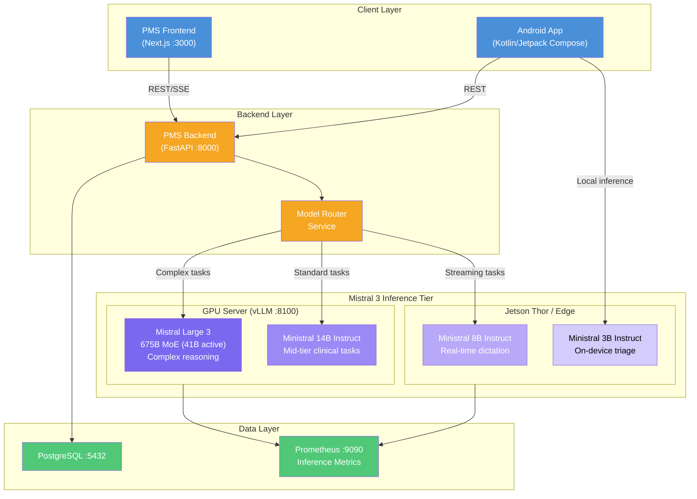

# Product Requirements Document: Mistral 3 Family Integration into Patient Management System (PMS)

**Document ID:** PRD-PMS-MISTRAL3-001
**Version:** 1.0
**Date:** 2026-03-09
**Author:** Ammar (CEO, MPS Inc.)
**Status:** Draft

---

## 1. Executive Summary

The Mistral 3 family is a December 2025 release from Mistral AI comprising ten open-weight models: Mistral Large 3 (675B total / 41B active parameters, sparse Mixture-of-Experts) and nine Ministral 3 dense models at 14B, 8B, and 3B parameter scales, each in Base, Instruct, and Reasoning variants. All models are released under the Apache 2.0 license, support multimodal (text + vision) input, and offer context windows up to 256K tokens.

Integrating the Mistral 3 family into the PMS provides a tiered, self-hosted AI backbone for clinical workflows — from lightweight edge inference on exam-room devices (Ministral 3B/8B) to complex reasoning and document analysis tasks (Large 3 via vLLM). Because every model is Apache 2.0 licensed and can run entirely on-premise, patient health information (PHI) never leaves the organizational network, satisfying HIPAA Technical Safeguard requirements without cloud dependency.

This integration complements the existing vLLM inference engine (Experiment 52) by providing a unified Mistral model family with consistent tokenization, prompting conventions, and quality characteristics across all deployment tiers — from the Jetson Thor edge device to the GPU inference server.

## 2. Problem Statement

The PMS currently relies on a heterogeneous mix of AI models for different clinical tasks (Gemma 3 for general inference, Qwen 3.5 for reasoning, cloud-based Claude/GPT for complex analysis). This creates several operational challenges:

1. **Inconsistent output quality** — Different model families produce stylistically and structurally different clinical outputs, requiring per-model prompt engineering and output parsing.
2. **Limited edge deployment** — Current on-premise models (Gemma 3 27B, Qwen 3.5 32B) are too large for exam-room tablets or the Android app's on-device inference.
3. **No unified reasoning tier** — Complex clinical reasoning (differential diagnosis, drug interaction chains) requires cloud API calls, creating PHI egress risk and latency.
4. **Cost unpredictability** — Cloud API usage for complex tasks creates variable monthly costs that scale with patient volume.

The Mistral 3 family addresses all four problems with a single vendor's model lineup spanning 3B to 675B parameters, all sharing the same tokenizer and instruction format, deployable from edge to server without any cloud dependency.

## 3. Proposed Solution

### 3.1 Architecture Overview

### 3.2 Deployment Model

| Aspect | Detail |
|--------|--------|
| **Hosting** | Fully self-hosted; no cloud API calls for inference |
| **Large 3** | Docker container with vLLM, FP8 quantized, 2× A100 80GB or 4× A6000 48GB via tensor parallelism |
| **Ministral 14B** | Single GPU (A6000 48GB or RTX 4090 24GB with INT4 quantization) via vLLM |
| **Ministral 8B** | Jetson Thor (128GB unified memory) or single RTX 4060 Ti 16GB |
| **Ministral 3B** | Jetson Thor, Android device (4GB+ VRAM with INT4), or CPU-only laptop |
| **Container Runtime** | Docker with NVIDIA Container Toolkit for GPU passthrough |
| **HIPAA Envelope** | All inference within private network; TLS 1.3 between services; AES-256 at rest; audit logging on every inference request |

## 4. PMS Data Sources

The Mistral 3 integration interacts with the following PMS APIs:

| API Endpoint | Model Tier | Use Case |
|-------------|-----------|----------|
| `/api/patients` | Ministral 8B/14B | Patient demographic summarization, intake form pre-fill |
| `/api/encounters` | Mistral Large 3 | Encounter note summarization, SOAP note generation, differential diagnosis support |
| `/api/prescriptions` | Mistral Large 3, Ministral 14B | Drug interaction analysis, dosage verification, formulary compliance checking |
| `/api/reports` | Mistral Large 3 | Clinical report generation, quality metric analysis, population health summaries |

All API interactions pass through the existing PMS Backend (FastAPI), which adds PHI de-identification where needed and enforces RBAC before forwarding to the inference tier.

## 5. Component/Module Definitions

### 5.1 Mistral Model Router

**Description:** Extends the existing Model Router (Experiment 15) to route requests to the appropriate Mistral 3 model based on task complexity, required latency, and available hardware.

**Input:** Inference request with task type, urgency flag, max latency SLA
**Output:** Routed response from the optimal Mistral model
**PMS APIs:** All — acts as the dispatch layer

### 5.2 Clinical Note Generator (Large 3)

**Description:** Uses Mistral Large 3's 256K context window and MoE reasoning to generate, summarize, and structure clinical encounter notes from transcription output.

**Input:** Raw encounter transcript (from Voxtral/MedASR), patient context from `/api/patients`
**Output:** Structured SOAP note with ICD-10 and CPT code suggestions
**PMS APIs:** `/api/encounters`, `/api/patients`

### 5.3 Medication Intelligence Engine (Large 3 / Ministral 14B)

**Description:** Analyzes medication lists for interactions, contraindications, and dosage appropriateness using clinical reasoning chains.

**Input:** Patient medication list from `/api/prescriptions`, clinical context
**Output:** Interaction alerts, dosage recommendations, formulary alternatives
**PMS APIs:** `/api/prescriptions`, `/api/patients`

### 5.4 Edge Triage Assistant (Ministral 3B/8B)

**Description:** Lightweight on-device model for real-time clinical triage — quick symptom assessment, intake form suggestions, and patient communication drafting.

**Input:** Brief clinical query or patient intake data
**Output:** Triage suggestions, draft communications, structured intake data
**PMS APIs:** `/api/patients` (via REST from Android app)

### 5.5 Vision Document Analyzer (Large 3 / Ministral 14B)

**Description:** Leverages Mistral 3's multimodal capabilities to analyze clinical images — scanned referral letters, insurance documents, lab result PDFs, and handwritten notes.

**Input:** Image or PDF document
**Output:** Structured text extraction, key-value pairs, classification labels
**PMS APIs:** `/api/encounters`, `/api/reports`

## 6. Non-Functional Requirements

### 6.1 Security and HIPAA Compliance

| Requirement | Implementation |
|------------|----------------|
| **PHI Isolation** | All models run on-premise; no external API calls; Docker network isolation |
| **Encryption in Transit** | TLS 1.3 between Backend ↔ vLLM; mTLS for inter-container communication |
| **Encryption at Rest** | Model weights on encrypted volumes (LUKS); inference logs encrypted (AES-256-GCM) |
| **Access Control** | RBAC via PMS Backend; API key authentication for vLLM endpoints; no direct client access to inference |
| **Audit Logging** | Every inference request logged with: user ID, patient ID (hashed), model used, timestamp, token count, latency |
| **Data Retention** | Inference prompts/responses retained for 7 years per HIPAA; purge pipeline for training data exclusion |
| **Model Integrity** | SHA-256 checksum verification on model weight files; signed container images |

### 6.2 Performance

| Metric | Target |
|--------|--------|
| **Ministral 3B latency** | < 200ms first token (edge device) |
| **Ministral 8B latency** | < 500ms first token |
| **Ministral 14B latency** | < 800ms first token |
| **Large 3 latency** | < 2s first token (FP8, tensor parallel) |
| **Large 3 throughput** | ≥ 50 tokens/sec (FP8 on 2× A100) |
| **Concurrent requests** | ≥ 8 simultaneous inference sessions (Large 3) |
| **Uptime** | 99.5% during clinic hours (7 AM – 7 PM) |

### 6.3 Infrastructure

| Resource | Specification |
|----------|--------------|
| **GPU Server** | 2× NVIDIA A100 80GB (or 4× A6000 48GB) for Large 3; 1× RTX 4090 for Ministral 14B |
| **Edge Device** | NVIDIA Jetson Thor 128GB for Ministral 8B; Android device with 4GB+ VRAM for Ministral 3B |
| **RAM** | 256GB system RAM on GPU server |
| **Storage** | 2TB NVMe SSD (model weights + logs) |
| **Docker** | Docker 24+, NVIDIA Container Toolkit 1.14+, Docker Compose v2 |
| **vLLM** | v0.6+ with Mistral model support, FP8/NVFP4 quantization |

## 7. Implementation Phases

### Phase 1: Foundation (Sprints 1–3)
- Deploy Ministral 14B Instruct on vLLM (single GPU)
- Extend Model Router to support Mistral model selection
- Implement basic clinical note summarization endpoint
- Set up Prometheus metrics collection for inference monitoring
- Configure HIPAA audit logging for all inference requests

### Phase 2: Full Tier Deployment (Sprints 4–6)
- Deploy Mistral Large 3 on multi-GPU vLLM (FP8 quantized)
- Deploy Ministral 8B on Jetson Thor
- Implement medication intelligence engine with reasoning chains
- Add vision/multimodal document analysis endpoint
- Integrate with existing encounter and prescription workflows

### Phase 3: Edge & Advanced Features (Sprints 7–9)
- Deploy Ministral 3B on Android devices (INT4 quantized via llama.cpp or MLC-LLM)
- Implement adaptive model routing based on real-time latency/load metrics
- Add fine-tuning pipeline for domain-specific models (ophthalmology terminology)
- Build comparative quality dashboard (Mistral vs Gemma vs Qwen)
- Implement model A/B testing framework for clinical output quality

## 8. Success Metrics

| Metric | Target | Measurement Method |
|--------|--------|--------------------|
| Clinical note quality (ROUGE-L) | ≥ 0.72 vs physician-written notes | Automated scoring on 200 test encounters |
| ICD-10 code accuracy | ≥ 85% top-3 match | Manual review by certified coder |
| Drug interaction detection recall | ≥ 90% | Benchmark against DrugBank reference set |
| Inference cost per encounter | ≤ $0.02 (amortized GPU cost) | Monthly GPU cost / encounter count |
| Cloud API cost reduction | ≥ 70% reduction in Claude/GPT spend | Monthly billing comparison |
| Edge inference availability | ≥ 99% during clinic hours | Prometheus uptime metrics |
| Physician satisfaction | ≥ 4.0/5.0 | Quarterly survey (n ≥ 20) |

## 9. Risks and Mitigations

| Risk | Impact | Mitigation |
|------|--------|------------|
| Large 3 requires expensive multi-GPU setup | High capital cost | Start with FP8 quantization on 2× A100; evaluate NVFP4 for single-GPU; lease vs buy analysis |
| Model hallucination on clinical facts | Patient safety risk | Human-in-the-loop review for all clinical outputs; confidence scoring; clinician approval gates |
| Mistral model updates break compatibility | Service disruption | Pin model versions; test new releases in staging; maintain rollback procedure |
| Apache 2.0 license doesn't include indemnification | Legal exposure | Legal review of open-weight liability; maintain dual-vendor capability (Gemma 3 fallback) |
| Edge device (Ministral 3B) quality insufficient | Poor user experience | Benchmark against cloud models; use 3B only for triage, not definitive clinical output |
| vLLM version incompatibility with Mistral | Blocked deployment | Track vLLM release notes; participate in upstream issues; maintain tested version matrix |
| Multilingual output inconsistency | Inaccurate non-English clinical notes | Benchmark on Spanish/Arabic clinical corpus; constrain to English-only for safety-critical outputs initially |

## 10. Dependencies

| Dependency | Version | Purpose |
|-----------|---------|---------|
| Mistral Large 3 weights | `mistralai/Mistral-Large-3-2512` | Frontier reasoning model |
| Ministral 14B Instruct | `mistralai/Ministral-14B-Instruct-2512` | Mid-tier clinical tasks |
| Ministral 8B Instruct | `mistralai/Ministral-8B-Instruct-2512` | Streaming/edge tasks |
| Ministral 3B Instruct | `mistralai/Ministral-3B-Instruct-2512` | On-device triage |
| vLLM | ≥ 0.6.0 | Inference engine with PagedAttention |
| NVIDIA Container Toolkit | ≥ 1.14.0 | GPU passthrough for Docker |
| mistralai Python SDK | ≥ 1.0.0 | Client library (optional, for API parity) |
| PMS Backend | FastAPI :8000 | API gateway and RBAC |
| PostgreSQL | ≥ 15 | Audit logs, inference metadata |
| Prometheus + Grafana | Latest | Inference monitoring |

## 11. Comparison with Existing Experiments

| Aspect | Mistral 3 (Exp 54) | Gemma 3 (Exp 13) | Qwen 3.5 (Exp 20) | vLLM (Exp 52) |
|--------|--------------------|--------------------|---------------------|----------------|
| **Model Size Range** | 3B – 675B (4 tiers) | 27B (single) | 32B (single) | Engine only |
| **Architecture** | Dense (small) + MoE (large) | Dense | MoE (17B active) | N/A |
| **Vision/Multimodal** | Yes (all variants) | Yes (PaliGemma) | Limited | N/A |
| **Context Window** | 128K–256K | 128K | 128K | N/A |
| **License** | Apache 2.0 | Apache 2.0 (with restrictions) | Apache 2.0 | Apache 2.0 |
| **Edge Deployable** | Yes (3B on 4GB VRAM) | No (27B too large) | No (32B too large) | N/A |
| **Reasoning Variants** | Yes (dedicated) | No | Yes (thinking mode) | N/A |
| **Relationship** | Complementary — provides model lineup for vLLM engine | Complementary — alternative model | Complementary — alternative for reasoning | Foundation — Mistral runs on vLLM |

Mistral 3 builds on the vLLM infrastructure from Experiment 52, providing a complete model family that spans from edge to server. It complements rather than replaces Gemma 3 and Qwen 3.5 — the Model Router (Experiment 15) can route between all three families based on task requirements.

## 12. Research Sources

### Official Documentation
- [Introducing Mistral 3 | Mistral AI](https://mistral.ai/news/mistral-3) — Official announcement with architecture details and benchmark results
- [Mistral Large 3 Model Card | Mistral Docs](https://docs.mistral.ai/models/mistral-large-3-25-12) — Model specifications, API parameters, and deployment guidance
- [SDK Clients | Mistral Docs](https://docs.mistral.ai/getting-started/clients) — Python and JavaScript SDK documentation

### Architecture & Deployment
- [vLLM Deployment | Mistral Docs](https://docs.mistral.ai/deployment/self-deployment/vllm) — Official vLLM deployment instructions for Mistral models
- [Mistral Large 3 vLLM Recipe](https://docs.vllm.ai/projects/recipes/en/latest/Mistral/Mistral-Large-3.html) — Step-by-step vLLM serving configuration
- [Run Mistral 3 on vLLM with Red Hat AI](https://developers.redhat.com/articles/2025/12/02/run-mistral-large-3-ministral-3-vllm-red-hat-ai) — Day-0 deployment guide with containerized setup

### Analysis & Comparison
- [Mistral 3: Model Family, Benchmarks & More | DataCamp](https://www.datacamp.com/blog/mistral-3) — Comprehensive benchmark analysis across model sizes
- [Mistral Large 3 MoE Explained | IntuitionLabs](https://intuitionlabs.ai/articles/mistral-large-3-moe-llm-explained) — Deep dive into granular MoE architecture
- [NVIDIA-Accelerated Mistral 3 Models | NVIDIA](https://developer.nvidia.com/blog/nvidia-accelerated-mistral-3-open-models-deliver-efficiency-accuracy-at-any-scale/) — Hardware optimization and efficiency benchmarks

### Enterprise & Compliance
- [Mistral 3 on Microsoft Foundry | Azure Blog](https://azure.microsoft.com/en-us/blog/introducing-mistral-large-3-in-microsoft-foundry-open-capable-and-ready-for-production-workloads/) — Enterprise deployment patterns and Responsible AI safeguards
- [Mistral AI GitHub: client-python](https://github.com/mistralai/client-python) — Official Python SDK source code

## 13. Appendix: Related Documents

- [Mistral 3 Setup Guide](54-Mistral3-PMS-Developer-Setup-Guide.md) — Step-by-step deployment and PMS integration
- [Mistral 3 Developer Tutorial](54-Mistral3-Developer-Tutorial.md) — Hands-on onboarding with clinical workflow examples
- [PRD: vLLM PMS Integration](52-PRD-vLLM-PMS-Integration.md) — Inference engine that powers Mistral 3 deployment
- [PRD: Gemma 3 PMS Integration](13-PRD-Gemma3-PMS-Integration.md) — Complementary on-premise model
- [PRD: Qwen 3.5 PMS Integration](20-PRD-Qwen35-PMS-Integration.md) — Complementary reasoning model
- [PRD: Claude Model Selection](15-PRD-ClaudeModelSelection-PMS-Integration.md) — Model routing framework
- [Official Mistral Documentation](https://docs.mistral.ai/)
- [Mistral AI GitHub](https://github.com/mistralai)
