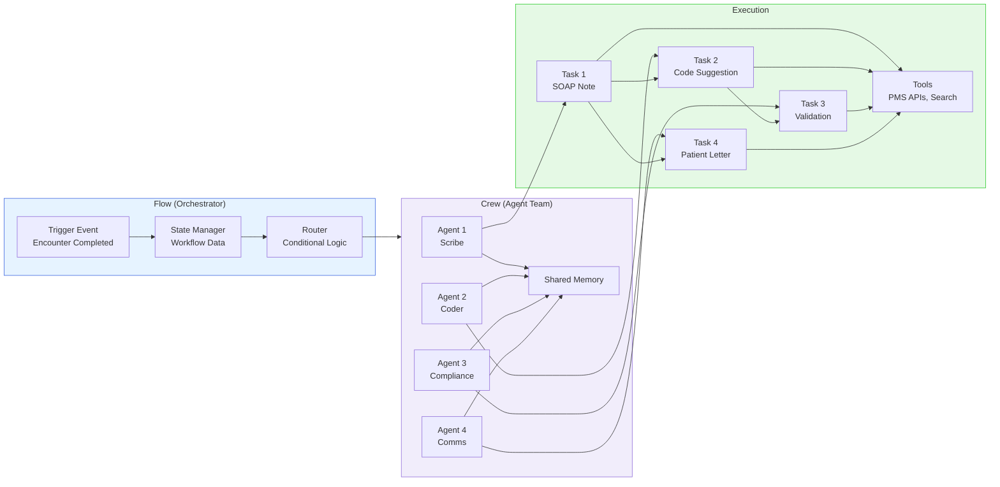
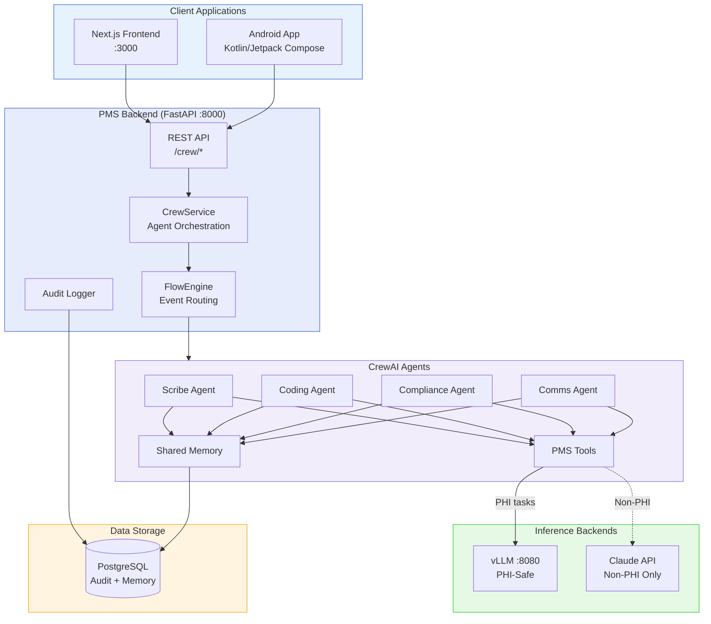

# CrewAI Developer Onboarding Tutorial

**Welcome to the MPS PMS CrewAI Integration Team**

This tutorial will take you from zero to building your first multi-agent clinical workflow with the PMS. By the end, you will understand how CrewAI orchestrates autonomous agent teams, have a running local environment, and have built and tested a complete Encounter Documentation Crew that generates SOAP notes, suggests medical codes, validates compliance, and drafts patient letters — all coordinated automatically.

**Document ID:** PMS-EXP-CREWAI-002
**Version:** 1.0
**Date:** 2026-03-09
**Applies To:** PMS project (all platforms)
**Prerequisite:** [CrewAI Setup Guide](55-CrewAI-PMS-Developer-Setup-Guide.md)
**Estimated time:** 2-3 hours
**Difficulty:** Beginner-friendly

---

## What You Will Learn

1. What CrewAI is and why multi-agent orchestration matters for healthcare
2. How Crews and Flows work together (the dual architecture)
3. How Agents, Tasks, Tools, and Memory interact
4. How to build a four-agent Encounter Documentation Crew
5. How to use structured Pydantic outputs for type-safe agent results
6. How to route agents between self-hosted vLLM and cloud LLMs
7. How to add custom PMS tools that agents can call
8. How to implement a Flow that triggers crews on events
9. How CrewAI compares to LangGraph, AutoGen, and other frameworks
10. How HIPAA compliance is maintained in multi-agent workflows

---

## Part 1: Understanding CrewAI (15 min read)

### 1.1 What Problem Does CrewAI Solve?

Consider the current AI workflow for Dr. Patel at Texas Retina Associates:

**After each encounter**, she clicks "Generate SOAP Note" (wait 8 seconds), reviews it, then clicks "Suggest Codes" (wait 6 seconds), reviews those, then clicks "Draft Follow-Up Letter" (wait 5 seconds), reviews it. Three separate clicks, three separate waits, no shared context between them. The coding agent doesn't know what the note says. The letter doesn't reference the specific codes.

**With CrewAI**, she clicks **one button** — "Run Documentation Pipeline" — and a coordinated crew of four agents executes: the Scribe generates the SOAP note, passes it to the Coder who suggests codes based on the actual note, the Compliance agent validates note-code consistency, and the Communication agent drafts a letter referencing the real findings. One click, 20-25 seconds, everything consistent and cross-referenced.

**The key insight**: Individual LLM calls (Exp 52: vLLM) are like having skilled contractors who don't talk to each other. CrewAI is the **project manager** that organizes them into a team, shares context, sequences their work, and validates the output.

### 1.2 How CrewAI Works — The Key Pieces



**Flows** are the manager — they define *when* things happen, manage state, and route events. Think of a Flow as a project plan: "When an encounter is completed, trigger the Documentation Crew. If confidence is low, escalate to a senior review."

**Crews** are the team — autonomous agent groups that collaborate on complex tasks. A Crew defines *who* does the work. Agents within a Crew can delegate to each other, share memory, and build on each other's outputs.

**The cycle**: Flow receives an event → manages state → assigns work to a Crew → Crew agents collaborate → return results to Flow → Flow decides what's next.

### 1.3 How CrewAI Fits with Other PMS Technologies

| Experiment | What It Does | Relationship to CrewAI |
|-----------|-------------|----------------------|
| Exp 05: OpenClaw | Autonomous task execution | **Overlapping** — CrewAI provides more mature multi-agent orchestration |
| Exp 52: vLLM | Self-hosted LLM inference | **Downstream** — CrewAI agents call vLLM for PHI-safe inference |
| Exp 53: Llama 4 | Multimodal LLM models | **Downstream** — Llama 4 on vLLM available as agent LLM backend |
| Exp 54: Mistral 3 | Tiered model family | **Downstream** — CrewAI routes simple tasks → small Mistral, complex → large |
| Exp 51: Connect Health | Voice contact center | **Complementary** — Connect Health captures calls; CrewAI documents them |
| Exp 10: Speechmatics | Cloud ASR | **Upstream** — ASR produces transcripts; CrewAI crew processes them |
| Exp 47: Availity | Eligibility/prior auth | **Complementary** — CrewAI generates PA letter; Availity submits it |

### 1.4 Key Vocabulary

| Term | Meaning |
|------|---------|
| **Agent** | An autonomous AI unit with a role, goal, backstory, LLM, and tools. Like a team member with a job description |
| **Task** | A specific assignment given to an agent. Has a description, expected output, and optional Pydantic schema |
| **Crew** | A team of agents working together on a set of tasks. Defines execution order (sequential, parallel, hierarchical) |
| **Flow** | An event-driven workflow that manages state and coordinates one or more Crews |
| **Tool** | A Python function decorated with `@tool` that agents can call to interact with external systems (PMS APIs, databases) |
| **Memory** | Shared knowledge across agents: short-term (current session), long-term (across sessions), entity (facts about people/things) |
| **Process** | Execution strategy for a Crew: `sequential` (one-by-one), `hierarchical` (manager delegates), or custom |
| **Context** | Task dependency — a task can reference other tasks as context, receiving their outputs as input |
| **Delegation** | An agent asking another agent for help on a subtask (enabled via `allow_delegation=True`) |
| **Structured Output** | Using Pydantic models to constrain agent output to valid, typed data structures |
| **Kickoff** | Starting a Crew's execution — `crew.kickoff()` begins the agent pipeline |
| **LLM Router** | Logic that sends different agents to different LLM backends based on task requirements |

### 1.5 Our Architecture



**Key principle**: CrewAI agents never talk to clients directly. All requests flow through the PMS backend, which handles authentication, audit logging, and PHI routing. Agents use tools to interact with PMS APIs and inference backends.

---

## Part 2: Environment Verification (15 min)

### 2.1 Checklist

```bash
# 1. Python with CrewAI
python3 -c "import crewai; print(f'CrewAI {crewai.__version__}')"
# Expected: CrewAI 1.x.x

# 2. vLLM running (inference backend)
curl -s http://localhost:8080/health
# Expected: 200 OK

# 3. vLLM model loaded
curl -s http://localhost:8080/v1/models \
  -H "Authorization: Bearer $VLLM_API_KEY" | jq '.data[].id'
# Expected: "meta-llama/Llama-3.1-8B-Instruct"

# 4. PMS backend running
curl -s http://localhost:8000/health | jq .status
# Expected: "ok"

# 5. Crew endpoint available
curl -s http://localhost:8000/crew/ -o /dev/null -w "%{http_code}"
# Expected: 200 or 404 (endpoint exists but needs POST)

# 6. PMS frontend running
curl -s http://localhost:3000 -o /dev/null -w "%{http_code}"
# Expected: 200
```

### 2.2 Quick Test

```bash
# End-to-end test: trigger a minimal crew run
curl -s -X POST http://localhost:8000/crew/encounter-documentation \
  -H "Content-Type: application/json" \
  -d '{
    "encounter_id": "test-001",
    "transcript": "Patient reports stable vision. No new symptoms. Continue current treatment.",
    "patient_id": "pat-test",
    "specialty": "ophthalmology"
  }' | jq .soap_note
# Expected: A SOAP note generated by the Scribe Agent
```

If this returns a note, your full CrewAI pipeline is working.

---

## Part 3: Build Your First Integration (45 min)

### 3.1 What We Are Building

We'll build a complete **Encounter Documentation Crew** from scratch — four agents that collaborate to process an ophthalmology encounter:

1. **Scribe Agent**: Generates a structured SOAP note from the encounter transcript
2. **Coding Agent**: Suggests ICD-10 and CPT codes from the SOAP note
3. **Compliance Agent**: Validates note-code consistency and checks for issues
4. **Communication Agent**: Drafts a patient follow-up letter

### 3.2 Define the Agents

```python
# scripts/test_crewai_pipeline.py
"""End-to-end CrewAI clinical documentation pipeline."""

from crewai import Agent, Task, Crew, LLM, Process
from crewai.tools import tool
from pydantic import BaseModel
import os
import time

# Configure LLM (vLLM self-hosted)
vllm_llm = LLM(
    model="openai/meta-llama/Llama-3.1-8B-Instruct",
    base_url=os.getenv("CREWAI_VLLM_BASE_URL", "http://localhost:8080/v1"),
    api_key=os.getenv("VLLM_API_KEY", "test-key"),
    temperature=0.3,
    max_tokens=2048,
)

# Define a simple validation tool
@tool("Validate ICD-10 Code")
def validate_icd10(code: str) -> str:
    """Check if an ICD-10 code format is valid."""
    import re
    pattern = r'^[A-Z]\d{2}(\.\d{1,4})?$'
    if re.match(pattern, code):
        return f"Code {code} has valid ICD-10 format"
    return f"Code {code} has INVALID ICD-10 format"

@tool("Check Reading Level")
def check_reading_level(text: str) -> str:
    """Estimate the reading grade level of text."""
    words = len(text.split())
    sentences = max(1, text.count('.') + text.count('!') + text.count('?'))
    grade = round(0.39 * (words / sentences) - 10)
    return f"Estimated reading level: grade {max(1, min(12, grade))}"
```

### 3.3 Create the Four Agents

```python
# Scribe Agent — generates SOAP notes
scribe = Agent(
    role="Medical Scribe",
    goal="Generate accurate SOAP clinical notes from encounter transcripts",
    backstory=(
        "You are an experienced medical scribe specializing in ophthalmology "
        "at Texas Retina Associates. You produce precise SOAP notes using "
        "standard medical terminology. You never add information not in the transcript."
    ),
    llm=vllm_llm,
    verbose=True,
)

# Coding Agent — suggests ICD-10 and CPT codes
coder = Agent(
    role="Certified Medical Coder",
    goal="Suggest ICD-10 and CPT codes with confidence scores from clinical notes",
    backstory=(
        "You are a CPC-certified medical coder with 10 years of ophthalmology "
        "coding experience. You analyze SOAP notes and suggest the most specific "
        "applicable codes. You always explain your reasoning."
    ),
    llm=vllm_llm,
    tools=[validate_icd10],
    verbose=True,
)

# Compliance Agent — validates outputs
compliance = Agent(
    role="Clinical Compliance Reviewer",
    goal="Validate that notes, codes, and communications meet quality standards",
    backstory=(
        "You are a healthcare compliance specialist who reviews AI-generated "
        "documentation. You check note-code consistency, identify missing codes, "
        "and flag any potential issues before clinician review."
    ),
    llm=vllm_llm,
    verbose=True,
)

# Communication Agent — drafts patient letters
comms = Agent(
    role="Patient Communication Specialist",
    goal="Draft clear patient communications at a 6th-grade reading level",
    backstory=(
        "You write patient letters that are warm, clear, and jargon-free. "
        "You target a 6th-grade reading level. You include all necessary "
        "medical details in plain language."
    ),
    llm=vllm_llm,
    tools=[check_reading_level],
    verbose=True,
)
```

### 3.4 Define the Tasks

```python
ENCOUNTER_TRANSCRIPT = """
Dr. Patel: Good morning, Maria. How have your eyes been since your last injection?

Maria Garcia: Good morning, doctor. My right eye has been a little blurry this week,
especially when reading. The left eye seems fine.

Dr. Patel: Let me take a look. The OCT shows some subretinal fluid in the right eye.
The left eye looks stable. Your visual acuity today is 20/40 in the right eye and
20/25 in the left.

Maria Garcia: Is that worse than last time?

Dr. Patel: The right eye was 20/30 last visit, so yes, slightly decreased.
Given the fluid and the decreased vision, I'd recommend another Eylea injection
in the right eye today. We'll keep the left eye on monitoring.

Maria Garcia: Okay, let's do it.

Dr. Patel: I'll numb the eye first with topical anesthesia, then prep with
betadine, and administer the 2mg Eylea injection. All done. The injection went
smoothly. I'd like to see you back in 4 weeks for another OCT.
"""

# Task 1: SOAP Note (Scribe Agent)
soap_task = Task(
    description=(
        "Generate a structured SOAP note from the following ophthalmology "
        f"encounter transcript:\n\n{ENCOUNTER_TRANSCRIPT}\n\n"
        "Format with clear S:, O:, A:, P: sections."
    ),
    expected_output="A complete SOAP note with Subjective, Objective, Assessment, and Plan",
    agent=scribe,
)

# Task 2: Code Suggestion (Coding Agent) — uses SOAP note as context
coding_task = Task(
    description=(
        "Analyze the SOAP note and suggest:\n"
        "1. All applicable ICD-10 diagnosis codes\n"
        "2. All applicable CPT procedure codes\n"
        "For each, provide: code, description, confidence (0.0-1.0).\n"
        "Validate each ICD-10 code format using the validate tool."
    ),
    expected_output="List of ICD-10 and CPT codes with confidence scores",
    agent=coder,
    context=[soap_task],  # Receives SOAP note output as input
)

# Task 3: Compliance Validation — checks note + codes
validation_task = Task(
    description=(
        "Review the SOAP note and suggested codes:\n"
        "1. Do the ICD-10 codes match the documented findings?\n"
        "2. Are all documented conditions and procedures coded?\n"
        "3. Are there any inconsistencies or missing codes?\n"
        "Provide a PASS/FAIL status with explanation."
    ),
    expected_output="Validation report with PASS/FAIL and detailed findings",
    agent=compliance,
    context=[soap_task, coding_task],
)

# Task 4: Patient Letter — uses encounter context
letter_task = Task(
    description=(
        "Draft a post-visit follow-up letter for Maria Garcia. Include:\n"
        "- What was done today (in plain language)\n"
        "- Follow-up instructions (when to come back)\n"
        "- Warning signs to watch for\n"
        "- Use a 6th-grade reading level. Check reading level with the tool."
    ),
    expected_output="A patient-friendly follow-up letter",
    agent=comms,
    context=[soap_task],
)
```

### 3.5 Assemble and Run the Crew

```python
def run_pipeline():
    print("=" * 60)
    print("CREWAI ENCOUNTER DOCUMENTATION PIPELINE")
    print("=" * 60)

    crew = Crew(
        agents=[scribe, coder, compliance, comms],
        tasks=[soap_task, coding_task, validation_task, letter_task],
        process=Process.sequential,
        verbose=True,
    )

    t0 = time.time()
    result = crew.kickoff()
    elapsed = time.time() - t0

    print(f"\n{'═' * 60}")
    print(f"PIPELINE COMPLETE — {elapsed:.1f}s total")
    print(f"{'═' * 60}")

    # Display results from each task
    for i, task in enumerate([soap_task, coding_task, validation_task, letter_task]):
        labels = ["SOAP NOTE", "CODE SUGGESTIONS", "COMPLIANCE VALIDATION", "PATIENT LETTER"]
        print(f"\n{'─' * 60}")
        print(f"[{i+1}] {labels[i]}")
        print(f"{'─' * 60}")
        if task.output:
            print(task.output.raw)
        else:
            print("(No output)")

    # Token usage summary
    if hasattr(result, 'token_usage'):
        print(f"\n{'─' * 60}")
        print("TOKEN USAGE")
        print(f"{'─' * 60}")
        print(result.token_usage)


if __name__ == "__main__":
    run_pipeline()
```

### 3.6 Run It

```bash
pip install crewai httpx  # if not already installed
python scripts/test_crewai_pipeline.py
```

Expected output: Sequential execution of all four agents — you'll see verbose logs of each agent reasoning through its task, calling tools, and producing output. The final result includes a SOAP note, medical codes, a validation report, and a patient letter — all contextually linked.

---

## Part 4: Evaluating Strengths and Weaknesses (15 min)

### 4.1 Strengths

- **Role-based agent design**: Maps naturally to clinical team structures — scribe, coder, compliance reviewer, communication specialist. Easy to reason about and extend.
- **Fastest time-to-production**: 40% faster to deploy multi-agent teams than LangGraph. Role-based abstraction gets crews running quickly.
- **Native multi-provider LLM support**: Built-in integrations for OpenAI, Anthropic, Google, vLLM, Ollama — no adapters needed. Switch LLM per agent.
- **Structured Pydantic outputs**: Constrain agent outputs to typed schemas — critical for clinical data that feeds into PMS records.
- **Shared memory system**: Short-term (session), long-term (persistent), and entity memory. Agents learn from previous encounters.
- **100+ built-in tools**: Web search, file operations, database queries out of the box. Custom tools via simple `@tool` decorator.
- **Flows for event orchestration**: Event-driven workflows with state management, conditional branching, and crew sequencing.
- **MIT license**: No restrictions on commercial or healthcare use.
- **44,600+ GitHub stars**: Largest multi-agent framework community. 100,000+ certified developers. Active development.
- **No separate infrastructure**: Runs as a Python library in the existing FastAPI backend — no new containers, no new ports.

### 4.2 Weaknesses

- **Less granular state control than LangGraph**: No built-in checkpointing at individual node level. If a crew fails mid-pipeline, it restarts from the beginning.
- **Reliability under load**: Benchmarks show a 44% failure rate under high concurrency (vs LangGraph's more stable execution). Must implement retry logic and error handling at the application level.
- **LLM cost amplification**: Multi-agent pipelines multiply token usage. A 4-agent crew uses ~4x the tokens of a single LLM call. Monitor `token_usage` carefully.
- **Debugging complexity**: Agent reasoning chains are harder to debug than single LLM calls. Verbose logging helps but adds noise.
- **Memory not HIPAA-grade by default**: Built-in memory stores conversation history — must ensure PHI is stripped before memory persistence, or use custom memory backends.
- **Framework coupling**: Despite MIT license, some features are tightly coupled to CrewAI's architecture. Migrating to LangGraph later requires significant rewrite.
- **Limited async support**: Crews run synchronously by default. Async execution requires wrapping in FastAPI BackgroundTasks or similar.

### 4.3 When to Use CrewAI vs Alternatives

| Scenario | Best Choice | Why |
|----------|-------------|-----|
| Multi-step clinical documentation | **CrewAI** | Role-based agents map to clinical team structure |
| Complex branching with checkpoints | **LangGraph** | Graph-based state, node-level checkpointing |
| Conversational multi-agent debate | **AutoGen** | Designed for agent conversation patterns |
| Simple single-agent task | **Direct LLM call (vLLM)** | No orchestration overhead needed |
| OpenAI-only environment | **OpenAI Agents SDK** | Tightest integration with OpenAI |
| Type-safe single-agent with validation | **PydanticAI** | Minimal overhead, strong typing |
| Production-critical workflow (financial, legal) | **LangGraph** | 30-40% lower latency, full checkpointing |
| Rapid prototyping of agent teams | **CrewAI** | Fastest time-to-working-demo |
| Self-hosted LLM required (HIPAA) | **CrewAI** or **LangGraph** | Both support vLLM; AutoGen does not natively |

### 4.4 HIPAA / Healthcare Considerations

- **PHI routing enforcement**: Configure the Flow engine to route PHI-containing tasks exclusively through self-hosted vLLM. Cloud LLM agents receive only de-identified context. This must be enforced at the infrastructure level, not by agent instructions.
- **Memory isolation**: Agent memory must be partitioned per clinic/provider. Use custom memory backends (PostgreSQL) with tenant isolation. Never store raw PHI in memory — hash or tokenize identifiers.
- **Audit trail**: Log every agent action, tool call, LLM prompt hash, and response hash in PostgreSQL. CrewAI's verbose mode provides execution traces; pipe these to OpenTelemetry for production monitoring.
- **Tool sandboxing**: Custom tools that access PMS APIs must validate inputs, enforce RBAC, and sanitize outputs. Agents should not have arbitrary database access.
- **Clinician-in-the-loop**: Every crew output must be reviewed by a licensed clinician before entering the medical record. Never auto-commit agent outputs.
- **Model provenance**: Document which LLM model each agent used in the audit log. Healthcare audits require knowing exactly which model generated each clinical suggestion.
- **No training on PHI**: CrewAI is orchestration-only. The LLM inference (vLLM) is also inference-only. No model training or fine-tuning on PHI.

---

## Part 5: Debugging Common Issues (15 min read)

### Issue 1: Agent produces hallucinated medical information

**Symptom:** Agent generates codes or diagnoses not supported by the transcript.

**Cause:** Temperature too high, or prompt doesn't constrain the agent to transcript-only information.

**Fix:**
```python
# Lower temperature for clinical tasks
llm = LLM(model="openai/...", temperature=0.1)  # Very low for factual tasks

# Add explicit constraints in agent backstory
backstory="...You NEVER fabricate information not present in the transcript..."
```

### Issue 2: Tasks execute out of order

**Symptom:** Coding agent runs before SOAP note is generated.

**Cause:** Missing `context` dependency between tasks.

**Fix:**
```python
coding_task = Task(
    ...,
    context=[soap_task],  # This creates the dependency
)
```

### Issue 3: Crew takes very long (>60 seconds)

**Symptom:** Pipeline stalls, especially with verbose logging.

**Cause:** Agent is stuck in a reasoning loop, or vLLM is overloaded.

**Fix:**
```python
# Set max iterations per agent
agent = Agent(..., max_iter=5)  # Limit reasoning loops

# Check vLLM health
# curl -s http://localhost:8080/metrics | grep vllm_num_requests
```

### Issue 4: Tool call fails with "Tool not found"

**Symptom:** `ToolNotFoundException` in agent execution.

**Cause:** Tool not assigned to the agent that's trying to use it.

**Fix:**
```python
# Ensure the tool is in the agent's tool list
coder = Agent(
    ...,
    tools=[validate_icd10],  # Must include the tool here
)
```

### Issue 5: Structured output parsing fails

**Symptom:** `ValidationError` from Pydantic when parsing agent output.

**Cause:** LLM output doesn't match the Pydantic schema.

**Fix:**
```python
# Add explicit format instructions in the task description
task = Task(
    description="...Return a JSON object with keys: code, description, confidence...",
    output_pydantic=CodeSuggestion,
)

# Use response_format for JSON mode (if supported by LLM)
llm = LLM(..., response_format={"type": "json_object"})
```

### Issue 6: Memory persistence not working

**Symptom:** Agent doesn't remember context from previous runs.

**Cause:** Memory backend not configured for persistence.

**Fix:**
```python
crew = Crew(
    ...,
    memory=True,  # Enable memory
    # Configure persistent storage in CrewAI settings
)
```

---

## Part 6: Practice Exercises (45 min)

### Option A: Build a Prior Authorization Crew

Build a two-agent crew that generates prior authorization letters.

**Hints:**
1. **Clinical Justification Agent**: Takes procedure code, diagnosis, and patient history. Produces a structured clinical justification with medical necessity evidence.
2. **Letter Formatting Agent**: Takes the justification and payer requirements. Produces a formatted PA letter ready for submission.
3. Use `fetch_patient` and `fetch_medications` tools for context.
4. Add structured Pydantic output for the letter (recipient, date, patient info, justification body, requested procedure).
5. Test with: "Prior auth for Eylea injection (67028) for wet AMD (H35.3211)"

### Option B: Build a Confidence-Based LLM Router

Implement a Flow that routes tasks to different LLMs based on complexity.

**Hints:**
1. Create a "Triage Agent" that analyzes the encounter and rates complexity (1-5).
2. If complexity <= 3: route to vLLM (self-hosted, fast, cheap).
3. If complexity > 3: route to Claude (cloud, better reasoning, more expensive).
4. Use a Flow with conditional branching: `@flow.conditional("complexity")`
5. Track routing decisions in the audit log for cost analysis.
6. Test with simple encounter (follow-up, stable) vs complex (new diagnosis, multiple comorbidities).

### Option C: Build a Quality Review Crew (Batch)

Build a crew that runs end-of-day quality checks across all encounters.

**Hints:**
1. **Data Gathering Agent**: Fetches all encounters from today via PMS API.
2. **Quality Reviewer Agent**: Checks each encounter for: unsigned notes, missing codes, incomplete documentation.
3. **Report Generator Agent**: Produces a quality summary with metrics and action items.
4. Run as a scheduled task (not real-time) — use FastAPI's `BackgroundTasks`.
5. Output: Markdown-formatted quality report saved to `/api/reports`.

---

## Part 7: Development Workflow and Conventions

### 7.1 File Organization

```
pms-backend/
├── src/pms/
│   ├── services/
│   │   ├── crew_service.py        # CrewAI orchestration (Crews + Agents)
│   │   ├── crew_tools.py          # Custom @tool functions wrapping PMS APIs
│   │   ├── flow_engine.py         # Flow definitions (event-driven workflows)
│   │   └── llm_service.py         # Direct LLM calls (Exp 52, single-agent)
│   ├── routers/
│   │   ├── crew.py                # FastAPI endpoints (/crew/*)
│   │   └── llm.py                 # Single-call LLM endpoints (/llm/*)
│   └── config.py                  # CREWAI_* settings
├── docker-compose.yml             # vLLM + PostgreSQL (CrewAI in backend)
└── .env                           # CREWAI_* environment variables

pms-frontend/
├── src/components/
│   ├── crew/
│   │   └── CrewPipelineStatus.tsx # Crew execution status + result review
│   └── llm/
│       ├── NoteGenerator.tsx      # Single-agent note generation (Exp 52)
│       └── CodeSuggestions.tsx     # Single-agent code suggestion (Exp 52)

scripts/
├── test_crewai_pipeline.py        # End-to-end crew pipeline test
└── test_vllm_pipeline.py          # Single-agent pipeline test (Exp 52)
```

### 7.2 Naming Conventions

| Item | Convention | Example |
|------|-----------|---------|
| Service class | `CrewService` | `CrewService()` |
| Agent variable | Descriptive role name | `scribe`, `coder`, `compliance` |
| Task variable | `{action}_task` | `soap_task`, `coding_task` |
| Tool function | `@tool("Human Readable Name")` | `@tool("Fetch Patient Record")` |
| API endpoint | `/crew/{workflow}` | `/crew/encounter-documentation` |
| Config variable | `CREWAI_{KEY}` | `CREWAI_VLLM_BASE_URL` |
| React component | `Crew{Feature}.tsx` | `CrewPipelineStatus.tsx` |
| Pydantic output | PascalCase noun | `SOAPNote`, `CodeSuggestion` |

### 7.3 PR Checklist

- [ ] No PHI in agent prompts, backstories, or tool inputs (use IDs and codes, not raw patient data)
- [ ] All crews go through `CrewService` (never instantiate Crew directly in routers)
- [ ] Audit log entry for every crew kickoff and completion
- [ ] PHI-containing tasks route to vLLM only (never cloud LLM)
- [ ] Structured Pydantic outputs for any data that feeds into PMS records
- [ ] Temperature set appropriately (0.1-0.3 for clinical tasks)
- [ ] `max_iter` set on agents to prevent infinite reasoning loops
- [ ] Error handling for agent failures and LLM timeouts
- [ ] Frontend shows crew execution status (running/complete/error)
- [ ] Frontend requires clinician review before accepting crew outputs
- [ ] Token usage tracked and logged

### 7.4 Security Reminders

- **Never log PHI in agent verbose output**: Set `verbose=False` in production. Verbose logs contain full prompts and responses.
- **PHI routing is non-negotiable**: Enforce at the Flow/infrastructure level. Don't rely on agent instructions to avoid sending PHI to cloud LLMs.
- **Sanitize tool inputs and outputs**: Tools that query PMS APIs must not expose more data than needed for the agent's task.
- **Clinician-in-the-loop**: Every crew output must be reviewed. Display confidence indicators. Never auto-save to encounter records.
- **Memory hygiene**: If using persistent memory, ensure PHI is hashed or removed before storage. Review memory retention policies.
- **Model versioning**: Log which LLM model and version each agent used in the audit trail.
- **Agent isolation**: Agents should not have access to tools outside their role. The Scribe doesn't need `save_note` — that's done after clinician review.

---

## Part 8: Quick Reference Card

### Key Commands

```bash
# Test crew pipeline
curl -s -X POST http://localhost:8000/crew/encounter-documentation \
  -H "Content-Type: application/json" \
  -d '{"encounter_id":"enc-001","transcript":"Patient stable, vision 20/25 OU","patient_id":"pat-001"}' | jq .

# Check vLLM (inference backend)
curl -s http://localhost:8080/health

# Run test script
python scripts/test_crewai_pipeline.py

# Check CrewAI version
python3 -c "import crewai; print(crewai.__version__)"
```

### Key Files

| File | Purpose |
|------|---------|
| `src/pms/services/crew_service.py` | Crew orchestration (core) |
| `src/pms/services/crew_tools.py` | PMS API tools for agents |
| `src/pms/services/flow_engine.py` | Event-driven workflow engine |
| `src/pms/routers/crew.py` | FastAPI endpoints |
| `src/pms/config.py` | CREWAI_* settings |
| `CrewPipelineStatus.tsx` | Crew execution UI |

### Key URLs

| Resource | URL |
|----------|-----|
| PMS Crew endpoints | http://localhost:8000/crew/* |
| PMS LLM endpoints (single-call) | http://localhost:8000/llm/* |
| vLLM server | http://localhost:8080 |
| CrewAI docs | https://docs.crewai.com/ |
| CrewAI GitHub | https://github.com/crewAIInc/crewAI |
| CrewAI LLM providers | https://docs.crewai.com/en/concepts/llms |

### Starter Template

```python
from crewai import Agent, Task, Crew, LLM, Process

# Configure LLM
llm = LLM(
    model="openai/meta-llama/Llama-3.1-8B-Instruct",
    base_url="http://localhost:8080/v1",
    api_key="your-key",
    temperature=0.3,
)

# Define agent
agent = Agent(
    role="Your Role",
    goal="What this agent accomplishes",
    backstory="Background and expertise",
    llm=llm,
    tools=[],  # Add @tool-decorated functions
    verbose=True,
)

# Define task
task = Task(
    description="What the agent should do",
    expected_output="What the result looks like",
    agent=agent,
)

# Create and run crew
crew = Crew(agents=[agent], tasks=[task], process=Process.sequential)
result = crew.kickoff()
print(result)
```

---

## Next Steps

1. Review the [CrewAI PRD](55-PRD-CrewAI-PMS-Integration.md) for full component definitions and implementation phases
2. Build the Administrative Crew (Prior Auth + Quality + Scheduling agents)
3. Implement persistent memory with PostgreSQL for cross-encounter context
4. Configure confidence-based LLM routing between vLLM and Claude
5. Explore [CrewAI Flows](https://docs.crewai.com/) for event-driven clinical workflow automation
6. Set up OpenTelemetry tracing for production agent observability
7. Compare crew outputs vs single LLM calls (Exp 52) in an A/B test
