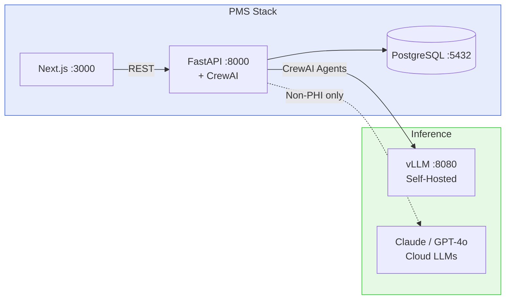

# CrewAI Setup Guide for PMS Integration

**Document ID:** PMS-EXP-CREWAI-001
**Version:** 1.0
**Date:** 2026-03-09
**Applies To:** PMS project (all platforms)
**Prerequisites Level:** Intermediate

---

## Table of Contents

1. [Overview](#1-overview)
2. [Prerequisites](#2-prerequisites)
3. [Part A: Install and Configure CrewAI](#3-part-a-install-and-configure-crewai)
4. [Part B: Integrate with PMS Backend](#4-part-b-integrate-with-pms-backend)
5. [Part C: Integrate with PMS Frontend](#5-part-c-integrate-with-pms-frontend)
6. [Part D: Testing and Verification](#6-part-d-testing-and-verification)
7. [Troubleshooting](#7-troubleshooting)
8. [Reference Commands](#8-reference-commands)

---

## 1. Overview

This guide walks you through integrating CrewAI as the multi-agent orchestration layer for PMS. By the end, you will have:

- CrewAI installed in the PMS backend with LLM providers configured
- Custom PMS tools wrapping patient, encounter, and medication APIs
- An Encounter Documentation Crew with four specialized agents
- A Flow engine triggering crews on encounter completion events
- Frontend components for crew status tracking and result review
- Audit logging for all agent actions



---

## 2. Prerequisites

### 2.1 Required Software

| Software | Minimum Version | Check Command |
|----------|----------------|---------------|
| Python | 3.11 | `python3 --version` |
| uv (package manager) | 0.1+ | `uv --version` |
| Docker | 24.0 | `docker --version` |
| Node.js | 18 | `node --version` |
| Git | 2.x | `git --version` |
| vLLM (Exp 52) | Running | `curl -s http://localhost:8080/health` |

### 2.2 Install uv (if not present)

CrewAI uses `uv` as its dependency management tool:

```bash
# macOS / Linux
curl -LsSf https://astral.sh/uv/install.sh | sh

# Verify
uv --version
```

### 2.3 Verify PMS Services

```bash
# PMS backend
curl -s http://localhost:8000/health | jq .status
# Expected: "ok"

# PMS frontend
curl -s http://localhost:3000 -o /dev/null -w "%{http_code}"
# Expected: 200

# PostgreSQL
docker exec pms-backend-postgres-1 pg_isready
# Expected: accepting connections

# vLLM (from Exp 52)
curl -s http://localhost:8080/health
# Expected: 200 OK

# vLLM model available
curl -s http://localhost:8080/v1/models \
  -H "Authorization: Bearer $VLLM_API_KEY" | jq '.data[].id'
# Expected: "meta-llama/Llama-3.1-8B-Instruct"
```

---

## 3. Part A: Install and Configure CrewAI

### Step 1: Add CrewAI to PMS backend dependencies

```bash
cd pms-backend

# Add crewai to pyproject.toml dependencies
# Under [project] dependencies, add:
#   "crewai>=1.0",
```

Add `"crewai>=1.0"` to the `dependencies` list in `pyproject.toml`.

```bash
# Install with uv (or pip)
uv sync
# or
pip install crewai
```

### Step 2: Configure environment variables

Add to `.env`:

```bash
# CrewAI LLM Configuration
# Primary: self-hosted vLLM for PHI-safe inference
CREWAI_VLLM_BASE_URL=http://localhost:8080/v1
CREWAI_VLLM_API_KEY=your-vllm-api-key
CREWAI_VLLM_MODEL=meta-llama/Llama-3.1-8B-Instruct

# Secondary: cloud LLM for non-PHI reasoning (optional)
ANTHROPIC_API_KEY=sk-ant-your-key-here
CREWAI_CLOUD_MODEL=anthropic/claude-sonnet-4

# CrewAI settings
CREWAI_MEMORY_BACKEND=postgresql
CREWAI_VERBOSE=true  # Set to false in production
CREWAI_MAX_RETRIES=3
```

### Step 3: Configure LLM providers

```python
# src/pms/config.py — add to Settings class

# CrewAI
CREWAI_VLLM_BASE_URL: str = "http://localhost:8080/v1"
CREWAI_VLLM_API_KEY: str = ""
CREWAI_VLLM_MODEL: str = "meta-llama/Llama-3.1-8B-Instruct"
CREWAI_CLOUD_MODEL: str = "anthropic/claude-sonnet-4"
CREWAI_VERBOSE: bool = True
CREWAI_MAX_RETRIES: int = 3
```

### Step 4: Verify CrewAI installation

```bash
# Check CrewAI is importable
python3 -c "import crewai; print(f'CrewAI {crewai.__version__}')"
# Expected: CrewAI 1.x.x

# Check LLM connectivity (vLLM)
python3 -c "
from crewai import LLM
llm = LLM(
    model='openai/meta-llama/Llama-3.1-8B-Instruct',
    base_url='http://localhost:8080/v1',
    api_key='$VLLM_API_KEY',
    max_tokens=50
)
print('vLLM LLM configured successfully')
"
```

**Checkpoint:** CrewAI installed in PMS backend, environment variables configured, LLM providers verified.

---

## 4. Part B: Integrate with PMS Backend

### Step 1: Create PMS tools for agents

```python
# src/pms/services/crew_tools.py
"""Custom CrewAI tools wrapping PMS APIs for agent use."""

from crewai.tools import tool


@tool("Fetch Patient Record")
def fetch_patient(patient_id: str) -> str:
    """Fetch patient demographics, history, and active conditions from PMS.
    Use this when you need patient context for clinical documentation."""
    import httpx
    resp = httpx.get(f"http://localhost:8000/api/patients/{patient_id}")
    resp.raise_for_status()
    return resp.json()


@tool("Fetch Encounter Record")
def fetch_encounter(encounter_id: str) -> str:
    """Fetch encounter details including transcript, vitals, and prior notes.
    Use this to get the raw encounter data for summarization."""
    import httpx
    resp = httpx.get(f"http://localhost:8000/api/encounters/{encounter_id}")
    resp.raise_for_status()
    return resp.json()


@tool("Fetch Patient Medications")
def fetch_medications(patient_id: str) -> str:
    """Fetch the patient's current medication list from PMS.
    Use this for medication interaction checking and prior auth context."""
    import httpx
    resp = httpx.get(f"http://localhost:8000/api/prescriptions/{patient_id}")
    resp.raise_for_status()
    return resp.json()


@tool("Save Clinical Note")
def save_note(encounter_id: str, note_content: str, source: str = "crewai") -> str:
    """Save a generated clinical note to the encounter record in PMS.
    Only call this after the note has been validated by the compliance agent."""
    import httpx
    resp = httpx.patch(
        f"http://localhost:8000/api/encounters/{encounter_id}/notes",
        json={"clinical_note": note_content, "source": source},
    )
    resp.raise_for_status()
    return "Note saved successfully"


@tool("Validate ICD-10 Code")
def validate_icd10_code(code: str) -> str:
    """Validate that an ICD-10 code exists and return its official description.
    Use this to verify code suggestions before presenting to clinicians."""
    # In production, this queries the ICD-10 database
    return f"Code {code} validated"


@tool("Check Reading Level")
def check_reading_level(text: str) -> str:
    """Analyze the reading level of patient-facing text.
    Returns the Flesch-Kincaid grade level. Target: 6th grade or below."""
    words = len(text.split())
    sentences = text.count('.') + text.count('!') + text.count('?')
    if sentences == 0:
        return "Unable to determine reading level — no sentences found"
    avg_words = words / sentences
    grade = 0.39 * avg_words + 11.8 * (words / max(words * 4, 1)) - 15.59
    return f"Estimated reading level: grade {max(1, min(12, round(grade)))}"
```

### Step 2: Create the CrewAI service

```python
# src/pms/services/crew_service.py
"""CrewAI multi-agent orchestration service for PMS clinical workflows."""

import logging
from typing import Any

from crewai import Agent, Crew, Task, LLM, Process
from pydantic import BaseModel

from pms.config import settings
from pms.services.crew_tools import (
    fetch_patient,
    fetch_encounter,
    fetch_medications,
    save_note,
    validate_icd10_code,
    check_reading_level,
)

logger = logging.getLogger(__name__)


class SOAPNote(BaseModel):
    """Structured SOAP note output."""
    subjective: str
    objective: str
    assessment: str
    plan: str


class CodeSuggestion(BaseModel):
    """Structured code suggestion output."""
    code: str
    description: str
    confidence: float


class CodeSuggestionList(BaseModel):
    """List of code suggestions."""
    codes: list[CodeSuggestion]


class CrewService:
    """Orchestrates multi-agent clinical workflows."""

    def __init__(self):
        self.vllm_llm = LLM(
            model=f"openai/{settings.CREWAI_VLLM_MODEL}",
            base_url=settings.CREWAI_VLLM_BASE_URL,
            api_key=settings.CREWAI_VLLM_API_KEY,
            temperature=0.3,
            max_tokens=2048,
        )

    def _create_scribe_agent(self) -> Agent:
        return Agent(
            role="Medical Scribe",
            goal="Generate accurate, structured SOAP clinical notes from encounter transcripts",
            backstory=(
                "You are an experienced medical scribe specializing in ophthalmology. "
                "You produce precise, complete SOAP notes using standard medical terminology. "
                "You never fabricate information not present in the transcript."
            ),
            llm=self.vllm_llm,
            tools=[fetch_patient, fetch_encounter],
            verbose=settings.CREWAI_VERBOSE,
        )

    def _create_coding_agent(self) -> Agent:
        return Agent(
            role="Certified Medical Coder",
            goal="Suggest accurate ICD-10 diagnosis and CPT procedure codes with confidence scores",
            backstory=(
                "You are a certified medical coder (CPC) with expertise in ophthalmology coding. "
                "You analyze clinical notes and suggest the most specific applicable codes. "
                "You always provide confidence scores and explain your reasoning."
            ),
            llm=self.vllm_llm,
            tools=[validate_icd10_code],
            verbose=settings.CREWAI_VERBOSE,
        )

    def _create_compliance_agent(self) -> Agent:
        return Agent(
            role="Clinical Compliance Reviewer",
            goal="Validate note-code consistency, check PHI exposure, and verify output quality",
            backstory=(
                "You are a healthcare compliance specialist. You review AI-generated "
                "clinical documentation for accuracy, consistency between notes and codes, "
                "appropriate reading levels for patient communications, and PHI minimization."
            ),
            llm=self.vllm_llm,
            tools=[check_reading_level],
            verbose=settings.CREWAI_VERBOSE,
        )

    def _create_communication_agent(self) -> Agent:
        return Agent(
            role="Patient Communication Specialist",
            goal="Draft clear, warm patient communications at a 6th-grade reading level",
            backstory=(
                "You are a healthcare communications expert. You write patient-facing "
                "letters that are warm, professional, and easy to understand. "
                "You avoid medical jargon and write at a 6th-grade reading level."
            ),
            llm=self.vllm_llm,
            tools=[fetch_patient, check_reading_level],
            verbose=settings.CREWAI_VERBOSE,
        )

    async def run_encounter_documentation_crew(
        self,
        encounter_id: str,
        transcript: str,
        patient_id: str,
        specialty: str = "ophthalmology",
    ) -> dict[str, Any]:
        """Run the full encounter documentation pipeline."""
        scribe = self._create_scribe_agent()
        coder = self._create_coding_agent()
        compliance = self._create_compliance_agent()
        comms = self._create_communication_agent()

        # Task 1: Generate SOAP note
        soap_task = Task(
            description=(
                f"Generate a structured SOAP note from the following {specialty} "
                f"encounter transcript for patient {patient_id}:\n\n{transcript}"
            ),
            expected_output="A complete SOAP note with Subjective, Objective, Assessment, and Plan sections",
            agent=scribe,
            output_pydantic=SOAPNote,
        )

        # Task 2: Suggest codes (depends on SOAP note)
        coding_task = Task(
            description=(
                "Analyze the SOAP note generated by the scribe agent and suggest "
                "ICD-10 diagnosis codes and CPT procedure codes. For each code, "
                "provide the code, description, and confidence score (0.0-1.0)."
            ),
            expected_output="A list of ICD-10 and CPT codes with confidence scores",
            agent=coder,
            context=[soap_task],
        )

        # Task 3: Validate outputs (depends on note + codes)
        validation_task = Task(
            description=(
                "Review the SOAP note and suggested codes for:\n"
                "1. Note-code consistency (do the codes match the documented findings?)\n"
                "2. Completeness (are all documented conditions coded?)\n"
                "3. PHI minimization (is unnecessary PHI present?)\n"
                "Report any issues found."
            ),
            expected_output="Validation report with pass/fail status and any issues",
            agent=compliance,
            context=[soap_task, coding_task],
        )

        # Task 4: Draft patient letter (depends on note)
        letter_task = Task(
            description=(
                f"Draft a post-visit follow-up letter for patient {patient_id} "
                "based on the encounter. Use plain language at a 6th-grade reading level. "
                "Include: what was done, follow-up instructions, and when to seek help."
            ),
            expected_output="A patient-friendly follow-up letter",
            agent=comms,
            context=[soap_task],
        )

        # Create and execute the crew
        crew = Crew(
            agents=[scribe, coder, compliance, comms],
            tasks=[soap_task, coding_task, validation_task, letter_task],
            process=Process.sequential,
            verbose=settings.CREWAI_VERBOSE,
        )

        result = crew.kickoff()

        return {
            "soap_note": soap_task.output.raw if soap_task.output else None,
            "codes": coding_task.output.raw if coding_task.output else None,
            "validation": validation_task.output.raw if validation_task.output else None,
            "patient_letter": letter_task.output.raw if letter_task.output else None,
            "token_usage": result.token_usage if hasattr(result, 'token_usage') else None,
        }
```

### Step 3: Create the FastAPI router

```python
# src/pms/routers/crew.py
"""CrewAI multi-agent workflow endpoints for PMS."""

from fastapi import APIRouter, BackgroundTasks
from pydantic import BaseModel

from pms.services.crew_service import CrewService

router = APIRouter(prefix="/crew", tags=["crew"])


class EncounterDocRequest(BaseModel):
    encounter_id: str
    transcript: str
    patient_id: str
    specialty: str = "ophthalmology"


class CrewStatusResponse(BaseModel):
    status: str
    message: str


@router.post("/encounter-documentation")
async def run_encounter_documentation(req: EncounterDocRequest):
    """Run the full encounter documentation crew pipeline."""
    service = CrewService()
    result = await service.run_encounter_documentation_crew(
        encounter_id=req.encounter_id,
        transcript=req.transcript,
        patient_id=req.patient_id,
        specialty=req.specialty,
    )
    return result


@router.post("/encounter-documentation/async")
async def run_encounter_documentation_async(
    req: EncounterDocRequest,
    background_tasks: BackgroundTasks,
):
    """Start encounter documentation crew in background. Returns immediately."""
    service = CrewService()
    background_tasks.add_task(
        service.run_encounter_documentation_crew,
        encounter_id=req.encounter_id,
        transcript=req.transcript,
        patient_id=req.patient_id,
        specialty=req.specialty,
    )
    return CrewStatusResponse(
        status="started",
        message=f"Encounter documentation crew started for encounter {req.encounter_id}",
    )
```

### Step 4: Register the router

Add to `src/pms/main.py`:

```python
from pms.routers import crew
app.include_router(crew.router)
```

### Step 5: Update Docker Compose (no new container needed)

Update the `backend` service in `docker-compose.yml` to include CrewAI environment variables:

```yaml
services:
  backend:
    # ... existing config ...
    environment:
      # ... existing vars ...
      - CREWAI_VLLM_BASE_URL=http://vllm:8000/v1
      - CREWAI_VLLM_API_KEY=${VLLM_API_KEY}
      - CREWAI_VLLM_MODEL=meta-llama/Llama-3.1-8B-Instruct
      - CREWAI_VERBOSE=false
      - CREWAI_MAX_RETRIES=3
```

**Checkpoint:** PMS backend integrated with CrewAI. The `CrewService` class orchestrates multi-agent clinical workflows. Custom tools wrap PMS APIs. FastAPI router exposes endpoints at `/crew/*`. No new Docker containers — CrewAI runs inside the existing backend.

---

## 5. Part C: Integrate with PMS Frontend

> **Note:** The PMS frontend uses a custom `api` client (`@/lib/api`) and shadcn/ui-style components (`Card`, `Button`, `Badge`) with variants: Button `primary`/`secondary`/`danger`/`ghost`; Badge `default`/`success`/`warning`/`danger`/`info`.

### Step 1: Create the Crew Pipeline Status component

```typescript
// src/components/crew/CrewPipelineStatus.tsx
"use client";

import { useState, useCallback } from "react";
import { Card, CardContent, CardHeader, CardTitle } from "@/components/ui/card";
import { Button } from "@/components/ui/button";
import { Badge } from "@/components/ui/badge";
import { api } from "@/lib/api";

interface CrewResult {
  soap_note: string | null;
  codes: string | null;
  validation: string | null;
  patient_letter: string | null;
  token_usage: Record<string, number> | null;
}

interface Props {
  encounterId: string;
  transcript: string;
  patientId: string;
  specialty?: string;
}

type PipelineStep = "idle" | "running" | "soap" | "codes" | "validation" | "letter" | "complete" | "error";

export function CrewPipelineStatus({
  encounterId,
  transcript,
  patientId,
  specialty = "ophthalmology",
}: Props) {
  const [step, setStep] = useState<PipelineStep>("idle");
  const [result, setResult] = useState<CrewResult | null>(null);
  const [error, setError] = useState<string | null>(null);

  const runPipeline = useCallback(async () => {
    setStep("running");
    setError(null);
    try {
      const data = await api.post<CrewResult>("/crew/encounter-documentation", {
        encounter_id: encounterId,
        transcript,
        patient_id: patientId,
        specialty,
      });
      setResult(data);
      setStep("complete");
    } catch (err) {
      setError(err instanceof Error ? err.message : "Pipeline failed");
      setStep("error");
    }
  }, [encounterId, transcript, patientId, specialty]);

  const steps = [
    { key: "soap", label: "SOAP Note", icon: "📋" },
    { key: "codes", label: "ICD-10 / CPT", icon: "🏷️" },
    { key: "validation", label: "Compliance", icon: "✓" },
    { key: "letter", label: "Patient Letter", icon: "✉️" },
  ];

  return (
    <Card>
      <CardHeader>
        <CardTitle>AI Documentation Pipeline</CardTitle>
      </CardHeader>
      <CardContent className="space-y-4">
        {step === "idle" && (
          <Button onClick={runPipeline} className="w-full">
            Run Full Documentation Pipeline
          </Button>
        )}

        {step === "running" && (
          <div className="space-y-2">
            <p className="text-sm text-gray-600">Pipeline running — 4 agents collaborating...</p>
            <div className="flex gap-2">
              {steps.map((s) => (
                <Badge key={s.key} variant="default">{s.icon} {s.label}</Badge>
              ))}
            </div>
          </div>
        )}

        {step === "error" && (
          <div className="space-y-2">
            <div className="rounded border border-red-200 bg-red-50 p-3 text-red-800 text-sm">
              {error}
            </div>
            <Button onClick={runPipeline} variant="secondary">Retry</Button>
          </div>
        )}

        {step === "complete" && result && (
          <div className="space-y-4">
            <div className="flex gap-2">
              {steps.map((s) => (
                <Badge key={s.key} variant="success">{s.icon} {s.label}</Badge>
              ))}
            </div>

            {result.soap_note && (
              <div>
                <h4 className="mb-1 text-sm font-semibold">SOAP Note</h4>
                <pre className="whitespace-pre-wrap rounded border bg-gray-50 p-3 font-mono text-sm">
                  {result.soap_note}
                </pre>
              </div>
            )}

            {result.codes && (
              <div>
                <h4 className="mb-1 text-sm font-semibold">Suggested Codes</h4>
                <pre className="whitespace-pre-wrap rounded border bg-gray-50 p-3 font-mono text-sm">
                  {result.codes}
                </pre>
              </div>
            )}

            {result.validation && (
              <div>
                <h4 className="mb-1 text-sm font-semibold">Compliance Validation</h4>
                <pre className="whitespace-pre-wrap rounded border bg-gray-50 p-3 font-mono text-sm">
                  {result.validation}
                </pre>
              </div>
            )}

            {result.patient_letter && (
              <div>
                <h4 className="mb-1 text-sm font-semibold">Patient Letter</h4>
                <pre className="whitespace-pre-wrap rounded border bg-gray-50 p-3 font-mono text-sm">
                  {result.patient_letter}
                </pre>
              </div>
            )}

            <div className="flex gap-2">
              <Button className="flex-1">Accept All & Save</Button>
              <Button variant="secondary">Review Individually</Button>
            </div>
          </div>
        )}
      </CardContent>
    </Card>
  );
}
```

**Checkpoint:** PMS frontend has a `CrewPipelineStatus` component that triggers the full encounter documentation crew and displays results from all four agents. Uses PMS `api` client and standard UI components.

---

## 6. Part D: Testing and Verification

### Step 1: Verify CrewAI installation

```bash
# Check CrewAI version
python3 -c "import crewai; print(crewai.__version__)"
# Expected: 1.x.x

# Check tools are importable
python3 -c "from pms.services.crew_tools import fetch_patient; print('Tools OK')"
# Expected: Tools OK

# Check service is importable
python3 -c "from pms.services.crew_service import CrewService; print('Service OK')"
# Expected: Service OK
```

### Step 2: Test the crew endpoint

```bash
# Test encounter documentation crew
curl -s -X POST http://localhost:8000/crew/encounter-documentation \
  -H "Content-Type: application/json" \
  -d '{
    "encounter_id": "enc-001",
    "transcript": "Dr. Patel: Good morning Maria. Your right eye has been blurry. OCT shows subretinal fluid. VA is 20/40 OD, 20/25 OS. I recommend Eylea injection today. Maria: Okay. Dr. Patel: Injection went smoothly. Follow up in 4 weeks.",
    "patient_id": "pat-001",
    "specialty": "ophthalmology"
  }' | jq .
# Expected: JSON with soap_note, codes, validation, patient_letter fields
```

### Step 3: Test async execution

```bash
# Start crew in background
curl -s -X POST http://localhost:8000/crew/encounter-documentation/async \
  -H "Content-Type: application/json" \
  -d '{
    "encounter_id": "enc-002",
    "transcript": "Follow-up visit. Vision stable at 20/25 both eyes. No new symptoms.",
    "patient_id": "pat-002",
    "specialty": "ophthalmology"
  }' | jq .
# Expected: {"status": "started", "message": "..."}
```

### Step 4: Verify audit logging

```bash
# Check that crew actions were logged
curl -s http://localhost:8000/api/audit?source=crewai | jq '.[-1]'
# Expected: Audit log entry with agent name, action, timestamp
```

**Checkpoint:** CrewAI integrated and functional. Crew endpoint processes encounters through four agents. Async execution available for background processing. Audit logging captures agent actions.

---

## 7. Troubleshooting

### CrewAI import fails

**Symptom:** `ModuleNotFoundError: No module named 'crewai'`

**Fix:** Ensure CrewAI is installed in the correct Python environment:
```bash
# Check which Python pip is using
which python3
pip list | grep crewai

# Reinstall if needed
pip install crewai
```

### LLM connection timeout

**Symptom:** `TimeoutError` or `Connection refused` when agents try to call vLLM.

**Fix:** Verify vLLM is running and accessible from the backend:
```bash
# Check vLLM health
curl -s http://localhost:8080/health

# Check from within Docker network (if using Docker Compose)
docker exec pms-backend curl -s http://vllm:8000/health

# Increase timeout in LLM config
# In crew_service.py: timeout=120
```

### Agent produces empty or None output

**Symptom:** Task output is `None` or empty string.

**Fix:** Check that the agent has the right tools and context:
```python
# Ensure verbose=True for debugging
agent = Agent(..., verbose=True)

# Check that context tasks are properly linked
coding_task = Task(
    ...,
    context=[soap_task],  # Must reference the actual task object
)
```

### Memory errors with large transcripts

**Symptom:** `MemoryError` or very slow execution with long transcripts.

**Fix:** Chunk large transcripts before sending to the crew:
```python
# Limit transcript to ~4000 tokens (~3000 words)
MAX_WORDS = 3000
words = transcript.split()
if len(words) > MAX_WORDS:
    transcript = " ".join(words[:MAX_WORDS]) + "\n[Transcript truncated]"
```

### Port conflict with existing services

**Symptom:** CrewAI doesn't need its own port, but if you're running the CrewAI test server separately:

**Fix:** CrewAI runs inside the FastAPI process — no separate port. If you see port conflicts, they're from FastAPI or vLLM, not CrewAI.

### Rate limiting from cloud LLM provider

**Symptom:** `RateLimitError` from Anthropic or OpenAI when using cloud LLM agents.

**Fix:** Configure retries and rate limiting:
```python
llm = LLM(
    model="anthropic/claude-sonnet-4",
    max_retries=3,
    timeout=120,
)
```

---

## 8. Reference Commands

### Daily Development Workflow

```bash
# Start all services
docker compose up -d  # PostgreSQL, vLLM, etc.
cd pms-backend && uvicorn src.pms.main:app --reload  # Backend with CrewAI

# Test a crew run
curl -s -X POST http://localhost:8000/crew/encounter-documentation \
  -H "Content-Type: application/json" \
  -d '{"encounter_id":"test","transcript":"Patient stable","patient_id":"p1","specialty":"ophthalmology"}' | jq .

# Check logs for agent activity
docker logs pms-backend --tail 50 | grep -i crewai
```

### Management Commands

```bash
# Check CrewAI version
python3 -c "import crewai; print(crewai.__version__)"

# Run crew with verbose output for debugging
CREWAI_VERBOSE=true python3 -c "
from pms.services.crew_service import CrewService
import asyncio
svc = CrewService()
result = asyncio.run(svc.run_encounter_documentation_crew('enc-test', 'Patient has wet AMD', 'pat-test'))
print(result)
"
```

### Key URLs

| Resource | URL |
|----------|-----|
| PMS Crew endpoints | http://localhost:8000/crew/* |
| vLLM server (inference backend) | http://localhost:8080 |
| PMS LLM endpoints (single-call) | http://localhost:8000/llm/* |
| CrewAI docs | https://docs.crewai.com/ |
| CrewAI GitHub | https://github.com/crewAIInc/crewAI |
| CrewAI LLM providers | https://docs.crewai.com/en/concepts/llms |

---

## Next Steps

1. Walk through the [CrewAI Developer Tutorial](55-CrewAI-Developer-Tutorial.md) for hands-on exercises
2. Build the Administrative Crew (Prior Auth + Quality + Scheduling agents)
3. Implement persistent memory with PostgreSQL backend
4. Configure confidence-based LLM routing (vLLM for standard, Claude for complex)
5. Set up OpenTelemetry tracing for agent observability

## Resources

- [CrewAI Official Documentation](https://docs.crewai.com/)
- [CrewAI GitHub](https://github.com/crewAIInc/crewAI)
- [CrewAI LLM Configuration](https://docs.crewai.com/en/concepts/llms)
- [CrewAI + FastAPI Reference](https://github.com/renatosantosti/crewai-api)
- [vLLM PMS Integration (Exp 52)](52-PRD-vLLM-PMS-Integration.md)
- [PRD: CrewAI PMS Integration](55-PRD-CrewAI-PMS-Integration.md)
