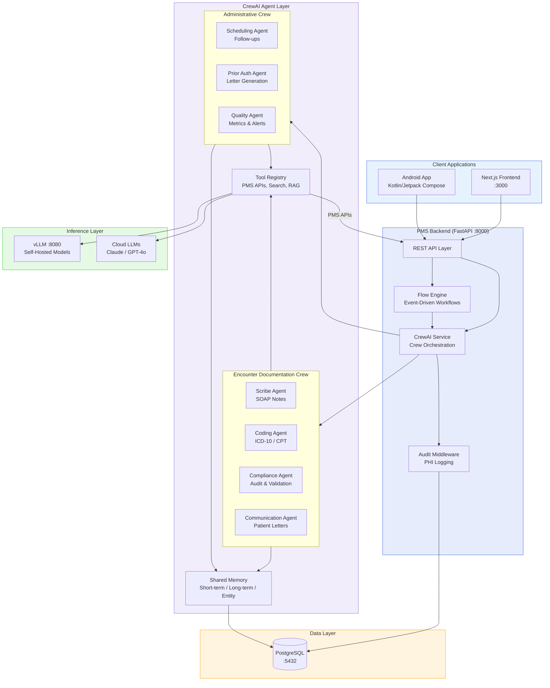

# Product Requirements Document: CrewAI Integration into Patient Management System (PMS)

**Document ID:** PRD-PMS-CREWAI-001
**Version:** 1.0
**Date:** 2026-03-09
**Author:** Ammar (CEO, MPS Inc.)
**Status:** Draft

---

## 1. Executive Summary

CrewAI is an open-source, MIT-licensed Python framework for orchestrating autonomous multi-agent AI systems. With 44,600+ GitHub stars, 100,000+ certified developers, and backing from enterprise partners including HPE, it has become the leading framework for building production-ready agentic workflows. CrewAI's unique dual architecture — **Crews** (autonomous agent teams with roles, tools, and memory) and **Flows** (structured, event-driven workflow orchestration) — enables complex, multi-step clinical automation that no single LLM call can accomplish.

Integrating CrewAI into PMS transforms isolated AI features (note summarization, code suggestion, medication checking) into coordinated **clinical agent workflows** where specialized agents collaborate in sequence or parallel. For example, an "Encounter Documentation Crew" could orchestrate a Scribe Agent (SOAP note generation), a Coding Agent (ICD-10/CPT suggestion), a Compliance Agent (audit and PHI review), and a Communication Agent (patient letter drafting) — all executing as a single pipeline triggered by encounter completion, with shared memory and structured handoffs between agents.

Unlike calling individual LLM endpoints (Exp 52: vLLM, Exp 53: Llama 4, Exp 54: Mistral 3), CrewAI provides the **orchestration layer** that chains, routes, and coordinates those inference calls. It supports native integrations with OpenAI, Anthropic, Google Gemini, and self-hosted models via vLLM/Ollama through LiteLLM — meaning all existing PMS inference backends work without modification. CrewAI agents can be configured with healthcare-specific tools, structured Pydantic output schemas, and persistent memory across encounters, enabling progressively smarter clinical assistance over time.

## 2. Problem Statement

PMS currently has individual AI capabilities (via vLLM, Exp 52) but no **orchestration layer** to coordinate multi-step clinical workflows. Specific gaps:

1. **Sequential manual triggering**: Clinicians must manually trigger each AI feature separately — generate a SOAP note, then request ICD-10 codes, then request a patient letter. Each is an isolated API call with no shared context or automatic handoff. A single encounter generates 3-5 separate AI interactions.

2. **No cross-agent memory or context**: The note summarizer doesn't know what the coding agent suggested. The communication drafter doesn't know the final codes or note content. Each LLM call starts from scratch, leading to inconsistencies and redundant context building.

3. **No workflow validation or compliance checks**: AI outputs go directly to clinician review with no automated validation step — no check that suggested ICD-10 codes match the SOAP note, no verification that the patient letter reading level is appropriate, no audit of PHI exposure in prompts.

4. **No conditional routing**: All requests go to the same model regardless of complexity. A simple follow-up letter and a complex multi-comorbidity coding decision both use the same inference path. There's no mechanism to route complex cases to more capable models or escalate to human review based on confidence scores.

5. **Batch processing gaps**: End-of-day tasks (unsigned note reminders, missing code reviews, quality metrics aggregation) require manual initiation. There's no automated workflow engine to trigger batch agent crews on schedule.

## 3. Proposed Solution

### 3.1 Architecture Overview

### 3.2 Deployment Model

- **Self-hosted Python service**: CrewAI runs as a Python module within the PMS FastAPI backend process — no separate container required. Agents execute as async tasks within the existing FastAPI event loop.
- **LLM backend agnostic**: Agents connect to vLLM (self-hosted, Exp 52) for PHI-sensitive tasks and optionally to cloud LLMs (Claude, GPT-4o) for non-PHI reasoning via CrewAI's native provider support.
- **Docker integration**: CrewAI dependencies added to the existing `pms-backend` Docker image. No new container needed — it's a Python library (`pip install crewai`).
- **PHI isolation**: All PHI-handling agents route exclusively through self-hosted vLLM. Cloud LLM agents only receive de-identified or synthetic context. The Flow engine enforces this routing policy.
- **Memory persistence**: Agent memory (short-term, long-term, entity) stored in PostgreSQL alongside existing PMS data, enabling cross-session learning and audit trails.
- **Observability**: CrewAI's built-in tracing exports to OpenTelemetry, integrating with existing Prometheus/Grafana monitoring (Exp 52).

## 4. PMS Data Sources

| PMS API | How CrewAI Uses It | Direction |
|---------|-------------------|-----------|
| Patient Records (`/api/patients`) | Patient demographics, history, and preferences provide context for all agent crews | PMS → Agents (read) |
| Encounter Records (`/api/encounters`) | Encounter transcripts trigger the Encounter Documentation Crew; generated notes are saved back | PMS ↔ Agents (read/write) |
| Medication & Prescription (`/api/prescriptions`) | Medication lists feed the interaction-checking agent and prior auth agent | PMS → Agents (read) |
| Reporting (`/api/reports`) | Quality Agent aggregates AI utilization metrics, acceptance rates, and confidence distributions | Agents → PMS (write) |
| Audit Log (`/api/audit`) | Every agent action, tool call, and LLM inference logged with full provenance chain | Agents → PG (write) |

## 5. Component/Module Definitions

### 5.1 CrewAI Service (`pms-backend/src/pms/services/crew_service.py`)

Central service class managing Crew creation, execution, and result handling. All PMS modules call this service — never instantiate agents directly.

- **Input**: Workflow name, context variables (patient ID, encounter ID, etc.)
- **Output**: Structured crew output (Pydantic models for notes, codes, letters)
- **PMS APIs used**: None directly — orchestrates other services

### 5.2 Encounter Documentation Crew

Multi-agent crew triggered on encounter completion. Executes four agents in a sequential pipeline with shared memory.

- **Scribe Agent**: Generates SOAP note from transcript. Input: transcript + patient context. Output: structured SOAP note (Pydantic).
- **Coding Agent**: Suggests ICD-10/CPT codes from the generated SOAP note. Input: SOAP note + specialty. Output: ranked code list with confidence scores.
- **Compliance Agent**: Validates note-code consistency, checks PHI exposure, verifies reading levels. Input: SOAP note + codes + patient letter. Output: validation report with pass/fail flags.
- **Communication Agent**: Drafts patient follow-up letter using encounter context. Input: encounter summary + codes + patient demographics. Output: plain-language letter.
- **PMS APIs used**: `/api/encounters`, `/api/patients`

### 5.3 Administrative Crew

Multi-agent crew for batch administrative tasks. Runs on schedule (end-of-day) or on-demand.

- **Prior Auth Agent**: Generates payer-specific prior authorization letters with clinical justification. Input: procedure codes + patient history + payer requirements. Output: formatted PA letter.
- **Quality Agent**: Aggregates daily metrics — AI acceptance rates, code agreement, unsigned notes. Input: daily encounter data. Output: quality dashboard update.
- **Scheduling Agent**: Identifies follow-up scheduling needs from encounter notes. Input: encounter notes. Output: follow-up recommendations with timeframes.
- **PMS APIs used**: `/api/encounters`, `/api/patients`, `/api/prescriptions`, `/api/reports`

### 5.4 Flow Engine (`pms-backend/src/pms/services/flow_engine.py`)

Event-driven workflow orchestrator using CrewAI Flows. Manages state, conditional branching, and crew sequencing.

- **Input**: Trigger event (encounter completed, batch schedule, manual request)
- **Output**: Flow execution result with status, timing, and agent outputs
- **PMS APIs used**: All — routes events to appropriate crews

### 5.5 Tool Registry (`pms-backend/src/pms/services/crew_tools.py`)

Custom CrewAI tools wrapping PMS APIs and external services. Each tool is a decorated Python function that agents can call.

- **PMS API Tools**: `fetch_patient`, `fetch_encounter`, `fetch_medications`, `save_note`, `save_codes`
- **Search Tools**: `search_icd10_database`, `search_cpt_database`, `search_drug_interactions`
- **Validation Tools**: `validate_icd10_code`, `check_reading_level`, `detect_phi`

## 6. Non-Functional Requirements

### 6.1 Security and HIPAA Compliance

| Requirement | Implementation |
|-------------|----------------|
| PHI never leaves infrastructure | PHI-handling agents route exclusively through self-hosted vLLM; cloud LLM agents receive only de-identified context |
| LLM routing policy | Flow engine enforces PHI routing rules — agents cannot override to send PHI to cloud LLMs |
| Encryption in transit | TLS between FastAPI and vLLM; HTTPS for cloud LLM calls |
| Access control | RBAC in FastAPI middleware controls which users can trigger which crews |
| Audit logging | Every agent action, tool call, LLM prompt hash, and response hash logged in PostgreSQL with full provenance chain |
| PHI minimization | Tools strip unnecessary PHI before passing to agents; use codes/IDs over raw data when possible |
| Memory isolation | Agent memory partitioned per clinic/provider; no cross-tenant memory leakage |
| Tool sandboxing | Custom tools validate inputs and outputs; no arbitrary code execution by agents |

### 6.2 Performance

| Metric | Target | Notes |
|--------|--------|-------|
| Encounter Documentation Crew (full pipeline) | < 30 seconds | Sequential: SOAP + codes + validation + letter |
| Individual agent task | < 10 seconds | Single LLM call with tool use |
| Concurrent crew executions | 10+ simultaneous | Async execution in FastAPI |
| Memory retrieval latency | < 100ms | PostgreSQL-backed with caching |
| Flow event processing | < 500ms | Event dispatch to crew kickoff |
| Availability | 99.5% | Matches vLLM SLA (Exp 52) |

### 6.3 Infrastructure

| Resource | Minimum | Recommended |
|----------|---------|-------------|
| Python | 3.11+ | 3.12 |
| CrewAI | 1.x (stable GA) | Latest stable |
| Additional RAM | +2 GB (over existing backend) | +4 GB |
| Additional disk | Minimal (Python library) | 1 GB for memory/cache |
| GPU | None (CrewAI is CPU; inference is on vLLM) | N/A |
| Docker | Existing pms-backend container | No new container |

## 7. Implementation Phases

### Phase 1: Foundation (2 sprints)
- Install CrewAI in PMS backend (`pip install crewai`)
- Create `CrewService` and `FlowEngine` service classes
- Build custom PMS API tools (fetch_patient, fetch_encounter, etc.)
- Configure LLM providers: vLLM (self-hosted) + Claude (cloud, optional)
- Implement audit logging for all agent actions
- Build a simple single-agent crew (SOAP note generation) as proof of concept
- Unit and integration tests for crew execution

### Phase 2: Core Clinical Crews (3 sprints)
- Build full Encounter Documentation Crew (Scribe + Coding + Compliance + Communication agents)
- Implement shared memory (short-term for encounter, long-term for patterns)
- Structured Pydantic outputs for all agent tasks
- Flow engine: encounter-completed event triggers full pipeline
- Frontend integration: crew status tracking, result review panel
- Clinician feedback loop (accept/reject/edit per agent output)
- Confidence-based routing: high-complexity cases → Claude, standard → vLLM

### Phase 3: Advanced Automation (2 sprints)
- Administrative Crew (Prior Auth + Quality + Scheduling agents)
- Batch Flow: end-of-day quality review, unsigned note reminders
- Entity memory: cross-encounter patient context retention
- Agent performance analytics dashboard
- A/B testing framework: compare crew outputs vs individual LLM calls
- LoRA-specialized agents (healthcare-tuned adapters per agent role)
- RAG integration: ophthalmology guidelines knowledge base for agents

## 8. Success Metrics

| Metric | Target | Measurement |
|--------|--------|-------------|
| End-to-end documentation time | 70% reduction (vs 50% with single LLM) | Time from encounter end to complete note + codes + letter |
| Clinician interaction count | 1 trigger → all outputs (vs 3-5 manual triggers) | Clicks per encounter for AI features |
| Code-note consistency | > 95% | Compliance agent validation pass rate |
| Pipeline completion rate | > 98% | Crews completing without error |
| Clinician adoption | > 85% using crew workflows within 3 months | Usage logs per clinician |
| PHI incidents | Zero | Security audit and monitoring |
| Average pipeline latency | < 25 seconds | Prometheus histogram for full crew execution |

## 9. Risks and Mitigations

| Risk | Impact | Mitigation |
|------|--------|------------|
| Agent hallucination cascading through pipeline | Incorrect note → wrong codes → wrong letter | Compliance agent validates at each step; confidence thresholds gate progression |
| CrewAI framework instability | Breaking changes in updates | Pin CrewAI version; comprehensive test suite; staging environment testing |
| Increased latency from multi-agent pipeline | Clinician frustration with wait times | Parallel agent execution where possible; streaming intermediate results to frontend |
| Memory bloat from persistent agent memory | PostgreSQL storage growth | Memory retention policies (TTL); periodic pruning; compression |
| LLM routing policy bypass | PHI sent to cloud LLM | Flow engine enforces routing at infrastructure level; integration tests verify routing |
| Over-reliance on AI pipeline | Clinicians skip thorough review | Mandatory review step; random audit of accepted outputs; confidence display |
| Complexity overhead | Harder to debug than single LLM calls | CrewAI tracing → OpenTelemetry; per-agent logging; step-by-step replay |
| AutoGen/LangGraph ecosystem shift | Framework becomes less maintained | MIT license allows forking; architecture abstracts framework specifics behind service layer |

## 10. Dependencies

| Dependency | Version | Purpose |
|------------|---------|---------|
| CrewAI | 1.x (GA stable) | Multi-agent orchestration framework |
| crewai-tools | 1.x | Built-in tool library |
| Python | 3.11+ | Runtime (CrewAI requires 3.10+, PMS uses 3.11+) |
| vLLM | 0.17.0 | Self-hosted LLM inference backend (Exp 52) |
| openai (Python SDK) | >=1.0,<2.25 | LLM client for vLLM and OpenAI |
| anthropic (Python SDK) | Latest | Native Claude integration (optional) |
| LiteLLM | Latest | Multi-provider LLM routing (optional, for additional providers) |
| Pydantic | 2.x | Structured agent outputs |
| PostgreSQL | 15+ | Memory persistence and audit logging |
| Prometheus | 2.x | Metrics collection (existing) |

## 11. Comparison with Existing Experiments

| Experiment | Relationship to CrewAI |
|------------|----------------------|
| **Exp 05: OpenClaw** (agentic workflows) | **Overlapping** — Both provide agentic workflow orchestration. CrewAI is more mature (44.6K stars, MIT license, GA 1.0) with native multi-agent support, while OpenClaw focuses on autonomous task execution. CrewAI could replace or complement OpenClaw for clinical workflows |
| **Exp 52: vLLM** (self-hosted inference) | **Downstream** — CrewAI agents use vLLM as their inference backend for PHI-safe tasks. CrewAI orchestrates; vLLM executes. Both are required |
| **Exp 53: Llama 4** (multimodal LLM) | **Downstream** — Llama 4 models served via vLLM become available to CrewAI agents for multimodal tasks (image + text clinical analysis) |
| **Exp 54: Mistral 3** (tiered models) | **Downstream** — CrewAI's routing logic can send simple tasks to small Mistral models and complex tasks to large ones, implementing the tiered architecture Exp 54 envisions |
| **Exp 51: Amazon Connect Health** | **Complementary** — Connect Health handles the voice/telephony layer; CrewAI handles post-call documentation orchestration |
| **Exp 47: Availity** (eligibility/PA) | **Complementary** — CrewAI's Prior Auth Agent generates the letter; Availity handles submission |

CrewAI is the **orchestration layer** that ties together the inference engines (Exp 52/53/54), voice interfaces (Exp 51), and external integrations (Exp 47) into coordinated clinical workflows.

### Comparison with Alternative Frameworks

| Framework | Stars | License | Best For | Weakness for PMS |
|-----------|-------|---------|----------|-----------------|
| **CrewAI** | 44.6K | MIT | Role-based agent teams, fast prototyping, production crews | Less granular state control than LangGraph |
| **LangGraph** | 10K+ | MIT | Stateful graph workflows, checkpointing, complex branching | Steeper learning curve, heavier dependency (LangChain ecosystem) |
| **AutoGen** (Microsoft) | 40K+ | MIT | Conversational multi-agent, group decision-making | In maintenance mode; Microsoft shifting to Agent Framework |
| **OpenAI Agents SDK** | 15K+ | MIT | Simple single-agent, OpenAI-native | Vendor lock-in, no self-hosted LLM support |
| **PydanticAI** | 8K+ | MIT | Type-safe agent outputs, minimal overhead | Single-agent only, no crew orchestration |

**Decision: CrewAI** — Best balance of production readiness, role-based clinical agent modeling, self-hosted LLM support, community size, and time-to-production. LangGraph is a strong alternative if more granular workflow control is needed in the future; the PMS service layer abstracts the framework choice.

## 12. Research Sources

**Official Documentation:**
- [CrewAI Documentation](https://docs.crewai.com/) — Core concepts, API reference, configuration guides
- [CrewAI GitHub Repository](https://github.com/crewAIInc/crewAI) — Source code, 44.6K stars, MIT license
- [CrewAI LLM Configuration](https://docs.crewai.com/en/concepts/llms) — Provider setup for OpenAI, Anthropic, vLLM, Ollama
- [CrewAI Open Source](https://crewai.com/open-source) — Crews, Flows, and enterprise features overview

**Framework Comparisons:**
- [CrewAI vs LangGraph vs AutoGen vs OpenAgents (2026)](https://openagents.org/blog/posts/2026-02-23-open-source-ai-agent-frameworks-compared) — Detailed feature comparison with benchmarks
- [LangGraph vs CrewAI vs AutoGen: Complete Guide (2026)](https://dev.to/pockit_tools/langgraph-vs-crewai-vs-autogen-the-complete-multi-agent-ai-orchestration-guide-for-2026-2d63) — Performance, reliability, and use-case recommendations
- [Top AI Agent Frameworks 2026](https://o-mega.ai/articles/langgraph-vs-crewai-vs-autogen-top-10-agent-frameworks-2026) — Comprehensive 10-framework ranking

**Healthcare & HIPAA:**
- [Agentic AI in Healthcare: Choosing the Right Framework](https://10decoders.com/blog/crewai-vs-semantic-kernel-decoding-agentic-ai-for-healthcare/) — CrewAI vs Semantic Kernel for healthcare use cases
- [On-Prem Agentic AI Infrastructure: HPE and CrewAI](https://blog.crewai.com/on-prem-agentic-ai-infrastructure-hpe-and-crewai/) — Self-hosted deployment for regulated industries
- [Towards HIPAA Compliant Agentic AI in Healthcare](https://arxiv.org/html/2504.17669v1) — Academic analysis of agentic AI HIPAA patterns

**Deployment & Production:**
- [CrewAI + FastAPI + Docker (GitHub)](https://github.com/renatosantosti/crewai-api) — Reference implementation of CrewAI as a FastAPI service
- [How to Deploy CrewAI to Production](https://dev.to/vhalasi/how-to-deploy-crewai-to-production-445f) — Docker, CI/CD, and scaling patterns

## 13. Appendix: Related Documents

- [CrewAI Setup Guide](55-CrewAI-PMS-Developer-Setup-Guide.md)
- [CrewAI Developer Tutorial](55-CrewAI-Developer-Tutorial.md)
- [vLLM PRD](52-PRD-vLLM-PMS-Integration.md)
- [OpenClaw Developer Tutorial](05-OpenClaw-Developer-Tutorial.md)
- [Llama 4 PRD](53-PRD-Llama4-PMS-Integration.md)
