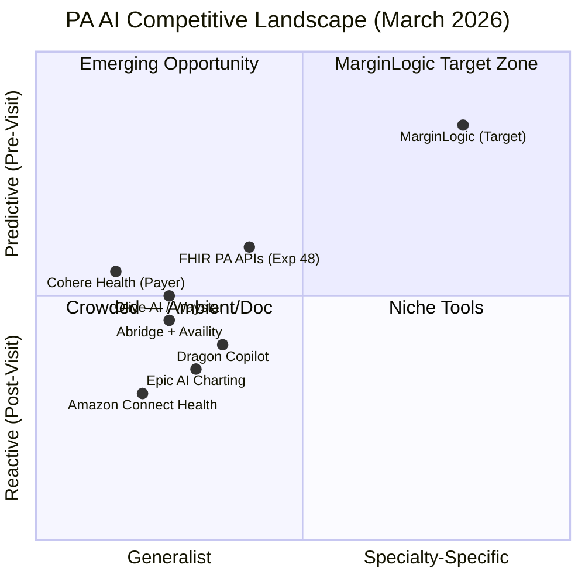
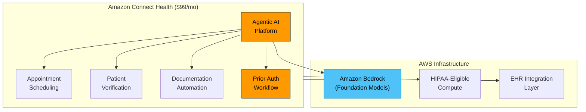
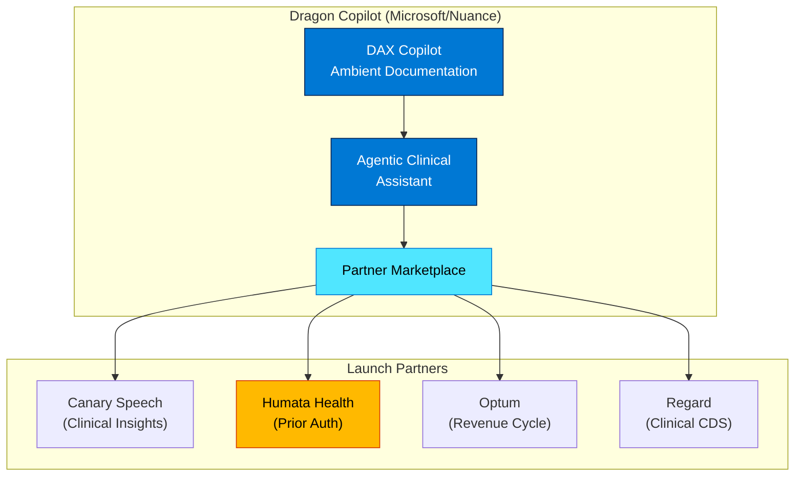
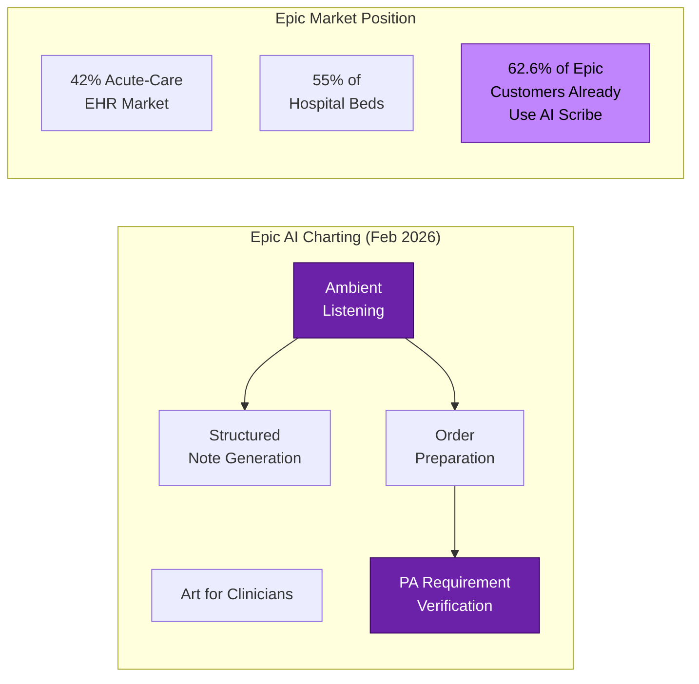
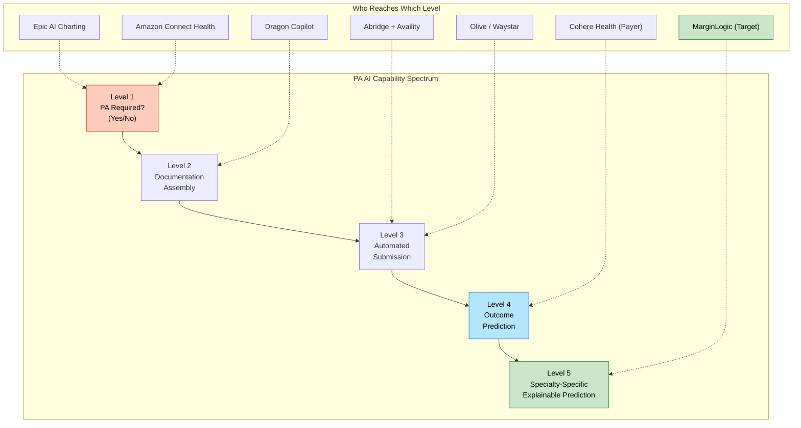
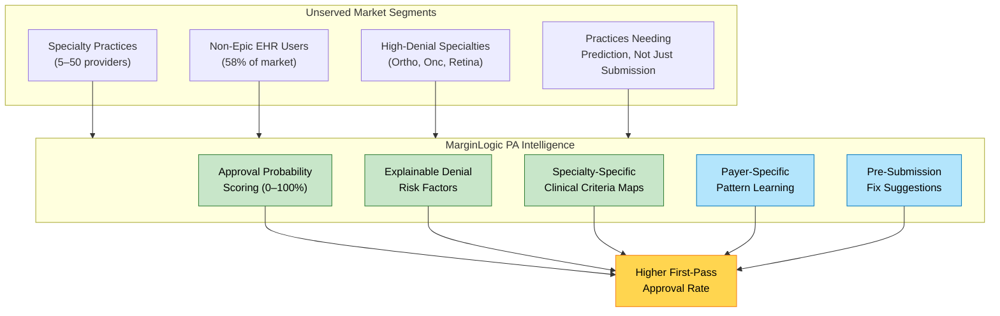
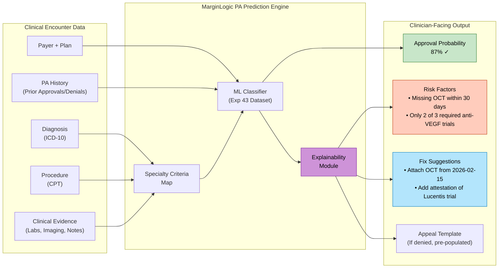
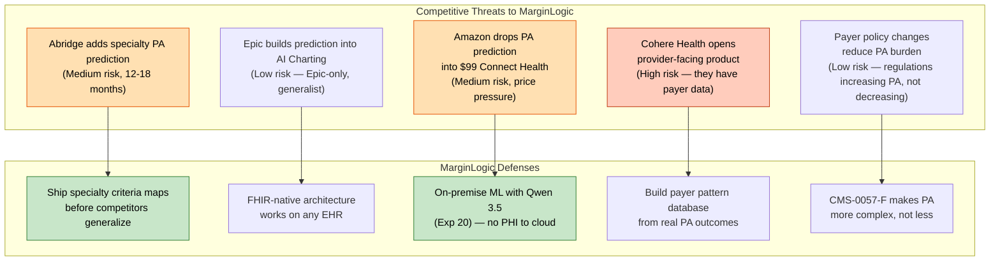
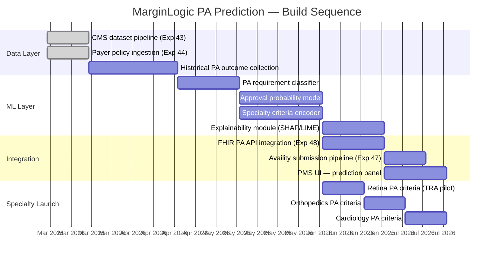

# Prior Authorization AI Competitive Landscape & MarginLogic Positioning

**Document ID:** PMS-EXP-PACL-001
**Version:** 1.0
**Date:** 2026-03-09
**Author:** Ammar (CEO, MPS Inc.)
**Status:** Draft

---

## 1. Executive Summary

The prior authorization (PA) AI market is consolidating around four platform archetypes — ambient-to-PA (Abridge), hyperscaler platform (Amazon), EHR-native (Epic), and partner-marketplace (Dragon Copilot) — each approaching PA from a different entry point. None of them solve the specialty practice's core problem: **predicting PA outcomes before submission with specialty-specific explainability**.

MarginLogic must own the **specialty-specific, explainable PA prediction** niche — the only segment where a focused PMS can outperform generalist platforms. This document maps the competitive landscape, identifies white space, and defines MarginLogic's defensible wedge.

### Market Context

- **$98B** in annual administrative services in front-office RCM; PA automation software is only 3% of that, growing 10x YoY
- **CMS-0057-F** took effect January 1, 2026 (72-hour expedited / 7-day standard response mandates); FHIR PA APIs required by January 2027
- **82%** of hospital executives plan to expand AI investments in PA automation (Bain 2025)
- **99%** of clinicians trust AI for PA approvals (Cohere Health 2026 survey)
- Specialty denial rates rising: orthopedic ASC 14–22%, oncology highest PA burden (88% of clinicians affected)

---

## 2. Competitive Landscape Map

---

## 3. Competitor Deep Dives

### 3.1 Abridge — Ambient-to-PA Pipeline

| Dimension | Detail |
|-----------|--------|
| **Valuation** | $5.3B (Series E, June 2025 — doubled in 4 months) |
| **Investors** | a16z, Khosla Ventures |
| **Scale** | 200+ health systems; projected 80M patient conversations in 2026 |
| **PA Strategy** | Real-time PA at point of conversation via Availity partnership (announced JPM26, Jan 2026) |
| **Mechanism** | Ambient AI extracts clinical context → maps to orders → fires PA check via Availity's FHIR-native APIs → returns coverage decision during the visit |
| **Payer Reach** | Availity connects to 95% of payers, 3.4M+ providers |
| **EHR Integration** | Deep Epic integration; also supports MEDITECH, Oracle Health |
| **Pricing** | Enterprise per-provider licensing; not publicly disclosed |

**Strengths:**
- Compresses weeks-long PA process to real-time during the visit
- Ambient data capture means PA documentation is pre-populated from conversation
- Availity partnership gives near-universal payer connectivity
- Massive data flywheel (80M conversations) for model improvement

**Weaknesses for specialty practices:**
- **Generalist model** — same PA logic for dermatology, orthopedics, oncology, and retina
- **No outcome prediction** — checks if PA is *required*, not whether it will be *approved*
- **No specialty-specific clinical criteria mapping** — doesn't know that anti-VEGF PA for wet AMD requires OCT showing subretinal fluid ≥ 300μm
- **Enterprise pricing** excludes small-to-mid specialty practices (5–50 providers)
- **Epic-centric** — limited value for practices on non-Epic EHRs

**MarginLogic differentiation:** Abridge tells you PA is required. MarginLogic tells you the PA will be *denied* unless you add OCT evidence showing subretinal fluid thickness — and auto-attaches it.

---

### 3.2 Amazon Connect Health — Hyperscaler Platform Play

| Dimension | Detail |
|-----------|--------|
| **Launch** | March 5, 2026 (HIMSS 2026) |
| **Pricing** | **$99/month per user** for up to 600 encounters/month |
| **Architecture** | Agentic AI platform on AWS; uses Amazon Bedrock foundation models |
| **PA Strategy** | PA as one of many administrative automation workflows; conditional scheduling based on PA approval status |
| **HIPAA** | HIPAA-eligible; runs on AWS infrastructure |
| **Early Results** | UC San Diego Health: 630 hours/week saved, 60% call abandonment reduction |

**Strengths:**
- **Price disruption** — $99/mo is an order of magnitude cheaper than enterprise solutions
- AWS infrastructure scale and reliability
- Platform approach: PA is one module alongside scheduling, verification, documentation
- Agentic AI can chain multi-step PA workflows (check requirements → gather docs → submit → follow up)
- Bedrock gives access to multiple foundation models (Claude, Llama, Titan)

**Weaknesses for specialty practices:**
- **Breadth over depth** — PA is one feature among many; not purpose-built for PA optimization
- **No clinical intelligence** — can check if PA is required but cannot evaluate clinical criteria
- **No specialty context** — same $99 platform for family medicine and retina surgery
- **No prediction** — no approval/denial probability; no suggested documentation improvements
- **Early stage** — just launched March 2026; limited healthcare-specific training data
- **Cloud-only** — all data processed on AWS; no on-premise option for PHI-sensitive practices

**MarginLogic differentiation:** Amazon sells a $99 admin automation platform. MarginLogic sells a specialty-specific PA intelligence engine that increases approval rates by predicting denials before submission.

---

### 3.3 Microsoft Dragon Copilot — Partner Marketplace Strategy

| Dimension | Detail |
|-----------|--------|
| **Announced** | HIMSS 2026 (March 5, 2026) |
| **Strategy** | Dragon Copilot as the "clinical operating system"; partner-built apps for PA, RCM, CDS |
| **PA Approach** | Delegates PA to partners (Humata Health, Optum) via marketplace integrations |
| **Key Upgrade** | Evolved from documentation tool → agentic clinical assistant with persona-specific capabilities (nurses, radiologists) |
| **Distribution** | Microsoft Azure Marketplace; direct integration into Dragon Copilot workflow |
| **Rural Push** | Explicit rural hospital outreach announced at HIMSS 2026 |

**Strengths:**
- Microsoft/Nuance brand trust and existing installed base
- Partner ecosystem means specialized PA tools (Humata Health) plug in without Microsoft building them
- Ambient documentation generates the clinical context needed for PA
- Agentic capabilities: referral letters, after-visit summaries, PA documentation auto-generated
- Azure cloud scale; HIPAA BAA via Microsoft

**Weaknesses for specialty practices:**
- **PA is outsourced to partners** — Dragon itself doesn't do PA intelligence, it passes to Humata/Optum
- **Partner fragmentation** — different partners for different PA use cases; no unified specialty PA workflow
- **Enterprise pricing** — DAX Copilot pricing through Azure Marketplace; not designed for small practices
- **No prediction layer** — partners handle PA submission, not outcome prediction
- **Marketplace immaturity** — just launched; partner integrations are early-stage

**MarginLogic differentiation:** Dragon is a platform that hosts PA tools built by others. MarginLogic *is* the PA tool — purpose-built for specialty practices with predictive intelligence that no Dragon marketplace partner offers.

---

### 3.4 Epic AI Charting — The EHR-Native Incumbent

| Dimension | Detail |
|-----------|--------|
| **Launch** | February 4, 2026 |
| **Market Position** | 42% acute-care EHR market, 55% of hospital beds |
| **Adoption** | 62.6% of Epic customers already using an AI scribe (as of June 2025); Epic AI Charting is native |
| **PA Capability** | Art for Clinicians generates pre-visit summaries and verifies PA requirements in real-time |
| **Architecture** | Native to Epic; no separate login, contract, or integration needed |
| **Pricing** | Bundled with Epic license (included for existing customers) |

**Strengths:**
- **Zero integration cost** — native to Epic; already in the clinician's workflow
- **Bundled pricing** — existential threat to every ambient scribe startup that charges per-provider
- Pre-visit summaries contextualize PA requirements before the encounter
- Structured note generation maps directly to PA documentation needs
- Massive installed base and clinician trust

**Weaknesses for specialty practices:**
- **Epic-only** — useless for the ~58% of healthcare not on Epic; most specialty practices use specialty-specific EHRs (Nextech, Modernizing Medicine, AdvancedMD)
- **PA verification, not PA intelligence** — tells you PA is required, not whether it will be approved
- **Generalist** — same AI for cardiology, retina, orthopedics; no specialty-specific clinical criteria
- **No denial prediction** — no probability scoring; no suggested documentation improvements
- **No payer-specific intelligence** — doesn't learn that UHC denies anti-VEGF after 12 injections without re-authorization while Aetna requires it after 8

**MarginLogic differentiation:** Epic solves PA for Epic hospitals. MarginLogic solves PA for specialty practices on *any* EHR — with predictive intelligence that Epic doesn't attempt.

---

### 3.5 Cohere Health — Payer-Side PA Platform

| Dimension | Detail |
|-----------|--------|
| **Position** | Payer-side PA platform (not provider-facing) |
| **Scale** | 660K+ providers, 12M+ PA requests/year processed |
| **Auto-Approval** | Up to 90% of PA requests auto-approved for participating plans |
| **Approach** | AI evaluates clinical evidence against payer criteria on the payer side |
| **Funding** | $36M+ raised |
| **Relevance** | Shapes what payers expect; MarginLogic must understand Cohere's criteria to optimize submissions |

---

## 4. Competitive Comparison Matrix

| Capability | Epic AI Charting | Abridge | Amazon Connect | Dragon Copilot | Cohere (Payer) | **MarginLogic** |
|-----------|:---:|:---:|:---:|:---:|:---:|:---:|
| PA requirement detection | Yes | Yes | Basic | Via partners | N/A (payer) | **Yes** |
| Clinical documentation assembly | Yes | Yes | No | Via partners | N/A | **Yes** |
| Multi-payer submission | No (Epic only) | Yes (Availity) | No | Via partners | N/A | **Yes (Exp 47–48)** |
| Real-time during visit | Yes | Yes | No | No | N/A | **Yes** |
| Approval/denial prediction | **No** | **No** | **No** | **No** | Yes (payer-side) | **Yes** |
| Specialty-specific criteria | **No** | **No** | **No** | **No** | Partial | **Yes** |
| Explainable reasoning | **No** | **No** | **No** | **No** | **No** | **Yes** |
| Payer-specific pattern learning | **No** | **No** | **No** | **No** | Yes (own data) | **Yes** |
| Denial prevention suggestions | **No** | **No** | **No** | **No** | **No** | **Yes** |
| Works on non-Epic EHR | No | Partial | Yes | Partial | N/A | **Yes** |
| Small practice pricing | No | No | Yes ($99) | No | N/A | **Yes** |

---

## 5. White Space Analysis — MarginLogic's Defensible Wedge

### 5.1 The Niche Nobody Owns

Every competitor stops at **Level 3** (automated submission). No one on the provider side offers **Level 4–5** (outcome prediction with specialty-specific explainability). This is MarginLogic's wedge:

| What MarginLogic Does | What It Replaces | Why Competitors Can't/Don't |
|----------------------|-----------------|---------------------------|
| Predicts PA approval probability before submission | Staff guessing + submitting blind | Requires specialty-specific training data and clinical criteria mapping — generalist platforms can't justify the specialization |
| Explains *why* a PA will be denied (missing OCT, insufficient trial period, wrong CPT modifier) | Staff discovering denials 7–14 days post-submission | Requires deep specialty workflow understanding; Abridge/Epic optimize for the 80% (primary care), not the 20% (specialty) |
| Suggests documentation fixes to increase approval probability | Reactive appeal process after denial | Requires mapping payer-specific criteria to clinical documentation — no competitor has built this feedback loop |
| Learns payer-specific approval patterns per specialty per procedure | Static payer policy PDFs (Exp 44) | Requires historical PA outcome data correlated with clinical variables — MarginLogic's CMS dataset (Exp 43) and payer API integrations (Exp 45–47) create this data asset |
| Runs on any EHR via FHIR APIs (Exp 16, 48) | Epic-only solutions (Epic AI Charting) | Competitors are locked into their platform; MarginLogic is EHR-agnostic by design |

### 5.2 Specialty-Specific Explainability — The Core Differentiator

Generic PA tools treat all specialties the same. MarginLogic must encode **specialty-specific clinical criteria** that drive PA decisions:

**Example — Retina (Anti-VEGF for Wet AMD):**

| PA Criterion (UHC) | What MarginLogic Checks | Explainable Output |
|--------------------|------------------------|--------------------|
| Diagnosis of wet AMD confirmed by fluorescein angiography or OCT | OCT date within 90 days in patient record | "OCT found: 2026-01-20 (48 days ago) — meets UHC 90-day requirement" |
| Failure or contraindication to first-line agent (e.g., Avastin) | Treatment history in medication records | "WARNING: Only 1 Avastin injection documented. UHC requires 3-injection trial before Eylea step-up. Approval probability: 34%" |
| Re-authorization after 12 injections | Count of prior approved injections | "Injection count: 11. Re-auth will be required after next injection. Pre-submitting re-auth now." |
| Supporting documentation attached | OCT images, visual acuity, clinical notes | "Missing: Visual acuity from last visit. Add to increase approval probability from 72% to 91%." |

**Example — Orthopedics (Knee MRI):**

| PA Criterion (BCBS TX) | What MarginLogic Checks | Explainable Output |
|------------------------|------------------------|--------------------|
| 6 weeks of conservative therapy documented | Physical therapy notes, NSAID prescriptions | "PT notes found: 4 visits over 3 weeks. BCBS requires 6 weeks. Approval probability: 28%" |
| X-ray completed before MRI | Imaging orders in record | "Knee X-ray: 2026-02-01 — meets BCBS imaging-first requirement" |
| Clinical indication matches approved list | ICD-10 code mapping | "M23.21 (derangement of meniscus) — approved indication for MRI. +" |

### 5.3 Why This Niche Is Defensible

1. **Data moat**: MarginLogic's CMS PA dataset (Exp 43) + real PA outcomes from PMS practices create a growing labeled dataset no competitor has
2. **Specialty depth**: Each specialty's PA criteria require clinical domain expertise to encode — generalist platforms won't invest in this for <20% of their revenue
3. **Network effects**: Every PA outcome (approval/denial + clinical variables) improves the prediction model. More specialty practices → more data → better predictions → more practices
4. **Regulatory tailwind**: CMS-0057-F mandates payers publish approval/denial metrics starting 2026 — this data feeds directly into MarginLogic's payer pattern learning
5. **FHIR-native**: Experiments 16 and 48 give MarginLogic direct payer API access as they come online in 2027, bypassing clearinghouse intermediaries
6. **EHR-agnostic**: Unlike Epic (locked in) and Abridge (Epic-focused), MarginLogic works on specialty EHRs (Nextech, ModMed, AdvancedMD) that serve the target market

---

## 6. Threat Assessment

| Threat | Risk Level | Timeline | Mitigation |
|--------|-----------|----------|------------|
| **Abridge adds specialty PA prediction** | Medium | 12–18 months | Ship first; Abridge optimizes for primary care volume, not specialty depth |
| **Epic builds PA prediction into AI Charting** | Low | 18–24 months | Epic serves hospitals, not specialty practices; Epic-only limitation |
| **Amazon price-dumps PA features** | Medium | 6–12 months | Compete on *intelligence*, not price; Amazon's $99 can't include specialty clinical mapping |
| **Cohere opens provider-facing product** | High | 12 months | Cohere has payer data but not provider workflow integration; MarginLogic has both via PMS |
| **Payer policy changes reduce PA burden** | Low | Ongoing | CMS-0057-F increases regulatory complexity; specialty PA volume growing, not shrinking |
| **Dragon Copilot partner builds specialty PA** | Medium | 12 months | MarginLogic can *also* be a Dragon marketplace partner — offense, not just defense |

---

## 7. MarginLogic Implementation Roadmap

### Phase 1: Foundation (Aligns with Experiments 43–48)

| Component | Experiment | Status | MarginLogic Role |
|-----------|-----------|--------|-----------------|
| CMS PA training dataset | Exp 43 | Draft | ML training data for PA classifier |
| Payer policy download | Exp 44 | Draft | Payer-specific criteria extraction |
| CMS Coverage API | Exp 45 | Draft | Medicare PA requirement lookup |
| UHC API Marketplace | Exp 46 | Draft | UHC-specific PA submission + status |
| Availity API | Exp 47 | Draft | Multi-payer PA submission gateway |
| FHIR PA APIs | Exp 48 | Draft | Da Vinci CRD/DTR/PAS for 2027 payer APIs |

### Phase 2: Prediction Engine

### Phase 3: AI Engine (On-Premise)

| Component | Technology | Why |
|-----------|-----------|-----|
| PA prediction model inference | **Qwen3.5-9B** (Exp 20, Small Series) | 5 GB VRAM, GPQA 81.7 — runs on any clinic workstation; no PHI to cloud |
| Specialty criteria reasoning | **Qwen3.5-9B** thinking mode | Explainable reasoning chains for PA predictions; auditable |
| Document OCR + extraction | **Qwen3.5-9B** | OmniDocBench 87.7 — extract clinical evidence from scanned docs |
| Payer policy parsing | **Qwen3.5-4B** (Exp 20, Small Series) | Parse PDF payer policies into structured criteria; edge-deployable |
| Real-time PA check at point of care | **Qwen3.5-4B** via Ollama | Fast response during patient visit; 2.5 GB |

---

## 8. Positioning Statement

> **MarginLogic** is the only PA intelligence engine built for specialty practices. While Abridge, Epic, Amazon, and Dragon compete to automate PA *submission* for hospitals, MarginLogic predicts PA *outcomes* — telling orthopedic surgeons, retina specialists, and oncologists exactly why a PA will be denied and what to fix before they submit. Every competitor's PA workflow ends with "submitted." MarginLogic's starts with "87% approval probability — add OCT to reach 95%."

---

## 9. Related Documents

| Document | Experiment | Relevance |
|----------|-----------|-----------|
| [CMS PA Dataset — ML Training Pipeline](43-PRD-CMSPriorAuthDataset-PMS-Integration.md) | 43 | Training data for PA prediction model |
| [Payer Policy Download](44-PRD-PayerPolicyDownload-PMS-Integration.md) | 44 | Payer-specific criteria extraction |
| [CMS Coverage API Integration](45-PRD-CMSCoverageAPI-PMS-Integration.md) | 45 | Medicare PA requirement lookup |
| [UHC API Marketplace Integration](46-PRD-UHCAPIMarketplace-PMS-Integration.md) | 46 | UHC-specific PA APIs |
| [Availity API Integration](47-PRD-AvailityAPI-PMS-Integration.md) | 47 | Multi-payer PA submission |
| [FHIR Prior Authorization APIs](48-PRD-FHIRPriorAuth-PMS-Integration.md) | 48 | Da Vinci CRD/DTR/PAS for 2027 |
| [Qwen 3.5 Integration](20-PRD-Qwen35-PMS-Integration.md) | 20 | On-premise ML inference (Small Series for edge PA) |
| [FHIR R4 Facade](16-PRD-FHIR-PMS-Integration.md) | 16 | EHR-agnostic FHIR interoperability layer |

---

## 10. Research Sources

### Competitor Intelligence
- [Abridge Series E — $5.3B Valuation (Fierce Healthcare)](https://www.fiercehealthcare.com/ai-and-machine-learning/ambient-ai-startup-abridge-scores-300m-series-e-backed-a16z-and-khosla)
- [Abridge + Availity PA Partnership (JPM26)](https://www.fiercehealthcare.com/ai-and-machine-learning/jpm26-abridge-teams-availity-scale-real-time-prior-authorization)
- [Abridge + Availity — Point of Conversation PA (Business Wire)](https://www.businesswire.com/news/home/20260112960386/en/Abridge-and-Availity-Collaborate-to-Redefine-Payer-Provider-Synergy-at-the-Point-of-Conversation)
- [Amazon Connect Health Launch (TechCrunch)](https://techcrunch.com/2026/03/05/aws-amazon-connect-health-ai-agent-platform-health-care-providers/)
- [Amazon Connect Health — Healthcare AI Agents (Healthcare Dive)](https://www.healthcaredive.com/news/amazon-web-services-launch-amazon-connect-health-ai-agent/813796/)
- [Dragon Copilot at HIMSS 2026 (Microsoft Blog)](https://www.microsoft.com/en-us/industry/blog/healthcare/2026/03/05/unify-simplify-scale-microsoft-dragon-copilot-meets-the-moment-at-himss-2026/)
- [Dragon Copilot Agentic Upgrade (HIT Consultant)](https://hitconsultant.net/2026/03/05/microsoft-dragon-copilot-himss-2026-agentic-clinical-ai-nurses-radiologists/)
- [Epic AI Charting Launch (STAT News)](https://www.statnews.com/2026/02/04/epic-ai-charting-ambient-scribe-abridge-microsoft/)
- [Epic AI Charting Market Impact (Healthcare Dive)](https://www.healthcaredive.com/news/epic-rolls-out-ai-charting-art-notetaking-documentation-scribe/811462/)
- [Epic AI Charting — Platform Squeeze (HIT Consultant)](https://hitconsultant.net/2026/02/05/epic-releases-ai-charting-ambient-ai-market-implications/)

### PA Market & Regulatory
- [Cohere Health — AI PA Platform](https://www.coherehealth.com/utilization-management-suite)
- [Cohere Health — Provider Trust in AI for PA (PRNewswire)](https://www.prnewswire.com/news-releases/national-survey-of-us-providers-shows-trust-in-ai-to-improve-prior-authorization-as-looming-standards-raise-the-stakes-302576817.html)
- [CMS Interoperability & Prior Authorization Final Rule (CMS-0057-F)](https://www.cms.gov/newsroom/fact-sheets/cms-interoperability-and-prior-authorization-final-rule-cms-0057-f)
- [CMS-0057-F Decoded — APIs for 2026–2027 (Firely)](https://fire.ly/blog/cms-0057-f-decoded-must-have-apis-vs-nice-to-have-igs-for-2026-2027/)
- [AI in RCM: 2025 Insights & 2026 Predictions (Aspirion)](https://www.aspirion.com/the-year-ai-transformed-revenue-cycle-2025-insights-and-2026-predictions/)
- [AI Revenue Cycle Management Market Size (Grand View Research)](https://www.grandviewresearch.com/industry-analysis/ai-revenue-cycle-management-market-report)

### Specialty PA Burden
- [AMA Survey — PA Burden on Physicians (AJMC)](https://www.ajmc.com/view/ama-survey-highlights-growing-burden-of-prior-authorization-on-physicians-patients)
- [Orthopedic Denial Rate Crisis (Medical Billers and Coders)](https://www.medicalbillersandcoders.com/blog/is-denial-rate-crisis-draining-orthopedic-revenue/)
- [PA Slowing Key Specialties (Svasth Health Tech)](https://www.svasthealthtech.com/why-prior-authorization-is-slowing-down-these-medical-specialties-in-2025/)
- [AI for Mitigating PA Denials (AAO-HNS Bulletin)](https://bulletin.entnet.org/business-of-medicine-practice-management/article/22914205/a-novel-aibased-method-of-mitigating-prior-authorization-denials)

### PA Explainability
- [AI Approach to PA — Explainability (PMC)](https://pmc.ncbi.nlm.nih.gov/articles/PMC10114030/)
- [Federal AI Policy & PA Reform (National Health Law Program)](https://healthlaw.org/federal-ai-policy-threatens-prior-authorization-reform/)
- [How AI is Transforming PA — Real-World Examples (Clearlink)](https://clearlinkpartners.com/blog/how-ai-is-transforming-prior-authorization/)
