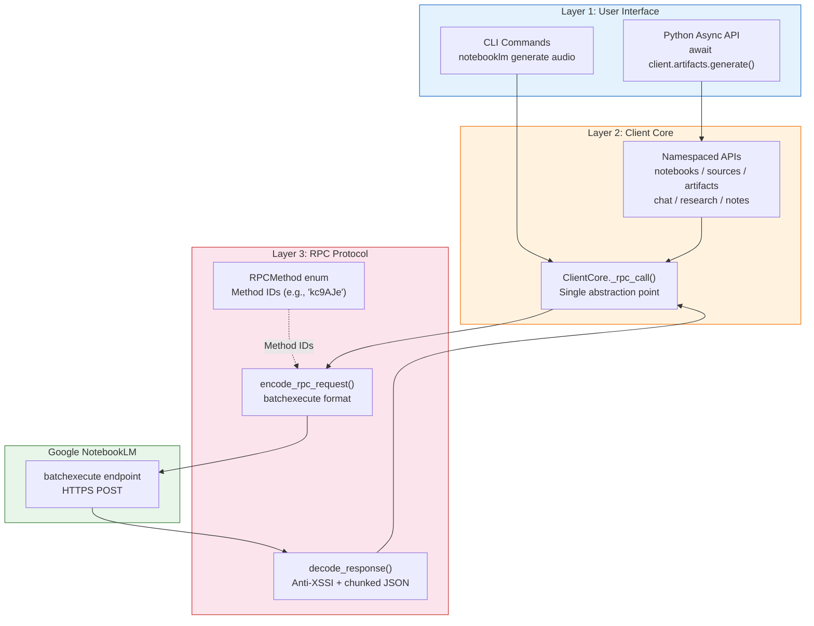
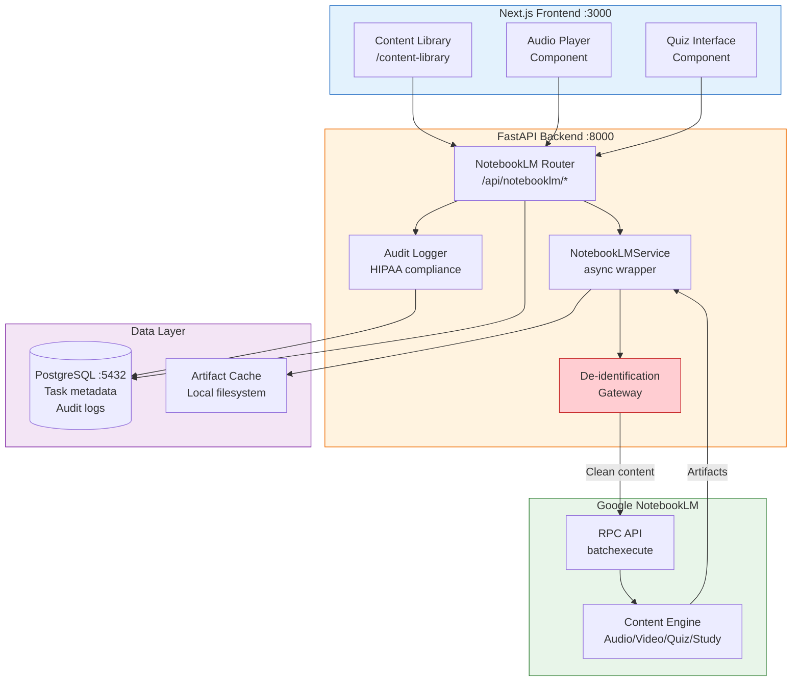

# notebooklm-py Developer Onboarding Tutorial

**Welcome to the MPS PMS notebooklm-py Integration Team**

This tutorial will take you from zero to building your first NotebookLM integration with the PMS. By the end, you will understand how notebooklm-py works, have a running local environment, and have built and tested a custom content generation pipeline end-to-end.

**Document ID:** PMS-EXP-NOTEBOOKLM-PY-002
**Version:** 1.0
**Date:** 2026-03-09
**Applies To:** PMS project (all platforms)
**Prerequisite:** [notebooklm-py Setup Guide](57-NotebookLM-Py-PMS-Developer-Setup-Guide.md)
**Estimated time:** 2–3 hours
**Difficulty:** Beginner-friendly

---

## What You Will Learn

1. How Google NotebookLM works and what notebooklm-py provides
2. The architecture of the notebooklm-py SDK (RPC protocol, async API, CLI)
3. How to create notebooks and add clinical sources programmatically
4. How to generate audio podcasts from clinical guidelines
5. How to generate quizzes and study guides for staff training
6. How to use grounded Q&A to ask questions against uploaded documents
7. How to build a content generation pipeline in the PMS backend
8. How to evaluate strengths, weaknesses, and HIPAA implications
9. How to debug common issues with cookie auth and async generation
10. Development workflow conventions for NotebookLM integrations

---

## Part 1: Understanding notebooklm-py (15 min read)

### 1.1 What Problem Does notebooklm-py Solve?

Clinical staff at PMS-powered facilities face a knowledge dissemination challenge. Treatment protocols, drug interaction guides, continuing education materials, and compliance policies are published as dense documents. Staff rarely consume them fully, leading to knowledge gaps.

Google NotebookLM transforms documents into accessible formats — **audio podcasts** (two-host conversational deep dives), **quizzes**, **flashcards**, **study guides**, **slide decks**, and **mind maps**. But NotebookLM is a web-only tool with no official API.

**notebooklm-py** bridges this gap by reverse-engineering Google's internal RPC protocol, providing a Python SDK and CLI that lets PMS automate content generation at scale. Instead of a nurse manually uploading PDFs to NotebookLM's web UI, PMS can programmatically create notebooks, ingest clinical sources, and generate training materials — all triggered from backend workflows or CrewAI agent pipelines.

### 1.2 How notebooklm-py Works — The Key Pieces



**Three key concepts:**

1. **Cookie-based authentication**: notebooklm-py captures your Google session cookies via Playwright browser login. These cookies are stored locally and sent with every RPC request. No passwords are stored.

2. **batchexecute RPC protocol**: Google's internal protocol for web apps. notebooklm-py encodes requests with method IDs and parameters, sends them as HTTPS POSTs, and decodes the chunked JSON response. The `RPCMethod` enum maps human-readable names to Google's internal method IDs.

3. **Async-first architecture**: All SDK operations are async (`await`-based). Content generation (especially audio) is asynchronous on Google's side — you submit a request and poll for completion. The SDK handles this with `wait=True/False` patterns.

### 1.3 How notebooklm-py Fits with Other PMS Technologies

| Technology | Experiment | Role | Relationship to notebooklm-py |
|------------|-----------|------|-------------------------------|
| **CrewAI** | Exp 55 | Multi-agent orchestration | Agents can trigger content generation (e.g., "after documenting an encounter, generate a patient education podcast") |
| **LangGraph** | Exp 26 | Stateful agent graphs | State machines can include NotebookLM generation as a node in clinical workflows |
| **RAG (pgvector)** | Exp 11 | Vector search / retrieval | RAG retrieves relevant documents; notebooklm-py transforms them into consumable formats |
| **Whisper** | Exp 15 | Speech-to-text | Whisper transcribes clinical audio; notebooklm-py generates audio from text — complementary directions |
| **Mistral** | Exp 54 | LLM inference | Mistral generates structured text (SOAP notes); notebooklm-py transforms text into multimodal content |

### 1.4 Key Vocabulary

| Term | Meaning |
|------|---------|
| **Notebook** | A container in NotebookLM that holds sources and generated artifacts |
| **Source** | An input document (PDF, URL, YouTube video, text) uploaded to a notebook |
| **Artifact** | A generated output (audio, video, quiz, study guide, flashcards, slides, mind map) |
| **Audio Overview** | A two-host conversational podcast generated from notebook sources |
| **batchexecute** | Google's internal RPC protocol used by NotebookLM and other Google web apps |
| **storage_state.json** | File containing Google session cookies for authentication |
| **RPC Method ID** | A short string (e.g., `kc9AJe`) identifying a specific NotebookLM API operation |
| **Grounded Q&A** | Asking questions and receiving answers that cite specific passages from uploaded sources |
| **CSRF Token (SNlM0e)** | A session-specific token extracted from Google's page for request validation |
| **Playwright** | Browser automation library used for the one-time Google login flow |

### 1.5 Our Architecture



---

## Part 2: Environment Verification (15 min)

### 2.1 Checklist

Complete these verification steps before proceeding:

1. **Python version:**
   ```bash
   python3 --version
   # Expected: Python 3.10 or higher
   ```

2. **notebooklm-py installed:**
   ```bash
   notebooklm --version
   # Expected: notebooklm-py 0.3.2 (or higher)
   ```

3. **Playwright Chromium available:**
   ```bash
   playwright install --dry-run chromium
   # Should show Chromium is already installed
   ```

4. **Authentication valid:**
   ```bash
   notebooklm notebooks list
   # Should return a list (possibly empty) without errors
   ```

5. **PMS backend running:**
   ```bash
   curl -s http://localhost:8000/health
   # Expected: {"status": "healthy"}
   ```

6. **PMS frontend running:**
   ```bash
   curl -s -o /dev/null -w "%{http_code}" http://localhost:3000
   # Expected: 200
   ```

7. **PostgreSQL accessible:**
   ```bash
   psql -h localhost -p 5432 -U pms -c "SELECT 1;"
   # Expected: 1
   ```

### 2.2 Quick Test

Run a single end-to-end test to confirm everything works:

```bash
# Create a test notebook, add a source, and list it
notebooklm notebooks create --title "Setup Verification"
notebooklm sources add text --title "Test" <<'EOF'
The Patient Management System (PMS) is a healthcare application
that manages patient records, encounters, and prescriptions.
EOF
notebooklm notebooks list
# Should show "Setup Verification" in the list
```

If this works, you're ready for Part 3.

---

## Part 3: Build Your First Integration (45 min)

### 3.1 What We Are Building

We'll build a **Clinical Protocol Podcast Generator** — a Python script that:

1. Takes a clinical guideline (text or URL) as input
2. Creates a NotebookLM notebook
3. Adds the guideline as a source
4. Generates an audio podcast summarizing the key points
5. Optionally generates a quiz to test comprehension

This mirrors a real PMS workflow: when a new clinical protocol is published, the system automatically generates an audio briefing and quiz for staff training.

### 3.2 Create the Project Structure

```bash
mkdir -p pms-backend/scripts/notebooklm
touch pms-backend/scripts/notebooklm/__init__.py
touch pms-backend/scripts/notebooklm/protocol_podcast.py
```

### 3.3 Write the Podcast Generator

Create `pms-backend/scripts/notebooklm/protocol_podcast.py`:

```python
#!/usr/bin/env python3
"""Clinical Protocol Podcast Generator.

Takes a clinical guideline and generates an audio podcast
and optional quiz using NotebookLM.

Usage:
    python protocol_podcast.py --title "Diabetes Management" --source-file guidelines.txt
    python protocol_podcast.py --title "Hand Hygiene" --source-url "https://www.cdc.gov/..."
"""

import argparse
import asyncio
import sys
from pathlib import Path

from notebooklm import NotebookLM


async def generate_protocol_podcast(
    title: str,
    source_text: str | None = None,
    source_url: str | None = None,
    generate_quiz: bool = False,
) -> dict:
    """Generate a podcast (and optional quiz) from a clinical protocol.

    Args:
        title: Name of the clinical protocol
        source_text: Text content of the protocol
        source_url: URL to the protocol document
        generate_quiz: Whether to also generate a quiz

    Returns:
        Dictionary with notebook_id and generated artifact details
    """
    if not source_text and not source_url:
        raise ValueError("Provide either source_text or source_url")

    async with NotebookLM() as client:
        # Step 1: Create a notebook for this protocol
        print(f"Creating notebook: {title}...")
        notebook = await client.notebooks.create(title=f"Protocol: {title}")
        print(f"  Notebook ID: {notebook.id}")

        # Step 2: Add the source
        if source_url:
            print(f"Adding URL source: {source_url}...")
            await client.sources.add_url(source_url)
        else:
            print("Adding text source...")
            await client.sources.add_text(
                title=f"{title} - Clinical Guideline",
                content=source_text,
            )

        # Step 3: Generate the audio podcast
        print("Generating audio podcast (this may take 5-30 minutes)...")
        audio_instructions = (
            f"Create an engaging audio overview of the {title} clinical protocol. "
            "Focus on key recommendations, dosing guidelines, and clinical decision points. "
            "Make it accessible for clinical staff who need a quick refresher."
        )
        audio = await client.artifacts.generate(
            artifact_type="audio",
            instructions=audio_instructions,
            wait=True,
        )
        print(f"  Audio generated successfully!")

        result = {
            "notebook_id": notebook.id,
            "title": title,
            "audio": audio,
        }

        # Step 4: Optionally generate a quiz
        if generate_quiz:
            print("Generating comprehension quiz...")
            quiz = await client.artifacts.generate(
                artifact_type="quiz",
                instructions="Create a 10-question quiz covering the key clinical recommendations. Include a mix of multiple choice and true/false questions.",
            )
            result["quiz"] = quiz
            print("  Quiz generated!")

        print("\nDone! Protocol podcast pipeline complete.")
        return result


def main():
    parser = argparse.ArgumentParser(description="Generate a podcast from a clinical protocol")
    parser.add_argument("--title", required=True, help="Protocol title")
    parser.add_argument("--source-file", help="Path to a text file with the protocol")
    parser.add_argument("--source-url", help="URL to the protocol document")
    parser.add_argument("--quiz", action="store_true", help="Also generate a quiz")

    args = parser.parse_args()

    source_text = None
    if args.source_file:
        source_text = Path(args.source_file).read_text()

    result = asyncio.run(
        generate_protocol_podcast(
            title=args.title,
            source_text=source_text,
            source_url=args.source_url,
            generate_quiz=args.quiz,
        )
    )
    print(f"\nNotebook ID: {result['notebook_id']}")


if __name__ == "__main__":
    main()
```

### 3.4 Test with a Sample Protocol

Create a test guideline file:

```bash
cat > /tmp/test-protocol.txt << 'EOF'
TYPE 2 DIABETES MANAGEMENT PROTOCOL

1. SCREENING
- HbA1c testing every 3 months for diagnosed patients
- Fasting glucose annually for at-risk populations
- Target HbA1c: below 7.0% for most adults

2. FIRST-LINE TREATMENT
- Metformin 500mg BID, titrate to 1000mg BID over 4 weeks
- Contraindicated in eGFR < 30 mL/min
- Hold 48h before contrast dye procedures

3. SECOND-LINE OPTIONS (if HbA1c > 7.0% after 3 months on metformin)
- GLP-1 receptor agonists (preferred if BMI > 30)
- SGLT2 inhibitors (preferred if heart failure or CKD)
- DPP-4 inhibitors (if cost is primary concern)

4. MONITORING
- Renal function (eGFR) every 6 months
- Lipid panel annually
- Eye exam annually
- Foot exam every visit
EOF
```

Run the generator:

```bash
cd pms-backend
python scripts/notebooklm/protocol_podcast.py \
  --title "Type 2 Diabetes Management" \
  --source-file /tmp/test-protocol.txt \
  --quiz
```

### 3.5 Verify the Results

```bash
# List notebooks — should see "Protocol: Type 2 Diabetes Management"
notebooklm notebooks list

# You can also check the NotebookLM web UI:
# https://notebooklm.google.com
```

### 3.6 Connect to the PMS API

Now test the same flow through the PMS REST API:

```bash
# Create notebook via API
NOTEBOOK_ID=$(curl -s -X POST http://localhost:8000/api/notebooklm/notebooks \
  -H "Content-Type: application/json" \
  -d '{"title": "API Protocol Test"}' | python3 -c "import sys,json; print(json.load(sys.stdin)['id'])")

echo "Created notebook: $NOTEBOOK_ID"

# Add the protocol as a text source
curl -s -X POST "http://localhost:8000/api/notebooklm/notebooks/${NOTEBOOK_ID}/sources/text" \
  -H "Content-Type: application/json" \
  -d '{
    "title": "Diabetes Protocol",
    "content": "HbA1c testing every 3 months. Target below 7.0%. First-line: Metformin 500mg BID. Second-line: GLP-1 agonists if BMI > 30."
  }'

# Ask a grounded question
curl -s -X POST "http://localhost:8000/api/notebooklm/notebooks/${NOTEBOOK_ID}/chat" \
  -H "Content-Type: application/json" \
  -d '{"question": "What is the target HbA1c level?"}' | python3 -m json.tool
```

---

## Part 4: Evaluating Strengths and Weaknesses (15 min)

### 4.1 Strengths

- **Multimodal output**: Transforms text into audio, video, slides, quizzes, flashcards, and more — no other single tool offers this breadth
- **High-quality audio**: NotebookLM's two-host conversational podcasts are remarkably natural and engaging
- **Grounded Q&A**: Answers cite specific passages from uploaded sources, reducing hallucination
- **Async Python API**: Clean, well-structured async interface that integrates naturally with FastAPI
- **CLI + SDK**: Both interactive CLI for exploration and programmatic SDK for automation
- **Low infrastructure overhead**: Runs in-process, no additional Docker services needed
- **Active maintenance**: Regular releases, RPC health monitoring, responsive maintainer

### 4.2 Weaknesses

- **Unofficial API**: Reverse-engineers Google's internal protocol — can break at any time when Google changes method IDs
- **Cookie-based auth**: Fragile authentication that requires periodic re-login; not suitable for headless production without careful session management
- **No official SLA**: Google could rate-limit, block, or deprecate the underlying service without notice
- **Generation latency**: Audio generation takes 5–30 minutes — not suitable for real-time workflows
- **Account risk**: Automated usage may trigger Google's abuse detection systems
- **Limited error handling**: RPC errors from Google are opaque and hard to diagnose
- **No BAA available**: Google does not offer a Business Associate Agreement for NotebookLM (only for NotebookLM Enterprise), so PHI must never be sent

### 4.3 When to Use notebooklm-py vs Alternatives

| Scenario | Best Choice | Why |
|----------|-------------|-----|
| Generate audio podcasts from documents | **notebooklm-py** | Best-in-class audio quality, two-host format |
| Generate audio from arbitrary text (need control) | **Podcastfy** (open-source) | Full control, self-hosted, no Google dependency |
| Official API with SLA for enterprise | **NotebookLM Enterprise API** | Google-backed, BAA available, stable endpoints |
| Interactive document Q&A | **notebooklm-py** or **RAG (pgvector)** | notebooklm-py for ad-hoc; RAG for production |
| Generate quizzes/flashcards at scale | **notebooklm-py** | Unique capability, hard to replicate with LLMs alone |
| Real-time content generation (< 30s) | **Local LLM (Mistral, Exp 54)** | notebooklm-py is too slow for real-time |

### 4.4 HIPAA / Healthcare Considerations

| Consideration | Assessment | Action Required |
|---------------|------------|-----------------|
| **PHI transmission** | Critical risk — data leaves PMS boundary | Mandatory de-identification before any content is sent to NotebookLM |
| **BAA coverage** | Not available for consumer NotebookLM | Only use with non-PHI content (protocols, guidelines, anonymized data) |
| **Data retention** | Google retains uploaded content | Use dedicated service account; periodically delete notebooks |
| **Audit trail** | Required for HIPAA | Implemented via `notebooklm_audit.py` — logs all operations |
| **Access control** | Role-based access required | Content generation restricted to Admin/Clinical Lead roles |
| **Credential security** | Cookie file is a session token | 0o600 permissions, excluded from git, env var in production |

**Bottom line:** notebooklm-py is suitable for **non-PHI clinical knowledge** (protocols, guidelines, education materials, anonymized case studies). It is **not suitable** for processing individual patient data without a BAA and robust de-identification.

---

## Part 5: Debugging Common Issues (15 min read)

### Issue 1: "AuthenticationError: No valid session"

**Symptoms:** Any API call fails with authentication error.
**Cause:** Session cookies have expired or `storage_state.json` is missing/corrupted.
**Fix:**
```bash
notebooklm login  # Re-authenticate
notebooklm notebooks list  # Verify
```
**Tip:** Check `~/.notebooklm/storage_state.json` exists and is recent.

### Issue 2: "RPCError: Method not found"

**Symptoms:** Specific operations fail while others work.
**Cause:** Google changed internal method IDs.
**Fix:**
```bash
pip install --upgrade notebooklm-py
```
**Tip:** Check the [RPC health workflow](https://github.com/teng-lin/notebooklm-py/actions/workflows/rpc-health.yml) for current status.

### Issue 3: Audio Generation Timeout

**Symptoms:** `generate_audio()` with `wait=True` hangs for 30+ minutes.
**Cause:** Google's audio generation is slow and variable.
**Fix:** Use `wait=False` and implement your own polling with timeout:
```python
result = await client.artifacts.generate(artifact_type="audio", wait=False)
# Poll manually with a timeout
```

### Issue 4: "BrowserType.launch: Executable doesn't exist"

**Symptoms:** `notebooklm login` fails immediately.
**Cause:** Playwright Chromium not installed.
**Fix:**
```bash
pip install "notebooklm-py[browser]"
playwright install chromium
```

### Issue 5: Rate Limiting / 429 Errors

**Symptoms:** Requests start failing after many rapid calls.
**Cause:** Google's rate limiting on the internal API.
**Fix:** Add delays between operations:
```python
import asyncio
await asyncio.sleep(2)  # Wait between operations
```
**Tip:** Keep request patterns human-like — avoid rapid-fire bulk operations.

### Reading Logs

Enable debug logging to see RPC details:

```python
import logging
logging.basicConfig(level=logging.DEBUG)
logging.getLogger("notebooklm").setLevel(logging.DEBUG)
```

This shows the full RPC request/response cycle, which is essential for diagnosing protocol-level issues.

---

## Part 6: Practice Exercise (45 min)

### Option A: Staff Training Pipeline

Build a pipeline that takes a clinical guideline PDF URL and generates:
1. A study guide summarizing key points
2. A quiz with 10 questions
3. A set of flashcards for quick review

**Hints:**
- Create a single notebook and add the PDF URL as a source
- Generate all three artifacts sequentially (study guide → quiz → flashcards)
- Use the `artifacts.generate()` method with different `artifact_type` values
- Save the results to files for review

### Option B: Multi-Source Knowledge Base

Build a notebook that combines multiple sources on a single topic:
1. Add 3 different URLs about a clinical topic (e.g., hypertension guidelines from AHA, WHO, and JNC)
2. Use grounded Q&A to ask comparison questions ("How do AHA and WHO guidelines differ on first-line treatment?")
3. Generate a mind map synthesizing all three sources

**Hints:**
- Use `sources.add_url()` for each URL
- Allow 10–15 seconds between source additions for processing
- The chat API will automatically reference all sources in the notebook

### Option C: Automated Report Briefing

Build a script that takes a PMS monthly report (text format) and generates an audio briefing for the executive team:
1. Create a notebook titled with the report month
2. Add the report text as a source
3. Generate an audio overview with custom instructions: "Focus on key metrics, trends, and action items. Keep the tone professional but concise."
4. Track generation time and log it

**Hints:**
- Use `time.time()` to measure generation duration
- Custom `instructions` parameter in `artifacts.generate()` shapes the output style
- Consider adding a second source with the previous month's report for comparison

---

## Part 7: Development Workflow and Conventions

### 7.1 File Organization

```
pms-backend/
├── app/
│   ├── routers/
│   │   └── notebooklm.py          # REST API endpoints
│   ├── services/
│   │   └── notebooklm_service.py   # Async service wrapper
│   ├── middleware/
│   │   └── notebooklm_audit.py     # HIPAA audit logging
│   └── models/
│       └── notebooklm_models.py    # Pydantic request/response models
├── scripts/
│   └── notebooklm/
│       ├── __init__.py
│       └── protocol_podcast.py     # CLI scripts
└── tests/
    └── test_notebooklm/
        ├── test_service.py         # Unit tests (mocked RPC)
        └── test_integration.py     # Integration tests (live API)

pms-frontend/
├── src/
│   ├── lib/
│   │   └── notebooklm-api.ts      # API client
│   └── app/
│       └── content-library/
│           └── page.tsx            # Content library page
```

### 7.2 Naming Conventions

| Item | Convention | Example |
|------|-----------|---------|
| Service class | `PascalCase` + `Service` suffix | `NotebookLMService` |
| Router file | `snake_case` | `notebooklm.py` |
| API route prefix | `/api/notebooklm` | `/api/notebooklm/notebooks` |
| Environment variables | `SCREAMING_SNAKE` | `NOTEBOOKLM_AUTH_JSON` |
| Notebook titles | `Category: Title` | `Protocol: Diabetes Management` |
| Test files | `test_` prefix | `test_notebooklm_service.py` |
| Frontend API client | `camelCase` functions | `listNotebooks()` |

### 7.3 PR Checklist

When submitting PRs that involve notebooklm-py:

- [ ] No `storage_state.json` or credentials committed
- [ ] `.notebooklm/` in `.gitignore`
- [ ] Audit logging added for new NotebookLM operations
- [ ] No PHI in notebook titles, source content, or instructions
- [ ] De-identification gateway used for any clinical data
- [ ] Unit tests with mocked RPC calls (no live API in CI)
- [ ] Integration tests tagged with `@pytest.mark.integration`
- [ ] Error handling for `AuthenticationError` and `RPCError`
- [ ] Async operations use `wait=False` with proper polling
- [ ] Documentation updated in `docs/experiments/`

### 7.4 Security Reminders

1. **Never send PHI to NotebookLM** — always de-identify first
2. **Never commit credentials** — `storage_state.json` stays local
3. **Use a dedicated Google account** — not personal, not shared
4. **Log operations, not content** — audit logs record hashes, not text
5. **Rate limit API calls** — avoid triggering Google's abuse detection
6. **Review generated content** — AI-generated clinical materials must be reviewed by qualified staff before distribution
7. **Delete test notebooks** — clean up after development/testing sessions

---

## Part 8: Quick Reference Card

### Key Commands

```bash
# Auth
notebooklm login                                    # Authenticate
notebooklm notebooks list                            # Verify auth

# Notebooks
notebooklm notebooks create --title "My Notebook"   # Create
notebooklm notebooks delete <id>                     # Delete

# Sources
notebooklm sources add url <url>                     # Add URL
notebooklm sources add text --title "X"              # Add text (stdin)

# Generation
notebooklm generate audio "instructions" --wait      # Podcast
notebooklm generate study-guide                      # Study guide
notebooklm generate quiz                             # Quiz
notebooklm generate flashcards                       # Flashcards

# Q&A
notebooklm chat "What is the recommended dosage?"    # Grounded Q&A
```

### Key Files

| File | Purpose |
|------|---------|
| `~/.notebooklm/storage_state.json` | Google session cookies (NEVER commit) |
| `app/services/notebooklm_service.py` | Async service wrapper |
| `app/routers/notebooklm.py` | REST API endpoints |
| `app/middleware/notebooklm_audit.py` | HIPAA audit logging |
| `src/lib/notebooklm-api.ts` | Frontend API client |

### Key URLs

| Resource | URL |
|----------|-----|
| NotebookLM Web UI | https://notebooklm.google.com |
| PMS API | http://localhost:8000/api/notebooklm/notebooks |
| Content Library | http://localhost:3000/content-library |
| GitHub | https://github.com/teng-lin/notebooklm-py |
| PyPI | https://pypi.org/project/notebooklm-py/ |

### Starter Template

```python
"""Quick-start template for NotebookLM integration."""

import asyncio
from notebooklm import NotebookLM


async def main():
    async with NotebookLM() as client:
        # Create notebook
        notebook = await client.notebooks.create(title="My Protocol")

        # Add source
        await client.sources.add_text(
            title="Clinical Guideline",
            content="Your clinical content here...",
        )

        # Generate content
        study_guide = await client.artifacts.generate(artifact_type="study_guide")
        print("Study guide generated!")

        # Ask a question
        answer = await client.chat.send("What are the key recommendations?")
        print(f"Answer: {answer}")


if __name__ == "__main__":
    asyncio.run(main())
```

---

## Next Steps

1. **Explore the full CLI** — Review the [CLI Reference](https://github.com/teng-lin/notebooklm-py/blob/main/docs/cli-reference.md) for advanced commands
2. **Build a content pipeline** — Combine with CrewAI (Exp 55) to trigger content generation from agent workflows
3. **Evaluate NotebookLM Enterprise** — If PMS needs official API support and BAA, explore [NotebookLM Enterprise](https://docs.cloud.google.com/gemini/enterprise/notebooklm-enterprise/docs/overview)
4. **Implement de-identification** — Build the PHI stripping gateway before processing any clinical data
5. **Review the PRD** — See the [full integration vision](57-PRD-NotebookLM-Py-PMS-Integration.md) for Phase 2 and 3 features
