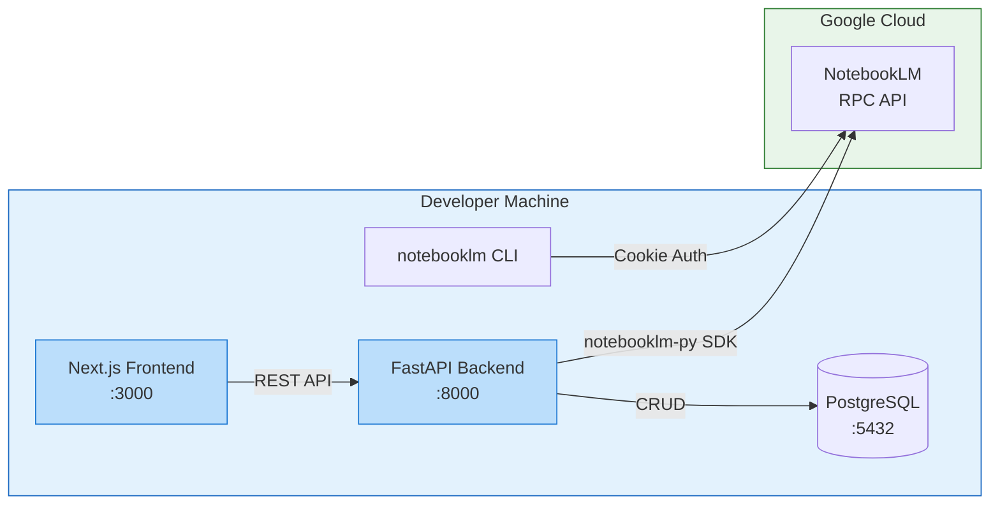

# notebooklm-py Setup Guide for PMS Integration

**Document ID:** PMS-EXP-NOTEBOOKLM-PY-001
**Version:** 1.0
**Date:** 2026-03-09
**Applies To:** PMS project (all platforms)
**Prerequisites Level:** Intermediate

---

## Table of Contents

1. [Overview](#1-overview)
2. [Prerequisites](#2-prerequisites)
3. [Part A: Install and Configure notebooklm-py](#3-part-a-install-and-configure-notebooklm-py)
4. [Part B: Integrate with PMS Backend](#4-part-b-integrate-with-pms-backend)
5. [Part C: Integrate with PMS Frontend](#5-part-c-integrate-with-pms-frontend)
6. [Part D: Testing and Verification](#6-part-d-testing-and-verification)
7. [Troubleshooting](#7-troubleshooting)
8. [Reference Commands](#8-reference-commands)

---

## 1. Overview

This guide walks you through installing **notebooklm-py** (v0.3.2+), authenticating with Google NotebookLM, and integrating the SDK into the PMS FastAPI backend and Next.js frontend. By the end, you will have:

- A working notebooklm-py installation with authenticated Google session
- A `NotebookLMService` async wrapper in the FastAPI backend
- REST endpoints for notebook management and content generation
- A basic content library page in the Next.js frontend
- Verified end-to-end content generation flow



## 2. Prerequisites

### 2.1 Required Software

| Software | Minimum Version | Check Command |
|----------|----------------|---------------|
| Python | 3.10 | `python3 --version` |
| pip | 21.0 | `pip --version` |
| Node.js | 18.0 | `node --version` |
| PostgreSQL | 14.0 | `psql --version` |
| Git | 2.30 | `git --version` |
| Google Account | N/A | Dedicated service account recommended |

### 2.2 Installation of Prerequisites

**Playwright (required for authentication):**

```bash
# Playwright is installed as part of notebooklm-py[browser]
# Chromium browser will be installed in Step 3
```

**Dedicated Google Account (recommended):**

Create a new Google account specifically for PMS NotebookLM integration. This isolates clinical content from personal accounts and reduces risk of account flagging.

> **Security Note:** Never use a personal Google account or an account with access to real patient data for development/testing.

### 2.3 Verify PMS Services

Before proceeding, confirm all PMS services are running:

```bash
# Check FastAPI backend
curl -s http://localhost:8000/health | python3 -m json.tool

# Check Next.js frontend
curl -s -o /dev/null -w "%{http_code}" http://localhost:3000

# Check PostgreSQL
psql -h localhost -p 5432 -U pms -c "SELECT 1;"
```

All three should return healthy responses. If not, start the services before continuing.

**Checkpoint:** All three PMS services (backend :8000, frontend :3000, PostgreSQL :5432) are running and accessible.

---

## 3. Part A: Install and Configure notebooklm-py

### Step 1: Install the Package

```bash
# Navigate to PMS backend directory
cd pms-backend

# Install notebooklm-py with browser extra (for authentication)
pip install "notebooklm-py[browser]>=0.3.2"

# Install Playwright Chromium browser
playwright install chromium
```

### Step 2: Verify Installation

```bash
# Check CLI is available
notebooklm --version
# Expected: notebooklm-py 0.3.2 (or higher)

# Check Python import works
python3 -c "import notebooklm; print('SDK loaded successfully')"
```

### Step 3: Authenticate with Google

```bash
# This opens a Chromium browser — log in with your dedicated Google account
notebooklm login
```

A browser window opens. Log in to your dedicated Google account. After successful login, cookies are saved to `~/.notebooklm/storage_state.json` with owner-only permissions (0o600).

### Step 4: Verify Authentication

```bash
# List notebooks to confirm auth works
notebooklm notebooks list

# Expected: empty list or existing notebooks from the account
# If you see an auth error, re-run 'notebooklm login'
```

### Step 5: Configure for PMS

Create a `.env` entry for the PMS backend:

```bash
# Add to pms-backend/.env (do NOT commit this file)
NOTEBOOKLM_HOME=/path/to/pms-backend/.notebooklm
```

Alternatively, for CI/CD environments:

```bash
# Export the auth JSON as an environment variable
export NOTEBOOKLM_AUTH_JSON=$(cat ~/.notebooklm/storage_state.json)
```

### Step 6: Security Hardening

```bash
# Verify file permissions
ls -la ~/.notebooklm/storage_state.json
# Expected: -rw------- (0o600)

# Add to .gitignore
echo ".notebooklm/" >> .gitignore
echo "storage_state.json" >> .gitignore
```

**Checkpoint:** notebooklm-py is installed, authenticated, and configured. `notebooklm notebooks list` returns without errors. Credentials are secured with proper file permissions and excluded from version control.

---

## 4. Part B: Integrate with PMS Backend

### Step 1: Create the Service Module

Create `pms-backend/app/services/notebooklm_service.py`:

```python
"""NotebookLM service for PMS content generation."""

import asyncio
import logging
from pathlib import Path
from typing import Optional

from notebooklm import NotebookLM

logger = logging.getLogger(__name__)


class NotebookLMService:
    """Async wrapper for notebooklm-py SDK."""

    def __init__(self, storage_path: Optional[str] = None):
        self._client: Optional[NotebookLM] = None
        self._storage_path = storage_path

    async def _get_client(self) -> NotebookLM:
        """Lazy-initialize the NotebookLM client."""
        if self._client is None:
            self._client = NotebookLM(storage_path=self._storage_path)
            await self._client.__aenter__()
        return self._client

    async def create_notebook(self, title: str) -> dict:
        """Create a new notebook."""
        client = await self._get_client()
        notebook = await client.notebooks.create(title=title)
        logger.info(f"Created notebook: {notebook.id} - {title}")
        return {"id": notebook.id, "title": title}

    async def add_source_url(self, notebook_id: str, url: str) -> dict:
        """Add a URL source to a notebook."""
        client = await self._get_client()
        await client.notebooks.select(notebook_id)
        source = await client.sources.add_url(url)
        logger.info(f"Added URL source to {notebook_id}: {url}")
        return {"notebook_id": notebook_id, "source_url": url, "source_id": source.id}

    async def add_source_text(self, notebook_id: str, title: str, content: str) -> dict:
        """Add pasted text as a source to a notebook."""
        client = await self._get_client()
        await client.notebooks.select(notebook_id)
        source = await client.sources.add_text(title=title, content=content)
        logger.info(f"Added text source to {notebook_id}: {title}")
        return {"notebook_id": notebook_id, "title": title, "source_id": source.id}

    async def generate_audio(
        self, notebook_id: str, instructions: str = "", wait: bool = True
    ) -> dict:
        """Generate an audio overview (podcast) for a notebook."""
        client = await self._get_client()
        await client.notebooks.select(notebook_id)
        result = await client.artifacts.generate(
            artifact_type="audio", instructions=instructions, wait=wait
        )
        logger.info(f"Generated audio for {notebook_id}")
        return {"notebook_id": notebook_id, "artifact": result}

    async def generate_study_guide(self, notebook_id: str) -> dict:
        """Generate a study guide for a notebook."""
        client = await self._get_client()
        await client.notebooks.select(notebook_id)
        result = await client.artifacts.generate(artifact_type="study_guide")
        logger.info(f"Generated study guide for {notebook_id}")
        return {"notebook_id": notebook_id, "artifact": result}

    async def generate_quiz(
        self, notebook_id: str, difficulty: str = "medium"
    ) -> dict:
        """Generate a quiz for a notebook."""
        client = await self._get_client()
        await client.notebooks.select(notebook_id)
        result = await client.artifacts.generate(
            artifact_type="quiz", instructions=f"difficulty: {difficulty}"
        )
        logger.info(f"Generated quiz for {notebook_id}")
        return {"notebook_id": notebook_id, "artifact": result}

    async def ask_question(self, notebook_id: str, question: str) -> dict:
        """Ask a grounded Q&A question against notebook sources."""
        client = await self._get_client()
        await client.notebooks.select(notebook_id)
        answer = await client.chat.send(question)
        logger.info(f"Q&A on {notebook_id}: {question[:50]}...")
        return {"notebook_id": notebook_id, "question": question, "answer": answer}

    async def list_notebooks(self) -> list[dict]:
        """List all notebooks."""
        client = await self._get_client()
        notebooks = await client.notebooks.list()
        return [{"id": nb.id, "title": nb.title} for nb in notebooks]

    async def close(self):
        """Clean up the client session."""
        if self._client:
            await self._client.__aexit__(None, None, None)
            self._client = None
```

### Step 2: Create API Router

Create `pms-backend/app/routers/notebooklm.py`:

```python
"""NotebookLM REST API endpoints."""

from fastapi import APIRouter, Depends, HTTPException, BackgroundTasks
from pydantic import BaseModel, HttpUrl
from typing import Optional

from app.services.notebooklm_service import NotebookLMService

router = APIRouter(prefix="/api/notebooklm", tags=["notebooklm"])

# Singleton service instance
_service: Optional[NotebookLMService] = None


def get_service() -> NotebookLMService:
    global _service
    if _service is None:
        _service = NotebookLMService()
    return _service


# --- Request/Response Models ---

class CreateNotebookRequest(BaseModel):
    title: str

class AddSourceURLRequest(BaseModel):
    url: HttpUrl

class AddSourceTextRequest(BaseModel):
    title: str
    content: str

class GenerateArtifactRequest(BaseModel):
    instructions: str = ""
    wait: bool = False

class AskQuestionRequest(BaseModel):
    question: str


# --- Endpoints ---

@router.get("/notebooks")
async def list_notebooks(service: NotebookLMService = Depends(get_service)):
    """List all notebooks."""
    return await service.list_notebooks()


@router.post("/notebooks")
async def create_notebook(
    req: CreateNotebookRequest,
    service: NotebookLMService = Depends(get_service),
):
    """Create a new notebook."""
    return await service.create_notebook(req.title)


@router.post("/notebooks/{notebook_id}/sources/url")
async def add_source_url(
    notebook_id: str,
    req: AddSourceURLRequest,
    service: NotebookLMService = Depends(get_service),
):
    """Add a URL source to a notebook."""
    return await service.add_source_url(notebook_id, str(req.url))


@router.post("/notebooks/{notebook_id}/sources/text")
async def add_source_text(
    notebook_id: str,
    req: AddSourceTextRequest,
    service: NotebookLMService = Depends(get_service),
):
    """Add text content as a source."""
    return await service.add_source_text(notebook_id, req.title, req.content)


@router.post("/notebooks/{notebook_id}/generate/audio")
async def generate_audio(
    notebook_id: str,
    req: GenerateArtifactRequest,
    service: NotebookLMService = Depends(get_service),
):
    """Generate an audio overview (podcast)."""
    return await service.generate_audio(notebook_id, req.instructions, req.wait)


@router.post("/notebooks/{notebook_id}/generate/study-guide")
async def generate_study_guide(
    notebook_id: str,
    service: NotebookLMService = Depends(get_service),
):
    """Generate a study guide."""
    return await service.generate_study_guide(notebook_id)


@router.post("/notebooks/{notebook_id}/generate/quiz")
async def generate_quiz(
    notebook_id: str,
    service: NotebookLMService = Depends(get_service),
):
    """Generate a quiz."""
    return await service.generate_quiz(notebook_id)


@router.post("/notebooks/{notebook_id}/chat")
async def ask_question(
    notebook_id: str,
    req: AskQuestionRequest,
    service: NotebookLMService = Depends(get_service),
):
    """Ask a grounded question against notebook sources."""
    return await service.ask_question(notebook_id, req.question)
```

### Step 3: Register the Router

Add to your FastAPI app initialization (e.g., `app/main.py`):

```python
from app.routers import notebooklm

app.include_router(notebooklm.router)
```

### Step 4: Add Audit Logging

Create `pms-backend/app/middleware/notebooklm_audit.py`:

```python
"""Audit logging middleware for NotebookLM operations."""

import logging
import hashlib
from datetime import datetime, timezone

logger = logging.getLogger("notebooklm.audit")


def log_operation(
    user_id: str,
    operation: str,
    notebook_id: str = "",
    content_hash: str = "",
    status: str = "success",
):
    """Log a NotebookLM operation for HIPAA audit trail."""
    logger.info(
        "NLM_AUDIT | timestamp=%s | user=%s | operation=%s | notebook=%s | content_hash=%s | status=%s",
        datetime.now(timezone.utc).isoformat(),
        user_id,
        operation,
        notebook_id,
        content_hash,
        status,
    )


def hash_content(content: str) -> str:
    """Generate a SHA-256 hash of content for audit logging (not the content itself)."""
    return hashlib.sha256(content.encode()).hexdigest()[:16]
```

**Checkpoint:** The PMS backend has a `NotebookLMService`, REST API router at `/api/notebooklm/*`, and audit logging. The router is registered in the FastAPI app.

---

## 5. Part C: Integrate with PMS Frontend

### Step 1: Add Environment Variable

Add to `pms-frontend/.env.local`:

```env
NEXT_PUBLIC_API_URL=http://localhost:8000
```

### Step 2: Create API Client

Create `pms-frontend/src/lib/notebooklm-api.ts`:

```typescript
const API_BASE = `${process.env.NEXT_PUBLIC_API_URL}/api/notebooklm`;

export interface Notebook {
  id: string;
  title: string;
}

export async function listNotebooks(): Promise<Notebook[]> {
  const res = await fetch(`${API_BASE}/notebooks`);
  if (!res.ok) throw new Error("Failed to list notebooks");
  return res.json();
}

export async function createNotebook(title: string): Promise<Notebook> {
  const res = await fetch(`${API_BASE}/notebooks`, {
    method: "POST",
    headers: { "Content-Type": "application/json" },
    body: JSON.stringify({ title }),
  });
  if (!res.ok) throw new Error("Failed to create notebook");
  return res.json();
}

export async function addSourceURL(
  notebookId: string,
  url: string
): Promise<void> {
  const res = await fetch(`${API_BASE}/notebooks/${notebookId}/sources/url`, {
    method: "POST",
    headers: { "Content-Type": "application/json" },
    body: JSON.stringify({ url }),
  });
  if (!res.ok) throw new Error("Failed to add source");
}

export async function generateAudio(
  notebookId: string,
  instructions: string = ""
): Promise<void> {
  const res = await fetch(
    `${API_BASE}/notebooks/${notebookId}/generate/audio`,
    {
      method: "POST",
      headers: { "Content-Type": "application/json" },
      body: JSON.stringify({ instructions, wait: false }),
    }
  );
  if (!res.ok) throw new Error("Failed to start audio generation");
}

export async function askQuestion(
  notebookId: string,
  question: string
): Promise<{ answer: string }> {
  const res = await fetch(`${API_BASE}/notebooks/${notebookId}/chat`, {
    method: "POST",
    headers: { "Content-Type": "application/json" },
    body: JSON.stringify({ question }),
  });
  if (!res.ok) throw new Error("Failed to ask question");
  return res.json();
}
```

### Step 3: Create Content Library Page

Create `pms-frontend/src/app/content-library/page.tsx`:

```tsx
"use client";

import { useState, useEffect } from "react";
import { listNotebooks, createNotebook, type Notebook } from "@/lib/notebooklm-api";

export default function ContentLibraryPage() {
  const [notebooks, setNotebooks] = useState<Notebook[]>([]);
  const [newTitle, setNewTitle] = useState("");
  const [loading, setLoading] = useState(true);

  useEffect(() => {
    loadNotebooks();
  }, []);

  async function loadNotebooks() {
    setLoading(true);
    const data = await listNotebooks();
    setNotebooks(data);
    setLoading(false);
  }

  async function handleCreate() {
    if (!newTitle.trim()) return;
    await createNotebook(newTitle);
    setNewTitle("");
    await loadNotebooks();
  }

  return (
    <div className="p-6 max-w-4xl mx-auto">
      <h1 className="text-2xl font-bold mb-6">Content Library</h1>

      <div className="flex gap-2 mb-6">
        <input
          type="text"
          value={newTitle}
          onChange={(e) => setNewTitle(e.target.value)}
          placeholder="New notebook title..."
          className="flex-1 border rounded px-3 py-2"
        />
        <button
          onClick={handleCreate}
          className="bg-blue-600 text-white px-4 py-2 rounded hover:bg-blue-700"
        >
          Create Notebook
        </button>
      </div>

      {loading ? (
        <p>Loading notebooks...</p>
      ) : (
        <div className="grid gap-4">
          {notebooks.map((nb) => (
            <div key={nb.id} className="border rounded p-4 hover:shadow-md">
              <h3 className="font-semibold">{nb.title}</h3>
              <p className="text-sm text-gray-500">ID: {nb.id}</p>
            </div>
          ))}
          {notebooks.length === 0 && (
            <p className="text-gray-500">
              No notebooks yet. Create one to get started.
            </p>
          )}
        </div>
      )}
    </div>
  );
}
```

**Checkpoint:** The Next.js frontend has an API client for NotebookLM operations and a Content Library page at `/content-library`. The page can list and create notebooks.

---

## 6. Part D: Testing and Verification

### Step 1: CLI Smoke Test

```bash
# Create a test notebook
notebooklm notebooks create --title "PMS Integration Test"

# Add a public URL source
notebooklm sources add url "https://www.cdc.gov/diabetes/about/index.html"

# List notebooks and confirm
notebooklm notebooks list

# Generate a study guide
notebooklm generate study-guide

# Ask a question
notebooklm chat "What are the key risk factors for diabetes?"
```

### Step 2: Backend API Tests

```bash
# List notebooks
curl -s http://localhost:8000/api/notebooklm/notebooks | python3 -m json.tool

# Create a notebook
curl -s -X POST http://localhost:8000/api/notebooklm/notebooks \
  -H "Content-Type: application/json" \
  -d '{"title": "API Test Notebook"}' | python3 -m json.tool

# Expected:
# {
#     "id": "some-notebook-id",
#     "title": "API Test Notebook"
# }
```

### Step 3: Frontend Verification

1. Start the Next.js dev server: `npm run dev`
2. Navigate to `http://localhost:3000/content-library`
3. Verify the notebook list loads
4. Create a new notebook using the form
5. Confirm it appears in the list

### Step 4: End-to-End Flow

```bash
# Full pipeline: create notebook → add source → generate quiz
NOTEBOOK_ID=$(curl -s -X POST http://localhost:8000/api/notebooklm/notebooks \
  -H "Content-Type: application/json" \
  -d '{"title": "E2E Test"}' | python3 -c "import sys,json; print(json.load(sys.stdin)['id'])")

curl -s -X POST "http://localhost:8000/api/notebooklm/notebooks/${NOTEBOOK_ID}/sources/text" \
  -H "Content-Type: application/json" \
  -d '{"title": "Test Protocol", "content": "Patients with Type 2 Diabetes should receive HbA1c testing every 3 months. Target HbA1c is below 7.0%. Metformin is the first-line medication."}'

curl -s -X POST "http://localhost:8000/api/notebooklm/notebooks/${NOTEBOOK_ID}/generate/quiz" | python3 -m json.tool
```

**Checkpoint:** CLI, backend API, frontend, and end-to-end flows are all verified. The integration is functional.

---

## 7. Troubleshooting

### Authentication Failure

**Symptoms:** `AuthenticationError` or `401` responses from notebooklm-py.

**Fix:**
```bash
# Re-authenticate
notebooklm login

# Verify the storage state file exists and has correct permissions
ls -la ~/.notebooklm/storage_state.json
# Must show -rw------- (0o600)
```

Session cookies expire periodically. If errors recur, re-run `notebooklm login`.

### Playwright Browser Not Found

**Symptoms:** `BrowserType.launch: Executable doesn't exist` error.

**Fix:**
```bash
playwright install chromium
```

### Port Conflicts

**Symptoms:** Backend fails to start on :8000.

**Fix:**
```bash
# Find what's using port 8000
lsof -i :8000

# Kill the process or use a different port
uvicorn app.main:app --port 8001
```

### RPC Method ID Mismatch

**Symptoms:** `RPCError: Method not found` or unexpected responses.

**Cause:** Google changed internal API method IDs.

**Fix:**
```bash
# Update to the latest version
pip install --upgrade notebooklm-py

# Check the RPC health status
# https://github.com/teng-lin/notebooklm-py/actions/workflows/rpc-health.yml
```

### Slow Audio Generation

**Symptoms:** Audio generation seems stuck (no response for 10+ minutes).

**Cause:** Audio generation is async and can take 5–30 minutes on Google's servers.

**Fix:** Use `wait=False` and poll for completion, or use the `--wait` CLI flag and be patient. Check the NotebookLM web UI to see if generation is in progress.

### Import Errors

**Symptoms:** `ModuleNotFoundError: No module named 'notebooklm'`

**Fix:**
```bash
# Ensure you're in the correct virtual environment
which python3
pip list | grep notebooklm

# Reinstall if needed
pip install "notebooklm-py[browser]>=0.3.2"
```

---

## 8. Reference Commands

### Daily Development Workflow

```bash
# Start PMS services
docker-compose up -d db          # PostgreSQL
uvicorn app.main:app --reload    # FastAPI backend
npm run dev                      # Next.js frontend (in pms-frontend/)

# Check NotebookLM auth status
notebooklm notebooks list
```

### NotebookLM CLI Commands

| Command | Description |
|---------|-------------|
| `notebooklm login` | Authenticate with Google |
| `notebooklm notebooks list` | List all notebooks |
| `notebooklm notebooks create --title "X"` | Create a notebook |
| `notebooklm notebooks delete <id>` | Delete a notebook |
| `notebooklm sources add url <url>` | Add URL source |
| `notebooklm sources add text --title "X"` | Add text source |
| `notebooklm generate audio "instructions" --wait` | Generate podcast |
| `notebooklm generate study-guide` | Generate study guide |
| `notebooklm generate quiz` | Generate quiz |
| `notebooklm generate flashcards` | Generate flashcards |
| `notebooklm chat "question"` | Ask a question |

### Useful URLs

| Resource | URL |
|----------|-----|
| PMS Backend API | `http://localhost:8000/api/notebooklm/notebooks` |
| PMS Frontend Content Library | `http://localhost:3000/content-library` |
| NotebookLM Web UI | `https://notebooklm.google.com` |
| notebooklm-py GitHub | `https://github.com/teng-lin/notebooklm-py` |
| notebooklm-py Docs | `https://github.com/teng-lin/notebooklm-py/tree/main/docs` |

---

## Next Steps

After setup is complete:

1. Work through the [notebooklm-py Developer Tutorial](57-NotebookLM-Py-Developer-Tutorial.md) to build your first integration
2. Review the [PRD](57-PRD-NotebookLM-Py-PMS-Integration.md) for the full integration vision
3. Explore the [CLI Reference](https://github.com/teng-lin/notebooklm-py/blob/main/docs/cli-reference.md) for advanced commands
4. Review the [CrewAI experiment](55-PRD-CrewAI-PMS-Integration.md) for agent-driven content pipeline ideas

## Resources

- [notebooklm-py GitHub Repository](https://github.com/teng-lin/notebooklm-py)
- [notebooklm-py PyPI](https://pypi.org/project/notebooklm-py/)
- [CLI Reference](https://github.com/teng-lin/notebooklm-py/blob/main/docs/cli-reference.md)
- [RPC Reference](https://github.com/teng-lin/notebooklm-py/blob/main/docs/rpc-reference.md)
- [DeepWiki Documentation](https://deepwiki.com/teng-lin/notebooklm-py)
- [NotebookLM Web UI](https://notebooklm.google.com)
