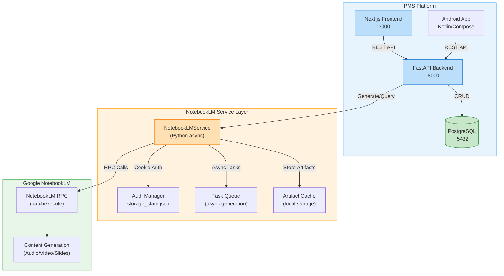

# Product Requirements Document: notebooklm-py Integration into Patient Management System (PMS)

**Document ID:** PRD-PMS-NOTEBOOKLM-PY-001
**Version:** 1.0
**Date:** 2026-03-09
**Author:** Ammar (CEO, MPS Inc.)
**Status:** Draft

---

## 1. Executive Summary

**notebooklm-py** is an unofficial, MIT-licensed Python SDK and CLI for Google's NotebookLM — the AI-powered research and content generation platform. It provides full programmatic access to NotebookLM's capabilities: creating notebooks, ingesting documents (PDFs, URLs, YouTube videos, text), generating audio podcasts, video explainers, slide decks, quizzes, flashcards, mind maps, study guides, and running grounded Q&A against uploaded sources. Version 0.3.2 (January 2026) supports Python 3.10–3.14 with a fully async API.

Integrating notebooklm-py into PMS would unlock **automated clinical knowledge transformation**: converting patient education materials, treatment protocols, compliance documentation, and clinical guidelines into accessible formats — audio briefings for physicians on the go, study guides for medical residents, flashcard decks for continuing education, and patient-friendly explainer videos. This directly supports MPS's mission of reducing administrative burden and improving clinical workflow efficiency.

The integration is particularly compelling because PMS already aggregates structured clinical data (encounters, medications, diagnoses) that can be composed into source documents and fed to NotebookLM for synthesis. Combined with our existing AI experiments (CrewAI agents, LangGraph workflows, RAG pipelines), notebooklm-py adds a **content generation layer** that transforms raw clinical knowledge into consumable, multimodal outputs.

## 2. Problem Statement

PMS clinicians and administrators face a persistent **knowledge dissemination bottleneck**:

1. **Clinical protocol updates** are published as dense PDF documents that staff rarely read end-to-end. Critical changes get missed.
2. **Patient education materials** must be manually created for each condition, often duplicating effort across departments. Materials go stale quickly.
3. **Continuing medical education (CME)** requires physicians to consume lengthy materials outside clinical hours. Audio/podcast formats are preferred but expensive to produce.
4. **Compliance documentation** (HIPAA policies, quality procedures) is extensive but poorly consumed. Staff training relies on slide decks that are manually updated.
5. **Clinical encounter summaries** for care transitions lack multimodal formats — referring physicians receive text-only notes when an audio briefing or structured summary would improve handoff quality.

These problems share a common root: **transforming structured clinical knowledge into accessible, multimodal formats is manual, slow, and expensive**. notebooklm-py automates this transformation pipeline.

## 3. Proposed Solution

### 3.1 Architecture Overview

### 3.2 Deployment Model

- **Self-hosted service layer**: notebooklm-py runs within the PMS backend as an async Python service — no additional Docker container required since it integrates directly into the FastAPI application.
- **Google Cloud dependency**: Content generation happens on Google's infrastructure via NotebookLM. No PHI should be sent to NotebookLM without explicit patient consent and a BAA with Google.
- **Authentication**: Cookie-based authentication using Playwright browser login. Credentials stored in `~/.notebooklm/storage_state.json` with 0o600 permissions. For production, use the `NOTEBOOKLM_AUTH_JSON` environment variable.
- **HIPAA strategy**: Use a **de-identification gateway** — all content sent to NotebookLM must pass through a PHI stripping layer. NotebookLM is used exclusively for non-PHI clinical knowledge (protocols, guidelines, education materials, anonymized case studies).

## 4. PMS Data Sources

| PMS API | Relevance | Use Case |
|---------|-----------|----------|
| **Patient Records API** (`/api/patients`) | Low (PHI concerns) | Only de-identified demographics for population-level education materials |
| **Encounter Records API** (`/api/encounters`) | Medium | Anonymized encounter patterns → training case studies, clinical protocol podcasts |
| **Medication & Prescription API** (`/api/prescriptions`) | Medium | Drug interaction summaries, medication guides → patient education audio/flashcards |
| **Reporting API** (`/api/reports`) | High | Aggregate clinical metrics, protocol compliance data → executive audio briefings, slide decks |

Additionally, the service would ingest **non-PMS sources**:
- Clinical guidelines (PDF uploads — AHA, CDC, WHO)
- Hospital policy documents
- CME course materials
- Regulatory compliance documentation (HIPAA, ISO 13485)

## 5. Component/Module Definitions

### 5.1 NotebookLMService

**Description:** Core async service wrapping notebooklm-py, integrated into the FastAPI backend.

- **Input:** Source documents (PDFs, URLs, text), generation parameters (artifact type, style, instructions)
- **Output:** Generated artifacts (audio files, slide decks, quizzes, study guides)
- **PMS APIs:** `/api/reports` for aggregate data, internal document storage

### 5.2 Content Pipeline Manager

**Description:** Orchestrates end-to-end content generation workflows — from source aggregation through de-identification to artifact generation and distribution.

- **Input:** Content request (topic, target audience, format)
- **Output:** Queued generation task with status tracking
- **PMS APIs:** All four APIs (with de-identification layer)

### 5.3 Artifact Storage & Distribution

**Description:** Stores generated artifacts (audio, video, slides, text) and serves them to frontend and mobile clients.

- **Input:** Generated artifacts from NotebookLM
- **Output:** Downloadable/streamable content via REST endpoints
- **PMS APIs:** None (standalone storage service)

### 5.4 PHI De-identification Gateway

**Description:** Strips protected health information from clinical data before it is sent to NotebookLM. Uses pattern matching and NER to remove names, dates, MRNs, and other HIPAA identifiers.

- **Input:** Raw clinical text/documents
- **Output:** De-identified content safe for external processing
- **PMS APIs:** `/api/patients`, `/api/encounters`

### 5.5 Frontend Content Library

**Description:** Next.js UI component for browsing, playing, and managing generated content artifacts.

- **Input:** User interactions (search, filter, play, download)
- **Output:** Rendered content library with audio player, PDF viewer, quiz interface
- **PMS APIs:** Backend artifact endpoints

## 6. Non-Functional Requirements

### 6.1 Security and HIPAA Compliance

| Requirement | Implementation |
|-------------|---------------|
| **PHI isolation** | Mandatory de-identification before any data leaves PMS boundary. NotebookLM receives only anonymized/non-PHI content. |
| **Credential security** | Google session cookies stored with 0o600 permissions. Production uses `NOTEBOOKLM_AUTH_JSON` env var injected via secrets manager. |
| **Audit logging** | Every NotebookLM API call logged with timestamp, user, notebook ID, and content hash (not content). |
| **Access control** | Content generation restricted to authorized roles (Admin, Clinical Lead). Content consumption based on department/role RBAC. |
| **Data at rest** | Generated artifacts encrypted at rest using AES-256. |
| **Transport security** | All communication over HTTPS/TLS 1.3. |
| **Dedicated account** | Use a service-specific Google account — never a personal or shared clinical account. |

### 6.2 Performance

| Metric | Target |
|--------|--------|
| Source upload latency | < 5 seconds for documents under 10 MB |
| Audio generation time | 5–30 minutes (async, Google-dependent) |
| Quiz/flashcard generation | < 2 minutes |
| Study guide generation | < 3 minutes |
| Concurrent generation tasks | Up to 5 parallel notebooks |
| Artifact retrieval | < 500 ms from local cache |

### 6.3 Infrastructure

- **Python 3.10+** (already satisfied by PMS backend)
- **Playwright + Chromium** for initial authentication (one-time setup)
- **Local storage**: 10 GB allocated for artifact cache
- **No additional Docker services** — runs in-process with FastAPI
- **CI/CD**: Dedicated Google test account for integration tests

## 7. Implementation Phases

### Phase 1: Foundation (Sprints 1–2)

- Install notebooklm-py in PMS backend environment
- Implement authentication flow and credential management
- Build `NotebookLMService` async wrapper
- Create basic REST endpoints: create notebook, add sources, list notebooks
- Implement audit logging for all NotebookLM operations
- Write unit tests with mocked RPC calls

### Phase 2: Core Content Generation (Sprints 3–4)

- Implement artifact generation endpoints (audio, slides, quizzes, study guides, flashcards)
- Build async task queue for long-running generation jobs
- Implement artifact storage and retrieval
- Build PHI de-identification gateway
- Create Next.js Content Library page with audio player
- Integration tests with live NotebookLM account

### Phase 3: Advanced Features (Sprints 5–6)

- Add grounded Q&A chat interface (ask questions against uploaded sources)
- Build content pipeline templates (e.g., "Monthly Protocol Update Podcast")
- Add Android app support for audio playback and offline caching
- Implement scheduled content generation (e.g., weekly compliance briefings)
- Build analytics dashboard for content consumption metrics
- Performance optimization and caching strategies

## 8. Success Metrics

| Metric | Target | Measurement Method |
|--------|--------|--------------------|
| Clinical protocol awareness | 40% improvement in staff quiz scores post-audio briefing | Pre/post quiz comparison |
| Content creation time | 80% reduction vs manual creation | Time tracking: manual vs automated |
| CME material consumption | 60% of physicians listen to generated audio | Audio playback analytics |
| Patient education coverage | 100% of top-20 conditions have generated materials | Content library audit |
| Staff satisfaction | > 4.0/5.0 rating for generated content quality | Survey |
| De-identification accuracy | 99.9% PHI removal rate | Automated audit + manual review |

## 9. Risks and Mitigations

| Risk | Impact | Mitigation |
|------|--------|------------|
| **Google changes internal APIs** — notebooklm-py breaks | High | Pin version, monitor RPC health workflow, maintain fallback to manual NotebookLM. Evaluate NotebookLM Enterprise API as stable alternative. |
| **Account flagging** — Google detects automation | Medium | Use dedicated service account, implement rate limiting, keep request patterns human-like. |
| **Cookie expiration** — authentication breaks silently | Medium | Health check endpoint that validates session, alerting on auth failure, automated re-auth flow. |
| **PHI leakage** — de-identification misses identifiers | Critical | Dual-layer de-identification (regex + NER), mandatory human review for new content types, audit logging. |
| **Content quality** — generated materials are inaccurate | High | Clinical review workflow before publication, confidence scoring, feedback mechanism. |
| **Vendor lock-in** — dependency on Google NotebookLM | Medium | Abstract behind `ContentGenerationService` interface, evaluate open-source alternatives (Podcastfy, Open Notebook) as fallbacks. |
| **Latency** — audio generation takes 30+ minutes | Low | Async architecture with status polling, pre-generate common content on schedule. |

## 10. Dependencies

| Dependency | Version | Purpose |
|------------|---------|---------|
| notebooklm-py | ≥ 0.3.2 | Core SDK for NotebookLM access |
| notebooklm-py[browser] | ≥ 0.3.2 | Playwright browser extra for authentication |
| Playwright + Chromium | Latest | One-time auth setup |
| Google Account | N/A | Dedicated service account for NotebookLM |
| PMS Backend (FastAPI) | Existing | Host application |
| PostgreSQL | Existing | Task queue metadata, audit logs |
| Local filesystem | 10 GB | Artifact cache storage |

## 11. Comparison with Existing Experiments

| Aspect | notebooklm-py (Exp 57) | CrewAI (Exp 55) | LangGraph (Exp 26) |
|--------|------------------------|-----------------|---------------------|
| **Primary function** | Content generation & transformation | Multi-agent workflow orchestration | Stateful agent graphs |
| **Output type** | Audio, video, slides, quizzes, study guides | Structured text (SOAP notes, codes) | Agent decisions, structured outputs |
| **Data flow** | Documents in → multimodal artifacts out | Clinical data in → documentation out | State graph in → agent actions out |
| **Infrastructure** | Google NotebookLM (external) | Local Python (in-process) | Local Python (in-process) |
| **PHI handling** | Requires de-identification gateway | Processes PHI internally | Processes PHI internally |
| **Complementary** | Yes — CrewAI agents could trigger notebooklm-py to generate patient education materials after documenting an encounter | Yes — provides orchestration for content pipelines | Yes — provides state management for multi-step generation workflows |

notebooklm-py is **complementary, not competitive** with existing experiments. It adds a **content generation output layer** that other experiments can feed into. For example, a CrewAI agent crew could generate a clinical summary, then pass it to notebooklm-py to produce an audio briefing for the referring physician.

## 12. Research Sources

### Official Documentation
- [notebooklm-py GitHub Repository](https://github.com/teng-lin/notebooklm-py) — Source code, README, and release history
- [notebooklm-py PyPI Package](https://pypi.org/project/notebooklm-py/) — Installation and version info
- [CLI Reference](https://github.com/teng-lin/notebooklm-py/blob/main/docs/cli-reference.md) — Full command-line interface documentation
- [RPC Reference](https://github.com/teng-lin/notebooklm-py/blob/main/docs/rpc-reference.md) — Internal protocol details

### Architecture & Specification
- [DeepWiki: notebooklm-py](https://deepwiki.com/teng-lin/notebooklm-py) — Comprehensive architecture documentation
- [Medium: notebooklm-py CLI Tool](https://medium.com/@tentenco/notebooklm-py-the-cli-tool-that-unlocks-google-notebooklm-1de7106fd7ca) — Feature overview and usage patterns

### Alternatives & Ecosystem
- [NotebookLM Enterprise API](https://docs.cloud.google.com/gemini/enterprise/notebooklm-enterprise/docs/overview) — Official Google enterprise offering
- [Google Forum: NotebookLM API Access](https://discuss.ai.google.dev/t/how-to-access-notebooklm-via-api/5084) — Community discussion on API options
- [Podcastfy GitHub](https://github.com/souzatharsis/podcastfy) — Open-source podcast generation alternative

### Security & Compliance
- [notebooklm-py Security Page](https://github.com/teng-lin/notebooklm-py/security) — Vulnerability reporting and security advisories

## 13. Appendix: Related Documents

- [notebooklm-py Setup Guide](57-NotebookLM-Py-PMS-Developer-Setup-Guide.md) — Developer environment setup and PMS integration
- [notebooklm-py Developer Tutorial](57-NotebookLM-Py-Developer-Tutorial.md) — Hands-on onboarding tutorial
- [PRD: CrewAI PMS Integration](55-PRD-CrewAI-PMS-Integration.md) — Complementary multi-agent orchestration
- [notebooklm-py GitHub](https://github.com/teng-lin/notebooklm-py) — Official repository
