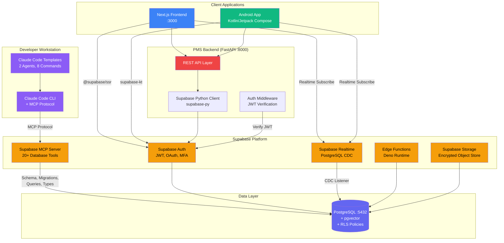

# Product Requirements Document: Supabase + Claude Code Integration into Patient Management System (PMS)

**Document ID:** PRD-PMS-SUPABASECLAUDECODE-001
**Version:** 1.0
**Date:** 2026-03-09
**Author:** Ammar (CEO, MPS Inc.)
**Status:** Draft

---

## 1. Executive Summary

Supabase is an open-source Backend-as-a-Service (BaaS) platform built on PostgreSQL, providing authentication, real-time subscriptions, edge functions, object storage, and vector search in a single managed platform. With a $5B valuation, 4M+ developers, and $70M ARR, Supabase has matured into an enterprise-grade backend that directly competes with Firebase while retaining full SQL compatibility, open-source self-hosting options, and — critically for PMS — HIPAA compliance with a signed Business Associate Agreement (BAA).

Claude Code is Anthropic's official CLI for AI-assisted software engineering. Through the Model Context Protocol (MCP), Claude Code can directly connect to Supabase to manage projects, design database schemas, query data, generate migrations, and run SQL — all from natural language prompts. The Supabase MCP server exposes 20+ tools for database design, data querying, and project management, while Claude Code Templates provides 2 specialized agents (Schema Architect and Migration Assistant) and 8 database commands (schema sync, migration assistant, performance optimizer, security audit, backup manager, type generator, data explorer, and realtime monitor).

Integrating Supabase + Claude Code into PMS creates an **AI-accelerated backend development workflow** where developers can design patient data schemas, generate type-safe migrations, audit Row Level Security (RLS) policies for HIPAA compliance, and monitor real-time clinical data subscriptions — all through conversational AI. This complements existing PMS infrastructure (FastAPI :8000, Next.js :3000, PostgreSQL :5432) by adding managed authentication, real-time subscriptions, edge functions for lightweight API endpoints, and AI-driven database management without replacing the core FastAPI backend.

## 2. Problem Statement

PMS currently relies on a manually managed PostgreSQL database with Alembic migrations, hand-written authentication logic, and no real-time data capabilities. Specific gaps:

1. **Manual schema management**: Database migrations are hand-written Alembic scripts. Schema changes require developer expertise in SQL DDL, and there's no automated validation that RLS policies correctly protect PHI across all tables. A single misconfigured policy can expose patient data.

2. **No real-time clinical data**: Clinicians viewing patient dashboards see stale data until page refresh. When a lab result arrives, a prescription is updated, or a care team member adds a note, other viewers don't see the change until they manually reload. This creates coordination gaps in multi-provider care.

3. **Authentication complexity**: PMS implements custom JWT authentication in FastAPI. Every new client (web, Android, future iOS) requires bespoke auth integration. Password reset flows, MFA, OAuth provider connections, and session management are all custom code that must be maintained and audited.

4. **Slow database iteration cycles**: Adding a new table, generating TypeScript types for the frontend, creating RLS policies, and writing API endpoints requires touching 4-5 files across 3 repositories. A developer spends 30-60 minutes per table on boilerplate that could be automated.

5. **No AI-assisted database operations**: Performance optimization, security auditing, and schema exploration require manual DBA expertise. There's no tooling to automatically suggest indexes, detect N+1 query patterns, or validate that all PHI columns have appropriate encryption and access controls.

## 3. Proposed Solution

### 3.1 Architecture Overview

### 3.2 Deployment Model

**Hybrid Model: Supabase Cloud + Self-Hosted Options**

- **Development/Staging**: Supabase Cloud with HIPAA add-on enabled, BAA signed. All PHI is stored in HIPAA-compliant Supabase projects with continuous compliance monitoring.
- **Production**: Supabase Cloud Enterprise tier with dedicated infrastructure, or self-hosted via Docker for maximum control over PHI data residency.
- **Claude Code MCP**: Developer workstation only — Claude Code connects to development Supabase projects via MCP. Production databases are never exposed to MCP to prevent accidental data modification.
- **Security Envelope**: All Supabase connections use TLS 1.3. RLS policies enforce row-level access control at the database layer. Supabase Auth issues JWTs that FastAPI middleware validates. Audit logging tracks all schema changes and data access.

## 4. PMS Data Sources

| PMS API | Supabase Integration | Purpose |
|---------|---------------------|---------|
| Patient Records API (`/api/patients`) | RLS-protected `patients` table with real-time subscriptions | Live patient data sync across clients; Supabase Auth enforces provider-level access |
| Encounter Records API (`/api/encounters`) | Real-time CDC on `encounters` table; Edge Function for encounter completion triggers | Multi-provider real-time encounter updates; trigger CrewAI workflows on encounter close |
| Medication & Prescription API (`/api/prescriptions`) | RLS policies with pharmacist/provider role separation; real-time alerts | Prescription change notifications to care team; role-based medication access |
| Reporting API (`/api/reports`) | Supabase Edge Functions for scheduled report generation; Storage for PDF exports | Lightweight serverless report generation; encrypted storage for PHI-containing reports |

## 5. Component/Module Definitions

### 5.1 Supabase Auth Integration Module

- **Description**: Replace custom JWT authentication with Supabase Auth across all PMS clients
- **Input**: User credentials (email/password, OAuth tokens, MFA codes)
- **Output**: Supabase JWT tokens validated by FastAPI middleware
- **PMS APIs**: All endpoints — auth middleware wraps every API call

### 5.2 Real-Time Clinical Data Module

- **Description**: PostgreSQL Change Data Capture (CDC) via Supabase Realtime for live clinical data updates
- **Input**: Database changes on `patients`, `encounters`, `prescriptions`, `vitals` tables
- **Output**: WebSocket events pushed to subscribed Next.js and Android clients
- **PMS APIs**: `/api/encounters`, `/api/prescriptions`, `/api/patients`

### 5.3 Claude Code Database Management Module

- **Description**: MCP-powered database operations via Claude Code CLI — schema design, migration generation, security auditing, performance optimization
- **Input**: Natural language developer prompts (e.g., "Add a prior_auth_status column to prescriptions with RLS for provider-only access")
- **Output**: SQL migrations, TypeScript types, RLS policies, performance recommendations
- **PMS APIs**: Indirect — generates code that powers all APIs

### 5.4 Edge Functions Module

- **Description**: Deno-based serverless functions for lightweight API endpoints, webhooks, and scheduled tasks
- **Input**: HTTP requests, cron triggers, database webhook events
- **Output**: API responses, triggered workflows, notification dispatches
- **PMS APIs**: `/api/reports` (scheduled generation), encounter completion webhooks

### 5.5 Encrypted Storage Module

- **Description**: Supabase Storage with server-side encryption for clinical documents, dermoscopic images, and report PDFs
- **Input**: File uploads from Next.js and Android clients
- **Output**: Signed URLs with expiry, encrypted-at-rest storage
- **PMS APIs**: `/api/patients` (documents), ISIC CDS (dermoscopic images)

## 6. Non-Functional Requirements

### 6.1 Security and HIPAA Compliance

| Requirement | Implementation |
|------------|---------------|
| BAA | Signed Supabase BAA covering database, auth, storage, and edge functions |
| Encryption at rest | AES-256 for all PostgreSQL data and Supabase Storage objects |
| Encryption in transit | TLS 1.3 for all connections (client ↔ Supabase, Supabase ↔ PostgreSQL) |
| Access control | Row Level Security (RLS) policies on all PHI tables; Supabase Auth roles map to PMS roles (provider, nurse, admin, patient) |
| Audit logging | Supabase audit log for all auth events; custom `audit_log` table for data access with `pg_audit` extension |
| PHI isolation | HIPAA add-on enables dedicated compliance monitoring; non-compliant settings trigger automatic alerts |
| MCP security | Claude Code MCP connects to development projects only; production access requires explicit admin approval |
| MFA | Supabase Auth MFA (TOTP) enabled for all clinician accounts |

### 6.2 Performance

| Metric | Target |
|--------|--------|
| Auth token issuance | < 200ms |
| Real-time event delivery | < 100ms from database change to client notification |
| Edge Function cold start | < 50ms (Deno runtime) |
| MCP schema operation | < 5s for migration generation |
| RLS policy evaluation | < 2ms overhead per query |
| PostgREST API throughput | 20% improvement over custom REST (PostgREST v14) |

### 6.3 Infrastructure

| Component | Requirement |
|-----------|------------|
| Supabase Cloud | Enterprise tier with HIPAA add-on |
| PostgreSQL | Version 15+ with pgvector, pg_audit extensions |
| Edge Functions | Deno 1.40+ runtime |
| Claude Code | Latest CLI with MCP support |
| Supabase MCP Server | `@supabase/mcp-server-supabase` via npx |
| Docker (self-hosted option) | Supabase self-hosting stack (20+ containers) |

## 7. Implementation Phases

### Phase 1: Foundation (Sprints 1-2, 4 weeks)

- Sign Supabase BAA and enable HIPAA add-on on development project
- Install Supabase MCP server in Claude Code for all developers
- Configure Claude Code Templates agents and commands
- Migrate existing PostgreSQL schema to Supabase-managed project
- Implement RLS policies on all PHI tables using Claude Code MCP
- Generate TypeScript types with `supabase-type-generator` command

### Phase 2: Auth & Real-Time Integration (Sprints 3-4, 4 weeks)

- Replace custom JWT auth with Supabase Auth in FastAPI backend
- Integrate `@supabase/ssr` in Next.js frontend for server-side auth
- Add `supabase-kt` to Android app for auth and real-time
- Implement real-time subscriptions on `encounters` and `prescriptions` tables
- Deploy Edge Functions for encounter completion webhooks
- Set up continuous compliance monitoring with HIPAA project settings

### Phase 3: Advanced Features & Optimization (Sprints 5-6, 4 weeks)

- Implement Supabase Storage for clinical documents with encryption
- Build scheduled Edge Functions for automated report generation
- Configure Claude Code `supabase-performance-optimizer` for query analysis
- Run `supabase-security-audit` across all RLS policies
- Implement real-time monitoring dashboard with `supabase-realtime-monitor`
- Performance benchmarking: PostgREST vs custom FastAPI endpoints

## 8. Success Metrics

| Metric | Target | Measurement Method |
|--------|--------|--------------------|
| Schema change cycle time | 70% reduction (from 60min to 18min per table) | Git commit timestamps for migration PRs |
| Authentication incidents | Zero custom auth vulnerabilities | Security audit log review (quarterly) |
| Real-time data freshness | < 100ms client notification latency | Supabase Realtime dashboard metrics |
| RLS policy coverage | 100% of PHI tables protected | `supabase-security-audit` command output |
| Developer satisfaction | 80%+ rate Claude Code + Supabase as "significant improvement" | Quarterly developer survey |
| HIPAA compliance score | 100% on continuous monitoring | Supabase HIPAA dashboard alerts |
| Edge Function uptime | 99.9% | Supabase monitoring dashboard |

## 9. Risks and Mitigations

| Risk | Impact | Mitigation |
|------|--------|------------|
| Supabase Cloud outage affects PMS availability | High — auth and real-time fail | FastAPI maintains fallback JWT validation; graceful degradation to polling for real-time |
| MCP accidentally modifies production data | Critical — PHI corruption | MCP restricted to dev projects; production requires manual migration review |
| HIPAA add-on cost exceeds budget | Medium — $350+/month additional cost | Start with development project; evaluate self-hosted option for production |
| Vendor lock-in to Supabase platform | Medium — migration effort if Supabase pivots | Use standard PostgreSQL features; Supabase is open-source and self-hostable |
| RLS policy complexity grows unmanageable | Medium — security gaps from misconfigured policies | Regular `supabase-security-audit` runs; RLS policy templates for common patterns |
| Real-time subscriptions overwhelm client | Low — UI rendering bottleneck | Debounce subscriptions; server-side filtering with RLS |

## 10. Dependencies

| Dependency | Version | Purpose |
|-----------|---------|---------|
| Supabase Cloud | Enterprise + HIPAA add-on | Managed backend platform |
| `supabase-py` | >= 2.0 | Python client for FastAPI backend |
| `@supabase/supabase-js` | >= 2.45 | JavaScript client for Next.js |
| `@supabase/ssr` | >= 0.5 | Server-side auth for Next.js App Router |
| `supabase-kt` | >= 3.0 | Kotlin client for Android app |
| `@supabase/mcp-server-supabase` | latest | MCP server for Claude Code |
| `claude-code-templates` | latest | Agents and commands for Supabase |
| Claude Code CLI | latest | AI development tool |
| PostgREST | v14+ | Auto-generated REST API from PostgreSQL |
| Deno | 1.40+ | Edge Functions runtime |

## 11. Comparison with Existing Experiments

| Aspect | Exp 55: CrewAI | Exp 58: Supabase + Claude Code |
|--------|----------------|-------------------------------|
| **Focus** | Multi-agent AI workflow orchestration | Backend infrastructure + AI-assisted development |
| **AI role** | Runtime agent execution (LLM inference for clinical tasks) | Development-time AI (schema design, migration, auditing) |
| **Database interaction** | Reads/writes via PMS API tools | Direct database management via MCP |
| **Authentication** | Uses existing PMS auth | Replaces/upgrades PMS auth with Supabase Auth |
| **Real-time** | Not addressed | Core feature — real-time subscriptions via CDC |
| **Complementary?** | Yes — CrewAI agents can be triggered by Supabase Edge Functions; Supabase real-time events can initiate CrewAI workflows | Yes — Supabase provides the data layer that CrewAI agents operate on |

Supabase + Claude Code is an **infrastructure-layer** experiment that enhances the data platform all other experiments run on. CrewAI (Exp 55) is an **application-layer** experiment that orchestrates AI agents. Together, they enable a workflow where Supabase real-time detects an encounter completion → Edge Function triggers → CrewAI Encounter Documentation Crew executes → results written back to Supabase-managed PostgreSQL with RLS enforcement.

## 12. Research Sources

### Official Documentation
- [Supabase Architecture](https://supabase.com/docs/guides/getting-started/architecture) — Core platform architecture and component overview
- [Supabase MCP Documentation](https://supabase.com/docs/guides/getting-started/mcp) — Official MCP server setup and usage guide
- [HIPAA Compliance and Supabase](https://supabase.com/docs/guides/security/hipaa-compliance) — HIPAA requirements, BAA process, and compliance controls
- [Supabase HIPAA Projects](https://supabase.com/docs/guides/platform/hipaa-projects) — Configuring high-compliance projects

### Claude Code Integration
- [Claude Code + Supabase Complete Guide (Daniel Avila)](https://medium.com/@dan.avila7/claude-code-supabase-integration-complete-guide-with-agents-commands-and-mcp-427613d9051e) — Agents, commands, and MCP setup walkthrough
- [Supabase MCP Server Blog](https://supabase.com/blog/mcp-server) — Official MCP server announcement and capabilities
- [Supabase MCP GitHub](https://github.com/supabase-community/supabase-mcp) — Open-source MCP server repository

### Architecture & Ecosystem
- [Supabase $5B Valuation Analysis](https://articles.uvnetware.com/software-engineering/supabase-backend-platform-architecture/) — Platform architecture deep-dive with scale metrics
- [Supabase MVP Architecture in 2026](https://www.valtorian.com/blog/supabase-mvp-architecture) — Practical architecture patterns
- [Supabase Pricing](https://supabase.com/pricing) — Plan tiers and HIPAA add-on pricing

### Integration Patterns
- [Next.js + FastAPI + Supabase Auth (Ojas Kapre)](https://medium.com/@ojasskapre/implementing-supabase-authentication-with-next-js-and-fastapi-5656881f449b) — Auth implementation across the full stack
- [Appwrite vs Supabase vs Firebase 2026](https://uibakery.io/blog/appwrite-vs-supabase-vs-firebase) — BaaS platform comparison

## 13. Appendix: Related Documents

- [Supabase + Claude Code Setup Guide](58-SupabaseClaudeCode-PMS-Developer-Setup-Guide.md)
- [Supabase + Claude Code Developer Tutorial](58-SupabaseClaudeCode-Developer-Tutorial.md)
- [Supabase Official Docs](https://supabase.com/docs)
- [Supabase MCP Server](https://github.com/supabase-community/supabase-mcp)
- [Claude Code Documentation](https://docs.anthropic.com/en/docs/claude-code)
- [Exp 55: CrewAI PMS Integration](55-PRD-CrewAI-PMS-Integration.md) — Complementary multi-agent orchestration layer
