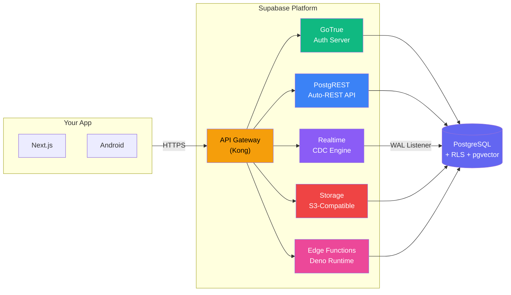
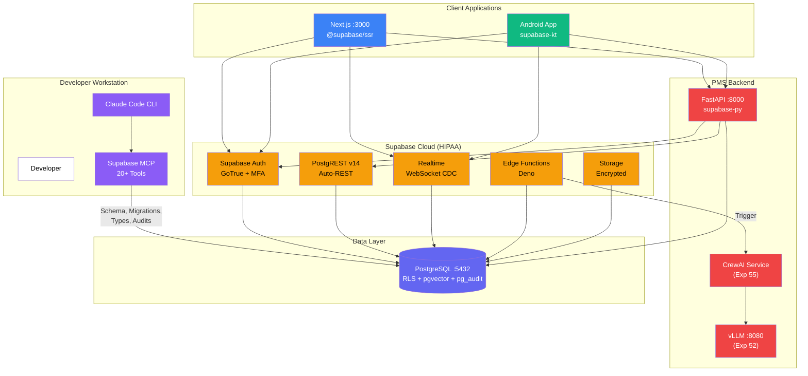

# Supabase + Claude Code Developer Onboarding Tutorial

**Welcome to the MPS PMS Supabase + Claude Code Integration Team**

This tutorial will take you from zero to building your first Supabase integration with the PMS, powered by Claude Code's MCP for AI-assisted database development. By the end, you will understand how Supabase works, have a running local environment, and have built and tested a real-time clinical data feature end-to-end.

**Document ID:** PMS-EXP-SUPABASECLAUDECODE-002
**Version:** 1.0
**Date:** 2026-03-09
**Applies To:** PMS project (all platforms)
**Prerequisite:** [Supabase + Claude Code Setup Guide](58-SupabaseClaudeCode-PMS-Developer-Setup-Guide.md)
**Estimated time:** 2-3 hours
**Difficulty:** Beginner-friendly

---

## What You Will Learn

1. What Supabase is and why it matters for healthcare backend development
2. How Supabase's architecture maps to PMS components (auth, database, real-time, storage)
3. How Claude Code MCP enables AI-assisted database management
4. How to create and manage database tables using Claude Code natural language prompts
5. How to write and test Row Level Security (RLS) policies for HIPAA compliance
6. How to implement real-time subscriptions for live clinical data updates
7. How to build a complete patient encounter flow with auth, RLS, and real-time
8. How to use Claude Code commands for security auditing and performance optimization
9. When to use Supabase vs custom FastAPI endpoints
10. HIPAA compliance considerations for Supabase in healthcare

---

## Part 1: Understanding Supabase + Claude Code (15 min read)

### 1.1 What Problem Does This Solve?

Today, a PMS developer adding a new clinical data table must:

1. Write a SQL migration by hand (Alembic)
2. Create a SQLAlchemy model
3. Write FastAPI CRUD endpoints
4. Add authentication checks
5. Generate TypeScript types manually
6. Write API client code for frontend and Android

This takes 30-60 minutes per table and is error-prone — especially for RLS policies that protect PHI.

**With Supabase + Claude Code**, that same developer:

1. Tells Claude Code: *"Add a vitals table with blood_pressure, heart_rate, temperature columns. Only the recording provider should see vitals. Enable real-time."*
2. Claude Code generates the migration, RLS policies, and TypeScript types
3. The developer reviews and applies — done in 5 minutes

The database gets an auto-generated REST API (PostgREST), real-time subscriptions come free, and auth is handled by Supabase's battle-tested auth system.

### 1.2 How Supabase Works — The Key Pieces



**Three core concepts to understand:**

1. **PostgreSQL is the center of everything.** Unlike Firebase (NoSQL), Supabase uses PostgreSQL — the same database PMS already uses. Tables, joins, indexes, constraints, and extensions (pgvector, pg_audit) all work. Supabase just adds managed services around it.

2. **Row Level Security (RLS) is your HIPAA firewall.** RLS policies are SQL rules that run on every query, filtering rows based on who's asking. A provider only sees their own patients. A nurse only sees patients on their floor. This is enforced at the database level — no API code can bypass it.

3. **Real-time is built on PostgreSQL WAL.** Supabase listens to the PostgreSQL Write-Ahead Log (WAL) and pushes changes to subscribed clients via WebSockets. No polling, no custom pub/sub infrastructure.

### 1.3 How Supabase Fits with Other PMS Technologies

| Technology | Exp # | Relationship to Supabase |
|-----------|-------|-------------------------|
| CrewAI | 55 | Supabase Edge Functions can trigger CrewAI agent workflows; agents write results back to Supabase-managed tables |
| vLLM | 52 | vLLM serves AI models; Supabase stores the structured data those models produce (SOAP notes, ICD-10 codes) |
| Llama 4 / Mistral 3 | 53/54 | LLM alternatives served via vLLM; Supabase is model-agnostic — stores outputs regardless of which LLM generated them |
| Amazon Connect Health | 51 | Voice/telehealth platform; Supabase can receive call transcripts and store them with RLS-protected patient context |
| LangGraph | 26 | Graph-based AI workflows; Supabase provides the persistent state store for agent memory and checkpoints |
| pgvector (ADR-0011) | — | Already used in PMS; Supabase natively supports pgvector for ISIC CDS similarity search |

### 1.4 Key Vocabulary

| Term | Meaning |
|------|---------|
| **PostgREST** | Open-source tool that auto-generates a REST API from PostgreSQL schema — no endpoint code needed |
| **RLS (Row Level Security)** | PostgreSQL feature that filters rows per-user based on SQL policies; Supabase's primary access control |
| **GoTrue** | Supabase's auth server (Go-based); handles signup, login, OAuth, MFA, and JWT issuance |
| **Realtime** | Supabase service that streams database changes (INSERT/UPDATE/DELETE) to clients via WebSockets |
| **Edge Functions** | Serverless Deno functions deployed to Supabase's edge network; used for webhooks, triggers, and custom logic |
| **MCP (Model Context Protocol)** | Anthropic standard that lets Claude Code communicate with external tools like the Supabase MCP server |
| **BAA (Business Associate Agreement)** | Legal contract required by HIPAA when a vendor handles PHI on your behalf |
| **CDC (Change Data Capture)** | Technique of capturing database row changes from the WAL for real-time streaming |
| **Service Role Key** | A Supabase key that bypasses RLS — used only in backend code, never exposed to clients |
| **Anon Key** | A public Supabase key that respects RLS — safe to use in frontend/mobile apps |
| **Publication** | PostgreSQL mechanism that defines which tables emit change events to the Realtime service |
| **supabase-py** | Official Python client for Supabase — used in the FastAPI backend |

### 1.5 Our Architecture



---

## Part 2: Environment Verification (15 min)

### 2.1 Checklist

Run each command and verify the expected output:

1. **Supabase CLI installed**:
   ```bash
   supabase --version
   # Expected: 1.200.x or higher
   ```

2. **Local Supabase running**:
   ```bash
   supabase status
   # Expected: All services show "running"
   ```

3. **Claude Code MCP connected**:
   ```bash
   claude mcp list
   # Expected: "supabase" listed with status "connected"
   ```

4. **PMS backend running**:
   ```bash
   curl http://localhost:8000/health
   # Expected: {"status": "healthy"}
   ```

5. **PMS frontend running**:
   ```bash
   curl -s -o /dev/null -w "%{http_code}" http://localhost:3000
   # Expected: 200
   ```

6. **Database accessible**:
   ```bash
   curl http://localhost:54321/rest/v1/ \
     -H "apikey: $(supabase status | grep 'anon key' | awk '{print $NF}')"
   # Expected: 200 with schema information
   ```

### 2.2 Quick Test

Create a test record via PostgREST to confirm the full stack works:

```bash
# Sign up a test user
TOKEN=$(curl -s -X POST http://localhost:54321/auth/v1/signup \
  -H "Content-Type: application/json" \
  -H "apikey: $SUPABASE_ANON_KEY" \
  -d '{"email":"dev@mps.dev","password":"DevPassword123!"}' \
  | jq -r '.access_token')

echo "Token: $TOKEN"
# Expected: A JWT string (eyJ...)

# Query patients (should be empty for new user)
curl http://localhost:54321/rest/v1/patients \
  -H "apikey: $SUPABASE_ANON_KEY" \
  -H "Authorization: Bearer $TOKEN"
# Expected: []
```

If both return expected results, your environment is ready.

---

## Part 3: Build Your First Integration (45 min)

### 3.1 What We Are Building

We'll build a **Real-Time Vitals Monitor**: a new `vitals` table that tracks patient vital signs, protected by RLS, with real-time subscriptions that push updates to a Next.js dashboard component. We'll use Claude Code MCP to create the schema and Claude Code commands to audit the security.

### 3.2 Step 1: Create the Vitals Table with Claude Code

Open Claude Code and use natural language:

```
Open Claude Code:
$ claude

Prompt: "Create a new Supabase migration for a 'vitals' table with these columns:
- id (UUID, primary key)
- patient_id (UUID, references patients)
- provider_id (UUID, references auth.users)
- blood_pressure_systolic (INTEGER)
- blood_pressure_diastolic (INTEGER)
- heart_rate (INTEGER)
- temperature_f (DECIMAL 4,1)
- oxygen_saturation (INTEGER)
- recorded_at (TIMESTAMPTZ, default now)
- created_at (TIMESTAMPTZ, default now)

Add RLS policies so only the recording provider can read and write vitals.
Enable realtime on this table."
```

Claude Code will generate a migration file. Review it:

```sql
-- Expected output (supabase/migrations/YYYYMMDDHHMMSS_create_vitals.sql)
CREATE TABLE vitals (
    id UUID PRIMARY KEY DEFAULT gen_random_uuid(),
    patient_id UUID REFERENCES patients(id) NOT NULL,
    provider_id UUID REFERENCES auth.users(id) NOT NULL,
    blood_pressure_systolic INTEGER,
    blood_pressure_diastolic INTEGER,
    heart_rate INTEGER,
    temperature_f DECIMAL(4,1),
    oxygen_saturation INTEGER,
    recorded_at TIMESTAMPTZ DEFAULT now(),
    created_at TIMESTAMPTZ DEFAULT now()
);

ALTER TABLE vitals ENABLE ROW LEVEL SECURITY;

CREATE POLICY "Providers can read their own vitals recordings"
    ON vitals FOR SELECT
    USING (auth.uid() = provider_id);

CREATE POLICY "Providers can insert vitals"
    ON vitals FOR INSERT
    WITH CHECK (auth.uid() = provider_id);

CREATE POLICY "Providers can update their own vitals"
    ON vitals FOR UPDATE
    USING (auth.uid() = provider_id);

ALTER PUBLICATION supabase_realtime ADD TABLE vitals;
```

Apply the migration:

```bash
supabase db push
```

### 3.3 Step 2: Generate TypeScript Types

In Claude Code:

```
Prompt: "Generate TypeScript types for my updated Supabase schema"
```

Or run:

```bash
supabase gen types typescript --local > lib/database.types.ts
```

The generated types will include:

```typescript
// lib/database.types.ts (excerpt)
export interface Database {
  public: {
    Tables: {
      vitals: {
        Row: {
          id: string;
          patient_id: string;
          provider_id: string;
          blood_pressure_systolic: number | null;
          blood_pressure_diastolic: number | null;
          heart_rate: number | null;
          temperature_f: number | null;
          oxygen_saturation: number | null;
          recorded_at: string;
          created_at: string;
        };
        Insert: {
          // ... insert types
        };
        Update: {
          // ... update types
        };
      };
      // ... other tables
    };
  };
}
```

### 3.4 Step 3: Build the FastAPI Endpoint

```python
# app/api/vitals.py
from fastapi import APIRouter, Depends
from pydantic import BaseModel
from app.middleware.supabase_auth import verify_supabase_token, security
from app.core.supabase_client import get_supabase_client

router = APIRouter(prefix="/api/vitals", tags=["vitals"])

class VitalsCreate(BaseModel):
    patient_id: str
    blood_pressure_systolic: int | None = None
    blood_pressure_diastolic: int | None = None
    heart_rate: int | None = None
    temperature_f: float | None = None
    oxygen_saturation: int | None = None

@router.post("/")
async def record_vitals(
    vitals: VitalsCreate,
    user: dict = Depends(verify_supabase_token),
):
    """Record patient vitals. RLS ensures only the provider's records are accessible."""
    supabase = get_supabase_client()
    result = supabase.table("vitals").insert({
        "patient_id": vitals.patient_id,
        "provider_id": user["sub"],
        "blood_pressure_systolic": vitals.blood_pressure_systolic,
        "blood_pressure_diastolic": vitals.blood_pressure_diastolic,
        "heart_rate": vitals.heart_rate,
        "temperature_f": vitals.temperature_f,
        "oxygen_saturation": vitals.oxygen_saturation,
    }).execute()
    return result.data[0]

@router.get("/{patient_id}")
async def get_patient_vitals(
    patient_id: str,
    user: dict = Depends(verify_supabase_token),
):
    """Get vitals for a patient. RLS filters to provider's own recordings."""
    supabase = get_supabase_client()
    result = supabase.table("vitals").select("*").eq(
        "patient_id", patient_id
    ).order("recorded_at", desc=True).execute()
    return result.data
```

### 3.5 Step 4: Build the Real-Time Vitals Dashboard Component

```typescript
// components/VitalsMonitor.tsx
"use client";

import { useEffect, useState } from "react";
import { createClient } from "@/lib/supabase/client";
import type { Database } from "@/lib/database.types";

type Vitals = Database["public"]["Tables"]["vitals"]["Row"];

export function VitalsMonitor({ patientId }: { patientId: string }) {
  const [vitals, setVitals] = useState<Vitals[]>([]);
  const [latestAlert, setLatestAlert] = useState<string | null>(null);
  const supabase = createClient();

  useEffect(() => {
    // Fetch existing vitals
    supabase
      .from("vitals")
      .select("*")
      .eq("patient_id", patientId)
      .order("recorded_at", { ascending: false })
      .limit(20)
      .then(({ data }) => data && setVitals(data));

    // Subscribe to real-time vitals updates
    const channel = supabase
      .channel(`vitals:${patientId}`)
      .on(
        "postgres_changes",
        {
          event: "INSERT",
          schema: "public",
          table: "vitals",
          filter: `patient_id=eq.${patientId}`,
        },
        (payload) => {
          const newVitals = payload.new as Vitals;
          setVitals((prev) => [newVitals, ...prev].slice(0, 20));

          // Alert on abnormal values
          if (
            newVitals.heart_rate &&
            (newVitals.heart_rate > 100 || newVitals.heart_rate < 60)
          ) {
            setLatestAlert(
              `Abnormal heart rate: ${newVitals.heart_rate} bpm`
            );
          }
          if (
            newVitals.oxygen_saturation &&
            newVitals.oxygen_saturation < 95
          ) {
            setLatestAlert(
              `Low O2 saturation: ${newVitals.oxygen_saturation}%`
            );
          }
        }
      )
      .subscribe();

    return () => {
      supabase.removeChannel(channel);
    };
  }, [patientId]);

  return (
    <div className="space-y-4">
      <h2 className="text-xl font-bold">Vitals Monitor (Real-Time)</h2>

      {latestAlert && (
        <div className="bg-red-100 border border-red-400 text-red-700 px-4 py-3 rounded">
          {latestAlert}
        </div>
      )}

      <table className="w-full border-collapse">
        <thead>
          <tr className="bg-gray-100">
            <th className="p-2 text-left">Time</th>
            <th className="p-2 text-left">BP</th>
            <th className="p-2 text-left">HR</th>
            <th className="p-2 text-left">Temp</th>
            <th className="p-2 text-left">SpO2</th>
          </tr>
        </thead>
        <tbody>
          {vitals.map((v) => (
            <tr key={v.id} className="border-b">
              <td className="p-2">
                {new Date(v.recorded_at).toLocaleTimeString()}
              </td>
              <td className="p-2">
                {v.blood_pressure_systolic}/{v.blood_pressure_diastolic}
              </td>
              <td className="p-2">{v.heart_rate} bpm</td>
              <td className="p-2">{v.temperature_f}°F</td>
              <td className="p-2">{v.oxygen_saturation}%</td>
            </tr>
          ))}
        </tbody>
      </table>
    </div>
  );
}
```

### 3.6 Step 5: Audit Security with Claude Code

Run the security audit command:

```
In Claude Code:
Prompt: "Run a security audit on my Supabase database. Check that all tables with patient data have RLS enabled and that no PHI columns are accessible without authentication."
```

Or use the command:

```
/supabase-security-audit
```

Expected output: A report showing RLS status for each table, any policy gaps, and recommendations for strengthening PHI protection.

### 3.7 Step 6: Test the Complete Flow

```bash
# 1. Sign in as a provider
TOKEN=$(curl -s -X POST http://localhost:54321/auth/v1/token?grant_type=password \
  -H "Content-Type: application/json" \
  -H "apikey: $SUPABASE_ANON_KEY" \
  -d '{"email":"provider@mps.dev","password":"ProviderPass123!"}' \
  | jq -r '.access_token')

# 2. Record vitals via FastAPI
curl -X POST http://localhost:8000/api/vitals/ \
  -H "Content-Type: application/json" \
  -H "Authorization: Bearer $TOKEN" \
  -d '{
    "patient_id": "<patient-uuid>",
    "blood_pressure_systolic": 120,
    "blood_pressure_diastolic": 80,
    "heart_rate": 72,
    "temperature_f": 98.6,
    "oxygen_saturation": 98
  }'
# Expected: 200 with the created vitals record

# 3. The Next.js VitalsMonitor component should show the new record
# in real-time without page refresh!
```

---

## Part 4: Evaluating Strengths and Weaknesses (15 min)

### 4.1 Strengths

- **Massive developer velocity**: PostgREST auto-generates REST APIs from your schema. Adding a table immediately creates CRUD endpoints — no FastAPI route code needed for simple operations.
- **RLS is a security superpower**: Access control at the database layer means even a misconfigured API endpoint can't leak data. RLS policies are SQL — auditable, testable, and enforced universally.
- **Real-time for free**: Any table added to the realtime publication automatically streams changes to subscribers. No WebSocket server to build, no pub/sub infrastructure to manage.
- **Claude Code MCP transforms DBA workflow**: Natural language schema design, migration generation, security auditing, and performance optimization. A developer who isn't a DBA can still write correct, secure database code.
- **HIPAA-ready out of the box**: Signed BAA, continuous compliance monitoring, AES-256 encryption, audit logging. No custom compliance infrastructure needed.
- **PostgreSQL at the core**: No vendor lock-in to a proprietary database. Every migration is standard SQL. You can self-host or migrate to bare PostgreSQL at any time.
- **Ecosystem**: Official clients for JavaScript, Python, Kotlin, Swift, Flutter, and Dart. Full Next.js App Router support with `@supabase/ssr`.

### 4.2 Weaknesses

- **Cost for HIPAA compliance**: The HIPAA add-on requires Team ($599/mo) or Enterprise pricing, plus the add-on fee ($350+/mo). This is significant for early-stage startups.
- **Edge Function limitations**: Deno-based edge functions don't support all npm packages. Python-based workflows (like CrewAI) can't run directly in Edge Functions — they must trigger external services.
- **RLS complexity at scale**: As the number of roles and tables grows, RLS policies become complex to reason about. A missing policy is a security hole; an overly restrictive policy blocks legitimate access.
- **Realtime connection limits**: Each Supabase project has a maximum number of concurrent realtime connections (varies by plan). High-traffic clinical environments may hit limits.
- **Self-hosting complexity**: Self-hosted Supabase involves 20+ Docker containers. Operational burden is significant compared to cloud-managed.
- **MCP is development-only**: The Claude Code MCP connection should never touch production databases. There's no automated guardrail — discipline is required.

### 4.3 When to Use Supabase vs Custom FastAPI Endpoints

| Use Supabase (PostgREST) | Use Custom FastAPI |
|--------------------------|-------------------|
| Simple CRUD operations on single tables | Complex business logic (e.g., multi-step encounter workflows) |
| Real-time subscriptions needed | Heavy computation or AI inference |
| Client-side auth + RLS sufficient | Custom auth flows or external IdP integration |
| Rapid prototyping | Operations requiring transactions across multiple services |
| Direct database access from frontend | Aggregation, reporting, or analytics queries |
| File uploads/downloads | Integration with external APIs (labs, pharmacies) |

**Rule of thumb**: Use Supabase for the 80% of CRUD operations that don't need custom logic. Use FastAPI for the 20% that do.

### 4.4 HIPAA / Healthcare Considerations

| Requirement | Supabase Status | PMS Action Needed |
|-------------|----------------|-------------------|
| BAA | Available on Team/Enterprise | Sign BAA before storing PHI |
| Encryption at rest | AES-256 default | Verify HIPAA add-on is enabled |
| Encryption in transit | TLS 1.3 | No action — enforced by default |
| Access control | RLS + Auth | Write and audit RLS policies for all PHI tables |
| Audit logging | pg_audit extension | Enable and configure audit log retention |
| Data residency | US/EU regions available | Select appropriate region for compliance |
| Breach notification | Supabase shared responsibility | Configure alerting in Supabase dashboard |
| Backup & recovery | Point-in-time recovery on HIPAA plans | Test recovery procedure quarterly |
| MFA | Supabase Auth supports TOTP | Enforce MFA for all clinician accounts |

---

## Part 5: Debugging Common Issues (15 min read)

### Issue 1: "Permission denied for table X"

**Symptom**: PostgREST returns `42501` error
**Cause**: RLS is enabled but no policy grants access for the current user's role
**Fix**: Check policies with `SELECT * FROM pg_policies WHERE tablename = 'X';` — add a policy matching the user's JWT claims

### Issue 2: Real-time events arrive for wrong patient

**Symptom**: A provider sees vitals updates for patients they shouldn't see
**Cause**: Missing `filter` parameter in the `.on('postgres_changes')` subscription
**Fix**: Always include a `filter` clause: `filter: \`patient_id=eq.${patientId}\`` and verify RLS policies cover SELECT operations

### Issue 3: "JWT expired" errors after 1 hour

**Symptom**: API calls start failing with 401 after extended use
**Cause**: Supabase JWTs expire after 1 hour by default
**Fix**: Use `supabase.auth.onAuthStateChange()` to auto-refresh tokens. In Next.js, the `@supabase/ssr` middleware handles this automatically.

### Issue 4: Claude Code MCP shows "no projects found"

**Symptom**: MCP tools return empty results
**Cause**: Authentication session expired or wrong Supabase account
**Fix**: Run `claude mcp remove supabase && claude mcp add supabase -- npx -y @supabase/mcp-server-supabase` to re-authenticate

### Issue 5: Migration conflicts between developers

**Symptom**: `supabase db push` fails with "migration already applied"
**Cause**: Two developers created migrations with overlapping timestamps
**Fix**: Use `supabase migration repair` to fix the migration history. Coordinate via the `/supabase-schema-sync` Claude Code command.

### Issue 6: Service role key accidentally used in frontend

**Symptom**: RLS policies seem to not work — all data is visible
**Cause**: The service role key bypasses RLS. If it's in a `NEXT_PUBLIC_` environment variable, it's exposed to the browser.
**Fix**: Only use the `anon` key in frontend code. The service role key belongs exclusively in the FastAPI backend's `.env` (not `.env.local`).

---

## Part 6: Practice Exercises (45 min)

### Option A: Prescription Alert System

Build a real-time prescription monitoring feature:

1. Add a `prescription_alerts` table with columns for alert type, severity, and message
2. Write RLS policies that let pharmacists see all alerts, but providers see only their patients' alerts
3. Create a Next.js component that subscribes to new alerts and shows a toast notification
4. Use an Edge Function to automatically create an alert when a prescription's `prior_auth_status` changes to `denied`

**Hints**: Use `auth.jwt() ->> 'role'` in RLS policies to differentiate pharmacists from providers. Edge Functions can be triggered by database webhooks.

### Option B: Clinical Document Vault

Build a secure document storage feature:

1. Create a Supabase Storage bucket named `clinical-docs` with the policy that only the uploading provider and the patient's care team can access files
2. Write a FastAPI endpoint that generates signed upload URLs
3. Build a Next.js file upload component that uploads directly to Supabase Storage (no backend proxy)
4. Use Claude Code to audit the storage bucket policies

**Hints**: Supabase Storage supports RLS-like policies. Use `storage.foldername` to organize by patient ID.

### Option C: AI-Assisted Schema Evolution

Use Claude Code MCP to evolve the PMS schema:

1. Ask Claude Code to add an `allergies` table with appropriate columns and RLS
2. Ask it to create a database function that returns a patient's complete clinical summary (vitals + encounters + prescriptions + allergies)
3. Run `/supabase-performance-optimizer` to check if the function needs indexes
4. Run `/supabase-security-audit` to verify all new objects are HIPAA-compliant

**Hints**: Use `CREATE FUNCTION` with `SECURITY DEFINER` carefully — it bypasses RLS. Ask Claude Code to explain the security implications.

---

## Part 7: Development Workflow and Conventions

### 7.1 File Organization

```
pms-backend/
├── supabase/
│   ├── config.toml              # Supabase local configuration
│   ├── migrations/              # SQL migrations (managed by Supabase CLI)
│   │   ├── 00001_pms_core_tables.sql
│   │   ├── 00002_create_vitals.sql
│   │   └── ...
│   └── functions/               # Edge Functions (Deno/TypeScript)
│       ├── encounter-webhook/
│       │   └── index.ts
│       └── report-generator/
│           └── index.ts
├── app/
│   ├── core/
│   │   └── supabase_client.py   # Supabase Python client singleton
│   ├── middleware/
│   │   └── supabase_auth.py     # JWT verification middleware
│   └── api/
│       ├── patients.py
│       ├── encounters.py
│       ├── vitals.py
│       └── prescriptions.py

pms-frontend/
├── lib/
│   ├── supabase/
│   │   ├── client.ts            # Browser client
│   │   └── server.ts            # Server client (SSR)
│   └── database.types.ts        # Auto-generated types
├── middleware.ts                 # Auth middleware
└── components/
    ├── VitalsMonitor.tsx
    ├── EncounterRealtime.tsx
    └── ...
```

### 7.2 Naming Conventions

| Item | Convention | Example |
|------|-----------|---------|
| Migration files | `NNNNN_descriptive_name.sql` | `00003_add_allergies_table.sql` |
| RLS policies | Descriptive English sentence | `"Providers can read their own patients"` |
| Edge Functions | kebab-case directories | `encounter-webhook/index.ts` |
| TypeScript types | PascalCase from generated file | `Database["public"]["Tables"]["vitals"]["Row"]` |
| Python models | PascalCase Pydantic | `VitalsCreate`, `PatientResponse` |
| Environment variables | SCREAMING_SNAKE_CASE | `SUPABASE_URL`, `SUPABASE_ANON_KEY` |

### 7.3 PR Checklist

When submitting a PR that involves Supabase:

- [ ] Migration file included in `supabase/migrations/`
- [ ] RLS policies exist for all new tables containing PHI
- [ ] `/supabase-security-audit` run and report clean
- [ ] TypeScript types regenerated (`supabase gen types typescript`)
- [ ] Service role key NOT used in any client-side code
- [ ] Real-time publications updated if real-time is needed
- [ ] Edge Functions tested locally with `supabase functions serve`
- [ ] `.env.example` updated with any new environment variables
- [ ] No hardcoded Supabase URLs or keys in source code

### 7.4 Security Reminders

1. **Never commit Supabase keys to Git.** Use `.env` files and verify `.gitignore` excludes them.
2. **Never use the service role key in frontend code.** It bypasses RLS and exposes all data.
3. **Always test RLS policies with the anon key**, not the service role key. If it works with service role, it doesn't prove RLS is correct.
4. **Claude Code MCP should only connect to development projects.** Add this to your team's CLAUDE.md:
   ```
   # SECURITY: Never use Supabase MCP against production databases
   ```
5. **Audit RLS policies quarterly.** Use `/supabase-security-audit` and review the report with the security team.
6. **Enable MFA for all clinician Supabase Auth accounts.** Configure in Supabase Dashboard → Auth → Policies.

---

## Part 8: Quick Reference Card

### Key Commands

```bash
# Supabase CLI
supabase start                    # Start local dev environment
supabase stop                     # Stop local services
supabase db push                  # Apply migrations
supabase migration new <name>     # Create new migration
supabase gen types typescript     # Generate TS types
supabase functions serve <name>   # Test Edge Function locally
supabase functions deploy <name>  # Deploy Edge Function

# Claude Code
claude mcp list                   # List MCP connections
claude mcp add supabase -- npx -y @supabase/mcp-server-supabase  # Add MCP
```

### Key Files

| File | Purpose |
|------|---------|
| `supabase/config.toml` | Local Supabase configuration |
| `supabase/migrations/*.sql` | Database migrations |
| `lib/supabase/client.ts` | Browser Supabase client |
| `lib/supabase/server.ts` | Server Supabase client |
| `lib/database.types.ts` | Auto-generated TypeScript types |
| `app/core/supabase_client.py` | Python Supabase client |
| `app/middleware/supabase_auth.py` | FastAPI auth middleware |

### Key URLs

| Resource | URL |
|----------|-----|
| Supabase Dashboard | https://supabase.com/dashboard |
| Local Studio | http://localhost:54323 |
| Local API | http://localhost:54321 |
| Supabase Docs | https://supabase.com/docs |
| Auth Docs | https://supabase.com/docs/guides/auth |
| RLS Guide | https://supabase.com/docs/guides/database/postgres/row-level-security |
| MCP Docs | https://supabase.com/docs/guides/getting-started/mcp |

### Starter Template: New Table with RLS

```sql
-- Replace <table_name> and columns as needed
CREATE TABLE <table_name> (
    id UUID PRIMARY KEY DEFAULT gen_random_uuid(),
    patient_id UUID REFERENCES patients(id) NOT NULL,
    provider_id UUID REFERENCES auth.users(id) NOT NULL,
    -- Add your columns here
    created_at TIMESTAMPTZ DEFAULT now(),
    updated_at TIMESTAMPTZ DEFAULT now()
);

ALTER TABLE <table_name> ENABLE ROW LEVEL SECURITY;

CREATE POLICY "Providers can read their own records"
    ON <table_name> FOR SELECT
    USING (auth.uid() = provider_id);

CREATE POLICY "Providers can insert records"
    ON <table_name> FOR INSERT
    WITH CHECK (auth.uid() = provider_id);

-- Enable real-time (optional)
ALTER PUBLICATION supabase_realtime ADD TABLE <table_name>;
```

---

## Next Steps

1. **Explore the MCP tools**: Ask Claude Code to list all available Supabase MCP tools and experiment with each one
2. **Build a complete feature**: Take one of the practice exercises and implement it fully across backend, frontend, and Android
3. **Set up CI/CD**: Add `supabase db push` to your CI pipeline for automated migration deployment
4. **Review the PRD**: Read the [Supabase + Claude Code PRD](58-PRD-SupabaseClaudeCode-PMS-Integration.md) for the full integration roadmap
5. **Combine with CrewAI (Exp 55)**: Build an Edge Function that triggers a CrewAI workflow when an encounter status changes — the ultimate PMS automation pipeline
