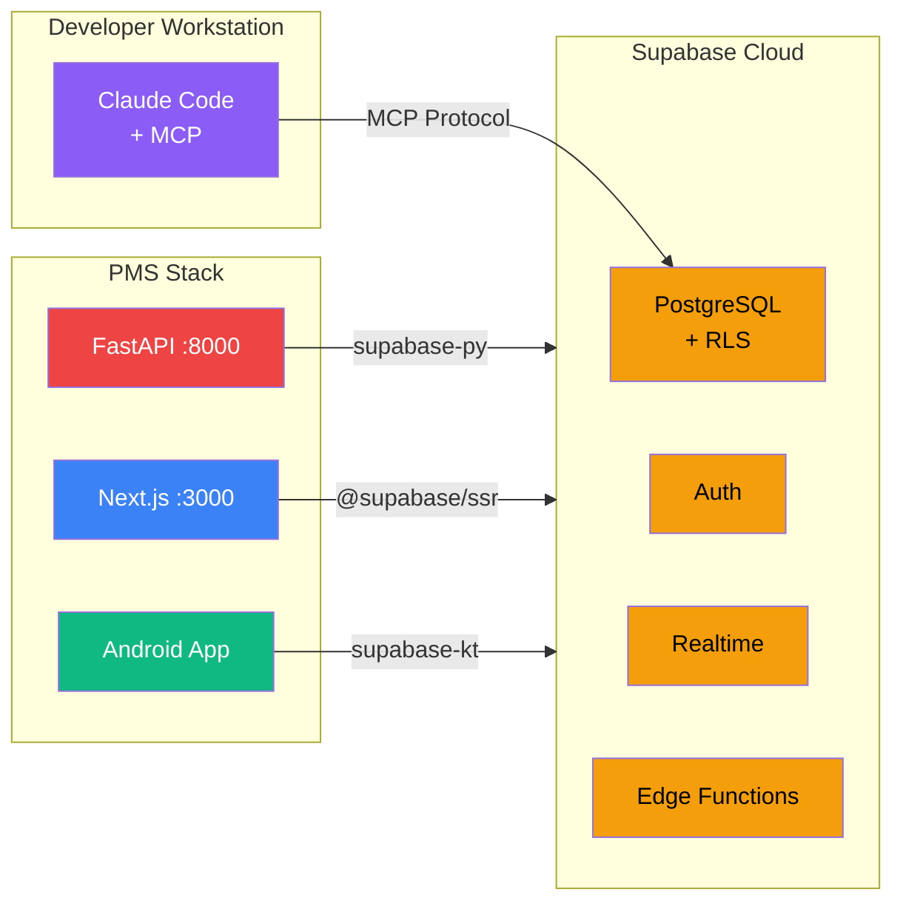

# Supabase + Claude Code Setup Guide for PMS Integration

**Document ID:** PMS-EXP-SUPABASECLAUDECODE-001
**Version:** 1.0
**Date:** 2026-03-09
**Applies To:** PMS project (all platforms)
**Prerequisites Level:** Intermediate

---

## Table of Contents

1. [Overview](#1-overview)
2. [Prerequisites](#2-prerequisites)
3. [Part A: Set Up Supabase Project](#3-part-a-set-up-supabase-project)
4. [Part B: Configure Claude Code MCP](#4-part-b-configure-claude-code-mcp)
5. [Part C: Integrate with PMS Backend (FastAPI)](#5-part-c-integrate-with-pms-backend-fastapi)
6. [Part D: Integrate with PMS Frontend (Next.js)](#6-part-d-integrate-with-pms-frontend-nextjs)
7. [Part E: Integrate with Android App](#7-part-e-integrate-with-android-app)
8. [Part F: Testing and Verification](#8-part-f-testing-and-verification)
9. [Troubleshooting](#9-troubleshooting)
10. [Reference Commands](#10-reference-commands)

---

## 1. Overview

This guide walks you through setting up Supabase as the managed backend for PMS and connecting Claude Code via MCP for AI-assisted database development. By the end, you will have:

- A HIPAA-compliant Supabase project with RLS-protected patient tables
- Claude Code MCP connected to your Supabase project for AI-powered schema management
- Supabase Auth integrated into the FastAPI backend, Next.js frontend, and Android app
- Real-time subscriptions on clinical data tables
- Claude Code Templates agents and commands installed for database operations



## 2. Prerequisites

### 2.1 Required Software

| Software | Minimum Version | Check Command |
|----------|----------------|---------------|
| Node.js | 18.0+ | `node --version` |
| Python | 3.11+ | `python --version` |
| Claude Code CLI | latest | `claude --version` |
| Supabase CLI | 1.200+ | `supabase --version` |
| Docker Desktop | 24.0+ | `docker --version` |
| Git | 2.40+ | `git --version` |
| Kotlin / Android Studio | Hedgehog+ | `kotlin -version` |

### 2.2 Installation of Prerequisites

**Supabase CLI** (if not installed):

```bash
# macOS
brew install supabase/tap/supabase

# npm (all platforms)
npm install -g supabase

# Verify installation
supabase --version
```

**Claude Code CLI** (if not installed):

```bash
npm install -g @anthropic-ai/claude-code

# Verify installation
claude --version
```

### 2.3 Verify PMS Services

Confirm the existing PMS stack is running:

```bash
# Backend (FastAPI)
curl http://localhost:8000/health
# Expected: {"status": "healthy"}

# Frontend (Next.js)
curl -s -o /dev/null -w "%{http_code}" http://localhost:3000
# Expected: 200

# PostgreSQL
psql -h localhost -p 5432 -U pms -c "SELECT 1;"
# Expected: 1
```

**Checkpoint**: All three PMS services respond successfully.

---

## 3. Part A: Set Up Supabase Project

### Step 1: Create a Supabase Account and Project

1. Go to [https://supabase.com/dashboard](https://supabase.com/dashboard) and sign up or log in.
2. Click **New Project**.
3. Configure:
   - **Organization**: Create or select your org (e.g., "MPS Inc.")
   - **Project name**: `pms-dev`
   - **Database password**: Use a strong password (save it securely)
   - **Region**: Choose closest to your deployment (e.g., `us-east-1` for HIPAA)
   - **Plan**: Select **Team** or **Enterprise** (required for HIPAA add-on)

4. Wait for the project to provision (~2 minutes).

### Step 2: Enable HIPAA Add-On

1. In the Supabase Dashboard, go to **Settings → Compliance**.
2. Enable the **HIPAA Add-On**.
3. Sign the **Business Associate Agreement (BAA)**.
4. Configure the project as **High Compliance**:
   - Point-in-time recovery: enabled
   - Encrypted backups: enabled
   - Network restrictions: configure allowed IPs

```bash
# Verify HIPAA status via CLI
supabase projects list
# Look for the HIPAA badge on your project
```

### Step 3: Retrieve Project Credentials

From the Supabase Dashboard → **Settings → API**, note:

```
SUPABASE_URL=https://<project-ref>.supabase.co
SUPABASE_ANON_KEY=eyJ...  (public, safe for clients)
SUPABASE_SERVICE_ROLE_KEY=eyJ...  (secret, backend only)
```

### Step 4: Initialize Supabase Locally

```bash
cd /path/to/pms-backend

# Login to Supabase CLI
supabase login

# Link to your remote project
supabase link --project-ref <your-project-ref>

# Pull the remote schema (if any)
supabase db pull

# Start local Supabase (for offline development)
supabase start
```

Local Supabase services:

| Service | URL |
|---------|-----|
| API | http://localhost:54321 |
| Studio | http://localhost:54323 |
| Auth | http://localhost:54321/auth/v1 |
| Realtime | ws://localhost:54321/realtime/v1 |
| Storage | http://localhost:54321/storage/v1 |

### Step 5: Create PMS Schema with RLS

```sql
-- supabase/migrations/00001_pms_core_tables.sql

-- Enable pgvector for embeddings (used by ISIC CDS)
CREATE EXTENSION IF NOT EXISTS vector;

-- Enable pg_audit for HIPAA audit logging
CREATE EXTENSION IF NOT EXISTS pgaudit;

-- Patients table with RLS
CREATE TABLE patients (
    id UUID PRIMARY KEY DEFAULT gen_random_uuid(),
    mrn TEXT UNIQUE NOT NULL,
    first_name TEXT NOT NULL,
    last_name TEXT NOT NULL,
    date_of_birth DATE NOT NULL,
    created_at TIMESTAMPTZ DEFAULT now(),
    updated_at TIMESTAMPTZ DEFAULT now(),
    provider_id UUID REFERENCES auth.users(id)
);

ALTER TABLE patients ENABLE ROW LEVEL SECURITY;

CREATE POLICY "Providers can view their own patients"
    ON patients FOR SELECT
    USING (auth.uid() = provider_id);

CREATE POLICY "Providers can insert patients"
    ON patients FOR INSERT
    WITH CHECK (auth.uid() = provider_id);

-- Encounters table with RLS
CREATE TABLE encounters (
    id UUID PRIMARY KEY DEFAULT gen_random_uuid(),
    patient_id UUID REFERENCES patients(id) NOT NULL,
    provider_id UUID REFERENCES auth.users(id) NOT NULL,
    encounter_date TIMESTAMPTZ DEFAULT now(),
    status TEXT DEFAULT 'in_progress',
    soap_note JSONB,
    icd10_codes TEXT[],
    cpt_codes TEXT[],
    created_at TIMESTAMPTZ DEFAULT now(),
    updated_at TIMESTAMPTZ DEFAULT now()
);

ALTER TABLE encounters ENABLE ROW LEVEL SECURITY;

CREATE POLICY "Providers can view their encounters"
    ON encounters FOR SELECT
    USING (auth.uid() = provider_id);

-- Prescriptions table with RLS
CREATE TABLE prescriptions (
    id UUID PRIMARY KEY DEFAULT gen_random_uuid(),
    patient_id UUID REFERENCES patients(id) NOT NULL,
    provider_id UUID REFERENCES auth.users(id) NOT NULL,
    medication_name TEXT NOT NULL,
    dosage TEXT NOT NULL,
    frequency TEXT NOT NULL,
    status TEXT DEFAULT 'active',
    prior_auth_status TEXT DEFAULT 'not_required',
    created_at TIMESTAMPTZ DEFAULT now(),
    updated_at TIMESTAMPTZ DEFAULT now()
);

ALTER TABLE prescriptions ENABLE ROW LEVEL SECURITY;

CREATE POLICY "Providers can manage their prescriptions"
    ON prescriptions FOR ALL
    USING (auth.uid() = provider_id);

-- Enable Realtime on clinical tables
ALTER PUBLICATION supabase_realtime ADD TABLE encounters;
ALTER PUBLICATION supabase_realtime ADD TABLE prescriptions;
```

Apply the migration:

```bash
supabase db push
```

**Checkpoint**: Supabase project is created, HIPAA is enabled, core PMS tables exist with RLS policies, and real-time is enabled on clinical tables.

---

## 4. Part B: Configure Claude Code MCP

### Step 1: Install the Supabase MCP Server

Add the Supabase MCP server to your Claude Code configuration:

```bash
claude mcp add supabase -- npx -y @supabase/mcp-server-supabase
```

When prompted, Claude Code will open a browser window for Supabase authentication. Log in and grant access.

### Step 2: Install Claude Code Templates

Install the Supabase-specific agents and commands:

```bash
# Install the Schema Architect agent
npx claude-code-templates@latest --agent database/supabase-schema-architect

# Install the Migration Assistant agent
npx claude-code-templates@latest --agent database/supabase-migration-assistant

# Install all 8 database commands
npx claude-code-templates@latest --command database/supabase-schema-sync
npx claude-code-templates@latest --command database/supabase-migration-assistant
npx claude-code-templates@latest --command database/supabase-performance-optimizer
npx claude-code-templates@latest --command database/supabase-security-audit
npx claude-code-templates@latest --command database/supabase-backup-manager
npx claude-code-templates@latest --command database/supabase-type-generator
npx claude-code-templates@latest --command database/supabase-data-explorer
npx claude-code-templates@latest --command database/supabase-realtime-monitor
```

Or install everything at once:

```bash
npx claude-code-templates@latest --mcp database/supabase
```

### Step 3: Verify MCP Connection

Open Claude Code and test the connection:

```bash
claude

# Inside Claude Code, try:
# "List my Supabase projects"
# "Show tables in my pms-dev project"
# "Describe the patients table schema"
```

Expected: Claude Code lists your projects, tables, and schema details via the MCP tools.

### Step 4: Generate TypeScript Types

```bash
# In Claude Code:
# "Generate TypeScript types for my pms-dev database"

# Or use the command directly:
# /supabase-type-generator
```

This generates a `database.types.ts` file for type-safe frontend development.

**Checkpoint**: Claude Code MCP is connected to Supabase. You can query schemas, generate types, and manage migrations through natural language.

---

## 5. Part C: Integrate with PMS Backend (FastAPI)

### Step 1: Install Python Dependencies

```bash
cd /path/to/pms-backend

pip install supabase>=2.0.0 python-jose[cryptography]
```

Add to `requirements.txt`:

```
supabase>=2.0.0
python-jose[cryptography]>=3.3.0
```

### Step 2: Configure Environment Variables

Add to `.env`:

```env
SUPABASE_URL=https://<project-ref>.supabase.co
SUPABASE_ANON_KEY=eyJ...
SUPABASE_SERVICE_ROLE_KEY=eyJ...
SUPABASE_JWT_SECRET=<your-jwt-secret>  # From Supabase Dashboard → Settings → API → JWT Secret
```

### Step 3: Create Supabase Client Utility

```python
# app/core/supabase_client.py
from supabase import create_client, Client
from app.core.config import settings

_supabase_client: Client | None = None

def get_supabase_client() -> Client:
    """Get the Supabase client (service role for backend operations)."""
    global _supabase_client
    if _supabase_client is None:
        _supabase_client = create_client(
            settings.SUPABASE_URL,
            settings.SUPABASE_SERVICE_ROLE_KEY,
        )
    return _supabase_client
```

### Step 4: Add Supabase Auth Middleware

```python
# app/middleware/supabase_auth.py
from fastapi import Request, HTTPException
from fastapi.security import HTTPBearer, HTTPAuthorizationCredentials
from jose import jwt, JWTError
from app.core.config import settings

security = HTTPBearer()

async def verify_supabase_token(
    credentials: HTTPAuthorizationCredentials,
) -> dict:
    """Verify a Supabase JWT and return the user payload."""
    try:
        payload = jwt.decode(
            credentials.credentials,
            settings.SUPABASE_JWT_SECRET,
            algorithms=["HS256"],
            audience="authenticated",
        )
        return payload
    except JWTError:
        raise HTTPException(status_code=401, detail="Invalid authentication token")
```

### Step 5: Use in FastAPI Endpoints

```python
# app/api/patients.py
from fastapi import APIRouter, Depends
from app.middleware.supabase_auth import verify_supabase_token, security
from app.core.supabase_client import get_supabase_client

router = APIRouter(prefix="/api/patients", tags=["patients"])

@router.get("/")
async def list_patients(
    user: dict = Depends(verify_supabase_token),
):
    """List patients for the authenticated provider."""
    supabase = get_supabase_client()
    result = supabase.table("patients").select("*").eq(
        "provider_id", user["sub"]
    ).execute()
    return result.data
```

**Checkpoint**: FastAPI backend authenticates via Supabase JWT and queries the Supabase-managed PostgreSQL with RLS enforcement.

---

## 6. Part D: Integrate with PMS Frontend (Next.js)

### Step 1: Install Dependencies

```bash
cd /path/to/pms-frontend

npm install @supabase/supabase-js @supabase/ssr
```

### Step 2: Configure Environment Variables

Add to `.env.local`:

```env
NEXT_PUBLIC_SUPABASE_URL=https://<project-ref>.supabase.co
NEXT_PUBLIC_SUPABASE_ANON_KEY=eyJ...
```

### Step 3: Create Supabase Client Utilities

```typescript
// lib/supabase/client.ts
import { createBrowserClient } from "@supabase/ssr";

export function createClient() {
  return createBrowserClient(
    process.env.NEXT_PUBLIC_SUPABASE_URL!,
    process.env.NEXT_PUBLIC_SUPABASE_ANON_KEY!
  );
}
```

```typescript
// lib/supabase/server.ts
import { createServerClient } from "@supabase/ssr";
import { cookies } from "next/headers";

export async function createClient() {
  const cookieStore = await cookies();

  return createServerClient(
    process.env.NEXT_PUBLIC_SUPABASE_URL!,
    process.env.NEXT_PUBLIC_SUPABASE_ANON_KEY!,
    {
      cookies: {
        getAll() {
          return cookieStore.getAll();
        },
        setAll(cookiesToSet) {
          cookiesToSet.forEach(({ name, value, options }) =>
            cookieStore.set(name, value, options)
          );
        },
      },
    }
  );
}
```

### Step 4: Add Auth Middleware

```typescript
// middleware.ts
import { createServerClient } from "@supabase/ssr";
import { NextResponse, type NextRequest } from "next/server";

export async function middleware(request: NextRequest) {
  let supabaseResponse = NextResponse.next({ request });

  const supabase = createServerClient(
    process.env.NEXT_PUBLIC_SUPABASE_URL!,
    process.env.NEXT_PUBLIC_SUPABASE_ANON_KEY!,
    {
      cookies: {
        getAll() {
          return request.cookies.getAll();
        },
        setAll(cookiesToSet) {
          cookiesToSet.forEach(({ name, value }) =>
            request.cookies.set(name, value)
          );
          supabaseResponse = NextResponse.next({ request });
          cookiesToSet.forEach(({ name, value, options }) =>
            supabaseResponse.cookies.set(name, value, options)
          );
        },
      },
    }
  );

  const {
    data: { user },
  } = await supabase.auth.getUser();

  if (!user && !request.nextUrl.pathname.startsWith("/login")) {
    const url = request.nextUrl.clone();
    url.pathname = "/login";
    return NextResponse.redirect(url);
  }

  return supabaseResponse;
}

export const config = {
  matcher: ["/((?!_next/static|_next/image|favicon.ico|login|api/auth).*)"],
};
```

### Step 5: Add Real-Time Subscriptions

```typescript
// components/EncounterRealtime.tsx
"use client";

import { useEffect, useState } from "react";
import { createClient } from "@/lib/supabase/client";

interface Encounter {
  id: string;
  patient_id: string;
  status: string;
  updated_at: string;
}

export function EncounterRealtime({ patientId }: { patientId: string }) {
  const [encounters, setEncounters] = useState<Encounter[]>([]);
  const supabase = createClient();

  useEffect(() => {
    // Initial fetch
    supabase
      .from("encounters")
      .select("*")
      .eq("patient_id", patientId)
      .then(({ data }) => data && setEncounters(data));

    // Real-time subscription
    const channel = supabase
      .channel(`encounters:${patientId}`)
      .on(
        "postgres_changes",
        {
          event: "*",
          schema: "public",
          table: "encounters",
          filter: `patient_id=eq.${patientId}`,
        },
        (payload) => {
          if (payload.eventType === "INSERT") {
            setEncounters((prev) => [...prev, payload.new as Encounter]);
          } else if (payload.eventType === "UPDATE") {
            setEncounters((prev) =>
              prev.map((e) =>
                e.id === (payload.new as Encounter).id
                  ? (payload.new as Encounter)
                  : e
              )
            );
          }
        }
      )
      .subscribe();

    return () => {
      supabase.removeChannel(channel);
    };
  }, [patientId]);

  return (
    <ul>
      {encounters.map((e) => (
        <li key={e.id}>
          {e.status} — {new Date(e.updated_at).toLocaleString()}
        </li>
      ))}
    </ul>
  );
}
```

**Checkpoint**: Next.js frontend authenticates via Supabase Auth with SSR cookie handling, and real-time subscriptions update clinical data live.

---

## 7. Part E: Integrate with Android App

### Step 1: Add Supabase Kotlin Dependency

```kotlin
// build.gradle.kts (app module)
dependencies {
    implementation(platform("io.github.jan-tennert.supabase:bom:3.0.0"))
    implementation("io.github.jan-tennert.supabase:postgrest-kt")
    implementation("io.github.jan-tennert.supabase:auth-kt")
    implementation("io.github.jan-tennert.supabase:realtime-kt")
    implementation("io.ktor:ktor-client-android:2.3.12")
}
```

### Step 2: Configure Supabase Client

```kotlin
// data/supabase/SupabaseClient.kt
import io.github.jan.supabase.createSupabaseClient
import io.github.jan.supabase.auth.Auth
import io.github.jan.supabase.postgrest.Postgrest
import io.github.jan.supabase.realtime.Realtime

object SupabaseClient {
    val client = createSupabaseClient(
        supabaseUrl = BuildConfig.SUPABASE_URL,
        supabaseKey = BuildConfig.SUPABASE_ANON_KEY
    ) {
        install(Auth)
        install(Postgrest)
        install(Realtime)
    }
}
```

### Step 3: Implement Auth

```kotlin
// data/auth/SupabaseAuthRepository.kt
import io.github.jan.supabase.auth.auth
import io.github.jan.supabase.auth.providers.builtin.Email

class SupabaseAuthRepository {
    private val auth = SupabaseClient.client.auth

    suspend fun signIn(email: String, password: String) {
        auth.signInWith(Email) {
            this.email = email
            this.password = password
        }
    }

    suspend fun signOut() {
        auth.signOut()
    }

    fun currentUser() = auth.currentUserOrNull()
}
```

**Checkpoint**: Android app authenticates via Supabase Auth and can subscribe to real-time clinical data updates.

---

## 8. Part F: Testing and Verification

### Service Health Checks

```bash
# Supabase local services
supabase status

# Test Auth endpoint
curl -X POST http://localhost:54321/auth/v1/signup \
  -H "Content-Type: application/json" \
  -H "apikey: <SUPABASE_ANON_KEY>" \
  -d '{"email": "test@mps.dev", "password": "TestPassword123!"}'
# Expected: 200 with user object and JWT

# Test PostgREST API
curl http://localhost:54321/rest/v1/patients \
  -H "apikey: <SUPABASE_ANON_KEY>" \
  -H "Authorization: Bearer <JWT_FROM_SIGNIN>"
# Expected: 200 with patient array (filtered by RLS)

# Test Realtime connection
wscat -c "ws://localhost:54321/realtime/v1/websocket?apikey=<SUPABASE_ANON_KEY>"
# Expected: WebSocket connection established
```

### Claude Code MCP Verification

```bash
# Open Claude Code
claude

# Test these prompts:
# 1. "List all tables in my Supabase project"
# 2. "Show RLS policies on the patients table"
# 3. "Generate a migration to add a 'phone' column to patients"
# 4. "Run a security audit on my database"
# 5. "Generate TypeScript types for my schema"
```

### RLS Policy Test

```bash
# As an unauthenticated user (should fail):
curl http://localhost:54321/rest/v1/patients \
  -H "apikey: <SUPABASE_ANON_KEY>"
# Expected: 200 with empty array (RLS blocks access)

# As an authenticated provider (should return their patients only):
curl http://localhost:54321/rest/v1/patients \
  -H "apikey: <SUPABASE_ANON_KEY>" \
  -H "Authorization: Bearer <PROVIDER_JWT>"
# Expected: 200 with only that provider's patients
```

**Checkpoint**: All services healthy, authentication works, RLS policies enforce access control, Claude Code MCP can manage the database.

---

## 9. Troubleshooting

### MCP Connection Fails

**Symptom**: Claude Code says "Unable to connect to Supabase MCP server"

**Solution**:
1. Verify the MCP server is registered: `claude mcp list`
2. Re-add if missing: `claude mcp add supabase -- npx -y @supabase/mcp-server-supabase`
3. Re-authenticate: the browser login window may have expired — re-run and log in again
4. Check Node.js version: MCP server requires Node.js 18+

### Supabase Auth Token Rejected by FastAPI

**Symptom**: 401 errors when calling FastAPI with a Supabase JWT

**Solution**:
1. Verify `SUPABASE_JWT_SECRET` matches the one in Supabase Dashboard → Settings → API
2. Check the JWT `aud` claim is `"authenticated"` (not `"anon"`)
3. Ensure the user signed in (not just signed up) — unconfirmed users get anon tokens

### RLS Policies Block All Access

**Symptom**: Queries return empty arrays even for authenticated users

**Solution**:
1. Verify the JWT contains a `sub` (user ID) that matches `provider_id` in the table
2. Test with `supabase-security-audit` command to list active policies
3. Temporarily test with service role key (bypasses RLS) to confirm data exists
4. Check policy syntax: `auth.uid()` returns the JWT `sub` claim

### Port Conflicts with Local Supabase

**Symptom**: `supabase start` fails with "port already in use"

**Solution**:
```bash
# Check what's using the ports
lsof -i :54321
lsof -i :54323

# Stop conflicting services or change Supabase ports:
# Edit supabase/config.toml:
# [api]
# port = 54321  # Change to 54421 if conflicted
```

### Real-Time Subscriptions Not Firing

**Symptom**: Database changes don't trigger WebSocket events

**Solution**:
1. Verify the table is in the realtime publication:
   ```sql
   SELECT * FROM pg_publication_tables WHERE pubname = 'supabase_realtime';
   ```
2. Enable if missing:
   ```sql
   ALTER PUBLICATION supabase_realtime ADD TABLE encounters;
   ```
3. Check RLS: real-time events are filtered by the subscribing user's RLS policies

### Edge Function Deployment Fails

**Symptom**: `supabase functions deploy` returns errors

**Solution**:
```bash
# Check Deno version
deno --version

# Test locally first
supabase functions serve <function-name>

# Check logs
supabase functions logs <function-name>
```

---

## 10. Reference Commands

### Daily Development Workflow

```bash
# Start local Supabase
supabase start

# Create a new migration
supabase migration new <migration-name>

# Apply migrations locally
supabase db push

# Generate TypeScript types
supabase gen types typescript --local > lib/database.types.ts

# Deploy Edge Functions
supabase functions deploy <function-name>

# Stop local Supabase
supabase stop
```

### Claude Code Commands

| Command | Purpose |
|---------|---------|
| `/supabase-schema-sync` | Sync schema between local and remote |
| `/supabase-migration-assistant` | AI-guided migration creation |
| `/supabase-performance-optimizer` | Analyze and suggest query optimizations |
| `/supabase-security-audit` | Audit RLS policies and access controls |
| `/supabase-backup-manager` | Manage database backups |
| `/supabase-type-generator` | Generate TypeScript types from schema |
| `/supabase-data-explorer` | Query and explore data interactively |
| `/supabase-realtime-monitor` | Monitor real-time subscriptions |

### Useful URLs

| Resource | URL |
|----------|-----|
| Supabase Dashboard | https://supabase.com/dashboard |
| Local Studio | http://localhost:54323 |
| Local API | http://localhost:54321 |
| Supabase Docs | https://supabase.com/docs |
| MCP Server Repo | https://github.com/supabase-community/supabase-mcp |

---

## Next Steps

After completing this setup guide:

1. Follow the [Supabase + Claude Code Developer Tutorial](58-SupabaseClaudeCode-Developer-Tutorial.md) to build your first integration end-to-end
2. Run `/supabase-security-audit` to validate all RLS policies cover PHI tables
3. Explore the [Supabase MCP Documentation](https://supabase.com/docs/guides/getting-started/mcp) for advanced MCP capabilities
4. Review [CrewAI Integration (Exp 55)](55-PRD-CrewAI-PMS-Integration.md) for triggering agent workflows from Supabase Edge Functions

## Resources

- [Supabase Official Documentation](https://supabase.com/docs)
- [Supabase MCP Server GitHub](https://github.com/supabase-community/supabase-mcp)
- [Claude Code Templates](https://github.com/anthropics/claude-code-templates)
- [Supabase HIPAA Compliance Guide](https://supabase.com/docs/guides/security/hipaa-compliance)
- [Next.js + Supabase Auth Guide](https://supabase.com/docs/guides/auth/quickstarts/nextjs)
- [FastAPI + Supabase Auth Guide](https://medium.com/@ojasskapre/implementing-supabase-authentication-with-next-js-and-fastapi-5656881f449b)
- [PRD: Supabase + Claude Code PMS Integration](58-PRD-SupabaseClaudeCode-PMS-Integration.md)
