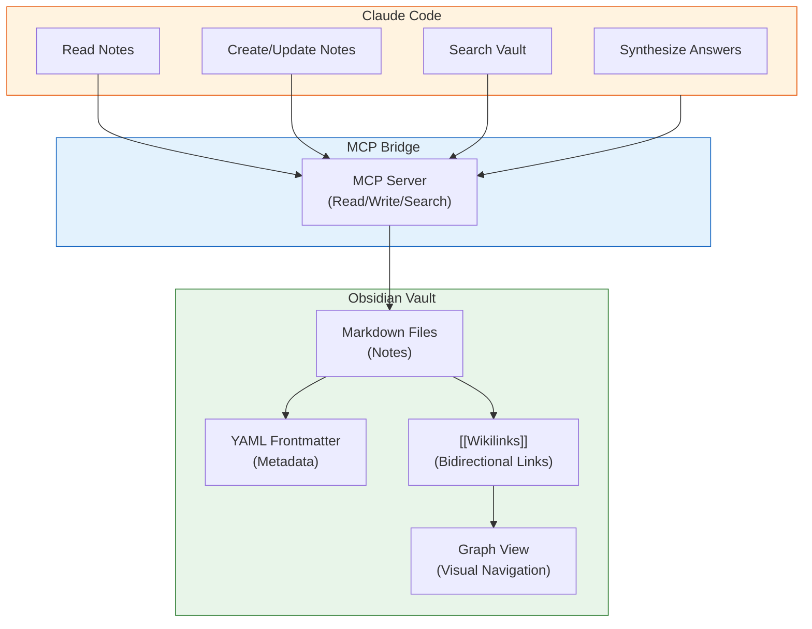
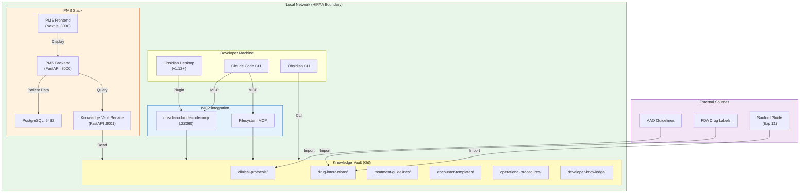

# Obsidian + Claude Code Developer Onboarding Tutorial

**Welcome to the MPS PMS Obsidian + Claude Code Integration Team**

This tutorial will take you from zero to building your first AI-powered clinical knowledge integration with the PMS. By the end, you will understand how Obsidian + Claude Code work together, have a running local environment, and have built and tested a custom knowledge workflow end-to-end.

**Document ID:** PMS-EXP-OBSIDIANCLAUDECODE-002
**Version:** 1.0
**Date:** 2026-03-09
**Applies To:** PMS project (all platforms)
**Prerequisite:** [Obsidian + Claude Code Setup Guide](59-ObsidianClaudeCode-PMS-Developer-Setup-Guide.md)
**Estimated time:** 2-3 hours
**Difficulty:** Beginner-friendly

---

## What You Will Learn

1. How Obsidian stores and links clinical knowledge as interconnected markdown files
2. How Claude Code reads, writes, and searches Obsidian vaults via MCP
3. How bidirectional linking creates a navigable knowledge graph
4. How to structure clinical protocols with YAML frontmatter and templates
5. How to build a Knowledge Vault Service endpoint in FastAPI
6. How to display knowledge search results in the Next.js frontend
7. How to use Claude Code to automatically curate and enrich vault content
8. How Obsidian + Claude Code compares to alternative knowledge management approaches
9. How to enforce HIPAA compliance in a knowledge vault (no PHI)
10. How to debug common integration issues

## Part 1: Understanding Obsidian + Claude Code (15 min read)

### 1.1 What Problem Does This Solve?

Clinical staff at a retina practice need instant access to treatment protocols, drug interaction data, and operational procedures during patient encounters. Today, this knowledge lives in scattered PDFs, email threads, and shared drives. Finding the right protocol means leaving the PMS, searching through folders, and hoping the document is current.

Developers face a similar fragmentation: architectural decisions in `docs/`, debugging notes in Slack threads, API contracts in code comments. Claude Code's `CLAUDE.md` provides session-level context but lacks the rich interconnections that make knowledge truly navigable.

Obsidian + Claude Code solves both problems by creating a **local-first, AI-queryable knowledge graph** where every piece of clinical and technical knowledge is a markdown file with bidirectional links, tags, and structured metadata — and Claude Code can read, search, synthesize, and update it all.

### 1.2 How It Works — The Key Pieces



**Concept 1 — The Vault**: A folder of plain-text markdown files. No proprietary format, no database, no cloud dependency. Every note is a `.md` file you can open in any text editor.

**Concept 2 — Bidirectional Links**: Notes reference each other with `[[wikilinks]]`. If Note A links to Note B, Obsidian automatically shows that Note B is linked *from* Note A. This creates a navigable web of knowledge.

**Concept 3 — MCP Bridge**: The Model Context Protocol connects Claude Code to the vault. Claude Code can read notes, write new notes, search for content, and traverse links — all through standardized MCP tool calls.

### 1.3 How It Fits with Other PMS Technologies

| Technology | Experiment | Relationship to Obsidian + Claude Code |
|---|---|---|
| MCP Protocol | Exp 09 | Transport layer — MCP is *how* Claude Code talks to the vault |
| Claude Code | Exp 27 | AI agent — Claude Code is *who* reads and writes the vault |
| Context Mode | Exp 36 | Optimization — Context Mode can index vault content for extended sessions |
| Sanford Guide | Exp 11 | Content source — drug interaction data can be imported into vault notes |
| FHIR | Exp 16 | Data standard — clinical terminology in vault notes aligns with FHIR coding |
| CrewAI | Exp 55 | Orchestration — multi-agent crews can use vault as shared knowledge store |
| NotebookLM | Exp 57 | Content generation — vault protocols can be source material for audio/quiz generation |

### 1.4 Key Vocabulary

| Term | Meaning |
|---|---|
| **Vault** | The root directory containing all Obsidian notes (a folder of markdown files) |
| **Note** | A single markdown file in the vault |
| **Frontmatter** | YAML metadata block at the top of a note (between `---` delimiters) |
| **Wikilink** | A bidirectional link to another note: `[[note-name]]` or `[[path/note-name\|Display Text]]` |
| **Backlink** | An automatic reverse reference — shows which notes link *to* the current note |
| **Graph View** | Visual network visualization of all notes and their connections |
| **Tag** | A categorization label: `#protocol`, `#drug-interaction`, `#ophthalmology` |
| **Template** | A reusable note structure with placeholder variables |
| **MCP Server** | A process that exposes vault operations as discoverable tools for AI clients |
| **Vault Sync Agent** | Automated process that imports and structures external content into the vault |
| **Knowledge Vault Service** | FastAPI microservice exposing vault content via REST API |
| **PHI** | Protected Health Information — NEVER stored in the vault |

### 1.5 Our Architecture



## Part 2: Environment Verification (15 min)

### 2.1 Checklist

Verify each component before proceeding:

1. **Obsidian Desktop installed**:
   ```bash
   obsidian --version
   # Expected: Obsidian v1.12.x or later
   ```

2. **Claude Code CLI installed**:
   ```bash
   claude --version
   # Expected: claude-code vX.Y.Z
   ```

3. **Vault exists and has content**:
   ```bash
   ls ~/pms-knowledge-vault/clinical-protocols/
   # Expected: ophthalmology/ general/

   cat ~/pms-knowledge-vault/CLAUDE.md | head -5
   # Expected: "# PMS Clinical Knowledge Vault"
   ```

4. **MCP server configured**:
   ```bash
   cat ~/.claude/mcp_servers.json | python3 -m json.tool
   # Expected: obsidian-vault-fs and/or obsidian-vault-mcp entries
   ```

5. **PMS Backend running**:
   ```bash
   curl -s http://localhost:8000/health | jq .status
   # Expected: "healthy"
   ```

6. **Git initialized in vault**:
   ```bash
   cd ~/pms-knowledge-vault && git log --oneline -1
   # Expected: a commit hash and message
   ```

### 2.2 Quick Test

Run this end-to-end verification:

```bash
# Start Claude Code in the vault
cd ~/pms-knowledge-vault
claude --print "List all markdown files in this vault and tell me how many clinical protocols exist"
```

Expected output: Claude Code lists the vault files and reports at least 1 clinical protocol (the anti-VEGF injection protocol).

## Part 3: Build Your First Integration (45 min)

### 3.1 What We Are Building

We will build a **Drug Interaction Knowledge Workflow** that:
1. Creates structured drug interaction notes in the vault
2. Cross-links them with existing clinical protocols
3. Exposes them through the Knowledge Vault Service API
4. Allows clinicians to search drug interactions from the PMS frontend

### 3.2 Create Drug Interaction Notes

Create three drug interaction notes for common ophthalmology medications:

```bash
cat > ~/pms-knowledge-vault/drug-interactions/aflibercept-warfarin.md << 'EOF'
---
title: "Aflibercept + Warfarin Interaction"
tags: [drug-interaction, ophthalmology, anticoagulant]
classification: internal
last_updated: 2026-03-09
severity: "Moderate"
evidence_level: "Level II"
---

# Aflibercept + Warfarin Interaction

## Interaction Type
Pharmacodynamic — additive bleeding risk

## Clinical Significance
**Severity: Moderate** — Intravitreal injection in anticoagulated patients carries increased risk of subconjunctival and vitreous hemorrhage.

## Mechanism
Warfarin inhibits vitamin K-dependent clotting factors. Intravitreal injection creates a needle puncture through vascularized tissue. The combination increases hemorrhagic risk at the injection site.

## Management
- **Do NOT discontinue warfarin** for intravitreal injections (per AAO guidelines)
- Check INR within 1 week before injection
- Proceed if INR ≤ 3.0
- Hold warfarin only if INR > 3.0 (coordinate with prescribing physician)
- Apply prolonged pressure post-injection (30 seconds vs standard 10 seconds)
- Document anticoagulation status in [[clinical-protocols/ophthalmology/intravitreal-anti-vegf-injection|injection protocol checklist]]

## Monitoring Parameters
| Parameter | Frequency | Target |
|---|---|---|
| INR | Within 7 days pre-injection | ≤ 3.0 |
| Subconjunctival hemorrhage | Each visit | Document size and resolution |
| Visual acuity | Each visit | No unexplained decline |

## References
- AAO Preferred Practice Pattern: Intravitreal Injections in Anticoagulated Patients
- Kang HK, et al. Retina. 2019;39(8):1437-1446
- See also: [[aflibercept-aspirin|Aflibercept + Aspirin Interaction]]
EOF
```

```bash
cat > ~/pms-knowledge-vault/drug-interactions/aflibercept-aspirin.md << 'EOF'
---
title: "Aflibercept + Aspirin Interaction"
tags: [drug-interaction, ophthalmology, antiplatelet]
classification: internal
last_updated: 2026-03-09
severity: "Minor"
evidence_level: "Level I"
---

# Aflibercept + Aspirin Interaction

## Interaction Type
Pharmacodynamic — mild additive bleeding risk

## Clinical Significance
**Severity: Minor** — Aspirin use does not significantly increase hemorrhagic complications from intravitreal injections. No dose adjustment or discontinuation needed.

## Mechanism
Aspirin irreversibly inhibits cyclooxygenase-1 (COX-1), reducing platelet aggregation. Combined with intravitreal needle puncture, there is a theoretical increased bleeding risk, but clinical studies show no significant difference in complication rates.

## Management
- **Continue aspirin** at all doses for intravitreal injections
- No additional precautions beyond standard [[clinical-protocols/ophthalmology/intravitreal-anti-vegf-injection|injection protocol]]
- Document aspirin use in encounter record

## Monitoring Parameters
| Parameter | Frequency | Target |
|---|---|---|
| Subconjunctival hemorrhage | Each visit | Document; expect similar rates to non-aspirin patients |

## References
- CATT Study Group subanalysis: no increased hemorrhage with aspirin
- Storey PP, et al. Ophthalmol Retina. 2020;4(1):67-72
- See also: [[aflibercept-warfarin|Aflibercept + Warfarin Interaction]]
EOF
```

```bash
cat > ~/pms-knowledge-vault/drug-interactions/ranibizumab-metformin.md << 'EOF'
---
title: "Ranibizumab + Metformin Interaction"
tags: [drug-interaction, ophthalmology, diabetes]
classification: internal
last_updated: 2026-03-09
severity: "None"
evidence_level: "Level I"
---

# Ranibizumab + Metformin Interaction

## Interaction Type
None — no pharmacokinetic or pharmacodynamic interaction

## Clinical Significance
**Severity: None** — Ranibizumab (intravitreal) and metformin (oral) do not interact. Ranibizumab is administered locally into the vitreous with negligible systemic absorption. Metformin acts systemically on hepatic glucose production and peripheral insulin sensitivity.

## Mechanism
No interaction. Ranibizumab is a monoclonal antibody fragment that binds VEGF-A locally in the eye. Metformin is renally cleared and does not affect VEGF signaling.

## Management
- Continue both medications without adjustment
- Metformin is relevant as many anti-VEGF patients have diabetic macular edema (DME) and are on metformin for type 2 diabetes
- Ensure adequate glycemic control (HbA1c) as it affects DME treatment response
- See [[clinical-protocols/ophthalmology/intravitreal-anti-vegf-injection|injection protocol]] for DME-specific considerations

## Monitoring Parameters
| Parameter | Frequency | Target |
|---|---|---|
| HbA1c | Every 3 months | < 7.0% (affects treatment response) |
| Fasting glucose | Each visit | < 130 mg/dL |

## References
- Ranibizumab FDA label: no systemic drug interactions listed
- DME treatment response correlates with glycemic control (Protocol I, DRCR.net)
EOF
```

**Checkpoint**: Three drug interaction notes created with structured frontmatter, wikilinks to the injection protocol, and cross-links between related interactions.

### 3.3 Use Claude Code to Enrich the Notes

Let Claude Code analyze the vault and add missing connections:

```bash
cd ~/pms-knowledge-vault
claude --print "Read all drug interaction notes in drug-interactions/ and the intravitreal anti-VEGF injection protocol. Then:
1. List all wikilinks found across these notes
2. Identify any broken links (links to notes that don't exist yet)
3. Suggest 2-3 additional drug interaction notes that should be created for common ophthalmology medications"
```

### 3.4 Search the Knowledge Base via API

Test the Knowledge Vault Service endpoints:

```bash
# Search for all drug interactions
curl -s "http://localhost:8000/api/knowledge/search?q=drug-interaction" | python3 -m json.tool

# Filter notes by tag
curl -s "http://localhost:8000/api/knowledge/notes?tag=drug-interaction" | python3 -m json.tool

# Get a specific interaction with backlinks
curl -s "http://localhost:8000/api/knowledge/notes/drug-interactions/aflibercept-warfarin.md" | python3 -m json.tool
```

### 3.5 Build a Drug Interaction Lookup Endpoint

Add a specialized endpoint to the PMS backend that returns drug interaction data in a structured format:

```python
# File: pms-backend/app/services/drug_interaction_lookup.py

from pathlib import Path
from typing import Optional

import yaml
from fastapi import APIRouter, Query
from pydantic import BaseModel

VAULT_PATH = Path("~/pms-knowledge-vault").expanduser()

router = APIRouter(prefix="/api/knowledge/drug-interactions", tags=["knowledge"])


class DrugInteraction(BaseModel):
    drug_a: str
    drug_b: str
    severity: str
    interaction_type: str
    management_summary: str
    source_note: str


@router.get("/lookup", response_model=list[DrugInteraction])
async def lookup_interactions(
    drug: str = Query(..., description="Drug name to check interactions for"),
):
    """Look up all known drug interactions for a given medication."""
    results = []
    interactions_dir = VAULT_PATH / "drug-interactions"

    if not interactions_dir.exists():
        return results

    drug_lower = drug.lower()
    for md_file in interactions_dir.glob("*.md"):
        text = md_file.read_text(encoding="utf-8")
        if drug_lower not in text.lower():
            continue

        # Parse frontmatter
        import re
        match = re.match(r"^---\n(.*?)\n---", text, re.DOTALL)
        if not match:
            continue
        fm = yaml.safe_load(match.group(1)) or {}

        # Extract interaction type from content
        interaction_type = "Unknown"
        for line in text.split("\n"):
            if line.startswith("## Interaction Type"):
                # Next non-empty line is the type
                idx = text.split("\n").index(line)
                remaining = text.split("\n")[idx + 1:]
                for next_line in remaining:
                    if next_line.strip():
                        interaction_type = next_line.strip()
                        break
                break

        # Extract management summary (first bullet point under Management)
        management = ""
        in_management = False
        for line in text.split("\n"):
            if "## Management" in line:
                in_management = True
                continue
            if in_management and line.startswith("- "):
                management = line[2:].strip().strip("*")
                break

        # Parse drug names from title
        title = fm.get("title", md_file.stem)
        parts = title.replace(" Interaction", "").split(" + ")
        drug_a = parts[0].strip() if parts else drug
        drug_b = parts[1].strip() if len(parts) > 1 else "Unknown"

        results.append(DrugInteraction(
            drug_a=drug_a,
            drug_b=drug_b,
            severity=fm.get("severity", "Unknown"),
            interaction_type=interaction_type,
            management_summary=management,
            source_note=str(md_file.relative_to(VAULT_PATH)),
        ))

    return results
```

### 3.6 Test the Drug Interaction Lookup

```bash
# Look up all interactions for aflibercept
curl -s "http://localhost:8000/api/knowledge/drug-interactions/lookup?drug=aflibercept" | python3 -m json.tool

# Expected output:
# [
#   {
#     "drug_a": "Aflibercept",
#     "drug_b": "Warfarin",
#     "severity": "Moderate",
#     "interaction_type": "Pharmacodynamic — additive bleeding risk",
#     "management_summary": "Do NOT discontinue warfarin for intravitreal injections (per AAO guidelines)",
#     "source_note": "drug-interactions/aflibercept-warfarin.md"
#   },
#   {
#     "drug_a": "Aflibercept",
#     "drug_b": "Aspirin",
#     "severity": "Minor",
#     ...
#   }
# ]
```

**Checkpoint**: Drug Interaction Knowledge Workflow is complete — notes are created, linked, searchable via API, and queryable through a structured lookup endpoint.

## Part 4: Evaluating Strengths and Weaknesses (15 min)

### 4.1 Strengths

- **Local-first, zero PHI risk**: All data stays on the local filesystem. No cloud dependency means no risk of PHI exposure through third-party services.
- **Plain-text portability**: Markdown files work with any tool — no vendor lock-in. If Obsidian disappears, the vault is still a folder of readable files.
- **Rich bidirectional linking**: Wikilinks create a navigable knowledge graph. Backlinks surface connections you didn't explicitly create.
- **Massive plugin ecosystem**: 2,700+ community plugins for every conceivable extension — templates, kanban boards, calendars, dataview queries, graph analysis.
- **Claude Code native compatibility**: Since vaults are just directories of text files, Claude Code can read and write them with zero additional tooling (Filesystem MCP).
- **Version control friendly**: Git works perfectly with plain-text markdown. Full history, branching, collaboration, CI/CD validation.
- **Offline-capable**: Works without internet. Essential for clinical environments with restricted network access.

### 4.2 Weaknesses

- **No built-in collaboration**: Obsidian is single-user by design. Multi-user editing requires Git-based workflows (merge conflicts possible).
- **Obsidian Desktop dependency for rich features**: Graph view, plugin system, and the GUI require Obsidian Desktop (Electron app). Server-side deployments use only the vault files and CLI.
- **No native semantic search**: Full-text search is basic substring matching. Semantic/vector search requires additional plugins or custom indexing (e.g., Smart Connections plugin or pgvector).
- **Fragile wikilink refactoring**: Renaming or moving notes can break wikilinks. Obsidian Desktop auto-updates links, but CLI/MCP operations do not.
- **Community plugin stability**: Third-party plugins may break on Obsidian updates. Pin versions and have fallback strategies.
- **Not a database**: Complex queries (e.g., "find all protocols updated more than 90 days ago with severity > Moderate") require the Dataview plugin or external indexing — not natively supported.

### 4.3 When to Use Obsidian + Claude Code vs Alternatives

| Scenario | Best Choice | Why |
|---|---|---|
| Clinical protocol knowledge base | **Obsidian + Claude Code** | Local-first, AI-queryable, no PHI risk |
| Team collaboration on live documents | **Notion** | Real-time co-editing, comments, permissions |
| Structured outliner-based notes | **Logseq** | Block-level referencing, daily journal focus |
| Code documentation (already in repo) | **docs/ directory + Claude Code** | Already integrated, no additional tooling |
| Patient data queries | **PostgreSQL + PMS API** | PHI belongs in the database, not in files |
| AI-generated multimedia content | **NotebookLM (Exp 57)** | Audio podcasts, quizzes from vault sources |

### 4.4 HIPAA / Healthcare Considerations

**What is safe in the vault**:
- Clinical protocols (de-identified, evidence-based)
- Drug interaction reference data
- Treatment guidelines (from published sources)
- Encounter templates (blank, no patient data)
- Operational procedures
- Developer documentation

**What is NEVER allowed in the vault**:
- Patient names, MRNs, DOBs, SSNs
- Encounter notes with patient-identifiable information
- Lab results or imaging reports
- Insurance information
- Any data element defined as PHI under HIPAA

**Enforcement mechanisms**:
1. `CLAUDE.md` instructions explicitly prohibit PHI
2. Pre-commit Git hooks scan for PHI patterns (regex for SSN, MRN, phone, email)
3. Frontmatter `classification` field for access control
4. Quarterly manual audit of vault content
5. Claude Code permission boundaries prevent access to patient data directories

## Part 5: Debugging Common Issues (15 min read)

### Issue 1: Claude Code Can't Find Vault Notes

**Symptoms**: Claude Code says "I don't see any files" or returns empty search results.

**Cause**: MCP server path is incorrect or the server isn't running.

**Fix**:
```bash
# Verify MCP config path
cat ~/.claude/mcp_servers.json | python3 -c "import sys,json; print(json.load(sys.stdin))"

# Check the vault path exists
ls -la ~/pms-knowledge-vault/

# Test MCP connection by restarting Claude Code
claude --mcp-debug
```

### Issue 2: Broken Wikilinks After Moving Notes

**Symptoms**: Notes reference `[[old-path/note]]` but the file has been moved.

**Cause**: CLI or MCP file move operations don't update wikilinks (only Obsidian Desktop does).

**Fix**:
```bash
# Find all broken links in the vault
cd ~/pms-knowledge-vault
grep -r "\[\[" --include="*.md" -l | while read f; do
  grep -oP '\[\[(.*?)\]\]' "$f" | while read link; do
    target=$(echo "$link" | sed 's/\[\[//;s/\]\]//;s/|.*//')
    if [ ! -f "${target}.md" ] && [ ! -f "$target" ]; then
      echo "BROKEN: $f -> $link"
    fi
  done
done

# Fix by updating the link or moving the file back
# Or use Obsidian Desktop's "Update links on file rename" feature
```

### Issue 3: Frontmatter Parsing Failures

**Symptoms**: API returns notes with empty metadata; tags and classification missing.

**Cause**: Invalid YAML in frontmatter — common issues: tabs instead of spaces, missing quotes around special characters, no `---` delimiter.

**Fix**:
```bash
# Validate all frontmatter
for f in ~/pms-knowledge-vault/**/*.md; do
  python3 -c "
import re, yaml, sys
text = open('$f').read()
m = re.match(r'^---\n(.*?)\n---', text, re.DOTALL)
if m:
    try: yaml.safe_load(m.group(1))
    except: print(f'INVALID: $f')
else:
    print(f'NO FRONTMATTER: $f')
" 2>/dev/null
done
```

### Issue 4: Knowledge Vault Service Returns Stale Data

**Symptoms**: API shows old content even though vault files have been updated.

**Cause**: The service reads files on each request (no caching), so this usually indicates the wrong `VAULT_PATH`.

**Fix**:
```bash
# Verify VAULT_PATH in the running process
curl -s http://localhost:8000/api/knowledge/notes | python3 -c "import sys,json; data=json.load(sys.stdin); print(f'{len(data)} notes found')"

# Compare with actual vault
find ~/pms-knowledge-vault -name "*.md" -not -path "*/.obsidian/*" -not -name "_*" | wc -l

# If counts don't match, check VAULT_PATH env var
```

### Issue 5: MCP WebSocket Connection Drops

**Symptoms**: Claude Code loses connection to `obsidian-claude-code-mcp` mid-session.

**Cause**: Obsidian Desktop closed, plugin crashed, or system sleep interrupted the WebSocket.

**Fix**:
1. Reopen Obsidian Desktop
2. Check plugin status in Settings > Community Plugins
3. Restart the plugin: disable then re-enable
4. Fallback to Filesystem MCP (always available, no Obsidian dependency)

## Part 6: Practice Exercise (45 min)

### Option A: Build a Treatment Guidelines Section

Create 3-5 treatment guideline notes for common ophthalmology conditions (DME, nAMD, RVO). Each should:
- Use the clinical-protocol template
- Include wikilinks to relevant drug interaction notes
- Include a prior authorization reference
- Have proper frontmatter with tags and classification

**Hints**:
1. Start with the `_templates/clinical-protocol.md` template
2. Cross-link to existing drug interaction notes
3. Use Claude Code to help generate content: `claude --print "Create a treatment guideline for diabetic macular edema following the template in _templates/clinical-protocol.md"`

### Option B: Build an Automated Vault Health Checker

Write a Python script that:
- Scans all vault notes for broken wikilinks
- Identifies notes with missing frontmatter fields
- Finds notes not updated in > 90 days
- Generates a health report as a vault note

**Hints**:
1. Use `pathlib.Path.rglob("*.md")` to find all notes
2. Parse frontmatter with the `yaml` module
3. Extract wikilinks with regex: `r'\[\[(.*?)\]\]'`
4. Write the report to `_reports/vault-health-YYYY-MM-DD.md`

### Option C: Create a Claude Code Hook for Vault Updates

Create a Claude Code hook that triggers whenever a vault note is created or modified:
- Validates frontmatter completeness
- Checks for PHI patterns (SSN, MRN, phone numbers)
- Updates the vault's `_index.md` with the new/modified note
- Commits the change to Git

**Hints**:
1. Create a hook in `.claude/hooks/` that runs on file write events
2. Use regex patterns for PHI detection: `r'\b\d{3}-\d{2}-\d{4}\b'` (SSN), `r'\bMRN\s*[:=]\s*\d+\b'` (MRN)
3. Fail the hook if PHI is detected (prevents the write)

## Part 7: Development Workflow and Conventions

### 7.1 File Organization

```
pms-knowledge-vault/
├── CLAUDE.md                           # Claude Code vault context
├── _templates/                         # Note templates
│   ├── clinical-protocol.md
│   ├── drug-interaction.md
│   └── encounter-template.md
├── _attachments/                       # Images, PDFs (non-markdown)
├── _reports/                           # Generated vault reports
├── clinical-protocols/
│   ├── ophthalmology/                  # Specialty-specific protocols
│   │   ├── intravitreal-anti-vegf-injection.md
│   │   ├── diabetic-macular-edema.md
│   │   └── ...
│   └── general/                        # General clinical protocols
├── drug-interactions/                  # Drug interaction reference
│   ├── aflibercept-warfarin.md
│   ├── aflibercept-aspirin.md
│   └── ...
├── treatment-guidelines/               # Treatment pathway docs
├── encounter-templates/                # Blank encounter templates
├── operational-procedures/             # Administrative procedures
│   └── prior-auth-anti-vegf.md
└── developer-knowledge/                # Technical documentation
    ├── architecture/                   # ADRs
    ├── api/                           # API contracts
    └── debugging/                     # Debugging playbooks
```

### 7.2 Naming Conventions

| Item | Convention | Example |
|---|---|---|
| Note files | `kebab-case.md` | `intravitreal-anti-vegf-injection.md` |
| Folders | `kebab-case/` | `clinical-protocols/` |
| Tags | `#kebab-case` | `#drug-interaction`, `#ophthalmology` |
| Wikilinks | `[[folder/note-name\|Display Name]]` | `[[clinical-protocols/ophthalmology/intravitreal-anti-vegf-injection\|Injection Protocol]]` |
| Templates | `kebab-case.md` in `_templates/` | `_templates/clinical-protocol.md` |
| Frontmatter dates | `YYYY-MM-DD` | `2026-03-09` |
| Classification | `public`, `internal`, `restricted` | `classification: internal` |

### 7.3 PR Checklist

When submitting a PR that modifies the knowledge vault:

- [ ] All new notes have complete YAML frontmatter (title, tags, classification, last_updated)
- [ ] No PHI is present in any note (patient names, MRNs, DOBs, SSNs, phone numbers)
- [ ] All wikilinks resolve to existing notes (no broken links)
- [ ] Frontmatter `classification` is appropriate (`restricted` for sensitive operational procedures)
- [ ] Notes follow the naming convention (`kebab-case.md`)
- [ ] Templates used correctly (no placeholder variables left unfilled)
- [ ] Git commit message describes what knowledge was added/updated
- [ ] Cross-links added to related existing notes
- [ ] `last_updated` field reflects today's date

### 7.4 Security Reminders

1. **NEVER store PHI in the vault** — patient records belong in PostgreSQL, accessed via PMS APIs
2. **Classify every note** — use `classification: restricted` for sensitive operational procedures
3. **Audit regularly** — run the vault health checker monthly to scan for PHI patterns
4. **Encrypt the vault volume** — use LUKS (Linux) or FileVault (macOS) for encryption at rest
5. **Limit MCP permissions** — use read-only MCP access for production deployments
6. **Review Claude Code output** — AI-generated clinical content requires clinician sign-off before publishing
7. **Git access control** — restrict push access to the vault repo to authorized team members

## Part 8: Quick Reference Card

### Key Commands

```bash
# Open vault in Obsidian
obsidian open ~/pms-knowledge-vault

# Start Claude Code with vault
cd ~/pms-knowledge-vault && claude

# Search vault (CLI)
obsidian search "anti-VEGF" --vault ~/pms-knowledge-vault

# Create note from template (CLI)
obsidian note create "Note Title" --template clinical-protocol

# Check vault health
obsidian vault stats --vault ~/pms-knowledge-vault

# Find broken links
obsidian orphans --vault ~/pms-knowledge-vault
```

### Key Files

| File | Purpose |
|---|---|
| `~/pms-knowledge-vault/CLAUDE.md` | Claude Code vault context and conventions |
| `~/.claude/mcp_servers.json` | MCP server configuration |
| `_templates/clinical-protocol.md` | Protocol note template |
| `_templates/drug-interaction.md` | Drug interaction note template |
| `pms-backend/app/services/knowledge_vault.py` | Knowledge Vault Service |

### Key URLs

| Resource | URL |
|---|---|
| Knowledge Vault API | `http://localhost:8000/api/knowledge/notes` |
| Drug Interaction Lookup | `http://localhost:8000/api/knowledge/drug-interactions/lookup?drug=` |
| Obsidian Help | https://help.obsidian.md/ |
| obsidian-claude-code-mcp | https://github.com/iansinnott/obsidian-claude-code-mcp |
| MCP-Obsidian.org | https://mcp-obsidian.org/ |

### Starter Template

```markdown
---
title: ""
tags: []
classification: internal
last_updated: 2026-03-09
author: ""
status: draft
---

# Title

## Summary
<!-- Brief description -->

## Details
<!-- Main content -->

## Related
<!-- [[wikilinks]] to related notes -->

## References
<!-- External sources -->
```

## Next Steps

1. **Populate the vault** with your team's clinical protocols — start with the 5 most-referenced procedures
2. **Set up semantic search** with pgvector embeddings for natural-language queries (Phase 3 of the PRD)
3. **Configure the Vault Sync Agent** to automatically import updated AAO guidelines
4. **Review [MCP PMS Integration (Experiment 09)](09-PRD-MCP-PMS-Integration.md)** for advanced MCP patterns
5. **Explore [NotebookLM Integration (Experiment 57)](57-PRD-NotebookLM-Py-PMS-Integration.md)** to generate audio podcasts from vault protocols
