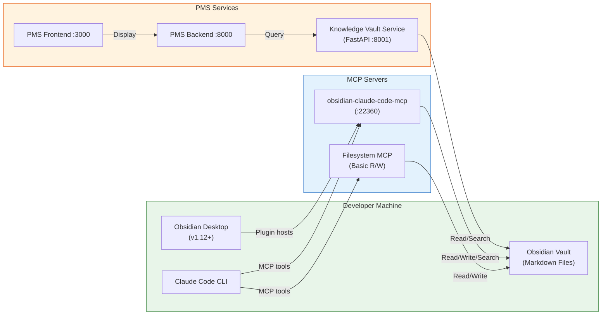

# Obsidian + Claude Code Setup Guide for PMS Integration

**Document ID:** PMS-EXP-OBSIDIANCLAUDECODE-001
**Version:** 1.0
**Date:** 2026-03-09
**Applies To:** PMS project (all platforms)
**Prerequisites Level:** Intermediate

---

## Table of Contents

1. [Overview](#1-overview)
2. [Prerequisites](#2-prerequisites)
3. [Part A: Install and Configure Obsidian Vault](#3-part-a-install-and-configure-obsidian-vault)
4. [Part B: Configure MCP Integration with Claude Code](#4-part-b-configure-mcp-integration-with-claude-code)
5. [Part C: Integrate with PMS Backend](#5-part-c-integrate-with-pms-backend)
6. [Part D: Integrate with PMS Frontend](#6-part-d-integrate-with-pms-frontend)
7. [Part E: Testing and Verification](#7-part-e-testing-and-verification)
8. [Troubleshooting](#8-troubleshooting)
9. [Reference Commands](#9-reference-commands)

## 1. Overview

This guide walks you through setting up an Obsidian vault as a clinical knowledge base for the PMS, connecting it to Claude Code via MCP, and integrating knowledge search into the PMS backend and frontend.

By the end of this guide, you will have:
- A structured Obsidian vault with clinical protocol templates
- Claude Code connected to the vault via the Filesystem MCP server and `obsidian-claude-code-mcp` plugin
- A Knowledge Vault Service (FastAPI) exposing vault content via REST API
- A Knowledge Search Panel in the Next.js frontend



## 2. Prerequisites

### 2.1 Required Software

| Software | Minimum Version | Check Command |
|---|---|---|
| Node.js | 18.0 | `node --version` |
| npm | 9.0 | `npm --version` |
| Python | 3.11 | `python3 --version` |
| Claude Code CLI | Latest | `claude --version` |
| Git | 2.40 | `git --version` |
| Obsidian Desktop | 1.12+ | `obsidian --version` (CLI) |

### 2.2 Installation of Prerequisites

**Obsidian Desktop (macOS)**:

```bash
# Install via Homebrew
brew install --cask obsidian

# Verify installation and CLI availability
obsidian --version
```

**Obsidian Desktop (Linux)**:

```bash
# Download AppImage from https://obsidian.md/download
wget https://github.com/obsidianmd/obsidian-releases/releases/latest/download/Obsidian-x86_64.AppImage
chmod +x Obsidian-x86_64.AppImage
sudo mv Obsidian-x86_64.AppImage /usr/local/bin/obsidian
```

**Claude Code CLI** (if not already installed):

```bash
npm install -g @anthropic-ai/claude-code
claude --version
```

### 2.3 Verify PMS Services

Confirm the PMS backend, frontend, and database are running:

```bash
# Check PMS Backend
curl -s http://localhost:8000/health | jq .
# Expected: {"status": "healthy"}

# Check PMS Frontend
curl -s -o /dev/null -w "%{http_code}" http://localhost:3000
# Expected: 200

# Check PostgreSQL
pg_isready -h localhost -p 5432
# Expected: accepting connections
```

**Checkpoint**: All prerequisite software is installed and PMS services are running.

## 3. Part A: Install and Configure Obsidian Vault

### Step 1: Create the Vault Directory Structure

```bash
# Create the vault directory (adjacent to the PMS codebase)
mkdir -p ~/pms-knowledge-vault

# Create the folder structure
cd ~/pms-knowledge-vault
mkdir -p \
  clinical-protocols/ophthalmology \
  clinical-protocols/general \
  drug-interactions \
  treatment-guidelines \
  encounter-templates \
  operational-procedures \
  developer-knowledge \
  developer-knowledge/architecture \
  developer-knowledge/api \
  developer-knowledge/debugging \
  _templates \
  _attachments
```

### Step 2: Initialize Git Version Control

```bash
cd ~/pms-knowledge-vault

git init
cat > .gitignore << 'EOF'
.obsidian/workspace.json
.obsidian/workspace-mobile.json
.obsidian/cache
.trash/
.DS_Store
EOF

git add .
git commit -m "Initialize PMS knowledge vault"
```

### Step 3: Create the Vault CLAUDE.md

This file gives Claude Code context about the vault structure and conventions:

```bash
cat > ~/pms-knowledge-vault/CLAUDE.md << 'EOF'
# PMS Clinical Knowledge Vault

This is the MPS PMS clinical knowledge base managed with Obsidian.

## Vault Structure
- `clinical-protocols/` — Evidence-based clinical protocols by specialty
- `drug-interactions/` — Drug interaction notes and formulary summaries
- `treatment-guidelines/` — Treatment pathway documentation
- `encounter-templates/` — Templates for clinical encounter documentation
- `operational-procedures/` — Office and administrative procedures
- `developer-knowledge/` — Technical documentation, ADRs, API notes
- `_templates/` — Obsidian note templates (Templater format)
- `_attachments/` — Images and non-markdown files

## Conventions
- All notes use YAML frontmatter with: title, tags, classification, last_updated, author
- classification values: public, internal, restricted
- NEVER store PHI (patient names, MRNs, DOBs, SSNs) in any note
- Use [[wikilinks]] for internal references
- Tag clinical protocols with #protocol and the specialty (e.g., #ophthalmology)
- Tag drug notes with #drug-interaction
- Date format: YYYY-MM-DD
EOF
```

### Step 4: Create Starter Templates

```bash
cat > ~/pms-knowledge-vault/_templates/clinical-protocol.md << 'EOF'
---
title: "{{title}}"
tags: [protocol, {{specialty}}]
classification: internal
last_updated: {{date}}
author: ""
status: draft
evidence_level: ""
review_date: ""
---

# {{title}}

## Indication
<!-- When to use this protocol -->

## Procedure
<!-- Step-by-step clinical procedure -->

## Contraindications
<!-- When NOT to use this protocol -->

## Expected Outcomes
<!-- Normal outcomes and what to monitor -->

## Complications
<!-- Potential complications and management -->

## References
<!-- Evidence sources -->

## Related Protocols
<!-- [[wikilinks]] to related protocols -->
EOF

cat > ~/pms-knowledge-vault/_templates/drug-interaction.md << 'EOF'
---
title: "{{drug_a}} + {{drug_b}} Interaction"
tags: [drug-interaction]
classification: internal
last_updated: {{date}}
severity: ""
evidence_level: ""
---

# {{drug_a}} + {{drug_b}} Interaction

## Interaction Type
<!-- Pharmacokinetic / Pharmacodynamic / Both -->

## Clinical Significance
<!-- Severity: Major / Moderate / Minor -->

## Mechanism
<!-- How the interaction occurs -->

## Management
<!-- Clinical recommendations -->

## Monitoring Parameters
<!-- What to monitor and frequency -->

## References
<!-- Evidence sources, Sanford Guide, FDA label -->
EOF
```

### Step 5: Create Sample Clinical Protocol

```bash
cat > ~/pms-knowledge-vault/clinical-protocols/ophthalmology/intravitreal-anti-vegf-injection.md << 'EOF'
---
title: "Intravitreal Anti-VEGF Injection Protocol"
tags: [protocol, ophthalmology, anti-vegf, intravitreal]
classification: internal
last_updated: 2026-03-09
author: "Clinical Team"
status: active
evidence_level: "Level I"
review_date: 2026-09-09
---

# Intravitreal Anti-VEGF Injection Protocol

## Indication
- Neovascular (wet) age-related macular degeneration (nAMD)
- Diabetic macular edema (DME)
- Retinal vein occlusion (RVO) with macular edema
- Myopic choroidal neovascularization

## Approved Agents
| Agent | Brand | Dose | Frequency |
|---|---|---|---|
| Aflibercept | Eylea | 2 mg/0.05 mL | Q4-8 weeks |
| Aflibercept HD | Eylea HD | 8 mg/0.07 mL | Q8-16 weeks |
| Ranibizumab | Lucentis | 0.5 mg/0.05 mL | Q4 weeks |
| Faricimab | Vabysmo | 6 mg/0.05 mL | Q4-16 weeks |
| Bevacizumab | Avastin | 1.25 mg/0.05 mL | Q4 weeks (off-label) |

## Pre-Injection Checklist
1. Verify patient identity (two-identifier check)
2. Confirm correct eye (laterality verification)
3. Review [[prior-authorization-workflow|prior authorization status]]
4. Obtain/confirm informed consent
5. Document baseline visual acuity
6. Perform IOP measurement

## Procedure
1. Instill topical anesthetic (proparacaine 0.5%)
2. Apply povidone-iodine 5% to conjunctival cul-de-sac
3. Place sterile speculum
4. Measure 3.5-4.0 mm from limbus (pars plana)
5. Insert 30-gauge needle perpendicular to sclera
6. Inject medication slowly
7. Remove needle, apply cotton-tipped applicator
8. Check light perception and IOP

## Post-Injection Monitoring
- Immediate IOP check (digital or tonometry)
- Light perception verification
- Schedule follow-up per treatment protocol
- Document in encounter record via [[encounter-templates/ophthalmology-injection|injection encounter template]]

## Complications
- Endophthalmitis (0.02-0.05%)
- Retinal detachment (rare)
- Vitreous hemorrhage
- Elevated IOP (transient)
- Subconjunctival hemorrhage (common, benign)

## Prior Authorization
See [[../operational-procedures/prior-auth-anti-vegf|Anti-VEGF Prior Authorization Procedure]] for payer-specific PA requirements.

## References
- AAO Preferred Practice Pattern: Age-Related Macular Degeneration (2023)
- CATT Study Group. NEJM 2011;364:1897-1908
- VIEW 1 and VIEW 2 Study Results
EOF
```

### Step 6: Open Vault in Obsidian

```bash
# Open the vault in Obsidian Desktop
obsidian open ~/pms-knowledge-vault

# Or if using CLI to just verify vault structure:
obsidian vault list
```

**Checkpoint**: Obsidian vault is created with folder structure, templates, sample protocol, CLAUDE.md, and Git version control. Vault opens in Obsidian Desktop.

## 4. Part B: Configure MCP Integration with Claude Code

### Step 1: Configure Filesystem MCP Server (Simple Approach)

Add the filesystem MCP server to your Claude Code configuration:

```bash
# Create or update Claude Code MCP settings
cat > ~/.claude/mcp_servers.json << 'MCPEOF'
{
  "obsidian-vault": {
    "command": "npx",
    "args": [
      "-y",
      "@anthropic-ai/mcp-filesystem",
      "/Users/$USER/pms-knowledge-vault"
    ],
    "env": {}
  }
}
MCPEOF
```

> **Note**: Replace `/Users/$USER/pms-knowledge-vault` with your actual vault path.

### Step 2: Verify Filesystem MCP Connection

```bash
# Start Claude Code in the vault directory
cd ~/pms-knowledge-vault
claude

# Inside Claude Code, test the MCP connection:
# > List all files in the vault
# > Read the intravitreal anti-VEGF injection protocol
# > Search for notes tagged with #ophthalmology
```

### Step 3: Install obsidian-claude-code-mcp Plugin (Rich Approach)

For richer integration with workspace context, semantic search, and template execution:

```bash
# In Obsidian Desktop:
# 1. Open Settings > Community plugins
# 2. Disable "Restricted mode"
# 3. Click "Browse" and search for "claude-code-mcp"
# 4. Install "obsidian-claude-code-mcp" by iansinnott
# 5. Enable the plugin

# Alternatively, install via CLI:
obsidian plugin install obsidian-claude-code-mcp
obsidian plugin enable obsidian-claude-code-mcp
```

### Step 4: Configure the MCP Plugin

In Obsidian Settings > obsidian-claude-code-mcp:

| Setting | Value | Description |
|---|---|---|
| WebSocket Port | 22360 | Default port for Claude Code connection |
| Enable HTTP/SSE | true | For Claude Desktop compatibility |
| Auto-start | true | Start MCP server when Obsidian opens |
| Allowed operations | read, write, search | File operation permissions |

### Step 5: Add MCP Plugin to Claude Code Configuration

```bash
# Update MCP settings to include the Obsidian plugin server
cat > ~/.claude/mcp_servers.json << 'MCPEOF'
{
  "obsidian-vault-fs": {
    "command": "npx",
    "args": [
      "-y",
      "@anthropic-ai/mcp-filesystem",
      "/Users/$USER/pms-knowledge-vault"
    ],
    "env": {}
  },
  "obsidian-vault-mcp": {
    "transport": "websocket",
    "url": "ws://localhost:22360"
  }
}
MCPEOF
```

### Step 6: Install Obsidian CLI (v1.12+)

The official CLI provides additional vault operations:

```bash
# Verify CLI is available (bundled with Obsidian Desktop v1.12+)
obsidian --help

# Common CLI commands for vault management:
obsidian search "anti-VEGF" --vault ~/pms-knowledge-vault
obsidian note create "New Protocol" --template clinical-protocol --vault ~/pms-knowledge-vault
obsidian backlinks "intravitreal-anti-vegf-injection" --vault ~/pms-knowledge-vault
```

**Checkpoint**: Claude Code is connected to the Obsidian vault via both the Filesystem MCP server (for basic file operations) and the obsidian-claude-code-mcp plugin (for rich workspace operations). Obsidian CLI provides supplementary vault commands.

## 5. Part C: Integrate with PMS Backend

### Step 1: Create the Knowledge Vault Service

Create a new FastAPI service that exposes vault content via REST API:

```python
# File: pms-backend/app/services/knowledge_vault.py

import os
import re
import logging
from pathlib import Path
from datetime import datetime
from typing import Optional

import yaml
from fastapi import APIRouter, HTTPException, Query
from pydantic import BaseModel

logger = logging.getLogger(__name__)

VAULT_PATH = Path(os.getenv("VAULT_PATH", os.path.expanduser("~/pms-knowledge-vault")))

router = APIRouter(prefix="/api/knowledge", tags=["knowledge"])


class NoteMetadata(BaseModel):
    path: str
    title: str
    tags: list[str]
    classification: str
    last_updated: Optional[str] = None
    status: Optional[str] = None


class NoteContent(BaseModel):
    metadata: NoteMetadata
    content: str
    backlinks: list[str]


class SearchResult(BaseModel):
    path: str
    title: str
    snippet: str
    score: float


def parse_frontmatter(file_path: Path) -> dict:
    """Extract YAML frontmatter from a markdown file."""
    text = file_path.read_text(encoding="utf-8")
    match = re.match(r"^---\n(.*?)\n---", text, re.DOTALL)
    if match:
        try:
            return yaml.safe_load(match.group(1)) or {}
        except yaml.YAMLError:
            return {}
    return {}


def find_backlinks(note_name: str) -> list[str]:
    """Find all notes that link to the given note."""
    backlinks = []
    pattern = re.compile(rf"\[\[.*?{re.escape(note_name)}.*?\]\]")
    for md_file in VAULT_PATH.rglob("*.md"):
        if md_file.name.startswith("_"):
            continue
        text = md_file.read_text(encoding="utf-8")
        if pattern.search(text):
            backlinks.append(str(md_file.relative_to(VAULT_PATH)))
    return backlinks


@router.get("/notes", response_model=list[NoteMetadata])
async def list_notes(
    tag: Optional[str] = Query(None, description="Filter by tag"),
    classification: Optional[str] = Query(None, description="Filter by classification"),
    folder: Optional[str] = Query(None, description="Filter by folder path"),
):
    """List all notes in the vault with optional filtering."""
    notes = []
    search_path = VAULT_PATH / folder if folder else VAULT_PATH

    for md_file in search_path.rglob("*.md"):
        if md_file.name.startswith("_") or ".obsidian" in str(md_file):
            continue
        fm = parse_frontmatter(md_file)
        note_tags = fm.get("tags", [])
        note_class = fm.get("classification", "internal")

        if tag and tag not in note_tags:
            continue
        if classification and classification != note_class:
            continue

        notes.append(NoteMetadata(
            path=str(md_file.relative_to(VAULT_PATH)),
            title=fm.get("title", md_file.stem),
            tags=note_tags,
            classification=note_class,
            last_updated=str(fm.get("last_updated", "")),
            status=fm.get("status"),
        ))

    return notes


@router.get("/notes/{note_path:path}", response_model=NoteContent)
async def get_note(note_path: str):
    """Get a specific note's content and metadata."""
    file_path = VAULT_PATH / note_path
    if not file_path.exists() or not file_path.suffix == ".md":
        raise HTTPException(status_code=404, detail="Note not found")

    fm = parse_frontmatter(file_path)
    content = file_path.read_text(encoding="utf-8")
    note_name = file_path.stem
    backlinks = find_backlinks(note_name)

    return NoteContent(
        metadata=NoteMetadata(
            path=note_path,
            title=fm.get("title", note_name),
            tags=fm.get("tags", []),
            classification=fm.get("classification", "internal"),
            last_updated=str(fm.get("last_updated", "")),
            status=fm.get("status"),
        ),
        content=content,
        backlinks=backlinks,
    )


@router.get("/search", response_model=list[SearchResult])
async def search_notes(
    q: str = Query(..., description="Search query"),
    limit: int = Query(10, description="Max results"),
):
    """Full-text search across vault notes."""
    results = []
    query_lower = q.lower()

    for md_file in VAULT_PATH.rglob("*.md"):
        if md_file.name.startswith("_") or ".obsidian" in str(md_file):
            continue
        text = md_file.read_text(encoding="utf-8")
        text_lower = text.lower()

        if query_lower in text_lower:
            # Find the matching line for snippet
            for line in text.split("\n"):
                if query_lower in line.lower():
                    snippet = line.strip()[:200]
                    break
            else:
                snippet = text[:200]

            fm = parse_frontmatter(md_file)
            # Simple relevance scoring: count occurrences
            score = text_lower.count(query_lower) / max(len(text), 1) * 1000

            results.append(SearchResult(
                path=str(md_file.relative_to(VAULT_PATH)),
                title=fm.get("title", md_file.stem),
                snippet=snippet,
                score=round(score, 4),
            ))

    results.sort(key=lambda r: r.score, reverse=True)
    return results[:limit]
```

### Step 2: Register the Router

Add the knowledge vault router to the PMS backend:

```python
# In pms-backend/app/main.py, add:
from app.services.knowledge_vault import router as knowledge_router

app.include_router(knowledge_router)
```

### Step 3: Add Environment Variable

```bash
# In .env or docker-compose.yml
VAULT_PATH=/path/to/pms-knowledge-vault
```

### Step 4: Add HIPAA Audit Logging

```python
# File: pms-backend/app/services/knowledge_vault_audit.py

import logging
from datetime import datetime, timezone
from functools import wraps

from fastapi import Request

logger = logging.getLogger("knowledge_vault_audit")


def audit_vault_access(action: str):
    """Decorator to log vault access for HIPAA compliance."""
    def decorator(func):
        @wraps(func)
        async def wrapper(*args, request: Request = None, **kwargs):
            user = getattr(request.state, "user", "anonymous") if request else "system"
            logger.info(
                "VAULT_ACCESS | user=%s | action=%s | timestamp=%s | args=%s",
                user,
                action,
                datetime.now(timezone.utc).isoformat(),
                {k: v for k, v in kwargs.items() if k != "request"},
            )
            return await func(*args, request=request, **kwargs)
        return wrapper
    return decorator
```

**Checkpoint**: Knowledge Vault Service is created as a FastAPI router with note listing, note retrieval (with backlinks), full-text search, and HIPAA audit logging. Service runs on the PMS backend at `/api/knowledge/*`.

## 6. Part D: Integrate with PMS Frontend

### Step 1: Create the Knowledge Search Panel Component

```tsx
// File: pms-frontend/src/components/knowledge/KnowledgeSearchPanel.tsx

"use client";

import { useState, useCallback } from "react";
import { Search, FileText, Tag, ArrowRight } from "lucide-react";

interface SearchResult {
  path: string;
  title: string;
  snippet: string;
  score: number;
}

interface NoteContent {
  metadata: {
    path: string;
    title: string;
    tags: string[];
    classification: string;
    last_updated: string;
    status: string;
  };
  content: string;
  backlinks: string[];
}

const API_BASE = process.env.NEXT_PUBLIC_API_URL || "http://localhost:8000";

export function KnowledgeSearchPanel() {
  const [query, setQuery] = useState("");
  const [results, setResults] = useState<SearchResult[]>([]);
  const [selectedNote, setSelectedNote] = useState<NoteContent | null>(null);
  const [loading, setLoading] = useState(false);

  const handleSearch = useCallback(async () => {
    if (!query.trim()) return;
    setLoading(true);
    try {
      const res = await fetch(
        `${API_BASE}/api/knowledge/search?q=${encodeURIComponent(query)}&limit=10`
      );
      if (res.ok) {
        setResults(await res.json());
        setSelectedNote(null);
      }
    } catch (err) {
      console.error("Knowledge search failed:", err);
    } finally {
      setLoading(false);
    }
  }, [query]);

  const handleSelectNote = useCallback(async (path: string) => {
    setLoading(true);
    try {
      const res = await fetch(
        `${API_BASE}/api/knowledge/notes/${encodeURIComponent(path)}`
      );
      if (res.ok) {
        setSelectedNote(await res.json());
      }
    } catch (err) {
      console.error("Note fetch failed:", err);
    } finally {
      setLoading(false);
    }
  }, []);

  return (
    <div className="border rounded-lg bg-white shadow-sm">
      <div className="p-4 border-b">
        <h3 className="text-sm font-semibold text-gray-700 mb-2">
          Clinical Knowledge Base
        </h3>
        <div className="flex gap-2">
          <div className="relative flex-1">
            <Search className="absolute left-3 top-1/2 -translate-y-1/2 h-4 w-4 text-gray-400" />
            <input
              type="text"
              placeholder="Search protocols, guidelines, interactions..."
              value={query}
              onChange={(e) => setQuery(e.target.value)}
              onKeyDown={(e) => e.key === "Enter" && handleSearch()}
              className="w-full pl-9 pr-3 py-2 text-sm border rounded-md focus:outline-none focus:ring-2 focus:ring-blue-500"
            />
          </div>
          <button
            onClick={handleSearch}
            disabled={loading}
            className="px-3 py-2 text-sm bg-blue-600 text-white rounded-md hover:bg-blue-700 disabled:opacity-50"
          >
            Search
          </button>
        </div>
      </div>

      {/* Search Results */}
      {results.length > 0 && !selectedNote && (
        <div className="max-h-80 overflow-y-auto">
          {results.map((result) => (
            <button
              key={result.path}
              onClick={() => handleSelectNote(result.path)}
              className="w-full p-3 text-left border-b hover:bg-gray-50 transition-colors"
            >
              <div className="flex items-center gap-2">
                <FileText className="h-4 w-4 text-blue-500 flex-shrink-0" />
                <span className="text-sm font-medium text-gray-900">
                  {result.title}
                </span>
              </div>
              <p className="mt-1 text-xs text-gray-500 line-clamp-2">
                {result.snippet}
              </p>
            </button>
          ))}
        </div>
      )}

      {/* Selected Note */}
      {selectedNote && (
        <div className="p-4 max-h-96 overflow-y-auto">
          <button
            onClick={() => setSelectedNote(null)}
            className="text-xs text-blue-600 hover:underline mb-2"
          >
            &larr; Back to results
          </button>
          <h4 className="text-sm font-semibold text-gray-900 mb-1">
            {selectedNote.metadata.title}
          </h4>
          <div className="flex gap-1 mb-3">
            {selectedNote.metadata.tags.map((tag) => (
              <span
                key={tag}
                className="inline-flex items-center gap-1 px-2 py-0.5 text-xs bg-blue-50 text-blue-700 rounded-full"
              >
                <Tag className="h-3 w-3" />
                {tag}
              </span>
            ))}
          </div>
          <div className="prose prose-sm max-w-none text-gray-700">
            <pre className="whitespace-pre-wrap text-xs bg-gray-50 p-3 rounded">
              {selectedNote.content}
            </pre>
          </div>
          {selectedNote.backlinks.length > 0 && (
            <div className="mt-3 pt-3 border-t">
              <h5 className="text-xs font-semibold text-gray-500 mb-1">
                Linked from:
              </h5>
              {selectedNote.backlinks.map((link) => (
                <button
                  key={link}
                  onClick={() => handleSelectNote(link)}
                  className="flex items-center gap-1 text-xs text-blue-600 hover:underline"
                >
                  <ArrowRight className="h-3 w-3" />
                  {link}
                </button>
              ))}
            </div>
          )}
        </div>
      )}

      {/* Empty state */}
      {results.length === 0 && !loading && query && (
        <div className="p-4 text-center text-sm text-gray-500">
          No results found for &quot;{query}&quot;
        </div>
      )}
    </div>
  );
}
```

### Step 2: Add Environment Variable to Frontend

```bash
# In pms-frontend/.env.local
NEXT_PUBLIC_API_URL=http://localhost:8000
```

### Step 3: Embed in Encounter Page (Example)

```tsx
// In the encounter detail page layout, add:
import { KnowledgeSearchPanel } from "@/components/knowledge/KnowledgeSearchPanel";

// In the sidebar or secondary panel:
<aside className="w-80">
  <KnowledgeSearchPanel />
</aside>
```

**Checkpoint**: Knowledge Search Panel component is created for the Next.js frontend. It connects to the Knowledge Vault Service API, displays search results with snippets, renders note content with tags and backlinks, and can be embedded in any PMS page.

## 7. Part E: Testing and Verification

### Step 1: Verify Vault Structure

```bash
# Check vault directory structure
ls -la ~/pms-knowledge-vault/
# Expected: clinical-protocols/, drug-interactions/, _templates/, CLAUDE.md, etc.

# Check Git status
cd ~/pms-knowledge-vault && git status
# Expected: clean working tree
```

### Step 2: Test MCP Connection

```bash
# Start Claude Code in the vault
cd ~/pms-knowledge-vault
claude

# Test read operation:
# > Read the anti-VEGF injection protocol

# Test search operation:
# > Search for notes about ophthalmology

# Test write operation:
# > Create a new note about bevacizumab drug interactions using the drug-interaction template
```

### Step 3: Test Knowledge Vault Service API

```bash
# List all notes
curl -s http://localhost:8000/api/knowledge/notes | jq '.[0]'
# Expected: {"path": "clinical-protocols/ophthalmology/intravitreal-anti-vegf-injection.md", ...}

# List notes by tag
curl -s "http://localhost:8000/api/knowledge/notes?tag=ophthalmology" | jq length
# Expected: >= 1

# Get specific note
curl -s "http://localhost:8000/api/knowledge/notes/clinical-protocols/ophthalmology/intravitreal-anti-vegf-injection.md" | jq '.metadata.title'
# Expected: "Intravitreal Anti-VEGF Injection Protocol"

# Search notes
curl -s "http://localhost:8000/api/knowledge/search?q=anti-VEGF&limit=5" | jq '.[0].title'
# Expected: "Intravitreal Anti-VEGF Injection Protocol"
```

### Step 4: Test Frontend Component

```bash
# Start the frontend dev server
cd pms-frontend && npm run dev

# Open http://localhost:3000 in a browser
# Navigate to a page with the KnowledgeSearchPanel
# Search for "anti-VEGF"
# Click on a result to view the full note
# Verify backlinks are displayed
```

### Step 5: Verify Obsidian CLI (if installed)

```bash
# Search vault via CLI
obsidian search "aflibercept" --vault ~/pms-knowledge-vault

# List backlinks
obsidian backlinks "intravitreal-anti-vegf-injection" --vault ~/pms-knowledge-vault

# Check vault health
obsidian vault stats --vault ~/pms-knowledge-vault
```

**Checkpoint**: All integration points are verified: vault structure, MCP connection, Knowledge Vault Service API, frontend component, and Obsidian CLI.

## 8. Troubleshooting

### MCP Connection Refused

**Symptoms**: Claude Code reports "Failed to connect to MCP server" or "Connection refused on port 22360"

**Solution**:
1. Ensure Obsidian Desktop is running with the `obsidian-claude-code-mcp` plugin enabled
2. Check the plugin is configured to auto-start
3. Verify the WebSocket port: `curl -s http://localhost:22360/health`
4. Fallback to the Filesystem MCP server (no Obsidian dependency)

### Filesystem MCP Permission Denied

**Symptoms**: Claude Code reports "Permission denied" when reading vault files

**Solution**:
1. Verify the vault path in `mcp_servers.json` is correct and absolute
2. Check file permissions: `ls -la ~/pms-knowledge-vault/`
3. Ensure the MCP server process has read access to the vault directory
4. On macOS, grant terminal Full Disk Access in System Settings > Privacy & Security

### Knowledge Vault Service Returns Empty Results

**Symptoms**: `/api/knowledge/notes` returns `[]` or `/api/knowledge/search` finds nothing

**Solution**:
1. Verify `VAULT_PATH` environment variable: `echo $VAULT_PATH`
2. Check the vault contains `.md` files: `find $VAULT_PATH -name "*.md" | head`
3. Ensure frontmatter is valid YAML (no tabs, proper `---` delimiters)
4. Check the FastAPI logs for parsing errors

### Port Conflicts

**Symptoms**: Knowledge Vault Service or MCP server fails to start

**Solution**:
1. Check for port conflicts: `lsof -i :22360` and `lsof -i :8001`
2. Change the MCP plugin port in Obsidian Settings
3. Update `mcp_servers.json` to match the new port

### Frontmatter Parsing Errors

**Symptoms**: Notes appear with missing metadata or incorrect tags

**Solution**:
1. Validate YAML frontmatter syntax (use `yamllint`)
2. Ensure `---` delimiters are on their own lines with no leading whitespace
3. Quote tag values containing special characters: `tags: ["drug-interaction"]`

## 9. Reference Commands

### Daily Development Workflow

```bash
# Open vault in Obsidian
obsidian open ~/pms-knowledge-vault

# Start Claude Code with vault context
cd ~/pms-knowledge-vault && claude

# Create a new protocol note
obsidian note create "New Protocol Name" --template clinical-protocol

# Search the vault
obsidian search "search term" --vault ~/pms-knowledge-vault

# Commit vault changes
cd ~/pms-knowledge-vault && git add -A && git commit -m "Update clinical protocols"
```

### Management Commands

```bash
# Check vault statistics
obsidian vault stats --vault ~/pms-knowledge-vault

# Find orphan notes (no backlinks)
obsidian orphans --vault ~/pms-knowledge-vault

# List all tags
obsidian tags --vault ~/pms-knowledge-vault

# Export vault graph data
obsidian graph export --vault ~/pms-knowledge-vault --format json
```

### API Endpoints

| Endpoint | Method | Description |
|---|---|---|
| `/api/knowledge/notes` | GET | List all notes (with optional `tag`, `classification`, `folder` filters) |
| `/api/knowledge/notes/{path}` | GET | Get a specific note with content and backlinks |
| `/api/knowledge/search?q=` | GET | Full-text search across all notes |

### Useful URLs

| Resource | URL |
|---|---|
| PMS Backend | http://localhost:8000 |
| PMS Frontend | http://localhost:3000 |
| Knowledge Vault API | http://localhost:8000/api/knowledge/notes |
| MCP WebSocket (Obsidian plugin) | ws://localhost:22360 |
| Obsidian Help — CLI | https://help.obsidian.md/cli |
| obsidian-claude-code-mcp GitHub | https://github.com/iansinnott/obsidian-claude-code-mcp |

## Next Steps

1. Follow the [Obsidian + Claude Code Developer Tutorial](59-ObsidianClaudeCode-Developer-Tutorial.md) to build your first knowledge integration
2. Populate the vault with your team's clinical protocols and operational procedures
3. Configure semantic search with pgvector embeddings (Phase 3)
4. Set up the Vault Sync Agent for automated guideline imports
5. Review [MCP PMS Integration (Experiment 09)](09-PRD-MCP-PMS-Integration.md) for advanced MCP patterns

## Resources

- [Obsidian Official Documentation](https://help.obsidian.md/)
- [Obsidian CLI Documentation](https://help.obsidian.md/cli)
- [obsidian-claude-code-mcp Plugin](https://github.com/iansinnott/obsidian-claude-code-mcp)
- [Claudian Plugin](https://github.com/YishenTu/claudian)
- [MCP-Obsidian.org](https://mcp-obsidian.org/)
- [Claude Code Developer Tutorial (Experiment 27)](27-ClaudeCode-Developer-Tutorial.md)
- [MCP PMS Integration (Experiment 09)](09-PRD-MCP-PMS-Integration.md)
