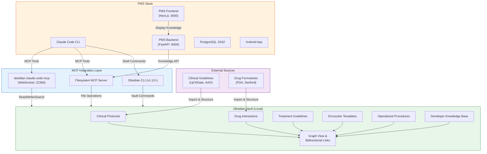

# Product Requirements Document: Obsidian + Claude Code Integration into Patient Management System (PMS)

**Document ID:** PRD-PMS-OBSIDIANCLAUDECODE-001
**Version:** 1.0
**Date:** 2026-03-09
**Author:** Ammar (CEO, MPS Inc.)
**Status:** Draft

---

## 1. Executive Summary

Obsidian is a local-first, markdown-based knowledge management application with 2,700+ community plugins, bidirectional linking, and a graph-based knowledge visualization engine. Since v1.12 (February 2026), Obsidian includes an official CLI that enables programmatic vault operations — search, note creation, template execution, and plugin management — directly from the terminal.

Claude Code, Anthropic's AI-powered CLI development tool, can interact with Obsidian vaults through three integration paths: the filesystem MCP server (simplest — treats the vault as a directory of markdown files), dedicated Obsidian MCP plugins like `obsidian-claude-code-mcp` (richest — exposes workspace context, semantic search, and template execution), or embedded plugins like Claudian (deepest — runs Claude Code as a sidebar agent inside Obsidian). The Model Context Protocol (MCP) serves as the standardized bridge, exposing vault operations as discoverable tools.

Integrating Obsidian + Claude Code into the PMS creates an AI-powered clinical knowledge management layer where clinicians and developers maintain living documentation — clinical protocols, drug formularies, treatment guidelines, encounter templates, and operational procedures — in a local-first, version-controlled vault that Claude Code can read, search, synthesize, and update. This replaces fragmented knowledge silos (shared drives, wikis, email threads) with a unified, queryable knowledge base that feeds directly into clinical decision support workflows.

## 2. Problem Statement

PMS clinical knowledge is currently scattered across multiple systems: protocol PDFs on shared drives, drug interaction tables in spreadsheets, treatment guidelines in email chains, and operational procedures in disconnected wiki pages. When clinicians need to reference a protocol during an encounter, they leave the PMS to search external sources, breaking their workflow and introducing latency.

Developers face a parallel problem: architectural decisions, API contracts, deployment procedures, and debugging knowledge live in `docs/` but are not easily queryable in context. Claude Code's built-in memory (`CLAUDE.md`) provides session-level context, but lacks the rich bidirectional linking, graph visualization, and semantic search that a structured knowledge base provides.

The Obsidian + Claude Code integration addresses both gaps by creating a unified knowledge layer that:
- Gives clinicians instant, AI-powered access to clinical protocols during encounters
- Gives developers a queryable, interconnected knowledge graph of all PMS documentation
- Enables Claude Code to synthesize answers from the full knowledge base rather than individual files
- Keeps all data local-first (no PHI leaves the network) while enabling AI-assisted curation

## 3. Proposed Solution

### 3.1 Architecture Overview

### 3.2 Deployment Model

**Local-First Architecture**: Obsidian vaults are directories of plain-text markdown files stored on the developer or server filesystem. No cloud account required. All data stays on-premises.

**Docker Integration**: The Obsidian MCP server (`obsidian-claude-code-mcp`) runs as a Node.js process exposing WebSocket on port 22360. For server deployments, the vault directory is mounted as a Docker volume. The Filesystem MCP server provides a simpler alternative without requiring Obsidian to be running.

**Version Control**: The vault is a Git repository, committed and pushed alongside PMS code. Branch-based workflows enable collaborative editing with conflict resolution.

**HIPAA Considerations**:
- **No PHI in the vault**: The knowledge base contains protocols, guidelines, templates, and procedures — not patient data. Patient records remain exclusively in PostgreSQL.
- **Claude Code data transmission**: Claude Code sends vault content to Anthropic's servers for processing. Vault content must be limited to de-identified clinical knowledge (never PHI).
- **Access control**: Filesystem permissions and MCP server authentication restrict vault access to authorized users.
- **Audit logging**: All Claude Code interactions with the vault are logged via the PMS audit infrastructure.

## 4. PMS Data Sources

The Obsidian knowledge base interacts with PMS APIs through Claude Code as an intermediary:

- **Patient Records API (`/api/patients`)** — Not directly accessed. The knowledge base provides clinical protocol references that Claude Code uses when generating patient-facing content or clinical decision support recommendations.
- **Encounter Records API (`/api/encounters`)** — Encounter templates stored in the vault are referenced when Claude Code assists with encounter documentation. Template selection is based on encounter type and specialty.
- **Medication & Prescription API (`/api/prescriptions`)** — Drug interaction notes, formulary summaries, and dosing guidelines in the vault inform Claude Code's medication-related recommendations. Cross-referenced with Sanford Guide (Experiment 11) and Kintsugi (Experiment 35) data.
- **Reporting API (`/api/reports`)** — Operational procedure documentation in the vault guides Claude Code when generating or interpreting clinical reports. Report templates and metric definitions are maintained as vault notes.

## 5. Component/Module Definitions

### 5.1 Knowledge Vault Service

**Description**: FastAPI service that exposes vault content through a REST API for PMS backend consumption. Wraps the Filesystem MCP server with authentication, caching, and HIPAA audit logging.

**Input**: Search queries, note paths, tag filters
**Output**: Markdown content, search results, graph relationships
**PMS APIs Used**: None directly — serves as a data source for other PMS services

### 5.2 Obsidian MCP Bridge

**Description**: MCP server configuration connecting Claude Code to the Obsidian vault. Supports dual transport: WebSocket (port 22360) for Claude Code CLI and HTTP/SSE for Claude Desktop.

**Input**: MCP tool calls (read_note, write_note, search, get_backlinks)
**Output**: Note content, search results, vault structure
**PMS APIs Used**: None — operates at the Claude Code tool layer

### 5.3 Clinical Protocol Index

**Description**: A structured index of all clinical protocols, treatment guidelines, and drug interaction notes in the vault. Automatically maintained by Claude Code via hooks that trigger on vault changes.

**Input**: Vault file change events
**Output**: Updated index with categories, tags, cross-references
**PMS APIs Used**: `/api/encounters` (for encounter type mapping), `/api/prescriptions` (for drug name normalization)

### 5.4 Knowledge Search Panel

**Description**: Next.js component embedded in the PMS frontend that allows clinicians to search the knowledge base during encounters. Queries the Knowledge Vault Service API.

**Input**: Free-text search queries, tag filters, encounter context
**Output**: Relevant protocol excerpts, related notes, graph visualization
**PMS APIs Used**: `/api/encounters` (for context-aware search), Knowledge Vault Service API

### 5.5 Vault Sync Agent

**Description**: Claude Code automation (headless mode) that periodically imports and structures external clinical guidelines into the vault. Runs on a schedule via cron or CI/CD.

**Input**: External guideline sources (PDF, web pages)
**Output**: Structured markdown notes with frontmatter, tags, and backlinks
**PMS APIs Used**: None — operates on external sources

## 6. Non-Functional Requirements

### 6.1 Security and HIPAA Compliance

| Requirement | Implementation |
|---|---|
| PHI isolation | Vault contains only de-identified clinical knowledge — never patient data |
| Encryption at rest | Vault directory on LUKS-encrypted volume; Git repo uses SSH transport |
| Encryption in transit | MCP WebSocket over TLS (WSS); HTTPS for Knowledge Vault Service API |
| Access control | Filesystem permissions (Unix ACLs); MCP server API key authentication |
| Audit logging | All vault reads/writes logged to PMS audit table with user, timestamp, action, note path |
| Data classification | Vault notes tagged with `classification: public|internal|restricted` in frontmatter |
| Claude Code boundaries | `CLAUDE.md` restricts Claude Code to vault directory; no access to patient data paths |

### 6.2 Performance

| Metric | Target |
|---|---|
| Search latency (full-text) | < 200ms for vaults up to 10,000 notes |
| Search latency (semantic) | < 500ms with embedding index |
| Note read/write | < 50ms per operation |
| Graph traversal (backlinks) | < 100ms for 3-hop queries |
| Vault sync (external import) | < 5 minutes for 100 guidelines |
| Knowledge Search Panel render | < 300ms from query to display |

### 6.3 Infrastructure

| Component | Resource Requirements |
|---|---|
| Obsidian MCP Server | Node.js 18+, 256 MB RAM, port 22360 |
| Knowledge Vault Service | FastAPI container, 512 MB RAM, port 8001 |
| Vault storage | 1-10 GB depending on vault size (text-only) |
| Embedding index (optional) | 2 GB RAM for 10K notes, requires `pgvector` or local embedding model |
| Obsidian Desktop (optional) | Electron app, 512 MB RAM — only needed for graph visualization and manual editing |

## 7. Implementation Phases

### Phase 1: Foundation (Sprints 1-2)

- Set up Obsidian vault directory structure for PMS knowledge base
- Configure Filesystem MCP server for Claude Code access
- Create initial vault content: clinical protocol templates, drug interaction notes, encounter templates
- Implement Knowledge Vault Service (FastAPI) with read and search endpoints
- Add HIPAA audit logging for all vault operations

### Phase 2: Core Integration (Sprints 3-4)

- Install and configure `obsidian-claude-code-mcp` plugin for rich vault interaction
- Build Knowledge Search Panel in Next.js frontend
- Implement Vault Sync Agent for automated external guideline import
- Create Clinical Protocol Index with auto-update hooks
- Integrate with existing PMS encounter workflow (context-aware protocol suggestions)

### Phase 3: Advanced Features (Sprints 5-6)

- Add semantic search with embeddings (pgvector or local model)
- Build graph visualization component for protocol relationships
- Implement Obsidian CLI integration for vault analytics (orphan detection, link health)
- Create Android knowledge search widget
- Set up CI/CD pipeline for vault content validation and deployment

## 8. Success Metrics

| Metric | Target | Measurement Method |
|---|---|---|
| Protocol lookup time | < 10 seconds (vs 2+ minutes manual) | Time-to-answer tracking in Knowledge Search Panel |
| Knowledge base coverage | 90% of clinical protocols documented | Vault content audit against protocol registry |
| Developer documentation queries | 50% reduction in Slack questions | Slack analytics + vault search logs |
| Vault freshness | All notes updated within 30 days | Frontmatter `last_updated` field monitoring |
| Clinician adoption | 60% of clinicians use Knowledge Search Panel weekly | Usage analytics |
| Claude Code knowledge accuracy | 95% factual accuracy in vault-sourced answers | Quarterly spot-check audit |

## 9. Risks and Mitigations

| Risk | Impact | Mitigation |
|---|---|---|
| PHI accidentally added to vault | HIPAA violation, data breach | Pre-commit hook scanning for PHI patterns (SSN, MRN, DOB); vault content classification in frontmatter; quarterly audit |
| Stale clinical protocols | Incorrect clinical guidance | Automated freshness alerts; Vault Sync Agent for external updates; review workflow with clinical sign-off |
| Claude Code hallucination from vault context | Incorrect clinical recommendations | All AI-generated clinical content requires clinician review; confidence scoring; source attribution |
| Obsidian plugin ecosystem instability | Integration breakage on updates | Pin plugin versions; Filesystem MCP as fallback (no Obsidian dependency); integration tests in CI |
| Large vault performance degradation | Slow search, high memory | Vault size limits; archival policy for old notes; indexed search with SQLite FTS5 |
| Developer adoption resistance | Low ROI on knowledge investment | Gradual migration; Claude Code auto-populates vault from existing docs; immediate search benefits |

## 10. Dependencies

| Dependency | Version | Purpose |
|---|---|---|
| Obsidian Desktop | v1.12+ | Graph visualization, manual editing, plugin host (optional) |
| Obsidian CLI | v1.12+ | Programmatic vault operations |
| `obsidian-claude-code-mcp` | Latest | MCP bridge for Claude Code (WebSocket :22360) |
| Claude Code CLI | Latest | AI-powered vault interaction |
| Node.js | 18+ | MCP server runtime |
| FastAPI | 0.100+ | Knowledge Vault Service |
| PostgreSQL + pgvector | 16+ / 0.7+ | Semantic search embedding storage (Phase 3) |
| Git | 2.40+ | Vault version control |

## 11. Comparison with Existing Experiments

| Aspect | Experiment 59 (Obsidian + Claude Code) | Experiment 09 (MCP) | Experiment 27 (Claude Code) | Experiment 36 (Context Mode) |
|---|---|---|---|---|
| **Focus** | Clinical knowledge management | Protocol standardization | Development workflow | Context optimization |
| **Data type** | Clinical protocols, guidelines, procedures | API contracts, tool definitions | Code, configuration | Session context |
| **Storage** | Local markdown vault (Git-versioned) | MCP server endpoints | CLAUDE.md, memory files | SQLite FTS5 index |
| **AI interaction** | Read/write/search/synthesize vault content | Expose PMS APIs as MCP tools | Direct file operations | Compressed context injection |
| **Complementary** | Uses MCP (Exp 09) as transport; extends Claude Code (Exp 27) with structured knowledge; feeds Context Mode (Exp 36) with indexed content | Provides transport layer for vault access | Provides the AI agent that operates on the vault | Could index vault content for extended sessions |

**Key differentiator**: Obsidian + Claude Code creates a **persistent, interconnected knowledge graph** with bidirectional links, graph visualization, and semantic search — capabilities that flat file systems and session-scoped memory lack. It transforms PMS documentation from static files into a living, AI-queryable knowledge base.

## 12. Research Sources

### Official Documentation
- [Obsidian Help — CLI](https://help.obsidian.md/cli) — Official CLI documentation for v1.12+ vault operations
- [Obsidian Plugins Directory](https://obsidian.md/plugins) — 2,700+ community plugin ecosystem

### Architecture & Integration
- [3 Ways to Use Obsidian with Claude Code](https://awesomeclaude.ai/how-to/use-obsidian-with-claude) — Filesystem MCP, Obsidian MCP plugin, and embedded approaches
- [obsidian-claude-code-mcp (GitHub)](https://github.com/iansinnott/obsidian-claude-code-mcp) — Dual-transport MCP server plugin for Obsidian
- [Claudian (GitHub)](https://github.com/YishenTu/claudian) — Embedded Claude Code sidebar with permission modes

### Security & Compliance
- [HIPAA Requirements and Obsidian Primer](https://publish.obsidian.md/hub/04+-+Guides,+Workflows,+&+Courses/Guides/HIPAA+Requirements+and+Obsidian+Primer) — HIPAA feasibility analysis for Obsidian vaults
- [Is Obsidian HIPAA Compliant? (2025 Update)](https://www.paubox.com/blog/is-obsidian-hipaa-compliant-2025-update) — Compliance assessment and mitigation strategies

### Ecosystem & Workflows
- [Build Your Second Brain With Claude Code & Obsidian](https://www.whytryai.com/p/claude-code-obsidian) — COG framework for AI-powered knowledge management
- [MCP-Obsidian.org](https://mcp-obsidian.org/) — Universal AI bridge with 14 vault operation methods
- [Obsidian AI Second Brain Complete Guide 2026](https://www.nxcode.io/resources/news/obsidian-ai-second-brain-complete-guide-2026) — Comprehensive AI integration patterns

## 13. Appendix: Related Documents

- [Obsidian + Claude Code Setup Guide](59-ObsidianClaudeCode-PMS-Developer-Setup-Guide.md)
- [Obsidian + Claude Code Developer Tutorial](59-ObsidianClaudeCode-Developer-Tutorial.md)
- [MCP PMS Integration (Experiment 09)](09-PRD-MCP-PMS-Integration.md)
- [Claude Code Developer Tutorial (Experiment 27)](27-ClaudeCode-Developer-Tutorial.md)
- [Claude Context Mode (Experiment 36)](36-PRD-ClaudeContextMode-PMS-Integration.md)
- [Obsidian Official Documentation](https://help.obsidian.md/)
