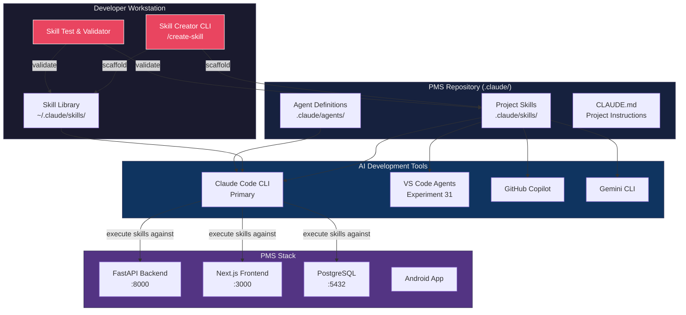

# Product Requirements Document: Skill Creator Integration into Patient Management System (PMS)

**Document ID:** PRD-PMS-SKILLCREATOR-001
**Version:** 1.0
**Date:** 2026-03-09
**Author:** Ammar (CEO, MPS Inc.)
**Status:** Draft

---

## 1. Executive Summary

Skill Creator is a development framework and tooling layer for creating, managing, testing, and deploying custom Claude Code skills (slash commands). Skills are the primary extensibility mechanism in Claude Code — they turn team expertise, clinical workflows, and development conventions into reusable capabilities that Claude applies automatically or on demand. The [Agent Skills](https://agentskills.io) open standard, adopted by Claude Code, Copilot, Codex, Gemini CLI, and 10+ other tools, means skills built once can run across the entire AI-assisted development ecosystem.

Integrating a Skill Creator workflow into PMS development addresses a critical gap: while MPS already uses multiple custom skills (tech-research, ai-briefing, notebooklm-skills, commit, simplify), there is no standardized process for creating new skills, testing them, distributing them across the team, or validating that they meet HIPAA compliance requirements. A Skill Creator framework would accelerate PMS development by enabling any team member to encode clinical domain knowledge, regulatory patterns, and workflow best practices into skills that Claude can invoke automatically.

The Skill Creator integrates Anthropic's official [anthropics/skills](https://github.com/anthropics/skills) repository (which includes a built-in `skill-creator` skill), the community [agent-skill-creator](https://github.com/FrancyJGLisboa/agent-skill-creator) cross-platform installer framework, and PMS-specific templates and validation to provide a complete skill lifecycle: ideation, scaffolding, testing, validation, distribution, and maintenance.

## 2. Problem Statement

PMS development relies heavily on Claude Code skills for workflow automation (tech-research, ai-briefing), code quality (simplify), and domain-specific tasks (notebooklm-skills). However, creating new skills is currently ad-hoc:

- **No scaffolding**: Developers must manually create directory structures, write YAML frontmatter from memory, and guess at best practices for description wording, tool restrictions, and invocation control.
- **No testing framework**: Skills are tested by running them once and eyeballing results. There is no way to validate that a skill produces correct outputs for known inputs, handles edge cases, or respects HIPAA constraints.
- **No compliance validation**: Skills that interact with patient data have no automated check for PHI leakage, missing audit logging, or overly permissive tool access.
- **No cross-platform distribution**: Skills created for Claude Code don't automatically work in VS Code (Experiment 31), Copilot, or other AI tools used by different team members.
- **No version management**: Skills evolve but there's no versioning, changelog, or rollback mechanism.

These gaps slow down skill adoption and create risk in a healthcare-regulated environment where a poorly configured skill could expose PHI or bypass safety controls.

## 3. Proposed Solution

### 3.1 Architecture Overview

### 3.2 Deployment Model

- **Local-first**: Skill Creator runs entirely on the developer's workstation — no cloud services required. Skills are plain markdown files in `.claude/skills/` directories.
- **Version-controlled**: Project skills are committed to the PMS repository and distributed via `git pull`. Personal skills live in `~/.claude/skills/`.
- **Cross-platform installer**: The `install.sh` adapter (from agent-skill-creator) auto-detects installed AI tools and generates format adapters (`.mdc` for Cursor, `.md` rules for Windsurf) so one skill works everywhere.
- **HIPAA-safe by design**: Skill Creator templates include mandatory PHI handling sections, `allowed-tools` restrictions, and audit logging instructions. A validation step checks for common compliance gaps before a skill is committed.

## 4. PMS Data Sources

Skills created with the Skill Creator may interact with any PMS API depending on their purpose:

| API Endpoint | Typical Skill Use Case |
|:---|:---|
| `/api/patients` | Patient lookup skills, demographic validation, referral import workflows |
| `/api/encounters` | Encounter documentation skills, SOAP note generation, clinical summary |
| `/api/prescriptions` | Medication reconciliation skills, drug interaction checking, PA submission |
| `/api/reports` | Analytics skills, quality metric generation, compliance reporting |

The Skill Creator itself does not directly call PMS APIs — it generates skills that do. The scaffolding templates include API endpoint placeholders and PHI handling boilerplate for each data source.

## 5. Component/Module Definitions

### 5.1 Skill Scaffolder (`/create-skill`)

- **Description**: Interactive skill that guides the developer through creating a new skill. Asks for name, description, invocation mode, tool restrictions, and generates the complete directory structure.
- **Input**: Skill name, description, type (reference/task/mode), invocation control (user-only, model-only, both), target platforms.
- **Output**: Populated `SKILL.md` with YAML frontmatter, optional supporting files (template.md, examples/, scripts/), and cross-platform install script.
- **PMS APIs**: None directly.

### 5.2 Skill Validator (`/validate-skill`)

- **Description**: Validates a skill's structure, frontmatter, and content against PMS conventions and HIPAA requirements.
- **Input**: Path to a skill directory.
- **Output**: Validation report with pass/fail for: frontmatter completeness, description quality, tool restriction safety, PHI handling, audit logging presence, and cross-platform compatibility.
- **PMS APIs**: None directly.

### 5.3 Skill Test Runner (`/test-skill`)

- **Description**: Runs a skill against predefined test cases and compares output structure to expected patterns.
- **Input**: Skill path, test case definitions (YAML/JSON), expected output patterns.
- **Output**: Test results with pass/fail, diff against expected, and coverage report.
- **PMS APIs**: Depends on the skill being tested.

### 5.4 Skill Registry (`/list-skills`)

- **Description**: Catalogs all available skills across personal, project, and plugin scopes with metadata, usage statistics, and dependency information.
- **Input**: Optional filter (scope, tag, platform).
- **Output**: Formatted skill catalog with name, description, scope, invocation mode, last modified, and platform compatibility.
- **PMS APIs**: None.

### 5.5 PMS Skill Templates

- **Description**: Pre-built templates for common PMS skill categories: clinical workflow, API integration, compliance check, code generation, documentation, and testing.
- **Input**: Template selection during scaffolding.
- **Output**: Pre-populated SKILL.md with PMS-specific instructions, API endpoint references, and HIPAA boilerplate.
- **PMS APIs**: Template-dependent.

## 6. Non-Functional Requirements

### 6.1 Security and HIPAA Compliance

- Skills that access patient data MUST include `allowed-tools` restrictions limiting tool access to only what's necessary.
- Skill templates MUST include audit logging instructions for any operation that reads or modifies PHI.
- The Skill Validator MUST flag skills that request `Bash(*)` (unrestricted shell access) when interacting with PMS data.
- Skills MUST NOT embed credentials, API keys, or patient identifiers in SKILL.md files.
- Cross-platform adapters MUST NOT modify PHI handling requirements when converting between formats.
- All skill files are plain-text markdown — no compiled code — ensuring full auditability.

### 6.2 Performance

| Metric | Target |
|:---|:---|
| Skill scaffolding time | < 30 seconds |
| Skill validation time | < 10 seconds |
| Skill test execution | < 60 seconds per test case |
| Skill discovery/loading | < 2 seconds (Claude Code built-in) |
| Cross-platform install | < 15 seconds |

### 6.3 Infrastructure

- **Zero infrastructure**: All components are Claude Code skills themselves — no additional services, containers, or databases required.
- **Storage**: Skills are plain markdown files stored in the filesystem (< 1 MB per skill typically).
- **Dependencies**: Python 3.11+ (for validation scripts), Claude Code CLI, optionally `gh` CLI for publishing.

## 7. Implementation Phases

| Phase | Scope | Sprint Estimate |
|:---|:---|:---|
| **Phase 1: Foundation** | Skill Scaffolder (`/create-skill`) with interactive prompts, PMS skill templates (6 categories), and basic validation. | 1 sprint (2 weeks) |
| **Phase 2: Validation & Testing** | Skill Validator (`/validate-skill`) with HIPAA checks, Skill Test Runner (`/test-skill`) with YAML test cases, and Skill Registry (`/list-skills`). | 1 sprint (2 weeks) |
| **Phase 3: Distribution & Advanced** | Cross-platform installer integration, team skill registry repo, version management, skill composition patterns, and skill metrics dashboard. | 2 sprints (4 weeks) |

## 8. Success Metrics

| Metric | Target | Measurement Method |
|:---|:---|:---|
| Time to create a new skill | < 5 minutes (from idea to working skill) | Developer time tracking |
| Skill validation pass rate | > 90% on first attempt (with templates) | Validator output logs |
| HIPAA compliance violations in skills | 0 violations in production skills | Validator audit reports |
| Cross-platform skill compatibility | 100% of project skills work in Claude Code + VS Code | Platform test matrix |
| Team skill adoption | 3+ new project skills per month | Git commit history |
| Skill reuse across experiments | > 50% of new experiments use existing skills | Experiment docs review |

## 9. Risks and Mitigations

| Risk | Impact | Mitigation |
|:---|:---|:---|
| Skills with overly broad tool access expose PHI | High | Validator enforces `allowed-tools` restrictions; templates default to minimal permissions |
| Poorly written descriptions cause unwanted auto-invocation | Medium | Validator scores description specificity; `disable-model-invocation` default for task skills |
| Cross-platform adapter divergence | Medium | Agent Skills open standard ensures baseline compatibility; test matrix validates |
| Skill sprawl — too many overlapping skills | Low | Registry with tagging; periodic skill audit via `/list-skills` |
| Breaking changes in Claude Code skill API | Medium | Pin to Agent Skills spec version; monitor anthropics/skills repo releases |

## 10. Dependencies

| Dependency | Type | Notes |
|:---|:---|:---|
| Claude Code CLI | Runtime | Core skill execution engine |
| [Agent Skills Standard](https://agentskills.io) | Specification | Open standard for cross-platform skill format |
| [anthropics/skills](https://github.com/anthropics/skills) | Reference | Official skill examples and skill-creator skill |
| [agent-skill-creator](https://github.com/FrancyJGLisboa/agent-skill-creator) | Tool | Cross-platform installer for 14+ AI tools |
| Python 3.11+ | Runtime | Validation scripts |
| Git | Runtime | Version control for project skills |

## 11. Comparison with Existing Experiments

| Aspect | Experiment 24 (Knowledge Work Plugins) | Experiment 60 (Skill Creator) |
|:---|:---|:---|
| **Focus** | Packaging skills + hooks + MCP into a distributable plugin | Creating, testing, and validating individual skills |
| **Scope** | Plugin-level (bundle of skills) | Skill-level (individual skill lifecycle) |
| **HIPAA** | Plugin-wide compliance | Per-skill compliance validation |
| **Cross-platform** | Claude Code plugins only | Agent Skills standard (14+ tools) |
| **Relationship** | Skill Creator feeds skills into Plugins | Plugins distribute skills created by Skill Creator |

Experiment 60 is complementary to Experiment 24: the Skill Creator produces validated, well-structured skills that can then be bundled into Knowledge Work Plugins for team distribution.

Additionally, Experiment 19 (Superpowers) provides an opinionated development workflow that uses skills. The Skill Creator would enable the team to create custom Superpowers-style skills tailored to PMS clinical workflows.

## 12. Research Sources

### Official Documentation
- [Extend Claude with Skills — Claude Code Docs](https://code.claude.com/docs/en/skills) — Complete skill configuration reference including frontmatter fields, supporting files, invocation control, and advanced patterns
- [Agent Skills Standard](https://agentskills.io) — Open specification for cross-platform AI skill format

### Repositories & Tools
- [anthropics/skills (GitHub)](https://github.com/anthropics/skills) — Official Anthropic skill collection with skill-creator, document skills, and templates
- [agent-skill-creator (GitHub)](https://github.com/FrancyJGLisboa/agent-skill-creator) — Cross-platform installer supporting 14+ AI tools from one SKILL.md
- [awesome-claude-skills (GitHub)](https://github.com/travisvn/awesome-claude-skills) — Curated list of community skills and resources

### Architecture & Deep Dives
- [Claude Agent Skills: A First Principles Deep Dive](https://leehanchung.github.io/blogs/2025/10/26/claude-skills-deep-dive/) — Technical analysis of skill loading, context budgets, and invocation mechanics
- [Claude Code Skills: A Practical Guide](https://www.shareuhack.com/en/posts/claude-code-skills-guide/) — Practical guide to building reusable AI workflows with skills
- [Inside Claude Code Skills: Structure, Prompts, Invocation](https://mikhail.io/2025/10/claude-code-skills/) — Internal architecture analysis of skill discovery and frontmatter parsing

### Ecosystem & Adoption
- [Claude Code Merges Slash Commands Into Skills (Medium)](https://medium.com/@joe.njenga/claude-code-merges-slash-commands-into-skills-dont-miss-your-update-8296f3989697) — Migration guide from legacy commands to skills
- [Introducing Agent Skills (Anthropic)](https://www.anthropic.com/news/skills) — Official announcement of the Agent Skills standard

## 13. Appendix: Related Documents

- [Skill Creator Setup Guide](60-SkillCreator-PMS-Developer-Setup-Guide.md)
- [Skill Creator Developer Tutorial](60-SkillCreator-Developer-Tutorial.md)
- [Knowledge Work Plugins (Experiment 24)](24-PRD-KnowledgeWorkPlugins-PMS-Integration.md)
- [Superpowers (Experiment 19)](19-PRD-Superpowers-PMS-Integration.md)
- [Claude Code Tutorial (Experiment 27)](27-ClaudeCode-Developer-Tutorial.md)
- [Claude Code Skills Documentation](https://code.claude.com/docs/en/skills)
