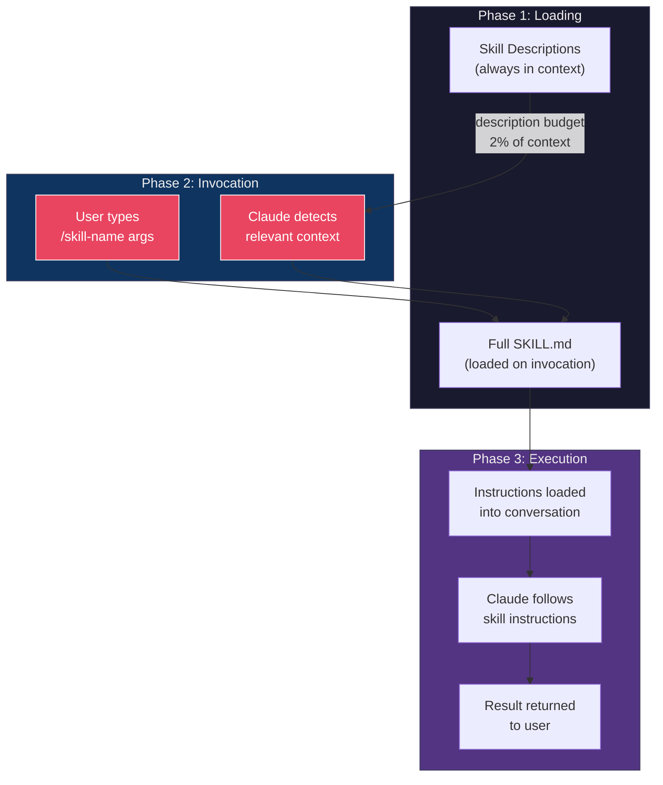
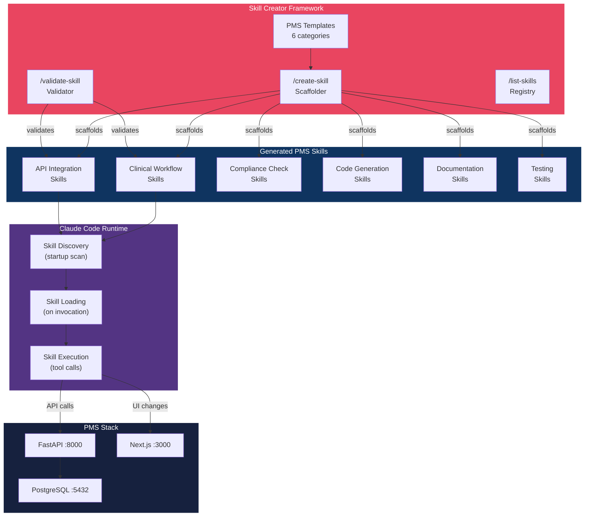

# Skill Creator Developer Onboarding Tutorial

**Welcome to the MPS PMS Skill Creator Integration Team**

This tutorial will take you from zero to building your first custom Claude Code skill for the PMS. By the end, you will understand how skills work, have a running skill development environment, and have built and tested a custom clinical workflow skill end-to-end.

**Document ID:** PMS-EXP-SKILLCREATOR-002
**Version:** 1.0
**Date:** 2026-03-09
**Applies To:** PMS project (all platforms)
**Prerequisite:** [Skill Creator Setup Guide](60-SkillCreator-PMS-Developer-Setup-Guide.md)
**Estimated time:** 2-3 hours
**Difficulty:** Beginner-friendly

---

## What You Will Learn

1. How Claude Code skills work — loading, invocation, and context injection
2. The SKILL.md anatomy — frontmatter, content, supporting files
3. How to choose between reference, task, and mode skills
4. How to scaffold a new skill using `/create-skill`
5. How to write effective descriptions that control auto-invocation
6. How to restrict tool access for HIPAA compliance
7. How to validate skills against PMS conventions
8. How to build a complete clinical workflow skill from scratch
9. How to add supporting files (templates, scripts, examples)
10. How to distribute skills across multiple AI tools

## Part 1: Understanding Skill Creator (15 min read)

### 1.1 What Problem Does Skill Creator Solve?

In the PMS project, developers frequently need to encode domain knowledge into repeatable workflows. Consider these scenarios:

- A developer needs to create a new FastAPI endpoint that follows PMS conventions (audit logging, HIPAA compliance, error handling). Today, they read existing code and copy patterns manually.
- The team wants every PR to include specific clinical safety checks. Today, a senior developer reviews manually.
- A new team member needs to understand how medication reconciliation works across three PMS subsystems. Today, they read scattered documentation.

**Skills solve this by encoding these workflows, conventions, and knowledge into reusable instructions that Claude follows automatically.** The Skill Creator makes it easy to create these skills correctly — with proper structure, HIPAA compliance, and cross-platform support — in minutes instead of hours.

### 1.2 How Skills Work — The Key Pieces



**Three phases:**
1. **Loading**: Claude Code scans skill directories at startup. Skill descriptions are loaded into context (within a 2% budget). Full content is NOT loaded yet.
2. **Invocation**: Either you type `/skill-name` (user invocation) or Claude decides the skill is relevant based on your conversation (model invocation).
3. **Execution**: The full SKILL.md content is injected into the conversation. Claude follows the instructions using the tools allowed by the skill.

### 1.3 How Skills Fit with Other PMS Technologies

| Technology | Experiment | Relationship to Skills |
|:---|:---|:---|
| Knowledge Work Plugins | Exp. 24 | Plugins bundle skills for distribution |
| Superpowers | Exp. 19 | Superpowers ARE skills (TDD, review, brainstorm) |
| Claude Code | Exp. 27 | Skills are a core Claude Code feature |
| MCP | Exp. 09 | MCP servers provide tools; skills provide instructions |
| VS Code Multi-Agent | Exp. 31 | VS Code agents discover project skills automatically |
| GitHub Agent HQ | Exp. 32 | AGENTS.md can reference skill conventions |

### 1.4 Key Vocabulary

| Term | Meaning |
|:---|:---|
| **Skill** | A folder containing a SKILL.md file with instructions for Claude |
| **SKILL.md** | The required entrypoint file with YAML frontmatter and markdown content |
| **Frontmatter** | YAML metadata between `---` markers (name, description, allowed-tools, etc.) |
| **User invocation** | Typing `/skill-name` to trigger a skill manually |
| **Model invocation** | Claude auto-loading a skill based on conversation context |
| **`disable-model-invocation`** | Frontmatter flag preventing Claude from auto-triggering a skill |
| **`user-invocable`** | Frontmatter flag controlling `/` menu visibility |
| **`allowed-tools`** | Whitelist of tools the skill can use without permission prompts |
| **`context: fork`** | Run a skill in an isolated subagent context |
| **`$ARGUMENTS`** | Placeholder for user input after the skill name |
| **Supporting files** | Additional files (templates, scripts, examples) in the skill directory |
| **Agent Skills standard** | Open specification for cross-platform skill format (agentskills.io) |

### 1.5 Our Architecture



## Part 2: Environment Verification (15 min)

### 2.1 Checklist

1. **Claude Code CLI installed and updated**:
   ```bash
   claude --version
   # Expected: 2.1.3 or later
   ```

2. **PMS repository cloned with Skill Creator set up**:
   ```bash
   ls .claude/skills/create-skill/SKILL.md
   # Expected: file exists
   ```

3. **Skill Creator skills visible**:
   ```bash
   ls .claude/skills/*/SKILL.md
   # Expected: create-skill, validate-skill, list-skills directories
   ```

4. **Python validator available**:
   ```bash
   python3 .claude/skills/validate-skill/scripts/validate.py --help 2>&1 || echo "Validator ready"
   # Expected: Usage message or "Validator ready"
   ```

5. **Templates available**:
   ```bash
   ls .claude/skills/create-skill/templates/
   # Expected: 6 template files
   ```

### 2.2 Quick Test

Run a quick smoke test to confirm everything works:

```bash
claude "What skills are available? List any that contain 'skill' in their name."
```

Expected: Claude lists `/create-skill`, `/validate-skill`, and `/list-skills` among available skills.

## Part 3: Build Your First Skill (45 min)

### 3.1 What We Are Building

We'll build a **Patient Encounter Summary** skill that:
- Takes an encounter ID as input
- Reads encounter data from the PMS API
- Generates a structured summary with diagnosis, medications, and follow-up
- Includes HIPAA-compliant audit logging
- Restricts tool access to read-only operations

This is a **task** skill — invoked manually by the developer, not auto-triggered.

### 3.2 Scaffold with `/create-skill`

```bash
claude "/create-skill encounter-summary task"
```

When prompted, provide:
- **Description**: "Generate a structured patient encounter summary with diagnosis, medications, and follow-up from PMS encounter data. Use when summarizing encounters, preparing handoff notes, or reviewing clinical documentation."
- **Invocation mode**: User-only (`disable-model-invocation: true`)
- **Tool restrictions**: `Read, Grep, Glob, Bash(curl *)`
- **Scope**: Project (`.claude/skills/`)
- **Template**: Clinical workflow

### 3.3 Review the Generated Scaffold

```bash
cat .claude/skills/encounter-summary/SKILL.md
```

The scaffolder should have created a SKILL.md based on the clinical workflow template. Review the output and note:
- Frontmatter includes `name`, `description`, `disable-model-invocation`, and `allowed-tools`
- Content includes workflow steps, API endpoints, and HIPAA section
- Template placeholders have been customized with encounter-specific content

### 3.4 Customize the Skill Content

Edit `.claude/skills/encounter-summary/SKILL.md` to add specific instructions:

```yaml
---
name: encounter-summary
description: Generate a structured patient encounter summary with diagnosis, medications, and follow-up from PMS encounter data. Use when summarizing encounters, preparing handoff notes, or reviewing clinical documentation.
disable-model-invocation: true
argument-hint: "[encounter-id]"
allowed-tools: Read, Grep, Glob, Bash(curl -s *)
---

# Generate Encounter Summary

Create a structured summary for encounter: $ARGUMENTS

## Step 1: Fetch Encounter Data

Read the encounter data from the PMS backend:

```bash
# Get encounter details
curl -s http://localhost:8000/api/encounters/$ARGUMENTS | python3 -m json.tool

# Get associated patient
curl -s http://localhost:8000/api/encounters/$ARGUMENTS/patient | python3 -m json.tool

# Get prescriptions for this encounter
curl -s http://localhost:8000/api/encounters/$ARGUMENTS/prescriptions | python3 -m json.tool
```

## Step 2: Generate Summary

Create a summary with these sections:

### Patient Demographics
- Name, Age, Sex (de-identify in output if sharing externally)

### Chief Complaint
- Reason for visit from encounter record

### Assessment & Diagnosis
- ICD-10 codes with descriptions
- Clinical reasoning

### Medications
- Current medications from prescription records
- Any changes made during this encounter
- Drug interaction warnings

### Plan & Follow-Up
- Treatment plan
- Follow-up schedule
- Referrals ordered

### Billing Codes
- CPT codes for services rendered
- Modifier codes if applicable

## Step 3: Output Format

```markdown
# Encounter Summary: {encounter_id}
**Date**: {encounter_date}
**Provider**: {provider_name}
**Status**: {encounter_status}

## Patient
{demographics — de-identified if sharing externally}

## Chief Complaint
{reason for visit}

## Assessment
{diagnoses with ICD-10 codes}

## Medications
| Medication | Dose | Frequency | Status |
|:-----------|:-----|:----------|:-------|

## Plan
{treatment plan and follow-up}

## Billing
| CPT Code | Description | Modifiers |
|:---------|:-----------|:----------|
```

## HIPAA Requirements

- Do NOT include the full output in conversation logs
- De-identify patient demographics when sharing summaries externally
- Log this summary generation via POST /api/audit/log with action "encounter_summary_generated"
- Do NOT store summaries outside the PMS system
- Restrict output to the requesting provider's authorization level
```

### 3.5 Add an Example Output

Create `.claude/skills/encounter-summary/examples/sample-summary.md`:

```markdown
# Encounter Summary: ENC-2026-00142
**Date**: 2026-03-09
**Provider**: Dr. Sarah Chen
**Status**: Completed

## Patient
Jane D., 67F (MRN redacted for de-identification)

## Chief Complaint
Routine follow-up for wet age-related macular degeneration (AMD), right eye.

## Assessment
- H35.3211 — Exudative AMD, right eye, with active choroidal neovascularization
- E11.9 — Type 2 diabetes mellitus without complications (stable)

## Medications
| Medication | Dose | Frequency | Status |
|:-----------|:-----|:----------|:-------|
| Eylea (aflibercept) | 2mg/0.05mL | q8 weeks intravitreal | Continued |
| Metformin | 500mg | BID oral | No change |

## Plan
- Continue Eylea injections per treat-and-extend protocol
- OCT imaging in 8 weeks prior to next injection
- Monitor for injection-related complications
- HbA1c recheck at next PCP visit

## Billing
| CPT Code | Description | Modifiers |
|:---------|:-----------|:----------|
| 67028 | Intravitreal injection | RT |
| 92134 | OCT retina | 26, RT |
| 99214 | E/M established, moderate | — |
```

### 3.6 Validate the Skill

```bash
# Using the interactive validator
claude "/validate-skill .claude/skills/encounter-summary"

# Or using the Python script
python3 .claude/skills/validate-skill/scripts/validate.py .claude/skills/encounter-summary
```

Expected: All checks PASS. The skill has proper frontmatter, tool restrictions, HIPAA section, and reasonable content length.

**Checkpoint**: You've built a complete encounter summary skill with proper structure, HIPAA compliance, example output, and validation.

## Part 4: Evaluating Strengths and Weaknesses (15 min)

### 4.1 Strengths

- **Zero infrastructure**: Skills are plain markdown files — no servers, databases, or build steps
- **Instant feedback loop**: Edit SKILL.md, invoke `/skill-name`, see results immediately (live reload)
- **Composability**: Claude can combine multiple skills in a single session automatically
- **Cross-platform**: Agent Skills standard works across 14+ AI development tools
- **Version controlled**: Skills live in `.claude/skills/` and are committed to git like any other code
- **Progressive disclosure**: Descriptions load at startup; full content loads only when invoked (efficient context use)
- **Team distribution**: Project skills in `.claude/skills/` are shared automatically via `git pull`

### 4.2 Weaknesses

- **No runtime isolation**: Skills execute in the same context as the conversation — a poorly written skill can pollute the context window
- **Description sensitivity**: Auto-invocation depends heavily on description wording — too vague triggers false positives, too specific triggers nothing
- **Context budget limits**: With many skills, descriptions may exceed the 2% context budget, causing skills to be silently excluded
- **No built-in testing**: There's no native "skill test" framework — validation is manual or custom-built
- **Markdown-only instructions**: Complex logic is hard to express in markdown; workarounds include bundled scripts
- **No access control**: Anyone with repo access can modify project skills — no approval workflow for skill changes

### 4.3 When to Use Skills vs Alternatives

| Scenario | Best Approach |
|:---|:---|
| Encode team conventions and coding patterns | **Skill** (reference type) |
| Automate a multi-step workflow (deploy, commit, review) | **Skill** (task type, `disable-model-invocation`) |
| Provide background domain knowledge | **Skill** (`user-invocable: false`) |
| Expose PMS data to AI tools | **MCP Server** (Experiment 09) |
| Bundle skills + hooks + MCP for distribution | **Plugin** (Experiment 24) |
| Orchestrate multiple agents on a complex task | **Subagents / Agent Teams** (Experiment 14) |
| Enforce process gates (must run tests before commit) | **Hooks** (Claude Code hooks) |
| Store persistent project context | **CLAUDE.md** (memory files) |

### 4.4 HIPAA / Healthcare Considerations

**Low risk — skills are instructions, not data stores:**
- Skills are plain-text markdown files that contain instructions, not patient data
- They are committed to version control and fully auditable
- The `allowed-tools` restriction limits what operations a skill can trigger
- Skills should never contain real PHI — only references to API endpoints that serve PHI

**Medium risk — execution context:**
- When a skill fetches patient data via API calls, that data enters the Claude conversation context
- Conversation data may be sent to Anthropic's servers (unless using a self-hosted deployment)
- Mitigation: Use de-identified data for development; production skills should use PHI de-identification gateways (Experiment 36)

**Risk checklist for every clinical skill:**
1. Does the skill access PHI? If yes, `allowed-tools` must be restricted
2. Does the skill output PHI? If yes, audit logging is required
3. Does the skill store data? Skills should never persist data — delegate to PMS APIs
4. Is the skill auto-invocable? Clinical skills should default to `disable-model-invocation: true`

## Part 5: Debugging Common Issues (15 min read)

### Issue 1: Skill not found after creation

**Symptom**: `/encounter-summary` doesn't appear in autocomplete.

**Cause**: SKILL.md has invalid frontmatter (often a missing `---` delimiter or tab character).

**Fix**:
```bash
# Check for tabs (should be spaces only)
cat -A .claude/skills/encounter-summary/SKILL.md | head -10
# Look for ^I (tab characters) — replace with spaces

# Validate YAML
python3 -c "
import yaml
with open('.claude/skills/encounter-summary/SKILL.md') as f:
    content = f.read()
    fm = content.split('---')[1]
    print(yaml.safe_load(fm))
"
```

### Issue 2: Skill auto-invokes inappropriately

**Symptom**: Claude loads your skill when you're talking about something unrelated.

**Cause**: Description is too broad (e.g., "helps with patient data" matches many conversations).

**Fix**: Make the description more specific:
```yaml
# Bad: too broad
description: Helps with patient data and encounters

# Good: specific trigger context
description: Generate a structured encounter summary with diagnosis codes, medications, and follow-up plan. Use when the user asks to summarize a specific encounter by ID.
```

### Issue 3: Tool permission denied during skill execution

**Symptom**: Claude says it can't use a tool when running your skill.

**Cause**: The `allowed-tools` field doesn't include the tool Claude needs.

**Fix**: Add the missing tool to `allowed-tools`:
```yaml
# Before (too restrictive)
allowed-tools: Read, Grep

# After (includes Bash for API calls)
allowed-tools: Read, Grep, Glob, Bash(curl -s *)
```

Note: `Bash(curl -s *)` is safer than `Bash(*)` — it only allows `curl` with the silent flag.

### Issue 4: `$ARGUMENTS` not being replaced

**Symptom**: Claude sees the literal text `$ARGUMENTS` instead of the user's input.

**Cause**: You're using `$ARGUMENTS` inside a fenced code block. String substitution doesn't work inside code blocks.

**Fix**: Move `$ARGUMENTS` references outside code blocks, or use them in the prose instructions where Claude reads them directly.

### Issue 5: Skill content exceeds context budget

**Symptom**: Skill appears to load but Claude doesn't follow all instructions.

**Cause**: SKILL.md is too long (500+ lines) and gets truncated.

**Fix**: Move detailed reference material to supporting files:
```
encounter-summary/
├── SKILL.md           # Core instructions (< 200 lines)
├── reference.md       # Detailed API docs
├── examples/
│   └── sample.md      # Example outputs
└── scripts/
    └── fetch-data.sh  # Data retrieval script
```

Reference them from SKILL.md:
```markdown
For detailed API response formats, see [reference.md](reference.md).
For example output, see [examples/sample.md](examples/sample.md).
```

## Part 6: Practice Exercises (45 min)

### Option A: Build a Medication Interaction Checker Skill

Create a skill that:
- Takes two medication names as arguments
- Queries the PMS prescriptions API
- Checks for known drug interactions
- Outputs a structured interaction report with severity level

**Hints**:
1. Use the `clinical-workflow` template from `/create-skill`
2. Reference `/api/prescriptions` and `/api/prescriptions/interactions`
3. Make it `disable-model-invocation: true` (task skill)
4. Restrict tools to `Read, Grep, Glob, Bash(curl -s *)`
5. Include a HIPAA section about medication data handling

### Option B: Build a PR Review Checklist Skill

Create a skill that:
- Auto-triggers when Claude sees a code review context (model-invocable)
- Reads the changed files in the current branch
- Checks for PMS coding conventions, HIPAA compliance, and test coverage
- Outputs a checklist with pass/fail for each criterion

**Hints**:
1. Use the `compliance-check` template
2. Leave `disable-model-invocation` as default (false) so it auto-triggers
3. Use `allowed-tools: Read, Grep, Glob, Bash(git diff *), Bash(git log *)`
4. Include checks specific to PMS: audit logging, parameterized queries, no hardcoded PHI

### Option C: Build a FHIR Resource Generator Skill

Create a skill that:
- Takes a resource type (Patient, Encounter, MedicationRequest) as argument
- Generates a FHIR R4-compliant JSON resource from PMS data
- Validates the output against the FHIR spec
- Links to Experiment 16 (FHIR) for full integration

**Hints**:
1. Use the `code-generation` template
2. Make it `disable-model-invocation: true`
3. Reference the FHIR R4 spec and Experiment 16 documents
4. Include example FHIR JSON in `examples/`
5. Use `allowed-tools: Read, Write, Grep, Glob, Bash(curl -s *)`

## Part 7: Development Workflow and Conventions

### 7.1 File Organization

```
.claude/
├── skills/                          # Project skills (shared via git)
│   ├── create-skill/                # Skill scaffolder
│   │   ├── SKILL.md
│   │   └── templates/               # 6 PMS templates
│   ├── validate-skill/              # Skill validator
│   │   ├── SKILL.md
│   │   └── scripts/
│   │       └── validate.py
│   ├── list-skills/                 # Skill registry
│   │   └── SKILL.md
│   └── {your-skills}/               # Custom skills
│       ├── SKILL.md
│       ├── examples/
│       └── scripts/
├── agents/                          # Custom subagent definitions
└── CLAUDE.md                        # Project-level Claude instructions

~/.claude/
└── skills/                          # Personal skills (all projects)
    └── {personal-skills}/
        └── SKILL.md
```

### 7.2 Naming Conventions

| Item | Convention | Example |
|:---|:---|:---|
| Skill directory | lowercase-kebab-case | `encounter-summary` |
| Skill name (frontmatter) | lowercase-kebab-case | `encounter-summary` |
| Template files | lowercase-kebab-case.md | `clinical-workflow.md` |
| Script files | lowercase-kebab-case.py/sh | `validate.py` |
| Example files | descriptive-name.md | `sample-summary.md` |
| Supporting reference | reference.md or REFERENCE.md | `reference.md` |

### 7.3 PR Checklist

When submitting a PR that adds or modifies a skill:

- [ ] SKILL.md has valid YAML frontmatter (no tabs, proper `---` delimiters)
- [ ] `description` is specific and at least 20 characters
- [ ] `allowed-tools` is set (not unrestricted)
- [ ] If skill accesses patient data: HIPAA section is present
- [ ] If task skill: `disable-model-invocation: true` is set
- [ ] No hardcoded credentials or PHI in any skill files
- [ ] Python validator passes: `python3 .claude/skills/validate-skill/scripts/validate.py .claude/skills/{skill-name}`
- [ ] Skill tested manually with representative inputs
- [ ] Example output included in `examples/` directory
- [ ] `docs/index.md` updated if this is a new experiment skill

### 7.4 Security Reminders

1. **Never embed PHI in skill files** — use API references, not data
2. **Restrict tool access** — `Bash(curl -s *)` is safer than `Bash(*)`
3. **Use `disable-model-invocation`** for any skill that writes data or has side effects
4. **Audit all data operations** — include POST /api/audit/log in skill instructions
5. **De-identify examples** — sample outputs must use synthetic data only
6. **Review before commit** — skill changes should be reviewed like any code change
7. **Test with synthetic data** — never use real patient data during skill development

## Part 8: Quick Reference Card

### Key Commands

| Command | Action |
|:---|:---|
| `/create-skill name type` | Scaffold a new skill |
| `/validate-skill path` | Validate a skill |
| `/list-skills` | List all available skills |
| `/skill-name args` | Invoke any skill |
| `claude "What skills are available?"` | Check skill discovery |
| `claude "/context"` | Check context budget |

### Key Files

| File | Purpose |
|:---|:---|
| `.claude/skills/{name}/SKILL.md` | Skill entrypoint (required) |
| `.claude/skills/{name}/reference.md` | Detailed reference docs |
| `.claude/skills/{name}/examples/*.md` | Example outputs |
| `.claude/skills/{name}/scripts/*.py` | Helper scripts |
| `.claude/skills/create-skill/templates/` | PMS skill templates |

### Key Frontmatter Fields

```yaml
---
name: my-skill                        # Skill identifier (slash command name)
description: What it does and when     # Required for discovery
disable-model-invocation: true         # User-only invocation
user-invocable: false                  # Claude-only invocation
allowed-tools: Read, Grep, Glob       # Tool whitelist
argument-hint: "[arg1] [arg2]"         # Autocomplete hint
context: fork                          # Run in isolated subagent
agent: Explore                         # Subagent type (with context: fork)
model: claude-sonnet-4-6              # Override model
---
```

### Starter Template

```yaml
---
name: my-pms-skill
description: Describe what this skill does and when to use it (be specific).
disable-model-invocation: true
allowed-tools: Read, Grep, Glob
---

# My PMS Skill

## Purpose
{What this skill does}

## Steps
1. {Step 1}
2. {Step 2}
3. {Step 3}

## HIPAA Requirements
- Do NOT log PHI in plain text
- Audit all data access operations
- Use de-identified data for examples

## Output Format
{Expected output structure}
```

## Next Steps

1. **Build a skill for your current feature work** — identify a repeatable workflow and encode it
2. **Review the [Skill Creator Setup Guide](60-SkillCreator-PMS-Developer-Setup-Guide.md)** for CI integration with the Python validator
3. **Explore [anthropics/skills](https://github.com/anthropics/skills)** for community patterns and the official skill-creator skill
4. **Read [Experiment 24 (Knowledge Work Plugins)](24-PRD-KnowledgeWorkPlugins-PMS-Integration.md)** for bundling skills into distributable plugins
5. **Contribute your skill** — commit to `.claude/skills/`, open a PR, and add to the team's shared toolkit
