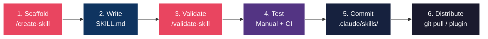

# Skill Creator Setup Guide for PMS Integration

**Document ID:** PMS-EXP-SKILLCREATOR-001
**Version:** 1.0
**Date:** 2026-03-09
**Applies To:** PMS project (all platforms)
**Prerequisites Level:** Beginner

---

## Table of Contents

1. [Overview](#1-overview)
2. [Prerequisites](#2-prerequisites)
3. [Part A: Install the Skill Creator Skill](#3-part-a-install-the-skill-creator-skill)
4. [Part B: Create PMS Skill Templates](#4-part-b-create-pms-skill-templates)
5. [Part C: Build the Skill Validator](#5-part-c-build-the-skill-validator)
6. [Part D: Cross-Platform Distribution](#6-part-d-cross-platform-distribution)
7. [Part E: Testing and Verification](#7-part-e-testing-and-verification)
8. [Troubleshooting](#8-troubleshooting)
9. [Reference Commands](#9-reference-commands)
10. [Next Steps](#10-next-steps)
11. [Resources](#11-resources)

## 1. Overview

This guide walks you through setting up the complete Skill Creator framework for PMS development. By the end, you will have:

- A `/create-skill` command that scaffolds new skills with PMS conventions
- A `/validate-skill` command that checks HIPAA compliance and structure
- Six PMS-specific skill templates (clinical workflow, API integration, compliance, code generation, documentation, testing)
- Cross-platform distribution so skills work in Claude Code, VS Code, and Copilot
- A skill registry for cataloging and managing all project skills



## 2. Prerequisites

### 2.1 Required Software

| Software | Minimum Version | Check Command |
|:---|:---|:---|
| Claude Code CLI | 2.1.3+ | `claude --version` |
| Python | 3.11+ | `python3 --version` |
| Git | 2.30+ | `git --version` |
| Node.js | 18+ (for Next.js frontend skills) | `node --version` |
| gh CLI | 2.0+ (optional, for publishing) | `gh --version` |

### 2.2 Installation of Prerequisites

**Claude Code CLI** (if not installed):

```bash
npm install -g @anthropic-ai/claude-code
```

**Python** (if below 3.11):

```bash
# macOS
brew install python@3.12

# Verify
python3 --version
```

### 2.3 Verify PMS Services

Confirm the PMS stack is running:

```bash
# Backend
curl -s http://localhost:8000/health | python3 -m json.tool

# Frontend
curl -s http://localhost:3000 -o /dev/null -w "%{http_code}"

# PostgreSQL
pg_isready -h localhost -p 5432
```

Expected: Backend returns `{"status": "healthy"}`, frontend returns `200`, PostgreSQL returns `accepting connections`.

## 3. Part A: Install the Skill Creator Skill

### Step 1: Create the Skill Creator directory structure

```bash
# Project-level skill (shared with team via git)
mkdir -p .claude/skills/create-skill/{templates,scripts,examples}
```

### Step 2: Write the Skill Creator SKILL.md

Create `.claude/skills/create-skill/SKILL.md`:

```yaml
---
name: create-skill
description: Scaffold a new Claude Code skill with PMS conventions, HIPAA compliance boilerplate, and cross-platform support. Use when creating a new skill, command, or workflow automation.
disable-model-invocation: true
argument-hint: "[skill-name] [type: reference|task|mode]"
allowed-tools: Read, Write, Glob, Grep, Bash(mkdir *), Bash(ls *)
---

# Create a New PMS Skill

You are creating a new Claude Code skill for the PMS project. Follow these steps precisely.

## Step 1: Gather Requirements

Ask the developer for:
1. **Skill name** (lowercase, hyphens only, max 64 chars): $ARGUMENTS[0]
2. **Skill type** (reference, task, or mode): $ARGUMENTS[1]
3. **Description** (1-2 sentences, specific about when to use)
4. **Invocation mode**:
   - Both user and Claude (default)
   - User-only (`disable-model-invocation: true`) — for skills with side effects
   - Claude-only (`user-invocable: false`) — for background knowledge
5. **Tool restrictions** (`allowed-tools`) — default to minimal: `Read, Grep, Glob`
6. **Scope**: Project (`.claude/skills/`) or Personal (`~/.claude/skills/`)

## Step 2: Scaffold the Directory

Create the skill directory with this structure:

```
{scope}/{skill-name}/
├── SKILL.md           # Main instructions (required)
├── examples/          # Example outputs
│   └── sample.md
└── scripts/           # Optional helper scripts
```

## Step 3: Generate SKILL.md

Use the appropriate PMS template from `${CLAUDE_SKILL_DIR}/templates/`:
- `clinical-workflow.md` — for patient care and encounter workflows
- `api-integration.md` — for PMS API endpoint interactions
- `compliance-check.md` — for HIPAA/regulatory validation
- `code-generation.md` — for generating PMS code patterns
- `documentation.md` — for docs, reports, and analysis
- `testing.md` — for test generation and validation

Read the selected template and customize it with the developer's requirements.

## Step 4: HIPAA Compliance Section

Every skill that may interact with patient data MUST include:

```markdown
## HIPAA Requirements
- Do NOT log, print, or store PHI (patient names, DOBs, MRNs, SSNs) in plain text
- Use `allowed-tools` to restrict access to only necessary tools
- Include audit logging instructions for any data read/write operations
- Reference PMS audit endpoint: POST /api/audit/log
- Never embed API keys, credentials, or patient identifiers in skill files
```

## Step 5: Validate

After scaffolding, run `/validate-skill {skill-path}` to check the new skill.

## Step 6: Test

Instruct the developer to test:
1. Invoke with `/skill-name` and verify expected behavior
2. Check `What skills are available?` to confirm discovery
3. Verify auto-invocation (if enabled) triggers appropriately
```

### Step 3: Create PMS skill templates

Create `.claude/skills/create-skill/templates/clinical-workflow.md`:

```yaml
---
name: SKILL_NAME
description: SKILL_DESCRIPTION
disable-model-invocation: true
allowed-tools: Read, Grep, Glob, Bash(curl *)
---

# SKILL_TITLE

## Purpose
{Describe what this clinical workflow skill does and which PMS subsystem it supports}

## Workflow Steps

1. **Gather context**: Read relevant patient/encounter data from PMS APIs
2. **Process**: Apply clinical logic, validation, or transformation
3. **Output**: Generate structured output (SOAP note, order, referral, etc.)
4. **Audit**: Log the action via POST /api/audit/log

## PMS API Endpoints

- Patient data: GET /api/patients/{patient_id}
- Encounter data: GET /api/encounters/{encounter_id}
- Prescriptions: GET /api/prescriptions?patient_id={patient_id}

## HIPAA Requirements

- Do NOT log, print, or store PHI in plain text
- All patient data access must be audited
- Use de-identified data for testing and examples
- Never embed patient identifiers in skill files

## Output Format

{Define the expected output structure}

## Examples

{Provide 1-2 concrete examples with de-identified sample data}
```

Create `.claude/skills/create-skill/templates/api-integration.md`:

```yaml
---
name: SKILL_NAME
description: SKILL_DESCRIPTION
allowed-tools: Read, Grep, Glob, Bash(curl *)
---

# SKILL_TITLE

## Purpose
{Describe which PMS API this skill integrates with and what it accomplishes}

## API Endpoints Used

| Endpoint | Method | Purpose |
|:---|:---|:---|
| /api/endpoint | GET/POST | Description |

## Request/Response Format

### Request
```json
{
  "field": "value"
}
```

### Response
```json
{
  "status": "success",
  "data": {}
}
```

## Error Handling

- 401: Re-authenticate and retry
- 404: Report missing resource
- 500: Log error and notify developer

## HIPAA Requirements

- Do NOT log response bodies containing PHI
- Sanitize all error messages before displaying
- Audit all API calls that access patient data
```

Create `.claude/skills/create-skill/templates/compliance-check.md`:

```yaml
---
name: SKILL_NAME
description: SKILL_DESCRIPTION
allowed-tools: Read, Grep, Glob
---

# SKILL_TITLE

## Purpose
{Describe what compliance check this skill performs}

## Checklist

- [ ] Check 1: Description
- [ ] Check 2: Description
- [ ] Check 3: Description

## Pass/Fail Criteria

| Check | Pass | Fail |
|:---|:---|:---|
| Check name | Criteria | Criteria |

## HIPAA Requirements

- This skill MUST NOT modify any files — read-only access only
- Report findings without including PHI in output
- Log compliance check execution via audit endpoint

## Output Format

```markdown
## Compliance Report: {scope}
**Date**: {date}
**Status**: PASS / FAIL / WARNING

### Findings
1. [PASS/FAIL] Check description — details
```
```

Create `.claude/skills/create-skill/templates/code-generation.md`:

```yaml
---
name: SKILL_NAME
description: SKILL_DESCRIPTION
disable-model-invocation: true
allowed-tools: Read, Write, Edit, Grep, Glob
---

# SKILL_TITLE

## Purpose
{Describe what code this skill generates and for which PMS component}

## Target Stack

- Backend: FastAPI (Python 3.12, SQLAlchemy 2.x, Pydantic v2)
- Frontend: Next.js 15 (React 19, TypeScript 5.x, Tailwind CSS)
- Android: Kotlin (Jetpack Compose, Hilt, Retrofit)
- Database: PostgreSQL 16 with pgvector

## Code Conventions

- Follow existing PMS code patterns (read nearby files first)
- Use type hints (Python) / TypeScript strict mode
- Include docstrings only for public API functions
- Follow existing naming conventions in the codebase

## HIPAA Requirements

- Generated code MUST use parameterized queries (no SQL string concatenation)
- Generated endpoints MUST include audit logging middleware
- Generated code MUST NOT hardcode credentials or PHI
- Generated test code MUST use de-identified fixture data

## Output

{Describe what files/code blocks the skill produces}
```

Create `.claude/skills/create-skill/templates/documentation.md`:

```yaml
---
name: SKILL_NAME
description: SKILL_DESCRIPTION
allowed-tools: Read, Grep, Glob, Write
---

# SKILL_TITLE

## Purpose
{Describe what documentation this skill generates}

## Document Structure

{Define the expected document outline}

## Data Sources

- PMS codebase: Read source files for implementation details
- docs/ directory: Read existing documentation for context
- API endpoints: Reference /api/* for interface documentation

## HIPAA Requirements

- Documentation MUST NOT contain real patient data
- Use de-identified examples in all documentation
- Redact any PHI found in code comments or logs

## Output Format

Markdown file in `docs/` following project conventions.
```

Create `.claude/skills/create-skill/templates/testing.md`:

```yaml
---
name: SKILL_NAME
description: SKILL_DESCRIPTION
disable-model-invocation: true
allowed-tools: Read, Write, Edit, Grep, Glob, Bash(pytest *), Bash(npm test *)
---

# SKILL_TITLE

## Purpose
{Describe what tests this skill generates or runs}

## Test Framework

- Backend: pytest with pytest-asyncio, httpx for API tests
- Frontend: Jest + React Testing Library
- Android: JUnit 5 + Compose UI testing
- Integration: pytest with Docker Compose fixtures

## Test Data

- Use factory fixtures with de-identified data
- Never use real patient records in tests
- Generate synthetic data that covers edge cases

## HIPAA Requirements

- Test data MUST be synthetic (no real PHI)
- Test output MUST NOT log PHI
- Integration tests MUST clean up test data after execution

## Output

{Describe what test files the skill produces}
```

**Checkpoint**: You now have the `/create-skill` command with 6 PMS skill templates. Verify with:

```bash
ls -la .claude/skills/create-skill/
ls -la .claude/skills/create-skill/templates/
```

Expected: `SKILL.md` plus `templates/` directory containing 6 template files.

## 4. Part B: Create PMS Skill Templates

### Step 1: Create the Skill Validator

Create the directory:

```bash
mkdir -p .claude/skills/validate-skill/scripts
```

Create `.claude/skills/validate-skill/SKILL.md`:

```yaml
---
name: validate-skill
description: Validate a Claude Code skill against PMS conventions and HIPAA requirements. Checks frontmatter, description quality, tool restrictions, PHI handling, and structure.
disable-model-invocation: true
argument-hint: "[skill-path]"
allowed-tools: Read, Grep, Glob, Bash(python3 *)
---

# Validate a PMS Skill

Validate the skill at path: $ARGUMENTS

## Validation Checklist

Run each check and report PASS, WARN, or FAIL:

### 1. Structure Check
- [ ] `SKILL.md` exists in the skill directory
- [ ] YAML frontmatter is present (between `---` markers)
- [ ] Directory name matches `name` field (or name field is absent)

### 2. Frontmatter Check
- [ ] `description` field is present and >= 20 characters
- [ ] `description` includes "when to use" context
- [ ] `name` field uses only lowercase, numbers, hyphens
- [ ] `allowed-tools` is specified (not wildcard)
- [ ] If task-type skill: `disable-model-invocation: true` is set

### 3. Content Check
- [ ] Markdown content is present below frontmatter
- [ ] Content includes structured steps or guidelines
- [ ] Content is < 500 lines (move excess to supporting files)

### 4. HIPAA Compliance Check
- [ ] If skill references patient data: HIPAA section is present
- [ ] `allowed-tools` does NOT include unrestricted `Bash(*)` when accessing PMS data
- [ ] No hardcoded credentials, API keys, or PHI in skill files
- [ ] Audit logging instructions are present for data operations

### 5. Cross-Platform Check
- [ ] Description is clear enough for non-Claude tools to understand
- [ ] No Claude Code-specific features that break portability (or documented as such)

## Output Format

```markdown
## Skill Validation Report: {skill-name}
**Date**: {date}
**Path**: {skill-path}
**Overall**: PASS / WARN / FAIL

| # | Check | Status | Details |
|:--|:------|:-------|:--------|
| 1 | Structure | PASS/FAIL | ... |
| 2 | Frontmatter | PASS/FAIL | ... |
| 3 | Content | PASS/FAIL | ... |
| 4 | HIPAA | PASS/FAIL | ... |
| 5 | Cross-Platform | PASS/FAIL | ... |

### Recommendations
{List specific fixes for any WARN or FAIL items}
```
```

**Checkpoint**: The `/validate-skill` command is now available. Test by running:

```bash
claude "/validate-skill .claude/skills/create-skill"
```

### Step 2: Create the Skill Registry

Create the directory:

```bash
mkdir -p .claude/skills/list-skills
```

Create `.claude/skills/list-skills/SKILL.md`:

```yaml
---
name: list-skills
description: List all available Claude Code skills across personal, project, and plugin scopes with metadata and status.
allowed-tools: Read, Glob, Grep
---

# PMS Skill Registry

Catalog all available skills by scanning these locations:

1. **Project skills**: `.claude/skills/*/SKILL.md`
2. **Personal skills**: `~/.claude/skills/*/SKILL.md`
3. **Legacy commands**: `.claude/commands/*.md`

For each skill found, extract:
- **Name**: From frontmatter `name` field or directory name
- **Description**: From frontmatter `description` field
- **Scope**: Project / Personal / Legacy
- **Invocation**: User+Claude / User-only / Claude-only
- **Tools**: `allowed-tools` list
- **Has HIPAA section**: Yes/No

## Output Format

```markdown
## PMS Skill Registry
**Generated**: {date}
**Total skills**: {count}

### Project Skills ({count})
| Name | Description | Invocation | Tools | HIPAA |
|:-----|:-----------|:-----------|:------|:------|
| /name | description | mode | tools | ✓/✗ |

### Personal Skills ({count})
| Name | Description | Invocation | Tools | HIPAA |
|:-----|:-----------|:-----------|:------|:------|

### Legacy Commands ({count})
| Name | Description |
|:-----|:-----------|
```
```

**Checkpoint**: You now have three core Skill Creator skills: `/create-skill`, `/validate-skill`, and `/list-skills`.

## 5. Part C: Build the Skill Validator

The Skill Validator was created in Part B (Step 1). This section adds an optional Python-based automated validator script for CI integration.

### Step 1: Create the validation script

Create `.claude/skills/validate-skill/scripts/validate.py`:

```python
#!/usr/bin/env python3
"""Validate a Claude Code skill directory against PMS conventions."""

import sys
import re
from pathlib import Path

def validate_skill(skill_dir: Path) -> list[dict]:
    results = []
    skill_md = skill_dir / "SKILL.md"

    # 1. Structure check
    if not skill_md.exists():
        results.append({"check": "Structure", "status": "FAIL", "detail": "SKILL.md not found"})
        return results
    results.append({"check": "Structure", "status": "PASS", "detail": "SKILL.md exists"})

    content = skill_md.read_text()

    # 2. Frontmatter check
    fm_match = re.match(r'^---\n(.*?)\n---', content, re.DOTALL)
    if not fm_match:
        results.append({"check": "Frontmatter", "status": "FAIL", "detail": "No YAML frontmatter found"})
    else:
        fm = fm_match.group(1)
        desc_match = re.search(r'description:\s*(.+)', fm)
        if not desc_match or len(desc_match.group(1).strip()) < 20:
            results.append({"check": "Frontmatter", "status": "WARN", "detail": "Description is missing or too short (< 20 chars)"})
        else:
            results.append({"check": "Frontmatter", "status": "PASS", "detail": "Frontmatter valid"})

        # Tool restriction check
        if "allowed-tools" not in fm:
            results.append({"check": "Tool Restriction", "status": "WARN", "detail": "No allowed-tools specified — skill has unrestricted tool access"})
        elif "Bash(*)" in fm:
            results.append({"check": "Tool Restriction", "status": "FAIL", "detail": "Bash(*) grants unrestricted shell access"})
        else:
            results.append({"check": "Tool Restriction", "status": "PASS", "detail": "Tool restrictions specified"})

    # 3. Content check
    body = content.split("---", 2)[-1].strip() if "---" in content else content
    line_count = len(body.splitlines())
    if line_count > 500:
        results.append({"check": "Content Length", "status": "WARN", "detail": f"{line_count} lines — consider moving content to supporting files"})
    elif line_count < 5:
        results.append({"check": "Content Length", "status": "WARN", "detail": f"Only {line_count} lines — skill may be too sparse"})
    else:
        results.append({"check": "Content Length", "status": "PASS", "detail": f"{line_count} lines"})

    # 4. HIPAA check
    hipaa_keywords = ["patient", "encounter", "prescription", "medication", "PHI", "clinical"]
    references_phi = any(kw.lower() in content.lower() for kw in hipaa_keywords)
    has_hipaa_section = "hipaa" in content.lower()

    if references_phi and not has_hipaa_section:
        results.append({"check": "HIPAA", "status": "FAIL", "detail": "Skill references patient data but has no HIPAA section"})
    elif references_phi and has_hipaa_section:
        results.append({"check": "HIPAA", "status": "PASS", "detail": "HIPAA section present"})
    else:
        results.append({"check": "HIPAA", "status": "PASS", "detail": "No PHI references detected"})

    # 5. Credential check
    cred_patterns = [r'api[_-]?key\s*[:=]', r'password\s*[:=]', r'secret\s*[:=]', r'token\s*[:=]\s*["\']']
    for pattern in cred_patterns:
        if re.search(pattern, content, re.IGNORECASE):
            results.append({"check": "Credentials", "status": "FAIL", "detail": f"Possible hardcoded credential: {pattern}"})
            break
    else:
        results.append({"check": "Credentials", "status": "PASS", "detail": "No hardcoded credentials detected"})

    return results


def main():
    if len(sys.argv) < 2:
        print("Usage: python3 validate.py <skill-directory>")
        sys.exit(1)

    skill_dir = Path(sys.argv[1])
    if not skill_dir.is_dir():
        print(f"Error: {skill_dir} is not a directory")
        sys.exit(1)

    results = validate_skill(skill_dir)

    # Print report
    print(f"\n## Skill Validation Report: {skill_dir.name}")
    print(f"**Path**: {skill_dir.resolve()}\n")

    has_fail = any(r["status"] == "FAIL" for r in results)
    has_warn = any(r["status"] == "WARN" for r in results)
    overall = "FAIL" if has_fail else ("WARN" if has_warn else "PASS")
    print(f"**Overall**: {overall}\n")

    print("| # | Check | Status | Details |")
    print("|:--|:------|:-------|:--------|")
    for i, r in enumerate(results, 1):
        icon = {"PASS": "✅", "WARN": "⚠️", "FAIL": "❌"}[r["status"]]
        print(f"| {i} | {r['check']} | {icon} {r['status']} | {r['detail']} |")

    sys.exit(1 if has_fail else 0)


if __name__ == "__main__":
    main()
```

Make it executable:

```bash
chmod +x .claude/skills/validate-skill/scripts/validate.py
```

### Step 2: Test the validator

```bash
# Validate the create-skill skill itself
python3 .claude/skills/validate-skill/scripts/validate.py .claude/skills/create-skill
```

Expected output: All checks PASS (the create-skill has proper frontmatter, no PHI references, and tool restrictions).

**Checkpoint**: You now have both an interactive validator (`/validate-skill`) and an automated Python script for CI integration.

## 6. Part D: Cross-Platform Distribution

### Step 1: Understand the Agent Skills standard

The [Agent Skills](https://agentskills.io) open standard ensures skills created for Claude Code work across 14+ AI tools. The format is the same SKILL.md with YAML frontmatter — Claude Code, Copilot, Codex CLI, and Gemini CLI read it natively.

### Step 2: Install the cross-platform adapter (optional)

For teams using multiple AI tools, the agent-skill-creator can generate format adapters:

```bash
# Clone the cross-platform installer
git clone https://github.com/FrancyJGLisboa/agent-skill-creator.git /tmp/agent-skill-creator

# Install a PMS skill across all detected tools
/tmp/agent-skill-creator/install.sh .claude/skills/create-skill
```

The installer:
1. Auto-detects installed AI tools (Claude Code, VS Code, Cursor, Windsurf, etc.)
2. For Tier 1 tools (Claude Code, Copilot, Codex): copies SKILL.md as-is
3. For Tier 2 tools (Cursor, Windsurf): converts to native format (`.mdc`, `.md` rules)
4. Creates `~/.agents/skills/` symlinks for universal discoverability

### Step 3: Configure VS Code integration (Experiment 31)

If using VS Code Multi-Agent (Experiment 31), project skills in `.claude/skills/` are automatically discovered by the Claude agent in VS Code. No additional configuration needed.

For other VS Code agents (Copilot, Codex), ensure the `.github/copilot-instructions.md` or `.agents.md` references your skills directory.

**Checkpoint**: Skills created with `/create-skill` are now distributable across multiple AI tools.

## 7. Part E: Testing and Verification

### Step 1: Verify skill discovery

```bash
# Start Claude Code and check available skills
claude "What skills are available?"
```

Expected: You should see `/create-skill`, `/validate-skill`, and `/list-skills` in the output.

### Step 2: Test the scaffolder

```bash
# Create a test skill
claude "/create-skill test-patient-lookup reference"
```

Expected: Claude creates `.claude/skills/test-patient-lookup/SKILL.md` with proper frontmatter and PMS template content.

### Step 3: Test the validator

```bash
# Validate the newly created skill
claude "/validate-skill .claude/skills/test-patient-lookup"
```

Expected: Validation report with all checks passing.

### Step 4: Test the registry

```bash
# List all skills
claude "/list-skills"
```

Expected: Table showing all project and personal skills with metadata.

### Step 5: Clean up test skill

```bash
rm -rf .claude/skills/test-patient-lookup
```

## 8. Troubleshooting

### Skill not appearing in slash command list

**Symptom**: You created a skill but `/skill-name` doesn't appear in autocomplete.

**Solution**:
1. Verify the directory structure: `ls .claude/skills/your-skill/SKILL.md`
2. Check YAML frontmatter is valid (proper `---` delimiters, no tab characters)
3. Ensure the `name` field uses only lowercase letters, numbers, and hyphens
4. If many skills exist, check context budget: run `/context` and look for skill exclusion warnings
5. Set `SLASH_COMMAND_TOOL_CHAR_BUDGET=32000` for larger budgets

### Skill triggers when it shouldn't

**Symptom**: Claude invokes your skill in irrelevant contexts.

**Solution**:
1. Make the `description` more specific — include exact trigger phrases
2. Add `disable-model-invocation: true` to prevent auto-invocation
3. Check that the description doesn't overlap with other skills

### Frontmatter parsing fails

**Symptom**: Skill loads but frontmatter fields are ignored.

**Solution**:
1. Ensure the first line of SKILL.md is exactly `---` (no leading spaces)
2. Use spaces, not tabs, for YAML indentation
3. Ensure the closing `---` is on its own line with no trailing content
4. Validate YAML syntax: `python3 -c "import yaml; yaml.safe_load(open('SKILL.md').read().split('---')[1])"`

### Validator reports false positives

**Symptom**: The Python validator flags issues that aren't real.

**Solution**:
1. The HIPAA check uses keyword matching — if your skill mentions "patient" in a non-PHI context, add a brief HIPAA section acknowledging it
2. The credential check uses regex — variable names like `api_key_name` may trigger it; this is a warning, not a blocker
3. Run `/validate-skill` (the Claude-based validator) for more nuanced assessment

### Cross-platform adapter fails

**Symptom**: The install script can't detect your AI tools.

**Solution**:
1. Ensure tools are installed in standard paths
2. Check `which claude && which code && which cursor`
3. Run the installer with verbose mode: `bash -x install.sh .claude/skills/your-skill`

## 9. Reference Commands

### Daily Development Workflow

```bash
# Create a new skill
claude "/create-skill my-new-skill task"

# Edit the generated skill
$EDITOR .claude/skills/my-new-skill/SKILL.md

# Validate before committing
claude "/validate-skill .claude/skills/my-new-skill"
# Or use the Python script:
python3 .claude/skills/validate-skill/scripts/validate.py .claude/skills/my-new-skill

# Test the skill
claude "/my-new-skill test-arguments"

# List all skills
claude "/list-skills"
```

### Management Commands

```bash
# View all project skills
ls -la .claude/skills/

# View all personal skills
ls -la ~/.claude/skills/

# Check skill context budget usage
claude "/context"

# Validate all project skills at once
for d in .claude/skills/*/; do
  python3 .claude/skills/validate-skill/scripts/validate.py "$d"
done
```

### Useful URLs

| Resource | URL |
|:---|:---|
| Claude Code Skills Docs | https://code.claude.com/docs/en/skills |
| Agent Skills Standard | https://agentskills.io |
| Anthropic Skills Repo | https://github.com/anthropics/skills |
| Agent Skill Creator | https://github.com/FrancyJGLisboa/agent-skill-creator |
| Awesome Claude Skills | https://github.com/travisvn/awesome-claude-skills |

## 10. Next Steps

1. Complete the [Skill Creator Developer Tutorial](60-SkillCreator-Developer-Tutorial.md) to build your first PMS skill end-to-end
2. Review [Experiment 24 (Knowledge Work Plugins)](24-PRD-KnowledgeWorkPlugins-PMS-Integration.md) for bundling skills into distributable plugins
3. Explore the [anthropics/skills repository](https://github.com/anthropics/skills) for skill patterns and inspiration
4. Create your first domain-specific skill for your current PMS feature work

## 11. Resources

### Official Documentation
- [Claude Code Skills Documentation](https://code.claude.com/docs/en/skills)
- [Agent Skills Standard Specification](https://agentskills.io)
- [Claude Code Subagents](https://code.claude.com/docs/en/sub-agents)
- [Claude Code Hooks](https://code.claude.com/docs/en/hooks)

### GitHub Repositories
- [anthropics/skills](https://github.com/anthropics/skills) — Official Anthropic skill collection
- [agent-skill-creator](https://github.com/FrancyJGLisboa/agent-skill-creator) — Cross-platform installer
- [awesome-claude-skills](https://github.com/travisvn/awesome-claude-skills) — Community skill catalog

### PMS-Specific References
- [Experiment 24: Knowledge Work Plugins](24-PRD-KnowledgeWorkPlugins-PMS-Integration.md)
- [Experiment 19: Superpowers](19-PRD-Superpowers-PMS-Integration.md)
- [Experiment 27: Claude Code Tutorial](27-ClaudeCode-Developer-Tutorial.md)
