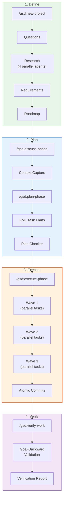
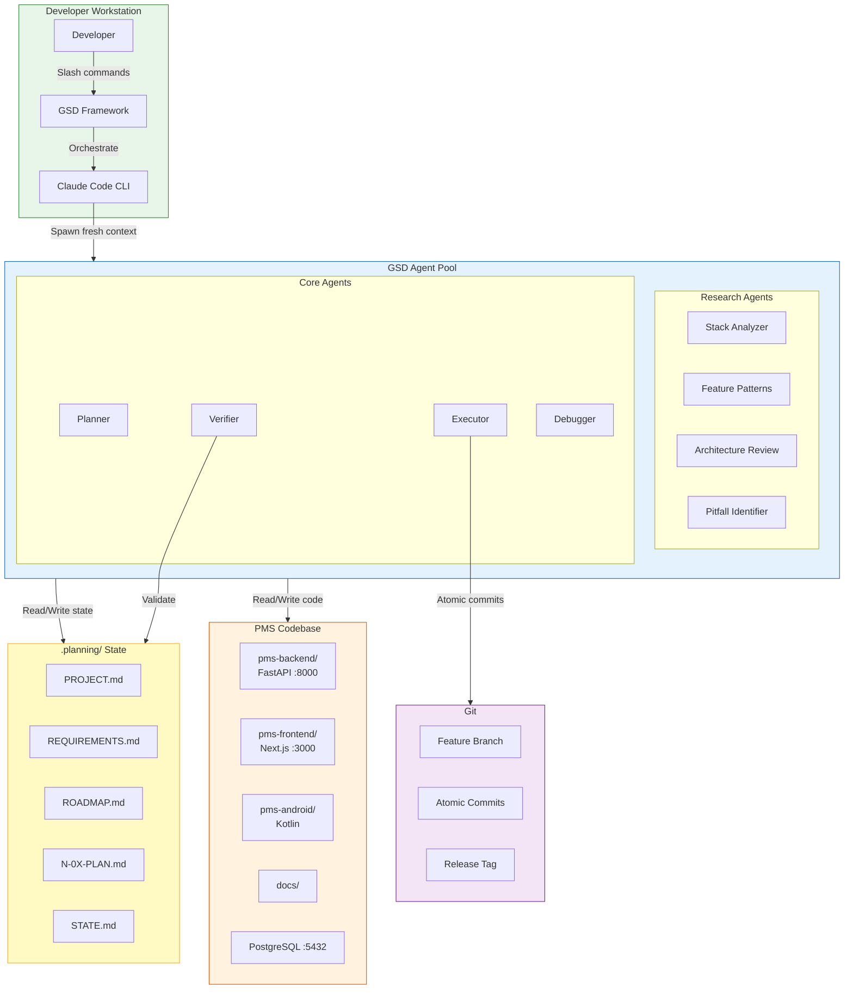

# GSD (Get Shit Done) Developer Onboarding Tutorial

**Welcome to the MPS PMS GSD Integration Team**

This tutorial will take you from zero to building your first PMS feature using GSD's spec-driven development workflow. By the end, you will understand how GSD orchestrates Claude Code through structured multi-agent workflows, have completed a feature using the full Define → Plan → Execute → Verify pipeline, and know when to use GSD vs. raw Claude Code.

**Document ID:** PMS-EXP-GSD-002
**Version:** 1.0
**Date:** 2026-03-09
**Applies To:** PMS project (all platforms)
**Prerequisite:** [GSD Setup Guide](61-GSD-PMS-Developer-Setup-Guide.md)
**Estimated time:** 2-3 hours
**Difficulty:** Beginner-friendly

---

## What You Will Learn

1. What problem GSD solves (context degradation in long AI sessions)
2. How GSD's multi-agent architecture works (fresh contexts, wave parallelism)
3. How document-driven state management replaces chat history
4. How to initialize a GSD project with PMS requirement traceability
5. How to plan phases with research agents and XML task plans
6. How to execute phases with parallel waves and atomic commits
7. How to verify work using goal-backward validation
8. How GSD compares to raw Claude Code, Agent Teams, and Superpowers
9. How to enforce HIPAA compliance in GSD workflows
10. How to debug common GSD issues

## Part 1: Understanding GSD (15 min read)

### 1.1 What Problem Does GSD Solve?

Imagine you're building a new prescription renewal workflow for the PMS. It needs a FastAPI endpoint, a database migration, a Next.js form, an Android notification, and integration tests. You start a Claude Code session and work through it step by step.

By the time you reach the Android notification (task 8 of 10), Claude Code's context window is packed with thousands of lines from earlier tasks — migration SQL, Python schemas, React components. The AI starts making mistakes: it forgets the API response format it designed in task 2, it uses the wrong model field name, it generates TypeScript that doesn't match the Python schema.

This is **context degradation** — the quality decline that occurs as an AI assistant's context window fills with accumulated state. The more you've done in a session, the worse the AI performs on the current task.

GSD solves this by **never letting context accumulate**. Each task gets a fresh 200K-token context window. The AI loads only the files it needs for that specific task. State is maintained not in chat history but in structured markdown files in the `.planning/` directory — a shared file system that any agent can read.

### 1.2 How GSD Works — The Key Pieces



**Concept 1 — Document-Driven State**: Instead of relying on chat history, GSD stores all project state in the `.planning/` directory. `PROJECT.md` holds the vision, `REQUIREMENTS.md` holds the specs, `STATE.md` tracks progress, and `N-0X-PLAN.md` files contain individual task plans. Each agent reads only the files it needs.

**Concept 2 — Fresh Context Isolation**: Every agent (planner, executor, verifier, researcher) spawns with a clean 200K-token context window. It explicitly loads the files it needs — never inheriting accumulated state from previous tasks. This prevents context degradation.

**Concept 3 — Wave-Based Parallelism**: Independent tasks execute simultaneously in "waves." A wave completes before the next wave starts, respecting dependencies. For PMS, Wave 1 might contain the database migration and Pydantic schemas (independent), while Wave 2 contains the FastAPI endpoint (depends on Wave 1).

### 1.3 How GSD Fits with Other PMS Technologies

| Technology | Experiment | Relationship to GSD |
|---|---|---|
| Claude Code | Exp 27 | **Runtime** — GSD orchestrates Claude Code; cannot run without it |
| Agent Teams | Exp 14 | **Complementary** — Agent Teams for in-session collaboration; GSD for cross-session lifecycle |
| Superpowers | Exp 19 | **Complementary** — Superpowers skills can augment GSD agents; GSD adds lifecycle structure |
| Claude Context Mode | Exp 36 | **Complementary** — Context Mode optimizes individual sessions; GSD eliminates context accumulation |
| CrewAI | Exp 55 | **Alternative** — CrewAI orchestrates runtime AI agents; GSD orchestrates development AI agents |
| Knowledge Work Plugins | Exp 24 | **Complementary** — Plugins provide PMS-specific skills; GSD provides the lifecycle framework |

### 1.4 Key Vocabulary

| Term | Meaning |
|---|---|
| **SDD** | Spec-Driven Development — building software from structured specifications rather than ad-hoc prompts |
| **Context window** | The 200K-token memory available to an AI agent in a single session |
| **Context degradation** | Quality decline as the context window fills with accumulated state |
| **`.planning/` directory** | Filesystem-based state management for all GSD project artifacts |
| **Agent** | A specialized AI worker spawned with a fresh context window (e.g., planner, executor, verifier) |
| **Wave** | A group of independent tasks that execute in parallel |
| **Phase** | A logical milestone in the development roadmap (e.g., "API Layer", "UI Layer") |
| **Milestone** | A releasable increment marked by a git tag |
| **Atomic commit** | A single, self-contained git commit per task with a semantic prefix |
| **Plan checker** | An agent that validates task plans against phase goals before execution |
| **Verifier** | An agent that performs goal-backward validation after execution |
| **Quick mode** | Lightweight GSD flow for small tasks (bug fixes, minor features) |

### 1.5 Our Architecture



## Part 2: Environment Verification (15 min)

### 2.1 Checklist

1. **GSD installed**:
   ```bash
   ls ~/.claude/commands/ | grep gsd | head -5
   # Expected: gsd-new-project.md, gsd-plan-phase.md, gsd-execute-phase.md, etc.
   ```

2. **Claude Code available**:
   ```bash
   claude --version
   # Expected: claude-code vX.Y.Z
   ```

3. **Node.js available**:
   ```bash
   node --version
   # Expected: v16.7.0 or later
   ```

4. **Git configured**:
   ```bash
   git config user.name && git config user.email
   # Expected: your name and email
   ```

5. **PMS defaults configured**:
   ```bash
   cat ~/.gsd/defaults.json | python3 -c "import sys,json; d=json.load(sys.stdin); print(f'mode={d[\"mode\"]}, branch={d[\"git\"][\"branching_strategy\"]}')"
   # Expected: mode=interactive, branch=phase
   ```

### 2.2 Quick Test

```bash
# Create a temporary test directory
mkdir -p /tmp/gsd-quicktest && cd /tmp/gsd-quicktest && git init

# Run Claude Code and execute a quick GSD task
claude --print "/gsd:quick 'Create a hello.py file that prints Hello from GSD'"

# Verify
cat hello.py
# Expected: print("Hello from GSD") or similar
git log --oneline
# Expected: feat(quick): create hello.py
```

## Part 3: Build Your First PMS Feature with GSD (45 min)

### 3.1 What We Are Building

We will build a **Clinic Operating Hours API** — a simple but complete feature that:
- Adds a `clinic_hours` table to PostgreSQL
- Creates a FastAPI CRUD endpoint at `/api/clinic-hours`
- Adds a display component in the Next.js frontend
- Includes integration tests

This is small enough to complete in one tutorial session but spans multiple files and platforms — exactly the scenario where GSD shines.

### 3.2 Initialize the GSD Project

```bash
cd /path/to/pms-backend  # or your PMS workspace root

# Start Claude Code
claude
```

Inside Claude Code:

```
/gsd:new-project
```

When GSD asks questions, provide:
- **What are you building?** "A Clinic Operating Hours API that stores and serves daily operating hours (open/close times, break hours) for the clinic. Clinicians and patients need to know when the clinic is open."
- **Who is it for?** "Front desk staff (manage hours), patients (view hours via Android app), clinicians (reference during scheduling)"
- **What does success look like?** "CRUD API for hours, display on frontend, hours available in Android app"

GSD will then:
1. Spawn 4 parallel research agents (stack analysis, feature patterns, architecture, pitfalls)
2. Synthesize findings into `.planning/research/`
3. Extract requirements into `.planning/REQUIREMENTS.md`
4. Generate a phased roadmap in `.planning/ROADMAP.md`

### 3.3 Review the Generated Plan

After initialization, examine the generated artifacts:

```bash
# View the project definition
cat .planning/PROJECT.md

# View extracted requirements
cat .planning/REQUIREMENTS.md

# View the phased roadmap
cat .planning/ROADMAP.md

# View research findings
ls .planning/research/
```

The roadmap should have 2-3 phases:
- Phase 1: Database model and API endpoint
- Phase 2: Frontend display and Android integration
- Phase 3: Advanced features (holiday schedules, timezone support)

### 3.4 Discuss and Plan Phase 1

```
/gsd:discuss-phase 1
```

The discussion agent will:
- Analyze existing PMS database models for patterns
- Ask design questions (e.g., "Should hours vary by day of week?", "Should we support multiple locations?")
- Write decisions to `.planning/1-CONTEXT.md`

Answer the questions based on PMS context (single location, hours vary by day, no timezone complexity in v1).

```
/gsd:plan-phase 1
```

The planner creates XML-structured task plans. Review them:

```bash
cat .planning/1-01-PLAN.md
# Expected: SQLAlchemy model for clinic_hours table

cat .planning/1-02-PLAN.md
# Expected: Pydantic schemas for request/response

cat .planning/1-03-PLAN.md
# Expected: FastAPI router with CRUD endpoints

cat .planning/1-04-PLAN.md
# Expected: Integration tests
```

### 3.5 Execute Phase 1

```
/gsd:execute-phase 1
```

Watch GSD orchestrate the execution:

1. **Wave 1** (parallel): Database model + Pydantic schemas (independent)
2. **Wave 2** (sequential, depends on Wave 1): FastAPI router (needs model and schemas)
3. **Wave 3** (sequential, depends on Wave 2): Integration tests (needs endpoints)

Each task:
- Spawns a fresh Claude Code context
- Loads only the files it needs
- Writes code
- Creates an atomic git commit: `feat(1): add clinic_hours SQLAlchemy model`

### 3.6 Verify Phase 1

```
/gsd:verify-work 1
```

The verifier agent:
- Reads `REQUIREMENTS.md` and `1-CONTEXT.md`
- Checks each requirement against the actual code
- Attempts to run tests (if configured)
- Produces `.planning/1-VERIFICATION.md` with results

```bash
# Review verification results
cat .planning/1-VERIFICATION.md
```

If there are gaps, the verifier suggests specific fixes. You can re-run execution for individual tasks or use `/gsd:quick` to address gaps.

### 3.7 Review Git History

```bash
git log --oneline
# Expected:
# abc1234 feat(1): add integration tests for clinic hours API
# def5678 feat(1): implement clinic hours CRUD router
# ghi9012 feat(1): add ClinicHours Pydantic schemas
# jkl3456 feat(1): add clinic_hours SQLAlchemy model and migration
```

Each commit is atomic — you can revert any individual task without affecting others.

**Checkpoint**: First PMS feature phase completed using full GSD workflow — research, planning, parallel wave execution, verification, and atomic commits.

## Part 4: Evaluating Strengths and Weaknesses (15 min)

### 4.1 Strengths

- **Context isolation eliminates quality degradation**: Each task starts fresh — the 10th task is as accurate as the 1st
- **Parallel wave execution**: Independent tasks run simultaneously, reducing wall-clock time 2-3x for multi-file features
- **Document-driven state**: `.planning/` files persist across sessions, enabling multi-day features without losing context
- **Atomic git commits**: Every task produces a self-contained commit with semantic prefix — clean history, easy reverts
- **Goal-backward verification**: The verifier checks completed work against original requirements, catching gaps before PR
- **Multi-runtime support**: Same workflow works with Claude Code, OpenCode, Gemini CLI, or Codex
- **Zero runtime dependencies**: GSD is pure JavaScript + markdown — no Docker, no database, no external services
- **Low ceremony quick mode**: `/gsd:quick` for bug fixes avoids over-engineering small tasks
- **ISO 13485 alignment**: Document-driven workflow naturally produces design history artifacts

### 4.2 Weaknesses

- **Framework immaturity**: GSD is ~3 months old (Dec 2025). Rapid iteration means breaking changes are possible
- **Overhead for simple tasks**: Full GSD workflow adds planning/verification time — overkill for single-file changes
- **Learning curve**: New mental model (document-driven, multi-agent) takes time to internalize
- **Agent spawn latency**: Each fresh context takes 15-30 seconds to initialize — adds up for many small tasks
- **No interactive debugging**: GSD agents work autonomously; you can't step through their reasoning in real time
- **Single-maintainer risk**: Creator-driven project; long-term sustainability uncertain despite large community
- **`--dangerously-skip-permissions` culture**: GSD documentation encourages disabling safety guardrails — must be explicitly prohibited in PMS

### 4.3 When to Use GSD vs Alternatives

| Scenario | Best Choice | Why |
|---|---|---|
| Multi-file, multi-platform feature (3+ days) | **GSD full workflow** | Context isolation, parallel waves, verification |
| Single-file bug fix | **Raw Claude Code** or **GSD quick mode** | No planning overhead needed |
| Real-time multi-agent collaboration | **Agent Teams (Exp 14)** | Built-in shared task lists, in-session collaboration |
| Enforcing coding patterns (TDD, review) | **Superpowers (Exp 19)** | Skill-based workflow enforcement |
| Runtime AI agent orchestration (production) | **CrewAI (Exp 55)** or **LangGraph (Exp 26)** | Production-grade agent orchestration |
| Quick prototyping / exploration | **Raw Claude Code** | Minimal ceremony, maximum flexibility |
| Features requiring regulatory traceability | **GSD + ISO 13485 artifact generator** | Document-driven state maps to DHF entries |

### 4.4 HIPAA / Healthcare Considerations

**GSD-specific HIPAA requirements**:

1. **NEVER use `--dangerously-skip-permissions`**: This flag bypasses Claude Code's permission system, allowing unrestricted file access. In a HIPAA-regulated codebase, this could lead to unauthorized PHI exposure. PMS CLAUDE.md explicitly prohibits this.

2. **`.planning/` directory must not contain PHI**: Task plans, summaries, and verification reports describe *what* to build — they should never include actual patient data. GSD agents should reference API endpoints, not actual patient records.

3. **Atomic commits aid auditability**: Each GSD commit traces to a specific task plan, which traces to a requirement. This chain supports ISO 13485 traceability from SYS-REQ to code change to test.

4. **Verification agent should check HIPAA compliance**: Custom verifier extensions can scan for PHI in error messages, validate encryption on new PHI columns, and confirm audit logging on new endpoints.

5. **Model profile matters**: Use `quality` (Opus) for HIPAA-sensitive features — higher accuracy reduces the risk of security-relevant code errors.

## Part 5: Debugging Common Issues (15 min read)

### Issue 1: Agent Produces Empty or Incomplete Output

**Symptoms**: Task plan or execution summary is empty or truncated.

**Cause**: The agent's context filled up before completing the task (rare with fresh 200K windows, but possible for large codebases).

**Fix**:
- Increase task granularity: `"granularity": "fine"` in config.json
- Reduce the scope of individual tasks
- Check if the agent is loading too many files — review the plan for unnecessary file references

### Issue 2: Waves Execute in Wrong Order

**Symptoms**: A task fails because its dependency hasn't been built yet.

**Cause**: The planner didn't correctly identify dependencies between tasks.

**Fix**:
- Re-run `/gsd:plan-phase` to regenerate plans
- During discussion phase (`/gsd:discuss-phase`), explicitly state dependencies
- Manually edit `N-0X-PLAN.md` to add dependency annotations

### Issue 3: Verification Reports False Failures

**Symptoms**: Verifier claims requirements aren't met, but the code looks correct.

**Cause**: Requirements in `REQUIREMENTS.md` are ambiguous or the verifier interpreted them differently than intended.

**Fix**:
- Clarify requirements with more specific acceptance criteria
- Re-run `/gsd:discuss-phase` to refine `CONTEXT.md`
- Use `/gsd:verify-work` with `--interactive` to discuss failures with the verifier

### Issue 4: Git Commit Conflicts Between Parallel Tasks

**Symptoms**: Wave execution fails with git merge conflict.

**Cause**: Two parallel tasks in the same wave modified the same file (should not happen with proper planning).

**Fix**:
- Move conflicting tasks to sequential waves
- Re-plan with finer task granularity
- Resolve the conflict manually and continue: `/gsd:execute-phase N --continue`

### Issue 5: GSD State Gets Corrupted

**Symptoms**: `STATE.md` shows wrong phase, or completed tasks appear incomplete.

**Cause**: Manual edits to `.planning/` files, or interrupted execution.

**Fix**:
- Review `.planning/STATE.md` and correct the current position
- Use git to restore `.planning/` to a known good state: `git checkout HEAD -- .planning/STATE.md`
- Re-run verification to re-establish correct state

### Issue 6: Quick Mode Creates Too Many Commits

**Symptoms**: `/gsd:quick` for a small fix creates 3-4 commits instead of 1.

**Cause**: The quick task was too broad, causing GSD to split it into subtasks.

**Fix**:
- Make the quick task description more specific and constrained
- For truly small changes, use raw Claude Code instead of GSD

## Part 6: Practice Exercise (45 min)

### Option A: Build a Patient Notification Preferences Feature

Use GSD to build a feature that lets patients configure their notification preferences (email, SMS, push) for appointment reminders and prescription renewals.

**Hints**:
1. Initialize with `/gsd:new-project` — describe the feature and its three notification channels
2. Phase 1: Database model (`notification_preferences` table) + API endpoints
3. Phase 2: Next.js settings page + Android preferences screen
4. Focus on the full lifecycle: discuss → plan → execute → verify

### Option B: Use GSD Quick Mode for 3 Bug Fixes

Practice quick mode on three small tasks:
1. `/gsd:quick "Add request ID to all API error responses for traceability"`
2. `/gsd:quick "Fix the patient search to be case-insensitive"`
3. `/gsd:quick "Add rate limiting (60 req/min) to the /api/reports endpoint"`

**Hints**:
- Each should produce exactly one atomic commit
- Review git log to confirm semantic commit messages
- Check that each fix is self-contained (revertible)

### Option C: Map the Existing PMS Codebase

Use GSD's brownfield analysis to understand the PMS codebase:

```
/gsd:map-codebase
```

**Hints**:
- Review the generated codebase map for accuracy
- Compare with existing `docs/` documentation
- Identify areas where the map reveals undocumented patterns or conventions
- Consider whether the map would help onboard a new developer

## Part 7: Development Workflow and Conventions

### 7.1 File Organization

```
pms-workspace/
├── pms-backend/
│   ├── .planning/              # GSD state for backend-specific features
│   │   ├── PROJECT.md
│   │   ├── REQUIREMENTS.md
│   │   ├── ROADMAP.md
│   │   ├── STATE.md
│   │   ├── config.json
│   │   ├── research/
│   │   ├── 1-CONTEXT.md
│   │   ├── 1-01-PLAN.md
│   │   ├── 1-01-SUMMARY.md
│   │   └── 1-VERIFICATION.md
│   ├── app/
│   └── tests/
├── pms-frontend/
│   ├── .planning/              # GSD state for frontend-specific features
│   └── src/
├── pms-android/
│   ├── .planning/              # GSD state for Android-specific features
│   └── app/
├── docs/
│   └── experiments/
│       ├── 61-PRD-GSD-PMS-Integration.md
│       ├── 61-GSD-PMS-Developer-Setup-Guide.md
│       └── 61-GSD-Developer-Tutorial.md
└── .planning/                  # GSD state for cross-platform features
```

### 7.2 Naming Conventions

| Item | Convention | Example |
|---|---|---|
| GSD project name | kebab-case feature description | `clinic-operating-hours` |
| Planning files | `N-0X-TYPE.md` | `1-03-PLAN.md`, `2-01-SUMMARY.md` |
| Commit messages | `type(phase): description` | `feat(1): add clinic_hours model` |
| Branch names | `gsd/phase-N/feature-name` | `gsd/phase-1/clinic-hours` |
| Config files | `config.json` in `.planning/` | `.planning/config.json` |
| Quick mode artifacts | `.planning/quick/TASK-*.md` | `.planning/quick/TASK-fix-pagination.md` |

### 7.3 PR Checklist

When submitting a PR for a GSD-developed feature:

- [ ] All phases verified: `.planning/N-VERIFICATION.md` exists for each phase
- [ ] All atomic commits have semantic prefixes (`feat`, `fix`, `test`, `docs`)
- [ ] `.planning/` directory is included in the PR for audit trail
- [ ] No PHI in `.planning/` artifacts (task plans, summaries, research)
- [ ] No `--dangerously-skip-permissions` used (check shell history)
- [ ] HIPAA-relevant code reviewed: encryption, audit logging, RBAC
- [ ] Tests pass for all modified endpoints
- [ ] Requirements traceability: each requirement in `REQUIREMENTS.md` maps to a test
- [ ] GSD verification report shows all requirements met

### 7.4 Security Reminders

1. **NEVER use `--dangerously-skip-permissions`** — this is the most critical security rule for GSD in PMS
2. **Use `interactive` mode** — never set `mode: yolo` in PMS projects
3. **Review agent-written code** — GSD agents are AI; their code must be reviewed before merge
4. **No PHI in `.planning/`** — task descriptions reference API endpoints, not patient data
5. **Audit git history** — GSD's atomic commits are your audit trail; protect them from force-push
6. **Pin GSD version** — update deliberately, test in isolation, then roll out to team
7. **Check pre-commit hooks** — ensure PHI scanning hooks run on GSD-generated commits

## Part 8: Quick Reference Card

### Core Commands

```bash
/gsd:new-project              # Initialize new feature
/gsd:discuss-phase N          # Capture design decisions
/gsd:plan-phase N             # Create task plans
/gsd:execute-phase N          # Execute in parallel waves
/gsd:verify-work N            # Goal-backward verification
/gsd:complete-milestone       # Archive, tag, ship

/gsd:quick "description"      # Quick fix (1 commit)
/gsd:quick --discuss "desc"   # Quick fix with context gathering
/gsd:map-codebase             # Brownfield analysis
/gsd:debug                    # Systematic troubleshooting
/gsd:add-tests                # Add test coverage
```

### Key Files

| File | Purpose |
|---|---|
| `~/.gsd/defaults.json` | User-level defaults |
| `.planning/PROJECT.md` | Feature vision |
| `.planning/REQUIREMENTS.md` | Requirements with traceability |
| `.planning/ROADMAP.md` | Phased plan |
| `.planning/STATE.md` | Current position |
| `.planning/config.json` | Project settings |

### Key URLs

| Resource | URL |
|---|---|
| GSD GitHub | https://github.com/gsd-build/get-shit-done |
| GSD User Guide | https://github.com/gsd-build/get-shit-done/blob/main/docs/USER-GUIDE.md |
| GSD npm | https://www.npmjs.com/package/get-shit-done-cc |
| GSD Discord | https://discord.gg/gsd |

### Decision Framework

```
Is this a multi-file, multi-day feature?
├── Yes → Use GSD full workflow
└── No
    ├── Is it a bug fix or small change (< 3 files)?
    │   ├── Yes → Use /gsd:quick or raw Claude Code
    │   └── No → Use GSD full workflow
    └── Is it exploratory/prototyping?
        ├── Yes → Use raw Claude Code
        └── No → Use GSD full workflow
```

## Next Steps

1. **Build a real PMS feature** using the full GSD workflow — pick a ticket from the backlog
2. **Customize GSD agents** with PMS-specific patterns (security checks, API conventions)
3. **Create ISO 13485 artifact generator** that converts `.planning/` files to DHF entries
4. **Review [Claude Code Tutorial (Exp 27)](27-ClaudeCode-Developer-Tutorial.md)** for advanced Claude Code features used by GSD
5. **Explore [Agent Teams (Exp 14)](14-agent-teams-claude-whitepaper.md)** for complementary in-session multi-agent patterns
