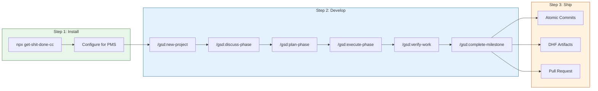

# GSD (Get Shit Done) Setup Guide for PMS Integration

**Document ID:** PMS-EXP-GSD-001
**Version:** 1.0
**Date:** 2026-03-09
**Applies To:** PMS project (all platforms)
**Prerequisites Level:** Intermediate

---

## Table of Contents

1. [Overview](#1-overview)
2. [Prerequisites](#2-prerequisites)
3. [Part A: Install and Configure GSD](#3-part-a-install-and-configure-gsd)
4. [Part B: Integrate with PMS Backend](#4-part-b-integrate-with-pms-backend)
5. [Part C: Integrate with PMS Frontend](#5-part-c-integrate-with-pms-frontend)
6. [Part D: Testing and Verification](#6-part-d-testing-and-verification)
7. [Troubleshooting](#7-troubleshooting)
8. [Reference Commands](#8-reference-commands)

## 1. Overview

This guide walks you through installing GSD, configuring it for PMS development conventions, and using it to plan and execute your first feature. GSD orchestrates Claude Code through structured workflows that spawn fresh context windows per task, maintain state in `.planning/` markdown files, and produce atomic git commits.

By the end of this guide, you will have:
- GSD installed globally with Claude Code as the runtime
- PMS-specific configuration (commit format, branching, model profiles)
- A `.planning/` directory template for PMS features
- A completed small feature built using the full GSD workflow



## 2. Prerequisites

### 2.1 Required Software

| Software | Minimum Version | Check Command |
|---|---|---|
| Node.js | 16.7.0 | `node --version` |
| npm | 8.0 | `npm --version` |
| Claude Code CLI | Latest | `claude --version` |
| Git | 2.40 | `git --version` |
| Python | 3.11 | `python3 --version` |

### 2.2 Installation of Prerequisites

All prerequisites should already be installed for PMS development. Verify with:

```bash
node --version && npm --version && claude --version && git --version && python3 --version
```

If Claude Code is not installed:

```bash
npm install -g @anthropic-ai/claude-code
claude --version
```

### 2.3 Verify PMS Services

GSD orchestrates development work — it does not interact with running services directly. However, verification agents will test against running services, so confirm:

```bash
# Check PMS Backend
curl -s http://localhost:8000/health | jq .
# Expected: {"status": "healthy"}

# Check PMS Frontend
curl -s -o /dev/null -w "%{http_code}" http://localhost:3000
# Expected: 200

# Check PostgreSQL
pg_isready -h localhost -p 5432
# Expected: accepting connections
```

**Checkpoint**: All prerequisites installed and PMS services running.

## 3. Part A: Install and Configure GSD

### Step 1: Install GSD

```bash
# Install GSD for Claude Code, globally
npx get-shit-done-cc@latest --claude --global
```

This installs GSD slash commands into `~/.claude/commands/` and hooks into `~/.claude/settings.json`.

### Step 2: Verify Installation

```bash
# Start Claude Code in any directory
claude

# Inside Claude Code, type:
# /gsd:quick --help
# Expected: GSD quick mode documentation appears
```

You should see GSD slash commands available in the command palette.

### Step 3: Create PMS-Specific User Defaults

Configure GSD defaults that apply to all PMS projects:

```bash
mkdir -p ~/.gsd

cat > ~/.gsd/defaults.json << 'EOF'
{
  "mode": "interactive",
  "granularity": "standard",
  "workflow": {
    "research": true,
    "plan_check": true,
    "verifier": true
  },
  "git": {
    "branching_strategy": "phase",
    "commit_format": "conventional",
    "auto_commit": true
  },
  "parallelization": {
    "enabled": true
  },
  "model_profile": "quality",
  "security": {
    "skip_permissions": false,
    "phi_scan": true,
    "credential_scan": true
  }
}
EOF
```

**Key settings**:
- `mode: interactive` — never auto-approve (HIPAA compliance)
- `branching_strategy: phase` — creates a branch per phase for clean PRs
- `model_profile: quality` — uses Opus for planning and execution (highest accuracy)
- `security.skip_permissions: false` — enforces Claude Code permission prompts

### Step 4: Create PMS Project Template

Create a reusable template for new PMS features:

```bash
mkdir -p ~/.gsd/templates/pms-feature

cat > ~/.gsd/templates/pms-feature/PROJECT.md << 'EOF'
# PMS Feature: {FEATURE_NAME}

## Vision
{One-sentence description of what this feature does for clinical staff}

## Goals
1. {Primary goal}
2. {Secondary goal}
3. {Tertiary goal}

## Scope
- **In scope**: {What this feature includes}
- **Out of scope**: {What this feature does not include}

## PMS Requirements Traceability
- System Requirement: SYS-REQ-{NNNN} ({requirement title})
- Domain Requirements: SUB-{CODE}-{NN} ({requirement title})
- Platform Requirements: SUB-{CODE}-BE-{NN}, SUB-{CODE}-WEB-{NN}, SUB-{CODE}-AND-{NN}
- See: [System Requirements](docs/specs/requirements/SYS-REQ.md)

## Technical Context
- Backend: FastAPI (Python 3.11+) on port 8000
- Frontend: Next.js 15 (React 19, TypeScript) on port 3000
- Android: Kotlin + Jetpack Compose
- Database: PostgreSQL 16 with pgvector extension
- Existing docs: `docs/` directory (see docs/index.md for full index)

## HIPAA Constraints
- No PHI in logs, error messages, or `.planning/` artifacts
- All new database columns with PHI must use encryption-at-rest
- All new API endpoints must have RBAC and audit logging
- All AI-generated clinical content requires clinician review
EOF

cat > ~/.gsd/templates/pms-feature/REQUIREMENTS.md << 'EOF'
# Requirements: {FEATURE_NAME}

## Functional Requirements

### REQ-001: {Requirement title}
- **Priority**: Must-have
- **Version**: v1
- **Acceptance criteria**: {Testable criteria}
- **Traces to**: SYS-REQ-{NNNN}, SUB-{CODE}-{NN}

### REQ-002: {Requirement title}
- **Priority**: Must-have
- **Version**: v1
- **Acceptance criteria**: {Testable criteria}
- **Traces to**: SYS-REQ-{NNNN}, SUB-{CODE}-{NN}

## Non-Functional Requirements

### NFR-001: HIPAA Audit Logging
- **Priority**: Must-have
- **Version**: v1
- **Acceptance criteria**: All CRUD operations on PHI are logged with user, timestamp, action, and resource

### NFR-002: Performance
- **Priority**: Should-have
- **Version**: v1
- **Acceptance criteria**: API response time < 200ms at p95 for read operations

## Out of Scope (v2+)
- {Deferred feature 1}
- {Deferred feature 2}
EOF
```

### Step 5: Add GSD to PMS CLAUDE.md

Add GSD conventions to the PMS project's CLAUDE.md:

```markdown
## GSD (Get Shit Done) Development Workflow

When using GSD for feature development:
- NEVER use `--dangerously-skip-permissions` — all operations require permission approval
- Use `interactive` mode (not `yolo`) for all PMS development
- Use the `pms-feature` template for new features: copy from `~/.gsd/templates/pms-feature/`
- All `.planning/` artifacts must NOT contain PHI
- Commit `.planning/` directory to the feature branch for audit trail
- Use `/gsd:quick` for bug fixes and small changes (< 3 files)
- Use full GSD workflow for features spanning multiple files or platforms
- Verification agents must check HIPAA compliance before milestone completion
```

**Checkpoint**: GSD is installed globally, PMS-specific defaults configured, project template created, and CLAUDE.md updated with GSD conventions.

## 4. Part B: Integrate with PMS Backend

GSD orchestrates Claude Code to write backend code — it does not integrate as a library. The integration is in the **development workflow**:

### Step 1: Initialize a GSD Project for a Backend Feature

```bash
cd /path/to/pms-backend

# Start Claude Code
claude

# Inside Claude Code:
# /gsd:new-project
```

GSD will:
1. Ask questions about the feature (what, why, acceptance criteria)
2. Spawn 4 parallel research agents (stack analysis, feature patterns, architecture review, pitfall identification)
3. Extract requirements into `REQUIREMENTS.md`
4. Generate a phased `ROADMAP.md`

### Step 2: Plan the Backend Phase

```bash
# Inside Claude Code:
# /gsd:discuss-phase 1
```

GSD's discussion agent will:
- Read existing PMS backend code patterns (FastAPI routers, SQLAlchemy models, Pydantic schemas)
- Capture design decisions in `1-CONTEXT.md`
- Identify gray areas and ask clarifying questions

```bash
# /gsd:plan-phase 1
```

GSD's planner agent will:
- Research phase requirements
- Create XML-structured task plans in `1-01-PLAN.md`, `1-02-PLAN.md`, etc.
- The plan-checker agent validates plans achieve phase goals

### Step 3: Execute with Parallel Waves

```bash
# /gsd:execute-phase 1
```

GSD groups independent tasks into waves. For a typical backend feature:

**Wave 1** (parallel):
- Task 1: Database migration (SQLAlchemy model + Alembic migration)
- Task 2: Pydantic request/response schemas

**Wave 2** (parallel, depends on Wave 1):
- Task 3: FastAPI router with CRUD endpoints
- Task 4: Service layer with business logic

**Wave 3** (depends on Wave 2):
- Task 5: Integration tests

Each task gets a fresh Claude Code context, an atomic git commit, and a summary in `.planning/`.

### Step 4: Verify Backend Implementation

```bash
# /gsd:verify-work 1
```

The verifier agent:
- Reads the original requirements and phase goals
- Checks each requirement against the implementation
- Runs tests if available
- Reports gaps and suggests fixes

**Checkpoint**: Backend feature developed using full GSD lifecycle — research, planning, parallel wave execution, and goal-backward verification.

## 5. Part C: Integrate with PMS Frontend

### Step 1: Multi-Platform GSD Project

For features spanning backend and frontend, initialize GSD at the monorepo level:

```bash
cd /path/to/pms-workspace  # Parent directory containing pms-backend/ and pms-frontend/

claude
# /gsd:new-project
```

### Step 2: Cross-Platform Wave Execution

When planning a full-stack feature, GSD automatically identifies cross-platform dependencies:

**Phase 1 — API Layer**:
- Wave 1: Backend API endpoints (FastAPI)
- Wave 2: API client types (TypeScript, generated from OpenAPI)

**Phase 2 — UI Layer** (depends on Phase 1):
- Wave 1 (parallel):
  - Frontend components (Next.js React)
  - Android screens (Kotlin Jetpack Compose)
- Wave 2: Integration tests (both platforms)

### Step 3: Frontend-Specific GSD Patterns

For Next.js components, GSD's executor follows PMS conventions:

```bash
# Inside Claude Code during execution:
# GSD reads pms-frontend/src/components/ for existing patterns
# Creates new components following established conventions:
#   - TypeScript with strict types
#   - Tailwind CSS for styling
#   - Server Components by default, Client Components when needed
#   - Lucide icons (no emoji)
```

### Step 4: Quick Mode for Frontend Fixes

For small UI fixes that don't need full GSD ceremony:

```bash
claude
# /gsd:quick "Fix the patient search dropdown to show MRN alongside patient name"
```

Quick mode creates a single atomic commit with the fix, without the full planning/verification cycle.

**Checkpoint**: Frontend integration understood — GSD handles cross-platform wave execution, follows PMS frontend conventions, and supports quick mode for small fixes.

## 6. Part D: Testing and Verification

### Step 1: Verify GSD Installation

```bash
# Check GSD commands are registered
ls ~/.claude/commands/ | grep gsd
# Expected: gsd-new-project.md, gsd-plan-phase.md, gsd-execute-phase.md, etc.

# Check GSD hooks
cat ~/.claude/settings.json | python3 -c "
import sys, json
settings = json.load(sys.stdin)
hooks = [h for h in settings.get('hooks', []) if 'gsd' in str(h).lower()]
print(f'{len(hooks)} GSD hooks found')
"
```

### Step 2: Test Quick Mode

```bash
cd /path/to/pms-backend
claude

# Inside Claude Code:
# /gsd:quick "Add a health check timestamp to the /health endpoint response"
```

Expected outcome:
- GSD creates a `.planning/quick/` task file
- Claude Code modifies the health endpoint
- An atomic commit is created: `feat(quick): add timestamp to health endpoint response`

### Step 3: Test Full Workflow (Dry Run)

```bash
cd /tmp/gsd-test
mkdir -p gsd-test && cd gsd-test
git init

claude

# Inside Claude Code:
# /gsd:new-project
# Answer: "A simple REST API that returns clinic operating hours"
# Let GSD run through research and planning
# /gsd:discuss-phase 1
# /gsd:plan-phase 1
# /gsd:execute-phase 1
# /gsd:verify-work 1
```

Verify the `.planning/` directory was created with proper structure:

```bash
ls .planning/
# Expected: PROJECT.md, REQUIREMENTS.md, ROADMAP.md, STATE.md, config.json,
#           research/, 1-CONTEXT.md, 1-01-PLAN.md, 1-01-SUMMARY.md, 1-VERIFICATION.md
```

### Step 4: Verify Atomic Commits

```bash
git log --oneline
# Expected: Multiple commits with semantic prefixes:
# abc1234 feat(1): implement operating hours endpoint
# def5678 test(1): add integration tests for operating hours
# ghi9012 docs(1): add API documentation for operating hours
```

### Step 5: Verify Configuration Cascade

```bash
# Check that PMS defaults are applied
cat .planning/config.json | python3 -m json.tool
# Expected: mode=interactive, branching_strategy=phase, model_profile=quality
```

**Checkpoint**: GSD installation verified, quick mode tested, full workflow completed on test project, atomic commits confirmed, configuration cascade validated.

## 7. Troubleshooting

### GSD Commands Not Found

**Symptoms**: Typing `/gsd:new-project` in Claude Code shows "Unknown command"

**Solution**:
1. Verify installation: `ls ~/.claude/commands/ | grep gsd`
2. If empty, reinstall: `npx get-shit-done-cc@latest --claude --global`
3. Restart Claude Code after installation
4. Check Claude Code version — GSD requires slash command support

### Agent Spawn Failures

**Symptoms**: GSD reports "Failed to spawn agent" or "Context creation error"

**Solution**:
1. Check Claude Code API key is valid: `claude --print "Hello"`
2. Verify Anthropic API quota/rate limits
3. Reduce parallelism: set `parallelization.enabled: false` in config.json temporarily
4. Check system resources (each agent uses ~256 MB RAM)

### `.planning/` Directory Not Created

**Symptoms**: After `/gsd:new-project`, no `.planning/` directory appears

**Solution**:
1. Check write permissions in current directory
2. Ensure Git is initialized: `git init` if needed
3. Run GSD from the repository root (not a subdirectory)
4. Check Claude Code has file write permission (approve when prompted)

### Atomic Commits Failing

**Symptoms**: GSD executor completes tasks but no commits appear

**Solution**:
1. Check Git status: `git status` — are there uncommitted changes blocking?
2. Verify Git user config: `git config user.name && git config user.email`
3. Check for pre-commit hooks that might reject GSD's commit format
4. Review `.planning/config.json` — ensure `git.auto_commit: true`

### Context Window Exhaustion

**Symptoms**: Agent produces incomplete or degraded output mid-task

**Solution**:
1. GSD has built-in context monitoring (warns at 65%, critical at 80%)
2. Increase task granularity: set `granularity: fine` in config.json to create smaller tasks
3. Reduce the scope of individual phases
4. Check if research artifacts are too large — trim verbose research files

### Wave Execution Order Wrong

**Symptoms**: Frontend tasks execute before backend API exists

**Solution**:
1. Review task plans (`*-PLAN.md` files) for missing dependency annotations
2. Re-run `/gsd:plan-phase` to regenerate plans with explicit dependencies
3. Manually edit plan files to add dependency markers between tasks

## 8. Reference Commands

### Core Workflow

```bash
# Full feature lifecycle
/gsd:new-project              # Initialize: questions, research, requirements, roadmap
/gsd:discuss-phase 1          # Capture design decisions for phase 1
/gsd:plan-phase 1             # Create task plans for phase 1
/gsd:execute-phase 1          # Execute phase 1 tasks in parallel waves
/gsd:verify-work 1            # Verify phase 1 deliverables
/gsd:complete-milestone       # Archive, tag, optional branch merge

# Repeat for additional phases:
/gsd:discuss-phase 2
/gsd:plan-phase 2
/gsd:execute-phase 2
/gsd:verify-work 2
/gsd:complete-milestone
```

### Quick Operations

```bash
# Ad-hoc tasks (bug fixes, small features)
/gsd:quick "Fix the pagination offset bug in /api/patients"
/gsd:quick --discuss "Add email notification for prescription renewals"

# Codebase analysis (brownfield)
/gsd:map-codebase

# Debugging
/gsd:debug

# Test coverage
/gsd:add-tests
```

### Management Commands

```bash
# Update GSD (preserves customizations)
npx get-shit-done-cc@latest --claude --global

# Re-apply local patches after update
/gsd:reapply-patches

# View current state
cat .planning/STATE.md

# View roadmap
cat .planning/ROADMAP.md
```

### Key Files

| File | Purpose |
|---|---|
| `~/.gsd/defaults.json` | User-level GSD configuration defaults |
| `~/.claude/commands/gsd-*.md` | GSD slash command definitions |
| `.planning/PROJECT.md` | Feature vision and goals |
| `.planning/REQUIREMENTS.md` | Feature requirements with traceability |
| `.planning/ROADMAP.md` | Phased implementation plan |
| `.planning/STATE.md` | Current position, decisions, blockers |
| `.planning/config.json` | Project-level GSD settings |
| `.planning/N-CONTEXT.md` | Phase-specific design decisions |
| `.planning/N-0X-PLAN.md` | Atomic task plans |
| `.planning/N-0X-SUMMARY.md` | Task execution results |
| `.planning/N-VERIFICATION.md` | Phase verification report |

### Useful URLs

| Resource | URL |
|---|---|
| GSD GitHub | https://github.com/gsd-build/get-shit-done |
| GSD Website | https://gsd.build |
| GSD User Guide | https://github.com/gsd-build/get-shit-done/blob/main/docs/USER-GUIDE.md |
| GSD npm Package | https://www.npmjs.com/package/get-shit-done-cc |
| GSD Discord | https://discord.gg/gsd |

## Next Steps

1. Follow the [GSD Developer Tutorial](61-GSD-Developer-Tutorial.md) to build your first PMS feature with GSD
2. Read the [GSD User Guide](https://github.com/gsd-build/get-shit-done/blob/main/docs/USER-GUIDE.md) for advanced configuration
3. Review [Claude Code Developer Tutorial (Experiment 27)](27-ClaudeCode-Developer-Tutorial.md) for Claude Code fundamentals
4. Explore [Agent Teams (Experiment 14)](14-agent-teams-claude-whitepaper.md) for complementary multi-agent patterns
5. Review [PMS Developer Working Instructions](../quality/processes/PMS_Developer_Working_Instructions.md) for coding standards

## Resources

- [GSD GitHub Repository](https://github.com/gsd-build/get-shit-done)
- [GSD Official Website](https://gsd.build)
- [GSD User Guide](https://github.com/gsd-build/get-shit-done/blob/main/docs/USER-GUIDE.md)
- [npm — get-shit-done-cc](https://www.npmjs.com/package/get-shit-done-cc)
- [Claude Code Developer Tutorial (Experiment 27)](27-ClaudeCode-Developer-Tutorial.md)
- [Superpowers PMS Integration (Experiment 19)](19-PRD-Superpowers-PMS-Integration.md)
