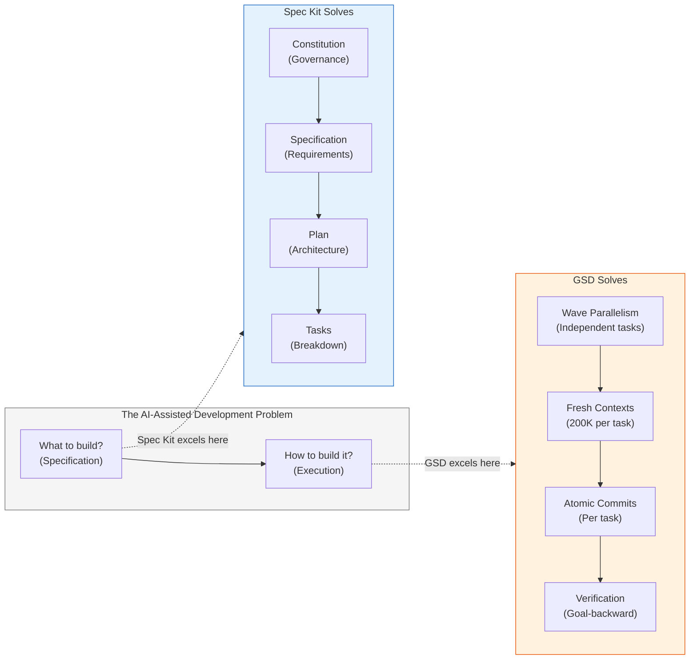
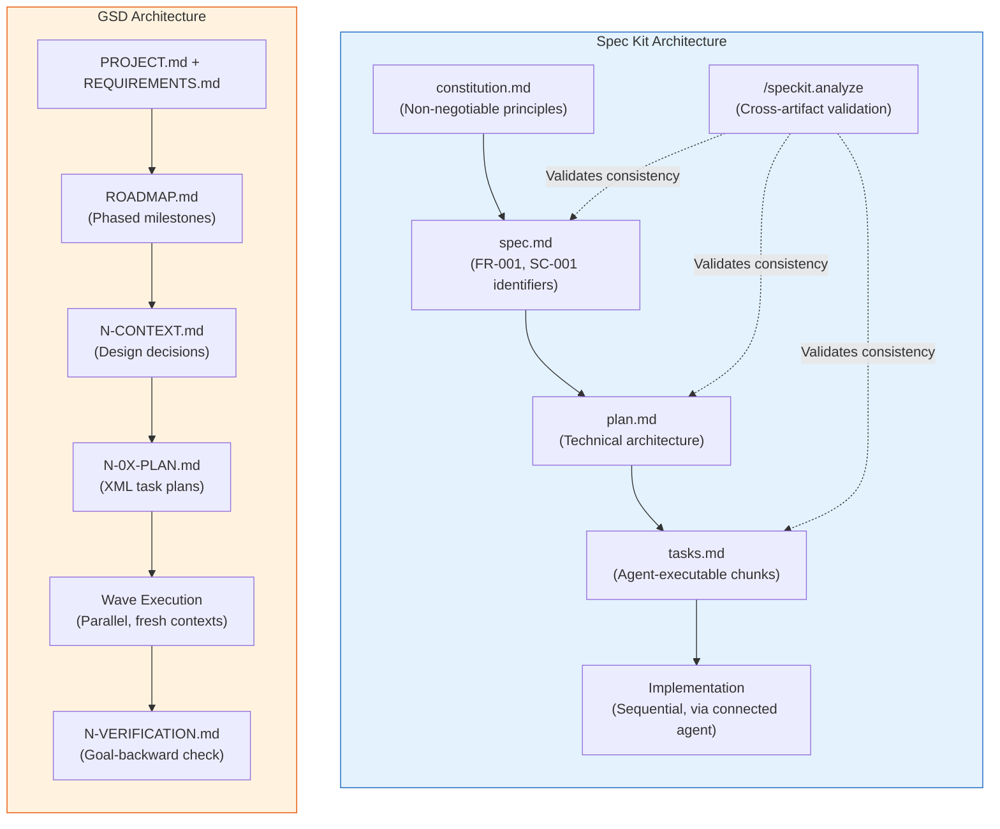
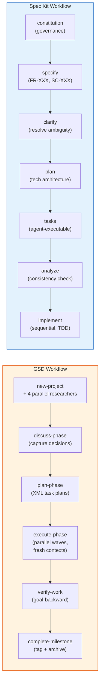
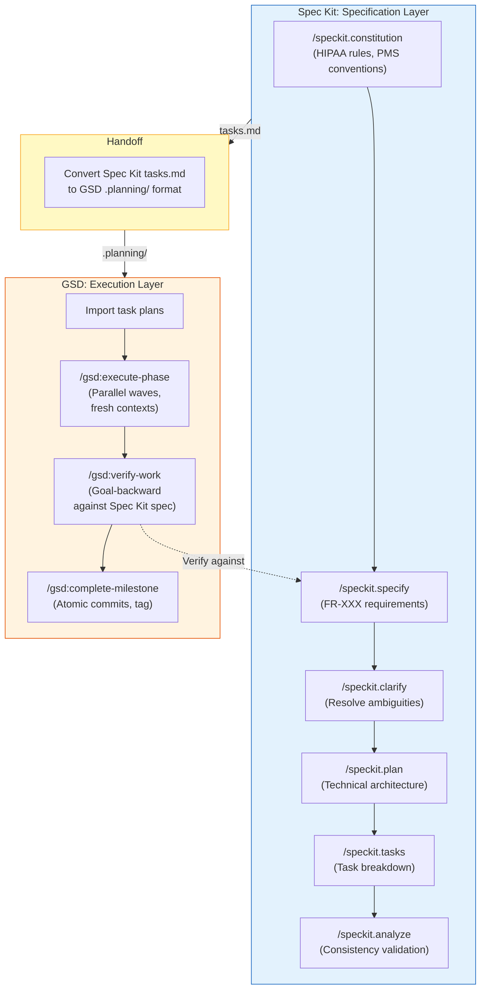

# GSD vs GitHub Spec Kit: Comparative Developer Tutorial

**Building the Same PMS Feature with Both SDD Frameworks**

This tutorial builds the identical feature — a **Clinic Operating Hours API** — using both GSD and GitHub Spec Kit side by side. By the end, you will understand the fundamental architectural differences between these two spec-driven development frameworks, know which one fits which scenario, and have a data-driven recommendation for PMS adoption.

**Document ID:** PMS-EXP-GSD-003
**Version:** 1.0
**Date:** 2026-03-09
**Applies To:** PMS project (all platforms)
**Prerequisites:** [GSD Setup Guide](61-GSD-PMS-Developer-Setup-Guide.md), [GSD Developer Tutorial](61-GSD-Developer-Tutorial.md)
**Estimated time:** 3-4 hours
**Difficulty:** Intermediate

---

## What You Will Learn

1. How GSD and Spec Kit solve different halves of the same problem
2. The architectural difference: execution-layer vs specification-layer orchestration
3. How each framework structures project artifacts and state
4. How to build the same feature with both tools, observing differences in workflow, artifacts, and output
5. How each maps to ISO 13485 Design History File requirements
6. How to combine both frameworks in a complementary workflow
7. Which framework fits which PMS development scenario
8. HIPAA compliance posture of each approach

## Part 1: Understanding the Fundamental Difference (20 min read)

### 1.1 Two Halves of the Same Problem

Both GSD and Spec Kit are "spec-driven development" (SDD) frameworks. Both reject "vibe coding" (ad-hoc AI prompting). Both produce structured artifacts. But they solve **different halves** of the AI-assisted development problem:

| | GSD | Spec Kit |
|---|---|---|
| **Core problem** | Context rot — AI quality degrades as context fills | Spec drift — AI produces inconsistent code without formal specifications |
| **Primary innovation** | Fresh 200K context windows per task | Persistent constitution + living specs that travel with every interaction |
| **Where it intervenes** | **Execution layer** — how the AI runs tasks | **Specification layer** — what the AI is told to build |
| **Analogy** | A factory floor manager assigning isolated workstations | An architect providing detailed blueprints to every worker |



### 1.2 Architectural Comparison



### 1.3 Feature-by-Feature Comparison

| Feature | GSD | Spec Kit |
|---|---|---|
| **Creator** | TACHES (community, Dec 2025) | GitHub (official, Aug 2025) |
| **GitHub Stars** | ~27K | ~75K |
| **License** | MIT | MIT |
| **Language** | JavaScript (Node.js) | Python |
| **Install** | `npx get-shit-done-cc@latest` | `uvx --from git+https://github.com/github/spec-kit.git specify init` |
| **AI Runtimes** | 4 (Claude Code, OpenCode, Gemini CLI, Codex) | 11+ (Copilot, Claude, Gemini, Cursor, Windsurf, Qwen, Codex, Roo, etc.) |
| **Governance layer** | None (uses CLAUDE.md) | `constitution.md` (non-negotiable project principles) |
| **Spec format** | `REQUIREMENTS.md` (freeform) | `spec.md` (structured FR-XXX, SC-XXX identifiers) |
| **Planning** | `N-0X-PLAN.md` (XML-structured) | `plan.md` (tech architecture) + `tasks.md` (agent-executable) |
| **Parallel execution** | Yes — wave-based with fresh 200K contexts | No — sequential via connected agent |
| **Context isolation** | Yes — each task spawns fresh agent | No — relies on persistent spec context |
| **Verification** | `gsd-verifier` (goal-backward code validation) | `/speckit.analyze` (cross-artifact consistency) |
| **Git integration** | Atomic commits per task, semantic prefixes, phase branching | Feature branch scripts, but no automatic commits |
| **Extensions** | Local patch system | Extension registry (`specify extension add`) |
| **Clarification step** | `/gsd:discuss-phase` | `/speckit.clarify` (dedicated ambiguity resolution) |
| **TDD enforcement** | Not built-in | `/speckit.implement` enforces test-first |
| **Brownfield support** | `/gsd:map-codebase` | Not explicitly supported |
| **Quick mode** | `/gsd:quick` for small tasks | No equivalent — always full workflow |

### 1.4 Key Vocabulary (Spec Kit Additions)

| Term | GSD Equivalent | Spec Kit Meaning |
|---|---|---|
| **Constitution** | CLAUDE.md / `.planning/` conventions | Immutable governance document: testing approach, naming conventions, tech stack rules |
| **Specification** | REQUIREMENTS.md | Formal spec with FR-XXX functional requirements, SC-XXX scenarios, and acceptance criteria |
| **Plan** | ROADMAP.md + N-CONTEXT.md | Technical architecture: frameworks, databases, component structure |
| **Tasks** | N-0X-PLAN.md | Small, reviewable, agent-executable work chunks |
| **Analyze** | verify-work | Cross-artifact consistency validation (spec → plan → tasks → constitution) |
| **Clarify** | discuss-phase | Dedicated step to resolve `[NEEDS CLARIFICATION]` markers |
| **Extension** | (patch system) | Pluggable capabilities added via `specify extension add` |

## Part 2: Setting Up Both Frameworks (20 min)

### 2.1 GSD Setup (Already Complete)

If you followed the [GSD Setup Guide](61-GSD-PMS-Developer-Setup-Guide.md), GSD is already installed. Verify:

```bash
ls ~/.claude/commands/ | grep gsd | head -3
# Expected: gsd-execute-phase.md, gsd-new-project.md, gsd-plan-phase.md
```

### 2.2 Spec Kit Setup

```bash
# Install Spec Kit (requires Python 3.10+ and uv)
# Option A: One-shot (no persistent install)
pip install uv  # if not already installed
uvx --from git+https://github.com/github/spec-kit.git specify --help

# Option B: Persistent install
uv tool install git+https://github.com/github/spec-kit.git
specify --help
# Expected: Usage information for the specify CLI
```

### 2.3 Verify Both Are Ready

```bash
# GSD
claude --print "List available /gsd commands" 2>/dev/null | head -5

# Spec Kit
specify --version
# Expected: specify version X.Y.Z
```

**Checkpoint**: Both GSD and Spec Kit are installed and available.

## Part 3: Building the Same Feature — Side by Side (90 min)

We will build the **Clinic Operating Hours API** — the same feature from the [GSD Developer Tutorial](61-GSD-Developer-Tutorial.md) — using both frameworks. This creates a direct, apples-to-apples comparison.

**Feature scope**:
- `clinic_hours` PostgreSQL table (day of week, open time, close time, break start/end)
- FastAPI CRUD endpoints at `/api/clinic-hours`
- Pydantic request/response schemas
- Integration tests

### 3.1 Approach A: Build with GSD

#### Step 1: Initialize

```bash
mkdir -p /tmp/pms-hours-gsd && cd /tmp/pms-hours-gsd && git init

claude
# /gsd:new-project
# Answer: "Clinic Operating Hours API — CRUD for daily open/close/break times"
```

**What happens**: GSD spawns 4 parallel research agents, then synthesizes findings into `.planning/` artifacts.

**Artifacts created**:
```
.planning/
├── PROJECT.md           # Feature vision
├── REQUIREMENTS.md      # Extracted requirements (freeform)
├── ROADMAP.md           # Phased milestones
├── STATE.md             # Current position tracker
├── config.json          # Workflow settings
└── research/            # Research agent findings
    ├── stack-analysis.md
    ├── feature-patterns.md
    ├── architecture-review.md
    └── pitfalls.md
```

#### Step 2: Plan

```bash
# /gsd:discuss-phase 1
# Answer design questions (single location, hours vary by day, etc.)

# /gsd:plan-phase 1
```

**Artifacts created**:
```
.planning/
├── 1-CONTEXT.md         # Design decisions captured
├── 1-01-PLAN.md         # Task: SQLAlchemy model
├── 1-02-PLAN.md         # Task: Pydantic schemas
├── 1-03-PLAN.md         # Task: FastAPI router
└── 1-04-PLAN.md         # Task: Integration tests
```

#### Step 3: Execute

```bash
# /gsd:execute-phase 1
```

**What happens**: GSD groups tasks into waves:
- Wave 1 (parallel): Model + Schemas (independent)
- Wave 2 (depends on Wave 1): FastAPI router
- Wave 3 (depends on Wave 2): Tests

Each task spawns a **fresh 200K context window**. Each produces an atomic commit.

**Git history**:
```
feat(1): add integration tests for clinic hours
feat(1): implement clinic hours CRUD router
feat(1): add ClinicHours Pydantic schemas
feat(1): add clinic_hours SQLAlchemy model
```

#### Step 4: Verify

```bash
# /gsd:verify-work 1
```

**Artifact created**: `.planning/1-VERIFICATION.md` — goal-backward check of all requirements.

**Total time**: ~20-30 minutes (including agent spawn overhead)
**Total artifacts**: 12+ files in `.planning/`
**Git commits**: 4 atomic commits with semantic prefixes

---

### 3.2 Approach B: Build with Spec Kit

#### Step 1: Initialize

```bash
mkdir -p /tmp/pms-hours-speckit && cd /tmp/pms-hours-speckit && git init

# Initialize Spec Kit for Claude Code
specify init clinic-hours-api --ai claude --here
```

**Artifacts created**:
```
.specify/
├── memory/
│   └── constitution.md       # Project governance (empty template)
├── scripts/
│   ├── bash/
│   │   ├── create-new-feature.sh
│   │   ├── check-prerequisites.sh
│   │   ├── setup-plan.sh
│   │   └── common.sh
│   └── ...
└── templates/
    ├── spec-template.md
    ├── plan-template.md
    └── tasks-template.md

.claude/
└── commands/
    ├── speckit.constitution.md
    ├── speckit.specify.md
    ├── speckit.plan.md
    ├── speckit.tasks.md
    ├── speckit.implement.md
    ├── speckit.clarify.md
    ├── speckit.analyze.md
    └── speckit.checklist.md
```

#### Step 2: Establish Constitution

```bash
claude
# /speckit.constitution
```

Spec Kit asks you to define non-negotiable project principles:
- **Testing approach**: "pytest for backend, every endpoint has integration tests"
- **Naming conventions**: "snake_case for Python, PascalCase for Pydantic models"
- **Tech stack rules**: "FastAPI + SQLAlchemy + PostgreSQL, Pydantic v2 schemas"
- **Security rules**: "No PHI in logs, HIPAA audit logging on all CRUD operations"

**Artifact created**: `.specify/memory/constitution.md` — a living governance document that persists across all AI interactions. This is the key differentiator: **every subsequent command carries this constitution as context**.

#### Step 3: Specify

```bash
# /speckit.specify
# Describe: "Clinic Operating Hours API — CRUD for daily open/close/break times"
```

Spec Kit creates a structured specification with formal identifiers:

```markdown
## Functional Requirements

### FR-001: Store Clinic Hours by Day of Week
Each day of the week has configurable open time, close time, optional break start, and break end.
**Acceptance Criteria**: Given a POST to /api/clinic-hours with day=Monday, open=08:00, close=17:00, the system stores and returns the record with HTTP 201.

### FR-002: Retrieve Clinic Hours
GET /api/clinic-hours returns all 7 days. GET /api/clinic-hours/{day} returns a single day.
**Acceptance Criteria**: Given stored hours, GET returns JSON array with all days sorted Monday-Sunday.

### SC-001: Duplicate Day Prevention
When a user attempts to create hours for a day that already exists, the system returns HTTP 409 Conflict.
```

**Artifact created**: `clinic-hours-api/spec.md` — structured specification with FR-XXX and SC-XXX identifiers.

#### Step 4: Clarify (Optional)

```bash
# /speckit.clarify
```

Spec Kit identifies ambiguities (marked `[NEEDS CLARIFICATION]`) and asks targeted questions. This is a **dedicated step** — GSD folds this into `/gsd:discuss-phase`.

#### Step 5: Plan

```bash
# /speckit.plan
```

Spec Kit creates a technical architecture document:

```markdown
## Architecture

### Database
- Table: `clinic_hours` (id, day_of_week, open_time, close_time, break_start, break_end)
- Enum: DayOfWeek (MONDAY through SUNDAY)

### API Layer
- Router: `/api/clinic-hours` with CRUD operations
- Pydantic models: ClinicHoursCreate, ClinicHoursResponse, ClinicHoursUpdate

### Testing
- pytest fixtures for database setup/teardown
- httpx.AsyncClient for endpoint testing
```

**Artifact created**: `clinic-hours-api/plan.md`

#### Step 6: Break into Tasks

```bash
# /speckit.tasks
```

Spec Kit decomposes the plan into small, agent-executable tasks:

```markdown
### Task 1: Database Model
Create SQLAlchemy model for clinic_hours table...
Traces to: FR-001

### Task 2: Pydantic Schemas
Create request/response schemas...
Traces to: FR-001, FR-002

### Task 3: CRUD Router
Implement FastAPI router...
Traces to: FR-001, FR-002, SC-001

### Task 4: Integration Tests
Write pytest tests covering all acceptance criteria...
Traces to: FR-001, FR-002, SC-001
```

**Artifact created**: `clinic-hours-api/tasks.md`

#### Step 7: Analyze (Optional)

```bash
# /speckit.analyze
```

Spec Kit performs **cross-artifact consistency validation**:
- Does the plan cover all FR-XXX requirements from the spec?
- Do the tasks map back to plan components?
- Are there constitution violations (e.g., missing test requirement)?
- Are there orphan requirements (in spec but not in tasks)?

This is Spec Kit's verification step — but it validates **artifacts**, not **code**.

#### Step 8: Implement

```bash
# /speckit.implement
```

Spec Kit delegates implementation to the connected AI agent (Claude Code). The agent receives:
- The constitution (governance context)
- The spec (requirements context)
- The plan (architecture context)
- The current task

**Key difference**: Implementation is **sequential through a single agent context**. There is no parallel execution, no fresh context windows, and no automatic atomic commits. The AI carries all prior context forward.

**Git history**: Depends on how the connected agent commits — Spec Kit does not enforce commit conventions.

**Total time**: ~25-35 minutes
**Total artifacts**: constitution.md + spec.md + plan.md + tasks.md + scripts
**Git commits**: Depends on agent behavior (no enforcement)

## Part 4: Comparing the Results (20 min)

### 4.1 Artifact Comparison

| Artifact Type | GSD | Spec Kit |
|---|---|---|
| **Governance** | CLAUDE.md (manual, not GSD-managed) | `constitution.md` (first-class, versioned, travels with every command) |
| **Requirements** | `REQUIREMENTS.md` (freeform markdown) | `spec.md` (structured FR-XXX, SC-XXX with acceptance criteria) |
| **Architecture** | `N-CONTEXT.md` (design decisions) | `plan.md` (full technical architecture) |
| **Task breakdown** | `N-0X-PLAN.md` (XML-structured, max 3 per plan) | `tasks.md` (numbered list with FR traceability) |
| **Research** | `research/` (4 parallel research agents) | None (no dedicated research phase) |
| **Verification** | `N-VERIFICATION.md` (code-level, goal-backward) | `/analyze` output (artifact-level consistency) |
| **State tracking** | `STATE.md` (machine-readable position) | None (relies on Git and file state) |
| **Git automation** | Atomic commits with semantic prefixes, phase branches, tags | Feature branch scripts (no automatic commits) |

### 4.2 Workflow Comparison



### 4.3 ISO 13485 Design History File Mapping

Both frameworks produce artifacts that map to ISO 13485 Clause 7.3, but at different levels of formality:

| ISO 13485 DHF Stage | GSD Artifact | Spec Kit Artifact | Formality Winner |
|---|---|---|---|
| **7.3.2 Design Input** | `PROJECT.md` + `REQUIREMENTS.md` | `constitution.md` + `spec.md` (FR-XXX) | **Spec Kit** — structured identifiers enable audit traceability |
| **7.3.3 Design Output** | `N-0X-SUMMARY.md` + atomic commits | Implementation code + `plan.md` | **GSD** — atomic commits create granular, attributable output records |
| **7.3.4 Design Review** | `N-CONTEXT.md` (discussion artifacts) | `/speckit.clarify` output | **Tie** — both capture design decisions |
| **7.3.5 Design Verification** | `N-VERIFICATION.md` (goal-backward) | `/speckit.analyze` (cross-artifact) | **GSD** — validates code, not just artifacts |
| **7.3.6 Design Validation** | Not built-in | Not built-in | **Neither** — both require external validation |
| **7.3.7 Design Transfer** | `complete-milestone` (tag + archive) | Not built-in | **GSD** — milestone ceremony creates release records |

### 4.4 Context Management Comparison

| Dimension | GSD | Spec Kit |
|---|---|---|
| **Strategy** | Aggressive reset — fresh 200K per task | Persistent carry — spec + constitution travel everywhere |
| **Risk** | Agent may miss cross-task context (mitigated by `.planning/` files) | Context degradation on long sessions (mitigated by rich specs) |
| **Token efficiency** | Claims 30-40% reduction vs monolithic | No explicit optimization — relies on spec quality |
| **Multi-session** | `.planning/` state persists across sessions | Spec files persist across sessions and AI runtimes |
| **Runtime switching** | Supported but requires reinstallation per runtime | Seamless — spec files are runtime-agnostic |

### 4.5 Security Posture Comparison

| Dimension | GSD | Spec Kit |
|---|---|---|
| **Permission model** | Recommends `--dangerously-skip-permissions` (PROHIBITED in PMS) | No permission bypass recommendation |
| **PHI risk** | `.planning/` may contain verbose research with code snippets | `.specify/` contains specs and plans — lower risk of PHI leakage |
| **Audit trail** | Strong — atomic commits trace to task plans trace to requirements | Moderate — spec files are versioned but commits are not automated |
| **Agent confinement** | GSD agents can read/write any file in the project | Spec Kit delegates to connected agent's permissions |

## Part 5: The Complementary Approach — Using Both Together (20 min)

### 5.1 Why They're Complementary

Spec Kit excels at **defining what to build** with formal specifications and governance. GSD excels at **executing the build** with context isolation and parallel agents. A combined workflow uses each framework where it is strongest:



### 5.2 Combined Workflow — Step by Step

#### Phase 1: Specify with Spec Kit

```bash
# Initialize Spec Kit
specify init clinic-hours-api --ai claude --here

# Establish governance
claude
# /speckit.constitution
# Define: HIPAA rules, PMS conventions, testing requirements, naming standards

# Create formal specification
# /speckit.specify
# Define FR-XXX requirements with acceptance criteria

# Resolve ambiguities
# /speckit.clarify

# Create technical plan
# /speckit.plan

# Break into tasks
# /speckit.tasks

# Validate consistency
# /speckit.analyze
```

**Output**: `constitution.md`, `spec.md`, `plan.md`, `tasks.md` — all validated for consistency.

#### Phase 2: Execute with GSD

```bash
# Convert Spec Kit tasks to GSD format
# (Manual or scripted conversion)
mkdir -p .planning

# Copy spec as GSD requirements
cp clinic-hours-api/spec.md .planning/REQUIREMENTS.md

# Create GSD project from Spec Kit artifacts
cat > .planning/PROJECT.md << 'EOF'
# Clinic Operating Hours API

## Source
Specifications generated by GitHub Spec Kit — see clinic-hours-api/spec.md

## Governance
See .specify/memory/constitution.md for non-negotiable principles.
EOF

# Create roadmap from Spec Kit plan
cp clinic-hours-api/plan.md .planning/ROADMAP.md

# Start GSD execution (skip research and planning — already done by Spec Kit)
claude
# /gsd:execute-phase 1
# GSD reads .planning/REQUIREMENTS.md and executes with parallel waves + fresh contexts
```

#### Phase 3: Verify Against Spec Kit Specifications

```bash
# GSD verification reads the original Spec Kit FR-XXX requirements
# /gsd:verify-work 1

# Additionally, run Spec Kit's cross-artifact validation
# /speckit.analyze
# This checks that the implemented code matches the original spec
```

### 5.3 When to Use the Combined Approach

| Scenario | Approach | Why |
|---|---|---|
| New feature with multiple stakeholders | **Spec Kit first → GSD execute** | Spec Kit's constitution and formal specs capture governance; GSD's parallel execution speeds implementation |
| Solo developer, rapid iteration | **GSD only** | Full Spec Kit ceremony is overhead for solo devs |
| Large team, regulatory compliance | **Spec Kit first → GSD execute** | Formal FR-XXX traceability + atomic commit audit trail = strongest ISO 13485 coverage |
| Bug fix or small change | **GSD quick mode only** | Neither framework's full workflow is justified |
| Multi-runtime team (Copilot + Claude + Cursor) | **Spec Kit only** | Spec Kit supports 11+ runtimes natively; specs are runtime-agnostic |
| Long multi-day feature with context degradation risk | **GSD only or Combined** | GSD's context isolation is the key value-add |

### 5.4 PMS Recommendation

For PMS development under ISO 13485, the recommended approach depends on feature complexity:

```
Feature requires regulatory traceability (SYS-REQ linkage)?
├── Yes
│   ├── Multi-platform (backend + frontend + Android)?
│   │   ├── Yes → Combined: Spec Kit specify + GSD execute
│   │   └── No → Spec Kit only (sequential execution is fine)
│   └── ...
└── No
    ├── Multi-file change (3+ files)?
    │   ├── Yes → GSD full workflow
    │   └── No → GSD quick mode or raw Claude Code
    └── ...
```

## Part 6: Evaluation Matrix (15 min)

### 6.1 Scoring Rubric

Rate each dimension 1-5 (1 = poor, 5 = excellent) for PMS healthcare development:

| Dimension | GSD | Spec Kit | Notes |
|---|---|---|---|
| **Specification formality** | 2 | 5 | Spec Kit's FR-XXX/SC-XXX identifiers enable audit traceability |
| **Governance enforcement** | 2 | 5 | Spec Kit's constitution persists across all interactions |
| **Execution efficiency** | 5 | 2 | GSD's parallel waves + fresh contexts are unmatched |
| **Context management** | 5 | 3 | GSD prevents degradation; Spec Kit relies on spec quality |
| **Git integration** | 5 | 2 | GSD's atomic commits are automatic; Spec Kit has helper scripts only |
| **ISO 13485 alignment** | 4 | 4 | Spec Kit better for design input; GSD better for design output/verification |
| **HIPAA safety** | 3 | 4 | GSD's `--dangerously-skip-permissions` culture is a risk; Spec Kit has no such issue |
| **Multi-runtime support** | 3 | 5 | Spec Kit supports 11+ runtimes natively |
| **Learning curve** | 3 | 3 | Both require mental model shifts |
| **Maturity** | 2 | 3 | Both are < 6 months old; Spec Kit has GitHub backing |
| **Community / support** | 3 | 4 | Spec Kit has Microsoft Learn modules, LinkedIn Learning courses, GitHub backing |
| **Solo developer fit** | 5 | 2 | GSD designed for solo devs; Spec Kit has more ceremony |
| **Team fit** | 3 | 5 | Spec Kit's specs are shareable, runtime-agnostic artifacts |
| **Total** | **45/65** | **47/65** | Close — different strengths |

### 6.2 Verdict for PMS

**Neither tool is strictly better.** They solve different problems:

- **Adopt Spec Kit** for the **specification and governance layer**: constitution documents encoding HIPAA rules and PMS conventions, formal FR-XXX requirements for regulatory traceability, and cross-artifact consistency validation.

- **Adopt GSD** for the **execution layer**: parallel wave execution to speed up multi-platform features, fresh context isolation to prevent quality degradation, and atomic git commits for granular audit trails.

- **Use the combined approach** for features requiring both formal specification and efficient execution — which describes most PMS features under ISO 13485.

## Part 7: Practice Exercise — Build with Both (45 min)

### Exercise: Patient Notification Preferences

Build the same feature — patient notification preferences (email, SMS, push channels) — using both approaches. Compare:

1. **Spec Kit approach**: `/speckit.constitution` → `/speckit.specify` → `/speckit.plan` → `/speckit.tasks` → `/speckit.implement`
2. **GSD approach**: `/gsd:new-project` → `/gsd:discuss-phase 1` → `/gsd:plan-phase 1` → `/gsd:execute-phase 1` → `/gsd:verify-work 1`
3. **Combined approach**: Spec Kit for constitution + specify + plan → GSD for execute + verify

**Evaluation criteria**:
- [ ] Count total artifacts produced by each
- [ ] Compare specification formality (can an auditor trace requirements?)
- [ ] Compare execution time (wall-clock minutes)
- [ ] Compare git history quality (atomic? semantic? traceable?)
- [ ] Compare code quality (does the 4th file match the 1st file's patterns?)
- [ ] Assess which artifacts map to ISO 13485 DHF entries

**Write your findings** in a comparison note and share with the team.

## Part 8: Quick Reference — GSD vs Spec Kit

### Command Mapping

| Purpose | GSD Command | Spec Kit Command |
|---|---|---|
| Initialize project | `/gsd:new-project` | `specify init` + `/speckit.constitution` |
| Define requirements | (part of new-project) | `/speckit.specify` |
| Resolve ambiguities | `/gsd:discuss-phase` | `/speckit.clarify` |
| Create architecture plan | (part of plan-phase) | `/speckit.plan` |
| Break into tasks | `/gsd:plan-phase` | `/speckit.tasks` |
| Validate consistency | `/gsd:verify-work` (post-code) | `/speckit.analyze` (pre-code) |
| Execute implementation | `/gsd:execute-phase` | `/speckit.implement` |
| Ship release | `/gsd:complete-milestone` | (manual) |
| Quick fix | `/gsd:quick` | (no equivalent) |
| Analyze codebase | `/gsd:map-codebase` | (no equivalent) |
| Quality checklist | (no equivalent) | `/speckit.checklist` |

### Key Files

| Purpose | GSD Path | Spec Kit Path |
|---|---|---|
| Governance | CLAUDE.md (manual) | `.specify/memory/constitution.md` |
| Requirements | `.planning/REQUIREMENTS.md` | `{feature}/spec.md` |
| Architecture | `.planning/N-CONTEXT.md` | `{feature}/plan.md` |
| Tasks | `.planning/N-0X-PLAN.md` | `{feature}/tasks.md` |
| State | `.planning/STATE.md` | (none — uses file system) |
| Config | `.planning/config.json` | `.vscode/settings.json` |

### Decision Framework

```
Need formal specification traceability (FR-XXX)?
├── Yes → Start with Spec Kit
│   ├── Also need parallel execution / context isolation?
│   │   ├── Yes → Combined: Spec Kit specify → GSD execute
│   │   └── No → Spec Kit only
│   └── ...
└── No
    ├── Multi-file feature with context degradation risk?
    │   ├── Yes → GSD full workflow
    │   └── No → GSD quick mode or raw Claude Code
    └── ...
```

## Next Steps

1. **Try the combined approach** on a real PMS feature from the backlog
2. **Create a PMS constitution** with Spec Kit encoding HIPAA rules, coding standards, and testing requirements
3. **Build a Spec Kit → GSD converter** script that transforms `tasks.md` into `.planning/N-0X-PLAN.md` format
4. **Review [Superpowers (Exp 19)](19-PRD-Superpowers-PMS-Integration.md)** for skill-based workflow enforcement that complements both tools
5. **Propose a team standard** for which approach to use based on the decision framework above

## Resources

- [GSD GitHub Repository](https://github.com/gsd-build/get-shit-done)
- [GitHub Spec Kit Repository](https://github.com/github/spec-kit)
- [GSD User Guide](https://github.com/gsd-build/get-shit-done/blob/main/docs/USER-GUIDE.md)
- [Microsoft Learn: SDD with Spec Kit](https://learn.microsoft.com/en-us/training/modules/spec-driven-development-github-spec-kit-enterprise-developers/)
- [GSD vs Spec Kit vs OpenSpec vs Taskmaster AI (Medium)](https://medium.com/@richardhightower/agentic-coding-gsd-vs-spec-kit-vs-openspec-vs-taskmaster-ai-where-sdd-tools-diverge-0414dcb97e46)
- [GSD Developer Tutorial](61-GSD-Developer-Tutorial.md)
- [GSD Setup Guide](61-GSD-PMS-Developer-Setup-Guide.md)
- [PRD: GSD PMS Integration](61-PRD-GSD-PMS-Integration.md)
