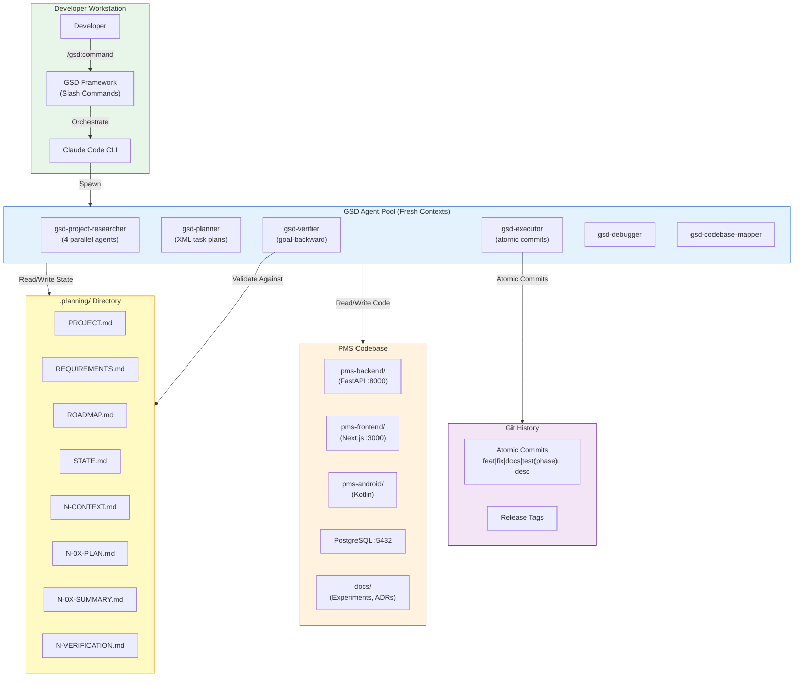

# Product Requirements Document: GSD (Get Shit Done) Integration into Patient Management System (PMS)

**Document ID:** PRD-PMS-GSD-001
**Version:** 1.0
**Date:** 2026-03-09
**Author:** Ammar (CEO, MPS Inc.)
**Status:** Draft

---

## 1. Executive Summary

GSD (Get Shit Done) is an open-source (MIT license, 26.8K GitHub stars) spec-driven development (SDD) framework that orchestrates AI coding assistants — Claude Code, OpenCode, Gemini CLI, and Codex — through structured multi-agent workflows with fresh context isolation. Created by Lex Christopherson in December 2025, GSD has rapidly matured to v1.22.4 with 428 tests and a 9-matrix CI pipeline.

GSD's core architectural innovation is **context engineering**: instead of letting an AI assistant accumulate context until quality degrades, GSD spawns fresh 200K-token context windows for each execution task, passing only the files each agent needs. State is maintained not in chat history but in a `.planning/` directory of structured markdown files with YAML frontmatter. Tasks are grouped into parallel "waves" where independent work executes simultaneously, while dependent work respects ordering.

Integrating GSD into the PMS development workflow would standardize how the team builds features across the FastAPI backend, Next.js frontend, and Android app. Instead of ad-hoc Claude Code sessions that lose focus on long features, GSD provides a repeatable Define → Plan → Execute → Verify pipeline with atomic git commits per task, goal-backward verification, and full audit trails — critical properties for healthcare software development under ISO 13485 quality management.

## 2. Problem Statement

PMS development involves complex, multi-platform features (backend API + frontend UI + Android + database migrations) that often span multiple sprints. Current AI-assisted development with Claude Code faces three specific challenges:

1. **Context degradation on long features**: When building a multi-file feature like a new encounter workflow, Claude Code's context window fills with accumulated state from earlier steps. By the time the developer reaches integration testing, the AI has lost track of decisions made during API design, producing inconsistent code.

2. **No structured development lifecycle**: Developers jump between planning, coding, and testing without a formalized workflow. This leads to incomplete implementations, missed edge cases, and rework — particularly costly in healthcare where regulatory documentation (ISO 13485 DHF) requires traceability from requirements to tests.

3. **Single-threaded execution**: Complex features have independent subtasks (e.g., backend API endpoint and frontend component) that could be developed in parallel. Current workflows serialize all work through one Claude Code session, wasting developer time.

GSD addresses all three by isolating context per task, enforcing a structured lifecycle with document-driven state, and executing independent tasks in parallel waves.

## 3. Proposed Solution

### 3.1 Architecture Overview

### 3.2 Deployment Model

**Developer-local installation**: GSD installs as slash commands into the Claude Code configuration directory (`~/.claude/`). No server, no Docker container, no cloud dependency. All state lives in the `.planning/` directory within the PMS repository.

**CI/CD compatibility**: GSD supports non-interactive installation (`npx get-shit-done-cc --claude --global`) for Docker-based CI environments. The `.planning/` directory can be committed to the repository for audit trail and team visibility.

**HIPAA considerations**:
- GSD itself does not handle PHI — it orchestrates AI agents that read/write code and documentation files
- The `.planning/` directory contains project specifications, task plans, and execution summaries — not patient data
- Atomic git commits provide a complete audit trail of all code changes (ISO 13485 traceability)
- **Security note**: GSD documentation recommends `--dangerously-skip-permissions` for frictionless automation. **This MUST NOT be used in PMS development** — all Claude Code operations must go through the standard permission approval flow to prevent unauthorized file modifications in HIPAA-regulated code

## 4. PMS Data Sources

GSD does not directly interact with PMS APIs at runtime. It orchestrates the development process for building features that use these APIs:

- **Patient Records API (`/api/patients`)** — GSD plans, executes, and verifies implementation of patient record features. Task plans reference API contracts; verification agents validate endpoint behavior.
- **Encounter Records API (`/api/encounters`)** — Multi-step encounter workflow features benefit most from GSD's parallel wave execution (e.g., backend endpoint + frontend form + Android screen built simultaneously).
- **Medication & Prescription API (`/api/prescriptions`)** — Drug interaction features involving multiple subsystems (Sanford Guide, formulary lookup, CDS alerts) are ideal GSD candidates — each subsystem is an independent task within a wave.
- **Reporting API (`/api/reports`)** — Report features requiring database migrations, backend aggregations, and frontend visualizations span all platforms — GSD's phase-based planning prevents scope drift.

## 5. Component/Module Definitions

### 5.1 GSD PMS Configuration

**Description**: Project-level GSD configuration tailored for PMS development conventions — commit message format, branching strategy, model profiles, and quality gate settings.

**Input**: Developer preferences, PMS coding standards
**Output**: `.planning/config.json` with PMS-specific settings
**PMS APIs Used**: None (development tooling)

### 5.2 PMS Project Template

**Description**: Pre-configured `.planning/PROJECT.md` and `REQUIREMENTS.md` templates that reference PMS system requirements (SYS-REQ), domain requirements (SUB-*), and platform requirements (SUB-*-BE/WEB/AND). Links to existing `docs/specs/requirements/` files.

**Input**: Feature specification from product owner
**Output**: Structured project definition with requirement traceability
**PMS APIs Used**: None (references `docs/specs/requirements/` files)

### 5.3 HIPAA-Compliant Verification Agent

**Description**: Custom GSD verification agent extension that adds HIPAA-specific checks to the standard `gsd-verifier`: PHI exposure scanning, encryption validation, audit logging verification, and RBAC enforcement.

**Input**: Completed code changes, PMS security requirements
**Output**: Verification report with HIPAA compliance status
**PMS APIs Used**: Validates implementations of all PMS APIs for security compliance

### 5.4 ISO 13485 Artifact Generator

**Description**: Post-execution workflow that extracts GSD planning artifacts (`.planning/` files) into ISO 13485-compliant Design History File (DHF) entries. Maps GSD phases to DHF design input/output/verification stages.

**Input**: `.planning/` directory after milestone completion
**Output**: DHF-formatted markdown files in `docs/quality/DHF/`
**PMS APIs Used**: None (documentation generation)

### 5.5 Multi-Platform Wave Orchestrator

**Description**: GSD wave configuration optimized for PMS's three-platform architecture. Automatically groups independent backend, frontend, and Android tasks into parallel waves while respecting cross-platform dependencies (e.g., API contract must exist before frontend integration).

**Input**: Task plans with platform annotations
**Output**: Wave execution schedule with dependency graph
**PMS APIs Used**: None (development orchestration)

## 6. Non-Functional Requirements

### 6.1 Security and HIPAA Compliance

| Requirement | Implementation |
|---|---|
| No `--dangerously-skip-permissions` | PMS CLAUDE.md explicitly prohibits this flag; GSD config sets `mode: interactive` |
| PHI scanning in verification | Custom verifier agent scans all generated code for PHI patterns before commit |
| Audit trail | All `.planning/` files committed to Git; atomic commits provide per-task history |
| Credential protection | GSD agents prohibited from reading `.env`, `credentials.json`, or `*secret*` files |
| Code review enforcement | GSD `complete-milestone` triggers PR creation (not direct push to main) |
| Encryption validation | Verifier checks that new database columns with PHI use encryption-at-rest |

### 6.2 Performance

| Metric | Target |
|---|---|
| Context isolation overhead | < 30 seconds per agent spawn |
| Parallel wave speedup | 2-3x vs sequential execution for multi-platform features |
| Planning phase duration | < 15 minutes for standard features |
| Execution phase duration | Proportional to feature complexity (GSD adds ~10% overhead for orchestration) |
| Verification phase duration | < 10 minutes per phase |
| Token efficiency | 30-40% reduction vs monolithic Claude Code session |

### 6.3 Infrastructure

| Component | Resource Requirements |
|---|---|
| GSD Framework | Node.js >= 16.7.0, zero runtime dependencies |
| Claude Code CLI | Latest version with MCP support |
| `.planning/` storage | < 10 MB per feature (markdown files) |
| Git | 2.40+ (for atomic commit and tagging support) |
| Developer workstation | Standard development machine (no GPU, no Docker required) |

## 7. Implementation Phases

### Phase 1: Foundation (Sprints 1-2)

- Install GSD globally for all PMS developers
- Create PMS-specific `config.json` template with coding standards, branching strategy (`phase`), and model profile (`quality`)
- Write PMS `PROJECT.md` template referencing system requirements hierarchy
- Create `REQUIREMENTS.md` template with links to `docs/specs/requirements/`
- Document GSD workflow in `docs/quality/processes/` as a developer working instruction
- Test with a small feature (e.g., add a new report endpoint)

### Phase 2: Core Integration (Sprints 3-4)

- Build HIPAA-compliant verification agent extension
- Create ISO 13485 artifact generator (`.planning/` → DHF entries)
- Configure multi-platform wave orchestration for backend/frontend/Android parallelism
- Integrate GSD milestone completion with GitHub PR creation
- Train development team on GSD workflow (lunch-and-learn sessions)
- Execute 2-3 real features using full GSD workflow

### Phase 3: Advanced Features (Sprints 5-6)

- Build GSD metrics dashboard (execution times, token usage, wave parallelism ratios)
- Create PMS-specific agent customizations (security patterns, API conventions, test requirements)
- Integrate GSD with CI/CD pipeline (automated verification on PR)
- Implement GSD brownfield analysis (`/gsd:map-codebase`) for legacy code migration
- Create reusable GSD project templates for common PMS feature types (CRUD endpoint, CDS integration, report builder)

## 8. Success Metrics

| Metric | Target | Measurement Method |
|---|---|---|
| Feature completion rate | 95% of planned tasks completed per phase | `.planning/` verification reports |
| Context-related rework | 50% reduction vs pre-GSD baseline | Git revert/fix commit frequency |
| Multi-platform parallelism | 2x speedup on cross-platform features | Wave execution timing logs |
| Commit quality | 100% atomic, semantically tagged commits | Git log analysis |
| HIPAA verification coverage | 100% of features pass HIPAA checks | Verification agent reports |
| DHF artifact generation | 100% of features produce DHF entries | `docs/quality/DHF/` audit |
| Developer satisfaction | 4.0+ / 5.0 rating | Quarterly developer survey |
| Token efficiency | 30% reduction in API costs per feature | Claude API usage tracking |

## 9. Risks and Mitigations

| Risk | Impact | Mitigation |
|---|---|---|
| GSD framework immaturity (3 months old, rapid iteration) | Breaking changes on update, workflow disruption | Pin GSD version; test updates in isolated branch; use `/gsd:reapply-patches` for local customizations |
| `--dangerously-skip-permissions` misuse | Unauthorized code changes, potential PHI exposure | Explicit prohibition in CLAUDE.md and GSD config; pre-commit hook that rejects this flag in shell history |
| Over-engineering simple tasks | Developer time wasted on ceremony for small fixes | Use `/gsd:quick` for bug fixes and small changes; full workflow only for multi-file features |
| Parallel wave race conditions | Conflicting code changes when multiple agents write simultaneously | GSD's wave dependency system prevents this; additionally, Git conflict detection catches any issues |
| `.planning/` directory bloat | Repository size growth over many features | Archive completed milestones; `.gitignore` research artifacts; periodic cleanup |
| Learning curve for team | Reduced productivity during adoption period | Phase 1 uses simple features; pair programming with GSD; lunch-and-learn sessions |
| Single-maintainer risk | Framework abandoned or direction change | MIT license allows forking; GSD's architecture is documented; agents are plain markdown (portable) |

## 10. Dependencies

| Dependency | Version | Purpose |
|---|---|---|
| `get-shit-done-cc` (npm) | v1.22.4+ | GSD framework installer and CLI utilities |
| Node.js | >= 16.7.0 | GSD installer and hook runtime |
| Claude Code CLI | Latest | Primary AI runtime for GSD agents |
| Git | 2.40+ | Atomic commits, branching, tagging |
| PMS codebase | Current | Target for GSD-orchestrated development |
| `docs/specs/requirements/` | Current | Requirement traceability source for GSD plans |

## 11. Comparison with Existing Experiments

| Aspect | Experiment 61 (GSD) | Experiment 27 (Claude Code) | Experiment 14 (Agent Teams) | Experiment 19 (Superpowers) |
|---|---|---|---|---|
| **Focus** | Structured development lifecycle | AI-native development environment | Multi-agent collaboration | Workflow enforcement skills |
| **Context management** | Fresh 200K windows per task | Single session, CLAUDE.md memory | Shared task lists, mailbox messaging | Socratic brainstorming, TDD |
| **Parallelism** | Wave-based parallel execution | Subagents (manual) | Agent teams (built-in) | Sequential (skill-driven) |
| **State management** | `.planning/` directory (markdown) | CLAUDE.md, memory files | Shared task lists | Claude Code session state |
| **Verification** | Goal-backward verifier agent | Manual testing | No built-in verification | Two-stage code review |
| **Complementary** | Uses Claude Code (Exp 27) as runtime; complements Agent Teams (Exp 14) for feature-level planning; extends Superpowers (Exp 19) with lifecycle structure | Provides the AI runtime GSD orchestrates | Could be used within GSD execution tasks | Skills could augment GSD agent capabilities |

**Key differentiator**: GSD operates at the **feature lifecycle level** — spanning planning through verification — while Claude Code (Exp 27), Agent Teams (Exp 14), and Superpowers (Exp 19) operate at the **session or task level**. GSD orchestrates the full Define → Plan → Execute → Verify → Ship workflow with document-driven state that persists across sessions.

## 12. Research Sources

### Official Documentation
- [GSD GitHub Repository](https://github.com/gsd-build/get-shit-done) — Source code, README, installation instructions
- [GSD Official Website](https://gsd.build) — Product overview and community links
- [GSD User Guide](https://github.com/gsd-build/get-shit-done/blob/main/docs/USER-GUIDE.md) — Detailed usage documentation

### Architecture & Design
- [DeepWiki — GSD Architecture](https://deepwiki.com/gsd-build/get-shit-done) — Agent hierarchy, workflow pipeline, multi-runtime support
- [One Codebase, Three Runtimes (Medium)](https://medium.com/@richardhightower/one-codebase-three-runtimes-how-gsd-targets-claude-code-opencode-and-gemini-cli-29c98cfe96c6) — Multi-runtime transformation pipeline

### Ecosystem & Comparison
- [Agentic Coding: GSD vs Spec Kit vs OpenSpec vs Taskmaster AI (Medium)](https://medium.com/@richardhightower/agentic-coding-gsd-vs-spec-kit-vs-openspec-vs-taskmaster-ai-where-sdd-tools-diverge-0414dcb97e46) — SDD tool landscape comparison
- [What Is GSD? Spec-Driven Development Without the Ceremony (Medium)](https://medium.com/@richardhightower/what-is-gsd-spec-driven-development-without-the-ceremony-570216956a84) — Core philosophy and design rationale
- [npm — get-shit-done-cc](https://www.npmjs.com/package/get-shit-done-cc) — Package details and version history

### Security
- [get-shit-done-cc Security Analysis (aikido.dev)](https://intel.aikido.dev/packages/npm/get-shit-done-cc) — Dependency and vulnerability analysis

## 13. Appendix: Related Documents

- [GSD Setup Guide](61-GSD-PMS-Developer-Setup-Guide.md)
- [GSD Developer Tutorial](61-GSD-Developer-Tutorial.md)
- [Claude Code Developer Tutorial (Experiment 27)](27-ClaudeCode-Developer-Tutorial.md)
- [Agent Teams Reference (Experiment 14)](14-agent-teams-claude-whitepaper.md)
- [Superpowers PMS Integration (Experiment 19)](19-PRD-Superpowers-PMS-Integration.md)
- [PMS Developer Working Instructions](../quality/processes/PMS_Developer_Working_Instructions.md)
- [GSD GitHub Repository](https://github.com/gsd-build/get-shit-done)
