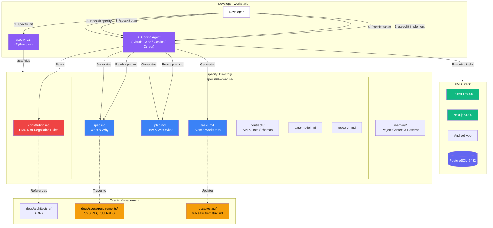

# Product Requirements Document: GitHub Spec Kit Integration into Patient Management System (PMS)

**Document ID:** PRD-PMS-SPECKIT-001
**Version:** 1.0
**Date:** 2026-03-09
**Author:** Ammar (CEO, MPS Inc.)
**Status:** Draft

---

## 1. Executive Summary

GitHub Spec Kit is an open-source (MIT-licensed) toolkit for Spec-Driven Development (SDD), a methodology that treats specifications as the primary artifact and code as their expression. With 40,600+ GitHub stars since its August 2025 launch, Spec Kit provides a structured five-phase workflow — Constitution → Specify → Plan → Tasks → Implement — that transforms how AI coding agents (GitHub Copilot, Claude Code, Gemini CLI, Cursor, Windsurf) interact with codebases. Instead of ad-hoc prompting, developers write precise specifications that agents implement, verify, and validate against immutable checkpoints.

Integrating Spec Kit into PMS establishes a **specification-first development culture** where every feature, API endpoint, and database migration begins as a structured specification before any code is written. The `constitution.md` file encodes PMS non-negotiable principles (HIPAA compliance, ISO 13485 traceability, clinician-in-the-loop AI design), ensuring that every AI-generated implementation respects healthcare constraints. The `spec.md` → `plan.md` → `tasks.md` pipeline produces auditable artifacts that map directly to PMS requirement traceability (SYS-REQ → SUB-REQ → Implementation), supporting the Quality Management System documented in `docs/quality/`.

Unlike GSD (Experiment 61), which focuses on execution-layer orchestration with context isolation and wave-based parallelism, Spec Kit operates at the **specification layer** — defining *what* gets built and *why* before any agent writes code. The two tools are complementary: Spec Kit generates the specifications that GSD can then execute. Together, they create a complete spec-to-ship pipeline where specifications are the single source of truth, implementation is automated, and every artifact is traceable to a requirement.

## 2. Problem Statement

PMS development currently lacks a standardized specification process that bridges requirements and AI-assisted implementation. Specific gaps:

1. **Ad-hoc AI prompting**: Developers prompt Claude Code or Copilot with informal descriptions ("add a vitals endpoint"). The resulting code quality depends entirely on the prompt quality. There's no structured specification that ensures the AI understands constraints, dependencies, and acceptance criteria before writing code.

2. **No constitutional guardrails**: PMS has architectural decisions in `docs/architecture/` and HIPAA requirements in `docs/quality/`, but these aren't machine-readable or automatically enforced during AI-assisted development. An AI agent adding a new endpoint might skip RLS policies, omit audit logging, or use a non-compliant authentication pattern.

3. **Missing specification-to-requirement traceability**: PMS maintains requirements in `docs/specs/requirements/` (SYS-REQ, SUB-REQ) but there's no automated link between a feature specification and its parent requirement. When auditors ask "how does this code trace back to SYS-REQ-0012?", the answer requires manual documentation.

4. **Inconsistent feature handoffs**: When a feature moves from design to implementation, context is lost. The developer's mental model of the feature differs from what was discussed in planning. PRDs exist in `docs/features/` but they're not structured for AI agents to consume and implement directly.

5. **No checkpoint validation**: AI agents can implement an entire feature incorrectly with no gate to catch the drift. There's no mechanism to verify that the plan matches the spec, or that the tasks match the plan, before code is written.

## 3. Proposed Solution

### 3.1 Architecture Overview

### 3.2 Deployment Model

- **Developer workstation only**: Spec Kit is a development-time tool — no runtime infrastructure, no Docker containers, no cloud services. It runs locally via the `specify` CLI and integrates with AI coding agents already on the developer's machine.
- **Version controlled**: All `.specify/` artifacts are committed to Git alongside the codebase. Specifications are peer-reviewed in PRs just like code.
- **HIPAA considerations**: Specification documents may reference PHI-adjacent concepts (patient data schemas, API contracts). The `constitution.md` includes rules requiring PHI example data to use synthetic/de-identified values. No actual PHI is stored in specifications.
- **Agent-agnostic**: Works with Claude Code (primary PMS tool), GitHub Copilot, Cursor, Gemini CLI, Windsurf, and 12+ other agents.

## 4. PMS Data Sources

| PMS API | Spec Kit Integration | Purpose |
|---------|---------------------|---------|
| Patient Records API (`/api/patients`) | `contracts/patients-api.md` — API contract specification | Define request/response schemas, RLS requirements, and validation rules before implementation |
| Encounter Records API (`/api/encounters`) | `data-model.md` — encounter data model specification | Specify encounter lifecycle states, SOAP note structure, and ICD-10/CPT code associations |
| Medication & Prescription API (`/api/prescriptions`) | `spec.md` user stories — prescription workflow specifications | Capture clinician workflows, prior auth requirements, and pharmacist review gates |
| Reporting API (`/api/reports`) | `plan.md` — technical plan for report generation | Define aggregation queries, scheduling requirements, and export formats |

## 5. Component/Module Definitions

### 5.1 PMS Constitution Module

- **Description**: A `constitution.md` encoding all PMS non-negotiable development principles — HIPAA compliance, ISO 13485 traceability, testing requirements, code style, and architectural patterns
- **Input**: Existing ADRs from `docs/architecture/`, quality processes from `docs/quality/`, coding standards
- **Output**: Machine-readable constitution that all AI agents must follow during specification and implementation
- **PMS APIs**: All — the constitution governs every feature

### 5.2 Feature Specification Pipeline

- **Description**: The full `specify → plan → tasks → implement` pipeline customized for PMS features, with templates that include HIPAA security review sections, requirement traceability fields, and ISO 13485 Design History File (DHF) references
- **Input**: Feature requests, requirement IDs (SYS-REQ-XXXX), user stories from clinical stakeholders
- **Output**: `spec.md`, `plan.md`, `tasks.md`, `contracts/`, `data-model.md` for each feature
- **PMS APIs**: Feature-dependent — each specification references the relevant APIs

### 5.3 Requirement Traceability Bridge

- **Description**: Custom Spec Kit templates that link every `spec.md` to its parent SYS-REQ/SUB-REQ requirement IDs, and every `tasks.md` entry to its verification method in the traceability matrix
- **Input**: Requirement IDs from `docs/specs/requirements/`, specification artifacts
- **Output**: Updated `docs/testing/traceability-matrix.md` entries, cross-references in spec files
- **PMS APIs**: Indirect — generates documentation that covers all APIs

### 5.4 API Contract Generator

- **Description**: Spec Kit `contracts/` directory templates that produce OpenAPI-compatible API contract specifications, validated against existing PMS endpoint patterns
- **Input**: Feature spec.md, existing `docs/api/backend-endpoints.md`
- **Output**: API contract markdown files that define request/response schemas, authentication requirements, error codes, and RLS policies
- **PMS APIs**: All new endpoints — contracts are generated before code

### 5.5 Constitution Compliance Checker

- **Description**: Integration with Claude Code to verify that generated plans and implementations comply with the PMS constitution — checking for HIPAA audit logging, RLS policies, input validation, and testing requirements
- **Input**: Implementation code, constitution.md rules
- **Output**: Compliance report with pass/fail per constitution rule
- **PMS APIs**: All — runs as a post-implementation validation step

## 6. Non-Functional Requirements

### 6.1 Security and HIPAA Compliance

| Requirement | Implementation |
|------------|---------------|
| PHI in specifications | Constitution rule: all example data in specs must use synthetic/de-identified values. Never use real patient data. |
| Audit logging requirement | Constitution rule: every new API endpoint specification must include an audit logging section. |
| RLS policy requirement | Constitution rule: every new database table specification must include RLS policy definitions. |
| Authentication requirement | Constitution rule: every API contract must specify authentication method (Supabase JWT / API key). |
| Encryption requirement | Constitution rule: any specification involving PHI storage must define encryption-at-rest (AES-256) and in-transit (TLS 1.3) requirements. |
| Spec review gate | All spec.md and plan.md files require peer review before implementation phase begins. |

### 6.2 Performance

| Metric | Target |
|--------|--------|
| `specify init` execution | < 10s |
| Spec generation (Phase 1) | < 2 min (AI agent dependent) |
| Plan generation (Phase 2) | < 3 min (AI agent dependent) |
| Task generation (Phase 3) | < 2 min (AI agent dependent) |
| Specification artifact size | < 50KB per feature (readable, not bloated) |

### 6.3 Infrastructure

| Component | Requirement |
|-----------|------------|
| Python | 3.11+ (for specify CLI) |
| uv | Latest (Python package manager) |
| AI Agent | Claude Code (primary), Copilot, Cursor, or any supported agent |
| Git | 2.40+ (specifications are version controlled) |
| Storage | ~1MB per feature specification set |

## 7. Implementation Phases

### Phase 1: Foundation (Sprints 1-2, 4 weeks)

- Install `specify` CLI for all PMS developers
- Create PMS `constitution.md` encoding all architectural decisions, HIPAA rules, and coding standards
- Create PMS-specific templates for `spec.md`, `plan.md`, and `tasks.md` with HIPAA and ISO 13485 sections
- Run pilot: specify one existing PMS feature (e.g., patient CRUD) to validate the workflow
- Document the PMS Spec Kit conventions in `docs/experiments/`

### Phase 2: Full Adoption (Sprints 3-4, 4 weeks)

- Require Spec Kit specifications for all new PMS features
- Create API contract templates matching existing `docs/api/backend-endpoints.md` format
- Implement requirement traceability bridge — link spec.md to SYS-REQ IDs
- Create custom `memory/` entries for PMS-specific patterns (Supabase auth, RLS, CrewAI agents)
- Train team on `specify → plan → tasks → implement` workflow

### Phase 3: Advanced Integration (Sprints 5-6, 4 weeks)

- Integrate Spec Kit with GSD (Experiment 61) — Spec Kit generates specifications, GSD executes them
- Build constitution compliance checker as Claude Code skill
- Automate traceability matrix updates from tasks.md
- Create specification review GitHub Action for PR validation
- Benchmark: measure feature delivery time and defect rate before/after Spec Kit adoption

## 8. Success Metrics

| Metric | Target | Measurement Method |
|--------|--------|--------------------|
| Specification coverage | 100% of new features have spec.md + plan.md + tasks.md | Git audit of .specify/ directory |
| Requirement traceability | 100% of specs link to SYS-REQ/SUB-REQ IDs | Traceability matrix review |
| Constitution compliance | 95%+ of implementations pass constitution checks | Automated compliance checker output |
| Feature defect rate | 30% reduction in post-implementation bugs | Bug tracker comparison (before/after) |
| Specification review time | < 30 min per spec review | PR review timestamps |
| Developer adoption | 90%+ of team uses Spec Kit for new features | Sprint retrospective survey |
| AI agent accuracy | 40% reduction in "spec drift" (implementation diverging from intent) | Code review findings |

## 9. Risks and Mitigations

| Risk | Impact | Mitigation |
|------|--------|------------|
| Over-specification slows development | High — bureaucratic overhead kills velocity | Keep specs lean. Constitution limits spec length. Pilot to calibrate right level of detail. |
| AI agent ignores constitution | Medium — non-compliant code gets generated | Post-implementation compliance checker catches violations. PR review enforces. |
| Specification documents become stale | Medium — specs diverge from implementation over time | Specs evolve with code. Constitution rule: "update spec when implementation changes." |
| Team resistance to new workflow | Medium — developers skip Spec Kit | Phase-in gradually. Show time savings from pilot. Make it the path of least resistance. |
| Templates don't fit PMS domain | Low — generic templates miss healthcare specifics | Custom PMS templates with HIPAA and ISO 13485 sections. Iterate based on team feedback. |
| Spec Kit project abandoned by GitHub | Low — MIT-licensed, community-maintained | Fork if needed. Core value is the methodology, not the CLI. |

## 10. Dependencies

| Dependency | Version | Purpose |
|-----------|---------|---------|
| `specify` CLI | v0.1.12+ | Project scaffolding and template management |
| Python | 3.11+ | CLI runtime |
| uv | latest | Python package manager for specify |
| Claude Code | latest | Primary AI agent for PMS |
| Git | 2.40+ | Version control for specifications |
| PMS CLAUDE.md | current | Integration point for constitution rules |
| GSD (Experiment 61) | latest | Complementary execution framework (Phase 3) |

## 11. Comparison with Existing Experiments

| Aspect | Exp 61: GSD | Exp 62: GitHub Spec Kit |
|--------|------------|------------------------|
| **Focus** | Execution-layer orchestration | Specification-layer definition |
| **Primary artifact** | `.planning/` directory with execution state | `.specify/` directory with specification artifacts |
| **AI agent role** | Execute tasks with fresh context isolation | Generate and validate specifications, then implement |
| **Workflow** | discuss → plan → execute → verify | constitution → specify → plan → tasks → implement |
| **Parallelism** | Wave-based parallel task execution | Sequential specification phases with parallel task implementation |
| **Constitution** | CLAUDE.md rules | constitution.md with enforcement |
| **Traceability** | Git commits linked to tasks | Spec artifacts linked to requirements |
| **Community** | 2,400 stars, Claude Code-specific | 40,600 stars, 18+ agent support |
| **Complementary?** | Yes — GSD executes what Spec Kit specifies | Yes — Spec Kit defines what GSD executes |

The two tools occupy different layers of the development stack. Spec Kit is the **specification layer** (what gets built), GSD is the **execution layer** (how it gets built). In Phase 3, we integrate them: Spec Kit generates `spec.md` → `plan.md` → `tasks.md`, then GSD ingests those tasks and executes them with context isolation, wave parallelism, and atomic commits. This creates a complete spec-to-ship pipeline with full traceability.

The existing [GSD vs Spec Kit Comparative Tutorial](61-GSD-vs-SpecKit-Comparative-Tutorial.md) already documents a side-by-side comparison — Experiment 62 builds on that foundation with full PMS integration.

## 12. Research Sources

### Official Documentation
- [GitHub Spec Kit Repository](https://github.com/github/spec-kit) — Source code, README, templates, and releases
- [Spec-Driven Development Methodology](https://github.com/github/spec-kit/blob/main/spec-driven.md) — Core SDD principles and phase definitions
- [Spec Kit AGENTS.md](https://github.com/github/spec-kit/blob/main/AGENTS.md) — Supported AI agent integrations

### Architecture & Workflow
- [Spec Kit DeepWiki — Workflow](https://deepwiki.com/github/spec-kit/5-spec-driven-development-workflow) — Detailed phase-by-phase workflow documentation
- [Microsoft Developer Blog — Diving Into SDD](https://developer.microsoft.com/blog/spec-driven-development-spec-kit) — Enterprise adoption guide and constitution examples
- [LogRocket Blog — Exploring Spec Kit](https://blog.logrocket.com/github-spec-kit/) — Practical walkthrough with code examples

### Ecosystem & Comparison
- [GSD vs Spec Kit vs OpenSpec vs Taskmaster AI](https://medium.com/@richardhightower/agentic-coding-gsd-vs-spec-kit-vs-openspec-vs-taskmaster-ai-where-sdd-tools-diverge-0414dcb97e46) — Comprehensive SDD tool comparison
- [GitHub Blog — Spec-Driven Development with AI](https://github.blog/ai-and-ml/generative-ai/spec-driven-development-with-ai-get-started-with-a-new-open-source-toolkit/) — Official announcement and rationale
- [Microsoft Learn — Spec Kit for Enterprise](https://learn.microsoft.com/en-us/training/modules/spec-driven-development-github-spec-kit-enterprise-developers/) — Enterprise training module

### Community & Adoption
- [Spec Kit Discussions — Is it maintained?](https://github.com/github/spec-kit/discussions/1482) — Community status and maintainer responsiveness
- [From PRD to Production Workflow](https://steviee.medium.com/from-prd-to-production-my-spec-kit-workflow-for-structured-development-d9bf6631d647) — Real-world practitioner workflow

## 13. Appendix: Related Documents

- [Spec Kit Setup Guide](62-SpecKit-PMS-Developer-Setup-Guide.md)
- [Spec Kit Developer Tutorial](62-SpecKit-Developer-Tutorial.md)
- [GitHub Spec Kit Repository](https://github.com/github/spec-kit)
- [Spec Kit Official Docs](https://github.github.com/spec-kit/)
- [Exp 61: GSD PMS Integration](61-PRD-GSD-PMS-Integration.md) — Complementary execution-layer framework
- [GSD vs Spec Kit Comparative Tutorial](61-GSD-vs-SpecKit-Comparative-Tutorial.md) — Side-by-side comparison
