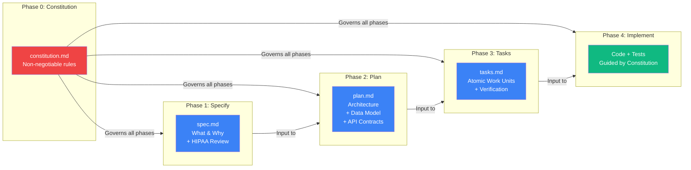
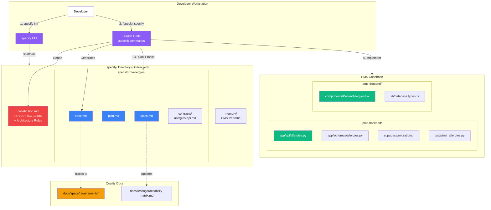

# GitHub Spec Kit Developer Onboarding Tutorial

**Welcome to the MPS PMS Spec Kit Integration Team**

This tutorial will take you from zero to building your first PMS feature using Spec-Driven Development. By the end, you will understand how GitHub Spec Kit works, have a running Spec Kit environment, and have built and tested a fully specified clinical feature end-to-end — from specification to implementation to verification.

**Document ID:** PMS-EXP-SPECKIT-002
**Version:** 1.0
**Date:** 2026-03-09
**Applies To:** PMS project (all platforms)
**Prerequisite:** [Spec Kit Setup Guide](62-SpecKit-PMS-Developer-Setup-Guide.md)
**Estimated time:** 2-3 hours
**Difficulty:** Beginner-friendly

---

## What You Will Learn

1. What Spec-Driven Development is and why it matters for healthcare software
2. How GitHub Spec Kit's five-phase workflow produces auditable specification artifacts
3. How the PMS constitution enforces HIPAA, ISO 13485, and architectural constraints
4. How to write a feature specification that traces to PMS system requirements
5. How to generate a technical plan with database schema, API contracts, and component design
6. How to break a plan into atomic, testable tasks
7. How to implement tasks with AI agent assistance while respecting constitutional guardrails
8. How Spec Kit complements GSD (Experiment 61) for a complete spec-to-ship pipeline
9. When to use Spec Kit vs ad-hoc AI prompting vs GSD
10. How specification artifacts support ISO 13485 Design History File (DHF) requirements

---

## Part 1: Understanding Spec Kit (15 min read)

### 1.1 What Problem Does Spec Kit Solve?

Today, a PMS developer building a new feature follows this workflow:

1. Read the feature request in a Slack message or meeting notes
2. Open Claude Code and type: "Build an allergies endpoint for patients"
3. Claude Code generates code — maybe correct, maybe not
4. Review, fix, iterate
5. Hope the result matches what was intended

The problems:
- **No specification**: There's no document capturing *what* was built and *why*
- **No guardrails**: Claude Code doesn't know about PMS HIPAA requirements unless you tell it every time
- **No traceability**: There's no link from the code to the system requirement (SYS-REQ) it fulfills
- **No checkpoint**: There's no gate between "deciding what to build" and "building it"

**With Spec Kit**, that workflow becomes:

1. `/speckit specify` — Write a structured specification (what, why, constraints, HIPAA review)
2. `/speckit plan` — Generate a technical plan (how, with what, dependencies)
3. `/speckit tasks` — Break into atomic, testable work units
4. `/speckit implement` — Execute tasks with AI agent, guided by the constitution

Every phase produces an artifact. Every artifact is peer-reviewed. Every specification traces to a requirement. The constitution ensures HIPAA compliance is checked before any code is written.

### 1.2 How Spec Kit Works — The Key Pieces



**Three concepts to internalize:**

1. **The Constitution is law.** Every AI agent interaction must respect the rules in `constitution.md`. If the constitution says "every table needs RLS," the agent cannot generate a table without RLS. Period.

2. **Artifacts form a dependency chain.** `spec.md` → `plan.md` → `tasks.md` → implementation. You can't generate a plan without a spec. You can't generate tasks without a plan. Each artifact is immutable once approved — it becomes the historical record.

3. **Specifications are the primary artifact, not code.** Code is the *expression* of a specification in a particular language. Maintaining software means evolving specifications first, then regenerating code. This inverts the traditional relationship where specs are an afterthought.

### 1.3 How Spec Kit Fits with Other PMS Technologies

| Technology | Exp # | Relationship to Spec Kit |
|-----------|-------|------------------------|
| GSD | 61 | **Complementary execution layer.** Spec Kit defines *what* (specifications), GSD defines *how* (execution with context isolation, wave parallelism). Phase 3 integration feeds Spec Kit tasks.md into GSD. |
| CrewAI | 55 | Spec Kit can specify CrewAI agent workflows — defining agent roles, tools, and handoffs as structured specifications before implementation. |
| Supabase + Claude Code | 58 | Spec Kit specifications can define Supabase schemas, RLS policies, and Edge Functions. Constitution enforces Supabase-specific patterns. |
| Claude Code Skills | 60 | Custom skills can implement Spec Kit workflow steps — e.g., a `/pms-specify` skill that pre-fills HIPAA review sections. |
| vLLM | 52 | Spec Kit can specify AI inference endpoints — model selection, prompt templates, output schemas, and performance requirements. |

### 1.4 Key Vocabulary

| Term | Meaning |
|------|---------|
| **SDD** | Spec-Driven Development — methodology where specifications are the primary artifact and code is their expression |
| **Constitution** | `constitution.md` — non-negotiable rules that govern all AI agent interactions with the project |
| **Specify Phase** | Phase 1 — define what the feature does, why it exists, user stories, constraints, and HIPAA review |
| **Plan Phase** | Phase 2 — define how the feature is built, architecture, database schema, API contracts |
| **Tasks Phase** | Phase 3 — break the plan into atomic, testable work units |
| **Implement Phase** | Phase 4 — AI agent executes tasks, guided by constitution |
| **Artifact** | A specification document (spec.md, plan.md, tasks.md) that serves as historical record |
| **Checkpoint** | A gate between phases — artifact must be reviewed before proceeding |
| **Contract** | API contract specification in `contracts/` — request/response schemas, auth, error codes |
| **Memory** | `.specify/memory/` — persistent project context that the AI agent loads (constitution, patterns) |
| **specify CLI** | Command-line tool that scaffolds projects, manages templates, and installs agent commands |
| **Requirement Traceability** | Link from spec.md to SYS-REQ/SUB-REQ IDs in `docs/specs/requirements/` |

### 1.5 Our Architecture



---

## Part 2: Environment Verification (15 min)

### 2.1 Checklist

1. **specify CLI installed**:
   ```bash
   specify --version
   # Expected: 0.1.12+
   ```

2. **Spec Kit initialized**:
   ```bash
   ls .specify/
   # Expected: memory/ specs/ templates/ commands/
   ```

3. **Constitution exists**:
   ```bash
   head -3 .specify/memory/constitution.md
   # Expected: "# PMS Project Constitution"
   ```

4. **Claude Code recognizes commands**:
   ```bash
   claude
   # Type: /speckit
   # Expected: Shows available subcommands (specify, plan, tasks, implement)
   ```

5. **Git tracking**:
   ```bash
   git status | grep .specify
   # Expected: .specify/ files shown (staged or untracked)
   ```

### 2.2 Quick Test

Run the simplest possible specification to confirm the full pipeline works:

```bash
claude

# Prompt: "/speckit specify"
# When asked, describe: "Add a health check endpoint at /api/health
# that returns the current server time and database connection status.
# No authentication required. Traces to SYS-REQ-0001."
```

Expected: Claude Code generates a `spec.md` file in `.specify/specs/` that includes the "Requirement Traceability" and "HIPAA Security Review" sections from your constitution.

---

## Part 3: Build Your First Integration (45 min)

### 3.1 What We Are Building

We'll build a **Patient Allergies Management** feature using the full Spec Kit workflow. This is a real PMS feature that:
- Allows providers to record, view, and update patient allergies
- Enforces RLS so only the patient's care team can access allergy records
- Includes severity classification (mild/moderate/severe/life-threatening)
- Traces to SYS-REQ-0003 (Patient Clinical Data Management)

### 3.2 Step 1: Create the Specification

Open Claude Code and start the specification phase:

```
/speckit specify
```

When prompted, provide:

```
Feature: Patient Allergies Management

Description: Add the ability for providers to manage patient allergies.
Each allergy record includes: allergen name, allergy type (drug/food/
environmental), severity (mild/moderate/severe/life-threatening), reaction
description, onset date, and whether it's currently active.

Only the patient's assigned providers should be able to view and modify
allergy records. Nurses can view but not modify.

This feature traces to SYS-REQ-0003 (Patient Clinical Data Management).

User Stories:
1. As a provider, I want to record a new allergy for a patient so that
   the care team is aware of potential adverse reactions.
2. As a provider, I want to update allergy severity when a patient's
   condition changes.
3. As a nurse, I want to view a patient's allergy list before
   administering medication.
```

**Review the generated spec.md**. Verify it includes:
- Requirement Traceability section linking to SYS-REQ-0003
- HIPAA Security Review with PHI justification
- User stories with acceptance criteria
- Constraints from the constitution

### 3.3 Step 2: Generate the Technical Plan

```
/speckit plan
```

Claude Code reads spec.md and generates plan.md. Review it for:

- **Database schema**: `allergies` table with proper columns, foreign keys, and RLS policies
- **API endpoints**: `POST /api/allergies`, `GET /api/allergies/{patient_id}`, `PUT /api/allergies/{id}`
- **Authentication**: Supabase JWT verification
- **Frontend components**: PatientAllergies list and form components
- **Dependencies**: Supabase, existing PMS auth middleware

Example expected plan.md excerpt:

```markdown
## Database Schema

### allergies table

| Column | Type | Constraints |
|--------|------|------------|
| id | UUID | PK, DEFAULT gen_random_uuid() |
| patient_id | UUID | FK → patients(id), NOT NULL |
| provider_id | UUID | FK → auth.users(id), NOT NULL |
| allergen_name | TEXT | NOT NULL |
| allergy_type | TEXT | CHECK (type IN ('drug','food','environmental')) |
| severity | TEXT | CHECK (severity IN ('mild','moderate','severe','life-threatening')) |
| reaction | TEXT | |
| onset_date | DATE | |
| is_active | BOOLEAN | DEFAULT true |
| created_at | TIMESTAMPTZ | DEFAULT now() |
| updated_at | TIMESTAMPTZ | DEFAULT now() |

### RLS Policies

- Providers: SELECT, INSERT, UPDATE WHERE auth.uid() = provider_id
- Nurses: SELECT only WHERE patient_id IN (SELECT patient_id FROM care_team WHERE nurse_id = auth.uid())
```

### 3.4 Step 3: Generate Atomic Tasks

```
/speckit tasks
```

Claude Code reads plan.md and generates tasks.md. Expected output:

```markdown
## Tasks

### Backend Tasks

- [ ] Task 1: Create allergies migration
  - File: supabase/migrations/XXXXX_create_allergies.sql
  - Creates table, RLS policies, indexes
  - Verify: `supabase db push` succeeds, RLS active

- [ ] Task 2: Create allergy Pydantic schemas
  - File: app/schemas/allergies.py
  - AllergyCreate, AllergyUpdate, AllergyResponse models
  - Verify: unit test with valid/invalid data

- [ ] Task 3: Create allergies FastAPI router
  - File: app/api/allergies.py
  - POST, GET, PUT endpoints with Supabase auth
  - Verify: integration tests pass, audit log entries created

- [ ] Task 4: Add allergies to patient API
  - File: app/api/patients.py (modify)
  - Include allergy summary in patient detail response
  - Verify: patient detail includes allergies array

### Frontend Tasks

- [ ] Task 5: Create PatientAllergies component
  - File: components/PatientAllergies.tsx
  - List view with severity badges, add/edit forms
  - Verify: renders allergy list, form submission works

- [ ] Task 6: Add allergies to patient detail page
  - File: app/patients/[id]/page.tsx (modify)
  - Include PatientAllergies component
  - Verify: allergies visible on patient detail

### Testing Tasks

- [ ] Task 7: Write backend tests
  - File: tests/test_allergies.py
  - Test CRUD operations, RLS enforcement, audit logging
  - Verify: all tests pass

- [ ] Task 8: Update traceability matrix
  - File: docs/testing/traceability-matrix.md
  - Link SYS-REQ-0003 to allergy test cases
  - Verify: matrix updated with new entries
```

### 3.5 Step 4: Implement

```
/speckit implement
```

Claude Code executes each task sequentially. For each task, it:
1. Reads the task description and the constitution
2. Generates the code
3. Runs the verification step
4. Marks the task as complete

Watch the output carefully. Verify that:
- The migration includes RLS policies (constitution rule #2)
- The API endpoints include authentication (constitution rule #3)
- Audit logging is present (constitution rule #3)
- Test files are created (constitution rule #12)

### 3.6 Step 5: Verify the Full Pipeline

```bash
# Check specification artifacts
ls .specify/specs/001-patient-allergies/
# Expected: spec.md, plan.md, tasks.md, contracts/, data-model.md

# Check implementation
ls app/api/allergies.py
ls app/schemas/allergies.py
ls tests/test_allergies.py
ls components/PatientAllergies.tsx

# Run tests
pytest tests/test_allergies.py -v

# Check traceability
grep "SYS-REQ-0003" docs/testing/traceability-matrix.md
```

---

## Part 4: Evaluating Strengths and Weaknesses (15 min)

### 4.1 Strengths

- **Structured specification before code**: Every feature has a clear "what" and "why" before any "how." This eliminates the ambiguity that causes rework.
- **Constitutional guardrails**: HIPAA compliance, testing requirements, and architectural patterns are enforced automatically — not dependent on developer memory.
- **Auditable artifacts**: `spec.md → plan.md → tasks.md → code` creates a complete audit trail for ISO 13485 DHF requirements. Every piece of code traces back to a specification, which traces to a requirement.
- **Agent-agnostic**: Works with Claude Code, Copilot, Cursor, Gemini, Windsurf, and 12+ other agents. Team members aren't locked to one tool.
- **Community momentum**: 40,600+ GitHub stars, active development, Microsoft Learn training modules. This isn't a niche experiment — it's becoming the industry standard.
- **Zero runtime overhead**: Pure development-time tool. No servers, no Docker, no cloud services. Just markdown files and a CLI.
- **Complementary to GSD**: Spec Kit handles the specification layer; GSD handles the execution layer. Together they're a complete pipeline.

### 4.2 Weaknesses

- **Over-specification risk**: For small changes (bug fixes, config updates), the full specify → plan → tasks pipeline is overkill. Need clear guidelines on when to use Spec Kit vs direct coding.
- **Specification drift**: If code changes without updating the spec, the artifacts become stale. Requires discipline to maintain spec-code alignment.
- **AI agent compliance varies**: Different agents follow the constitution with varying reliability. Claude Code is the strongest; others may need more explicit prompting.
- **Experimental status**: GitHub labels Spec Kit as an "experiment." Community discussions question maintainer responsiveness. MIT license means we can fork if needed.
- **Template customization overhead**: Default templates are generic. PMS-specific templates (HIPAA, ISO 13485) require upfront investment to create.
- **Learning curve**: The five-phase workflow adds process. Teams accustomed to direct AI prompting may resist the structure initially.

### 4.3 When to Use Spec Kit vs Alternatives

| Scenario | Use Spec Kit | Use GSD | Use Direct AI Prompting |
|----------|-------------|---------|------------------------|
| New feature with requirements | Yes — full pipeline | No — use for execution after | No |
| Bug fix (< 30 min) | No — overkill | No — overkill | Yes |
| Refactoring existing code | Maybe — spec the target state | Yes — execute the refactor | For small refactors |
| New API endpoint | Yes — spec the contract first | Optional — for complex endpoints | For trivial endpoints |
| Database migration | Yes — spec the schema and RLS | Optional | For adding a column |
| Multi-sprint epic | Yes — spec each feature | Yes — execute each sprint | No |
| Prototype / POC | No — too much process | No | Yes — speed matters |

**Rule of thumb**: Use Spec Kit when the feature touches patient data, requires HIPAA review, or traces to a system requirement. Use direct prompting for small, self-contained changes with no compliance implications.

### 4.4 HIPAA / Healthcare Considerations

| Concern | Spec Kit Approach |
|---------|------------------|
| PHI in specifications | Constitution rule: synthetic data only. Never reference real patients. |
| Compliance audit trail | spec.md → plan.md → tasks.md → code creates a complete DHF trace |
| Security review | HIPAA Security Review section is required in every spec.md |
| RLS enforcement | Constitution rule: every new table requires RLS specification |
| Access control | API contracts must specify authentication and authorization |
| Audit logging | Constitution rule: every endpoint must define auditable events |
| Specification storage | .specify/ is committed to Git — version controlled, reviewable, and auditable |

---

## Part 5: Debugging Common Issues (15 min read)

### Issue 1: AI Agent Generates Code Without Reading Constitution

**Symptom**: Generated code misses RLS policies, audit logging, or authentication
**Cause**: Agent didn't load `.specify/memory/constitution.md` before generating
**Fix**: Always use `/speckit` commands instead of free-form prompting. The commands force constitution loading. If using free-form, start with: "Read .specify/memory/constitution.md first, then..."

### Issue 2: Specification Artifacts Not Created in Expected Directory

**Symptom**: spec.md appears in project root instead of `.specify/specs/NNN-feature/`
**Cause**: `specify init` was run in wrong directory, or agent created file outside `.specify/`
**Fix**: Verify `.specify/` exists in project root. Re-run `specify init . --ai claude`. Move misplaced files to correct location.

### Issue 3: Plan Phase Generates Incorrect Architecture

**Symptom**: plan.md proposes Express.js instead of FastAPI, or MongoDB instead of PostgreSQL
**Cause**: Constitution's architecture section not specific enough, or agent hallucinating
**Fix**: Update constitution.md with explicit stack declarations. Add to memory/: "PMS uses FastAPI, not Express. PMS uses PostgreSQL, not MongoDB."

### Issue 4: Tasks Are Too Large or Too Vague

**Symptom**: A single task says "Implement the entire backend" — not atomic
**Cause**: Plan was too high-level, or tasks prompt didn't specify granularity
**Fix**: Constitution rule: "Tasks should be atomic — completable in under 2 hours each." Re-run `/speckit tasks` with explicit instruction: "Break into tasks that each touch at most 2 files."

### Issue 5: Requirement Traceability Missing

**Symptom**: spec.md doesn't include "Requirement Traceability" section
**Cause**: PMS template not loaded, or agent used default template
**Fix**: Ensure `.specify/templates/pms/spec-template.md` exists and includes the traceability section. Reference template explicitly when specifying.

### Issue 6: Conflicts Between Spec Kit and Existing PMS Patterns

**Symptom**: Generated plan contradicts existing `docs/architecture/` ADRs
**Cause**: Agent doesn't read ADRs automatically
**Fix**: Add key ADR summaries to `.specify/memory/` as context files. Constitution should reference: "Architecture decisions are recorded in docs/architecture/. Read relevant ADRs before generating plans."

---

## Part 6: Practice Exercises (45 min)

### Option A: Specify a Prescription Refill Workflow

Build a complete specification for an automated prescription refill workflow:

1. `/speckit specify` — Define: providers can initiate a refill, system checks for drug interactions, pharmacist reviews, patient is notified
2. `/speckit plan` — Include: refill status state machine, notification triggers, drug interaction check API call
3. `/speckit tasks` — Break into 8-10 atomic tasks
4. Don't implement — focus on specification quality

**Hints**: Reference SYS-REQ-0005 (Medication Management). Include drug interaction check as an external API call. Define all state transitions (requested → reviewed → approved/denied → dispensed).

### Option B: Specify a Clinical Dashboard Widget

Build a specification for a real-time vitals dashboard widget:

1. `/speckit specify` — Define: nurses see a grid of active patients with latest vitals, color-coded by abnormal values, real-time updates via Supabase
2. `/speckit plan` — Include: Supabase real-time subscription, React component hierarchy, RLS filtering by nursing unit
3. `/speckit tasks` — Break into tasks

**Hints**: Reference Experiment 58 (Supabase) for real-time patterns. Constitution should enforce that vitals data has RLS by nursing unit assignment.

### Option C: Specify a GSD-Spec Kit Integration

Build a specification for the Phase 3 integration between Spec Kit and GSD:

1. `/speckit specify` — Define: GSD reads tasks.md from .specify/ as its task input, executes with context isolation, reports completion status back
2. `/speckit plan` — Include: file format bridge, GSD configuration changes, completion webhook
3. `/speckit tasks` — Break into tasks

**Hints**: Review [GSD vs Spec Kit Comparative Tutorial](61-GSD-vs-SpecKit-Comparative-Tutorial.md) for integration points. This is a meta-specification — specifying the integration of specification tools.

---

## Part 7: Development Workflow and Conventions

### 7.1 File Organization

```
pms-backend/
├── .specify/
│   ├── memory/
│   │   └── constitution.md          # PMS rules
│   ├── specs/
│   │   ├── 001-patient-allergies/
│   │   │   ├── spec.md
│   │   │   ├── plan.md
│   │   │   ├── tasks.md
│   │   │   ├── contracts/
│   │   │   │   └── allergies-api.md
│   │   │   └── data-model.md
│   │   ├── 002-prescription-refills/
│   │   │   └── ...
│   │   └── ...
│   ├── templates/
│   │   └── pms/
│   │       └── spec-template.md
│   └── commands/
├── app/
├── tests/
└── CLAUDE.md                        # References constitution
```

### 7.2 Naming Conventions

| Item | Convention | Example |
|------|-----------|---------|
| Spec directory | `NNN-kebab-case-feature` | `001-patient-allergies` |
| Spec file | `spec.md` (always) | `specs/001-patient-allergies/spec.md` |
| Plan file | `plan.md` (always) | `specs/001-patient-allergies/plan.md` |
| Tasks file | `tasks.md` (always) | `specs/001-patient-allergies/tasks.md` |
| Contract files | `{resource}-api.md` | `contracts/allergies-api.md` |
| Spec ID | `SPEC-NNN` | `SPEC-001` |
| Requirement link | `SYS-REQ-XXXX` | `SYS-REQ-0003` |

### 7.3 PR Checklist

When submitting a PR that uses Spec Kit:

- [ ] `.specify/specs/NNN-feature/spec.md` exists and is complete
- [ ] spec.md includes "Requirement Traceability" with valid SYS-REQ/SUB-REQ IDs
- [ ] spec.md includes "HIPAA Security Review" section
- [ ] plan.md exists and references constitution-compliant patterns
- [ ] tasks.md exists with verification method for each task
- [ ] All tasks in tasks.md are marked complete
- [ ] Implementation matches plan.md architecture
- [ ] Tests exist for all new endpoints and components
- [ ] `docs/testing/traceability-matrix.md` updated with new entries
- [ ] No real PHI in specification documents or test data

### 7.4 Security Reminders

1. **Synthetic data only**: All examples in spec.md, plan.md, and test files must use synthetic patient data (e.g., "Jane Doe", MRN "TEST-001").
2. **RLS before code**: RLS policies must be specified in plan.md before any database migration is implemented.
3. **Authentication is non-optional**: Every API endpoint in contracts/ must specify authentication requirements.
4. **Audit events defined**: spec.md must define which clinical events require audit logging.
5. **Constitution is immutable during a feature**: Don't modify constitution.md while implementing a feature. Constitutional changes require a separate, reviewed PR.

---

## Part 8: Quick Reference Card

### Key Commands

```bash
# Initialize Spec Kit
specify init . --ai claude

# Full workflow in Claude Code
/speckit specify     # Phase 1: What & Why
/speckit plan        # Phase 2: How
/speckit tasks       # Phase 3: Work Units
/speckit implement   # Phase 4: Code

# View specs
ls .specify/specs/
cat .specify/specs/NNN-feature/spec.md
```

### Key Files

| File | Purpose |
|------|---------|
| `.specify/memory/constitution.md` | PMS non-negotiable rules (HIPAA, architecture, testing) |
| `.specify/specs/NNN-feature/spec.md` | Feature specification (what & why) |
| `.specify/specs/NNN-feature/plan.md` | Technical plan (how) |
| `.specify/specs/NNN-feature/tasks.md` | Atomic work units (tasks & verification) |
| `.specify/specs/NNN-feature/contracts/` | API contract definitions |
| `.specify/templates/pms/` | PMS-specific templates |

### Key URLs

| Resource | URL |
|----------|-----|
| Spec Kit Repository | https://github.com/github/spec-kit |
| Spec Kit Docs | https://github.github.com/spec-kit/ |
| SDD Methodology | https://github.com/github/spec-kit/blob/main/spec-driven.md |
| Agent Guide | https://github.com/github/spec-kit/blob/main/AGENTS.md |
| Microsoft SDD Training | https://learn.microsoft.com/en-us/training/modules/spec-driven-development-github-spec-kit-enterprise-developers/ |

### Starter Template: New Feature Specification

```markdown
# Feature Specification: {Feature Name}

**Spec ID:** SPEC-{NNN}
**Date:** {date}
**Author:** {name}
**Status:** Draft

## Requirement Traceability
| Requirement ID | Description | Priority |
|---------------|-------------|----------|
| SYS-REQ-XXXX | {requirement} | P1 |

## Problem Statement
{What clinical problem does this solve?}

## User Stories
### Story 1: {Role} — {Action}
As a {role}, I want to {action} so that {benefit}.
**Acceptance Criteria:**
- [ ] {criterion}

## HIPAA Security Review
| Concern | Assessment |
|---------|-----------|
| PHI accessed | {fields + justification} |
| Authentication | {method} |
| Authorization | {RLS policy} |
| Audit logging | {events} |

## Constraints
- {constraint}

## Out of Scope
- {exclusion}
```

---

## Next Steps

1. **Specify your next PMS feature** using the full Spec Kit workflow — pick a real feature from the backlog
2. **Review the GSD vs Spec Kit tutorial** at [61-GSD-vs-SpecKit-Comparative-Tutorial.md](61-GSD-vs-SpecKit-Comparative-Tutorial.md) to understand the combined pipeline
3. **Customize PMS templates** — add templates for common feature types (API endpoints, dashboard widgets, batch jobs)
4. **Propose constitution updates** — after using Spec Kit for 2 sprints, propose additions/modifications to `constitution.md` based on patterns you've discovered
5. **Explore Phase 3 integration** — connect Spec Kit's tasks.md output to GSD's execution engine for the complete spec-to-ship pipeline
