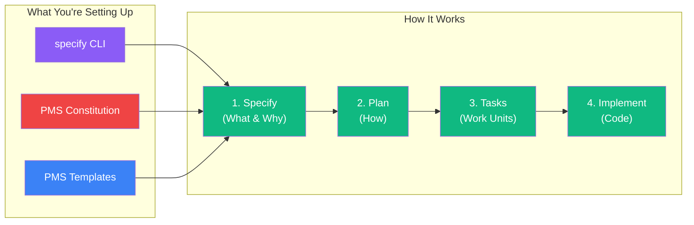

# GitHub Spec Kit Setup Guide for PMS Integration

**Document ID:** PMS-EXP-SPECKIT-001
**Version:** 1.0
**Date:** 2026-03-09
**Applies To:** PMS project (all platforms)
**Prerequisites Level:** Beginner

---

## Table of Contents

1. [Overview](#1-overview)
2. [Prerequisites](#2-prerequisites)
3. [Part A: Install and Configure Spec Kit](#3-part-a-install-and-configure-spec-kit)
4. [Part B: Create PMS Constitution](#4-part-b-create-pms-constitution)
5. [Part C: Integrate with PMS Development Workflow](#5-part-c-integrate-with-pms-development-workflow)
6. [Part D: Testing and Verification](#6-part-d-testing-and-verification)
7. [Troubleshooting](#7-troubleshooting)
8. [Reference Commands](#8-reference-commands)

---

## 1. Overview

This guide walks you through setting up GitHub Spec Kit for the PMS project. By the end, you will have:

- The `specify` CLI installed and working
- A PMS-specific `constitution.md` encoding HIPAA, ISO 13485, and architectural rules
- Spec Kit integrated with Claude Code (primary) and optionally other AI agents
- Custom PMS templates for `spec.md`, `plan.md`, and `tasks.md`
- A completed pilot specification for one PMS feature



## 2. Prerequisites

### 2.1 Required Software

| Software | Minimum Version | Check Command |
|----------|----------------|---------------|
| Python | 3.11+ | `python3 --version` |
| uv | 0.5+ | `uv --version` |
| Claude Code | latest | `claude --version` |
| Git | 2.40+ | `git --version` |
| Node.js | 18+ | `node --version` |

### 2.2 Installation of Prerequisites

**uv** (if not installed):

```bash
# macOS / Linux
curl -LsSf https://astral.sh/uv/install.sh | sh

# Or via Homebrew
brew install uv

# Verify
uv --version
```

**specify CLI**:

```bash
# Install via uv
uv tool install specify

# Or via pip
pip install specify

# Verify
specify --version
# Expected: specify 0.1.12 or higher
```

### 2.3 Verify PMS Services

Confirm the existing PMS stack is available (not required for Spec Kit setup, but needed for implementation phase):

```bash
# Backend (FastAPI)
curl -s http://localhost:8000/health | jq .
# Expected: {"status": "healthy"}

# Frontend (Next.js)
curl -s -o /dev/null -w "%{http_code}" http://localhost:3000
# Expected: 200

# Claude Code
claude --version
# Expected: version string
```

**Checkpoint**: Python 3.11+, uv, specify CLI, Claude Code, and Git are all installed and working.

---

## 3. Part A: Install and Configure Spec Kit

### Step 1: Initialize Spec Kit in PMS Backend

```bash
cd /path/to/pms-backend

# Initialize Spec Kit with Claude Code as the AI agent
specify init . --ai claude
```

This creates:

```
.specify/
├── memory/
│   └── constitution.md      # Project constitution (to be customized)
├── specs/                    # Feature specifications go here
├── templates/                # Spec, plan, and task templates
└── commands/                 # Agent command definitions
```

And installs `/speckit.*` commands into your Claude Code configuration.

### Step 2: Initialize Spec Kit in PMS Frontend

```bash
cd /path/to/pms-frontend

# Initialize with Claude Code
specify init . --ai claude
```

### Step 3: Verify Spec Kit Commands in Claude Code

```bash
claude

# Inside Claude Code, verify commands are available:
# /speckit specify — starts a new specification
# /speckit plan — generates a technical plan from a spec
# /speckit tasks — breaks a plan into atomic tasks
# /speckit implement — executes tasks
```

Expected: All four `/speckit` commands are recognized by Claude Code.

### Step 4: (Optional) Add Additional Agent Support

If team members use other AI agents:

```bash
# For GitHub Copilot
specify init . --ai copilot --ignore-agent-tools

# For Cursor
specify init . --ai cursor-agent --ignore-agent-tools

# For Gemini CLI
specify init . --ai gemini --ignore-agent-tools
```

**Checkpoint**: Spec Kit is initialized in both PMS repositories. Claude Code recognizes `/speckit` commands. The `.specify/` directory structure exists.

---

## 4. Part B: Create PMS Constitution

### Step 1: Edit the Constitution File

The constitution is the most important file in Spec Kit — it defines rules that every AI agent must follow. Open `.specify/memory/constitution.md` and replace its contents:

```markdown
# PMS Project Constitution

## Identity

This is the MPS Patient Management System (PMS), a healthcare application
serving clinicians, nurses, and administrative staff. The system consists of:

- **Backend**: FastAPI (Python) on port 8000
- **Frontend**: Next.js (TypeScript) on port 3000
- **Mobile**: Android (Kotlin/Jetpack Compose)
- **Database**: PostgreSQL on port 5432 (with pgvector, pg_audit)
- **Auth**: Supabase Auth (JWT-based)

## Non-Negotiable Rules

### HIPAA Compliance

1. **Never use real patient data** in specifications, examples, tests, or
   documentation. Always use synthetic/de-identified data (e.g., "Jane Doe",
   MRN "TEST-001").
2. **Every new database table** must have Row Level Security (RLS) policies
   defined in the specification before implementation.
3. **Every new API endpoint** must specify authentication requirements and
   include an audit logging section.
4. **PHI fields** must specify encryption-at-rest (AES-256) and
   encryption-in-transit (TLS 1.3) requirements.
5. **Minimum necessary principle**: specifications must justify which PHI
   fields are accessed and why.

### ISO 13485 Traceability

6. **Every spec.md** must include a `Requirement Traceability` section
   linking to parent SYS-REQ or SUB-REQ IDs from
   `docs/specs/requirements/`.
7. **Every tasks.md** must include verification method (unit test, integration
   test, manual test) for each task.
8. **Design changes** must be recorded as ADRs in `docs/architecture/`.

### Architecture

9. **FastAPI patterns**: Use async endpoints. Use Pydantic models for
   request/response schemas. Use dependency injection for auth and database.
10. **Next.js patterns**: Use App Router. Use Server Components by default.
    Client Components only when interactivity is required.
11. **Database patterns**: Use Alembic migrations (or Supabase migrations if
    Experiment 58 is active). All tables must have `created_at` and
    `updated_at` timestamps.
12. **Testing**: Every new endpoint requires at least one unit test and one
    integration test. Use pytest for Python, vitest for TypeScript.

### Code Quality

13. **No hardcoded secrets**: Use environment variables. Reference `.env`
    files but never commit them.
14. **Type safety**: Python code must use type hints. TypeScript must use
    strict mode.
15. **Error handling**: API endpoints must return structured error responses
    with appropriate HTTP status codes.

## Specification Standards

- Specifications should be concise — one feature per spec, max 2000 words.
- Plans should reference existing PMS patterns from `docs/architecture/`.
- Tasks should be atomic — completable in under 2 hours each.
- All specifications are peer-reviewed before implementation.
```

### Step 2: Create PMS-Specific Templates

Create a custom spec template that includes HIPAA and traceability sections:

```bash
mkdir -p .specify/templates/pms
```

Create `.specify/templates/pms/spec-template.md`:

```markdown
# Feature Specification: {Feature Name}

**Spec ID:** SPEC-{NNN}
**Date:** {date}
**Author:** {author}
**Status:** Draft

## Requirement Traceability

| Requirement ID | Description | Priority |
|---------------|-------------|----------|
| SYS-REQ-XXXX | {Parent requirement} | {P1/P2/P3} |

## Problem Statement

{What clinical/operational problem does this feature solve?}

## User Stories

### Story 1: {Role} — {Action}
As a {clinician/nurse/admin}, I want to {action} so that {benefit}.

**Acceptance Criteria:**
- [ ] {Criterion 1}
- [ ] {Criterion 2}

## HIPAA Security Review

| Concern | Assessment |
|---------|-----------|
| PHI accessed | {List specific PHI fields and justification} |
| Authentication | {Supabase JWT / API key / Service role} |
| Authorization | {RLS policy description} |
| Audit logging | {What events are logged} |
| Encryption | {At-rest and in-transit requirements} |

## Constraints

- {Technical constraints}
- {Regulatory constraints}
- {Performance requirements}

## Out of Scope

- {What this feature does NOT include}
```

### Step 3: Add Constitution to CLAUDE.md

Add a reference to the constitution in your project's `CLAUDE.md` so Claude Code always loads it:

```markdown
# Spec Kit Integration

When working on new features, follow the Spec-Driven Development workflow:
1. Read `.specify/memory/constitution.md` before any implementation
2. Use `/speckit specify` to create a specification first
3. Use `/speckit plan` to generate a technical plan
4. Use `/speckit tasks` to break into atomic work units
5. Use `/speckit implement` to execute tasks

Never skip the specification phase for non-trivial features.
```

**Checkpoint**: PMS constitution is defined with HIPAA, ISO 13485, architecture, and code quality rules. Custom templates include healthcare-specific sections. CLAUDE.md references the constitution.

---

## 5. Part C: Integrate with PMS Development Workflow

### Step 1: Create Your First Feature Specification

Let's specify a real PMS feature — a patient allergies endpoint:

```bash
claude

# Inside Claude Code:
# /speckit specify

# When prompted, describe the feature:
# "Add a patient allergies API endpoint that allows providers to record,
#  view, and update patient allergies. Each allergy has a name, severity
#  (mild/moderate/severe), reaction description, and onset date.
#  Only the patient's care team should access allergy records.
#  This traces to SYS-REQ-0003 (Patient Clinical Data Management)."
```

Claude Code will generate `.specify/specs/001-patient-allergies/spec.md` following the constitution rules.

### Step 2: Generate the Technical Plan

```bash
# Inside Claude Code:
# /speckit plan
```

Claude Code reads the spec.md and generates `plan.md` including:
- Database schema (allergies table with RLS)
- FastAPI endpoint definitions
- Authentication requirements (Supabase JWT)
- Frontend components (if applicable)

### Step 3: Generate Atomic Tasks

```bash
# Inside Claude Code:
# /speckit tasks
```

Claude Code breaks the plan into atomic tasks in `tasks.md`:

```markdown
## Tasks

- [ ] Task 1: Create allergies database migration
  - File: supabase/migrations/XXXXX_create_allergies.sql
  - Verify: migration applies successfully, RLS policies active
- [ ] Task 2: Create Pydantic models for allergy CRUD
  - File: app/schemas/allergies.py
  - Verify: unit test passes
- [ ] Task 3: Create FastAPI allergies router
  - File: app/api/allergies.py
  - Verify: integration test passes, audit logging confirmed
- [ ] Task 4: Add allergies to patient detail component
  - File: components/PatientAllergies.tsx
  - Verify: renders allergy list, create/edit forms work
```

### Step 4: Implement

```bash
# Inside Claude Code:
# /speckit implement
```

Claude Code executes each task, following the constitution and plan.

### Step 5: Review the Specification Artifacts

After implementation, verify the `.specify/` directory contains:

```
.specify/specs/001-patient-allergies/
├── spec.md          # What & why (with HIPAA review)
├── plan.md          # How (architecture, schema, endpoints)
├── tasks.md         # Atomic work units (with verification)
├── contracts/       # API contract definitions
│   └── allergies-api.md
└── data-model.md    # Database schema specification
```

**Checkpoint**: Full specification workflow completed for one PMS feature. All artifacts generated, reviewed, and committed to Git.

---

## 6. Part D: Testing and Verification

### Verify Spec Kit Installation

```bash
# Check specify CLI
specify --version
# Expected: 0.1.12+

# Check .specify directory exists
ls -la .specify/
# Expected: memory/, specs/, templates/, commands/

# Check constitution
cat .specify/memory/constitution.md | head -5
# Expected: "# PMS Project Constitution"
```

### Verify Claude Code Integration

```bash
claude

# Test each command:
# /speckit specify — should prompt for feature description
# /speckit plan — should prompt to select a spec
# /speckit tasks — should prompt to select a plan
# /speckit implement — should prompt to select tasks
```

### Verify Constitution Enforcement

Test that the constitution is enforced by intentionally violating a rule:

```bash
claude

# Prompt: "Add a new endpoint /api/test that returns all patient records
# without authentication"

# Expected: Claude Code should refuse or flag this as violating
# constitution rules #3 (authentication required) and #2 (RLS required)
```

### Verify Specification Artifacts

```bash
# Check that spec.md includes requirement traceability
grep -l "Requirement Traceability" .specify/specs/*/spec.md

# Check that spec.md includes HIPAA review
grep -l "HIPAA Security Review" .specify/specs/*/spec.md

# Check that tasks.md includes verification methods
grep -l "Verify:" .specify/specs/*/tasks.md
```

**Checkpoint**: Spec Kit CLI works, Claude Code integration active, constitution is enforced, and specification artifacts include HIPAA and traceability sections.

---

## 7. Troubleshooting

### specify CLI Not Found

**Symptom**: `specify: command not found`

**Solution**:
1. Verify installation: `uv tool list | grep specify`
2. Check PATH: `echo $PATH` — ensure uv tool bin directory is included
3. Reinstall: `uv tool install specify --force`
4. Alternative: `python -m specify --version`

### /speckit Commands Not Recognized in Claude Code

**Symptom**: Claude Code says "unknown command /speckit"

**Solution**:
1. Verify initialization: `ls .specify/commands/`
2. Re-initialize: `specify init . --ai claude`
3. Restart Claude Code session
4. Check that `.specify/` is in the project root (same directory as CLAUDE.md)

### Constitution Not Being Followed

**Symptom**: AI agent generates code that violates constitution rules

**Solution**:
1. Verify constitution location: `.specify/memory/constitution.md`
2. Add explicit constitution reference to CLAUDE.md
3. Use `/speckit specify` instead of free-form prompting — the command forces constitution loading
4. Report persistent violations as feedback to improve prompting

### Spec Kit Conflicts with GSD

**Symptom**: Both `.specify/` and `.planning/` directories create confusion

**Solution**:
- Use Spec Kit for the **specification phase** (what to build)
- Use GSD for the **execution phase** (how to build it)
- Add to CLAUDE.md: "Use /speckit for specification. Use /gsd for execution."
- In Phase 3 integration, GSD reads tasks.md from .specify/ directly

### Templates Not Loading

**Symptom**: Generated specs don't include PMS-specific sections

**Solution**:
1. Verify template location: `.specify/templates/pms/`
2. Reference templates in the specify command: mention "use PMS template" when starting
3. Add template reference to constitution.md under "Specification Standards"

### Large Specification Files

**Symptom**: spec.md or plan.md exceeds 5000 words, overwhelming the AI agent

**Solution**:
- Constitution rule: "Specifications should be concise — max 2000 words"
- Split large features into multiple smaller specifications
- Move detailed data models to `data-model.md` instead of inlining in spec.md

---

## 8. Reference Commands

### Daily Development Workflow

```bash
# Start a new feature specification
claude
# /speckit specify

# Generate technical plan from spec
# /speckit plan

# Break plan into tasks
# /speckit tasks

# Implement tasks
# /speckit implement

# List all specifications
ls .specify/specs/

# View a specific spec
cat .specify/specs/001-feature-name/spec.md
```

### Spec Kit Management Commands

| Command | Purpose |
|---------|---------|
| `specify init . --ai claude` | Initialize Spec Kit in current directory |
| `specify --version` | Check CLI version |
| `/speckit specify` | Start specification phase (in Claude Code) |
| `/speckit plan` | Generate technical plan |
| `/speckit tasks` | Break plan into atomic tasks |
| `/speckit implement` | Execute tasks |

### Useful File Paths

| File | Purpose |
|------|---------|
| `.specify/memory/constitution.md` | PMS non-negotiable rules |
| `.specify/specs/` | All feature specifications |
| `.specify/templates/pms/` | PMS-specific templates |
| `.specify/commands/` | Agent command definitions |
| `docs/specs/requirements/SYS-REQ.md` | System requirements (for traceability) |
| `docs/testing/traceability-matrix.md` | Requirement-to-test mapping |

### Useful URLs

| Resource | URL |
|----------|-----|
| Spec Kit Repository | https://github.com/github/spec-kit |
| Spec Kit Documentation | https://github.github.com/spec-kit/ |
| SDD Methodology | https://github.com/github/spec-kit/blob/main/spec-driven.md |
| Agent Support | https://github.com/github/spec-kit/blob/main/AGENTS.md |
| Microsoft SDD Training | https://learn.microsoft.com/en-us/training/modules/spec-driven-development-github-spec-kit-enterprise-developers/ |

---

## Next Steps

After completing this setup guide:

1. Follow the [Spec Kit Developer Tutorial](62-SpecKit-Developer-Tutorial.md) to build a complete feature using the full SDD workflow
2. Review the [GSD vs Spec Kit Comparative Tutorial](61-GSD-vs-SpecKit-Comparative-Tutorial.md) to understand how these tools complement each other
3. Customize the PMS constitution based on team feedback after the first sprint
4. Explore the [Microsoft SDD Training](https://learn.microsoft.com/en-us/training/modules/spec-driven-development-github-spec-kit-enterprise-developers/) for enterprise adoption patterns

## Resources

- [GitHub Spec Kit Repository](https://github.com/github/spec-kit)
- [Spec Kit Official Documentation](https://github.github.com/spec-kit/)
- [Spec-Driven Development Methodology](https://github.com/github/spec-kit/blob/main/spec-driven.md)
- [Agent Integration Guide](https://github.com/github/spec-kit/blob/main/AGENTS.md)
- [GitHub Blog — SDD with AI](https://github.blog/ai-and-ml/generative-ai/spec-driven-development-with-ai-get-started-with-a-new-open-source-toolkit/)
- [PRD: Spec Kit PMS Integration](62-PRD-SpecKit-PMS-Integration.md)
- [Exp 61: GSD PMS Integration](61-PRD-GSD-PMS-Integration.md) — Complementary execution framework
