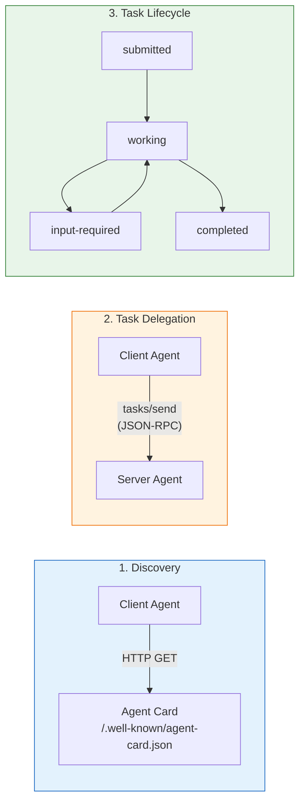
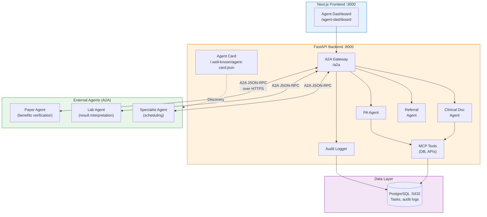

# A2A Protocol Developer Onboarding Tutorial

**Welcome to the MPS PMS A2A Integration Team**

This tutorial will take you from zero to building your first multi-agent clinical workflow using the A2A protocol. By the end, you will understand how A2A works, how it complements MCP, and have built a working agent-to-agent referral coordination system end-to-end.

**Document ID:** PMS-EXP-A2A-002
**Version:** 1.0
**Date:** 2026-03-09
**Applies To:** PMS project (all platforms)
**Prerequisite:** [A2A Setup Guide](63-A2A-PMS-Developer-Setup-Guide.md)
**Estimated time:** 2–3 hours
**Difficulty:** Beginner-friendly

---

## What You Will Learn

1. The difference between A2A and MCP — and why PMS needs both
2. How Agent Cards enable agent discovery without a central registry
3. The A2A task lifecycle (submitted → working → input-required → completed)
4. How to build an A2A server that exposes PMS clinical skills
5. How to build an A2A client that discovers and delegates tasks to external agents
6. How to implement multi-turn agent conversations (input-required pattern)
7. How to use SSE streaming for real-time task progress
8. How to design agent-to-agent workflows for healthcare (referrals, PA, lab routing)
9. HIPAA compliance considerations for inter-agent PHI exchange
10. Development workflow conventions for A2A integrations

---

## Part 1: Understanding A2A (15 min read)

### 1.1 What Problem Does A2A Solve?

PMS has built powerful AI agents — CrewAI crews for documentation (Exp 55), LangGraph graphs for PA workflows (Exp 26), MCP servers for tool access (Exp 09). But these agents are **isolated within PMS**. They cannot natively communicate with:

- A payer's AI agent that handles benefits verification
- A specialist practice's scheduling agent
- A lab system's result interpretation agent
- A pharmacy's drug interaction checking agent

Today, these interactions happen via REST APIs, fax machines, phone calls, or portal logins. A2A provides a **standard protocol** so AI agents across organizations can discover each other, negotiate capabilities, delegate tasks, and exchange results — just like two humans collaborating, but at machine speed.

**The key insight:** A2A treats agents as opaque services with published capabilities (Agent Cards), not as transparent systems that share internal state. This maps perfectly to healthcare, where different organizations have different systems, different AI frameworks, and strict data boundaries.

### 1.2 How A2A Works — The Key Pieces



**Three key concepts:**

1. **Agent Cards (Discovery):** Every A2A agent publishes a JSON document at `/.well-known/agent-card.json` describing its name, capabilities, skills, and authentication requirements. This is the agent's "business card" — clients fetch it to learn what the agent can do before sending any tasks.

2. **Tasks (Delegation):** The fundamental unit of work. A client agent creates a task by sending a `tasks/send` JSON-RPC request with a message. The server agent processes it and returns results as artifacts. Tasks have unique IDs and persist across interactions.

3. **Task Lifecycle (Stateful):** Tasks progress through states — `submitted` → `working` → `completed` (or `failed`/`canceled`). The `input-required` state enables multi-turn conversations where the server agent asks the client for more information.

### 1.3 How A2A Fits with Other PMS Technologies

| Technology | Experiment | Role | Relationship to A2A |
|------------|-----------|------|---------------------|
| **MCP** | Exp 09 | Agent-to-tool connectivity | Complementary — MCP connects agents to tools internally; A2A connects agents to agents externally |
| **CrewAI** | Exp 55 | Intra-app agent orchestration | A2A wraps CrewAI crews as externally accessible agents |
| **LangGraph** | Exp 26 | Stateful agent graphs | A2A wraps LangGraph agents; A2A tasks can be nodes in LangGraph graphs |
| **OpenClaw** | Exp 05 | AI agent framework | Can be exposed as A2A agents |
| **FHIR** | Exp 16 | Data interoperability standard | FHIR defines the data format; A2A defines the agent communication protocol |
| **FHIR DA Vinci PA** | Exp 48 | Prior auth data exchange | DA Vinci defines PA data models; A2A enables PA agents to collaborate |
| **n8n** | Exp 34 | Workflow automation | n8n can orchestrate A2A agent calls as workflow steps |

**Key distinction:** FHIR standardizes **data exchange** between systems. A2A standardizes **task delegation** between agents. A PMS referral agent might use A2A to delegate a task to a specialist scheduling agent, and the data exchanged within that task might be FHIR-formatted.

### 1.4 Key Vocabulary

| Term | Meaning |
|------|---------|
| **Agent Card** | JSON metadata document describing an agent's identity, capabilities, skills, and auth requirements |
| **Task** | Stateful unit of work between a client and server agent, identified by a unique ID |
| **Message** | One unit of communication within a task — has a role (user/agent) and contains Parts |
| **Part** | The smallest content unit — can be text, file, or structured data (JSON) |
| **Artifact** | A deliverable output from a completed task — the actual result |
| **AgentSkill** | A specific capability listed in an Agent Card (e.g., "benefits-check") |
| **JSON-RPC 2.0** | The wire protocol format — all A2A messages are JSON-RPC requests/responses |
| **SSE (Server-Sent Events)** | Streaming transport for real-time task updates |
| **input-required** | Task state where the server agent needs more information from the client |
| **Agent Card Signing** | Cryptographic verification that an Agent Card is authentic (v0.3.0) |
| **batchexecute** | (Not A2A) — Google's internal protocol used by notebooklm-py; don't confuse with A2A |

### 1.5 Our Architecture



---

## Part 2: Environment Verification (15 min)

### 2.1 Checklist

1. **Python + A2A SDK:**
   ```bash
   python3 -c "import a2a; print(a2a.__version__)"
   # Expected: 0.3.24 or higher
   ```

2. **PMS backend running:**
   ```bash
   curl -s http://localhost:8000/health
   ```

3. **Agent Card accessible:**
   ```bash
   curl -s http://localhost:8000/.well-known/agent-card.json | python3 -m json.tool
   # Should return JSON with name, url, skills
   ```

4. **A2A endpoint responding:**
   ```bash
   curl -s -X POST http://localhost:8000/a2a \
     -H "Content-Type: application/json" \
     -d '{"jsonrpc":"2.0","method":"tasks/send","id":"test","params":{"id":"t1","message":{"role":"user","parts":[{"type":"text","text":"hello"}]}}}' \
     | python3 -m json.tool
   ```

### 2.2 Quick Test

```bash
# Send a clinical summary request and verify the full roundtrip
curl -s -X POST http://localhost:8000/a2a \
  -H "Content-Type: application/json" \
  -d '{
    "jsonrpc": "2.0",
    "method": "tasks/send",
    "id": "quick-test",
    "params": {
      "id": "quick-task-001",
      "message": {
        "role": "user",
        "parts": [{"type": "text", "text": "Generate a SOAP note for encounter E-100"}]
      }
    }
  }' | python3 -c "import sys,json; r=json.load(sys.stdin); print(r['result']['artifacts'][0]['parts'][0]['text'])"
```

If you see a SOAP note, you're ready for Part 3.

---

## Part 3: Build Your First Integration (45 min)

### 3.1 What We Are Building

A **Referral Coordination Workflow** with two agents:

1. **PMS Referral Agent** (A2A client + server) — receives referral requests from clinicians, discovers specialist agents, and coordinates the referral
2. **Mock Specialist Scheduling Agent** (A2A server) — represents an external dermatology practice that accepts referrals via A2A

The flow: Clinician requests referral → PMS agent discovers specialist → PMS agent sends task → specialist agent returns available slots → PMS agent presents options.

### 3.2 Create the Mock Specialist Agent

Create `pms-backend/scripts/a2a/specialist_agent.py`:

```python
#!/usr/bin/env python3
"""Mock Specialist Scheduling Agent — A2A server on port 8001."""

import uuid
import uvicorn
from fastapi import FastAPI, Request, Response

app = FastAPI(title="City Dermatology A2A Agent")


@app.get("/.well-known/agent-card.json")
async def agent_card():
    """Publish the specialist agent's Agent Card."""
    return {
        "name": "City Dermatology Scheduling Agent",
        "description": "Handles appointment scheduling and referral acceptance for City Dermatology Associates",
        "url": "http://localhost:8001/a2a",
        "version": "0.3.0",
        "capabilities": {
            "streaming": False,
            "pushNotifications": False,
            "stateTransitionHistory": False,
        },
        "skills": [
            {
                "id": "check-availability",
                "name": "Check Appointment Availability",
                "description": "Returns available appointment slots for a given specialty and insurance",
                "tags": ["scheduling", "dermatology", "availability"],
                "examples": ["Check availability for new patient dermatology consult"],
            },
            {
                "id": "book-appointment",
                "name": "Book Appointment",
                "description": "Books an appointment slot for a referred patient",
                "tags": ["scheduling", "booking", "referral"],
                "examples": ["Book slot 2026-03-17T10:00 for patient referral"],
            },
        ],
        "defaultInputModes": ["text", "data"],
        "defaultOutputModes": ["text", "data"],
    }


@app.post("/a2a")
async def handle_task(request: Request):
    """Handle A2A task requests."""
    body = await request.json()
    params = body.get("params", {})
    task_id = params.get("id", str(uuid.uuid4()))
    message = params.get("message", {})
    parts = message.get("parts", [])
    text = " ".join(p.get("text", "") for p in parts if p.get("type") == "text")

    if "book" in text.lower():
        response_text = (
            "Appointment Confirmed:\n\n"
            "Provider: Dr. Sarah Chen, MD (Dermatology)\n"
            "Location: City Dermatology Associates\n"
            "Date: Monday, March 17, 2026 at 10:00 AM\n"
            "Type: New Patient Consultation (60 min)\n"
            "Referral #: REF-2026-4521\n"
            "Insurance: Verified — BCBS PPO accepted\n\n"
            "Patient should bring: Photo ID, insurance card, referral letter.\n\n"
            "[Booked by City Dermatology A2A Agent]"
        )
    else:
        response_text = (
            "Available Appointments — City Dermatology Associates:\n\n"
            "Dr. Sarah Chen, MD (Board Certified Dermatologist)\n"
            "Insurance Accepted: BCBS, Aetna, UHC, Cigna, Medicare\n\n"
            "Available Slots (next 2 weeks):\n"
            "  1. Mon 3/17 at 10:00 AM — New Patient Consult (60 min)\n"
            "  2. Wed 3/19 at 2:30 PM — New Patient Consult (60 min)\n"
            "  3. Fri 3/21 at 9:00 AM — New Patient Consult (60 min)\n"
            "  4. Tue 3/25 at 11:00 AM — New Patient Consult (60 min)\n\n"
            "To book, send: 'Book slot [date/time] for patient referral'\n\n"
            "[City Dermatology A2A Agent]"
        )

    return {
        "jsonrpc": "2.0",
        "id": body.get("id"),
        "result": {
            "id": task_id,
            "status": {"state": "completed"},
            "artifacts": [
                {
                    "artifactId": str(uuid.uuid4()),
                    "name": "Scheduling Response",
                    "parts": [{"type": "text", "text": response_text}],
                }
            ],
        },
    }


if __name__ == "__main__":
    print("Starting City Dermatology A2A Agent on :8001...")
    uvicorn.run(app, host="0.0.0.0", port=8001)
```

### 3.3 Create the A2A Client Service

Create `pms-backend/app/a2a/client.py`:

```python
"""A2A client for discovering and calling external agents."""

import httpx
import logging
from typing import Optional

logger = logging.getLogger(__name__)


class A2AClient:
    """Discovers external agents and sends tasks."""

    def __init__(self):
        self._card_cache: dict[str, dict] = {}
        self._http = httpx.AsyncClient(timeout=30)

    async def discover(self, base_url: str) -> dict:
        """Fetch an agent's Agent Card."""
        if base_url in self._card_cache:
            return self._card_cache[base_url]

        card_url = f"{base_url.rstrip('/')}/.well-known/agent-card.json"
        logger.info(f"Discovering agent at {card_url}")

        resp = await self._http.get(card_url)
        resp.raise_for_status()
        card = resp.json()

        self._card_cache[base_url] = card
        logger.info(f"Discovered agent: {card['name']} with {len(card['skills'])} skills")
        return card

    async def send_task(
        self,
        agent_url: str,
        task_id: str,
        message_text: str,
        structured_data: Optional[dict] = None,
    ) -> dict:
        """Send a task to an external A2A agent."""
        parts = [{"type": "text", "text": message_text}]
        if structured_data:
            parts.append({"type": "data", "data": structured_data})

        payload = {
            "jsonrpc": "2.0",
            "method": "tasks/send",
            "id": f"req-{task_id}",
            "params": {
                "id": task_id,
                "message": {
                    "role": "user",
                    "parts": parts,
                },
            },
        }

        logger.info(f"Sending task {task_id} to {agent_url}")
        resp = await self._http.post(agent_url, json=payload)
        resp.raise_for_status()
        result = resp.json()

        if "error" in result:
            raise Exception(f"A2A error: {result['error']}")

        return result["result"]

    async def close(self):
        await self._http.aclose()
```

### 3.4 Test the Full Referral Workflow

Start both agents:

```bash
# Terminal 1: PMS backend (already running)
uvicorn app.main:app --reload

# Terminal 2: Mock specialist agent
python scripts/a2a/specialist_agent.py
```

Run the referral workflow:

```bash
# Step 1: Discover the specialist agent
curl -s http://localhost:8001/.well-known/agent-card.json | python3 -m json.tool

# Step 2: Check availability
curl -s -X POST http://localhost:8001/a2a \
  -H "Content-Type: application/json" \
  -d '{
    "jsonrpc": "2.0",
    "method": "tasks/send",
    "id": "ref-1",
    "params": {
      "id": "referral-001",
      "message": {
        "role": "user",
        "parts": [{"type": "text", "text": "Check availability for new patient dermatology consult, BCBS PPO insurance"}]
      }
    }
  }' | python3 -m json.tool

# Step 3: Book an appointment
curl -s -X POST http://localhost:8001/a2a \
  -H "Content-Type: application/json" \
  -d '{
    "jsonrpc": "2.0",
    "method": "tasks/send",
    "id": "ref-2",
    "params": {
      "id": "referral-002",
      "message": {
        "role": "user",
        "parts": [{"type": "text", "text": "Book slot Mon 3/17 at 10:00 AM for patient referral REF-2026-4521"}]
      }
    }
  }' | python3 -m json.tool
```

### 3.5 Verify in the Frontend

1. Navigate to `http://localhost:3000/agent-dashboard`
2. Send: "Refer patient to dermatology for suspicious lesion evaluation"
3. Verify the PMS agent responds with referral coordination output

### 3.6 Checkpoint

You've built a complete agent-to-agent referral workflow:
- PMS agent (port 8000) serves an Agent Card and processes clinical tasks
- Specialist agent (port 8001) serves its own Agent Card and handles scheduling
- Both agents communicate over A2A JSON-RPC
- The frontend Agent Dashboard enables human-in-the-loop oversight

---

## Part 4: Evaluating Strengths and Weaknesses (15 min)

### 4.1 Strengths

- **Open standard**: Apache 2.0, Linux Foundation-governed, 150+ organizations supporting
- **Framework-agnostic**: Works with CrewAI, LangGraph, Google ADK, AutoGen, custom agents
- **Stateful tasks**: Unlike MCP's stateless tool calls, A2A tracks task lifecycle — essential for long-running clinical workflows (PA takes hours, not milliseconds)
- **Discovery without registry**: Agent Cards at well-known URLs enable decentralized discovery
- **Multi-turn conversations**: `input-required` state supports complex clinical negotiations (agent asks for additional patient info)
- **Streaming support**: SSE for real-time progress updates during long tasks
- **Complementary to MCP**: Not competing — they solve different layers of the interoperability stack

### 4.2 Weaknesses

- **Pre-1.0 maturity**: Spec may change. Pin to v0.3.0 and abstract behind interfaces.
- **Limited healthcare adoption today**: Few payers/labs have A2A agents. PMS would be an early mover.
- **Security surface**: Agent Card impersonation, prompt injection through A2A messages, authorization creep in multi-agent chains.
- **Complexity overhead**: For simple tool calls, MCP is simpler and faster. A2A adds overhead (discovery, task lifecycle, state management) that's only justified for cross-organizational collaboration.
- **RPC limitations**: Responses tied to original request path. If the connection drops during a long task, recovery requires polling or webhooks.
- **OpenAI/Microsoft gap**: Their non-endorsement creates ecosystem uncertainty, though IBM's ACP merger strengthened A2A's position.

### 4.3 When to Use A2A vs Alternatives

| Scenario | Best Choice | Why |
|----------|-------------|-----|
| Agent needs to call a database or API | **MCP (Exp 09)** | Tool access, not agent collaboration |
| Multiple agents in the same codebase | **CrewAI (Exp 55)** | Shared memory, same process |
| Agent delegates task to external org's agent | **A2A** | Cross-boundary, opaque agents |
| Visual workflow automation | **n8n (Exp 34)** | Low-code, human-in-the-loop |
| Data exchange between EHR systems | **FHIR (Exp 16)** | Data format standard, not agent protocol |
| PA submission to payer | **A2A + FHIR DA Vinci** | A2A for agent comms, FHIR for data format |
| Real-time event streaming | **Kafka (Exp 38)** | Event backbone, not task delegation |

### 4.4 HIPAA / Healthcare Considerations

| Consideration | Assessment | Action Required |
|---------------|------------|-----------------|
| **PHI in A2A messages** | High risk — tasks may contain patient data | Mandatory TLS 1.3, BAA verification before PHI exchange, de-identification fallback |
| **Agent authentication** | Critical — must verify agent identity | OAuth 2.0 with scoped tokens, Agent Card signing verification |
| **Audit trail** | Required — all inter-agent exchanges must be logged | Log task ID, agent IDs, timestamps, content hashes (not content) |
| **Agent Card trust** | Risk of impersonation | Allowlist trusted agent URLs, certificate pinning, cryptographic signing |
| **Multi-agent data cascading** | PHI may flow through chains of agents | Track data lineage, enforce BAA at every hop, de-identify at boundaries |
| **Consent** | Patients may not know AI agents are coordinating their care | Transparent disclosure in consent forms, audit trail for patient access |

---

## Part 5: Debugging Common Issues (15 min read)

### Issue 1: Agent Card Returns Empty Skills

**Symptoms:** Agent Card JSON has `"skills": []`.
**Cause:** Skills not defined in `get_pms_agent_card()`.
**Fix:** Ensure `AgentSkill` objects are in the `skills` array in `agent_card.py`.

### Issue 2: "Method not found" JSON-RPC Error

**Symptoms:** `{"error": {"code": -32601, "message": "Method not found"}}`.
**Cause:** Invalid JSON-RPC method name.
**Fix:** Use `tasks/send`, `tasks/get`, or `tasks/cancel` — not custom method names.

### Issue 3: Task Returns No Artifacts

**Symptoms:** Task completes but `artifacts` is empty.
**Cause:** `AgentExecutor.execute()` didn't enqueue an artifact.
**Fix:** Ensure `await event_queue.enqueue_event(artifact)` is called with a valid `Artifact` object.

### Issue 4: Connection Refused to External Agent

**Symptoms:** `httpx.ConnectError: Connection refused` when calling external agent.
**Cause:** External agent not running or wrong port.
**Fix:** Verify the agent is running: `curl http://localhost:8001/.well-known/agent-card.json`

### Issue 5: Task Stuck in "submitted"

**Symptoms:** Task never progresses past `submitted` state.
**Cause:** `AgentExecutor.execute()` threw an unhandled exception.
**Fix:** Check backend logs for exceptions. Wrap executor logic in try/except and transition to `failed` state on error.

### Reading Logs

```python
import logging
logging.basicConfig(level=logging.DEBUG)
logging.getLogger("a2a").setLevel(logging.DEBUG)
logging.getLogger("a2a.audit").setLevel(logging.INFO)
```

---

## Part 6: Practice Exercise (45 min)

### Option A: Multi-Agent Benefits Verification

Build a flow where the PMS PA agent delegates benefits verification to a mock payer agent:
1. Create a mock payer agent (port 8002) with skills: `eligibility-check`, `benefits-summary`
2. PMS PA agent discovers the payer agent via Agent Card
3. Send a benefits verification task with CPT code and insurance plan
4. Payer agent returns eligibility status and copay amount

**Hints:** Use the `A2AClient` class from Part 3. Add a new route in the PMS backend that orchestrates the delegation.

### Option B: Lab Result Routing Chain

Build a three-agent chain: PMS → Lab Interpreter → Pharmacy Checker:
1. PMS agent sends lab results to a Lab Interpreter agent (port 8002)
2. Lab Interpreter flags abnormal results and forwards to a Pharmacy agent (port 8003)
3. Pharmacy agent checks drug interactions based on lab findings and current medications
4. Results cascade back to PMS

**Hints:** This tests multi-hop agent chains. Each agent must be both a client and server. Watch for PHI cascading — implement de-identification at each hop.

### Option C: Streaming Task Progress

Implement SSE streaming for a long-running task:
1. Add `streaming: true` to the PMS Agent Card capabilities
2. Modify the executor to send incremental status updates via SSE
3. Build a frontend component that consumes the SSE stream and shows real-time progress

**Hints:** Use FastAPI's `StreamingResponse` with `EventSourceResponse`. The A2A spec uses `tasks/sendSubscribe` for streaming.

---

## Part 7: Development Workflow and Conventions

### 7.1 File Organization

```
pms-backend/
├── app/
│   ├── a2a/
│   │   ├── __init__.py
│   │   ├── agent_card.py          # PMS Agent Card definition
│   │   ├── router.py              # A2A Gateway (FastAPI router)
│   │   ├── executor.py            # PMSAgentExecutor
│   │   ├── client.py              # A2A client for external agents
│   │   └── audit.py               # HIPAA audit logging
│   └── ...
├── scripts/
│   └── a2a/
│       └── specialist_agent.py    # Mock external agent
└── tests/
    └── test_a2a/
        ├── test_agent_card.py
        ├── test_executor.py
        ├── test_client.py
        └── mock_a2a_agent.py

pms-frontend/
├── src/
│   ├── lib/
│   │   └── a2a-api.ts             # A2A API client
│   └── app/
│       └── agent-dashboard/
│           └── page.tsx            # Agent Dashboard page
```

### 7.2 Naming Conventions

| Item | Convention | Example |
|------|-----------|---------|
| Agent Card URL | `/.well-known/agent-card.json` | Standard A2A discovery path |
| A2A endpoint | `/a2a` | All JSON-RPC goes here |
| Task IDs | `{context}-{uuid}` | `referral-a1b2c3d4` |
| Skill IDs | `kebab-case` | `clinical-summary`, `benefits-check` |
| Agent names | Human-readable | "PMS Clinical Agent" |
| Executor class | `{Domain}AgentExecutor` | `PMSAgentExecutor` |

### 7.3 PR Checklist

- [ ] Agent Card skills accurately describe new capabilities
- [ ] All A2A task exchanges have audit logging
- [ ] No PHI in task messages to unverified agents
- [ ] OAuth/auth requirements set in Agent Card for production
- [ ] Unit tests with mock A2A agents (no live external calls in CI)
- [ ] Integration tests tagged with `@pytest.mark.a2a`
- [ ] Error handling for all task states (failed, canceled)
- [ ] Content validation on inbound A2A messages (prompt injection defense)
- [ ] Documentation updated in `docs/experiments/`

### 7.4 Security Reminders

1. **Verify Agent Cards** — never trust an unverified Agent Card. Check signing, URL allowlist.
2. **Scope OAuth tokens** — per-task, time-limited, minimum-privilege.
3. **Validate all inbound messages** — A2A messages are external input. Treat them like user input.
4. **Log tasks, not content** — audit logs record task IDs and hashes, not PHI.
5. **De-identify at boundaries** — strip PHI before delegating to agents without BAA.
6. **Monitor for authorization creep** — agents should not accumulate permissions over time.

---

## Part 8: Quick Reference Card

### Core A2A Operations

| Operation | JSON-RPC Method | Description |
|-----------|----------------|-------------|
| Send task | `tasks/send` | Create or continue a task |
| Get task | `tasks/get` | Poll task status |
| Cancel task | `tasks/cancel` | Cancel a running task |
| Stream task | `tasks/sendSubscribe` | SSE streaming |

### Task States

```
submitted → working → completed
                   → input-required → working
                   → failed
                   → canceled
```

### Key Files

| File | Purpose |
|------|---------|
| `app/a2a/agent_card.py` | PMS Agent Card definition |
| `app/a2a/router.py` | A2A Gateway router |
| `app/a2a/executor.py` | Task execution logic |
| `app/a2a/client.py` | External agent discovery + task delegation |
| `app/a2a/audit.py` | HIPAA audit logging |
| `src/lib/a2a-api.ts` | Frontend API client |

### Key URLs

| Resource | URL |
|----------|-----|
| PMS Agent Card | http://localhost:8000/.well-known/agent-card.json |
| PMS A2A Endpoint | http://localhost:8000/a2a |
| Agent Dashboard | http://localhost:3000/agent-dashboard |
| A2A Specification | https://a2a-protocol.org/latest/specification/ |
| Python SDK | https://github.com/a2aproject/a2a-python |
| A2A Samples | https://github.com/a2aproject/a2a-samples |

### Starter Template

```python
"""Quick-start: Create an A2A agent with one skill."""

from a2a.server.agent_execution import AgentExecutor, RequestContext
from a2a.server.events import EventQueue
from a2a.types import Artifact, Part, TextPart

class MyAgentExecutor(AgentExecutor):
    async def execute(self, context: RequestContext, event_queue: EventQueue):
        # Get user message
        text = " ".join(
            p.text for p in context.message.parts if hasattr(p, "text")
        )
        # Process and respond
        artifact = Artifact(
            artifactId="result-1",
            name="Response",
            parts=[Part(root=TextPart(text=f"Processed: {text}"))],
        )
        await event_queue.enqueue_event(artifact)

    async def cancel(self, context: RequestContext, event_queue: EventQueue):
        pass
```

---

## Next Steps

1. **Read the full A2A spec** — [a2a-protocol.org/latest/specification/](https://a2a-protocol.org/latest/specification/)
2. **Take the DeepLearning.AI course** — [A2A: The Agent2Agent Protocol](https://www.deeplearning.ai/short-courses/a2a-the-agent2agent-protocol/)
3. **Integrate with CrewAI** — Wrap Exp 55 documentation crew as an A2A server
4. **Build the PA agent** — Wrap Exp 43–49 PA pipeline as an A2A client+server
5. **Review MCP (Exp 09)** — Understand the complementary agent-to-tool layer
