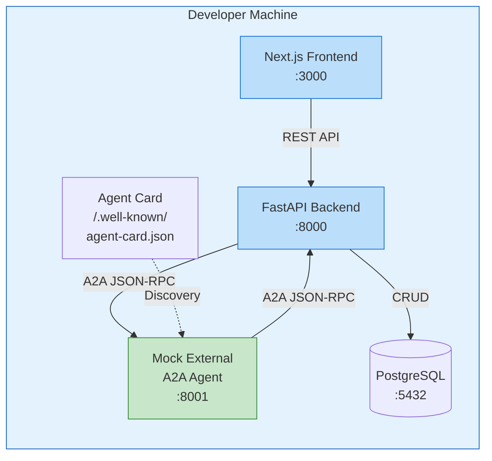

# A2A Protocol Setup Guide for PMS Integration

**Document ID:** PMS-EXP-A2A-001
**Version:** 1.0
**Date:** 2026-03-09
**Applies To:** PMS project (all platforms)
**Prerequisites Level:** Intermediate

---

## Table of Contents

1. [Overview](#1-overview)
2. [Prerequisites](#2-prerequisites)
3. [Part A: Install and Configure A2A SDK](#3-part-a-install-and-configure-a2a-sdk)
4. [Part B: Integrate with PMS Backend](#4-part-b-integrate-with-pms-backend)
5. [Part C: Integrate with PMS Frontend](#5-part-c-integrate-with-pms-frontend)
6. [Part D: Testing and Verification](#6-part-d-testing-and-verification)
7. [Troubleshooting](#7-troubleshooting)
8. [Reference Commands](#8-reference-commands)

---

## 1. Overview

This guide walks you through installing the **A2A Python SDK** (v0.3.24+), building an A2A Gateway in the PMS FastAPI backend, creating your first Agent Card, and verifying agent-to-agent communication end-to-end. By the end, you will have:

- A working A2A SDK installation
- A PMS Agent Card served at `/.well-known/agent-card.json`
- An A2A Gateway router handling task lifecycle
- A sample A2A agent wrapping a PMS clinical skill
- A Next.js Agent Dashboard for monitoring inter-agent tasks
- Verified A2A communication between two local agents



## 2. Prerequisites

### 2.1 Required Software

| Software | Minimum Version | Check Command |
|----------|----------------|---------------|
| Python | 3.10 | `python3 --version` |
| pip | 21.0 | `pip --version` |
| Node.js | 18.0 | `node --version` |
| PostgreSQL | 14.0 | `psql --version` |
| Git | 2.30 | `git --version` |

### 2.2 Installation of Prerequisites

No special prerequisites beyond the standard PMS stack. The A2A SDK is a pure Python package.

### 2.3 Verify PMS Services

```bash
# Check FastAPI backend
curl -s http://localhost:8000/health | python3 -m json.tool

# Check Next.js frontend
curl -s -o /dev/null -w "%{http_code}" http://localhost:3000

# Check PostgreSQL
psql -h localhost -p 5432 -U pms -c "SELECT 1;"
```

**Checkpoint:** All three PMS services are running and accessible.

---

## 3. Part A: Install and Configure A2A SDK

### Step 1: Install the SDK

```bash
cd pms-backend
pip install "a2a-sdk>=0.3.24"
```

### Step 2: Verify Installation

```bash
python3 -c "import a2a; print(f'A2A SDK version: {a2a.__version__}')"
# Expected: A2A SDK version: 0.3.24 (or higher)
```

### Step 3: Understand the Core Types

```python
# Quick exploration of A2A types
from a2a.types import (
    AgentCard,
    AgentSkill,
    AgentCapabilities,
    Task,
    TaskState,
    Message,
    TextPart,
    Artifact,
)

# Create a minimal Agent Card
card = AgentCard(
    name="PMS Clinical Agent",
    description="Patient Management System clinical documentation agent",
    url="http://localhost:8000/a2a",
    version="0.3.0",
    capabilities=AgentCapabilities(
        streaming=True,
        pushNotifications=False,
        stateTransitionHistory=True,
    ),
    skills=[
        AgentSkill(
            id="clinical-summary",
            name="Clinical Summary Generator",
            description="Generates SOAP notes and discharge summaries from encounter data",
            tags=["clinical", "documentation", "SOAP"],
            examples=["Generate a SOAP note for encounter E-12345"],
        )
    ],
    defaultInputModes=["text"],
    defaultOutputModes=["text"],
)

print(card.model_dump_json(indent=2))
```

### Step 4: Create the Agent Card File

Create `pms-backend/app/a2a/agent_card.py`:

```python
"""PMS Agent Card definition."""

from a2a.types import AgentCard, AgentSkill, AgentCapabilities, AgentAuthentication


def get_pms_agent_card(base_url: str = "http://localhost:8000") -> AgentCard:
    """Build the PMS Agent Card."""
    return AgentCard(
        name="PMS Clinical Agent",
        description=(
            "MPS Patient Management System agent providing clinical documentation, "
            "prior authorization, and referral coordination services."
        ),
        url=f"{base_url}/a2a",
        version="0.3.0",
        capabilities=AgentCapabilities(
            streaming=True,
            pushNotifications=False,
            stateTransitionHistory=True,
        ),
        authentication=AgentAuthentication(
            schemes=["Bearer"],
        ),
        skills=[
            AgentSkill(
                id="clinical-summary",
                name="Clinical Summary Generator",
                description="Generates SOAP notes and discharge summaries from encounter data",
                tags=["clinical", "documentation", "SOAP", "discharge"],
                examples=[
                    "Generate a SOAP note for encounter E-12345",
                    "Create a discharge summary for patient admission A-789",
                ],
            ),
            AgentSkill(
                id="benefits-check",
                name="Benefits Verification",
                description="Checks insurance benefits and coverage for a procedure",
                tags=["insurance", "benefits", "coverage", "prior-auth"],
                examples=[
                    "Check coverage for CPT 99213 under plan BCBS-PPO-2026",
                ],
            ),
            AgentSkill(
                id="referral-request",
                name="Referral Coordinator",
                description="Initiates specialist referrals with scheduling preferences",
                tags=["referral", "specialist", "scheduling"],
                examples=[
                    "Refer patient to dermatology for suspicious lesion evaluation",
                ],
            ),
        ],
        defaultInputModes=["text", "data"],
        defaultOutputModes=["text", "data"],
    )
```

**Checkpoint:** A2A SDK is installed, verified, and the PMS Agent Card is defined with three clinical skills.

---

## 4. Part B: Integrate with PMS Backend

### Step 1: Create the A2A Task Store

Create `pms-backend/app/a2a/task_store.py`:

```python
"""In-memory task store for A2A tasks (replace with PostgreSQL for production)."""

from typing import Optional
from a2a.types import Task


class TaskStore:
    """Simple in-memory task store."""

    def __init__(self):
        self._tasks: dict[str, Task] = {}

    async def get(self, task_id: str) -> Optional[Task]:
        return self._tasks.get(task_id)

    async def save(self, task: Task) -> None:
        self._tasks[task.id] = task

    async def list_all(self) -> list[Task]:
        return list(self._tasks.values())
```

### Step 2: Create the Agent Executor

Create `pms-backend/app/a2a/executor.py`:

```python
"""PMS A2A Agent Executor — handles task execution."""

import logging
import uuid
from datetime import datetime, timezone

from a2a.server.agent_execution import AgentExecutor, RequestContext
from a2a.server.events import EventQueue
from a2a.types import (
    Task,
    TaskState,
    TaskStatus,
    Message,
    TextPart,
    Artifact,
    Part,
)

logger = logging.getLogger(__name__)


class PMSAgentExecutor(AgentExecutor):
    """Executes clinical tasks for the PMS A2A agent."""

    async def execute(
        self,
        context: RequestContext,
        event_queue: EventQueue,
    ) -> None:
        """Execute a task based on the incoming message."""
        task = context.current_task
        user_message = context.message

        # Extract the text from the user message
        text_parts = [p.text for p in user_message.parts if hasattr(p, "text")]
        user_text = " ".join(text_parts) if text_parts else ""

        logger.info(f"Executing task {task.id}: {user_text[:100]}...")

        # Route to skill based on content
        if "soap" in user_text.lower() or "summary" in user_text.lower():
            response = await self._generate_clinical_summary(user_text)
        elif "benefits" in user_text.lower() or "coverage" in user_text.lower():
            response = await self._check_benefits(user_text)
        elif "referral" in user_text.lower() or "refer" in user_text.lower():
            response = await self._coordinate_referral(user_text)
        else:
            response = f"PMS Clinical Agent received: {user_text}. Available skills: clinical-summary, benefits-check, referral-request."

        # Send the response as an artifact
        artifact = Artifact(
            artifactId=str(uuid.uuid4()),
            name="Clinical Response",
            parts=[Part(root=TextPart(text=response))],
        )

        await event_queue.enqueue_event(artifact)

    async def cancel(self, context: RequestContext, event_queue: EventQueue) -> None:
        """Cancel a running task."""
        logger.info(f"Canceling task {context.current_task.id}")
        raise Exception("Task cancellation not yet implemented")

    async def _generate_clinical_summary(self, request: str) -> str:
        """Generate a clinical summary (stub — replace with CrewAI integration)."""
        return (
            "SOAP Note Generated:\n\n"
            "S: Patient presents with chief complaint as described.\n"
            "O: Vitals within normal limits. Physical exam unremarkable.\n"
            "A: Assessment pending further workup.\n"
            "P: Plan to follow up in 2 weeks.\n\n"
            "[Generated by PMS Clinical Doc Agent via A2A Protocol]"
        )

    async def _check_benefits(self, request: str) -> str:
        """Check benefits coverage (stub — replace with PA pipeline integration)."""
        return (
            "Benefits Verification Result:\n\n"
            "Coverage: Active\n"
            "Plan: BCBS PPO 2026\n"
            "Copay: $30\n"
            "Prior Auth Required: No\n"
            "Deductible Remaining: $450\n\n"
            "[Verified by PMS PA Agent via A2A Protocol]"
        )

    async def _coordinate_referral(self, request: str) -> str:
        """Coordinate a referral (stub — replace with scheduling integration)."""
        return (
            "Referral Initiated:\n\n"
            "Specialty: Dermatology\n"
            "Provider: Dr. Smith, City Dermatology\n"
            "Available: Mon 3/17, Wed 3/19, Fri 3/21\n"
            "Status: Pending patient confirmation\n\n"
            "[Coordinated by PMS Referral Agent via A2A Protocol]"
        )
```

### Step 3: Create the A2A Router

Create `pms-backend/app/a2a/router.py`:

```python
"""A2A Protocol router for PMS backend."""

from fastapi import APIRouter, Request, Response
from a2a.server.request_handlers import DefaultRequestHandler
from a2a.server.tasks import InMemoryTaskStore

from app.a2a.agent_card import get_pms_agent_card
from app.a2a.executor import PMSAgentExecutor

router = APIRouter()

# Initialize A2A components
_executor = PMSAgentExecutor()
_task_store = InMemoryTaskStore()
_handler = DefaultRequestHandler(
    agent_executor=_executor,
    task_store=_task_store,
)


@router.get("/.well-known/agent-card.json")
async def serve_agent_card(request: Request):
    """Serve the PMS Agent Card for A2A discovery."""
    base_url = str(request.base_url).rstrip("/")
    card = get_pms_agent_card(base_url)
    return card.model_dump(exclude_none=True)


@router.post("/a2a")
async def handle_a2a_request(request: Request):
    """Handle incoming A2A JSON-RPC requests."""
    body = await request.body()
    result = await _handler.handle(body.decode())
    return Response(
        content=result,
        media_type="application/json",
    )
```

### Step 4: Register the Router

Add to `pms-backend/app/main.py`:

```python
from app.a2a.router import router as a2a_router

app.include_router(a2a_router)
```

### Step 5: Add Audit Logging

Create `pms-backend/app/a2a/audit.py`:

```python
"""A2A audit logging for HIPAA compliance."""

import logging
import hashlib
from datetime import datetime, timezone

logger = logging.getLogger("a2a.audit")


def log_task_event(
    task_id: str,
    event_type: str,
    agent_name: str,
    remote_agent: str = "",
    content_hash: str = "",
    status: str = "success",
):
    """Log an A2A task event for HIPAA audit trail."""
    logger.info(
        "A2A_AUDIT | timestamp=%s | task=%s | event=%s | agent=%s | remote=%s | content_hash=%s | status=%s",
        datetime.now(timezone.utc).isoformat(),
        task_id,
        event_type,
        agent_name,
        remote_agent,
        content_hash,
        status,
    )
```

**Checkpoint:** PMS backend has an A2A Gateway router at `/a2a`, serves an Agent Card at `/.well-known/agent-card.json`, handles A2A JSON-RPC requests via `PMSAgentExecutor`, and logs all operations for HIPAA compliance.

---

## 5. Part C: Integrate with PMS Frontend

### Step 1: Create A2A API Client

Create `pms-frontend/src/lib/a2a-api.ts`:

```typescript
const API_BASE = process.env.NEXT_PUBLIC_API_URL || "http://localhost:8000";

export interface AgentCard {
  name: string;
  description: string;
  url: string;
  version: string;
  skills: Array<{
    id: string;
    name: string;
    description: string;
    tags: string[];
  }>;
}

export interface A2ATask {
  id: string;
  status: { state: string; message?: string };
  artifacts?: Array<{ name: string; parts: Array<{ text?: string }> }>;
}

export async function getAgentCard(): Promise<AgentCard> {
  const res = await fetch(`${API_BASE}/.well-known/agent-card.json`);
  if (!res.ok) throw new Error("Failed to fetch agent card");
  return res.json();
}

export async function sendTask(message: string): Promise<A2ATask> {
  const res = await fetch(`${API_BASE}/a2a`, {
    method: "POST",
    headers: { "Content-Type": "application/json" },
    body: JSON.stringify({
      jsonrpc: "2.0",
      method: "tasks/send",
      id: crypto.randomUUID(),
      params: {
        id: crypto.randomUUID(),
        message: {
          role: "user",
          parts: [{ type: "text", text: message }],
        },
      },
    }),
  });
  if (!res.ok) throw new Error("Failed to send A2A task");
  const data = await res.json();
  return data.result;
}
```

### Step 2: Create Agent Dashboard Page

Create `pms-frontend/src/app/agent-dashboard/page.tsx`:

```tsx
"use client";

import { useState, useEffect } from "react";
import { getAgentCard, sendTask, type AgentCard, type A2ATask } from "@/lib/a2a-api";

export default function AgentDashboardPage() {
  const [card, setCard] = useState<AgentCard | null>(null);
  const [message, setMessage] = useState("");
  const [tasks, setTasks] = useState<A2ATask[]>([]);
  const [loading, setLoading] = useState(false);

  useEffect(() => {
    getAgentCard().then(setCard).catch(console.error);
  }, []);

  async function handleSend() {
    if (!message.trim()) return;
    setLoading(true);
    const task = await sendTask(message);
    setTasks((prev) => [task, ...prev]);
    setMessage("");
    setLoading(false);
  }

  return (
    <div className="p-6 max-w-4xl mx-auto">
      <h1 className="text-2xl font-bold mb-4">A2A Agent Dashboard</h1>

      {card && (
        <div className="bg-blue-50 border border-blue-200 rounded p-4 mb-6">
          <h2 className="font-semibold text-lg">{card.name}</h2>
          <p className="text-sm text-gray-600 mb-2">{card.description}</p>
          <div className="flex gap-2 flex-wrap">
            {card.skills.map((s) => (
              <span key={s.id} className="bg-blue-100 text-blue-800 text-xs px-2 py-1 rounded">
                {s.name}
              </span>
            ))}
          </div>
        </div>
      )}

      <div className="flex gap-2 mb-6">
        <input
          type="text"
          value={message}
          onChange={(e) => setMessage(e.target.value)}
          onKeyDown={(e) => e.key === "Enter" && handleSend()}
          placeholder="Send a task to the PMS agent..."
          className="flex-1 border rounded px-3 py-2"
        />
        <button
          onClick={handleSend}
          disabled={loading}
          className="bg-blue-600 text-white px-4 py-2 rounded hover:bg-blue-700 disabled:opacity-50"
        >
          {loading ? "Sending..." : "Send Task"}
        </button>
      </div>

      <div className="space-y-4">
        {tasks.map((task) => (
          <div key={task.id} className="border rounded p-4">
            <div className="flex justify-between items-center mb-2">
              <span className="text-sm font-mono text-gray-500">{task.id.slice(0, 8)}...</span>
              <span className={`text-xs px-2 py-1 rounded ${
                task.status.state === "completed" ? "bg-green-100 text-green-800" :
                task.status.state === "working" ? "bg-yellow-100 text-yellow-800" :
                "bg-gray-100 text-gray-800"
              }`}>
                {task.status.state}
              </span>
            </div>
            {task.artifacts?.map((artifact, i) => (
              <pre key={i} className="bg-gray-50 p-3 rounded text-sm whitespace-pre-wrap">
                {artifact.parts.map((p) => p.text).join("\n")}
              </pre>
            ))}
          </div>
        ))}
      </div>
    </div>
  );
}
```

**Checkpoint:** Next.js frontend has an A2A API client and Agent Dashboard page at `/agent-dashboard` that displays the Agent Card, sends tasks, and shows results.

---

## 6. Part D: Testing and Verification

### Step 1: Verify Agent Card

```bash
curl -s http://localhost:8000/.well-known/agent-card.json | python3 -m json.tool
# Expected: JSON with name, url, skills, capabilities
```

### Step 2: Send a Test Task

```bash
curl -s -X POST http://localhost:8000/a2a \
  -H "Content-Type: application/json" \
  -d '{
    "jsonrpc": "2.0",
    "method": "tasks/send",
    "id": "test-1",
    "params": {
      "id": "task-001",
      "message": {
        "role": "user",
        "parts": [{"type": "text", "text": "Generate a SOAP note for encounter E-12345"}]
      }
    }
  }' | python3 -m json.tool
```

Expected: JSON-RPC response with a completed task containing a SOAP note artifact.

### Step 3: Create a Mock External Agent

Create `pms-backend/tests/mock_a2a_agent.py`:

```python
"""Mock external A2A agent for testing inter-agent communication."""

import uvicorn
from fastapi import FastAPI, Request, Response

app = FastAPI()


@app.get("/.well-known/agent-card.json")
async def agent_card():
    return {
        "name": "Mock Lab Results Agent",
        "description": "Returns mock lab results for testing",
        "url": "http://localhost:8001/a2a",
        "version": "0.3.0",
        "capabilities": {"streaming": False, "pushNotifications": False},
        "skills": [
            {
                "id": "lab-results",
                "name": "Lab Results Lookup",
                "description": "Returns lab results for a patient",
                "tags": ["lab", "results", "pathology"],
            }
        ],
    }


@app.post("/a2a")
async def handle_task(request: Request):
    body = await request.json()
    task_id = body.get("params", {}).get("id", "unknown")
    return {
        "jsonrpc": "2.0",
        "id": body.get("id"),
        "result": {
            "id": task_id,
            "status": {"state": "completed"},
            "artifacts": [
                {
                    "artifactId": "lab-001",
                    "name": "Lab Results",
                    "parts": [
                        {
                            "type": "text",
                            "text": "HbA1c: 6.8% (target <7.0%)\nFasting Glucose: 110 mg/dL\nCreatinine: 0.9 mg/dL\neGFR: 95 mL/min\n\n[Mock Lab Agent via A2A]",
                        }
                    ],
                }
            ],
        },
    }


if __name__ == "__main__":
    uvicorn.run(app, host="0.0.0.0", port=8001)
```

### Step 4: Test Agent-to-Agent Discovery

```bash
# Start mock external agent (in separate terminal)
python pms-backend/tests/mock_a2a_agent.py &

# Discover the mock agent
curl -s http://localhost:8001/.well-known/agent-card.json | python3 -m json.tool

# Send a task to the mock agent
curl -s -X POST http://localhost:8001/a2a \
  -H "Content-Type: application/json" \
  -d '{
    "jsonrpc": "2.0",
    "method": "tasks/send",
    "id": "test-2",
    "params": {
      "id": "task-002",
      "message": {
        "role": "user",
        "parts": [{"type": "text", "text": "Get lab results for patient P-456"}]
      }
    }
  }' | python3 -m json.tool
```

### Step 5: Frontend Verification

1. Navigate to `http://localhost:3000/agent-dashboard`
2. Verify the Agent Card displays with three skills
3. Send "Generate a SOAP note for encounter E-12345"
4. Confirm the task completes with a SOAP note artifact

**Checkpoint:** Agent Card discovery, A2A task lifecycle, mock external agent, and frontend dashboard all verified.

---

## 7. Troubleshooting

### Agent Card Not Found (404)

**Symptoms:** `curl http://localhost:8000/.well-known/agent-card.json` returns 404.

**Fix:** Ensure the A2A router is registered in `app/main.py`:
```python
from app.a2a.router import router as a2a_router
app.include_router(a2a_router)
```

### JSON-RPC Parse Error

**Symptoms:** A2A endpoint returns `{"error": {"code": -32700, "message": "Parse error"}}`.

**Fix:** Ensure `Content-Type: application/json` header is set and the body is valid JSON-RPC 2.0.

### Task Stuck in "working" State

**Symptoms:** Task never transitions to "completed".

**Fix:** Check the `PMSAgentExecutor.execute()` method. Ensure it calls `event_queue.enqueue_event()` with an artifact or status update. Check logs for exceptions.

### Import Errors

**Symptoms:** `ModuleNotFoundError: No module named 'a2a'`

**Fix:**
```bash
pip install "a2a-sdk>=0.3.24"
python3 -c "import a2a; print(a2a.__version__)"
```

### CORS Issues from Frontend

**Symptoms:** Browser console shows CORS errors when calling `/a2a`.

**Fix:** Ensure FastAPI CORS middleware allows the frontend origin:
```python
from fastapi.middleware.cors import CORSMiddleware
app.add_middleware(CORSMiddleware, allow_origins=["http://localhost:3000"], allow_methods=["*"], allow_headers=["*"])
```

---

## 8. Reference Commands

### Daily Development Workflow

```bash
# Start PMS services
docker-compose up -d db
uvicorn app.main:app --reload           # Backend :8000
npm run dev                              # Frontend :3000 (in pms-frontend/)

# Start mock external agent (for testing)
python tests/mock_a2a_agent.py           # Mock agent :8001
```

### A2A Commands

| Command | Description |
|---------|-------------|
| `curl localhost:8000/.well-known/agent-card.json` | Fetch PMS Agent Card |
| `curl -X POST localhost:8000/a2a -H "Content-Type: application/json" -d '...'` | Send A2A task |
| `python tests/mock_a2a_agent.py` | Start mock external agent |

### Useful URLs

| Resource | URL |
|----------|-----|
| PMS Agent Card | `http://localhost:8000/.well-known/agent-card.json` |
| PMS A2A Endpoint | `http://localhost:8000/a2a` |
| Agent Dashboard | `http://localhost:3000/agent-dashboard` |
| Mock Agent Card | `http://localhost:8001/.well-known/agent-card.json` |
| A2A Spec | `https://a2a-protocol.org/latest/specification/` |
| Python SDK | `https://github.com/a2aproject/a2a-python` |

---

## Next Steps

1. Work through the [A2A Developer Tutorial](63-A2A-Developer-Tutorial.md) to build a multi-agent referral workflow
2. Review the [PRD](63-PRD-A2A-PMS-Integration.md) for the full integration vision
3. Read the [A2A specification](https://a2a-protocol.org/latest/specification/) for protocol details
4. Explore the [MCP experiment](09-PRD-MCP-PMS-Integration.md) for complementary agent-to-tool integration
5. Review [CrewAI](55-PRD-CrewAI-PMS-Integration.md) for wrapping existing agent crews as A2A servers

## Resources

- [A2A Protocol Specification](https://a2a-protocol.org/latest/specification/)
- [A2A Python SDK](https://github.com/a2aproject/a2a-python)
- [A2A Samples](https://github.com/a2aproject/a2a-samples)
- [A2A Key Concepts](https://a2a-protocol.org/latest/topics/key-concepts/)
- [DeepLearning.AI A2A Course](https://www.deeplearning.ai/short-courses/a2a-the-agent2agent-protocol/)
- [MCP vs A2A Comparison](https://www.clarifai.com/blog/mcp-vs-a2a-clearly-explained)
