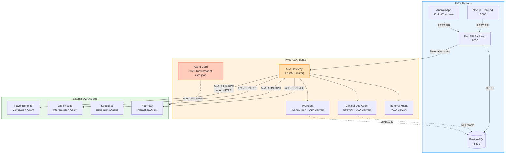

# Product Requirements Document: Agent-to-Agent (A2A) Protocol Integration into Patient Management System (PMS)

**Document ID:** PRD-PMS-A2A-001
**Version:** 1.0
**Date:** 2026-03-09
**Author:** Ammar (CEO, MPS Inc.)
**Status:** Draft

---

## 1. Executive Summary

The **Agent-to-Agent (A2A) Protocol** is an open, Apache 2.0-licensed standard for inter-agent communication, originally announced by Google in April 2025, now governed by the Linux Foundation (LF AI & Data). Version 0.3.0 (July 2025) defines how opaque AI agents — built on diverse frameworks (CrewAI, LangGraph, Google ADK, AutoGen) by different organizations — can discover each other, negotiate capabilities, delegate tasks, and exchange results over HTTP/JSON-RPC without sharing internal state, memory, or tools. Over 150 organizations support A2A, including Salesforce, SAP, ServiceNow, PayPal, and IBM (whose Agent Communication Protocol merged with A2A in August 2025).

Integrating A2A into PMS enables **multi-agent clinical collaboration across organizational boundaries**: a PMS clinical documentation agent can delegate insurance benefits verification to a payer's A2A-compliant agent, a referral coordinator can discover and interact with a specialist scheduling agent, and a lab result interpreter can route structured results to a care coordination agent — all through a standardized protocol without tight coupling. This directly addresses the healthcare interoperability gap where clinical AI agents today are siloed within vendor ecosystems.

A2A is **complementary to MCP** (Experiment 09), not competing. MCP standardizes how an agent connects to tools and data sources (vertical integration), while A2A standardizes how agents collaborate with each other (horizontal integration). Together, they form the complete agent interoperability stack: MCP for internal wiring, A2A for external collaboration.

## 2. Problem Statement

PMS faces three interoperability bottlenecks that A2A uniquely addresses:

1. **Agent island problem**: PMS has evaluated CrewAI (Exp 55), LangGraph (Exp 26), and OpenClaw (Exp 05) for clinical workflows, but these agents cannot natively communicate with agents built by payers, labs, or specialist practices. Each vendor's agent ecosystem is closed, forcing manual data exchange at system boundaries.

2. **Prior authorization fragmentation**: The PA pipeline (Exp 43–49) integrates with payer APIs via REST, but as payers deploy their own AI agents for benefits verification and authorization, PMS needs a standardized protocol to interact with those agents — not just their APIs.

3. **Referral and care coordination silos**: When a PMS agent determines a patient needs a specialist, there is no standard way to discover which specialists accept the patient's insurance, check real-time availability, and initiate a referral — all through agent-to-agent negotiation rather than manual phone calls or fax.

These problems share a root cause: **no standard protocol for healthcare AI agents to discover, authenticate, and collaborate across organizational boundaries**.

## 3. Proposed Solution

### 3.1 Architecture Overview

### 3.2 Deployment Model

- **A2A Gateway**: A FastAPI router (`/a2a/*`) that acts as both A2A client (calling external agents) and A2A server (exposing PMS agents to external consumers).
- **Agent Cards**: Each PMS agent publishes its Agent Card at `https://pms.example.com/.well-known/agent-card.json` describing skills, capabilities, and authentication requirements.
- **Transport**: HTTPS mandatory in production. JSON-RPC 2.0 payloads. SSE for streaming. Webhooks for long-running tasks.
- **Authentication**: OAuth 2.0 for production agent-to-agent auth. API keys for development. Requirements declared in Agent Cards.
- **HIPAA strategy**: A2A messages carrying PHI must be encrypted in transit (TLS 1.3) and at rest. Agent Cards include HIPAA compliance metadata. PHI is only exchanged with agents that have verified BAA status. Audit logging on all inter-agent task exchanges.

## 4. PMS Data Sources

| PMS API | Relevance | A2A Use Case |
|---------|-----------|--------------|
| **Patient Records API** (`/api/patients`) | High | PMS agents include de-identified patient context when delegating tasks to external agents (e.g., demographics for benefits verification) |
| **Encounter Records API** (`/api/encounters`) | High | Clinical documentation agent shares encounter data with lab result interpretation agents; referral agents include encounter summaries |
| **Medication & Prescription API** (`/api/prescriptions`) | Medium | Pharmacy interaction agents check drug-drug interactions; PA agents include medication context for authorization requests |
| **Reporting API** (`/api/reports`) | Low | Aggregate data shared with analytics agents for population health insights |

## 5. Component/Module Definitions

### 5.1 A2A Gateway Service

**Description:** Central FastAPI router handling all A2A protocol operations — both inbound (serving PMS agent capabilities to external agents) and outbound (discovering and calling external agents).

- **Input:** A2A JSON-RPC requests (`tasks/send`, `tasks/get`, `tasks/cancel`)
- **Output:** A2A JSON-RPC responses with task status, messages, and artifacts
- **PMS APIs:** All four APIs (mediated through MCP tools)

### 5.2 Agent Card Registry

**Description:** Stores and serves Agent Cards for PMS agents. Manages discovery of external Agent Cards via `/.well-known/agent-card.json` lookups. Caches external cards with TTL.

- **Input:** Agent Card URLs for external agents; PMS agent configuration
- **Output:** Resolved Agent Cards with capabilities, skills, and auth requirements
- **PMS APIs:** None (standalone discovery service)

### 5.3 Clinical Documentation A2A Agent

**Description:** Wraps the existing CrewAI documentation crew (Exp 55) as an A2A server. External agents can request clinical documentation services — SOAP notes, discharge summaries, referral letters.

- **Input:** A2A task with encounter context, documentation type
- **Output:** A2A artifacts containing structured clinical documents
- **PMS APIs:** `/api/encounters`, `/api/patients`

### 5.4 PA A2A Agent

**Description:** Wraps the PA pipeline (Exp 43–49) as an A2A server, and also acts as an A2A client calling payer benefits verification agents.

- **Input:** A2A task with procedure codes, patient insurance info
- **Output:** A2A artifacts with authorization status, approval/denial, and reference numbers
- **PMS APIs:** `/api/patients`, `/api/prescriptions`

### 5.5 Referral Coordination A2A Agent

**Description:** Discovers specialist scheduling agents via A2A Agent Cards, negotiates appointment availability, and initiates referrals.

- **Input:** A2A task with referral reason, patient preferences, insurance constraints
- **Output:** A2A artifacts with appointment confirmation, specialist details
- **PMS APIs:** `/api/encounters`, `/api/patients`

### 5.6 A2A Audit & Compliance Module

**Description:** Logs all inter-agent task exchanges for HIPAA audit trail. Tracks task lifecycle states, message content hashes, agent identities, and timestamps.

- **Input:** All A2A task events
- **Output:** Structured audit log entries in PostgreSQL
- **PMS APIs:** Direct database writes to `a2a_audit_log` table

## 6. Non-Functional Requirements

### 6.1 Security and HIPAA Compliance

| Requirement | Implementation |
|-------------|---------------|
| **Agent authentication** | OAuth 2.0 with scoped tokens. Auth requirements declared in Agent Cards. Only verified agents can exchange PHI. |
| **Transport encryption** | TLS 1.3 mandatory for all A2A communication. Certificate pinning for known partner agents. |
| **PHI access control** | Agent Cards include HIPAA compliance flag. Gateway rejects PHI-containing tasks to non-compliant agents. |
| **Audit logging** | Every task create/update/complete logged with agent IDs, task ID, timestamp, and content hash. |
| **Agent Card verification** | Cryptographic signing of Agent Cards (v0.3.0 feature). Verify publisher identity before trusting capabilities. |
| **BAA verification** | External agents must have verified BAA status before receiving PHI. Stored in Agent Card Registry. |
| **De-identification fallback** | If BAA status is unverified, PHI is automatically stripped before task delegation. |

### 6.2 Performance

| Metric | Target |
|--------|--------|
| Agent Card discovery | < 500 ms (with caching) |
| Task submission latency | < 1 second for synchronous tasks |
| SSE streaming latency | < 200 ms per event |
| Webhook delivery | < 5 seconds |
| Concurrent A2A tasks | 50+ parallel tasks |
| Task state polling interval | 2 seconds (configurable) |

### 6.3 Infrastructure

- **Python 3.10+** with `a2a-sdk` (official Python SDK)
- **FastAPI** for A2A server and client routes
- **PostgreSQL** for task state persistence and audit logging
- **Redis** (optional) for Agent Card caching
- **No additional Docker services** — runs in-process with PMS backend
- **HTTPS certificates** required for production

## 7. Implementation Phases

### Phase 1: Foundation (Sprints 1–2)

- Install `a2a-sdk` in PMS backend
- Implement A2A Gateway router (`/a2a/*`)
- Create PMS Agent Card with clinical documentation skill
- Implement Agent Card serving at `/.well-known/agent-card.json`
- Build Agent Card discovery client (fetch and cache external cards)
- Implement basic task lifecycle (submit → working → completed)
- Audit logging for all A2A operations
- Unit tests with mock A2A agents

### Phase 2: Core Agent Integration (Sprints 3–4)

- Wrap CrewAI documentation crew as A2A server (Clinical Doc Agent)
- Wrap PA pipeline as A2A client + server (PA Agent)
- Implement SSE streaming for real-time task updates
- Build webhook support for long-running tasks
- Implement OAuth 2.0 agent authentication
- Create Next.js Agent Dashboard for monitoring inter-agent tasks
- Integration tests with sample external A2A agents

### Phase 3: Advanced Features (Sprints 5–6)

- Build Referral Coordination A2A Agent
- Implement multi-agent task chaining (agent A delegates to agent B which delegates to agent C)
- Add HIPAA compliance verification in Agent Card Registry
- Build Android notification support for A2A task updates
- Implement Agent Card signing and verification
- Performance optimization: connection pooling, card caching, task batching
- Production deployment with real external partner agents

## 8. Success Metrics

| Metric | Target | Measurement Method |
|--------|--------|--------------------|
| External agent integrations | 3+ payer/lab/specialist agents connected | Agent Card Registry count |
| PA turnaround time | 50% reduction via agent-to-agent automation | Time tracking: manual vs A2A |
| Referral completion rate | 80% of referrals completed without manual intervention | Task completion analytics |
| Agent discovery time | < 2 seconds to discover and validate external agent | Latency monitoring |
| Task success rate | > 95% for A2A task completions | Task lifecycle analytics |
| HIPAA audit coverage | 100% of inter-agent PHI exchanges logged | Audit log completeness check |

## 9. Risks and Mitigations

| Risk | Impact | Mitigation |
|------|--------|------------|
| **Pre-1.0 protocol maturity** — A2A spec may change before 1.0 | Medium | Pin to v0.3.0, abstract behind `A2AService` interface, monitor spec evolution |
| **Limited healthcare adoption** — few payers/labs have A2A agents yet | High | Start with PMS-internal agent communication. Build mock external agents for testing. Monitor healthcare ecosystem adoption. |
| **Agent Card impersonation** — adversaries clone legitimate cards | High | Implement Agent Card signing verification (v0.3.0). Maintain allowlist of trusted agent URLs. Certificate pinning. |
| **PHI leakage through agent chains** — data cascades across agents | Critical | De-identification gateway on all outbound PHI. BAA verification before PHI exchange. Audit logging. |
| **Authorization creep** — agents accumulate excessive permissions | Medium | Scoped OAuth tokens per task. Time-limited delegated authorization. Permission audit. |
| **Prompt injection via A2A messages** — malicious content in task messages | High | Input validation on all inbound A2A messages. Content filtering. Structured data preference over free text. |
| **OpenAI/Microsoft non-adoption** — ecosystem fragmentation | Medium | A2A is Linux Foundation-governed with 150+ supporters. MCP + A2A covers both camps. Monitor and adapt. |

## 10. Dependencies

| Dependency | Version | Purpose |
|------------|---------|---------|
| a2a-sdk (Python) | ≥ 0.3.24 | Official A2A Python SDK |
| FastAPI | Existing | A2A Gateway server |
| PostgreSQL | Existing | Task state persistence, audit logging |
| CrewAI (Exp 55) | Existing | Clinical documentation agent framework |
| LangGraph (Exp 26) | Existing | PA agent graph framework |
| MCP (Exp 09) | Existing | Internal tool access for A2A agents |
| OAuth 2.0 provider | N/A | Agent authentication (Auth0, Keycloak, or custom) |
| TLS certificates | N/A | HTTPS for production A2A communication |

## 11. Comparison with Existing Experiments

### A2A vs MCP (Exp 09) — Complementary Layers

| Dimension | MCP (Exp 09) | A2A (Exp 63) |
|-----------|-------------|-------------|
| **Focus** | Agent-to-tool connectivity | Agent-to-agent collaboration |
| **Metaphor** | USB port / universal adapter | Business partnership protocol |
| **Communication** | Client calls server tools | Agents delegate tasks to agents |
| **Statefulness** | Stateless tool calls | Stateful task lifecycle (submitted → completed) |
| **Discovery** | Server capabilities list | Agent Cards with identity, skills, auth |
| **Interaction style** | Request-response | Request-response, streaming (SSE), webhooks |
| **Authentication** | Transport-level | Protocol-level (OAuth, API keys in Agent Card) |
| **Use in PMS** | Connect agents to EHR, database, APIs | Connect PMS agents to payer, lab, specialist agents |
| **Analogy** | A worker's toolbox | A company's B2B contracts |

**They work together:** A PMS agent uses MCP internally to query the patient database, then uses A2A externally to send a benefits verification request to a payer's agent.

### A2A vs CrewAI (Exp 55) — Different Scopes

| Dimension | CrewAI (Exp 55) | A2A (Exp 63) |
|-----------|----------------|-------------|
| **Scope** | Intra-application agent orchestration | Inter-application agent communication |
| **Agents** | Same codebase, shared memory | Different codebases, opaque to each other |
| **Framework** | Python library | Protocol (HTTP + JSON-RPC) |
| **Use in PMS** | Coordinate Scribe, Coding, Compliance agents | Connect PMS CrewAI agents to external agents |

**They nest:** CrewAI orchestrates internal agents, which then use A2A to collaborate with external agents.

## 12. Research Sources

### Official Documentation
- [A2A Protocol Specification](https://a2a-protocol.org/latest/specification/) — Canonical protocol spec (v0.3.0)
- [A2A Key Concepts](https://a2a-protocol.org/latest/topics/key-concepts/) — Agent Cards, Tasks, Messages, Artifacts
- [A2A Python SDK](https://github.com/a2aproject/a2a-python) — Official SDK source and docs
- [A2A Samples](https://github.com/a2aproject/a2a-samples) — Reference implementations

### Architecture & Comparison
- [Clarifai: MCP vs A2A Clearly Explained](https://www.clarifai.com/blog/mcp-vs-a2a-clearly-explained) — Definitive comparison of the two protocols
- [Auth0: MCP vs A2A](https://auth0.com/blog/mcp-vs-a2a/) — Security-focused protocol comparison
- [O'Reilly Radar: Designing Collaborative Multi-Agent Systems](https://www.oreilly.com/radar/designing-collaborative-multi-agent-systems-with-the-a2a-protocol/) — Enterprise architecture patterns

### Security & Compliance
- [Solo.io: MCP and A2A Attack Vectors](https://www.solo.io/blog/deep-dive-mcp-and-a2a-attack-vectors-for-ai-agents) — Security threat analysis
- [CSA: MAESTRO Threat Model for A2A](https://cloudsecurityalliance.org/blog/2025/04/30/threat-modeling-google-s-a2a-protocol-with-the-maestro-framework) — Comprehensive threat modeling
- [arXiv: Protecting Sensitive Data in A2A](https://arxiv.org/html/2505.12490v3) — Academic security analysis

### Healthcare Applications
- [Infinitus: MCP and A2A in Healthcare](https://www.infinitus.ai/blog/enabling-modular-interoperable-agentic-ai-systems-in-healthcare-mcp-a2a/) — Healthcare-specific architecture patterns
- [OnHealthcare: A2A for Clinical Workflows](https://www.onhealthcare.tech/p/revolutionizing-healthcare-through) — Clinical use case analysis

### Ecosystem & Governance
- [Linux Foundation A2A Announcement](https://www.linuxfoundation.org/press/linux-foundation-launches-the-agent2agent-protocol-project-to-enable-secure-intelligent-communication-between-ai-agents) — Governance and adoption
- [IBM ACP Merger with A2A](https://lfaidata.foundation/communityblog/2025/08/29/acp-joins-forces-with-a2a-under-the-linux-foundations-lf-ai-data/) — Protocol consolidation

## 13. Appendix: Related Documents

- [A2A Setup Guide](63-A2A-PMS-Developer-Setup-Guide.md) — Developer environment setup and PMS integration
- [A2A Developer Tutorial](63-A2A-Developer-Tutorial.md) — Hands-on onboarding tutorial
- [PRD: MCP PMS Integration](09-PRD-MCP-PMS-Integration.md) — Complementary agent-to-tool protocol
- [PRD: CrewAI PMS Integration](55-PRD-CrewAI-PMS-Integration.md) — Internal agent orchestration
- [PRD: LangGraph PMS Integration](26-PRD-LangGraph-PMS-Integration.md) — Stateful agent graphs
- [A2A Protocol Specification](https://a2a-protocol.org/latest/specification/) — Official spec
