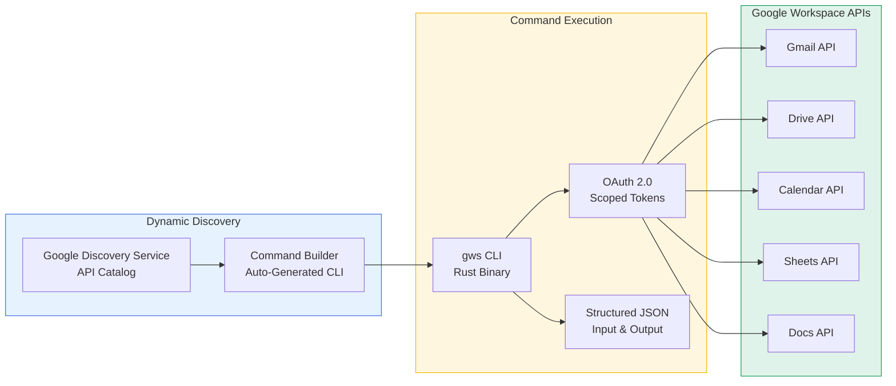
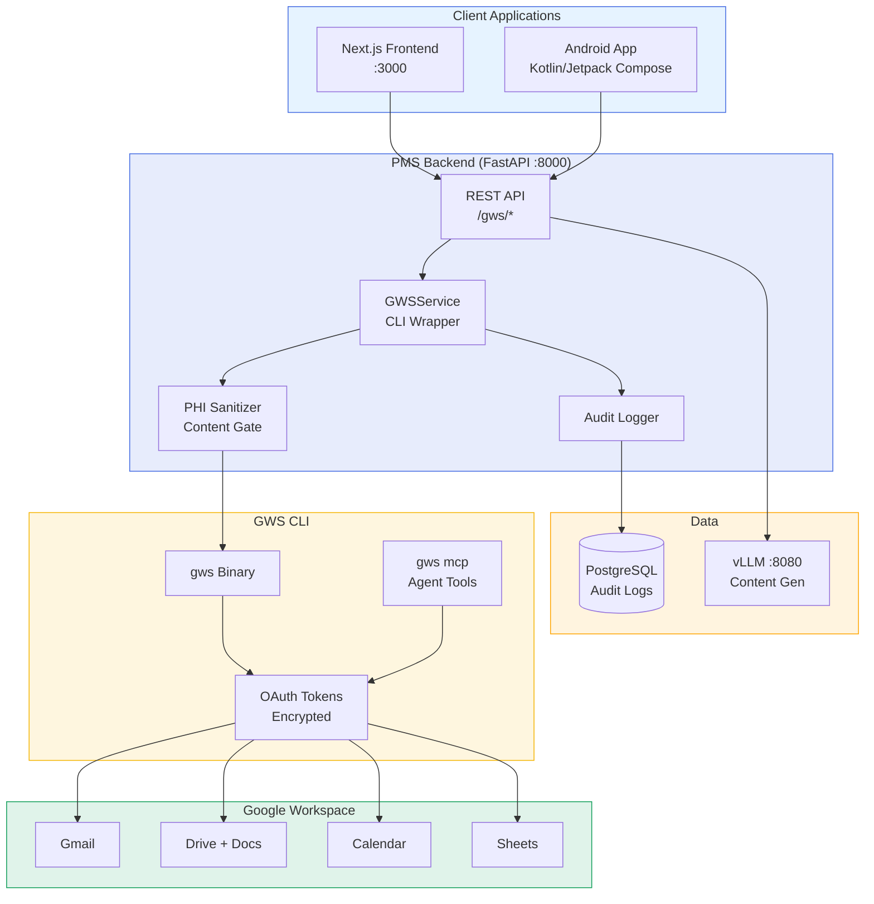

# GWS CLI Developer Onboarding Tutorial

**Welcome to the MPS PMS Google Workspace CLI Integration Team**

This tutorial will take you from zero to building your first automated clinical-administrative workflow with GWS CLI and PMS. By the end, you will understand how GWS CLI bridges PMS clinical data with Google Workspace, have a running local environment, and have built an end-to-end pipeline that generates a SOAP note, exports it as a Google Doc, emails follow-up instructions to the patient, and schedules a follow-up appointment on Google Calendar — all from a single trigger.

**Document ID:** PMS-EXP-GWSCLI-002
**Version:** 1.0
**Date:** 2026-03-09
**Applies To:** PMS project (all platforms)
**Prerequisite:** [GWS CLI Setup Guide](64-GWSCLI-PMS-Developer-Setup-Guide.md)
**Estimated time:** 2-3 hours
**Difficulty:** Beginner-friendly

---

## What You Will Learn

1. What GWS CLI is and why clinical-administrative automation matters
2. How GWS CLI dynamically discovers and calls Google Workspace APIs
3. How OAuth authentication and scope management work
4. How to export SOAP notes as Google Docs from PMS
5. How to send patient follow-up emails via Gmail
6. How to sync appointments between PMS and Google Calendar
7. How to push reporting data to Google Sheets
8. How MCP server mode enables CrewAI agents to control Workspace
9. How HIPAA compliance is maintained when bridging PMS and Google Workspace
10. How GWS CLI compares to Google APIs Python client, Zapier, and other alternatives

---

## Part 1: Understanding GWS CLI (15 min read)

### 1.1 What Problem Does GWS CLI Solve?

Consider Sarah, the front desk coordinator at Texas Retina Associates:

**After every encounter**, Dr. Patel approves the AI-generated SOAP note in PMS. Sarah then opens Google Docs, creates a new document, copies the note, formats it, and shares it with the referring ophthalmologist. Next, she opens Gmail, composes a follow-up email to the patient with post-visit instructions. Then she opens Google Calendar and manually creates a 4-week follow-up appointment. For 25 patients per day, this is 2+ hours of copy-paste between PMS and Google Workspace.

**With GWS CLI**, the moment Dr. Patel clicks "Approve" in PMS, a single API call triggers a pipeline: the note appears as a formatted Google Doc in the shared Drive folder, the patient receives a follow-up email via Gmail, and the follow-up appointment appears on Google Calendar. Sarah's 2 hours of manual work becomes zero.

**The key insight**: PMS is great at clinical data; Google Workspace is great at communication and collaboration. GWS CLI is the **scriptable bridge** that connects them — no manual copy-paste, fully auditable, and automatable by AI agents.

### 1.2 How GWS CLI Works — The Key Pieces



**Dynamic Discovery**: Unlike traditional API clients that are hand-coded for each service, GWS CLI reads Google's Discovery Service at runtime and builds its entire command surface automatically. When Google adds a new API or method, `gws` picks it up without an update. This means zero maintenance for new Workspace features.

**Structured JSON**: Every command outputs JSON by default — not human-formatted text. This makes it trivial to pipe into Python scripts, jq queries, or AI agents. Input parameters are also JSON (`--params`, `--json`), making programmatic usage clean.

**MCP Server**: Running `gws mcp` exposes all Workspace APIs as MCP tools. AI agents (Claude, CrewAI, OpenClaw) can discover and call these tools directly, turning Google Workspace into an agent-accessible toolkit without writing integration code.

### 1.3 How GWS CLI Fits with Other PMS Technologies

| Experiment | What It Does | Relationship to GWS CLI |
|-----------|-------------|------------------------|
| Exp 52: vLLM | Self-hosted LLM inference | **Upstream** — vLLM generates SOAP notes and letters; GWS CLI distributes them |
| Exp 55: CrewAI | Multi-agent orchestration | **Upstream** — CrewAI agents generate content; GWS MCP tools let them create Docs, send emails |
| Exp 53: Llama 4 | Multimodal LLM | **Upstream** — Llama 4 analyzes images + generates reports; GWS CLI exports to Docs |
| Exp 51: Connect Health | Voice contact center | **Complementary** — Connect Health handles calls; GWS CLI handles post-call document workflows |
| Exp 47: Availity | Eligibility/prior auth | **Complementary** — GWS CLI emails PA letter copies; Availity submits to payers |
| Exp 63: A2A | Agent-to-agent protocol | **Complementary** — A2A connects agents; GWS MCP connects agents to Workspace |
| Exp 05: OpenClaw | Agentic workflows | **Complementary** — OpenClaw uses GWS CLI skills for Workspace automation |

### 1.4 Key Vocabulary

| Term | Meaning |
|------|---------|
| **gws** | The CLI binary — a single command for all Google Workspace APIs |
| **Discovery Service** | Google's API catalog that gws reads at runtime to build commands dynamically |
| **OAuth 2.0** | Authentication protocol — gws uses scoped OAuth tokens to access Workspace |
| **Scope** | A permission boundary (e.g., `drive` = read/write Drive, `gmail.send` = send email only) |
| **Agent Skill** | A predefined workflow in gws that automates a common Workspace action |
| **MCP Server** | `gws mcp` mode that exposes Workspace APIs as tools for AI agents |
| **`--dry-run`** | Preview a command without executing — shows what would be sent to the API |
| **`--page-all`** | Auto-paginate large result sets (e.g., listing all Drive files) |
| **`--params`** | JSON object for URL/query parameters |
| **`--json`** | JSON object for request body |
| **Model Armor** | Built-in response sanitization to detect and warn about sensitive content |
| **BAA** | Business Associate Agreement — required with Google for HIPAA-covered Workspace use |

### 1.5 Our Architecture



**Key principle**: PMS backend is the control point. Clients never call GWS CLI directly. All Workspace actions flow through the FastAPI `GWSService`, which enforces PHI sanitization, RBAC, and audit logging before any content reaches Google Workspace.

---

## Part 2: Environment Verification (15 min)

### 2.1 Checklist

```bash
# 1. GWS CLI installed
gws --version
# Expected: gws x.x.x

# 2. OAuth authenticated
gws drive about get --params '{"fields": "user"}' | jq .user.emailAddress
# Expected: your Google Workspace email

# 3. PMS backend running
curl -s http://localhost:8000/health | jq .status
# Expected: "ok"

# 4. GWS endpoints available
curl -s http://localhost:8000/gws/drive/files | jq '.files | length'
# Expected: a number (0 or more)

# 5. PMS frontend running
curl -s http://localhost:3000 -o /dev/null -w "%{http_code}"
# Expected: 200

# 6. vLLM running (for content generation)
curl -s http://localhost:8080/health
# Expected: 200 OK
```

### 2.2 Quick Test

```bash
# End-to-end: create a Google Doc from PMS
curl -s -X POST http://localhost:8000/gws/docs/create \
  -H "Content-Type: application/json" \
  -d '{"title": "PMS Quick Test", "content": "Hello from PMS!"}' | jq .url
# Expected: https://docs.google.com/document/d/...
# Open the URL in your browser — you should see the doc
```

If this returns a Google Docs URL, your full pipeline is working.

---

## Part 3: Build Your First Integration (45 min)

### 3.1 What We Are Building

We'll build an **end-to-encounter workflow** that, given an encounter transcript, runs through this pipeline:

1. Generate a SOAP note (via PMS LLM endpoint / vLLM)
2. Export the SOAP note as a Google Doc (via GWS CLI)
3. Draft and send a patient follow-up email (via Gmail)
4. Create a follow-up calendar event (via Calendar)
5. Log all actions in the audit trail

### 3.2 Create the Pipeline Script

```python
# scripts/test_gws_pipeline.py
"""End-to-end encounter → Google Workspace pipeline."""
import httpx
import json
import time

PMS_URL = "http://localhost:8000"

ENCOUNTER_TRANSCRIPT = """
Dr. Patel: Good morning, Maria. How have your eyes been since your last injection?
Maria Garcia: My right eye has been blurry, especially when reading.
Dr. Patel: OCT shows subretinal fluid OD. VA is 20/40 OD, 20/25 OS.
I recommend another Eylea injection today.
Maria Garcia: Okay, let's do it.
Dr. Patel: Injection went smoothly. Follow up in 4 weeks for OCT.
"""

PATIENT = {
    "name": "Maria Garcia",
    "email": "maria.garcia@example.com",
    "patient_id": "pat-001",
}


def run_pipeline():
    print("=" * 60)
    print("ENCOUNTER → GOOGLE WORKSPACE PIPELINE")
    print("=" * 60)

    with httpx.Client(base_url=PMS_URL, timeout=120) as client:

        # Step 1: Generate SOAP note via vLLM
        print("\n[1] Generating SOAP note...")
        t0 = time.time()
        resp = client.post("/llm/summarize", json={
            "transcript": ENCOUNTER_TRANSCRIPT,
            "specialty": "ophthalmology",
            "template": "SOAP",
        })
        soap_note = resp.json()["note"]
        print(f"    Done in {time.time() - t0:.1f}s")
        print(f"    Preview: {soap_note[:100]}...")

        # Step 2: Export SOAP note as Google Doc
        print("\n[2] Exporting to Google Docs...")
        t0 = time.time()
        resp = client.post("/gws/docs/create", json={
            "title": f"Encounter Note — {PATIENT['name']} — {time.strftime('%Y-%m-%d')}",
            "content": soap_note,
        })
        doc_result = resp.json()
        print(f"    Done in {time.time() - t0:.1f}s")
        print(f"    Doc URL: {doc_result['url']}")

        # Step 3: Send follow-up email via Gmail
        print("\n[3] Sending follow-up email via Gmail...")
        t0 = time.time()
        follow_up_body = (
            f"Dear {PATIENT['name']},\n\n"
            "Thank you for your visit today at Texas Retina Associates.\n\n"
            "What we did: You received an Eylea injection in your right eye.\n\n"
            "Follow-up: Please schedule your next appointment in 4 weeks for an OCT scan.\n\n"
            "When to call us: If you experience sudden vision loss, increasing pain, "
            "or flashing lights, please call us immediately.\n\n"
            "Best regards,\nTexas Retina Associates"
        )
        resp = client.post("/gws/email/send", json={
            "to": PATIENT["email"],
            "subject": f"Follow-up: Your visit on {time.strftime('%Y-%m-%d')}",
            "body": follow_up_body,
        })
        email_result = resp.json()
        print(f"    Done in {time.time() - t0:.1f}s")
        print(f"    Message ID: {email_result['message_id']}")

        # Step 4: Create follow-up calendar event
        print("\n[4] Scheduling follow-up on Google Calendar...")
        t0 = time.time()
        # 4 weeks from today
        import datetime
        follow_up_date = (datetime.date.today() + datetime.timedelta(weeks=4)).isoformat()
        resp = client.post("/gws/calendar/create", json={
            "summary": f"Follow-up: {PATIENT['name']} — OCT scan + Eylea eval",
            "start_time": f"{follow_up_date}T09:00:00",
            "end_time": f"{follow_up_date}T09:30:00",
            "description": (
                f"4-week follow-up for {PATIENT['name']}\n"
                f"Encounter: Eylea injection OD for wet AMD\n"
                f"Doc: {doc_result['url']}"
            ),
        })
        cal_result = resp.json()
        print(f"    Done in {time.time() - t0:.1f}s")
        print(f"    Calendar URL: {cal_result['url']}")

    print(f"\n{'═' * 60}")
    print("PIPELINE COMPLETE")
    print(f"{'═' * 60}")
    print(f"  Google Doc:  {doc_result['url']}")
    print(f"  Email sent:  {email_result['message_id']}")
    print(f"  Calendar:    {cal_result['url']}")


if __name__ == "__main__":
    run_pipeline()
```

### 3.3 Run the Pipeline

```bash
pip install httpx  # if not already installed
python scripts/test_gws_pipeline.py
```

Expected output: A SOAP note generated, exported as a Google Doc, follow-up email sent via Gmail, and follow-up appointment created on Google Calendar — all from one script.

### 3.4 Verify the Results

1. Open the Google Doc URL — you should see the formatted SOAP note
2. Check Gmail sent folder — the follow-up email should be there
3. Check Google Calendar — the follow-up event should appear in 4 weeks

---

## Part 4: Evaluating Strengths and Weaknesses (15 min)

### 4.1 Strengths

- **Zero-code API coverage**: Dynamically discovers all Workspace APIs from Google's Discovery Service — no manual SDK updates
- **Structured JSON output**: Every command returns parseable JSON — ideal for scripting and AI agents
- **MCP server mode**: `gws mcp` turns all Workspace APIs into tools for CrewAI, Claude, OpenClaw — no integration code needed
- **100+ agent skills**: Pre-built workflows for email triage, file organization, meeting prep, and more
- **Dry-run mode**: Preview any command without executing — critical for testing and compliance review
- **Auto-pagination**: `--page-all` handles large result sets automatically
- **Apache 2.0 license**: No commercial restrictions
- **Rust-based**: Fast, low memory footprint, single binary distribution
- **OAuth scope minimization**: Login with only the scopes you need (`-s drive,gmail`)
- **Encrypted credential storage**: AES-256-GCM encryption with OS keyring integration

### 4.2 Weaknesses

- **"Not officially supported"**: Google labels it as not officially supported, despite being in the `googleworkspace` GitHub org
- **Pre-v1.0**: "Expect breaking changes as we march toward v1.0" — API surface may change
- **Subprocess overhead**: Python integration requires subprocess calls — adds latency vs native SDK
- **OAuth app verification**: Unverified apps limited to ~25 scopes — production use requires Google's verification process
- **No built-in retry/queue**: CLI is fire-and-forget; retry logic must be implemented in the application layer
- **HIPAA BAA coverage gap**: Third-party OAuth apps (like gws CLI) may not be covered under Google's Workspace BAA — compliance team must verify
- **Network dependency**: Requires internet access to googleapis.com — no offline mode
- **Node.js dependency**: npm installation requires Node.js runtime in the Docker image

### 4.3 When to Use GWS CLI vs Alternatives

| Scenario | Best Choice | Why |
|----------|-------------|-----|
| PMS → Workspace automation (scripted) | **GWS CLI** | Structured JSON, subprocess-friendly, auto-discovery |
| Complex Google API logic in Python | **Google APIs Python Client** | Native Python, async support, richer error handling |
| AI agents interacting with Workspace | **GWS CLI (MCP mode)** | Built-in MCP server, 100+ agent skills |
| No-code workflow automation | **Zapier / Make** | Visual UI, pre-built triggers, no coding |
| Microsoft 365 integration | **Microsoft Graph** | Different ecosystem (Graph CLI deprecated, use SDK) |
| One-off admin tasks | **GWS CLI** | Quick terminal commands, no code needed |
| High-throughput batch operations | **Google APIs Python Client** | Native async, connection pooling, no subprocess |

### 4.4 HIPAA / Healthcare Considerations

- **Business Associate Agreement**: Google Workspace requires a signed BAA for HIPAA-covered use. Google Workspace Business Plus or higher is required. The BAA covers Gmail, Drive, Calendar, Docs, Sheets — but **third-party OAuth apps may NOT be covered**. Compliance team must explicitly verify.
- **PHI sanitization gate**: Never send raw PHI directly through GWS CLI. All content must pass through the PHI Sanitizer before reaching Google Workspace. Use patient IDs and codes rather than full names and SSNs where possible.
- **OAuth scope minimization**: Only request scopes needed for PMS workflows: `drive`, `gmail.send`, `calendar`, `sheets`. Never request admin or broad scopes.
- **Credential security**: Store OAuth credentials encrypted (AES-256-GCM via OS keyring). In Docker, mount as read-only secrets. Rotate credentials quarterly.
- **Audit logging**: Log every GWS CLI invocation with user, service, method, target, and timestamp. This audit trail is required for HIPAA compliance.
- **Data residency**: Configure Google Workspace data regions per BAA requirements. Ensure patient data stays within the required geographic boundaries.
- **Email encryption**: Configure Gmail for TLS transport. Consider encrypting sensitive attachments before uploading to Drive.
- **Model Armor**: GWS CLI includes built-in response sanitization (`GOOGLE_WORKSPACE_CLI_SANITIZE_MODE=warn`) — enable this to detect PHI in outputs.

---

## Part 5: Debugging Common Issues (15 min read)

### Issue 1: "invalid_grant" OAuth error

**Symptom:** `Error: invalid_grant` when running any gws command.

**Cause:** OAuth token expired or revoked (tokens expire after ~1 hour; refresh tokens can be revoked).

**Fix:**
```bash
gws auth login -s drive,gmail,calendar,sheets
# Re-authorize in browser
```

### Issue 2: Empty response from Drive/Gmail

**Symptom:** Command returns `{}` or `{"files": []}` unexpectedly.

**Cause:** OAuth scope doesn't include the requested service, or the authenticated user doesn't have access.

**Fix:**
```bash
# Check which scopes are authorized
gws auth login -s drive,gmail,calendar,sheets  # Re-login with all needed scopes

# Verify user has access
gws drive about get --params '{"fields": "user"}' | jq .
```

### Issue 3: Subprocess returns non-zero exit code

**Symptom:** `RuntimeError: GWS CLI failed` in Python with cryptic stderr.

**Cause:** Various — invalid JSON params, API quota exceeded, network error.

**Fix:**
```python
# Add stderr to error message for debugging
logger.error("GWS CLI stderr: %s", result.stderr)
logger.error("GWS CLI stdout: %s", result.stdout)

# Test the same command directly in terminal
gws drive files list --params '{"pageSize": 1}' --dry-run
```

### Issue 4: Rate limiting (429 errors)

**Symptom:** `Error: 429 Too Many Requests` in CLI output.

**Cause:** Exceeded Google API quotas (default varies by API).

**Fix:**
```bash
# Check current quotas
# Go to: https://console.cloud.google.com/apis/dashboard
# Click on the specific API → Quotas tab

# Add retry with backoff in Python
import time
for attempt in range(3):
    try:
        return self._run(args)
    except RuntimeError:
        time.sleep(2 ** attempt)
```

### Issue 5: Calendar events created in wrong timezone

**Symptom:** Events appear at the wrong time on Google Calendar.

**Cause:** Missing or incorrect timezone in the event data.

**Fix:**
```python
# Always specify timezone explicitly
event = {
    "start": {"dateTime": "2026-04-06T09:00:00", "timeZone": "America/Chicago"},
    "end": {"dateTime": "2026-04-06T09:30:00", "timeZone": "America/Chicago"},
}
```

### Issue 6: Sheets range with `!` causes bash error

**Symptom:** `bash: !A1: event not found` when using Sheets ranges.

**Cause:** Bash interprets `!` as history expansion.

**Fix:**
```bash
# Use single quotes (not double quotes) around JSON params
gws sheets spreadsheets.values get \
  --params '{"spreadsheetId": "id", "range": "Sheet1!A1:D10"}'
```

---

## Part 6: Practice Exercises (45 min)

### Option A: Build a Monthly Quality Report Pipeline

Build a script that pulls PMS quality metrics and pushes them to a Google Sheets dashboard.

**Hints:**
1. Call `/api/reports/monthly` to get quality metrics (encounters, acceptance rates, coding accuracy)
2. Create a Sheets spreadsheet (or use an existing one)
3. Push metrics data to Sheets with `gws sheets spreadsheets.values append`
4. Format headers and data types for readability
5. Share the spreadsheet with the quality team via Drive

### Option B: Build a Referral Letter Workflow

Build a pipeline that generates a referral letter and shares it via Google Drive and Gmail.

**Hints:**
1. Generate a referral letter via `/llm/draft-letter` with referral context
2. Create a Google Doc with the letter content
3. Share the Doc with the referring physician's email
4. Send an email notification via Gmail with the Doc link
5. Create a calendar reminder for follow-up

### Option C: Build an Appointment Sync Service

Build a two-way sync between PMS appointments and Google Calendar.

**Hints:**
1. Fetch upcoming PMS appointments from `/api/encounters?status=scheduled`
2. Check Google Calendar for existing events matching PMS appointment IDs
3. Create missing events in Google Calendar
4. Update events if PMS appointment details changed
5. Handle cancellations (delete event if PMS appointment cancelled)
6. Run on a 5-minute interval using a background task

---

## Part 7: Development Workflow and Conventions

### 7.1 File Organization

```
pms-backend/
├── src/pms/
│   ├── services/
│   │   ├── gws_service.py         # GWS CLI wrapper (core)
│   │   ├── crew_service.py        # CrewAI orchestration (Exp 55)
│   │   └── llm_service.py         # LLM inference (Exp 52)
│   ├── routers/
│   │   ├── gws.py                 # FastAPI endpoints (/gws/*)
│   │   ├── crew.py                # CrewAI endpoints (/crew/*)
│   │   └── llm.py                 # LLM endpoints (/llm/*)
│   └── config.py                  # GWS_* settings
├── docker-compose.yml             # Backend + vLLM services
├── .env                           # GWS_* environment variables
└── gws-credentials/               # Mounted OAuth credentials (gitignored)

pms-frontend/
├── src/components/
│   └── gws/
│       └── WorkspaceActions.tsx   # Export to Docs / Send Email / Schedule

scripts/
├── test_gws_pipeline.py           # End-to-end encounter→Workspace pipeline
└── test_vllm_pipeline.py          # LLM pipeline test (Exp 52)
```

### 7.2 Naming Conventions

| Item | Convention | Example |
|------|-----------|---------|
| Service class | `GWSService` | `GWSService()` |
| API endpoint | `/gws/{service}/{action}` | `/gws/docs/create` |
| Config variable | `GWS_{KEY}` | `GWS_DRIVE_FOLDER_ID` |
| Environment variable | `GWS_*` or `GOOGLE_WORKSPACE_CLI_*` | `GWS_CLI_PATH` |
| React component | `Gws{Feature}.tsx` | `WorkspaceActions.tsx` |
| CLI command | `gws {service} {resource} {method}` | `gws drive files list` |
| Docker volume | `gws-credentials` | Mount at `/app/.config/gws:ro` |

### 7.3 PR Checklist

- [ ] No PHI in GWS CLI commands (use de-identified content only)
- [ ] All Workspace actions go through `GWSService` (never call gws CLI directly from routers)
- [ ] Audit log entry for every GWS CLI invocation
- [ ] PHI Sanitizer gate on content before CLI transmission
- [ ] OAuth scopes minimized (only requested services)
- [ ] Error handling for CLI timeout and API errors
- [ ] Frontend shows action status (running/complete/error)
- [ ] `--dry-run` used for testing new commands
- [ ] Credentials not committed to git (check `.gitignore`)
- [ ] New Workspace workflows tested with test Google account

### 7.4 Security Reminders

- **Never pass raw PHI through GWS CLI**: All content must go through the PHI Sanitizer. Use patient IDs, not full names/SSNs, in document titles.
- **Credentials are secrets**: Never commit OAuth credentials to git. Mount as read-only Docker secrets. Rotate quarterly.
- **Scope minimization**: Request only the OAuth scopes you need. `gmail.send` (not `gmail`) if you only send.
- **Audit everything**: Every GWS CLI call must have a corresponding audit log entry in PostgreSQL.
- **BAA verification**: Ensure your Google Workspace plan has a signed BAA. Verify that CLI-based OAuth access is covered.
- **Model Armor**: Enable `GOOGLE_WORKSPACE_CLI_SANITIZE_MODE=warn` to detect sensitive content in responses.
- **Network isolation**: GWS CLI requires internet (googleapis.com). Ensure it's the only outbound path — no PHI should reach Google without going through the Sanitizer.

---

## Part 8: Quick Reference Card

### Key Commands

```bash
# Auth
gws auth login -s drive,gmail,calendar,sheets
gws auth export --unmasked > credentials.json

# Drive
gws drive files list --params '{"pageSize": 10}' | jq '.files[].name'
gws drive files create --json '{"name": "report.pdf"}' --upload ./report.pdf

# Docs
gws docs documents create --json '{"title": "My Doc"}'

# Gmail
gws gmail users.messages list --params '{"userId": "me", "maxResults": 5}'

# Calendar
gws calendar events list --params '{"calendarId": "primary", "maxResults": 5}'

# Sheets
gws sheets spreadsheets create --json '{"properties": {"title": "Report"}}'

# Schema inspection
gws schema drive.files.list

# Dry run
gws drive files list --params '{"pageSize": 1}' --dry-run

# MCP server (for AI agents)
gws mcp
```

### Key Files

| File | Purpose |
|------|---------|
| `src/pms/services/gws_service.py` | GWS CLI wrapper (core) |
| `src/pms/routers/gws.py` | FastAPI endpoints |
| `src/pms/config.py` | GWS_* settings |
| `.env` | GWS credentials and config |
| `gws-credentials/` | Mounted OAuth credentials |
| `WorkspaceActions.tsx` | Frontend Workspace buttons |

### Key URLs

| Resource | URL |
|----------|-----|
| PMS GWS endpoints | http://localhost:8000/gws/* |
| GWS CLI GitHub | https://github.com/googleworkspace/cli |
| GWS CLI npm | https://www.npmjs.com/package/@googleworkspace/cli |
| Google Cloud Console | https://console.cloud.google.com |
| Google Workspace Admin | https://admin.google.com |
| HIPAA compliance guide | https://support.google.com/a/answer/3407054 |

### Starter Template

```python
from pms.services.gws_service import GWSService

gws = GWSService()

# Create a Google Doc
doc = gws.create_doc(
    title="Encounter Note — Patient 001",
    content="S: Patient reports blurry vision...",
)
print(f"Doc URL: {doc['url']}")

# Send an email
email = gws.send_email(
    to="patient@example.com",
    subject="Follow-up instructions",
    body="Dear Patient, thank you for your visit...",
)
print(f"Email sent: {email['message_id']}")

# Schedule a follow-up
event = gws.create_calendar_event(
    summary="Follow-up: Patient 001",
    start_time="2026-04-06T09:00:00",
    end_time="2026-04-06T09:30:00",
)
print(f"Calendar: {event['url']}")
```

---

## Next Steps

1. Review the [GWS CLI PRD](64-PRD-GWSCLI-PMS-Integration.md) for full component definitions and implementation phases
2. Set up `gws mcp` for [CrewAI agent integration](55-CrewAI-Developer-Tutorial.md) — agents create Docs and send emails as part of clinical workflows
3. Build the end-of-encounter Flow: approve note → create Doc → email patient → schedule follow-up → update Sheets
4. Configure Google Workspace BAA for HIPAA compliance
5. Implement the PHI Sanitizer gate for all content passing through GWS CLI
6. Build the monthly quality report pipeline (PMS metrics → Google Sheets dashboard)
7. Explore [GWS CLI Agent Skills](https://github.com/googleworkspace/cli) for pre-built Workspace automations
