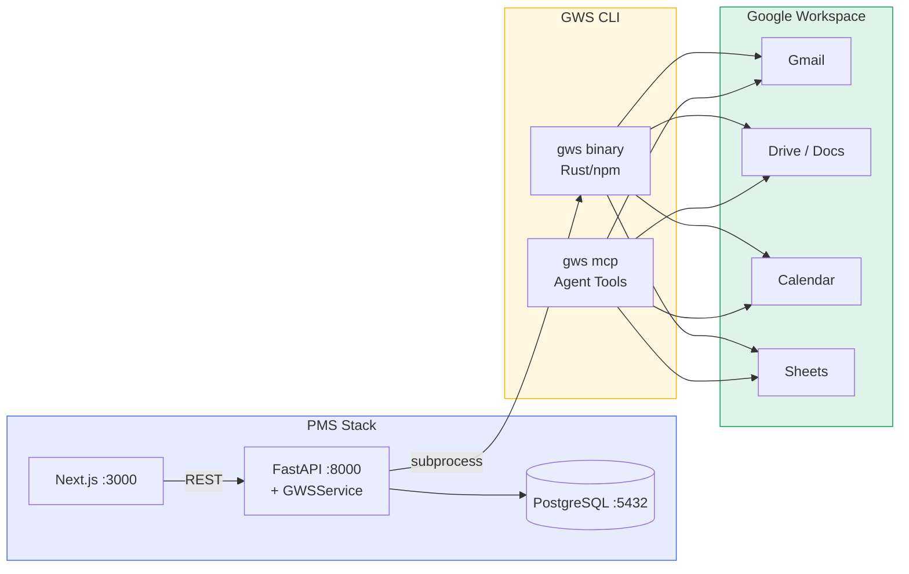

# GWS CLI Setup Guide for PMS Integration

**Document ID:** PMS-EXP-GWSCLI-001
**Version:** 1.0
**Date:** 2026-03-09
**Applies To:** PMS project (all platforms)
**Prerequisites Level:** Intermediate

---

## Table of Contents

1. [Overview](#1-overview)
2. [Prerequisites](#2-prerequisites)
3. [Part A: Install and Configure GWS CLI](#3-part-a-install-and-configure-gws-cli)
4. [Part B: Integrate with PMS Backend](#4-part-b-integrate-with-pms-backend)
5. [Part C: Integrate with PMS Frontend](#5-part-c-integrate-with-pms-frontend)
6. [Part D: Testing and Verification](#6-part-d-testing-and-verification)
7. [Troubleshooting](#7-troubleshooting)
8. [Reference Commands](#8-reference-commands)

---

## 1. Overview

This guide walks you through integrating Google Workspace CLI (`gws`) with PMS to automate clinical-administrative workflows. By the end, you will have:

- GWS CLI installed and authenticated with Google Workspace
- A Python `GWSService` wrapping CLI commands for FastAPI
- SOAP notes exporting as Google Docs
- Patient communications sending via Gmail
- Appointment syncing with Google Calendar
- Audit logging for all Workspace actions



---

## 2. Prerequisites

### 2.1 Required Software

| Software | Minimum Version | Check Command |
|----------|----------------|---------------|
| Node.js | 18 | `node --version` |
| npm | 9+ | `npm --version` |
| Python | 3.11 | `python3 --version` |
| Docker | 24.0 | `docker --version` |
| Git | 2.x | `git --version` |
| Google Cloud account | N/A | https://console.cloud.google.com |
| Google Workspace | Business Plus+ | For BAA eligibility (HIPAA) |

### 2.2 Google Cloud Project Setup

Before installing GWS CLI, you need a Google Cloud project with OAuth credentials:

1. Go to [Google Cloud Console](https://console.cloud.google.com)
2. Create a new project (e.g., "MPS-PMS-GWS")
3. Enable the following APIs:
   - Gmail API
   - Google Drive API
   - Google Calendar API
   - Google Sheets API
   - Google Docs API
4. Create OAuth 2.0 credentials:
   - Go to **APIs & Services → Credentials**
   - Click **Create Credentials → OAuth client ID**
   - Application type: **Desktop app**
   - Download the client secret JSON file

### 2.3 Verify PMS Services

```bash
# PMS backend
curl -s http://localhost:8000/health | jq .status
# Expected: "ok"

# PMS frontend
curl -s http://localhost:3000 -o /dev/null -w "%{http_code}"
# Expected: 200

# PostgreSQL
docker exec pms-backend-postgres-1 pg_isready
# Expected: accepting connections

# vLLM (optional — for content generation)
curl -s http://localhost:8080/health
# Expected: 200 OK
```

---

## 3. Part A: Install and Configure GWS CLI

### Step 1: Install GWS CLI

```bash
# Install via npm (recommended — includes pre-built binary)
npm install -g @googleworkspace/cli

# Verify installation
gws --version
# Expected: gws x.x.x

# Alternative: install via Cargo (from source)
# cargo install --git https://github.com/googleworkspace/cli --locked
```

### Step 2: Set up OAuth authentication

```bash
# Option A: Interactive setup (creates Cloud project + enables APIs automatically)
gws auth setup
# Follow the prompts to create/select a project and enable APIs

# Option B: Manual setup (use existing Cloud project)
# Copy your OAuth client_secret.json to the GWS config directory
mkdir -p ~/.config/gws
cp ~/Downloads/client_secret_*.json ~/.config/gws/client_secret.json

# Login with specific scopes (only what PMS needs)
gws auth login -s drive,gmail,calendar,sheets
# A browser window opens — authorize the app
# Expected: "Authentication successful"
```

### Step 3: Verify authentication

```bash
# Test Drive access
gws drive files list --params '{"pageSize": 3}' | jq '.files[].name'
# Expected: List of your Drive file names

# Test Gmail access
gws gmail users.messages list --params '{"userId": "me", "maxResults": 3}' | jq '.messages[].id'
# Expected: List of message IDs

# Test Calendar access
gws calendar events list --params '{"calendarId": "primary", "maxResults": 3}' | jq '.items[].summary'
# Expected: List of calendar event titles

# Test Sheets access (create a test spreadsheet)
gws sheets spreadsheets create --json '{"properties": {"title": "PMS Test Sheet"}}' | jq '.spreadsheetId'
# Expected: A spreadsheet ID string
```

### Step 4: Configure environment variables

Add to `pms-backend/.env`:

```bash
# GWS CLI Configuration
GWS_CLI_PATH=/usr/local/bin/gws
GWS_CREDENTIALS_FILE=/app/.config/gws/credentials.json
GWS_DRIVE_FOLDER_ID=your-shared-drive-folder-id
GWS_CALENDAR_ID=primary
GWS_SENDER_EMAIL=clinic@yourdomain.com
```

### Step 5: Export credentials for Docker/CI

```bash
# Export credentials (for mounting into Docker)
gws auth export --unmasked > ~/.config/gws/credentials.json

# Verify the export
cat ~/.config/gws/credentials.json | jq .token_type
# Expected: "Bearer"
```

**Checkpoint:** GWS CLI installed, authenticated with Drive/Gmail/Calendar/Sheets scopes, credentials exported for Docker use.

---

## 4. Part B: Integrate with PMS Backend

### Step 1: Add configuration settings

Add to `src/pms/config.py` in the `Settings` class:

```python
# GWS CLI
GWS_CLI_PATH: str = "gws"
GWS_CREDENTIALS_FILE: str = ""
GWS_DRIVE_FOLDER_ID: str = ""
GWS_CALENDAR_ID: str = "primary"
GWS_SENDER_EMAIL: str = ""
```

### Step 2: Create the GWS service

```python
# src/pms/services/gws_service.py
"""Google Workspace CLI service for PMS administrative workflows."""

import json
import logging
import subprocess
from typing import Any

from pms.config import settings

logger = logging.getLogger(__name__)


class GWSService:
    """Wraps the gws CLI for Workspace automation from PMS."""

    def __init__(self):
        self.cli = settings.GWS_CLI_PATH
        self.env = {}
        if settings.GWS_CREDENTIALS_FILE:
            self.env["GOOGLE_WORKSPACE_CLI_CREDENTIALS_FILE"] = settings.GWS_CREDENTIALS_FILE

    def _run(self, args: list[str], input_json: dict | None = None) -> dict:
        """Execute a gws CLI command and return parsed JSON."""
        cmd = [self.cli] + args
        stdin_data = json.dumps(input_json) if input_json else None

        logger.info("GWS CLI: %s", " ".join(cmd))
        result = subprocess.run(
            cmd,
            capture_output=True,
            text=True,
            timeout=30,
            env={**subprocess.os.environ, **self.env},
            input=stdin_data,
        )

        if result.returncode != 0:
            logger.error("GWS CLI error: %s", result.stderr)
            raise RuntimeError(f"GWS CLI failed: {result.stderr}")

        return json.loads(result.stdout) if result.stdout.strip() else {}

    def create_doc(self, title: str, content: str, folder_id: str | None = None) -> dict:
        """Create a Google Doc with the given content."""
        folder = folder_id or settings.GWS_DRIVE_FOLDER_ID
        # Step 1: Create the doc
        doc = self._run(
            ["docs", "documents", "create"],
            input_json={"title": title},
        )
        doc_id = doc.get("documentId", "")

        # Step 2: Insert content
        self._run(
            ["docs", "documents", "batchUpdate", "--params", json.dumps({"documentId": doc_id})],
            input_json={
                "requests": [
                    {"insertText": {"location": {"index": 1}, "text": content}}
                ]
            },
        )

        # Step 3: Move to target folder (if specified)
        if folder:
            self._run([
                "drive", "files", "update",
                "--params", json.dumps({"fileId": doc_id, "addParents": folder}),
            ])

        return {"document_id": doc_id, "url": f"https://docs.google.com/document/d/{doc_id}"}

    def send_email(
        self,
        to: str,
        subject: str,
        body: str,
        sender: str | None = None,
    ) -> dict:
        """Send an email via Gmail."""
        import base64
        from email.mime.text import MIMEText

        sender_email = sender or settings.GWS_SENDER_EMAIL
        message = MIMEText(body)
        message["to"] = to
        message["from"] = sender_email
        message["subject"] = subject
        raw = base64.urlsafe_b64encode(message.as_bytes()).decode()

        result = self._run(
            ["gmail", "users.messages", "send", "--params", '{"userId": "me"}'],
            input_json={"raw": raw},
        )
        return {"message_id": result.get("id", ""), "thread_id": result.get("threadId", "")}

    def create_calendar_event(
        self,
        summary: str,
        start_time: str,
        end_time: str,
        description: str = "",
        attendees: list[str] | None = None,
    ) -> dict:
        """Create a Google Calendar event."""
        event = {
            "summary": summary,
            "description": description,
            "start": {"dateTime": start_time, "timeZone": "America/Chicago"},
            "end": {"dateTime": end_time, "timeZone": "America/Chicago"},
        }
        if attendees:
            event["attendees"] = [{"email": e} for e in attendees]

        calendar_id = settings.GWS_CALENDAR_ID
        result = self._run(
            ["calendar", "events", "insert",
             "--params", json.dumps({"calendarId": calendar_id})],
            input_json=event,
        )
        return {
            "event_id": result.get("id", ""),
            "url": result.get("htmlLink", ""),
        }

    def push_to_sheets(
        self,
        spreadsheet_id: str,
        sheet_range: str,
        values: list[list[Any]],
    ) -> dict:
        """Append data to a Google Sheets spreadsheet."""
        result = self._run(
            ["sheets", "spreadsheets.values", "append",
             "--params", json.dumps({
                 "spreadsheetId": spreadsheet_id,
                 "range": sheet_range,
                 "valueInputOption": "USER_ENTERED",
             })],
            input_json={"values": values},
        )
        return {"updated_range": result.get("updates", {}).get("updatedRange", "")}

    def list_drive_files(self, folder_id: str | None = None, page_size: int = 20) -> list[dict]:
        """List files in a Drive folder."""
        query = f"'{folder_id}' in parents" if folder_id else None
        params: dict[str, Any] = {"pageSize": page_size}
        if query:
            params["q"] = query

        result = self._run(
            ["drive", "files", "list", "--params", json.dumps(params)],
        )
        return result.get("files", [])
```

### Step 3: Create the FastAPI router

```python
# src/pms/routers/gws.py
"""Google Workspace integration endpoints for PMS."""

from fastapi import APIRouter
from pydantic import BaseModel

from pms.services.gws_service import GWSService

router = APIRouter(prefix="/gws", tags=["gws"])


class CreateDocRequest(BaseModel):
    title: str
    content: str
    folder_id: str | None = None


class SendEmailRequest(BaseModel):
    to: str
    subject: str
    body: str


class CreateEventRequest(BaseModel):
    summary: str
    start_time: str  # ISO 8601
    end_time: str    # ISO 8601
    description: str = ""
    attendees: list[str] | None = None


class PushSheetsRequest(BaseModel):
    spreadsheet_id: str
    sheet_range: str
    values: list[list]


@router.post("/docs/create")
async def create_doc(req: CreateDocRequest):
    service = GWSService()
    return service.create_doc(req.title, req.content, req.folder_id)


@router.post("/email/send")
async def send_email(req: SendEmailRequest):
    service = GWSService()
    return service.send_email(req.to, req.subject, req.body)


@router.post("/calendar/create")
async def create_event(req: CreateEventRequest):
    service = GWSService()
    return service.create_calendar_event(
        req.summary, req.start_time, req.end_time,
        req.description, req.attendees,
    )


@router.post("/sheets/push")
async def push_sheets(req: PushSheetsRequest):
    service = GWSService()
    return service.push_to_sheets(req.spreadsheet_id, req.sheet_range, req.values)


@router.get("/drive/files")
async def list_files(folder_id: str | None = None):
    service = GWSService()
    return {"files": service.list_drive_files(folder_id)}
```

### Step 4: Register the router

Add to `src/pms/main.py`:

```python
from pms.routers import gws
app.include_router(gws.router)
```

### Step 5: Update Docker image

Add GWS CLI installation to the `pms-backend` Dockerfile:

```dockerfile
# Install Node.js and GWS CLI
RUN apt-get update && apt-get install -y nodejs npm \
    && npm install -g @googleworkspace/cli \
    && apt-get clean

# Mount credentials at runtime via Docker secrets or volume
```

Update `docker-compose.yml`:

```yaml
services:
  backend:
    # ... existing config ...
    environment:
      - GWS_CLI_PATH=gws
      - GWS_CREDENTIALS_FILE=/app/.config/gws/credentials.json
      - GWS_DRIVE_FOLDER_ID=${GWS_DRIVE_FOLDER_ID}
      - GWS_CALENDAR_ID=${GWS_CALENDAR_ID}
      - GWS_SENDER_EMAIL=${GWS_SENDER_EMAIL}
    volumes:
      - ./gws-credentials:/app/.config/gws:ro  # Mount credentials read-only
```

**Checkpoint:** PMS backend integrated with GWS CLI. `GWSService` wraps CLI for Docs, Gmail, Calendar, and Sheets. FastAPI router exposes endpoints at `/gws/*`. GWS CLI installed in Docker image with mounted credentials.

---

## 5. Part C: Integrate with PMS Frontend

> **Note:** The PMS frontend uses a custom `api` client (`@/lib/api`) and shadcn/ui-style components (`Card`, `Button`, `Badge`) with variants: Button `primary`/`secondary`/`danger`/`ghost`; Badge `default`/`success`/`warning`/`danger`/`info`.

### Step 1: Create the Workspace Actions component

```typescript
// src/components/gws/WorkspaceActions.tsx
"use client";

import { useState, useCallback } from "react";
import { Card, CardContent, CardHeader, CardTitle } from "@/components/ui/card";
import { Button } from "@/components/ui/button";
import { Badge } from "@/components/ui/badge";
import { api } from "@/lib/api";

interface Props {
  encounterId: string;
  patientName: string;
  patientEmail?: string;
  soapNote: string;
  followUpDate?: string;
}

type ActionStatus = "idle" | "running" | "done" | "error";

export function WorkspaceActions({
  encounterId,
  patientName,
  patientEmail,
  soapNote,
  followUpDate,
}: Props) {
  const [docStatus, setDocStatus] = useState<ActionStatus>("idle");
  const [emailStatus, setEmailStatus] = useState<ActionStatus>("idle");
  const [calStatus, setCalStatus] = useState<ActionStatus>("idle");
  const [docUrl, setDocUrl] = useState<string | null>(null);

  const exportToDoc = useCallback(async () => {
    setDocStatus("running");
    try {
      const result = await api.post<{ url: string }>("/gws/docs/create", {
        title: `Encounter ${encounterId} — ${patientName}`,
        content: soapNote,
      });
      setDocUrl(result.url);
      setDocStatus("done");
    } catch {
      setDocStatus("error");
    }
  }, [encounterId, patientName, soapNote]);

  const sendFollowUp = useCallback(async () => {
    if (!patientEmail) return;
    setEmailStatus("running");
    try {
      await api.post("/gws/email/send", {
        to: patientEmail,
        subject: `Follow-up: Your visit on ${new Date().toLocaleDateString()}`,
        body: `Dear ${patientName},\n\nThank you for your visit today. Please follow the instructions provided by your doctor.\n\nBest regards,\nTexas Retina Associates`,
      });
      setEmailStatus("done");
    } catch {
      setEmailStatus("error");
    }
  }, [patientEmail, patientName]);

  const scheduleFollowUp = useCallback(async () => {
    if (!followUpDate) return;
    setCalStatus("running");
    try {
      await api.post("/gws/calendar/create", {
        summary: `Follow-up: ${patientName}`,
        start_time: `${followUpDate}T09:00:00`,
        end_time: `${followUpDate}T09:30:00`,
        description: `Follow-up appointment for encounter ${encounterId}`,
      });
      setCalStatus("done");
    } catch {
      setCalStatus("error");
    }
  }, [followUpDate, patientName, encounterId]);

  const statusBadge = (status: ActionStatus) => {
    const map: Record<ActionStatus, { variant: "default" | "success" | "warning" | "danger"; label: string }> = {
      idle: { variant: "default", label: "Ready" },
      running: { variant: "warning", label: "Running..." },
      done: { variant: "success", label: "Done" },
      error: { variant: "danger", label: "Failed" },
    };
    const { variant, label } = map[status];
    return <Badge variant={variant}>{label}</Badge>;
  };

  return (
    <Card>
      <CardHeader>
        <CardTitle>Google Workspace Actions</CardTitle>
      </CardHeader>
      <CardContent className="space-y-3">
        <div className="flex items-center justify-between">
          <Button onClick={exportToDoc} disabled={docStatus === "running"} variant="secondary">
            Export Note to Google Docs
          </Button>
          {statusBadge(docStatus)}
        </div>
        {docUrl && (
          <a href={docUrl} target="_blank" rel="noopener noreferrer" className="text-sm text-blue-600 underline">
            Open in Google Docs
          </a>
        )}

        {patientEmail && (
          <div className="flex items-center justify-between">
            <Button onClick={sendFollowUp} disabled={emailStatus === "running"} variant="secondary">
              Send Follow-Up Email
            </Button>
            {statusBadge(emailStatus)}
          </div>
        )}

        {followUpDate && (
          <div className="flex items-center justify-between">
            <Button onClick={scheduleFollowUp} disabled={calStatus === "running"} variant="secondary">
              Schedule Follow-Up
            </Button>
            {statusBadge(calStatus)}
          </div>
        )}
      </CardContent>
    </Card>
  );
}
```

**Checkpoint:** PMS frontend has `WorkspaceActions` component with buttons to export notes to Docs, send follow-up emails via Gmail, and schedule follow-ups on Calendar. Uses PMS `api` client and standard UI components.

---

## 6. Part D: Testing and Verification

### Step 1: Verify GWS CLI

```bash
# Version check
gws --version
# Expected: gws x.x.x

# Auth check
gws drive files list --params '{"pageSize": 1}' | jq '.files | length'
# Expected: 1 (or 0 if empty Drive)
```

### Step 2: Test PMS backend endpoints

```bash
# Test document creation
curl -s -X POST http://localhost:8000/gws/docs/create \
  -H "Content-Type: application/json" \
  -d '{
    "title": "Test SOAP Note — Maria Garcia",
    "content": "S: Patient reports blurry vision OD.\nO: VA 20/40 OD, 20/25 OS. OCT: subretinal fluid OD.\nA: Wet AMD OD, stable OS.\nP: Eylea injection OD. Follow up 4 weeks."
  }' | jq .
# Expected: {"document_id": "...", "url": "https://docs.google.com/document/d/..."}

# Test email send
curl -s -X POST http://localhost:8000/gws/email/send \
  -H "Content-Type: application/json" \
  -d '{
    "to": "test@example.com",
    "subject": "Follow-up: Your visit today",
    "body": "Dear Maria,\n\nThank you for your visit. Your next appointment is in 4 weeks.\n\nBest regards"
  }' | jq .
# Expected: {"message_id": "...", "thread_id": "..."}

# Test calendar event
curl -s -X POST http://localhost:8000/gws/calendar/create \
  -H "Content-Type: application/json" \
  -d '{
    "summary": "Follow-up: Maria Garcia — OCT scan",
    "start_time": "2026-04-06T09:00:00",
    "end_time": "2026-04-06T09:30:00",
    "description": "4-week follow-up for Eylea injection"
  }' | jq .
# Expected: {"event_id": "...", "url": "https://calendar.google.com/..."}

# Test Drive file listing
curl -s http://localhost:8000/gws/drive/files | jq '.files | length'
# Expected: Number of files
```

### Step 3: Verify audit logging

```bash
# Check that GWS actions were logged
curl -s http://localhost:8000/api/audit?source=gws | jq '.[-1]'
# Expected: Audit entry with service, method, timestamp
```

**Checkpoint:** All GWS CLI endpoints working through PMS backend. Documents created, emails sent, calendar events scheduled, audit trail captured.

---

## 7. Troubleshooting

### GWS CLI command not found

**Symptom:** `gws: command not found` after installation.

**Fix:** Ensure npm global bin is in PATH:
```bash
# Find npm global bin directory
npm config get prefix
# Add to PATH if needed
export PATH="$(npm config get prefix)/bin:$PATH"
```

### OAuth authentication fails

**Symptom:** `Error: invalid_grant` or `Token has been revoked`.

**Fix:** Re-authenticate:
```bash
# Clear existing credentials
rm -rf ~/.config/gws/credentials.json

# Re-login
gws auth login -s drive,gmail,calendar,sheets
```

### "Scope limit exceeded" for unverified app

**Symptom:** OAuth flow fails with scope limit error.

**Fix:** Unverified OAuth apps are limited to ~25 scopes. Select only needed scopes:
```bash
# Login with minimal scopes
gws auth login -s drive,gmail.send,calendar,sheets

# For full access, verify your OAuth app in Google Cloud Console
# or use a workspace-internal OAuth client (Admin Console → Security → API Controls)
```

### Subprocess timeout in Python

**Symptom:** `subprocess.TimeoutExpired` when calling GWS CLI.

**Fix:** Increase timeout for large operations:
```python
result = subprocess.run(cmd, timeout=60)  # Increase from 30 to 60 seconds
```

### Shell escaping issues with Sheets ranges

**Symptom:** Bash interprets `!` in Sheets range (e.g., `Sheet1!A1:D10`).

**Fix:** Use single quotes around ranges:
```bash
gws sheets spreadsheets.values get \
  --params '{"spreadsheetId": "id", "range": "Sheet1!A1:D10"}'
```

### Docker: credentials not found

**Symptom:** `Error: No credentials found` inside Docker container.

**Fix:** Ensure credentials volume is mounted and env var is set:
```bash
# Check mount
docker exec pms-backend ls -la /app/.config/gws/credentials.json

# Check env var
docker exec pms-backend printenv GWS_CREDENTIALS_FILE
```

---

## 8. Reference Commands

### Daily Development Workflow

```bash
# Check GWS CLI auth status
gws drive about get --params '{"fields": "user"}' | jq .user.emailAddress
# Shows authenticated user

# Quick test: list recent Drive files
gws drive files list --params '{"pageSize": 5, "orderBy": "modifiedTime desc"}' | jq '.files[].name'

# Quick test: list today's calendar events
gws calendar events list --params '{"calendarId": "primary", "timeMin": "'$(date -u +%Y-%m-%dT00:00:00Z)'", "maxResults": 5}' | jq '.items[].summary'

# Test PMS integration
curl -s -X POST http://localhost:8000/gws/docs/create \
  -H "Content-Type: application/json" \
  -d '{"title": "Test", "content": "Hello from PMS"}' | jq .url
```

### Management Commands

```bash
# Re-authenticate
gws auth login -s drive,gmail,calendar,sheets

# Export credentials for Docker
gws auth export --unmasked > ~/.config/gws/credentials.json

# Check available services
gws --help

# Preview a command without executing (dry run)
gws drive files list --params '{"pageSize": 1}' --dry-run

# View schema for a specific API method
gws schema drive.files.list
```

### Key URLs

| Resource | URL |
|----------|-----|
| PMS GWS endpoints | http://localhost:8000/gws/* |
| Google Cloud Console | https://console.cloud.google.com |
| GWS CLI GitHub | https://github.com/googleworkspace/cli |
| GWS CLI npm | https://www.npmjs.com/package/@googleworkspace/cli |
| Google Workspace Admin | https://admin.google.com |
| OAuth Consent Screen | https://console.cloud.google.com/apis/credentials/consent |
| API Quotas | https://console.cloud.google.com/apis/dashboard |

---

## Next Steps

1. Walk through the [GWS CLI Developer Tutorial](64-GWSCLI-Developer-Tutorial.md) for hands-on exercises
2. Configure `gws mcp` sidecar for CrewAI agent integration (Exp 55)
3. Build the end-of-encounter Flow: note → Doc → email → calendar → Sheets
4. Set up Google Workspace BAA for HIPAA compliance
5. Implement PHI Sanitizer gate for content review before CLI transmission

## Resources

- [GWS CLI GitHub](https://github.com/googleworkspace/cli)
- [GWS CLI npm](https://www.npmjs.com/package/@googleworkspace/cli)
- [Google Workspace Admin SDK](https://developers.google.com/workspace/admin)
- [Google Workspace HIPAA Compliance](https://support.google.com/a/answer/3407054)
- [PRD: GWS CLI PMS Integration](64-PRD-GWSCLI-PMS-Integration.md)
