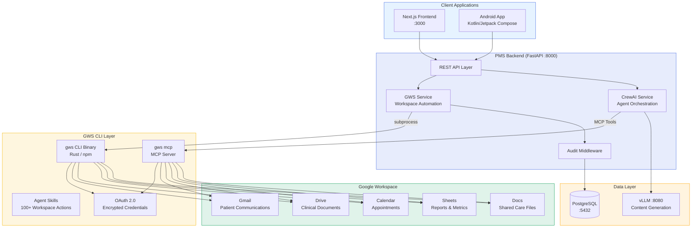

# Product Requirements Document: Google Workspace CLI (GWS CLI) Integration into Patient Management System (PMS)

**Document ID:** PRD-PMS-GWSCLI-001
**Version:** 1.0
**Date:** 2026-03-09
**Author:** Ammar (CEO, MPS Inc.)
**Status:** Draft

---

## 1. Executive Summary

Google Workspace CLI (`gws`) is an open-source, Apache 2.0-licensed command-line tool written in Rust that provides a unified interface for all Google Workspace APIs — Drive, Gmail, Calendar, Sheets, Docs, Chat, Admin, and more. With 17,300+ GitHub stars in its first week (March 2026), it dynamically builds its entire command surface from Google's Discovery Service, meaning it automatically picks up new Workspace API endpoints without CLI updates. It outputs structured JSON by default, ships with 100+ AI agent skills, and includes a built-in MCP server (`gws mcp`) that exposes Workspace APIs as tools for AI agents — including Claude, OpenClaw, and Gemini.

Integrating GWS CLI into PMS enables **automated clinical-administrative workflows** that bridge the gap between clinical data (stored in PMS/PostgreSQL) and organizational productivity tools (Google Workspace). Specific use cases: auto-generating post-encounter follow-up letters as Google Docs from SOAP notes, syncing appointment schedules between PMS and Google Calendar, uploading clinical reports to Drive with folder-based access control, sending HIPAA-compliant patient communications through Gmail, and populating Sheets-based analytics dashboards from PMS reporting data. These workflows currently require manual copy-paste between PMS and Google Workspace — GWS CLI eliminates that with scriptable, auditable automation.

The CLI's MCP server mode is particularly valuable: by running `gws mcp`, PMS's existing CrewAI agents (Exp 55) can directly read calendars, draft emails, and update spreadsheets as part of multi-agent clinical workflows — without writing any Google API integration code. Combined with vLLM-powered inference (Exp 52) for PHI-safe content generation and CrewAI for orchestration, GWS CLI becomes the **productivity bridge** connecting PMS clinical intelligence to Google Workspace actions.

## 2. Problem Statement

PMS stores all clinical data — patient records, encounters, medications, notes — but clinicians and staff constantly context-switch to Google Workspace for communication and administrative tasks. Specific gaps:

1. **Manual document generation**: After AI generates a SOAP note (Exp 52/55), the clinician must manually copy it into a Google Doc for the patient's shared care file, then share it with referring physicians. This takes 5-10 minutes per encounter.

2. **Calendar disconnection**: PMS scheduling and Google Calendar are separate systems. Staff double-enter appointments, leading to missed follow-ups, double-bookings, and wasted time reconciling the two calendars.

3. **Report distribution**: Monthly quality reports, provider productivity metrics, and compliance summaries must be manually exported from PMS, formatted in Sheets, and shared via Drive. This consumes 2-3 hours per reporting cycle.

4. **Patient communication overhead**: Post-visit instructions, appointment reminders, and referral letters are generated in PMS but must be manually copied to Gmail for sending. No audit trail links the PMS-generated content to the sent email.

5. **No agent-to-Workspace bridge**: CrewAI agents (Exp 55) can generate clinical documents but cannot take action in Google Workspace — they can't create a Doc, send an email, or schedule a follow-up. The "last mile" of clinical workflow automation is missing.

## 3. Proposed Solution

### 3.1 Architecture Overview

### 3.2 Deployment Model

- **CLI binary in backend container**: Install `gws` via npm (`npm install -g @googleworkspace/cli`) in the `pms-backend` Docker image. Called via Python `subprocess` from FastAPI services.
- **MCP server for agents**: Run `gws mcp` as a sidecar process or within the backend container. CrewAI agents connect via MCP protocol to execute Workspace actions.
- **OAuth credential management**: OAuth credentials stored encrypted at rest (AES-256-GCM) in `~/.config/gws/` with OS keyring integration. For Docker/CI, credentials exported via `gws auth export` and mounted as secrets.
- **HIPAA boundary enforcement**: GWS CLI only receives **de-identified or approved content** from the PHI Sanitizer. Raw PHI never passes through GWS CLI to Google Workspace. All content routed through GWS CLI is audited in PostgreSQL before transmission.
- **Scope minimization**: OAuth login with explicit scope selection (`gws auth login -s drive,gmail,calendar,sheets`) — only the APIs needed for PMS workflows.

## 4. PMS Data Sources

| PMS API | How GWS CLI Uses It | Direction |
|---------|-------------------|-----------|
| Patient Records (`/api/patients`) | Patient demographics for personalizing communications and scheduling context | PMS → GWS CLI (read) |
| Encounter Records (`/api/encounters`) | Generated SOAP notes exported as Google Docs; encounter dates sync to Calendar | PMS → GWS CLI (read) |
| Medication & Prescription (`/api/prescriptions`) | Medication summaries included in patient care documents on Drive | PMS → GWS CLI (read) |
| Reporting (`/api/reports`) | Quality metrics and provider stats pushed to Sheets dashboards | PMS → GWS CLI (write) |
| Audit Log (`/api/audit`) | Every GWS CLI action logged: service, method, target, timestamp, user | GWS CLI → PG (write) |

## 5. Component/Module Definitions

### 5.1 GWS Service (`pms-backend/src/pms/services/gws_service.py`)

Python wrapper around the `gws` CLI binary. Executes commands via `subprocess`, parses JSON output, and handles error cases. All PMS modules call this service — never `gws` directly.

- **Input**: Service name, resource, method, parameters (JSON)
- **Output**: Parsed JSON response from Google Workspace API
- **PMS APIs used**: None directly — called by other services and CrewAI agents

### 5.2 Document Export Module

Creates Google Docs from PMS-generated clinical content (SOAP notes, referral letters, PA letters).

- **Input**: Document title, content (from vLLM/CrewAI), target Drive folder ID, sharing permissions
- **Output**: Google Docs URL, document ID
- **PMS APIs used**: `/api/encounters` (note content), `/api/patients` (patient context)

### 5.3 Calendar Sync Module

Two-way sync between PMS appointments and Google Calendar.

- **Input**: PMS appointment data (patient ID, provider, datetime, duration, type)
- **Output**: Calendar event ID, sync status
- **PMS APIs used**: `/api/encounters` (appointment scheduling)

### 5.4 Report Distribution Module

Pushes PMS analytics data to Google Sheets and shares via Drive.

- **Input**: Report type, date range, data (from `/api/reports`)
- **Output**: Sheets URL, sharing confirmation
- **PMS APIs used**: `/api/reports`

### 5.5 Patient Communication Module

Drafts and sends patient communications through Gmail with audit trail.

- **Input**: Recipient email, subject, body (from vLLM/CrewAI), attachment references
- **Output**: Gmail message ID, send confirmation
- **PMS APIs used**: `/api/patients` (email address), `/api/encounters` (communication context)

### 5.6 GWS MCP Bridge (`gws mcp` sidecar)

Exposes Workspace APIs as MCP tools for CrewAI agents (Exp 55). Agents call `gws mcp` tools to create docs, send emails, and update calendars as part of multi-agent workflows.

- **Input**: MCP tool calls from CrewAI agents
- **Output**: Workspace API responses as structured JSON
- **PMS APIs used**: Indirect — agents access PMS data through existing PMS tools, then push results via GWS MCP tools

## 6. Non-Functional Requirements

### 6.1 Security and HIPAA Compliance

| Requirement | Implementation |
|-------------|----------------|
| PHI never sent uncontrolled | PHI Sanitizer reviews all content before GWS CLI transmission; only approved, de-identified content reaches Google Workspace |
| Google Workspace BAA | Organization must sign Google Workspace BAA covering Gmail, Drive, Calendar, Docs |
| OAuth scope minimization | Only request scopes for services in use: `drive`, `gmail.send`, `calendar`, `sheets` |
| Credential encryption | OAuth tokens encrypted at rest (AES-256-GCM) via OS keyring; Docker uses mounted secrets |
| Audit logging | Every GWS CLI invocation logged: user, service, method, target resource, timestamp, success/failure |
| Email encryption | Gmail configured for TLS transport; sensitive attachments encrypted before upload to Drive |
| Access control | RBAC in FastAPI determines which users/roles can trigger which GWS CLI workflows |
| Data residency | Google Workspace data regions configured per BAA requirements |
| Scope of BAA | **Critical**: Third-party apps using OAuth (like GWS CLI) are NOT automatically covered by Google's BAA. Compliance team must verify coverage |

### 6.2 Performance

| Metric | Target | Notes |
|--------|--------|-------|
| Doc creation latency | < 3 seconds | CLI → Drive → Docs |
| Email send latency | < 2 seconds | CLI → Gmail |
| Calendar event creation | < 1 second | CLI → Calendar |
| Sheets data push (100 rows) | < 5 seconds | CLI → Sheets |
| MCP tool call round-trip | < 2 seconds | Agent → gws mcp → Workspace |
| Concurrent CLI invocations | 10+ | Backend async subprocess pool |

### 6.3 Infrastructure

| Resource | Minimum | Recommended |
|----------|---------|-------------|
| Node.js | 18+ | 20 LTS |
| gws CLI | Latest | Pin to specific release |
| Additional disk | 50 MB | 100 MB (CLI + credentials) |
| Google Workspace | Business Starter+ | Business Plus (for BAA eligibility) |
| Google Cloud Project | 1 (for OAuth) | 1 (with API quotas configured) |
| Network | HTTPS outbound to googleapis.com | Same |

## 7. Implementation Phases

### Phase 1: Foundation (2 sprints)
- Install `gws` CLI in PMS backend Docker image
- Set up Google Cloud project with OAuth credentials
- Create `GWSService` Python wrapper for subprocess execution
- Implement audit logging for all CLI invocations
- Build Document Export Module: SOAP note → Google Doc
- Integration tests with test Workspace account
- HIPAA review: BAA coverage for GWS CLI usage

### Phase 2: Core Workflows (3 sprints)
- Calendar Sync Module: PMS appointments ↔ Google Calendar
- Patient Communication Module: AI-drafted emails via Gmail
- Report Distribution Module: PMS metrics → Google Sheets
- PHI Sanitizer integration: review content before CLI transmission
- Frontend: "Export to Docs" / "Send via Gmail" / "Sync Calendar" buttons
- RBAC: role-based access to GWS CLI features

### Phase 3: Agent Integration (2 sprints)
- Set up `gws mcp` sidecar for CrewAI agent access
- CrewAI agents (Exp 55) use MCP tools to create docs, send emails, update calendars
- End-of-encounter Flow: generate note → create Doc → send follow-up email → schedule follow-up → update Sheets dashboard — all automated
- Batch Flow: nightly quality report generation → Sheets → shared Drive folder
- Analytics: GWS CLI usage metrics dashboard

## 8. Success Metrics

| Metric | Target | Measurement |
|--------|--------|-------------|
| Document export time | 90% reduction (manual copy → one-click) | Time from note approval to shared Google Doc |
| Calendar sync accuracy | > 99% | PMS appointments matched to Calendar events |
| Report distribution time | 80% reduction | Time from data query to shared Sheets report |
| Staff context switches | 50% fewer | Workspace actions triggered from PMS (not manual) |
| Audit trail completeness | 100% | Every GWS CLI action logged with user + timestamp |
| Agent-to-Workspace actions | > 50 daily | CrewAI agents executing GWS MCP tool calls |
| PHI incident rate | Zero | No unapproved PHI transmitted via GWS CLI |

## 9. Risks and Mitigations

| Risk | Impact | Mitigation |
|------|--------|------------|
| PHI leakage to Google Workspace | HIPAA violation | PHI Sanitizer gate; audit logging; content review before CLI transmission |
| Google Workspace BAA scope | Third-party OAuth apps may not be covered | Compliance team verifies BAA coverage; consider Google Workspace Marketplace listing |
| GWS CLI "not officially supported" | Breaking changes, abandonment | Pin CLI version; abstract behind GWSService; monitor GitHub for deprecation signals |
| OAuth credential compromise | Unauthorized Workspace access | Encrypted storage (AES-256-GCM); credential rotation; least-privilege scopes |
| API rate limiting | Failed Workspace operations at scale | Exponential backoff; request queuing; Google Cloud project quota management |
| Unverified OAuth app scope limit (~25) | Cannot access all needed APIs | Apply for Google OAuth app verification; or use workspace-internal OAuth client |
| Network dependency | GWS CLI requires internet for googleapis.com | Graceful degradation; queue operations for retry; alert on connectivity loss |
| CLI version instability | Breaking changes before v1.0 | Pin version in Docker; test upgrades in staging; maintain changelog monitoring |

## 10. Dependencies

| Dependency | Version | Purpose |
|------------|---------|---------|
| gws CLI | Latest (pre-v1.0) | Google Workspace command-line interface |
| Node.js | 18+ | Runtime for npm-installed gws binary |
| Google Cloud Project | N/A | OAuth client credentials and API enablement |
| Google Workspace | Business Plus+ | BAA-eligible plan for HIPAA compliance |
| Python subprocess | stdlib | CLI invocation from FastAPI |
| CrewAI | 1.x (Exp 55) | Agent orchestration with MCP tool access |
| vLLM | 0.17.0 (Exp 52) | Content generation for documents and communications |
| PHI Sanitizer | Existing | De-identification gate before CLI transmission |

## 11. Comparison with Existing Experiments

| Experiment | Relationship to GWS CLI |
|------------|------------------------|
| **Exp 55: CrewAI** (multi-agent orchestration) | **Upstream** — CrewAI agents generate clinical content; GWS CLI executes the Workspace actions (create doc, send email). GWS MCP tools extend agent capabilities into Google Workspace |
| **Exp 52: vLLM** (self-hosted LLM inference) | **Upstream** — vLLM generates SOAP notes, letters, and reports; GWS CLI distributes them via Docs, Gmail, and Sheets |
| **Exp 05: OpenClaw** (agentic workflows) | **Complementary** — OpenClaw was an early Workspace integration point; GWS CLI provides a more mature, Google-maintained alternative with MCP support |
| **Exp 51: Amazon Connect Health** (contact center) | **Complementary** — Connect Health handles voice interactions; GWS CLI handles post-call document and email workflows |
| **Exp 47: Availity** (eligibility/prior auth) | **Complementary** — Availity handles payer submissions; GWS CLI can email PA letter copies to referring physicians via Gmail |
| **Exp 63: A2A** (agent-to-agent protocol) | **Complementary** — A2A enables inter-agent communication; GWS MCP enables agent-to-Workspace communication |

GWS CLI is the **productivity automation layer** that connects PMS clinical intelligence (Exp 52/55) to the Google Workspace tools that staff and providers use daily.

### Comparison with Alternatives

| Tool | Purpose | Advantage over GWS CLI | GWS CLI Advantage |
|------|---------|----------------------|-------------------|
| **Google APIs Python Client** | Direct API access | More Pythonic, no subprocess | GWS CLI: 0 code for new APIs (auto-discovery), MCP server, agent skills |
| **gcloud CLI** | Google Cloud infrastructure | Cloud-focused, mature | GWS CLI: Workspace-focused, structured JSON, agent-optimized |
| **Microsoft Graph CLI** | Microsoft 365 automation | N/A (deprecated Aug 2026) | GWS CLI actively maintained, Apache 2.0, MCP support |
| **Zapier / Make** | No-code workflow automation | Visual UI, pre-built triggers | GWS CLI: scriptable, auditable, embeddable in backend, no SaaS dependency |
| **google-workspace-mcp** (community) | MCP server for Workspace | Read-only, simpler | GWS CLI: official Google repo, read/write, 100+ skills, CLI + MCP modes |

**Decision: GWS CLI** — Best combination of auto-discovery (no code updates for new APIs), MCP server for agents, 100+ agent skills, official Google repository, structured JSON output, and Apache 2.0 license. The Python Google APIs client remains available as a fallback for complex operations.

## 12. Research Sources

**Official Documentation & Source:**
- [Google Workspace CLI GitHub](https://github.com/googleworkspace/cli) — Source code, 17.3K stars, installation, OAuth setup, agent skills
- [@googleworkspace/cli npm](https://www.npmjs.com/package/@googleworkspace/cli) — npm package, installation instructions
- [GWS CLI Releases](https://github.com/googleworkspace/cli/releases) — Version history and pre-built binaries

**Architecture & Features:**
- [Google Workspace CLI for AI Agents (Geeky Gadgets)](https://www.geeky-gadgets.com/google-workspace-cli/) — Feature overview, agent skills, MCP server details
- [Google Workspace CLI Brings Gmail, Docs, Sheets Into Common Interface (VentureBeat)](https://venturebeat.com/orchestration/google-workspace-cli-brings-gmail-docs-sheets-and-more-into-a-common) — Architecture, MCP integration, agentic AI applications
- [Google Shipped a CLI for All of Workspace (Medium)](https://medium.com/coding-nexus/google-just-shipped-a-cli-for-all-of-google-workspace-and-it-works-with-ai-agents-too-204fe2bbd2f6) — Detailed walkthrough, command syntax, use cases

**Security & HIPAA:**
- [HIPAA Compliance with Google Workspace (Google Support)](https://support.google.com/a/answer/3407054?hl=en) — BAA requirements, supported services, configuration
- [Google Workspace HIPAA Compliance Guide (AccountableHQ)](https://www.accountablehq.com/post/google-workspace-hipaa-compliance-how-to-sign-a-baa-and-configure-security-step-by-step-guide) — Step-by-step BAA and security configuration
- [HIPAA Compliance on Google Cloud](https://cloud.google.com/security/compliance/hipaa-compliance) — Cloud-level compliance, covered products

**Integration Patterns:**
- [GWS CLI AI Agent Automation Guide (Digital Applied)](https://www.digitalapplied.com/blog/google-workspace-cli-gws-ai-agent-automation-guide) — Python subprocess integration, automation scripts
- [OpenClaw + Google Workspace CLI (OnMSFT)](https://onmsft.com/news/openclaw-can-now-connect-with-gmail-drive-and-docs-using-googles-new-cli/) — Agent framework integration patterns

## 13. Appendix: Related Documents

- [GWS CLI Setup Guide](64-GWSCLI-PMS-Developer-Setup-Guide.md)
- [GWS CLI Developer Tutorial](64-GWSCLI-Developer-Tutorial.md)
- [CrewAI PRD (Exp 55)](55-PRD-CrewAI-PMS-Integration.md)
- [vLLM PRD (Exp 52)](52-PRD-vLLM-PMS-Integration.md)
- [A2A PRD (Exp 63)](63-PRD-A2A-PMS-Integration.md)
