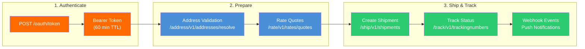
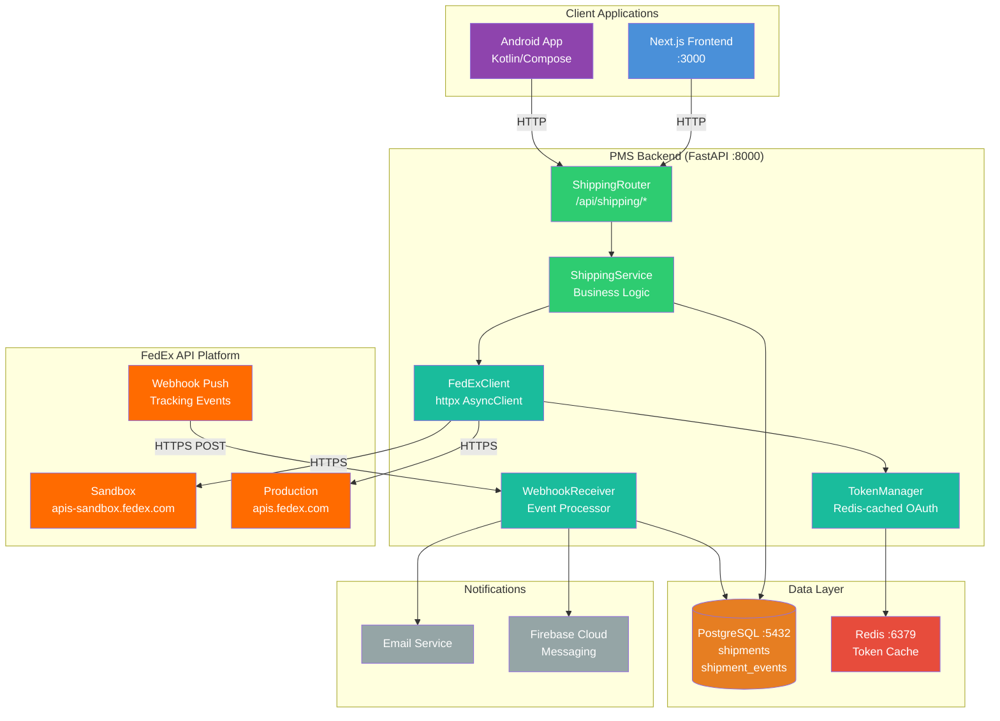

# FedEx API Developer Onboarding Tutorial

**Welcome to the MPS PMS FedEx API Integration Team**

This tutorial will take you from zero to building your first FedEx API integration with the PMS. By the end, you will understand how the FedEx REST API works, have a running local environment connected to the FedEx sandbox, and have built and tested a prescription shipment workflow end-to-end.

**Document ID:** PMS-EXP-FEDEXAPI-002
**Version:** 1.0
**Date:** 2026-03-10
**Applies To:** PMS project (all platforms)
**Prerequisite:** [FedEx API Setup Guide](65-FedExAPI-PMS-Developer-Setup-Guide.md)
**Estimated time:** 2-3 hours
**Difficulty:** Beginner-friendly

---

## What You Will Learn

1. How the FedEx REST API authenticates requests using OAuth 2.0 client credentials
2. How to validate patient shipping addresses before creating a shipment
3. How to compare FedEx service rates and transit times programmatically
4. How to create a shipment and generate a shipping label via the Ship API
5. How to track a shipment in real-time using the Track API
6. How FedEx webhook events enable push-based delivery notifications
7. How to store shipment records in PostgreSQL linked to patient records
8. How to build a prescription shipment workflow in the PMS (FastAPI + Next.js)
9. When to use FedEx directly vs. a multi-carrier aggregator
10. HIPAA security requirements for shipping patient medications and lab specimens

## Part 1: Understanding FedEx API (15 min read)

### 1.1 What Problem Does FedEx API Solve?

In a retina ophthalmology practice, clinical staff ship prescriptions (anti-VEGF medications like Eylea), lab specimens (blood draws, biopsy tissue), and medical devices to patients and reference labs daily. Without API integration, each shipment requires:

1. A staff member logs into fedex.com
2. Manually types the patient's shipping address
3. Selects a service level and generates a label
4. Copies the tracking number into a spreadsheet or the patient's chart
5. Checks fedex.com periodically for delivery status
6. Calls the patient to confirm delivery

This takes **5-10 minutes per shipment** and introduces errors (wrong address, tracking number not recorded, no delivery confirmation). The FedEx API eliminates these manual steps by embedding the entire shipment lifecycle into the PMS — the system validates the address, compares rates, creates the shipment, generates the label, tracks delivery, and notifies the patient automatically.

### 1.2 How FedEx API Works — The Key Pieces



**Stage 1 — Authenticate**: Your application exchanges a Client ID and Secret Key for a bearer token (valid 60 minutes). All subsequent API calls include this token in the `Authorization` header.

**Stage 2 — Prepare**: Before shipping, validate the recipient address (catches typos, adds ZIP+4) and fetch rate quotes to compare services (FedEx Overnight vs. 2Day vs. Ground) with transit times and costs.

**Stage 3 — Ship & Track**: Create the shipment (generates a tracking number and shipping label), then monitor delivery via polling (Track API) or push notifications (webhooks).

### 1.3 How FedEx API Fits with Other PMS Technologies

| Technology | Experiment | Relationship to FedEx API |
|------------|------------|---------------------------|
| Availity API | Exp 47 | Availity verifies insurance coverage → FedEx ships the covered medication |
| FHIR Prior Auth | Exp 48 | PA is approved via FHIR → FedEx ships the authorized treatment |
| WebSocket | Exp 37 | WebSocket pushes real-time tracking updates to the frontend |
| Kafka | Exp 38 | Kafka event stream ingests FedEx webhook events for async processing |
| Docker | Exp 39 | FedEx client runs inside the Dockerized FastAPI container |
| PostgreSQL | Core | Shipment records stored with patient linkage and audit trail |
| Redis | Core | OAuth token caching with TTL-based refresh |

### 1.4 Key Vocabulary

| Term | Meaning |
|------|---------|
| **Bearer Token** | OAuth 2.0 access token (60 min TTL) included in all API request headers |
| **Client ID / API Key** | Public identifier for your FedEx developer project |
| **Secret Key** | Private credential for OAuth token generation (never expose client-side) |
| **Tracking Number** | Unique FedEx-assigned identifier for a shipment (e.g., `794644790138`) |
| **Service Type** | FedEx shipping service code: `FEDEX_OVERNIGHT`, `FEDEX_2_DAY`, `FEDEX_GROUND`, etc. |
| **Ship API** | Creates a shipment, generates label, returns tracking number |
| **Rate API** | Returns rate quotes and transit times for available services |
| **Track API** | Returns current shipment status and scan history |
| **Address Validation** | Resolves and corrects shipping addresses (adds ZIP+4, fixes city/state mismatches) |
| **Webhook** | FedEx pushes tracking event updates to your HTTPS endpoint (vs. you polling) |
| **Clinical Pak** | FedEx packaging for exempt clinical and environmental test samples |
| **Conduit** | HIPAA designation for entities that transport but don't store PHI (FedEx's classification) |

### 1.5 Our Architecture



Key architectural principles:
- **Server-side only**: FedEx credentials never leave the FastAPI backend
- **Token caching**: Redis stores the OAuth token with a 55-minute TTL (5-minute safety margin)
- **Audit trail**: Every shipment action is logged in PostgreSQL with user ID, patient ID, and timestamp
- **PHI minimization**: Shipping labels contain only name and address — no diagnosis or prescription details

## Part 2: Environment Verification (15 min)

### 2.1 Checklist

Complete these checks in order:

1. **PMS backend is running**:
   ```bash
   curl -s http://localhost:8000/api/health | jq .status
   # Expected: "ok"
   ```

2. **PostgreSQL has shipment tables**:
   ```bash
   psql -h localhost -p 5432 -U pms_user -d pms \
     -c "\dt shipments" -c "\dt shipment_events"
   # Expected: Two tables listed
   ```

3. **Redis is running**:
   ```bash
   redis-cli ping
   # Expected: PONG
   ```

4. **FedEx environment variables are set**:
   ```bash
   echo "Base URL: $FEDEX_BASE_URL"
   echo "Client ID: ${FEDEX_CLIENT_ID:0:8}..."
   echo "Secret: ${FEDEX_CLIENT_SECRET:0:4}****"
   # Expected: Non-empty values for all three
   ```

5. **FedEx sandbox is reachable**:
   ```bash
   curl -s -o /dev/null -w "%{http_code}" \
     -X POST "https://apis-sandbox.fedex.com/oauth/token" \
     -H "Content-Type: application/x-www-form-urlencoded" \
     -d "grant_type=client_credentials&client_id=${FEDEX_CLIENT_ID}&client_secret=${FEDEX_CLIENT_SECRET}"
   # Expected: 200
   ```

6. **Shipping API endpoints are registered**:
   ```bash
   curl -s http://localhost:8000/openapi.json | jq '.paths | keys[] | select(startswith("/api/shipping"))'
   # Expected: List of /api/shipping/* paths
   ```

### 2.2 Quick Test

Run a single end-to-end address validation to confirm the full chain works:

```bash
curl -s -X POST "http://localhost:8000/api/shipping/validate-address" \
  -H "Content-Type: application/json" \
  -d '{
    "street": ["10 FedEx Pkwy"],
    "city": "Collierville",
    "state": "TN",
    "postalCode": "38017"
  }' | jq .
```

If this returns a resolved address response, your environment is ready.

## Part 3: Build Your First Integration (45 min)

### 3.1 What We Are Building

We will build a **Prescription Shipment Workflow** — the most common shipping use case in the PMS. When a physician writes a prescription and the pharmacy marks it "ready to ship", the system:

1. Validates the patient's shipping address
2. Gets rate quotes for available FedEx services
3. Creates a shipment with label generation
4. Stores the shipment record linked to the patient and prescription
5. Returns the tracking number and label for printing

### 3.2 Step 1: Define the Pydantic Models

Create `backend/app/shipping/models.py`:

```python
from pydantic import BaseModel, Field
from uuid import UUID
from datetime import date, datetime
from typing import Optional
from enum import Enum

class ShipmentType(str, Enum):
    PRESCRIPTION = "PRESCRIPTION"
    LAB_SPECIMEN = "LAB_SPECIMEN"
    MEDICAL_DEVICE = "MEDICAL_DEVICE"

class TemperatureRequirement(str, Enum):
    AMBIENT = "AMBIENT"
    REFRIGERATED = "REFRIGERATED"
    FROZEN = "FROZEN"

class AddressValidationRequest(BaseModel):
    street: list[str] = Field(..., min_length=1, max_length=3)
    city: str
    state: str = Field(..., min_length=2, max_length=2)
    postal_code: str = Field(..., alias="postalCode")
    country: str = "US"

class AddressValidationResponse(BaseModel):
    resolved: bool
    street: list[str]
    city: str
    state: str
    postal_code: str
    country: str
    residential: bool | None = None

class RateQuoteRequest(BaseModel):
    recipient_address: AddressValidationRequest = Field(..., alias="recipientAddress")
    weight_lb: float = Field(..., gt=0, alias="weightLb")
    service_type: str | None = Field(None, alias="serviceType")

class RateQuote(BaseModel):
    service_type: str
    service_name: str
    total_charge: float
    currency: str = "USD"
    transit_days: int
    delivery_date: str

class RateQuoteResponse(BaseModel):
    rates: list[RateQuote]

class CreateShipmentRequest(BaseModel):
    patient_id: UUID = Field(..., alias="patientId")
    prescription_id: UUID | None = Field(None, alias="prescriptionId")
    encounter_id: UUID | None = Field(None, alias="encounterId")
    shipment_type: ShipmentType = Field(..., alias="shipmentType")
    service_type: str = Field(..., alias="serviceType")
    package_weight_lb: float = Field(..., gt=0, alias="packageWeightLb")
    temperature_requirement: TemperatureRequirement | None = Field(
        None, alias="temperatureRequirement"
    )

class ShipmentResponse(BaseModel):
    id: UUID
    tracking_number: str
    status: str
    service_type: str
    shipment_type: str
    ship_date: date | None
    estimated_delivery_date: date | None
    recipient_name: str
    shipping_cost_cents: int | None
    label_url: str | None = None

class TrackingEvent(BaseModel):
    event_type: str
    timestamp: datetime
    location: str | None
    description: str

class TrackingResponse(BaseModel):
    tracking_number: str
    current_status: str
    events: list[TrackingEvent]
```

### 3.3 Step 2: Implement the Shipping Service

Create `backend/app/shipping/service.py`:

```python
import base64
from uuid import UUID
from datetime import date
from sqlalchemy.ext.asyncio import AsyncSession
from sqlalchemy import select

from .client import FedExClient
from .models import (
    AddressValidationRequest, AddressValidationResponse,
    RateQuoteRequest, RateQuoteResponse, RateQuote,
    CreateShipmentRequest, ShipmentResponse,
    TrackingResponse, TrackingEvent,
)
from app.models.shipment import Shipment, ShipmentEvent
from app.models.patient import Patient

class ShippingService:
    """Orchestrates shipment workflows between PMS and FedEx API."""

    def __init__(self, db: AsyncSession, fedex: FedExClient):
        self.db = db
        self.fedex = fedex

    async def validate_address(self, req: AddressValidationRequest) -> AddressValidationResponse:
        result = await self.fedex.validate_address(
            street=req.street,
            city=req.city,
            state=req.state,
            postal_code=req.postal_code,
            country=req.country,
        )

        resolved = result.get("output", {}).get("resolvedAddresses", [{}])[0]
        return AddressValidationResponse(
            resolved=True,
            street=resolved.get("streetLinesToken", req.street),
            city=resolved.get("city", req.city),
            state=resolved.get("stateOrProvinceCode", req.state),
            postal_code=resolved.get("postalCode", req.postal_code),
            country=resolved.get("countryCode", req.country),
            residential=resolved.get("classification") == "RESIDENTIAL",
        )

    async def get_rates(self, req: RateQuoteRequest) -> RateQuoteResponse:
        # Use clinic's default address as shipper
        shipper = {
            "streetLines": ["1234 Clinic Blvd"],
            "city": "Dallas",
            "stateOrProvinceCode": "TX",
            "postalCode": "75201",
            "countryCode": "US",
        }
        recipient = {
            "streetLines": req.recipient_address.street,
            "city": req.recipient_address.city,
            "stateOrProvinceCode": req.recipient_address.state,
            "postalCode": req.recipient_address.postal_code,
            "countryCode": req.recipient_address.country,
        }

        result = await self.fedex.get_rates(
            shipper=shipper,
            recipient=recipient,
            package_weight_lb=req.weight_lb,
            service_type=req.service_type,
        )

        quotes = []
        for detail in result.get("output", {}).get("rateReplyDetails", []):
            charge = detail.get("ratedShipmentDetails", [{}])[0]
            total = charge.get("totalNetCharge", 0)
            quotes.append(RateQuote(
                service_type=detail.get("serviceType", ""),
                service_name=detail.get("serviceName", ""),
                total_charge=float(total),
                transit_days=detail.get("commit", {}).get("transitDays", {}).get("days", 0),
                delivery_date=detail.get("commit", {}).get("dateDetail", {}).get("dayFormat", ""),
            ))

        return RateQuoteResponse(rates=quotes)

    async def create_shipment(self, req: CreateShipmentRequest,
                               current_user_id: UUID) -> ShipmentResponse:
        # Fetch patient address
        patient = await self.db.get(Patient, req.patient_id)
        if not patient:
            raise ValueError(f"Patient {req.patient_id} not found")

        shipper = {
            "contact": {"personName": "MPS Clinic", "phoneNumber": "2145551234"},
            "address": {
                "streetLines": ["1234 Clinic Blvd"],
                "city": "Dallas",
                "stateOrProvinceCode": "TX",
                "postalCode": "75201",
                "countryCode": "US",
            },
        }

        recipient = {
            "contact": {
                "personName": f"{patient.first_name} {patient.last_name}",
                "phoneNumber": patient.phone,
            },
            "address": {
                "streetLines": [patient.address_line1, patient.address_line2 or ""],
                "city": patient.city,
                "stateOrProvinceCode": patient.state,
                "postalCode": patient.zip_code,
                "countryCode": "US",
            },
        }

        # Create shipment via FedEx API
        result = await self.fedex.create_shipment(
            shipper=shipper,
            recipient=recipient,
            package_weight_lb=req.package_weight_lb,
            service_type=req.service_type,
        )

        # Extract tracking number and label
        tx = result.get("output", {}).get("transactionShipments", [{}])[0]
        piece = tx.get("pieceResponses", [{}])[0]
        tracking_number = piece.get("trackingNumber", "")

        label_b64 = ""
        for doc in piece.get("packageDocuments", []):
            if doc.get("contentType") == "LABEL":
                label_b64 = doc.get("encodedLabel", "")
                break

        label_data = base64.b64decode(label_b64) if label_b64 else None

        # Store in database
        shipment = Shipment(
            patient_id=req.patient_id,
            prescription_id=req.prescription_id,
            encounter_id=req.encounter_id,
            tracking_number=tracking_number,
            service_type=req.service_type,
            shipment_type=req.shipment_type.value,
            status="LABEL_CREATED",
            ship_date=date.today(),
            label_data=label_data,
            temperature_requirement=(
                req.temperature_requirement.value if req.temperature_requirement else None
            ),
            recipient_name=f"{patient.first_name} {patient.last_name}",
            recipient_address=f"{patient.address_line1}, {patient.city}, {patient.state} {patient.zip_code}",
            created_by=current_user_id,
        )
        self.db.add(shipment)
        await self.db.commit()
        await self.db.refresh(shipment)

        return ShipmentResponse(
            id=shipment.id,
            tracking_number=shipment.tracking_number,
            status=shipment.status,
            service_type=shipment.service_type,
            shipment_type=shipment.shipment_type,
            ship_date=shipment.ship_date,
            estimated_delivery_date=shipment.estimated_delivery_date,
            recipient_name=shipment.recipient_name,
            shipping_cost_cents=shipment.shipping_cost_cents,
        )

    async def track_shipment(self, shipment_id: UUID) -> TrackingResponse:
        shipment = await self.db.get(Shipment, shipment_id)
        if not shipment:
            raise ValueError(f"Shipment {shipment_id} not found")

        result = await self.fedex.track_shipment(shipment.tracking_number)

        track_results = (
            result.get("output", {})
            .get("completeTrackResults", [{}])[0]
            .get("trackResults", [{}])[0]
        )

        events = []
        for scan in track_results.get("scanEvents", []):
            events.append(TrackingEvent(
                event_type=scan.get("eventType", ""),
                timestamp=scan.get("date", ""),
                location=(
                    f"{scan.get('scanLocation', {}).get('city', '')}, "
                    f"{scan.get('scanLocation', {}).get('stateOrProvinceCode', '')}"
                ),
                description=scan.get("eventDescription", ""),
            ))

        return TrackingResponse(
            tracking_number=shipment.tracking_number,
            current_status=track_results.get("latestStatusDetail", {}).get("description", ""),
            events=events,
        )
```

### 3.4 Step 3: Implement the Webhook Receiver

Create `backend/app/shipping/webhook.py`:

```python
from fastapi import APIRouter, Request, HTTPException
from sqlalchemy.ext.asyncio import AsyncSession
from sqlalchemy import select
from datetime import datetime

from app.models.shipment import Shipment, ShipmentEvent

webhook_router = APIRouter(prefix="/api/shipping/webhooks", tags=["shipping-webhooks"])

@webhook_router.post("/fedex")
async def receive_fedex_webhook(request: Request, db: AsyncSession):
    """Receive and process FedEx tracking webhook events."""
    payload = await request.json()

    tracking_number = (
        payload.get("trackingNumberInfo", {}).get("trackingNumber")
    )
    if not tracking_number:
        raise HTTPException(status_code=400, detail="Missing tracking number")

    # Find the shipment
    stmt = select(Shipment).where(Shipment.tracking_number == tracking_number)
    result = await db.execute(stmt)
    shipment = result.scalar_one_or_none()

    if not shipment:
        return {"status": "ignored", "reason": "unknown tracking number"}

    # Store the event
    event = ShipmentEvent(
        shipment_id=shipment.id,
        event_type=payload.get("eventType", "UNKNOWN"),
        event_timestamp=datetime.fromisoformat(
            payload.get("eventTimestamp", datetime.utcnow().isoformat())
        ),
        location=payload.get("location", ""),
        description=payload.get("eventDescription", ""),
    )
    db.add(event)

    # Update shipment status
    status_map = {
        "PICKED_UP": "IN_TRANSIT",
        "IN_TRANSIT": "IN_TRANSIT",
        "OUT_FOR_DELIVERY": "OUT_FOR_DELIVERY",
        "DELIVERED": "DELIVERED",
        "DELIVERY_EXCEPTION": "EXCEPTION",
    }
    new_status = status_map.get(payload.get("eventType"), shipment.status)
    shipment.status = new_status

    if new_status == "DELIVERED":
        shipment.actual_delivery_date = datetime.utcnow().date()

    await db.commit()

    # TODO: Send patient notification (email + FCM push)

    return {"status": "processed", "shipment_id": str(shipment.id)}
```

### 3.5 Step 4: Test the Complete Workflow

Run the following sequence to test the full prescription shipment workflow:

**Step 4a: Validate the patient's address**

```bash
curl -s -X POST "http://localhost:8000/api/shipping/validate-address" \
  -H "Content-Type: application/json" \
  -d '{
    "street": ["456 Oak Avenue"],
    "city": "Dallas",
    "state": "TX",
    "postalCode": "75201"
  }' | jq .
```

**Step 4b: Get rate quotes**

```bash
curl -s -X POST "http://localhost:8000/api/shipping/rates" \
  -H "Content-Type: application/json" \
  -d '{
    "recipientAddress": {
      "street": ["456 Oak Avenue"],
      "city": "Dallas",
      "state": "TX",
      "postalCode": "75201"
    },
    "weightLb": 1.5
  }' | jq '.rates[] | {serviceType, serviceName, totalCharge, transitDays}'
```

**Step 4c: Create the shipment**

```bash
curl -s -X POST "http://localhost:8000/api/shipping/shipments" \
  -H "Content-Type: application/json" \
  -d '{
    "patientId": "00000000-0000-0000-0000-000000000001",
    "prescriptionId": "00000000-0000-0000-0000-000000000010",
    "shipmentType": "PRESCRIPTION",
    "serviceType": "FEDEX_2_DAY",
    "packageWeightLb": 1.5,
    "temperatureRequirement": "REFRIGERATED"
  }' | jq .
```

**Step 4d: Track the shipment**

```bash
# Replace SHIPMENT_ID with the id from the previous response
curl -s "http://localhost:8000/api/shipping/shipments/SHIPMENT_ID/track" | jq .
```

**Step 4e: Verify database records**

```bash
psql -h localhost -p 5432 -U pms_user -d pms \
  -c "SELECT tracking_number, status, shipment_type, temperature_requirement, created_at FROM shipments ORDER BY created_at DESC LIMIT 1;"
```

### 3.6 Step 5: Verify in the Frontend

1. Open `http://localhost:3000` in your browser
2. Navigate to a patient's detail page
3. Open the Prescriptions tab and find a prescription marked "ready to ship"
4. Click "Ship" to open the `CreateShipmentForm` component
5. Select shipment type, enter weight, and click "Validate Address & Get Rates"
6. Select a FedEx service from the rate quotes
7. Click "Create Shipment & Generate Label"
8. Confirm the success message shows with a tracking number
9. Navigate to the shipment's detail view to see the `TrackingTimeline` component

## Part 4: Evaluating Strengths and Weaknesses (15 min)

### 4.1 Strengths

- **Healthcare-specific services**: FedEx's dedicated healthcare division provides Clinical Pak packaging, temperature-controlled shipping, dry ice replenishment, and Surround monitoring — purpose-built for pharmaceutical and specimen transport
- **Comprehensive API coverage**: Ship, Rate, Track, Address Validation, Pickup, Webhook — the full shipment lifecycle is API-accessible
- **OAuth 2.0 security**: Modern authentication with short-lived tokens (60 min) and TLS 1.2+ requirement
- **Free API access**: No per-API-call charges — you only pay for actual postage
- **Webhook support**: Push-based tracking events eliminate polling overhead
- **Global coverage**: International shipping with customs documentation APIs

### 4.2 Weaknesses

- **No official SDK**: FedEx does not maintain Python, JavaScript, or Kotlin SDKs. You must build your own HTTP client wrapper.
- **Sandbox limitations**: The virtualized sandbox returns predefined responses — not dynamic based on your input. Edge cases are difficult to test before production.
- **Undocumented rate limits**: FedEx does not publicly disclose specific rate limit thresholds. You learn them by hitting them.
- **Production validation required**: Moving from sandbox to production requires submitting an Integrator Validation Cover Sheet and waiting for FedEx review — can delay go-live timelines.
- **Cold chain telemetry locked behind enterprise contract**: SenseAware/Surround real-time temperature data requires a separate enterprise agreement with FedEx; it is not available via the self-serve API.
- **SameDay City retired**: FedEx shut down SameDay City in March 2023. No API-accessible same-day local delivery.

### 4.3 When to Use FedEx API vs Alternatives

| Scenario | Recommendation |
|----------|----------------|
| Single carrier, negotiated FedEx rates | **FedEx API direct** — no middleman, full feature access |
| Need cold chain / Clinical Pak | **FedEx API direct** — healthcare-specific features |
| Multi-carrier flexibility needed | **EasyPost or ShipEngine** — unified API for FedEx + UPS + USPS |
| Minimizing PHI third-party exposure | **FedEx API direct** — one fewer vendor handling shipment data |
| Rapid development, don't want to build HTTP client | **EasyPost or ShipEngine** — official SDKs with FedEx support |
| Same-day local medical courier | **Onfleet or Bringg** — FedEx has no same-day API |

### 4.4 HIPAA / Healthcare Considerations

| Area | Requirement |
|------|-------------|
| **FedEx HIPAA classification** | FedEx is a **conduit** — transports but doesn't store PHI. Legal review recommended for API-layer BAA. |
| **Label PHI minimization** | Only include patient name + delivery address on labels. No Dx, Rx details, or insurance info. |
| **Database encryption** | Encrypt `shipments` and `shipment_events` tables linking tracking numbers to patient IDs (AES-256 at rest). |
| **Credential management** | Store `FEDEX_CLIENT_ID` and `FEDEX_CLIENT_SECRET` in Docker secrets or environment variables — never in source code. |
| **Audit logging** | Log every shipment API call: user_id, patient_id (internal ref), action, timestamp, tracking_number. |
| **Access control** | Only `shipping_clerk`, `pharmacist`, `physician`, and `admin` roles can create shipments. |
| **Webhook endpoint** | HTTPS-only, TLS 1.2+, IP allowlisting for FedEx source IPs. |
| **Tamper-evident packaging** | Use opaque, tamper-evident packaging for all PHI-adjacent shipments (specimens, medications). |

## Part 5: Debugging Common Issues (15 min read)

### Issue 1: Token Expired Mid-Request

**Symptom**: API call returns `401 Unauthorized` after the token was valid earlier.

**Cause**: OAuth tokens expire after 60 minutes. If your Redis TTL is not set correctly, you may use an expired token.

**Fix**: Ensure the `TokenManager` sets TTL to `expires_in - 300` (55 minutes). Add a retry mechanism in `FedExClient._request()`:
```python
if response.status_code == 401:
    # Force token refresh and retry once
    await self.token_manager._refresh_token()
    # Retry the request...
```

### Issue 2: Address Validation Returns "UNDETERMINED"

**Symptom**: Address validation returns `classification: "UNDETERMINED"` or `"UNKNOWN"`.

**Cause**: The address doesn't match FedEx's reference data, or the sandbox returned a generic response.

**Fix**: Check for common issues — missing apartment number, misspelled city, wrong ZIP. In sandbox, test with FedEx's known test addresses. In production, present the "UNDETERMINED" result to the user and ask them to confirm.

### Issue 3: Rate Quote Returns No Results

**Symptom**: `rateReplyDetails` array is empty.

**Cause**: Origin-destination pair doesn't have available services (e.g., international without customs), or weight exceeds service limits.

**Fix**: Check `alerts` in the response for specific error messages. Verify the shipper address is a valid FedEx origin. Ensure weight is within FedEx service limits (150 lbs for Ground, 68 kg for Express international).

### Issue 4: Label Generation Fails with "PACKAGE.WEIGHT.INVALID"

**Symptom**: Ship API returns error code `PACKAGE.WEIGHT.INVALID`.

**Cause**: Weight value is 0, negative, or exceeds the service type's maximum.

**Fix**: Validate weight > 0 before calling the API. Check service-specific weight limits:
- FedEx Express: up to 150 lbs
- FedEx Ground: up to 150 lbs
- FedEx Freight: 150+ lbs (use Freight LTL API instead)

### Issue 5: Webhook Endpoint Returns 403

**Symptom**: FedEx reports webhook delivery failures; your endpoint logs no incoming requests.

**Cause**: FedEx webhook delivery requires a publicly accessible HTTPS endpoint with a valid TLS certificate.

**Fix**:
1. For local development, use `ngrok http 8000` and register the ngrok HTTPS URL
2. For production, ensure your load balancer/reverse proxy passes the POST body through to FastAPI
3. Check that your TLS certificate is from a recognized CA (not self-signed)
4. Verify no firewall rules block FedEx webhook source IPs

### Reading FedEx API Error Responses

FedEx error responses follow this structure:
```json
{
  "transactionId": "...",
  "errors": [
    {
      "code": "SERVICE.NOT.AVAILABLE.ERROR",
      "message": "The requested service is not available...",
      "parameterList": [{"key": "serviceType", "value": "FEDEX_OVERNIGHT"}]
    }
  ]
}
```

Always log the full `errors` array. The `code` field is machine-readable; the `message` provides human-readable context. The `parameterList` tells you which field caused the error.

## Part 6: Practice Exercise (45 min)

### Option A: Lab Specimen Shipment Workflow

Build a workflow for shipping lab specimens from the clinic to a reference lab:

1. Create a new `ShipmentType.LAB_SPECIMEN` shipment with the reference lab as the recipient (not a patient)
2. Use `FEDEX_PRIORITY_OVERNIGHT` as the default service type
3. Require `temperature_requirement` to be set for all lab specimen shipments
4. Store the encounter ID to link the specimen to the clinical encounter
5. When the webhook reports "DELIVERED", trigger a notification to the ordering physician

**Hints**:
- The recipient address is the lab, not the patient — you'll need a `labs` table or config for lab addresses
- FedEx Clinical Pak packaging is specified via `packagingType: "FEDEX_PAK"` in the Ship API
- Add a `lab_received_at` timestamp to the `shipments` table

### Option B: Shipping Analytics Dashboard

Build a reporting page that shows shipping metrics:

1. Query the `shipments` table for aggregated data:
   - Total shipments by type (PRESCRIPTION, LAB_SPECIMEN, MEDICAL_DEVICE)
   - Average transit time (ship_date to actual_delivery_date)
   - Delivery success rate (DELIVERED vs EXCEPTION)
   - Total shipping cost by month
2. Create a Next.js page at `/shipping/analytics` with chart components
3. Add a FastAPI endpoint `GET /api/shipping/analytics` that returns the aggregated data

**Hints**:
- Use PostgreSQL `DATE_TRUNC('month', ship_date)` for monthly grouping
- Calculate transit days as `actual_delivery_date - ship_date`
- Use a simple bar chart library (e.g., recharts) for the frontend

### Option C: Batch Shipment Processing

Build a batch processing feature for creating multiple shipments at once (e.g., all prescriptions marked "ready to ship" today):

1. Create a `POST /api/shipping/batch` endpoint accepting a list of patient/prescription IDs
2. Validate all addresses first, returning any that fail validation
3. Create shipments for all valid addresses using a queue (avoid rate limit issues)
4. Return a summary: successful, failed, and pending shipments
5. Add a "Ship All Ready" button to the prescription management page

**Hints**:
- Use `asyncio.gather()` with a semaphore to limit concurrent FedEx API calls
- Store batch results in a `shipping_batches` table
- Show a progress indicator in the frontend

## Part 7: Development Workflow and Conventions

### 7.1 File Organization

```
backend/app/shipping/
├── __init__.py
├── client.py           # FedExClient — async HTTP wrapper
├── token_manager.py    # OAuth 2.0 token lifecycle
├── models.py           # Pydantic request/response models
├── service.py          # ShippingService — business logic
├── router.py           # FastAPI router — /api/shipping/*
├── webhook.py          # WebhookReceiver — /api/shipping/webhooks/*
└── tests/
    ├── test_client.py
    ├── test_service.py
    ├── test_router.py
    └── test_webhook.py

frontend/src/
├── lib/
│   └── shipping-api.ts         # API client for shipping endpoints
└── components/shipping/
    ├── CreateShipmentForm.tsx   # Shipment creation wizard
    ├── TrackingTimeline.tsx     # Tracking event timeline
    ├── ShipmentList.tsx         # Patient shipment history
    └── RateQuoteCard.tsx        # Service rate comparison card
```

### 7.2 Naming Conventions

| Item | Convention | Example |
|------|-----------|---------|
| Python module | `snake_case` | `token_manager.py` |
| Python class | `PascalCase` | `FedExClient`, `ShippingService` |
| Python function | `snake_case` | `create_shipment`, `validate_address` |
| FastAPI endpoint | `snake_case` with hyphens in URL | `POST /api/shipping/validate-address` |
| Pydantic model | `PascalCase` | `CreateShipmentRequest`, `ShipmentResponse` |
| TypeScript file | `kebab-case` | `shipping-api.ts` |
| React component | `PascalCase` | `CreateShipmentForm.tsx` |
| Database table | `snake_case` plural | `shipments`, `shipment_events` |
| Database column | `snake_case` | `tracking_number`, `patient_id` |
| Environment variable | `SCREAMING_SNAKE_CASE` | `FEDEX_CLIENT_ID` |
| FedEx service type | `SCREAMING_SNAKE_CASE` (FedEx convention) | `FEDEX_OVERNIGHT`, `FEDEX_2_DAY` |

### 7.3 PR Checklist

- [ ] FedEx API credentials are in environment variables (not hardcoded)
- [ ] No PHI appears in shipping labels beyond name + address
- [ ] All shipment actions are audit-logged (user_id, patient_id, timestamp)
- [ ] FedEx API errors are caught and returned as meaningful PMS error responses
- [ ] Token refresh handles 401 errors gracefully
- [ ] Database migration included for any schema changes
- [ ] Unit tests mock FedEx API responses (never call real API in tests)
- [ ] Integration tests use sandbox credentials
- [ ] Frontend calls FastAPI backend only (no direct FedEx API calls from browser)

### 7.4 Security Reminders

1. **Never store FedEx credentials in source code** — use environment variables or Docker secrets
2. **Never call FedEx APIs from the frontend** — all requests must proxy through FastAPI
3. **Minimize PHI on labels** — name and address only, never diagnosis or prescription details
4. **Encrypt shipment records** — the `shipments` table links tracking numbers to patient IDs
5. **Validate webhook payloads** — verify FedEx webhook source IPs and payload structure before processing
6. **Log all shipping actions** — who created the shipment, for which patient, at what time
7. **Rate-limit the webhook endpoint** — prevent abuse from spoofed webhook calls

## Part 8: Quick Reference Card

### Key Commands

```bash
# Get FedEx OAuth token
curl -s -X POST "https://apis-sandbox.fedex.com/oauth/token" \
  -H "Content-Type: application/x-www-form-urlencoded" \
  -d "grant_type=client_credentials&client_id=${FEDEX_CLIENT_ID}&client_secret=${FEDEX_CLIENT_SECRET}" \
  | jq .access_token -r

# Validate address via PMS
curl -s -X POST "http://localhost:8000/api/shipping/validate-address" \
  -H "Content-Type: application/json" \
  -d '{"street":["123 Main St"],"city":"Memphis","state":"TN","postalCode":"38101"}'

# Get rates via PMS
curl -s -X POST "http://localhost:8000/api/shipping/rates" \
  -H "Content-Type: application/json" \
  -d '{"recipientAddress":{"street":["456 Oak Ave"],"city":"Dallas","state":"TX","postalCode":"75201"},"weightLb":2.0}'

# Create shipment via PMS
curl -s -X POST "http://localhost:8000/api/shipping/shipments" \
  -H "Content-Type: application/json" \
  -d '{"patientId":"UUID","shipmentType":"PRESCRIPTION","serviceType":"FEDEX_2_DAY","packageWeightLb":1.5}'

# Check recent shipments
psql -h localhost -p 5432 -U pms_user -d pms \
  -c "SELECT tracking_number, status, shipment_type FROM shipments ORDER BY created_at DESC LIMIT 5;"
```

### Key Files

| File | Purpose |
|------|---------|
| `backend/app/shipping/client.py` | FedEx API HTTP client |
| `backend/app/shipping/token_manager.py` | OAuth token lifecycle |
| `backend/app/shipping/service.py` | Shipping business logic |
| `backend/app/shipping/router.py` | FastAPI endpoints |
| `backend/app/shipping/webhook.py` | Webhook event processor |
| `backend/app/shipping/models.py` | Pydantic models |
| `frontend/src/lib/shipping-api.ts` | Frontend API client |
| `frontend/src/components/shipping/` | React shipping components |

### Key URLs

| Resource | URL |
|----------|-----|
| FedEx Developer Portal | [https://developer.fedex.com](https://developer.fedex.com/api/en-us/home.html) |
| FedEx Sandbox | `https://apis-sandbox.fedex.com` |
| FedEx Production | `https://apis.fedex.com` |
| PMS Shipping API | `http://localhost:8000/api/shipping/` |
| PMS API Docs | `http://localhost:8000/docs#/shipping` |

### Starter Template: New Shipping Endpoint

```python
from fastapi import APIRouter, Depends
from .service import ShippingService

router = APIRouter(prefix="/api/shipping", tags=["shipping"])

@router.post("/your-new-endpoint")
async def your_endpoint(
    request: YourRequestModel,
    service: ShippingService = Depends(),
):
    """Description of what this endpoint does."""
    # 1. Validate input
    # 2. Call FedEx API via service
    # 3. Store results in PostgreSQL
    # 4. Return response
    return await service.your_method(request)
```

## Next Steps

1. Complete one of the [practice exercises](#part-6-practice-exercise-45-min) above
2. Set up FedEx webhook testing with [ngrok](https://ngrok.com/) for local development
3. Review the [FedEx API Best Practices Guide](https://developer.fedex.com/api/en-us/guides/best-practices.html)
4. Read the [PRD](65-PRD-FedExAPI-PMS-Integration.md) for the full integration roadmap
5. Explore the [Availity API (Exp 47)](47-PRD-AvailityAPI-PMS-Integration.md) and [FHIR Prior Auth (Exp 48)](48-PRD-FHIRPriorAuth-PMS-Integration.md) experiments to understand the upstream workflow that triggers shipments
