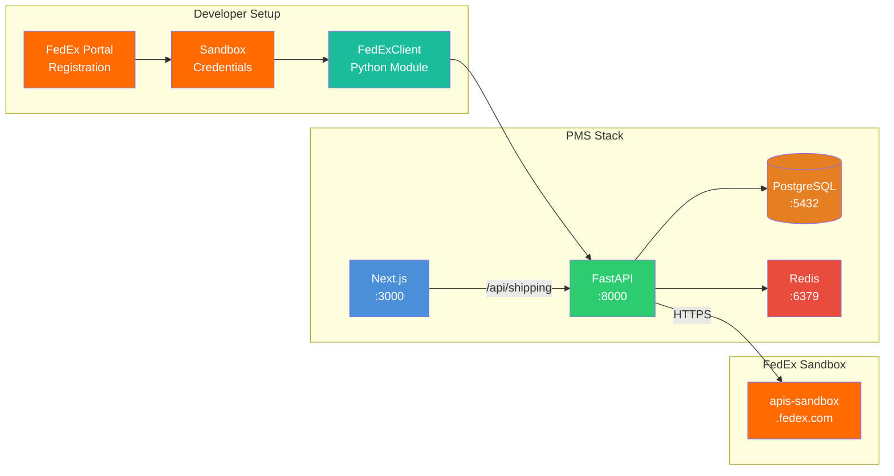

# FedEx API Setup Guide for PMS Integration

**Document ID:** PMS-EXP-FEDEXAPI-001
**Version:** 1.0
**Date:** 2026-03-10
**Applies To:** PMS project (all platforms)
**Prerequisites Level:** Intermediate

---

## Table of Contents

1. [Overview](#1-overview)
2. [Prerequisites](#2-prerequisites)
3. [Part A: FedEx Developer Portal Setup](#3-part-a-fedex-developer-portal-setup)
4. [Part B: Integrate with PMS Backend](#4-part-b-integrate-with-pms-backend)
5. [Part C: Integrate with PMS Frontend](#5-part-c-integrate-with-pms-frontend)
6. [Part D: Testing and Verification](#6-part-d-testing-and-verification)
7. [Troubleshooting](#7-troubleshooting)
8. [Reference Commands](#8-reference-commands)

---

## 1. Overview

This guide walks you through integrating the FedEx REST API with the PMS backend (FastAPI), frontend (Next.js), and database (PostgreSQL). By the end, you will have:

- A registered FedEx Developer Portal account with sandbox credentials
- A `FedExClient` Python module with OAuth token management
- Database tables for shipment tracking and event logging
- FastAPI endpoints for address validation, rate quoting, shipment creation, and tracking
- Next.js components for the shipping workflow UI
- End-to-end verification in the FedEx sandbox environment



## 2. Prerequisites

### 2.1 Required Software

| Software | Minimum Version | Check Command |
|----------|-----------------|---------------|
| Python | 3.11+ | `python --version` |
| Node.js | 18+ | `node --version` |
| PostgreSQL | 15+ | `psql --version` |
| Redis | 7+ | `redis-cli --version` |
| Docker & Docker Compose | 24+ / 2.20+ | `docker --version && docker compose version` |
| httpx (Python) | 0.27+ | `pip show httpx` |
| Git | 2.40+ | `git --version` |

### 2.2 Installation of Prerequisites

Install `httpx` (async HTTP client) and `pydantic` (data validation) if not already present:

```bash
pip install "httpx[http2]>=0.27" "pydantic>=2.5"
```

For label image handling (optional — for rendering label PNGs):

```bash
pip install Pillow>=10.0
```

### 2.3 Verify PMS Services

Confirm the PMS backend, frontend, and database are running:

```bash
# Check FastAPI backend
curl -s http://localhost:8000/api/health | jq .
# Expected: {"status": "ok", ...}

# Check Next.js frontend
curl -s -o /dev/null -w "%{http_code}" http://localhost:3000
# Expected: 200

# Check PostgreSQL
psql -h localhost -p 5432 -U pms_user -d pms -c "SELECT 1;"
# Expected: 1

# Check Redis
redis-cli -h localhost -p 6379 ping
# Expected: PONG
```

**Checkpoint**: All four PMS services respond successfully.

## 3. Part A: FedEx Developer Portal Setup

### Step 1: Create a FedEx Developer Account

1. Navigate to [https://developer.fedex.com/api/en-us/home.html](https://developer.fedex.com/api/en-us/home.html)
2. Click **Sign Up** in the top right
3. Select **FedEx Account Holder** if you have a FedEx shipping account, or **I want to test without an account** for sandbox-only access
4. Complete the registration form (company name: "MPS Inc.", email, password)
5. Verify your email address

### Step 2: Create a Project and Get Sandbox Credentials

1. Log into the developer portal
2. Navigate to **My Projects** → **Create a Project**
3. Enter project details:
   - **Project Name**: `PMS-Shipping-Integration`
   - **Description**: `Patient Management System shipping module`
4. Select the APIs to enable:
   - Authorization API
   - Ship API
   - Rate and Transit Times API
   - Track API
   - Address Validation API
   - Pickup Request API
5. Click **Create**
6. Navigate to the **Test Key** tab of your project
7. Copy the **API Key** (Client ID) and **Secret Key** (Client Secret)

### Step 3: Configure Environment Variables

Create or update your `.env` file (never commit this file):

```bash
# FedEx API Configuration
FEDEX_BASE_URL=https://apis-sandbox.fedex.com
FEDEX_CLIENT_ID=your_sandbox_api_key_here
FEDEX_CLIENT_SECRET=your_sandbox_secret_key_here
FEDEX_ACCOUNT_NUMBER=your_fedex_account_number  # Optional for sandbox
```

For Docker Compose, add to your `docker-compose.yml` environment section:

```yaml
services:
  backend:
    environment:
      - FEDEX_BASE_URL=${FEDEX_BASE_URL}
      - FEDEX_CLIENT_ID=${FEDEX_CLIENT_ID}
      - FEDEX_CLIENT_SECRET=${FEDEX_CLIENT_SECRET}
      - FEDEX_ACCOUNT_NUMBER=${FEDEX_ACCOUNT_NUMBER}
```

### Step 4: Verify Sandbox Connectivity

Test OAuth token retrieval:

```bash
curl -s -X POST "https://apis-sandbox.fedex.com/oauth/token" \
  -H "Content-Type: application/x-www-form-urlencoded" \
  -d "grant_type=client_credentials&client_id=${FEDEX_CLIENT_ID}&client_secret=${FEDEX_CLIENT_SECRET}" \
  | jq .
```

Expected response:

```json
{
  "access_token": "eyJ0eXAiOiJKV1QiLCJhbGciOi...",
  "token_type": "bearer",
  "expires_in": 3600,
  "scope": "CXS"
}
```

**Checkpoint**: You have a FedEx Developer Portal account, a project with sandbox credentials, environment variables configured, and a successful OAuth token response.

## 4. Part B: Integrate with PMS Backend

### Step 1: Create the FedEx Client Module

Create the directory structure:

```bash
mkdir -p backend/app/shipping
touch backend/app/shipping/__init__.py
touch backend/app/shipping/client.py
touch backend/app/shipping/token_manager.py
touch backend/app/shipping/models.py
touch backend/app/shipping/service.py
touch backend/app/shipping/router.py
touch backend/app/shipping/webhook.py
```

### Step 2: Implement the Token Manager

`backend/app/shipping/token_manager.py`:

```python
import time
import httpx
from typing import Optional

class FedExTokenManager:
    """Manages OAuth 2.0 token lifecycle with Redis caching."""

    REDIS_KEY = "fedex:oauth_token"
    TOKEN_SAFETY_MARGIN = 300  # Refresh 5 min before expiry

    def __init__(self, base_url: str, client_id: str, client_secret: str, redis_client):
        self.base_url = base_url
        self.client_id = client_id
        self.client_secret = client_secret
        self.redis = redis_client

    async def get_token(self) -> str:
        """Return a valid bearer token, refreshing if needed."""
        cached = await self.redis.get(self.REDIS_KEY)
        if cached:
            return cached.decode()
        return await self._refresh_token()

    async def _refresh_token(self) -> str:
        """Request a new OAuth token from FedEx."""
        async with httpx.AsyncClient() as client:
            response = await client.post(
                f"{self.base_url}/oauth/token",
                data={
                    "grant_type": "client_credentials",
                    "client_id": self.client_id,
                    "client_secret": self.client_secret,
                },
                headers={"Content-Type": "application/x-www-form-urlencoded"},
            )
            response.raise_for_status()
            data = response.json()

        token = data["access_token"]
        expires_in = data["expires_in"]
        ttl = max(expires_in - self.TOKEN_SAFETY_MARGIN, 60)

        await self.redis.setex(self.REDIS_KEY, ttl, token)
        return token
```

### Step 3: Implement the FedEx Client

`backend/app/shipping/client.py`:

```python
import httpx
from typing import Any
from .token_manager import FedExTokenManager

class FedExClient:
    """Async HTTP client for FedEx REST APIs."""

    def __init__(self, base_url: str, token_manager: FedExTokenManager,
                 account_number: str | None = None):
        self.base_url = base_url
        self.token_manager = token_manager
        self.account_number = account_number

    async def _request(self, method: str, path: str, json: dict | None = None) -> dict:
        """Make an authenticated request to FedEx API."""
        token = await self.token_manager.get_token()
        async with httpx.AsyncClient(timeout=30.0) as client:
            response = await client.request(
                method,
                f"{self.base_url}{path}",
                json=json,
                headers={
                    "Authorization": f"Bearer {token}",
                    "Content-Type": "application/json",
                    "X-locale": "en_US",
                },
            )
            response.raise_for_status()
            return response.json()

    async def validate_address(self, street: list[str], city: str,
                                state: str, postal_code: str,
                                country: str = "US") -> dict:
        """Validate and correct a shipping address."""
        payload = {
            "addressesToValidate": [{
                "address": {
                    "streetLines": street,
                    "city": city,
                    "stateOrProvinceCode": state,
                    "postalCode": postal_code,
                    "countryCode": country,
                }
            }]
        }
        return await self._request("POST", "/address/v1/addresses/resolve", json=payload)

    async def get_rates(self, shipper: dict, recipient: dict,
                        package_weight_lb: float,
                        service_type: str | None = None) -> dict:
        """Get shipping rate quotes."""
        payload = {
            "accountNumber": {"value": self.account_number},
            "rateRequestControlParameters": {"returnTransitTimes": True},
            "requestedShipment": {
                "shipper": {"address": shipper},
                "recipient": {"address": recipient},
                "pickupType": "DROPOFF_AT_FEDEX_LOCATION",
                "requestedPackageLineItems": [{
                    "weight": {"units": "LB", "value": package_weight_lb}
                }],
            },
        }
        if service_type:
            payload["requestedShipment"]["serviceType"] = service_type
        return await self._request("POST", "/rate/v1/rates/quotes", json=payload)

    async def create_shipment(self, shipper: dict, recipient: dict,
                               package_weight_lb: float,
                               service_type: str,
                               label_format: str = "PDF") -> dict:
        """Create a shipment and generate a label."""
        payload = {
            "accountNumber": {"value": self.account_number},
            "labelResponseOptions": "LABEL",
            "requestedShipment": {
                "shipper": shipper,
                "recipients": [recipient],
                "pickupType": "DROPOFF_AT_FEDEX_LOCATION",
                "serviceType": service_type,
                "packagingType": "YOUR_PACKAGING",
                "shippingChargesPayment": {
                    "paymentType": "SENDER",
                    "payor": {
                        "responsibleParty": {
                            "accountNumber": {"value": self.account_number}
                        }
                    },
                },
                "labelSpecification": {
                    "labelFormatType": "COMMON2D",
                    "imageType": label_format,
                    "labelStockType": "PAPER_4X6",
                },
                "requestedPackageLineItems": [{
                    "weight": {"units": "LB", "value": package_weight_lb}
                }],
            },
        }
        return await self._request("POST", "/ship/v1/shipments", json=payload)

    async def track_shipment(self, tracking_number: str) -> dict:
        """Get real-time tracking status."""
        payload = {
            "trackingInfo": [{
                "trackingNumberInfo": {
                    "trackingNumber": tracking_number
                }
            }],
            "includeDetailedScans": True,
        }
        return await self._request("POST", "/track/v1/trackingnumbers", json=payload)

    async def schedule_pickup(self, address: dict, pickup_date: str,
                               ready_time: str, close_time: str,
                               package_count: int = 1) -> dict:
        """Schedule a FedEx pickup."""
        payload = {
            "associatedAccountNumber": {"value": self.account_number},
            "originDetail": {
                "pickupAddressDetail": {"address": address},
                "readyDateTimestamp": f"{pickup_date}T{ready_time}:00",
                "customerCloseTime": close_time,
            },
            "totalWeight": {"units": "LB", "value": 5.0},
            "packageCount": package_count,
            "carrierCode": "FDXE",
        }
        return await self._request("POST", "/pickup/v1/pickups", json=payload)
```

### Step 4: Create Database Tables

Create a migration file `backend/alembic/versions/xxxx_add_shipments_tables.py`:

```python
"""Add shipments and shipment_events tables."""

from alembic import op
import sqlalchemy as sa
from sqlalchemy.dialects.postgresql import UUID

def upgrade():
    op.create_table(
        "shipments",
        sa.Column("id", UUID(as_uuid=True), primary_key=True,
                  server_default=sa.text("gen_random_uuid()")),
        sa.Column("patient_id", UUID(as_uuid=True),
                  sa.ForeignKey("patients.id"), nullable=False, index=True),
        sa.Column("prescription_id", UUID(as_uuid=True),
                  sa.ForeignKey("prescriptions.id"), nullable=True),
        sa.Column("encounter_id", UUID(as_uuid=True),
                  sa.ForeignKey("encounters.id"), nullable=True),
        sa.Column("tracking_number", sa.String(30), unique=True, index=True),
        sa.Column("service_type", sa.String(50), nullable=False),
        sa.Column("shipment_type", sa.String(50), nullable=False),  # PRESCRIPTION, LAB_SPECIMEN, MEDICAL_DEVICE
        sa.Column("status", sa.String(50), nullable=False, server_default="CREATED"),
        sa.Column("ship_date", sa.Date),
        sa.Column("estimated_delivery_date", sa.Date),
        sa.Column("actual_delivery_date", sa.Date),
        sa.Column("label_data", sa.LargeBinary),  # Encrypted label PDF
        sa.Column("temperature_requirement", sa.String(20)),  # AMBIENT, REFRIGERATED, FROZEN
        sa.Column("recipient_name", sa.String(255), nullable=False),
        sa.Column("recipient_address", sa.Text, nullable=False),
        sa.Column("shipping_cost_cents", sa.Integer),
        sa.Column("created_by", UUID(as_uuid=True),
                  sa.ForeignKey("users.id"), nullable=False),
        sa.Column("created_at", sa.DateTime(timezone=True),
                  server_default=sa.text("NOW()")),
        sa.Column("updated_at", sa.DateTime(timezone=True),
                  server_default=sa.text("NOW()")),
    )

    op.create_table(
        "shipment_events",
        sa.Column("id", UUID(as_uuid=True), primary_key=True,
                  server_default=sa.text("gen_random_uuid()")),
        sa.Column("shipment_id", UUID(as_uuid=True),
                  sa.ForeignKey("shipments.id"), nullable=False, index=True),
        sa.Column("event_type", sa.String(100), nullable=False),
        sa.Column("event_timestamp", sa.DateTime(timezone=True), nullable=False),
        sa.Column("location", sa.String(255)),
        sa.Column("description", sa.Text),
        sa.Column("received_at", sa.DateTime(timezone=True),
                  server_default=sa.text("NOW()")),
    )

def downgrade():
    op.drop_table("shipment_events")
    op.drop_table("shipments")
```

Run the migration:

```bash
cd backend
alembic upgrade head
```

### Step 5: Create the FastAPI Router

`backend/app/shipping/router.py`:

```python
from fastapi import APIRouter, Depends, HTTPException
from uuid import UUID
from .models import (
    AddressValidationRequest, AddressValidationResponse,
    RateQuoteRequest, RateQuoteResponse,
    CreateShipmentRequest, ShipmentResponse,
    TrackingResponse,
)
from .service import ShippingService

router = APIRouter(prefix="/api/shipping", tags=["shipping"])

@router.post("/validate-address", response_model=AddressValidationResponse)
async def validate_address(
    request: AddressValidationRequest,
    service: ShippingService = Depends(),
):
    """Validate and correct a shipping address before creating a shipment."""
    return await service.validate_address(request)

@router.post("/rates", response_model=RateQuoteResponse)
async def get_rates(
    request: RateQuoteRequest,
    service: ShippingService = Depends(),
):
    """Get rate quotes for available FedEx services."""
    return await service.get_rates(request)

@router.post("/shipments", response_model=ShipmentResponse)
async def create_shipment(
    request: CreateShipmentRequest,
    service: ShippingService = Depends(),
):
    """Create a shipment, generate label, and store tracking info."""
    return await service.create_shipment(request)

@router.get("/shipments/{shipment_id}/track", response_model=TrackingResponse)
async def track_shipment(
    shipment_id: UUID,
    service: ShippingService = Depends(),
):
    """Get real-time tracking status for a shipment."""
    return await service.track_shipment(shipment_id)

@router.get("/patients/{patient_id}/shipments", response_model=list[ShipmentResponse])
async def list_patient_shipments(
    patient_id: UUID,
    service: ShippingService = Depends(),
):
    """List all shipments for a patient."""
    return await service.list_patient_shipments(patient_id)
```

### Step 6: Mount the Router

In your main FastAPI app (`backend/app/main.py`), add:

```python
from app.shipping.router import router as shipping_router

app.include_router(shipping_router)
```

**Checkpoint**: FastAPI backend has the FedEx client module, database migration, and API router. The shipping endpoints are accessible at `/api/shipping/*`.

## 5. Part C: Integrate with PMS Frontend

### Step 1: Add Environment Variables

In your Next.js `.env.local`:

```bash
# No FedEx-specific env vars needed — all calls go through FastAPI backend
NEXT_PUBLIC_API_BASE_URL=http://localhost:8000
```

### Step 2: Create the Shipping API Client

`frontend/src/lib/shipping-api.ts`:

```typescript
import { apiClient } from './api-client';

export interface AddressValidationRequest {
  street: string[];
  city: string;
  state: string;
  postalCode: string;
  country?: string;
}

export interface RateQuote {
  serviceType: string;
  serviceName: string;
  totalCharge: number;
  currency: string;
  transitDays: number;
  deliveryDate: string;
}

export interface CreateShipmentRequest {
  patientId: string;
  prescriptionId?: string;
  encounterId?: string;
  shipmentType: 'PRESCRIPTION' | 'LAB_SPECIMEN' | 'MEDICAL_DEVICE';
  serviceType: string;
  packageWeightLb: number;
  temperatureRequirement?: 'AMBIENT' | 'REFRIGERATED' | 'FROZEN';
}

export interface Shipment {
  id: string;
  trackingNumber: string;
  status: string;
  serviceType: string;
  shipmentType: string;
  shipDate: string;
  estimatedDeliveryDate: string;
  recipientName: string;
  shippingCostCents: number;
}

export const shippingApi = {
  validateAddress: (data: AddressValidationRequest) =>
    apiClient.post('/api/shipping/validate-address', data),

  getRates: (data: { shipperId: string; recipientAddress: AddressValidationRequest; weightLb: number }) =>
    apiClient.post<{ rates: RateQuote[] }>('/api/shipping/rates', data),

  createShipment: (data: CreateShipmentRequest) =>
    apiClient.post<Shipment>('/api/shipping/shipments', data),

  trackShipment: (shipmentId: string) =>
    apiClient.get<{ events: TrackingEvent[] }>(`/api/shipping/shipments/${shipmentId}/track`),

  listPatientShipments: (patientId: string) =>
    apiClient.get<Shipment[]>(`/api/shipping/patients/${patientId}/shipments`),
};
```

### Step 3: Create the Shipment Creation Component

`frontend/src/components/shipping/CreateShipmentForm.tsx`:

```tsx
'use client';

import { useState } from 'react';
import { shippingApi, RateQuote, CreateShipmentRequest } from '@/lib/shipping-api';

interface CreateShipmentFormProps {
  patientId: string;
  prescriptionId?: string;
  encounterId?: string;
  patientAddress: {
    street: string[];
    city: string;
    state: string;
    postalCode: string;
  };
}

export function CreateShipmentForm({
  patientId, prescriptionId, encounterId, patientAddress
}: CreateShipmentFormProps) {
  const [step, setStep] = useState<'validate' | 'rates' | 'confirm' | 'done'>('validate');
  const [rates, setRates] = useState<RateQuote[]>([]);
  const [selectedRate, setSelectedRate] = useState<RateQuote | null>(null);
  const [shipmentType, setShipmentType] = useState<CreateShipmentRequest['shipmentType']>('PRESCRIPTION');
  const [weightLb, setWeightLb] = useState(1.0);
  const [loading, setLoading] = useState(false);

  const handleValidateAddress = async () => {
    setLoading(true);
    try {
      await shippingApi.validateAddress(patientAddress);
      const rateResponse = await shippingApi.getRates({
        shipperId: 'clinic-default',
        recipientAddress: patientAddress,
        weightLb,
      });
      setRates(rateResponse.rates);
      setStep('rates');
    } finally {
      setLoading(false);
    }
  };

  const handleCreateShipment = async () => {
    if (!selectedRate) return;
    setLoading(true);
    try {
      await shippingApi.createShipment({
        patientId,
        prescriptionId,
        encounterId,
        shipmentType,
        serviceType: selectedRate.serviceType,
        packageWeightLb: weightLb,
      });
      setStep('done');
    } finally {
      setLoading(false);
    }
  };

  return (
    <div className="space-y-4 p-4 border rounded-lg">
      <h3 className="text-lg font-semibold">Create Shipment</h3>

      {step === 'validate' && (
        <div className="space-y-3">
          <div>
            <label className="block text-sm font-medium">Shipment Type</label>
            <select value={shipmentType} onChange={(e) => setShipmentType(e.target.value as any)}
                    className="mt-1 block w-full border rounded px-3 py-2">
              <option value="PRESCRIPTION">Prescription</option>
              <option value="LAB_SPECIMEN">Lab Specimen</option>
              <option value="MEDICAL_DEVICE">Medical Device</option>
            </select>
          </div>
          <div>
            <label className="block text-sm font-medium">Weight (lbs)</label>
            <input type="number" value={weightLb} onChange={(e) => setWeightLb(Number(e.target.value))}
                   min={0.1} step={0.1}
                   className="mt-1 block w-full border rounded px-3 py-2" />
          </div>
          <button onClick={handleValidateAddress} disabled={loading}
                  className="bg-blue-600 text-white px-4 py-2 rounded hover:bg-blue-700 disabled:opacity-50">
            {loading ? 'Validating...' : 'Validate Address & Get Rates'}
          </button>
        </div>
      )}

      {step === 'rates' && (
        <div className="space-y-3">
          <p className="text-sm text-gray-600">Select a shipping service:</p>
          {rates.map((rate) => (
            <label key={rate.serviceType}
                   className={`flex items-center justify-between p-3 border rounded cursor-pointer
                              ${selectedRate?.serviceType === rate.serviceType ? 'border-blue-500 bg-blue-50' : ''}`}>
              <div className="flex items-center gap-3">
                <input type="radio" name="rate" checked={selectedRate?.serviceType === rate.serviceType}
                       onChange={() => setSelectedRate(rate)} />
                <div>
                  <div className="font-medium">{rate.serviceName}</div>
                  <div className="text-sm text-gray-500">{rate.transitDays} day(s) — delivers {rate.deliveryDate}</div>
                </div>
              </div>
              <div className="font-semibold">${(rate.totalCharge).toFixed(2)}</div>
            </label>
          ))}
          <button onClick={() => setStep('confirm')} disabled={!selectedRate}
                  className="bg-blue-600 text-white px-4 py-2 rounded hover:bg-blue-700 disabled:opacity-50">
            Continue
          </button>
        </div>
      )}

      {step === 'confirm' && selectedRate && (
        <div className="space-y-3">
          <div className="bg-gray-50 p-3 rounded">
            <p><strong>Service:</strong> {selectedRate.serviceName}</p>
            <p><strong>Cost:</strong> ${selectedRate.totalCharge.toFixed(2)}</p>
            <p><strong>Delivery:</strong> {selectedRate.deliveryDate}</p>
            <p><strong>Type:</strong> {shipmentType}</p>
          </div>
          <button onClick={handleCreateShipment} disabled={loading}
                  className="bg-green-600 text-white px-4 py-2 rounded hover:bg-green-700 disabled:opacity-50">
            {loading ? 'Creating...' : 'Create Shipment & Generate Label'}
          </button>
        </div>
      )}

      {step === 'done' && (
        <div className="bg-green-50 border-green-200 border p-4 rounded">
          <p className="text-green-800 font-medium">Shipment created successfully!</p>
          <p className="text-sm text-green-600">Tracking number has been linked to the patient record.</p>
        </div>
      )}
    </div>
  );
}
```

### Step 4: Create the Tracking Timeline Component

`frontend/src/components/shipping/TrackingTimeline.tsx`:

```tsx
'use client';

import { useEffect, useState } from 'react';
import { shippingApi } from '@/lib/shipping-api';

interface TrackingEvent {
  eventType: string;
  timestamp: string;
  location: string;
  description: string;
}

interface TrackingTimelineProps {
  shipmentId: string;
}

export function TrackingTimeline({ shipmentId }: TrackingTimelineProps) {
  const [events, setEvents] = useState<TrackingEvent[]>([]);
  const [loading, setLoading] = useState(true);

  useEffect(() => {
    shippingApi.trackShipment(shipmentId)
      .then((data) => setEvents(data.events))
      .finally(() => setLoading(false));
  }, [shipmentId]);

  if (loading) return <div className="animate-pulse h-20 bg-gray-100 rounded" />;

  return (
    <div className="space-y-3">
      <h4 className="font-medium">Tracking History</h4>
      <ol className="relative border-l border-gray-300 ml-3">
        {events.map((event, i) => (
          <li key={i} className="mb-4 ml-6">
            <span className={`absolute -left-2 w-4 h-4 rounded-full
              ${i === 0 ? 'bg-blue-500' : 'bg-gray-300'}`} />
            <time className="text-xs text-gray-500">
              {new Date(event.timestamp).toLocaleString()}
            </time>
            <p className="font-medium text-sm">{event.description}</p>
            {event.location && (
              <p className="text-xs text-gray-500">{event.location}</p>
            )}
          </li>
        ))}
      </ol>
    </div>
  );
}
```

**Checkpoint**: Next.js frontend has the shipping API client, shipment creation form, and tracking timeline component. All FedEx API calls route through the FastAPI backend.

## 6. Part D: Testing and Verification

### Test 1: OAuth Token Retrieval

```bash
curl -s -X POST "https://apis-sandbox.fedex.com/oauth/token" \
  -H "Content-Type: application/x-www-form-urlencoded" \
  -d "grant_type=client_credentials&client_id=${FEDEX_CLIENT_ID}&client_secret=${FEDEX_CLIENT_SECRET}" \
  | jq '{token_type, expires_in, scope}'
```

Expected:
```json
{
  "token_type": "bearer",
  "expires_in": 3600,
  "scope": "CXS"
}
```

### Test 2: Address Validation via PMS Backend

```bash
curl -s -X POST "http://localhost:8000/api/shipping/validate-address" \
  -H "Content-Type: application/json" \
  -d '{
    "street": ["123 Main St"],
    "city": "Memphis",
    "state": "TN",
    "postalCode": "38101"
  }' | jq .
```

Expected: A response with resolved address details including any corrections.

### Test 3: Rate Quotes via PMS Backend

```bash
curl -s -X POST "http://localhost:8000/api/shipping/rates" \
  -H "Content-Type: application/json" \
  -d '{
    "recipientAddress": {
      "street": ["456 Oak Ave"],
      "city": "Dallas",
      "state": "TX",
      "postalCode": "75201"
    },
    "weightLb": 2.0
  }' | jq '.rates[] | {serviceType, serviceName, totalCharge, transitDays}'
```

Expected: An array of rate quotes for different FedEx services.

### Test 4: Shipment Creation (Sandbox)

```bash
curl -s -X POST "http://localhost:8000/api/shipping/shipments" \
  -H "Content-Type: application/json" \
  -d '{
    "patientId": "00000000-0000-0000-0000-000000000001",
    "shipmentType": "PRESCRIPTION",
    "serviceType": "FEDEX_GROUND",
    "packageWeightLb": 1.5
  }' | jq '{id, trackingNumber, status, estimatedDeliveryDate}'
```

Expected: A shipment record with a tracking number assigned.

### Test 5: Database Records

```bash
psql -h localhost -p 5432 -U pms_user -d pms -c \
  "SELECT id, tracking_number, status, shipment_type FROM shipments ORDER BY created_at DESC LIMIT 5;"
```

Expected: Recently created shipment records.

### Test 6: Frontend Smoke Test

1. Open `http://localhost:3000` in a browser
2. Navigate to a patient's detail page
3. Look for the "Create Shipment" form (or navigate to the shipping section)
4. Verify the form renders with shipment type, weight, and address fields
5. Submit a test shipment and confirm the success message appears

**Checkpoint**: All six tests pass — OAuth works, address validation returns corrections, rates come back with pricing, shipments are created in sandbox, records persist in PostgreSQL, and the frontend renders the shipping UI.

## 7. Troubleshooting

### OAuth Token Fails with 401

**Symptom**: `{"errors": [{"code": "NOT.AUTHORIZED.ERROR", "message": "..."}]}`

**Solution**:
1. Verify `FEDEX_CLIENT_ID` and `FEDEX_CLIENT_SECRET` match the **Test Key** tab (not Production Key)
2. Confirm you are hitting `apis-sandbox.fedex.com`, not `apis.fedex.com`
3. Ensure `Content-Type` is `application/x-www-form-urlencoded` (not JSON) for the token endpoint
4. Regenerate sandbox credentials in the developer portal if the issue persists

### Address Validation Returns Empty

**Symptom**: Address validation returns no results or a generic response.

**Solution**: The FedEx sandbox uses virtualized (predefined) responses. Some address inputs may not trigger meaningful corrections. Test with known FedEx test addresses from the [sandbox guide](https://developer.fedex.com/api/en-us/guides/sandboxvirtualization.html). In production, responses will be dynamic.

### Rate Quotes Return 400 Bad Request

**Symptom**: `{"errors": [{"code": "RATEINFO.UNEXPECTED.ERROR"}]}`

**Solution**:
1. Ensure `accountNumber.value` is included in the rate request (required even in sandbox)
2. Verify weight is positive and units match (`LB` or `KG`)
3. Check that shipper and recipient addresses include `countryCode`

### Redis Connection Refused

**Symptom**: `ConnectionRefusedError: [Errno 61] Connection refused` when the token manager tries to cache.

**Solution**:
1. Confirm Redis is running: `redis-cli ping` → `PONG`
2. Check the Redis connection URL in your environment variables
3. If using Docker, ensure the backend container can reach the Redis container (same Docker network)

### Label PDF Is Empty or Corrupt

**Symptom**: Downloaded label PDF is blank or cannot be opened.

**Solution**:
1. FedEx returns labels as base64-encoded strings. Ensure you decode with `base64.b64decode()` before storing
2. Verify the `labelSpecification.imageType` matches what you expect (`PDF` or `PNG`)
3. In sandbox, some label responses may be placeholder images — verify with a production test

### Webhook Events Not Arriving

**Symptom**: FedEx webhook endpoint receives no POST requests.

**Solution**:
1. Webhooks require a publicly accessible HTTPS URL — `localhost` will not work
2. Use `ngrok` or a similar tunnel for development: `ngrok http 8000`
3. Register the ngrok URL as your webhook endpoint in the FedEx developer portal
4. Verify TLS certificate is valid (FedEx requires a recognized CA)

## 8. Reference Commands

### Daily Development Workflow

```bash
# Start all PMS services
docker compose up -d

# Run backend with hot reload
cd backend && uvicorn app.main:app --reload --port 8000

# Run frontend with hot reload
cd frontend && npm run dev

# Check FedEx token cache
redis-cli GET fedex:oauth_token

# View recent shipments
psql -h localhost -p 5432 -U pms_user -d pms \
  -c "SELECT tracking_number, status, shipment_type, created_at FROM shipments ORDER BY created_at DESC LIMIT 10;"
```

### FedEx API Management

```bash
# Get a fresh OAuth token
curl -s -X POST "https://apis-sandbox.fedex.com/oauth/token" \
  -H "Content-Type: application/x-www-form-urlencoded" \
  -d "grant_type=client_credentials&client_id=${FEDEX_CLIENT_ID}&client_secret=${FEDEX_CLIENT_SECRET}" \
  | jq .access_token -r

# Validate an address directly against FedEx
curl -s -X POST "https://apis-sandbox.fedex.com/address/v1/addresses/resolve" \
  -H "Authorization: Bearer $(curl -s -X POST 'https://apis-sandbox.fedex.com/oauth/token' \
    -H 'Content-Type: application/x-www-form-urlencoded' \
    -d "grant_type=client_credentials&client_id=${FEDEX_CLIENT_ID}&client_secret=${FEDEX_CLIENT_SECRET}" \
    | jq -r .access_token)" \
  -H "Content-Type: application/json" \
  -d '{"addressesToValidate":[{"address":{"streetLines":["123 Main St"],"city":"Memphis","stateOrProvinceCode":"TN","postalCode":"38101","countryCode":"US"}}]}'

# Track a shipment directly
curl -s -X POST "https://apis-sandbox.fedex.com/track/v1/trackingnumbers" \
  -H "Authorization: Bearer YOUR_TOKEN" \
  -H "Content-Type: application/json" \
  -d '{"trackingInfo":[{"trackingNumberInfo":{"trackingNumber":"YOUR_TRACKING_NUMBER"}}],"includeDetailedScans":true}'
```

### Monitoring

```bash
# Count shipments by status
psql -h localhost -p 5432 -U pms_user -d pms \
  -c "SELECT status, COUNT(*) FROM shipments GROUP BY status ORDER BY count DESC;"

# Count webhook events received today
psql -h localhost -p 5432 -U pms_user -d pms \
  -c "SELECT event_type, COUNT(*) FROM shipment_events WHERE received_at >= CURRENT_DATE GROUP BY event_type;"

# Check Redis token TTL
redis-cli TTL fedex:oauth_token
```

### Useful URLs

| Resource | URL |
|----------|-----|
| FedEx Developer Portal | [https://developer.fedex.com](https://developer.fedex.com/api/en-us/home.html) |
| FedEx API Sandbox | [https://apis-sandbox.fedex.com](https://apis-sandbox.fedex.com) |
| FedEx API Production | [https://apis.fedex.com](https://apis.fedex.com) |
| PMS Shipping API | [http://localhost:8000/api/shipping/](http://localhost:8000/api/shipping/) |
| PMS Shipping API Docs | [http://localhost:8000/docs#/shipping](http://localhost:8000/docs#/shipping) |
| FedEx Sandbox Guide | [https://developer.fedex.com/api/en-us/guides/sandboxvirtualization.html](https://developer.fedex.com/api/en-us/guides/sandboxvirtualization.html) |

## Next Steps

1. Complete the [FedEx API Developer Tutorial](65-FedExAPI-Developer-Tutorial.md) to build your first end-to-end shipment workflow
2. Set up FedEx webhook ingestion using ngrok for local development
3. Implement the Pickup Request API for scheduled clinic pickups
4. Build shipping analytics dashboard for cost tracking and delivery metrics

## Resources

- **Official Documentation**: [FedEx Developer Portal](https://developer.fedex.com/api/en-us/home.html)
- **API Reference**: [FedEx API Catalog](https://developer.fedex.com/api/en-us/catalog.html)
- **Sandbox Guide**: [FedEx Sandbox Virtualization](https://developer.fedex.com/api/en-us/guides/sandboxvirtualization.html)
- **Best Practices**: [FedEx API Best Practices](https://developer.fedex.com/api/en-us/guides/best-practices.html)
- **PMS PRD**: [FedEx API PRD](65-PRD-FedExAPI-PMS-Integration.md)
- **PMS Tutorial**: [FedEx API Developer Tutorial](65-FedExAPI-Developer-Tutorial.md)
