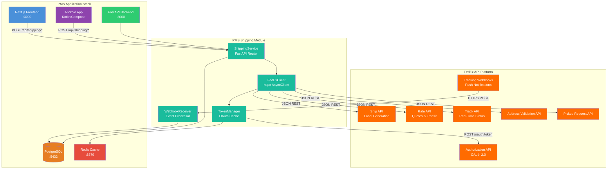

# Product Requirements Document: FedEx API Integration into Patient Management System (PMS)

**Document ID:** PRD-PMS-FEDEXAPI-001
**Version:** 1.0
**Date:** 2026-03-10
**Author:** Ammar (CEO, MPS Inc.)
**Status:** Draft

---

## 1. Executive Summary

The FedEx REST API is FedEx Corporation's modern, OAuth 2.0-secured platform for integrating shipping, tracking, address validation, rate quoting, and pickup scheduling into third-party applications. Launched as a full REST replacement for the legacy SOAP Web Services in 2022-2023, the API suite covers the complete shipment lifecycle — from rate shopping and label generation through real-time tracking and proof-of-delivery — via JSON-based endpoints at `https://apis.fedex.com`.

Integrating the FedEx API into the PMS enables automated prescription delivery, lab specimen transport, and medical supply chain management directly from clinical workflows. Staff currently handle shipping tasks manually — printing labels from fedex.com, copying tracking numbers into spreadsheets, and calling patients with delivery updates. This integration eliminates those manual handoffs by embedding shipment creation, tracking, and delivery confirmation into the existing patient encounter and prescription workflows.

For a retina-focused ophthalmology practice that ships temperature-sensitive medications (anti-VEGF biologics), lab specimens, and medical devices, FedEx is particularly relevant due to its dedicated healthcare division offering Clinical Pak packaging, temperature-controlled shipping (2-8°C, -20°C), dry ice replenishment, and FedEx Surround AI-powered cold chain monitoring.

## 2. Problem Statement

PMS clinical and administrative staff face several operational bottlenecks related to shipping:

1. **Manual prescription fulfillment**: When specialty medications are dispensed from the practice or a partner pharmacy, staff manually create shipping labels on fedex.com, then copy tracking numbers into the patient's chart. This takes 5-10 minutes per shipment and is error-prone.

2. **No chain-of-custody visibility**: Lab specimens (blood draws, biopsy tissue) shipped to reference labs have no programmatic tracking. Staff call FedEx or check the website to verify delivery, creating delays in care when results are time-sensitive.

3. **Temperature compliance gaps**: Anti-VEGF medications (Eylea, Lucentis) require cold chain shipping (2-8°C). There is no automated alerting if a shipment experiences a temperature excursion — the practice learns about it only when the lab or pharmacy reports a spoiled shipment.

4. **Patient communication lag**: Patients receive no automated updates when their prescriptions ship or are delivered. Front desk staff field calls asking "Where is my medication?" — consuming time that could be spent on clinical tasks.

5. **No audit trail for regulatory compliance**: HIPAA and state pharmacy board regulations require documentation of who shipped what, when, and to whom. Currently this is tracked in spreadsheets that are difficult to audit.

## 3. Proposed Solution

### 3.1 Architecture Overview

### 3.2 Deployment Model

- **Server-side only**: All FedEx API calls originate from the FastAPI backend. Client credentials (API Key, Secret Key) never leave the server environment.
- **Docker-based**: The Shipping Module runs as part of the existing FastAPI container — no separate service required. A dedicated `shipping` router is mounted at `/api/shipping/`.
- **OAuth token caching**: Tokens are cached in Redis with a TTL of 55 minutes (5-minute safety margin on the 60-minute expiry) to minimize authentication round-trips.
- **Webhook ingestion**: A public HTTPS endpoint (`/api/shipping/webhooks/fedex`) receives FedEx tracking event push notifications. TLS 1.2+ is required. The endpoint validates payloads and writes events to PostgreSQL.
- **HIPAA considerations**:
  - FedEx operates as a **conduit** under HIPAA — it transports but does not store PHI. Legal review is recommended to confirm whether a BAA is needed for the API integration layer.
  - Shipment records linking tracking numbers to patient IDs are encrypted at rest (AES-256) in PostgreSQL.
  - Shipping labels contain only the minimum required information (patient name, delivery address). No diagnosis, prescription details, or insurance information appears on labels or in FedEx API metadata.
  - All shipping API calls are logged in the HIPAA audit trail with user identity, timestamp, patient reference, and action taken.

## 4. PMS Data Sources

The FedEx API integration interacts with the following existing PMS APIs:

| PMS API | Endpoint | Integration Use |
|---------|----------|-----------------|
| **Patient Records API** | `/api/patients` | Retrieve patient name, shipping address, phone number for label generation and address validation |
| **Encounter Records API** | `/api/encounters` | Link shipments to clinical encounters (e.g., "specimen collected during encounter E-1234") |
| **Medication & Prescription API** | `/api/prescriptions` | Trigger shipment creation when a prescription is marked "ready to ship"; attach tracking number to the prescription record |
| **Reporting API** | `/api/reports` | Aggregate shipping metrics: cost per shipment type, delivery success rates, average transit time, temperature compliance rate |

## 5. Component/Module Definitions

### 5.1 FedExClient

- **Description**: Async HTTP client wrapping FedEx REST API endpoints. Handles request serialization, response parsing, error mapping, and retry logic with exponential backoff.
- **Input**: Pydantic request models (e.g., `ShipmentRequest`, `RateRequest`, `AddressValidationRequest`)
- **Output**: Pydantic response models with FedEx data mapped to PMS domain types
- **PMS APIs used**: None (internal infrastructure component)

### 5.2 TokenManager

- **Description**: OAuth 2.0 token lifecycle manager. Caches bearer tokens in Redis, refreshes before expiry, handles credential rotation.
- **Input**: `FEDEX_CLIENT_ID`, `FEDEX_CLIENT_SECRET` from environment variables
- **Output**: Valid bearer token string
- **PMS APIs used**: None (internal infrastructure component)

### 5.3 ShippingService

- **Description**: Business logic layer orchestrating shipment workflows: validate address → get rates → create shipment → generate label → store record → notify patient.
- **Input**: `CreateShipmentCommand` with patient_id, prescription_id (optional), shipment_type, service_level
- **Output**: `ShipmentRecord` with tracking_number, label_url, estimated_delivery
- **PMS APIs used**: Patient Records API, Prescription API, Encounter API

### 5.4 WebhookReceiver

- **Description**: Ingests FedEx tracking webhook events, validates payload integrity, maps events to internal shipment status, triggers downstream actions (patient notification, lab processing workflow).
- **Input**: FedEx webhook POST payload (JSON)
- **Output**: Updated `ShipmentEvent` records in PostgreSQL; push notifications via FCM (Android) and email
- **PMS APIs used**: Patient Records API (for notification delivery)

### 5.5 ShippingDashboard (Frontend)

- **Description**: Next.js page and components for creating shipments, viewing tracking status, and managing pickups. Integrates into the existing patient detail and prescription views.
- **Input**: User interactions (create shipment form, tracking number lookup)
- **Output**: Rendered UI with real-time tracking updates, label download, delivery status timeline
- **PMS APIs used**: All via FastAPI backend proxy

### 5.6 ShipmentTracker (Android)

- **Description**: Jetpack Compose screen within the Android app for clinic staff to scan tracking barcodes (camera), view shipment status, and receive delivery push notifications.
- **Input**: Barcode scan, tracking number manual entry
- **Output**: Shipment detail view with status timeline, push notification on status change
- **PMS APIs used**: All via FastAPI backend proxy

## 6. Non-Functional Requirements

### 6.1 Security and HIPAA Compliance

| Requirement | Implementation |
|-------------|----------------|
| PHI minimization on labels | Only patient name + delivery address; no diagnosis, Rx details, or insurance info |
| Encryption in transit | TLS 1.2+ for all FedEx API calls (enforced by FedEx) |
| Encryption at rest | AES-256 encryption for `shipments` and `shipment_events` tables linking tracking to patient IDs |
| Credential management | `FEDEX_CLIENT_ID` and `FEDEX_CLIENT_SECRET` stored in Docker secrets / environment variables; never in source code |
| Audit logging | Every shipment API call logged: user_id, patient_id (internal ref), action, timestamp, tracking_number |
| Access control | Role-based: only `shipping_clerk`, `pharmacist`, `physician`, and `admin` roles can create shipments |
| Webhook security | HTTPS-only endpoint, IP allowlisting for FedEx webhook source IPs, payload signature validation |
| BAA review | Legal review required before production deployment to determine if FedEx BAA is needed for the API layer |

### 6.2 Performance

| Metric | Target |
|--------|--------|
| Address validation response | < 500ms p95 |
| Rate quote response | < 1s p95 |
| Label generation response | < 2s p95 |
| Tracking status response | < 500ms p95 (cached), < 1s p95 (live) |
| Webhook event processing | < 200ms from receipt to database write |
| Daily shipment volume | Up to 200 shipments/day (initial) |

### 6.3 Infrastructure

| Component | Requirement |
|-----------|-------------|
| Runtime | Existing FastAPI Docker container (no new services) |
| Cache | Redis (existing) — for OAuth token caching and tracking status caching |
| Database | PostgreSQL (existing) — 2 new tables: `shipments`, `shipment_events` |
| External network | Outbound HTTPS to `apis.fedex.com`; inbound HTTPS on webhook endpoint |
| Storage | Label PDFs/PNGs stored in object storage (S3/GCS) or base64 in PostgreSQL |
| Monitoring | Prometheus metrics for API call latency, error rate, token refresh count |

## 7. Implementation Phases

### Phase 1: Foundation (Sprint 1-2)

- Register on FedEx Developer Portal, obtain sandbox credentials
- Implement `FedExClient` with OAuth `TokenManager`
- Implement Address Validation API integration
- Create `shipments` and `shipment_events` PostgreSQL tables with migrations
- Write unit tests with mocked FedEx responses
- **Deliverable**: Address validation working end-to-end in sandbox

### Phase 2: Core Shipping (Sprint 3-5)

- Implement Rate API integration (service comparison, cost display)
- Implement Ship API integration (label generation, shipment creation)
- Implement Track API integration (polling-based tracking)
- Build `ShippingService` orchestration layer
- Build Next.js shipping UI (create shipment form, tracking view, label download)
- Integrate with Patient Records and Prescription APIs
- Build Android shipment tracking screen
- **Deliverable**: Full shipment lifecycle working in sandbox

### Phase 3: Advanced Features (Sprint 6-8)

- Implement FedEx webhook integration for push-based tracking updates
- Implement Pickup Request API integration
- Add patient notification system (email + FCM push) for delivery events
- Build shipping analytics dashboard (cost, delivery times, success rates)
- Complete FedEx production validation (Integrator Validation Cover Sheet)
- HIPAA audit trail review and penetration testing of webhook endpoint
- Cold chain shipment type with temperature requirement tracking
- **Deliverable**: Production-ready shipping module with full audit trail

## 8. Success Metrics

| Metric | Target | Measurement Method |
|--------|--------|--------------------|
| Time to create shipment | < 30 seconds (from 5-10 minutes manual) | Application timing logs |
| Tracking number attachment rate | 100% of shipments auto-linked to patient/Rx records | Database query: shipments with patient_id not null |
| Patient delivery notification rate | 95% of shipments trigger automated patient notification | Notification delivery logs |
| Address validation error reduction | 80% fewer returned/undeliverable packages | FedEx delivery exception rate comparison (pre/post) |
| Staff time saved on shipping tasks | 15+ hours/week across practice | Time study comparison |
| HIPAA audit compliance | 100% of shipment actions logged | Audit log completeness check |
| Cold chain compliance | 100% temperature-sensitive shipments flagged correctly | Shipment type vs. medication temperature requirement cross-check |

## 9. Risks and Mitigations

| Risk | Impact | Mitigation |
|------|--------|------------|
| FedEx API rate limits (undocumented thresholds) | Shipment creation failures during high-volume periods | Implement request queue with exponential backoff; batch shipments during off-peak; contact FedEx for rate limit allocation |
| Sandbox responses are predefined (not dynamic) | Edge cases untested before production | Supplement sandbox testing with integration tests using Traffic Parrot or WireMock service virtualization |
| No official FedEx Python/JS SDK | Higher development cost for HTTP client wrapper | Build a thin internal `FedExClient` class; consider EasyPost/ShipEngine as fallback aggregator if direct integration proves too costly |
| HIPAA BAA ambiguity with FedEx | Regulatory risk if FedEx API layer is deemed to access ePHI | Engage healthcare compliance counsel for BAA determination before production launch |
| FedEx production validation delay | Go-live timeline blocked by FedEx ISV review | Submit Integrator Validation Cover Sheet in Phase 1; maintain sandbox testing in parallel |
| Cold chain telemetry requires enterprise contract | No real-time temperature monitoring via self-serve API | Implement basic shipment type flagging first; negotiate Surround enterprise access for Phase 3+ |
| Webhook endpoint as attack surface | DDoS or spoofed tracking events | IP allowlisting, payload signature validation, rate limiting on webhook endpoint |

## 10. Dependencies

| Dependency | Type | Notes |
|------------|------|-------|
| FedEx Developer Portal account | External service | Free registration at developer.fedex.com |
| FedEx sandbox API credentials | External credential | Provided upon developer portal registration |
| FedEx production credentials | External credential | Requires Integrator Validation Cover Sheet approval |
| FedEx shipping account number | Business account | Existing or new FedEx business account with negotiated rates |
| `httpx` Python library | Software dependency | Async HTTP client for FedEx API calls |
| Redis (existing) | Infrastructure | OAuth token caching |
| PostgreSQL (existing) | Infrastructure | Shipment and event storage |
| Object storage (S3/GCS) | Infrastructure | Label PDF/PNG storage (optional — can use PostgreSQL BYTEA) |
| Public HTTPS endpoint | Infrastructure | For FedEx webhook event ingestion |
| TLS certificate (valid CA) | Infrastructure | Required for webhook endpoint |

## 11. Comparison with Existing Experiments

| Aspect | FedEx API (Exp 65) | Availity API (Exp 47) | FHIR Prior Auth (Exp 48) |
|--------|--------------------|-----------------------|--------------------------|
| **Domain** | Physical logistics & shipping | Insurance eligibility & claims | Prior authorization workflow |
| **Data flow direction** | PMS → FedEx (outbound shipments) | PMS ↔ Payers (bidirectional) | PMS → Payers (PA submission) |
| **Patient touchpoint** | Prescription delivery, lab specimen transport | Coverage verification | Treatment authorization |
| **HIPAA role** | FedEx as conduit (physical transport) | Availity as BA (ePHI access) | Payer as covered entity |
| **Complementary value** | After PA is approved (Exp 48) and medication is authorized, FedEx ships it to the patient. After Availity (Exp 47) confirms coverage, FedEx delivers the covered supply. |

FedEx API integration is the **physical fulfillment layer** that completes the workflow started by prior authorization (Exp 48) and eligibility verification (Exp 47). When a prescription is authorized and covered, FedEx delivers it. When a lab orders a specimen, FedEx transports it. This experiment fills the logistics gap between clinical decision and physical delivery.

## 12. Research Sources

### Official Documentation
- [FedEx Developer Portal](https://developer.fedex.com/api/en-us/home.html) — Main developer hub with API catalog, getting started guide, and sandbox access
- [FedEx API Catalog](https://developer.fedex.com/api/en-us/catalog.html) — Complete list of available APIs: Ship, Rate, Track, Address Validation, Pickup, etc.
- [FedEx Authorization API Docs](https://developer.fedex.com/api/en-us/catalog/authorization/docs.html) — OAuth 2.0 client credentials flow, token lifecycle, grant types

### Architecture & Specification
- [FedEx Ship API Documentation](https://developer.fedex.com/api/en-us/catalog/ship/docs.html) — Shipment creation, label generation, service types, special services
- [FedEx Rate API Documentation](https://developer.fedex.com/api/en-us/catalog/rate/docs.html) — Rate quotes, transit times, service comparison
- [FedEx Sandbox Virtualization Guide](https://developer.fedex.com/api/en-us/guides/sandboxvirtualization.html) — Test environment setup, predefined responses, sandbox limitations

### Security & Compliance
- [HHS HIPAA Business Associates FAQ](https://www.hhs.gov/hipaa/for-professionals/faq/245/are-entities-business-associates/index.html) — Conduit exception guidance for courier services
- [HIPAA-Compliant Logistics — DispatchTrack](https://www.dispatchtrack.com/blog/hipaa-compliant-logistics) — Healthcare shipping compliance requirements
- [Building HIPAA-Compliant APIs — Moesif](https://www.moesif.com/blog/business/compliance/Building-HIPAA-Compliant-APIs/) — API security patterns for healthcare

### Healthcare & Cold Chain
- [FedEx Healthcare Solutions](https://www.fedex.com/en-us/healthcare.html) — Dedicated healthcare division, clinical paks, pharmaceutical shipping
- [FedEx Temperature Control Shipping](https://www.fedex.com/en-us/shipping/temperature-control.html) — Cold chain options: refrigerated, frozen, dry ice replenishment

## 13. Appendix: Related Documents

- [FedEx API Setup Guide](65-FedExAPI-PMS-Developer-Setup-Guide.md) — Installation, configuration, and verification
- [FedEx API Developer Tutorial](65-FedExAPI-Developer-Tutorial.md) — Hands-on onboarding with end-to-end integration
- [FedEx Developer Portal](https://developer.fedex.com/api/en-us/home.html) — Official documentation
- [Availity API PRD (Exp 47)](47-PRD-AvailityAPI-PMS-Integration.md) — Multi-payer clearinghouse integration (complementary)
- [FHIR Prior Auth PRD (Exp 48)](48-PRD-FHIRPriorAuth-PMS-Integration.md) — Prior authorization workflow (complementary)
