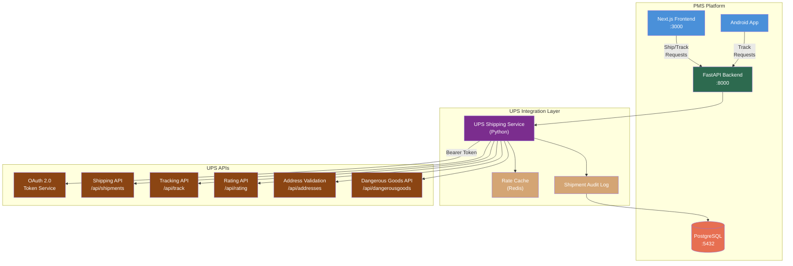

# Product Requirements Document: UPS API Integration into Patient Management System (PMS)

**Document ID:** PRD-PMS-UPSAPI-001
**Version:** 1.0
**Date:** 2026-03-10
**Author:** Ammar (CEO, MPS Inc.)
**Status:** Draft

---

## 1. Executive Summary

The UPS Developer API is a comprehensive suite of RESTful shipping services available at [developer.ups.com](https://developer.ups.com/) that provides programmatic access to shipment creation, real-time tracking, rate comparison, address validation, label generation, and dangerous goods compliance. UPS has fully transitioned from legacy SOAP/XML and access-key authentication to modern REST/JSON APIs with OAuth 2.0 client credentials, making integration with modern web stacks straightforward.

Integrating UPS API into the PMS enables the clinical operations team to manage the logistics of medical supply shipping, specimen transport (UN3373 biological substances), prescription delivery tracking, and medical device distribution directly from the patient management interface. This eliminates the current workflow of switching between the PMS and external shipping platforms, reduces manual data entry errors in shipping addresses, and provides end-to-end chain-of-custody visibility for HIPAA-regulated shipments.

UPS Healthcare is a dedicated division offering cold chain solutions (UPS Temperature True), dangerous goods pre-checks, and FDA/ISO/GMP-compliant medical device logistics. By integrating these specialized healthcare shipping capabilities into the PMS, staff can create compliant shipments for biological specimens, temperature-sensitive medications, and medical devices without leaving the clinical workflow — with full audit trails for regulatory compliance.

## 2. Problem Statement

The PMS currently has no integrated shipping capability. Clinical and administrative staff must manually:

1. **Copy patient addresses** from the PMS into the UPS website or a third-party shipping tool, introducing transcription errors that cause delivery failures for time-sensitive medical supplies.
2. **Track shipments externally** — there is no way to see whether a specimen kit, prescription refill, or medical device has been delivered from within a patient's record, leading to follow-up delays and missed chain-of-custody documentation.
3. **Manage dangerous goods compliance manually** — shipping biological specimens (UN3373) and dry ice (UN1845) requires IATA Packing Instruction 650 compliance that is currently verified by paper checklists, creating audit gaps.
4. **Lack rate visibility** — staff cannot compare UPS service levels (Ground, 2nd Day Air, Next Day Air) with cost and transit time tradeoffs when shipping time-sensitive items, often defaulting to the most expensive option.
5. **No shipment audit trail** — HIPAA requires documentation of PHI-adjacent logistics (e.g., who shipped what specimen to which lab, when it arrived), but this is tracked in spreadsheets outside the system of record.

## 3. Proposed Solution

### 3.1 Architecture Overview

### 3.2 Deployment Model

| Aspect | Decision |
|--------|----------|
| **Hosting** | Cloud-hosted (UPS manages all API infrastructure) |
| **Integration** | Python `UPSService` class within existing FastAPI backend — no separate microservice needed |
| **Authentication** | OAuth 2.0 Client Credentials flow; tokens cached with TTL (3500s / ~58 min) |
| **Environments** | Sandbox: `https://wwwcie.ups.com/api/` · Production: `https://onlinetools.ups.com/api/` |
| **Secrets** | `UPS_CLIENT_ID` and `UPS_CLIENT_SECRET` stored in Docker secrets, never in code or env files |
| **PHI Isolation** | Patient names and addresses are transmitted to UPS for shipment creation but are not stored in UPS systems beyond operational necessity; PMS audit log records all transmissions |
| **HIPAA BAA** | UPS Healthcare provides Business Associate Agreements for healthcare logistics customers |

## 4. PMS Data Sources

| PMS API | Integration Purpose |
|---------|-------------------|
| **Patient Records API** (`/api/patients`) | Source patient shipping addresses; validate addresses via UPS Address Validation before shipment creation |
| **Encounter Records API** (`/api/encounters`) | Link shipments to encounters (e.g., specimen collection during a visit triggers a shipping workflow) |
| **Medication & Prescription API** (`/api/prescriptions`) | Trigger prescription delivery shipments; track medication delivery status; enforce temperature requirements for biologics |
| **Reporting API** (`/api/reports`) | Aggregate shipping costs, delivery performance, and compliance metrics into operational reports |

## 5. Component/Module Definitions

### 5.1 UPS Authentication Manager

- **Description:** Manages OAuth 2.0 token lifecycle — requests new tokens, caches them with TTL, and transparently refreshes expired tokens.
- **Input:** `UPS_CLIENT_ID`, `UPS_CLIENT_SECRET`
- **Output:** Valid Bearer token for all UPS API calls
- **PMS APIs:** None (internal infrastructure component)

### 5.2 Address Validation Service

- **Description:** Validates and standardizes patient shipping addresses using UPS Address Validation API before shipment creation. Flags invalid/ambiguous addresses for staff review.
- **Input:** Patient address from `/api/patients/{id}`
- **Output:** Validated address with classification (Commercial/Residential), suggested corrections
- **PMS APIs:** Patient Records API (`/api/patients`)

### 5.3 Rate Shopping Engine

- **Description:** Compares rates and transit times across UPS service levels for a given origin-destination pair. Caches results in Redis (5-minute TTL) to reduce API calls for repeated lookups.
- **Input:** Origin address, destination address, package dimensions/weight, service type filter
- **Output:** Sorted list of service options with rate, estimated delivery date, and guaranteed delivery indicator
- **PMS APIs:** Patient Records API (destination address), Encounter Records API (shipment urgency context)

### 5.4 Shipment Creator

- **Description:** Creates shipments, generates shipping labels (PNG, GIF, ZPL for thermal printers), and handles return shipment labels for specimen return kits.
- **Input:** Validated addresses, package details, service level, dangerous goods indicators
- **Output:** Tracking number, label image/data, shipment confirmation
- **PMS APIs:** Patient Records API, Encounter Records API, Prescription API

### 5.5 Tracking Dashboard Service

- **Description:** Polls UPS Tracking API for real-time shipment status updates. Stores tracking events in PostgreSQL. Pushes status changes to the frontend via WebSocket.
- **Input:** UPS tracking number(s)
- **Output:** Tracking event timeline, current status, estimated delivery, signature confirmation
- **PMS APIs:** Encounter Records API (link tracking to encounters), Reporting API (delivery metrics)

### 5.6 Dangerous Goods Compliance Checker

- **Description:** Pre-validates shipments containing biological specimens (UN3373), dry ice (UN1845), or other regulated materials against UPS Dangerous Goods API before booking.
- **Input:** Material classification, quantity, packaging type
- **Output:** Pass/fail compliance result, required documentation list, packaging instructions
- **PMS APIs:** Encounter Records API (specimen type from encounter)

### 5.7 Shipment Audit Logger

- **Description:** Records every UPS API interaction in the `shipment_audit_log` PostgreSQL table with timestamp, user, action, request/response hash, and patient linkage for HIPAA compliance.
- **Input:** All UPS API requests and responses
- **Output:** Immutable audit trail entries
- **PMS APIs:** All PMS APIs (cross-cutting concern)

## 6. Non-Functional Requirements

### 6.1 Security and HIPAA Compliance

| Requirement | Implementation |
|-------------|---------------|
| **Data in Transit** | All UPS API calls over TLS 1.2+; internal PMS traffic over HTTPS |
| **Credential Storage** | OAuth client ID/secret in Docker secrets; never logged or exposed in API responses |
| **PHI Minimization** | Only transmit patient name + address to UPS; no diagnosis, medication, or clinical data in shipment metadata |
| **Audit Logging** | Every shipment creation, tracking query, and address validation logged with user ID, timestamp, and patient linkage |
| **Access Control** | Role-based: only `shipping_clerk` and `admin` roles can create shipments; all authenticated users can view tracking |
| **BAA** | Require signed UPS Healthcare BAA before production deployment |
| **Data Retention** | Shipment audit logs retained for 7 years per HIPAA retention requirements |

### 6.2 Performance

| Metric | Target |
|--------|--------|
| Address validation response | < 500ms (p95) |
| Rate shopping response (cached) | < 200ms |
| Rate shopping response (uncached) | < 2s |
| Shipment creation + label generation | < 3s |
| Tracking status query | < 1s |
| Tracking webhook processing | < 500ms |

### 6.3 Infrastructure

| Component | Requirement |
|-----------|-------------|
| **Docker** | No additional containers — UPSService runs within existing FastAPI container |
| **Redis** | Existing Redis instance used for rate caching and OAuth token caching |
| **PostgreSQL** | New tables: `shipments`, `shipment_tracking_events`, `shipment_audit_log` |
| **Network** | Outbound HTTPS to `*.ups.com` on port 443 |
| **Storage** | Label images stored as BYTEA in PostgreSQL (avg 15KB per label) |

## 7. Implementation Phases

### Phase 1: Foundation (Sprints 1-2)

- UPS OAuth 2.0 authentication manager with token caching
- Address Validation service + patient address pre-validation
- Rate Shopping engine with Redis caching
- PostgreSQL schema for shipments and audit log
- Sandbox environment integration tests

### Phase 2: Core Shipping (Sprints 3-4)

- Shipment creation with label generation (PNG + ZPL)
- Return shipment labels for specimen kits
- Real-time tracking with polling and event storage
- Tracking status panel in Next.js patient view
- Dangerous goods pre-check for biological specimens
- HIPAA audit logging for all shipping operations

### Phase 3: Advanced Features (Sprints 5-6)

- Android tracking view in patient detail screen
- Batch shipment creation for multi-patient mailings
- Shipping cost reporting and analytics dashboard
- Cold chain monitoring integration (UPS Temperature True status)
- Automated specimen shipping workflow triggered by encounter completion
- Production deployment with UPS Healthcare BAA

## 8. Success Metrics

| Metric | Target | Measurement |
|--------|--------|-------------|
| Address validation accuracy | > 98% first-pass valid | Ratio of shipments with no address correction needed |
| Shipping workflow time | < 60 seconds end-to-end | Time from "Ship" button click to label generated |
| Delivery tracking visibility | 100% of shipments tracked | Shipments with at least one tracking event in PMS |
| Manual shipping errors eliminated | > 90% reduction | Compared to pre-integration error rate baseline |
| Staff context-switch reduction | Eliminate UPS.com usage | Zero UPS website logins by shipping staff |
| Dangerous goods compliance | 100% pre-validated | All specimen shipments pass DG check before booking |
| Audit trail completeness | 100% of operations logged | Shipment audit log entries vs total API calls |

## 9. Risks and Mitigations

| Risk | Impact | Mitigation |
|------|--------|------------|
| UPS API rate limits throttle high-volume days | Delayed shipment creation during busy periods | Implement request queuing with exponential backoff; cache rate lookups aggressively |
| UPS API downtime during critical shipments | Unable to ship time-sensitive specimens | Implement graceful degradation with manual shipping fallback UI; alert staff immediately |
| OAuth token expiry mid-request | Failed API calls | Pre-emptive token refresh at 50-minute mark (tokens valid ~60 min); retry with fresh token on 401 |
| PHI leakage in shipment metadata | HIPAA violation | Strip all clinical data from shipment descriptions; only transmit name + address; audit all outbound payloads |
| Label printer compatibility issues | Staff unable to print labels | Support multiple label formats (PNG for standard printers, ZPL/EPL for thermal); provide fallback PDF |
| UPS API versioning changes | Breaking integration | Pin to specific API version; monitor UPS developer changelog; maintain integration test suite |
| Cost overruns from API usage | Unexpected billing | Monitor API call volume; most UPS APIs are free (Tracking confirmed free); set usage alerts |

## 10. Dependencies

| Dependency | Type | Notes |
|------------|------|-------|
| UPS Developer Account | External | Required for `client_id` and `client_secret` at [developer.ups.com](https://developer.ups.com/) |
| UPS Healthcare BAA | Legal | Must be signed before production use with patient data |
| UPS Shipper Account | External | Required for production shipment creation (linked to billing) |
| Python `httpx` | Library | Async HTTP client for UPS API calls (already in PMS backend) |
| Redis | Infrastructure | Already deployed in PMS stack for rate and token caching |
| PostgreSQL | Infrastructure | Already deployed; new tables for shipments and audit log |
| Thermal label printer (optional) | Hardware | ZPL-compatible printer for high-volume shipping workflows |

## 11. Comparison with Existing Experiments

### vs. Experiment 65: FedEx API

The UPS API integration (Experiment 66) is **complementary** to the FedEx API integration (Experiment 65), not a replacement. Together they provide multi-carrier shipping capability:

| Aspect | UPS API (Exp 66) | FedEx API (Exp 65) |
|--------|-------------------|-------------------|
| **Healthcare Division** | UPS Healthcare — dedicated cold chain, medical device logistics, specimen shipping | FedEx Healthcare — similar offerings with FedEx Custom Critical |
| **Authentication** | OAuth 2.0 Client Credentials | OAuth 2.0 Client Credentials |
| **API Style** | REST/JSON | REST/JSON |
| **Dangerous Goods** | Dedicated DG API with pre-check | Integrated into Shipping API |
| **Differentiation** | Stronger cold chain monitoring (Temperature True), more UPS Store locations for drop-off | Faster transit options (FedEx Priority Overnight), FedEx Office locations |

A future **Carrier Router** component could select UPS vs FedEx based on cost, transit time, service area, and specimen requirements — similar to how Experiment 48 (FHIR Prior Auth) routes between FHIR and X12 paths.

### vs. Experiment 47: Availity API

Availity handles payer clearinghouse transactions (eligibility, PA, claims) while UPS handles physical logistics. They are entirely complementary — a prescription approved via Availity PA could trigger a UPS shipment for medication delivery.

## 12. Research Sources

### Official Documentation
- [UPS Developer Portal](https://developer.ups.com/) — API registration, app management, and documentation hub
- [UPS API Reference](https://developer.ups.com/api/reference) — Complete endpoint documentation for all UPS APIs
- [UPS OAuth Developer Guide](https://developer.ups.com/oauth-developer-guide) — OAuth 2.0 migration guide and authentication flows

### Architecture & SDKs
- [UPS-API GitHub (API Documentation)](https://github.com/UPS-API/api-documentation) — OpenAPI/YAML specs for all UPS APIs
- [UPS-API GitHub (SDKs)](https://github.com/UPS-API/UPS-SDKs) — Official Python and Node.js SDKs

### Healthcare & Compliance
- [UPS Healthcare Home](https://www.ups.com/us/en/healthcare/home) — Dedicated healthcare logistics division
- [UPS Cold Chain Solutions](https://www.ups.com/us/en/healthcare/solutions/coldchain) — Temperature True and Proactive Response services
- [UPS Medical Device Logistics](https://www.ups.com/us/en/healthcare/solutions/medicaldevices) — FDA/ISO/GMP compliant device shipping
- [UPS Biological Substances FAQ](https://www.ups.com/us/en/support/shipping-support/shipping-special-care-regulated-items/hazardous-materials-guide/biological-substances) — UN3373 and IATA PI 650 compliance

### Security & Data Handling
- [UPS Data Processing Exhibit](https://www.ups.com/assets/resources/webcontent/en_US/UPS_Form_Data_Processing_Exhibit_4.pdf) — Formal data handling terms and GDPR compliance

## 13. Appendix: Related Documents

- [UPS API Setup Guide](66-UPSAPI-PMS-Developer-Setup-Guide.md) — Developer environment setup and integration walkthrough
- [UPS API Developer Tutorial](66-UPSAPI-Developer-Tutorial.md) — Hands-on onboarding: build a specimen shipping workflow end-to-end
- [FedEx API PRD (Experiment 65)](65-PRD-FedExAPI-PMS-Integration.md) — Complementary carrier integration
- [Availity API PRD (Experiment 47)](47-PRD-AvailityAPI-PMS-Integration.md) — Payer clearinghouse integration that precedes shipping workflows
