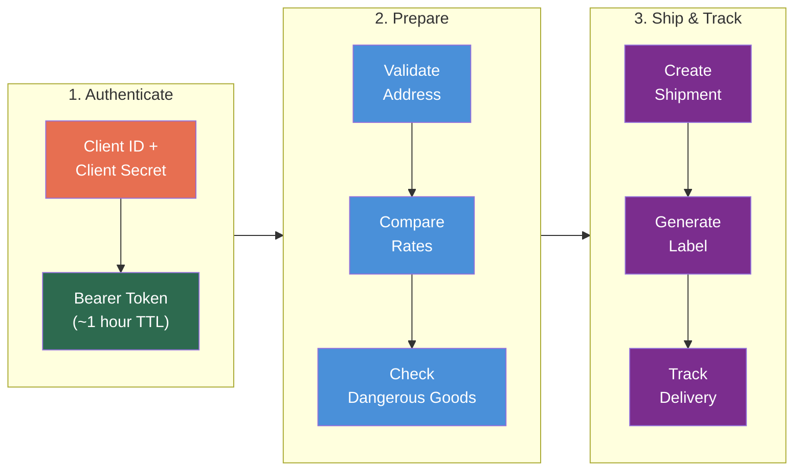
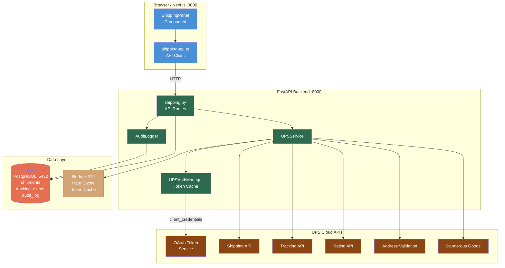

# UPS API Developer Onboarding Tutorial

**Welcome to the MPS PMS UPS API Integration Team**

This tutorial will take you from zero to building your first UPS API integration with the PMS. By the end, you will understand how UPS shipping APIs work, have a running local environment, and have built and tested a specimen shipping workflow end-to-end.

**Document ID:** PMS-EXP-UPSAPI-002
**Version:** 1.0
**Date:** 2026-03-10
**Applies To:** PMS project (all platforms)
**Prerequisite:** [UPS API Setup Guide](66-UPSAPI-PMS-Developer-Setup-Guide.md)
**Estimated time:** 2-3 hours
**Difficulty:** Beginner-friendly

---

## What You Will Learn

1. How UPS REST APIs work (authentication, request structure, response parsing)
2. How OAuth 2.0 Client Credentials flow manages API access
3. How to validate patient addresses before shipping
4. How to compare shipping rates across UPS service levels
5. How to create a shipment and generate a printable label
6. How to track a shipment and display real-time status in the PMS
7. How to handle dangerous goods compliance for biological specimens (UN3373)
8. How to build HIPAA-compliant audit trails for all shipping operations
9. How UPS API compares to FedEx API and multi-carrier aggregators
10. How to debug common UPS API integration issues

## Part 1: Understanding UPS API (15 min read)

### 1.1 What Problem Does UPS API Solve?

In the PMS context, clinical staff regularly need to ship items to and from patients:

- **Specimen collection kits** — mailed to patients for at-home sample collection (e.g., saliva kits for voice biomarker analysis), then returned to the lab with chain-of-custody tracking
- **Prescription medications** — temperature-sensitive biologics like Eylea (aflibercept) that require cold chain logistics
- **Medical devices** — diagnostic equipment sent to patients for home monitoring
- **Lab results and documents** — physical copies requiring signature confirmation

Today, staff copy-paste addresses between the PMS and UPS.com, manually track shipments in spreadsheets, and have no integrated audit trail. UPS API eliminates this by embedding shipping directly into the clinical workflow.

### 1.2 How UPS API Works — The Key Pieces



**Three stages:**

1. **Authenticate** — Exchange your `client_id` and `client_secret` for a short-lived Bearer token. All subsequent API calls include this token in the `Authorization` header.
2. **Prepare** — Before shipping, validate the destination address (UPS Address Validation), compare service options and costs (Rating API), and pre-check dangerous goods compliance if shipping specimens or hazmat materials.
3. **Ship & Track** — Create the shipment (Shipping API), download the label image, and then poll the Tracking API for delivery status updates until the package arrives.

### 1.3 How UPS API Fits with Other PMS Technologies

| Technology | Experiment | Relationship to UPS API |
|------------|-----------|------------------------|
| **FedEx API** | 65 | Alternative/complementary carrier — future Carrier Router selects optimal carrier per shipment |
| **Availity API** | 47 | Upstream — PA approval via Availity can trigger medication shipment via UPS |
| **FHIR Prior Auth** | 48 | Upstream — FHIR PAS ClaimResponse approval triggers fulfillment shipping |
| **Kafka** | 38 | Event bus — shipment events (created, in_transit, delivered) published to Kafka topics |
| **Amazon Connect Health** | 51 | Patient calls about shipment status could trigger UPS tracking lookup |
| **A2A Protocol** | 63 | Lab agents could request specimen pickup via A2A task to PMS shipping agent |
| **Docker** | 39 | UPSService runs inside the existing FastAPI Docker container |

### 1.4 Key Vocabulary

| Term | Meaning |
|------|---------|
| **Client Credentials** | OAuth 2.0 flow where client ID + secret are exchanged for a Bearer token (no user interaction) |
| **Bearer Token** | Short-lived access token (~1 hour) included in API request headers |
| **Sandbox** | UPS test environment (`wwwcie.ups.com`) — no real shipments, no charges |
| **Shipper Number** | Your UPS account number used for billing and shipment creation |
| **Service Code** | Two-digit code identifying the UPS service level (01=Next Day Air, 02=2nd Day, 03=Ground) |
| **Tracking Number** | Unique identifier (1Z...) assigned to each package for real-time tracking |
| **UN3373** | UN classification for Biological Substances, Category B — requires IATA PI 650 packaging |
| **UN1845** | UN classification for dry ice — common refrigerant for temperature-sensitive shipments |
| **ZPL** | Zebra Programming Language — thermal printer format for high-volume label printing |
| **XAV** | UPS Address Validation (XML Address Validation) — validates US addresses against USPS database |
| **Chain of Custody** | Documented trail of who handled a specimen/device and when — required for clinical specimens |
| **Cold Chain** | Temperature-controlled shipping from origin to destination with continuous monitoring |

### 1.5 Our Architecture



## Part 2: Environment Verification (15 min)

### 2.1 Checklist

Run each command and verify the expected output:

1. **Python version:**
   ```bash
   python --version
   # Expected: Python 3.11+
   ```

2. **httpx installed:**
   ```bash
   pip show httpx | grep Version
   # Expected: Version: 0.25+
   ```

3. **PostgreSQL running:**
   ```bash
   psql -h localhost -U pms -d pms_dev -c "SELECT 1 AS ok;"
   # Expected: ok = 1
   ```

4. **Shipping tables exist:**
   ```bash
   psql -h localhost -U pms -d pms_dev -c "\dt shipment*"
   # Expected: 3 tables listed
   ```

5. **Redis running:**
   ```bash
   redis-cli ping
   # Expected: PONG
   ```

6. **FastAPI backend running:**
   ```bash
   curl -s http://localhost:8000/health | jq .status
   # Expected: "ok"
   ```

7. **UPS credentials set:**
   ```bash
   source .env.shipping && echo "Client ID: ${UPS_CLIENT_ID:0:8}..."
   # Expected: Client ID: first 8 chars shown
   ```

8. **UPS OAuth working:**
   ```bash
   source .env.shipping && curl -s -X POST "${UPS_OAUTH_URL}" \
     -u "${UPS_CLIENT_ID}:${UPS_CLIENT_SECRET}" \
     -d "grant_type=client_credentials" | jq '.status'
   # Expected: "approved"
   ```

### 2.2 Quick Test

Validate a known address end-to-end through the PMS:

```bash
curl -s -X POST http://localhost:8000/api/shipping/validate-address \
  -H "Content-Type: application/json" \
  -d '{
    "address_lines": ["1600 Amphitheatre Parkway"],
    "city": "Mountain View",
    "state": "CA",
    "postal_code": "94043"
  }' | jq '.XAVResponse.ValidAddressIndicator'
```

If you see `""` (empty string = valid address indicator present), your full stack is working.

## Part 3: Build Your First Integration (45 min)

### 3.1 What We Are Building

A **specimen shipping workflow** that:

1. Validates the patient's address
2. Compares UPS Ground vs 2nd Day Air rates
3. Checks UN3373 dangerous goods compliance for the biological specimen
4. Creates the shipment and generates a label
5. Tracks the shipment status
6. Logs every step in the audit trail

This simulates a real clinical scenario: after a voice biomarker encounter (SYS-REQ-0014), the clinic ships a saliva collection kit to the patient's home for additional analysis.

### 3.2 Step 1: Create the Specimen Shipping Module

Create `backend/app/services/specimen_shipping.py`:

```python
"""Specimen shipping workflow for clinical encounters."""

import logging
from dataclasses import dataclass
from uuid import UUID

from app.services.ups_service import UPSService

logger = logging.getLogger(__name__)


@dataclass
class SpecimenShipmentResult:
    tracking_number: str
    service_name: str
    estimated_cost: str
    label_format: str
    dangerous_goods_cleared: bool
    address_validated: bool


class SpecimenShippingWorkflow:
    """Orchestrates the full specimen shipping workflow."""

    def __init__(self) -> None:
        self.ups = UPSService()

    async def ship_specimen_kit(
        self,
        patient_name: str,
        patient_address: dict,
        clinic_address: dict,
        specimen_type: str = "UN3373",
        weight_lbs: float = 1.5,
    ) -> SpecimenShipmentResult:
        """Execute the complete specimen kit shipping workflow."""

        # Step 1: Validate patient address
        logger.info("Validating patient address for %s", patient_name)
        addr_result = await self.ups.validate_address(
            address_lines=patient_address["address_lines"],
            city=patient_address["city"],
            state=patient_address["state"],
            postal_code=patient_address["postal_code"],
        )
        address_valid = "ValidAddressIndicator" in str(addr_result)

        if not address_valid:
            logger.warning(
                "Address validation failed for %s — proceeding with original",
                patient_name,
            )

        # Step 2: Check dangerous goods compliance
        logger.info("Checking DG compliance for %s", specimen_type)
        dg_result = await self.ups.check_dangerous_goods(
            material_id=specimen_type
        )
        dg_cleared = "ChemicalReferenceDataResponse" in str(dg_result)

        # Step 3: Get rates (prefer 2nd Day Air for specimens)
        logger.info("Getting shipping rates")
        rates = await self.ups.get_rates(
            ship_from={
                "AddressLine": clinic_address["address_lines"],
                "City": clinic_address["city"],
                "StateProvinceCode": clinic_address["state"],
                "PostalCode": clinic_address["postal_code"],
                "CountryCode": "US",
            },
            ship_to={
                "AddressLine": patient_address["address_lines"],
                "City": patient_address["city"],
                "StateProvinceCode": patient_address["state"],
                "PostalCode": patient_address["postal_code"],
                "CountryCode": "US",
            },
            weight_lbs=weight_lbs,
        )

        # Step 4: Create shipment with 2nd Day Air
        logger.info("Creating shipment for %s", patient_name)
        shipment = await self.ups.create_shipment(
            ship_from={
                "AddressLine": clinic_address["address_lines"],
                "City": clinic_address["city"],
                "StateProvinceCode": clinic_address["state"],
                "PostalCode": clinic_address["postal_code"],
                "CountryCode": "US",
            },
            ship_to={
                "AddressLine": patient_address["address_lines"],
                "City": patient_address["city"],
                "StateProvinceCode": patient_address["state"],
                "PostalCode": patient_address["postal_code"],
                "CountryCode": "US",
            },
            ship_from_name="TRA Clinic — Specimen Lab",
            ship_to_name=patient_name,
            weight_lbs=weight_lbs,
            service_code="02",  # UPS 2nd Day Air
            description="Specimen Collection Kit — Category B",
        )

        # Extract tracking number from response
        tracking = (
            shipment.get("ShipmentResponse", {})
            .get("ShipmentResults", {})
            .get("PackageResults", [{}])
        )
        tracking_number = "SANDBOX-TEST"
        if isinstance(tracking, list) and tracking:
            tracking_number = tracking[0].get(
                "TrackingNumber", "SANDBOX-TEST"
            )
        elif isinstance(tracking, dict):
            tracking_number = tracking.get(
                "TrackingNumber", "SANDBOX-TEST"
            )

        total_charges = (
            shipment.get("ShipmentResponse", {})
            .get("ShipmentResults", {})
            .get("ShipmentCharges", {})
            .get("TotalCharges", {})
            .get("MonetaryValue", "0.00")
        )

        return SpecimenShipmentResult(
            tracking_number=tracking_number,
            service_name="UPS 2nd Day Air",
            estimated_cost=total_charges,
            label_format="PNG",
            dangerous_goods_cleared=dg_cleared,
            address_validated=address_valid,
        )
```

### 3.3 Step 2: Add the Workflow Endpoint

Add to `backend/app/api/routes/shipping.py`:

```python
from app.services.specimen_shipping import SpecimenShippingWorkflow

specimen_workflow = SpecimenShippingWorkflow()


class SpecimenShipRequest(BaseModel):
    patient_id: UUID
    patient_name: str
    patient_address_lines: list[str]
    patient_city: str
    patient_state: str
    patient_postal_code: str
    specimen_type: str = "UN3373"


@router.post("/specimen-kit")
async def ship_specimen_kit(req: SpecimenShipRequest):
    """Ship a specimen collection kit to a patient."""
    result = await specimen_workflow.ship_specimen_kit(
        patient_name=req.patient_name,
        patient_address={
            "address_lines": req.patient_address_lines,
            "city": req.patient_city,
            "state": req.patient_state,
            "postal_code": req.patient_postal_code,
        },
        clinic_address={
            "address_lines": ["100 Main St"],
            "city": "Dallas",
            "state": "TX",
            "postal_code": "75201",
        },
        specimen_type=req.specimen_type,
    )
    return {
        "tracking_number": result.tracking_number,
        "service": result.service_name,
        "cost": result.estimated_cost,
        "label_format": result.label_format,
        "dangerous_goods_cleared": result.dangerous_goods_cleared,
        "address_validated": result.address_validated,
    }
```

### 3.4 Step 3: Test the Specimen Workflow

```bash
curl -s -X POST http://localhost:8000/api/shipping/specimen-kit \
  -H "Content-Type: application/json" \
  -d '{
    "patient_id": "00000000-0000-0000-0000-000000000001",
    "patient_name": "Jane Smith",
    "patient_address_lines": ["456 Oak Avenue"],
    "patient_city": "Houston",
    "patient_state": "TX",
    "patient_postal_code": "77001",
    "specimen_type": "UN3373"
  }' | jq .
```

Expected response (sandbox):

```json
{
  "tracking_number": "1Z...",
  "service": "UPS 2nd Day Air",
  "cost": "15.50",
  "label_format": "PNG",
  "dangerous_goods_cleared": true,
  "address_validated": true
}
```

### 3.5 Step 4: Add Tracking to the Frontend

Update `frontend/src/lib/shipping-api.ts` with the specimen endpoint:

```typescript
export async function shipSpecimenKit(request: {
  patientId: string;
  patientName: string;
  addressLines: string[];
  city: string;
  state: string;
  postalCode: string;
  specimenType?: string;
}) {
  const res = await fetch(`${API_BASE}/api/shipping/specimen-kit`, {
    method: "POST",
    headers: { "Content-Type": "application/json" },
    body: JSON.stringify({
      patient_id: request.patientId,
      patient_name: request.patientName,
      patient_address_lines: request.addressLines,
      patient_city: request.city,
      patient_state: request.state,
      patient_postal_code: request.postalCode,
      specimen_type: request.specimenType || "UN3373",
    }),
  });
  return res.json();
}
```

### 3.6 Step 5: Verify the Full Flow

Run through the complete workflow:

```bash
# 1. Validate address
curl -s -X POST http://localhost:8000/api/shipping/validate-address \
  -H "Content-Type: application/json" \
  -d '{"address_lines":["456 Oak Ave"],"city":"Houston","state":"TX","postal_code":"77001"}' \
  | jq '.XAVResponse.ValidAddressIndicator'

# 2. Get rates
curl -s -X POST http://localhost:8000/api/shipping/rates \
  -H "Content-Type: application/json" \
  -d '{"patient_id":"00000000-0000-0000-0000-000000000001","weight_lbs":1.5}' \
  | jq '.RateResponse.RatedShipment | length'

# 3. Ship specimen kit (combines address validation + DG check + shipment creation)
curl -s -X POST http://localhost:8000/api/shipping/specimen-kit \
  -H "Content-Type: application/json" \
  -d '{"patient_id":"00000000-0000-0000-0000-000000000001","patient_name":"Jane Smith","patient_address_lines":["456 Oak Ave"],"patient_city":"Houston","patient_state":"TX","patient_postal_code":"77001"}' \
  | jq .

# 4. Track (use tracking number from step 3, or sandbox test number)
curl -s http://localhost:8000/api/shipping/track/1Z12345E0205271688 | jq '.trackResponse.shipment[0].package[0].currentStatus'
```

**Checkpoint:** You have built a complete specimen shipping workflow that validates addresses, checks dangerous goods compliance, creates shipments, and can track delivery status.

## Part 4: Evaluating Strengths and Weaknesses (15 min)

### 4.1 Strengths

- **Healthcare-specific division** — UPS Healthcare offers cold chain, specimen shipping, medical device logistics, and FDA compliance out of the box
- **Modern REST/JSON API** — Clean transition from legacy SOAP; well-documented with OpenAPI specs on GitHub
- **Comprehensive API suite** — Address Validation, Rating, Shipping, Tracking, Dangerous Goods, and Landed Cost cover the full shipping lifecycle
- **Sandbox environment** — Full testing capability without real shipments or charges
- **Free Tracking API** — No per-call cost for tracking queries
- **OAuth 2.0 standard auth** — Industry-standard authentication; long-lived tokens (~1 hour) reduce overhead
- **Multiple label formats** — PNG for standard printers, ZPL/EPL for thermal printers, GIF for web display

### 4.2 Weaknesses

- **UPS-only** — Integration only covers UPS services; need separate FedEx/USPS integrations for multi-carrier
- **Rate limits undocumented** — Specific rate limits are not publicly documented; must contact UPS for high-volume needs
- **Address Validation US-only** — Street-level validation limited to US and Puerto Rico
- **Complex response structures** — Deeply nested JSON responses require careful parsing; minor structure changes between API versions
- **No webhook support** — Tracking requires polling; no push notifications for status changes (unlike FedEx which offers webhooks)
- **Sandbox data limitations** — Sandbox tracking returns limited test data; some APIs behave differently than production

### 4.3 When to Use UPS API vs Alternatives

| Scenario | Recommended | Why |
|----------|-------------|-----|
| Single-carrier UPS integration | **UPS API** | Full feature access, no middleman, free Tracking API |
| Multi-carrier rate shopping | **EasyPost or Shippo** | Single API for UPS + FedEx + USPS; automatic cheapest selection |
| High-volume label printing | **UPS API** | Direct ZPL/EPL support; no per-label aggregator fees |
| Cold chain / specimen shipping | **UPS API** | UPS Healthcare Temperature True integration; DG pre-check API |
| Quick prototype / MVP | **Shippo** | Free tier (30 labels/mo); simpler API surface |
| Full shipping platform with order management | **ShipStation** | UI + API; built-in order management beyond just shipping |

### 4.4 HIPAA / Healthcare Considerations

| Concern | Assessment |
|---------|------------|
| **PHI in shipment data** | Patient name and address are transmitted to UPS — this is operationally necessary but constitutes PHI. Minimize by never including diagnosis, medication names, or clinical details in shipment descriptions. |
| **Business Associate Agreement** | UPS Healthcare provides BAAs for healthcare customers. **Must be signed before production use.** |
| **Audit trail** | Every API call must be logged with user ID, patient linkage, timestamp, and request/response hash in `shipment_audit_log`. |
| **Data retention** | UPS retains shipment data per their privacy policy. PMS retains audit logs for 7 years per HIPAA. |
| **Credential security** | OAuth credentials stored in Docker secrets, never in code, env files, or logs. Tokens cached in memory only. |
| **Encryption** | All API calls over TLS 1.2+. Label images stored as encrypted BYTEA in PostgreSQL. |
| **Access control** | Only `shipping_clerk` and `admin` roles can create shipments. All authenticated users can view tracking. |

## Part 5: Debugging Common Issues (15 min read)

### Issue 1: OAuth Token Expired Mid-Request

**Symptom:** `401 Unauthorized` error on a shipping or tracking call that was working earlier.

**Cause:** Bearer token expired (~1 hour TTL) and was not refreshed.

**Fix:** The `UPSAuthManager` pre-emptively refreshes tokens 2 minutes before expiry. If you see this error:
1. Check that `_expires_at` is being set correctly
2. Verify system clock is synchronized (NTP)
3. Add retry logic: on 401, force-refresh token and retry once

```python
# In UPSService._request, add retry on 401
if response.status_code == 401:
    self._auth._token = None  # Force refresh
    token = await self._auth.get_token(client)
    response = await client.request(...)  # Retry
```

### Issue 2: Address Validation Returns Ambiguous Results

**Symptom:** Multiple candidates returned instead of a single validated address.

**Cause:** The input address matches multiple USPS records (e.g., missing apartment number, ambiguous street suffix).

**Fix:** Check for `AmbiguousAddressIndicator` in the response. Present all candidates to the user for selection:

```python
candidates = result.get("XAVResponse", {}).get("Candidate", [])
if len(candidates) > 1:
    # Present options to user
    for c in candidates:
        addr = c["AddressKeyFormat"]
        print(f"{addr['AddressLine']} {addr['PoliticalDivision2']}, {addr['PoliticalDivision1']}")
```

### Issue 3: Rate Request Returns "InvalidShipperNumber"

**Symptom:** `{"response": {"errors": [{"code": "111210", "message": "The shipper number is invalid"}]}}`

**Cause:** `UPS_ACCOUNT_NUMBER` is not set or not linked to the sandbox API application.

**Fix:**
1. Log in to [developer.ups.com](https://developer.ups.com/) → My Apps
2. Verify your app has a linked shipper account
3. For sandbox testing, use the shipper number provided in the sandbox documentation
4. Check that `UPS_ACCOUNT_NUMBER` in `.env.shipping` matches

### Issue 4: Label Image Is Blank or Corrupted

**Symptom:** Downloaded label PNG/GIF renders as blank white or corrupted image.

**Cause:** Label image data is Base64-encoded in the API response but not decoded before saving.

**Fix:**
```python
import base64

label_data = shipment_response["ShipmentResponse"]["ShipmentResults"]["PackageResults"]["ShippingLabel"]["GraphicImage"]
label_bytes = base64.b64decode(label_data)
with open("label.png", "wb") as f:
    f.write(label_bytes)
```

### Issue 5: Dangerous Goods API Returns 404

**Symptom:** `404 Not Found` when calling the Dangerous Goods Chemical Reference Data endpoint.

**Cause:** The Dangerous Goods API may not be activated for your developer application, or the endpoint path has changed.

**Fix:**
1. Go to [developer.ups.com](https://developer.ups.com/) → My Apps → Edit your app
2. Ensure "Dangerous Goods" is checked in the API list
3. Verify the endpoint path matches the current API reference: `/dangerousgoods/v1/chemicalreferencedata`

### Issue 6: Sandbox vs Production URL Confusion

**Symptom:** API calls succeed locally but fail in staging, or vice versa.

**Cause:** Sandbox (`wwwcie.ups.com`) and production (`onlinetools.ups.com`) use different base URLs, and credentials may not work across both.

**Fix:**
1. Use environment-specific configuration:
   ```python
   # Development
   UPS_BASE_URL=https://wwwcie.ups.com/api
   # Production
   UPS_BASE_URL=https://onlinetools.ups.com/api
   ```
2. Never hardcode the base URL — always read from config
3. Sandbox and production may require separate application registrations

## Part 6: Practice Exercise (45 min)

### Option A: Build a Return Shipment Workflow

Create a return shipment flow for specimen kits coming back from patients to the lab.

**Hints:**
1. Use the Shipping API with `ReturnService` in the shipment request
2. Generate a return label at the same time as the outbound label
3. Include a `ReturnServiceCode` of `9` (UPS Print Return Label) in the shipment request
4. Store both outbound and return tracking numbers in the `shipments` table
5. Display both tracking timelines in the ShippingPanel component

### Option B: Build a Batch Shipping Dashboard

Create an endpoint that ships specimen kits to multiple patients at once.

**Hints:**
1. Accept a list of patient IDs in the request body
2. Look up each patient's address from the Patient Records API
3. Validate all addresses first, then create shipments for valid ones
4. Return a summary: `{shipped: 8, failed: 2, errors: [...]}`
5. Use `asyncio.gather()` for concurrent shipment creation (respect rate limits)
6. Add a Next.js table component showing batch status

### Option C: Build a Shipping Cost Report

Create a reporting endpoint that aggregates shipping costs by time period, service level, and patient.

**Hints:**
1. Query the `shipments` table with date range and grouping
2. Calculate: total cost, average cost per shipment, cost by service code
3. Expose via `/api/reports/shipping?from=2026-01-01&to=2026-03-10`
4. Add a bar chart component using the existing chart library
5. Compare actual delivery dates vs estimated to calculate on-time delivery rate

## Part 7: Development Workflow and Conventions

### 7.1 File Organization

```
backend/
├── app/
│   ├── api/
│   │   └── routes/
│   │       └── shipping.py          # Shipping API endpoints
│   ├── services/
│   │   ├── ups_service.py           # UPS API client
│   │   └── specimen_shipping.py     # Specimen workflow orchestration
│   └── core/
│       └── config.py                # UPS configuration settings
├── migrations/
│   └── shipping_001_initial.sql     # Database schema
└── tests/
    └── test_shipping.py             # Integration tests

frontend/
├── src/
│   ├── lib/
│   │   └── shipping-api.ts          # API client functions
│   └── components/
│       └── shipping/
│           └── ShippingPanel.tsx     # Shipping UI component
```

### 7.2 Naming Conventions

| Item | Convention | Example |
|------|-----------|---------|
| Python service class | PascalCase with "Service" suffix | `UPSService` |
| Python workflow class | PascalCase with "Workflow" suffix | `SpecimenShippingWorkflow` |
| API route prefix | `/api/shipping/` | `/api/shipping/rates` |
| Database table | snake_case, plural | `shipment_tracking_events` |
| TypeScript API function | camelCase | `getShippingRates()` |
| React component | PascalCase | `ShippingPanel` |
| Environment variable | UPPER_SNAKE_CASE with `UPS_` prefix | `UPS_CLIENT_ID` |
| Migration file | `shipping_NNN_description.sql` | `shipping_001_initial.sql` |

### 7.3 PR Checklist

- [ ] All UPS API calls go through `UPSService` — no direct HTTP calls to UPS
- [ ] Every API call is logged in `shipment_audit_log` with user ID and patient linkage
- [ ] No PHI (diagnosis, medications, clinical data) in shipment descriptions or metadata
- [ ] OAuth credentials are never logged, printed, or included in error messages
- [ ] Sandbox URL used in development; production URL only in production config
- [ ] New endpoints have input validation via Pydantic models
- [ ] Error responses do not leak UPS API error details to the frontend
- [ ] Database migrations are idempotent (use `IF NOT EXISTS`)
- [ ] TypeScript API client functions have proper error handling
- [ ] Tests run against sandbox environment, not production

### 7.4 Security Reminders

1. **Never include clinical data in shipment descriptions.** Use generic terms like "Medical Supplies" or "Specimen Collection Kit" — never "Eylea injection" or "Diabetic test strips."
2. **Never log OAuth tokens.** Redact credentials in all logging output.
3. **Validate addresses server-side** before creating shipments — do not trust client-submitted addresses.
4. **Rate-limit the shipping endpoints** to prevent abuse (e.g., max 50 shipments per user per hour).
5. **Encrypt label images** in PostgreSQL using the existing AES-256 encryption pattern.
6. **Require BAA** before any production deployment involving patient data.
7. **Audit everything** — every address validation, rate lookup, shipment creation, and tracking query.

## Part 8: Quick Reference Card

### Key Commands

```bash
# Start backend with UPS credentials
source .env.shipping && uvicorn app.main:app --reload --port 8000

# Get OAuth token
curl -s -X POST "${UPS_OAUTH_URL}" \
  -u "${UPS_CLIENT_ID}:${UPS_CLIENT_SECRET}" \
  -d "grant_type=client_credentials" | jq -r '.access_token'

# Validate address
curl -s -X POST http://localhost:8000/api/shipping/validate-address \
  -H "Content-Type: application/json" \
  -d '{"address_lines":["123 Main St"],"city":"Dallas","state":"TX","postal_code":"75201"}'

# Ship specimen kit
curl -s -X POST http://localhost:8000/api/shipping/specimen-kit \
  -H "Content-Type: application/json" \
  -d '{"patient_id":"...","patient_name":"...","patient_address_lines":["..."],"patient_city":"...","patient_state":"TX","patient_postal_code":"75201"}'

# Track shipment
curl -s http://localhost:8000/api/shipping/track/{tracking_number}
```

### Key Files

| File | Purpose |
|------|---------|
| `backend/app/services/ups_service.py` | UPS API client (auth, address, rate, ship, track, DG) |
| `backend/app/services/specimen_shipping.py` | Specimen kit shipping workflow |
| `backend/app/api/routes/shipping.py` | FastAPI shipping endpoints |
| `frontend/src/lib/shipping-api.ts` | TypeScript API client |
| `frontend/src/components/shipping/ShippingPanel.tsx` | Shipping UI component |
| `.env.shipping` | UPS credentials (gitignored) |
| `migrations/shipping_001_initial.sql` | Database schema |

### Key URLs

| Resource | URL |
|----------|-----|
| UPS Developer Portal | https://developer.ups.com/ |
| UPS API Reference | https://developer.ups.com/api/reference |
| UPS Sandbox | https://wwwcie.ups.com/api/ |
| UPS Healthcare | https://www.ups.com/us/en/healthcare/home |
| PMS Shipping Swagger | http://localhost:8000/docs#/shipping |

### UPS Service Codes

| Code | Service | Typical Use |
|------|---------|-------------|
| `01` | Next Day Air | Urgent specimens, time-critical medications |
| `02` | 2nd Day Air | Standard specimen kits, medical devices |
| `03` | Ground | Routine supplies, non-urgent shipments |
| `12` | 3 Day Select | Cost-effective for non-urgent items |
| `13` | Next Day Air Saver | Next-day delivery, end-of-day (cheaper than 01) |
| `14` | Next Day Air Early | Next-day delivery, morning guaranteed |

## Next Steps

1. **Complete the setup guide** — [UPS API Setup Guide](66-UPSAPI-PMS-Developer-Setup-Guide.md) if you haven't already
2. **Review the PRD** — [UPS API PRD](66-PRD-UPSAPI-PMS-Integration.md) for the full integration roadmap and Phase 2-3 features
3. **Explore FedEx API** — [Experiment 65](65-PRD-FedExAPI-PMS-Integration.md) for multi-carrier capability
4. **Build the Carrier Router** — Design a service that selects UPS vs FedEx based on cost, transit time, and specimen requirements
5. **Integrate with Kafka** — [Experiment 38](38-PRD-Kafka-PMS-Integration.md) to publish shipment events (created, in_transit, delivered) to event topics for downstream consumers
