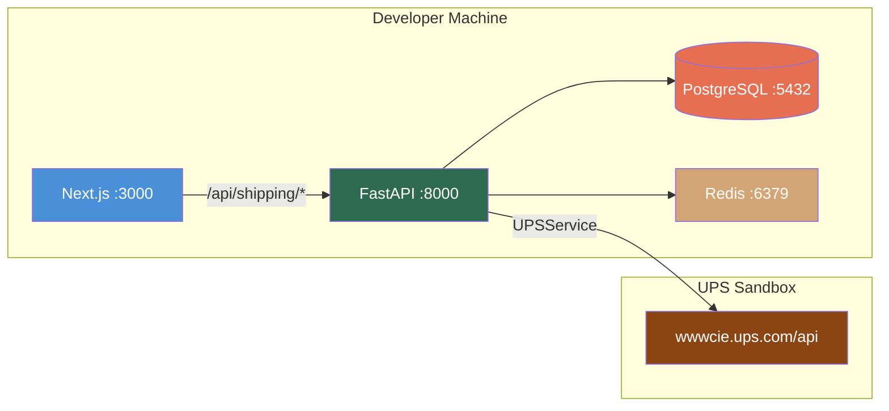

# UPS API Setup Guide for PMS Integration

**Document ID:** PMS-EXP-UPSAPI-001
**Version:** 1.0
**Date:** 2026-03-10
**Applies To:** PMS project (all platforms)
**Prerequisites Level:** Intermediate

---

## Table of Contents

1. [Overview](#1-overview)
2. [Prerequisites](#2-prerequisites)
3. [Part A: UPS Developer Account & OAuth Setup](#3-part-a-ups-developer-account--oauth-setup)
4. [Part B: Integrate with PMS Backend](#4-part-b-integrate-with-pms-backend)
5. [Part C: Integrate with PMS Frontend](#5-part-c-integrate-with-pms-frontend)
6. [Part D: Testing and Verification](#6-part-d-testing-and-verification)
7. [Troubleshooting](#7-troubleshooting)
8. [Reference Commands](#8-reference-commands)

---

## 1. Overview

This guide walks you through setting up UPS API integration with the PMS, from creating a UPS Developer account to having a working shipping workflow in your local development environment. By the end, you will have:

- A UPS Developer application with OAuth 2.0 credentials
- A `UPSService` Python class in the FastAPI backend with address validation, rating, shipment creation, and tracking
- PostgreSQL tables for shipments, tracking events, and audit logs
- A Next.js shipping panel component in the patient detail view
- End-to-end tests running against the UPS sandbox environment



## 2. Prerequisites

### 2.1 Required Software

| Software | Minimum Version | Check Command |
|----------|----------------|---------------|
| Python | 3.11+ | `python --version` |
| Node.js | 18+ | `node --version` |
| PostgreSQL | 15+ | `psql --version` |
| Redis | 7+ | `redis-cli --version` |
| Docker & Docker Compose | 24+ / 2.20+ | `docker --version && docker compose version` |
| httpx (Python) | 0.25+ | `pip show httpx` |
| curl | any | `curl --version` |

### 2.2 Installation of Prerequisites

If `httpx` is not installed in your PMS backend virtual environment:

```bash
cd backend/
source .venv/bin/activate
pip install httpx
```

### 2.3 Verify PMS Services

Confirm the PMS backend, frontend, and database are running:

```bash
# Backend health check
curl -s http://localhost:8000/health | jq .
# Expected: {"status": "ok"}

# Frontend
curl -s -o /dev/null -w "%{http_code}" http://localhost:3000
# Expected: 200

# PostgreSQL
psql -h localhost -U pms -d pms_dev -c "SELECT 1;"
# Expected: 1

# Redis
redis-cli ping
# Expected: PONG
```

**Checkpoint:** All four services respond as expected.

## 3. Part A: UPS Developer Account & OAuth Setup

### Step 1: Create a UPS Account

1. Go to [ups.com](https://www.ups.com/) and click **Sign Up**
2. Complete registration with your business details (use MPS Inc. as the company)
3. Verify your email address

### Step 2: Register a Developer Application

1. Navigate to [developer.ups.com](https://developer.ups.com/)
2. Sign in with your UPS account
3. Click **My Apps** → **Create App**
4. Fill in:
   - **App Name:** `PMS-Shipping-Dev`
   - **Description:** `Patient Management System shipping integration`
   - **Callback URL:** `http://localhost:8000/api/shipping/oauth/callback` (for Authorization Code flow, optional)
5. Select the APIs you need: **Shipping, Tracking, Rating, Address Validation, Dangerous Goods**
6. Click **Create**
7. Copy your **Client ID** and **Client Secret**

### Step 3: Store Credentials Securely

Create a `.env.shipping` file (gitignored):

```bash
# .env.shipping — DO NOT COMMIT
UPS_CLIENT_ID=your_client_id_here
UPS_CLIENT_SECRET=your_client_secret_here
UPS_BASE_URL=https://wwwcie.ups.com/api
UPS_OAUTH_URL=https://wwwcie.ups.com/security/v1/oauth/token
UPS_ACCOUNT_NUMBER=your_shipper_account_number
```

Add to `.gitignore`:

```
.env.shipping
```

### Step 4: Test OAuth Token Retrieval

```bash
# Request a bearer token from UPS sandbox
curl -s -X POST https://wwwcie.ups.com/security/v1/oauth/token \
  -H "Content-Type: application/x-www-form-urlencoded" \
  -u "${UPS_CLIENT_ID}:${UPS_CLIENT_SECRET}" \
  -d "grant_type=client_credentials" | jq .
```

Expected response:

```json
{
  "token_type": "Bearer",
  "issued_at": "1710072000000",
  "client_id": "your_client_id",
  "access_token": "eyJraWQ...",
  "expires_in": "14399",
  "status": "approved"
}
```

**Checkpoint:** You have a valid UPS Developer application with OAuth credentials and can retrieve a bearer token from the sandbox.

## 4. Part B: Integrate with PMS Backend

### Step 1: Create PostgreSQL Schema

```sql
-- migrations/shipping_001_initial.sql

CREATE TABLE shipments (
    id UUID PRIMARY KEY DEFAULT gen_random_uuid(),
    patient_id UUID NOT NULL REFERENCES patients(id),
    encounter_id UUID REFERENCES encounters(id),
    tracking_number VARCHAR(30),
    ups_shipment_id VARCHAR(50),
    service_code VARCHAR(10) NOT NULL,          -- '03' (Ground), '02' (2nd Day), '01' (Next Day)
    service_description VARCHAR(100),
    status VARCHAR(20) DEFAULT 'created',       -- created, in_transit, delivered, returned, exception
    ship_from_name VARCHAR(100) NOT NULL,
    ship_from_address JSONB NOT NULL,
    ship_to_name VARCHAR(100) NOT NULL,
    ship_to_address JSONB NOT NULL,
    package_weight_lbs DECIMAL(6,2),
    package_dimensions JSONB,                   -- {length, width, height, unit}
    label_format VARCHAR(10) DEFAULT 'PNG',     -- PNG, GIF, ZPL, EPL
    label_image BYTEA,
    is_return_shipment BOOLEAN DEFAULT FALSE,
    dangerous_goods_type VARCHAR(20),           -- UN3373, UN1845, null
    rate_amount DECIMAL(10,2),
    rate_currency VARCHAR(3) DEFAULT 'USD',
    estimated_delivery DATE,
    actual_delivery TIMESTAMPTZ,
    created_by UUID NOT NULL,
    created_at TIMESTAMPTZ DEFAULT NOW(),
    updated_at TIMESTAMPTZ DEFAULT NOW()
);

CREATE TABLE shipment_tracking_events (
    id UUID PRIMARY KEY DEFAULT gen_random_uuid(),
    shipment_id UUID NOT NULL REFERENCES shipments(id),
    tracking_number VARCHAR(30) NOT NULL,
    status_code VARCHAR(10),
    status_description VARCHAR(200),
    location_city VARCHAR(100),
    location_state VARCHAR(50),
    location_country VARCHAR(3),
    event_timestamp TIMESTAMPTZ NOT NULL,
    signed_by VARCHAR(100),
    created_at TIMESTAMPTZ DEFAULT NOW()
);

CREATE TABLE shipment_audit_log (
    id UUID PRIMARY KEY DEFAULT gen_random_uuid(),
    user_id UUID NOT NULL,
    patient_id UUID,
    action VARCHAR(50) NOT NULL,                -- token_request, address_validate, rate_shop, ship_create, track_query
    request_hash VARCHAR(64),                   -- SHA-256 of request payload
    response_status INT,
    response_hash VARCHAR(64),                  -- SHA-256 of response payload
    ip_address INET,
    created_at TIMESTAMPTZ DEFAULT NOW()
);

CREATE INDEX idx_shipments_patient ON shipments(patient_id);
CREATE INDEX idx_shipments_tracking ON shipments(tracking_number);
CREATE INDEX idx_shipments_status ON shipments(status);
CREATE INDEX idx_tracking_events_shipment ON shipment_tracking_events(shipment_id);
CREATE INDEX idx_tracking_events_timestamp ON shipment_tracking_events(event_timestamp);
CREATE INDEX idx_audit_log_patient ON shipment_audit_log(patient_id);
CREATE INDEX idx_audit_log_created ON shipment_audit_log(created_at);
```

Run the migration:

```bash
psql -h localhost -U pms -d pms_dev -f migrations/shipping_001_initial.sql
```

### Step 2: Create the UPS Service

Create `backend/app/services/ups_service.py`:

```python
"""UPS API integration service for PMS shipping operations."""

import hashlib
import time
from decimal import Decimal
from typing import Any

import httpx

from app.core.config import settings


class UPSAuthManager:
    """Manages OAuth 2.0 token lifecycle with automatic refresh."""

    def __init__(self) -> None:
        self._token: str | None = None
        self._expires_at: float = 0

    async def get_token(self, client: httpx.AsyncClient) -> str:
        if self._token and time.time() < self._expires_at:
            return self._token

        response = await client.post(
            settings.UPS_OAUTH_URL,
            data={"grant_type": "client_credentials"},
            auth=(settings.UPS_CLIENT_ID, settings.UPS_CLIENT_SECRET),
            headers={"Content-Type": "application/x-www-form-urlencoded"},
        )
        response.raise_for_status()
        data = response.json()
        self._token = data["access_token"]
        # Refresh 2 minutes before expiry
        self._expires_at = time.time() + int(data["expires_in"]) - 120
        return self._token


class UPSService:
    """UPS API client for address validation, rating, shipping, and tracking."""

    def __init__(self) -> None:
        self._auth = UPSAuthManager()
        self._base_url = settings.UPS_BASE_URL

    async def _request(
        self,
        method: str,
        path: str,
        json_data: dict[str, Any] | None = None,
    ) -> dict[str, Any]:
        """Make an authenticated request to the UPS API."""
        async with httpx.AsyncClient(timeout=30.0) as client:
            token = await self._auth.get_token(client)
            response = await client.request(
                method,
                f"{self._base_url}{path}",
                json=json_data,
                headers={
                    "Authorization": f"Bearer {token}",
                    "Content-Type": "application/json",
                    "transId": hashlib.sha256(
                        str(time.time()).encode()
                    ).hexdigest()[:32],
                    "transactionSrc": "PMS-Shipping",
                },
            )
            response.raise_for_status()
            return response.json()

    async def validate_address(
        self,
        address_lines: list[str],
        city: str,
        state: str,
        postal_code: str,
        country_code: str = "US",
    ) -> dict[str, Any]:
        """Validate and standardize an address via UPS Address Validation API."""
        payload = {
            "XAVRequest": {
                "AddressKeyFormat": {
                    "AddressLine": address_lines,
                    "PoliticalDivision2": city,
                    "PoliticalDivision1": state,
                    "PostcodePrimaryLow": postal_code,
                    "CountryCode": country_code,
                }
            }
        }
        return await self._request("POST", "/addressvalidation/v2/3", payload)

    async def get_rates(
        self,
        ship_from: dict[str, Any],
        ship_to: dict[str, Any],
        weight_lbs: float,
        package_type: str = "02",  # Customer Supplied Package
    ) -> dict[str, Any]:
        """Get rate estimates for all available UPS services."""
        payload = {
            "RateRequest": {
                "Request": {"SubVersion": "2403"},
                "Shipment": {
                    "Shipper": {
                        "ShipperNumber": settings.UPS_ACCOUNT_NUMBER,
                        "Address": ship_from,
                    },
                    "ShipTo": {"Address": ship_to},
                    "ShipFrom": {"Address": ship_from},
                    "Package": {
                        "PackagingType": {"Code": package_type},
                        "PackageWeight": {
                            "UnitOfMeasurement": {"Code": "LBS"},
                            "Weight": str(weight_lbs),
                        },
                    },
                },
            }
        }
        return await self._request("POST", "/rating/v2403/Shop", payload)

    async def create_shipment(
        self,
        ship_from: dict[str, Any],
        ship_to: dict[str, Any],
        ship_from_name: str,
        ship_to_name: str,
        weight_lbs: float,
        service_code: str = "03",  # UPS Ground
        label_format: str = "PNG",
        description: str = "Medical Supplies",
    ) -> dict[str, Any]:
        """Create a shipment and generate a shipping label."""
        payload = {
            "ShipmentRequest": {
                "Request": {"SubVersion": "2409"},
                "Shipment": {
                    "Description": description,
                    "Shipper": {
                        "Name": "MPS Inc.",
                        "ShipperNumber": settings.UPS_ACCOUNT_NUMBER,
                        "Address": ship_from,
                    },
                    "ShipTo": {
                        "Name": ship_to_name,
                        "Address": ship_to,
                    },
                    "ShipFrom": {
                        "Name": ship_from_name,
                        "Address": ship_from,
                    },
                    "Service": {"Code": service_code},
                    "Package": {
                        "PackagingType": {"Code": "02"},
                        "PackageWeight": {
                            "UnitOfMeasurement": {"Code": "LBS"},
                            "Weight": str(weight_lbs),
                        },
                    },
                    "PaymentInformation": {
                        "ShipmentCharge": {
                            "Type": "01",
                            "BillShipper": {
                                "AccountNumber": settings.UPS_ACCOUNT_NUMBER
                            },
                        }
                    },
                },
                "LabelSpecification": {
                    "LabelImageFormat": {"Code": label_format},
                    "LabelStockSize": {"Height": "6", "Width": "4"},
                },
            }
        }
        return await self._request(
            "POST", "/shipments/v2409/ship", payload
        )

    async def track_shipment(self, tracking_number: str) -> dict[str, Any]:
        """Get tracking details for a shipment."""
        return await self._request(
            "GET",
            f"/track/v1/details/{tracking_number}",
        )

    async def check_dangerous_goods(
        self,
        material_id: str,
        transport_mode: str = "AIR",
    ) -> dict[str, Any]:
        """Pre-check dangerous goods compliance for biological specimens."""
        payload = {
            "ChemicalReferenceDataRequest": {
                "Request": {},
                "ChemicalData": {
                    "ChemicalDetail": {
                        "RegulationSet": "IATA",
                        "IDNumber": material_id,  # e.g., "UN3373"
                        "TransportMode": transport_mode,
                    }
                },
            }
        }
        return await self._request(
            "POST", "/dangerousgoods/v1/chemicalreferencedata", payload
        )
```

### Step 3: Add Configuration

Add to `backend/app/core/config.py`:

```python
# UPS API Configuration
UPS_CLIENT_ID: str = os.getenv("UPS_CLIENT_ID", "")
UPS_CLIENT_SECRET: str = os.getenv("UPS_CLIENT_SECRET", "")
UPS_BASE_URL: str = os.getenv("UPS_BASE_URL", "https://wwwcie.ups.com/api")
UPS_OAUTH_URL: str = os.getenv(
    "UPS_OAUTH_URL",
    "https://wwwcie.ups.com/security/v1/oauth/token",
)
UPS_ACCOUNT_NUMBER: str = os.getenv("UPS_ACCOUNT_NUMBER", "")
```

### Step 4: Create FastAPI Endpoints

Create `backend/app/api/routes/shipping.py`:

```python
"""Shipping API endpoints for UPS integration."""

from uuid import UUID

from fastapi import APIRouter, Depends, HTTPException
from pydantic import BaseModel

from app.services.ups_service import UPSService

router = APIRouter(prefix="/api/shipping", tags=["shipping"])
ups_service = UPSService()


class AddressValidationRequest(BaseModel):
    address_lines: list[str]
    city: str
    state: str
    postal_code: str
    country_code: str = "US"


class RateRequest(BaseModel):
    patient_id: UUID
    weight_lbs: float


class ShipmentRequest(BaseModel):
    patient_id: UUID
    encounter_id: UUID | None = None
    service_code: str = "03"
    weight_lbs: float
    label_format: str = "PNG"
    description: str = "Medical Supplies"
    dangerous_goods_type: str | None = None


@router.post("/validate-address")
async def validate_address(req: AddressValidationRequest):
    """Validate a shipping address via UPS Address Validation API."""
    result = await ups_service.validate_address(
        address_lines=req.address_lines,
        city=req.city,
        state=req.state,
        postal_code=req.postal_code,
        country_code=req.country_code,
    )
    return result


@router.post("/rates")
async def get_shipping_rates(req: RateRequest):
    """Get available UPS shipping rates for a patient's address."""
    # In production: look up patient address from /api/patients/{patient_id}
    # For now, use clinic address as origin
    ship_from = {
        "AddressLine": ["100 Main St"],
        "City": "Dallas",
        "StateProvinceCode": "TX",
        "PostalCode": "75201",
        "CountryCode": "US",
    }
    # TODO: Fetch patient address from Patient Records API
    ship_to = ship_from  # Placeholder
    result = await ups_service.get_rates(
        ship_from=ship_from,
        ship_to=ship_to,
        weight_lbs=req.weight_lbs,
    )
    return result


@router.post("/shipments")
async def create_shipment(req: ShipmentRequest):
    """Create a UPS shipment and generate a label."""
    if req.dangerous_goods_type:
        dg_result = await ups_service.check_dangerous_goods(
            material_id=req.dangerous_goods_type
        )
        # Validate DG compliance before proceeding
    result = await ups_service.create_shipment(
        ship_from={
            "AddressLine": ["100 Main St"],
            "City": "Dallas",
            "StateProvinceCode": "TX",
            "PostalCode": "75201",
            "CountryCode": "US",
        },
        ship_to={
            "AddressLine": ["200 Oak Ave"],
            "City": "Houston",
            "StateProvinceCode": "TX",
            "PostalCode": "77001",
            "CountryCode": "US",
        },
        ship_from_name="TRA Clinic",
        ship_to_name="Patient Name",  # TODO: Fetch from Patient Records API
        weight_lbs=req.weight_lbs,
        service_code=req.service_code,
        label_format=req.label_format,
        description=req.description,
    )
    return result


@router.get("/track/{tracking_number}")
async def track_shipment(tracking_number: str):
    """Get tracking status for a UPS shipment."""
    result = await ups_service.track_shipment(tracking_number)
    return result
```

### Step 5: Register the Router

In `backend/app/main.py`, add:

```python
from app.api.routes.shipping import router as shipping_router

app.include_router(shipping_router)
```

**Checkpoint:** The FastAPI backend has a `UPSService` class, shipping endpoints, and PostgreSQL schema. You can start the backend and see the shipping endpoints in the Swagger docs at `http://localhost:8000/docs`.

## 5. Part C: Integrate with PMS Frontend

### Step 1: Add Environment Variables

In `frontend/.env.local`:

```
NEXT_PUBLIC_API_URL=http://localhost:8000
```

### Step 2: Create the Shipping API Client

Create `frontend/src/lib/shipping-api.ts`:

```typescript
const API_BASE = process.env.NEXT_PUBLIC_API_URL || "http://localhost:8000";

export interface ShippingRate {
  serviceCode: string;
  serviceName: string;
  totalCharge: string;
  currency: string;
  estimatedDelivery: string;
  guaranteed: boolean;
}

export interface TrackingEvent {
  status: string;
  description: string;
  location: string;
  timestamp: string;
  signedBy?: string;
}

export async function validateAddress(address: {
  addressLines: string[];
  city: string;
  state: string;
  postalCode: string;
}) {
  const res = await fetch(`${API_BASE}/api/shipping/validate-address`, {
    method: "POST",
    headers: { "Content-Type": "application/json" },
    body: JSON.stringify({
      address_lines: address.addressLines,
      city: address.city,
      state: address.state,
      postal_code: address.postalCode,
    }),
  });
  return res.json();
}

export async function getShippingRates(
  patientId: string,
  weightLbs: number
): Promise<ShippingRate[]> {
  const res = await fetch(`${API_BASE}/api/shipping/rates`, {
    method: "POST",
    headers: { "Content-Type": "application/json" },
    body: JSON.stringify({ patient_id: patientId, weight_lbs: weightLbs }),
  });
  const data = await res.json();
  // Transform UPS response into ShippingRate[]
  const rates =
    data?.RateResponse?.RatedShipment?.map((r: any) => ({
      serviceCode: r.Service.Code,
      serviceName: getServiceName(r.Service.Code),
      totalCharge: r.TotalCharges.MonetaryValue,
      currency: r.TotalCharges.CurrencyCode,
      estimatedDelivery: r.GuaranteedDelivery?.DeliveryByTime || "N/A",
      guaranteed: !!r.GuaranteedDelivery,
    })) || [];
  return rates;
}

export async function trackShipment(
  trackingNumber: string
): Promise<TrackingEvent[]> {
  const res = await fetch(
    `${API_BASE}/api/shipping/track/${trackingNumber}`
  );
  const data = await res.json();
  // Transform UPS tracking response
  const activities =
    data?.trackResponse?.shipment?.[0]?.package?.[0]?.activity || [];
  return activities.map((a: any) => ({
    status: a.status?.type || "",
    description: a.status?.description || "",
    location: [
      a.location?.address?.city,
      a.location?.address?.stateProvince,
    ]
      .filter(Boolean)
      .join(", "),
    timestamp: a.date + " " + a.time,
    signedBy: a.status?.type === "D" ? a.signedForByName : undefined,
  }));
}

function getServiceName(code: string): string {
  const services: Record<string, string> = {
    "01": "UPS Next Day Air",
    "02": "UPS 2nd Day Air",
    "03": "UPS Ground",
    "12": "UPS 3 Day Select",
    "13": "UPS Next Day Air Saver",
    "14": "UPS Next Day Air Early",
    "59": "UPS 2nd Day Air A.M.",
  };
  return services[code] || `UPS Service ${code}`;
}
```

### Step 3: Create the Shipping Panel Component

Create `frontend/src/components/shipping/ShippingPanel.tsx`:

```tsx
"use client";

import { useState } from "react";
import {
  getShippingRates,
  trackShipment,
  type ShippingRate,
  type TrackingEvent,
} from "@/lib/shipping-api";

interface ShippingPanelProps {
  patientId: string;
  patientName: string;
}

export function ShippingPanel({ patientId, patientName }: ShippingPanelProps) {
  const [rates, setRates] = useState<ShippingRate[]>([]);
  const [tracking, setTracking] = useState<TrackingEvent[]>([]);
  const [trackingNumber, setTrackingNumber] = useState("");
  const [loading, setLoading] = useState(false);
  const [activeTab, setActiveTab] = useState<"ship" | "track">("ship");

  const handleGetRates = async () => {
    setLoading(true);
    try {
      const result = await getShippingRates(patientId, 2.0);
      setRates(result);
    } finally {
      setLoading(false);
    }
  };

  const handleTrack = async () => {
    if (!trackingNumber) return;
    setLoading(true);
    try {
      const events = await trackShipment(trackingNumber);
      setTracking(events);
    } finally {
      setLoading(false);
    }
  };

  return (
    <div className="border rounded-lg p-4 bg-white shadow-sm">
      <h3 className="text-lg font-semibold mb-3">
        Shipping — {patientName}
      </h3>

      <div className="flex gap-2 mb-4">
        <button
          onClick={() => setActiveTab("ship")}
          className={`px-3 py-1 rounded text-sm ${
            activeTab === "ship"
              ? "bg-blue-600 text-white"
              : "bg-gray-100 text-gray-700"
          }`}
        >
          New Shipment
        </button>
        <button
          onClick={() => setActiveTab("track")}
          className={`px-3 py-1 rounded text-sm ${
            activeTab === "track"
              ? "bg-blue-600 text-white"
              : "bg-gray-100 text-gray-700"
          }`}
        >
          Track
        </button>
      </div>

      {activeTab === "ship" && (
        <div>
          <button
            onClick={handleGetRates}
            disabled={loading}
            className="bg-green-600 text-white px-4 py-2 rounded text-sm hover:bg-green-700 disabled:opacity-50"
          >
            {loading ? "Loading..." : "Get Shipping Rates"}
          </button>
          {rates.length > 0 && (
            <table className="mt-3 w-full text-sm">
              <thead>
                <tr className="border-b">
                  <th className="text-left py-1">Service</th>
                  <th className="text-left py-1">Cost</th>
                  <th className="text-left py-1">Delivery</th>
                  <th></th>
                </tr>
              </thead>
              <tbody>
                {rates.map((r) => (
                  <tr key={r.serviceCode} className="border-b">
                    <td className="py-1">{r.serviceName}</td>
                    <td className="py-1">
                      ${r.totalCharge} {r.currency}
                    </td>
                    <td className="py-1">{r.estimatedDelivery}</td>
                    <td className="py-1">
                      <button className="text-blue-600 hover:underline text-xs">
                        Select
                      </button>
                    </td>
                  </tr>
                ))}
              </tbody>
            </table>
          )}
        </div>
      )}

      {activeTab === "track" && (
        <div>
          <div className="flex gap-2 mb-3">
            <input
              type="text"
              value={trackingNumber}
              onChange={(e) => setTrackingNumber(e.target.value)}
              placeholder="Enter tracking number"
              className="border rounded px-3 py-1 text-sm flex-1"
            />
            <button
              onClick={handleTrack}
              disabled={loading}
              className="bg-blue-600 text-white px-4 py-1 rounded text-sm hover:bg-blue-700 disabled:opacity-50"
            >
              {loading ? "..." : "Track"}
            </button>
          </div>
          {tracking.length > 0 && (
            <ul className="space-y-2">
              {tracking.map((e, i) => (
                <li key={i} className="text-sm border-l-2 border-blue-400 pl-3">
                  <p className="font-medium">{e.description}</p>
                  <p className="text-gray-500">
                    {e.location} — {e.timestamp}
                  </p>
                  {e.signedBy && (
                    <p className="text-green-600">Signed by: {e.signedBy}</p>
                  )}
                </li>
              ))}
            </ul>
          )}
        </div>
      )}
    </div>
  );
}
```

**Checkpoint:** The frontend has a shipping API client and a `ShippingPanel` component ready to be added to patient detail pages.

## 6. Part D: Testing and Verification

### Test 1: OAuth Token

```bash
source .env.shipping
curl -s -X POST "${UPS_OAUTH_URL}" \
  -H "Content-Type: application/x-www-form-urlencoded" \
  -u "${UPS_CLIENT_ID}:${UPS_CLIENT_SECRET}" \
  -d "grant_type=client_credentials" | jq '.access_token[:20]'
# Expected: "eyJraWQ..." (truncated token)
```

### Test 2: Address Validation (via PMS)

```bash
curl -s -X POST http://localhost:8000/api/shipping/validate-address \
  -H "Content-Type: application/json" \
  -d '{
    "address_lines": ["100 Main St"],
    "city": "Dallas",
    "state": "TX",
    "postal_code": "75201"
  }' | jq '.XAVResponse.Candidate[0].AddressKeyFormat'
```

### Test 3: Rate Shopping (via PMS)

```bash
curl -s -X POST http://localhost:8000/api/shipping/rates \
  -H "Content-Type: application/json" \
  -d '{
    "patient_id": "00000000-0000-0000-0000-000000000001",
    "weight_lbs": 2.5
  }' | jq '.RateResponse.RatedShipment[] | {service: .Service.Code, cost: .TotalCharges.MonetaryValue}'
```

### Test 4: Tracking (via PMS)

```bash
# Use a UPS sandbox test tracking number
curl -s http://localhost:8000/api/shipping/track/1Z12345E0205271688 | jq '.trackResponse.shipment[0].package[0].activity[0].status'
```

### Test 5: Database Schema

```bash
psql -h localhost -U pms -d pms_dev -c "\dt shipment*"
# Expected: shipments, shipment_tracking_events, shipment_audit_log
```

**Checkpoint:** All five tests pass — OAuth works, address validation returns candidates, rate shopping returns service options, tracking returns status, and database tables exist.

## 7. Troubleshooting

### OAuth 401 Unauthorized

**Symptom:** `{"response": {"errors": [{"code": "10401", "message": "ClientId is invalid"}]}}`

**Solution:**
1. Verify `UPS_CLIENT_ID` and `UPS_CLIENT_SECRET` are correct (no trailing whitespace)
2. Ensure you're using the sandbox URL (`wwwcie.ups.com`) not production
3. Check that your app is activated at [developer.ups.com](https://developer.ups.com/) → My Apps

### Address Validation Returns No Candidates

**Symptom:** `XAVResponse` has no `Candidate` array

**Solution:**
1. Ensure address is a US address (Address Validation only supports US & Puerto Rico)
2. Check that `AddressLine` is a list, not a string
3. Try a known-valid address first: `["1 Wall St"], "New York", "NY", "10005"`

### Rate Shopping Returns 400 Bad Request

**Symptom:** `{"response": {"errors": [{"code": "111100"}]}}`

**Solution:**
1. Verify `UPS_ACCOUNT_NUMBER` is set and valid for the sandbox environment
2. Ensure weight is a string in the payload (e.g., `"2.5"` not `2.5`)
3. Check that `CountryCode` is included in both `ShipFrom` and `ShipTo`

### Port 8000 Connection Refused

**Symptom:** `curl: (7) Failed to connect to localhost port 8000`

**Solution:**
1. Verify the FastAPI backend is running: `ps aux | grep uvicorn`
2. Check for port conflicts: `lsof -i :8000`
3. Start the backend: `cd backend && uvicorn app.main:app --reload --port 8000`

### SSL Certificate Errors

**Symptom:** `httpx.ConnectError: [SSL: CERTIFICATE_VERIFY_FAILED]`

**Solution:**
1. Update your CA certificates: `pip install certifi --upgrade`
2. On macOS: run `/Applications/Python 3.x/Install Certificates.command`
3. As a last resort for sandbox only: set `verify=False` in httpx client (never in production)

## 8. Reference Commands

### Daily Development

```bash
# Start backend with shipping env vars loaded
source .env.shipping && cd backend && uvicorn app.main:app --reload --port 8000

# Start frontend
cd frontend && npm run dev

# Run shipping integration tests
cd backend && pytest tests/test_shipping.py -v
```

### UPS API Quick Tests

```bash
# Get fresh OAuth token
source .env.shipping && curl -s -X POST "${UPS_OAUTH_URL}" \
  -u "${UPS_CLIENT_ID}:${UPS_CLIENT_SECRET}" \
  -d "grant_type=client_credentials" | jq -r '.access_token'

# Validate an address
TOKEN=$(curl -s -X POST "${UPS_OAUTH_URL}" \
  -u "${UPS_CLIENT_ID}:${UPS_CLIENT_SECRET}" \
  -d "grant_type=client_credentials" | jq -r '.access_token')

curl -s -X POST "https://wwwcie.ups.com/api/addressvalidation/v2/3" \
  -H "Authorization: Bearer ${TOKEN}" \
  -H "Content-Type: application/json" \
  -d '{"XAVRequest":{"AddressKeyFormat":{"AddressLine":["1 Wall St"],"PoliticalDivision2":"New York","PoliticalDivision1":"NY","PostcodePrimaryLow":"10005","CountryCode":"US"}}}' | jq .
```

### Useful URLs

| Resource | URL |
|----------|-----|
| UPS Developer Portal | https://developer.ups.com/ |
| UPS API Reference | https://developer.ups.com/api/reference |
| UPS Sandbox Base URL | https://wwwcie.ups.com/api/ |
| UPS Production Base URL | https://onlinetools.ups.com/api/ |
| PMS Shipping Swagger | http://localhost:8000/docs#/shipping |
| PMS Frontend | http://localhost:3000 |

## Next Steps

After completing this setup guide:

1. Work through the [UPS API Developer Tutorial](66-UPSAPI-Developer-Tutorial.md) to build a specimen shipping workflow end-to-end
2. Review the [UPS API PRD](66-PRD-UPSAPI-PMS-Integration.md) for the full integration roadmap
3. Explore the [FedEx API PRD (Experiment 65)](65-PRD-FedExAPI-PMS-Integration.md) for multi-carrier shipping

## Resources

- [UPS Developer Portal](https://developer.ups.com/) — API registration and management
- [UPS API Reference](https://developer.ups.com/api/reference) — Endpoint documentation
- [UPS OAuth Developer Guide](https://developer.ups.com/oauth-developer-guide) — Authentication guide
- [UPS-API GitHub](https://github.com/UPS-API/api-documentation) — OpenAPI specs
- [UPS-API Python SDK](https://github.com/UPS-API/UPS-SDKs/tree/Python) — Official Python SDK
- [UPS Healthcare](https://www.ups.com/us/en/healthcare/home) — Healthcare logistics division
