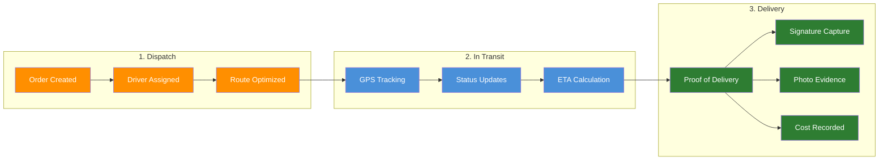
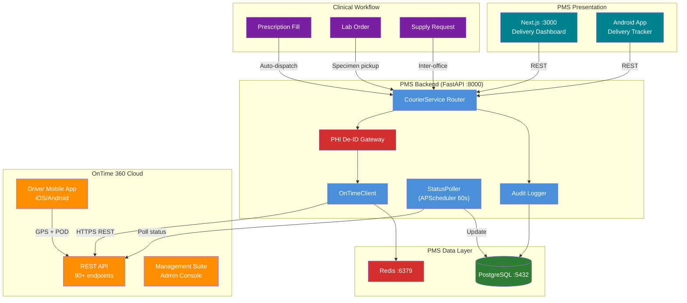

# OnTime 360 API Developer Onboarding Tutorial

**Welcome to the MPS PMS OnTime 360 API Integration Team**

This tutorial will take you from zero to building your first courier delivery integration with the PMS. By the end, you will understand how OnTime 360's REST API works, have a running local environment, and have built and tested a custom medical delivery workflow end-to-end.

**Document ID:** PMS-EXP-ONTIME360API-002
**Version:** 1.0
**Date:** 2026-03-10
**Applies To:** PMS project (all platforms)
**Prerequisite:** [OnTime 360 API Setup Guide](67-OnTime360API-PMS-Developer-Setup-Guide.md)
**Estimated time:** 2-3 hours
**Difficulty:** Beginner-friendly

---

## What You Will Learn

1. What OnTime 360 is and why the PMS needs a courier dispatch integration
2. How the OnTime 360 REST API is structured (endpoints, authentication, data models)
3. How PHI de-identification protects patient data in courier operations
4. How to create, track, and complete delivery orders programmatically
5. How to retrieve driver GPS positions in real-time
6. How to capture and store proof-of-delivery (signatures, photos)
7. How the StatusPoller background task automates delivery tracking
8. How to build a delivery cost report tied to patient encounters
9. How OnTime 360 complements the FedEx API for local vs. national logistics
10. HIPAA security requirements for medical courier integrations

## Part 1: Understanding OnTime 360 (15 min read)

### 1.1 What Problem Does OnTime 360 Solve?

The PMS manages patient records, encounters, prescriptions, and reports — but when a physical item needs to move between locations (a lab specimen to a reference lab, a medication to a patient's home, surgical supplies between clinic locations), the system has no visibility. Staff coordinate deliveries through phone calls, text messages, and paper logs.

This creates several problems:
- **No chain-of-custody**: Controlled medications and lab specimens change hands without digital documentation — a HIPAA audit risk
- **No delivery status visibility**: Patients call asking "Where is my medication?" and staff have no answer
- **No proof-of-delivery**: When a $2,000 anti-VEGF injection is delivered, there's no digital signature or photo confirming receipt
- **No cost tracking**: Delivery expenses are reconciled manually from courier invoices — impossible to attribute costs to specific encounters or departments

OnTime 360 solves this by providing a **dispatch and delivery management platform** with a comprehensive REST API. The PMS creates delivery orders programmatically, tracks driver positions in real-time, captures proof-of-delivery, and logs costs — all without staff leaving the PMS interface.

### 1.2 How OnTime 360 Works — The Key Pieces



**Concept 1: Orders** — The fundamental unit. An order represents a delivery request with pickup location, delivery destination, priority, handling instructions, and status. Orders progress through statuses: Submitted → Dispatched → In Transit → Delivered (or Cancelled).

**Concept 2: Users (Drivers)** — OnTime tracks courier drivers via the mobile app. Each driver has a real-time GPS position, availability status, and assigned orders. The API lets you query driver positions and availability.

**Concept 3: Proof-of-Delivery (POD)** — When a driver completes a delivery, they can capture a signature, photo, GPS coordinates, and recipient name through the OnTime mobile app. The API provides endpoints to retrieve these artifacts.

### 1.3 How OnTime 360 Fits with Other PMS Technologies

| Technology | Layer | Relationship to OnTime 360 |
|---|---|---|
| FedEx API (Exp. 65) | National Shipping | Complementary — FedEx ships nationally, OnTime dispatches locally |
| Availity API (Exp. 47) | Insurance/Payer | Upstream — Availity confirms coverage before OnTime delivers medications |
| FHIR Prior Auth (Exp. 48) | Authorization | Upstream — PA approval triggers medication dispatch via OnTime |
| Kafka (Exp. 38) | Event Streaming | Integration — delivery events published to Kafka topics for downstream consumers |
| WebSocket (Exp. 37) | Real-Time UI | Integration — driver position updates pushed to dashboard via WebSocket |
| Docker (Exp. 39) | Deployment | Infrastructure — OnTimeClient runs inside the Dockerized FastAPI container |
| n8n (Exp. 34) | Workflow Automation | Integration — n8n workflows can trigger courier dispatch based on prescription events |

### 1.4 Key Vocabulary

| Term | Meaning |
|---|---|
| Company ID | Unique identifier for your OnTime 360 account — appears in all API URLs |
| Order | A delivery request with pickup/delivery locations, status, and cost |
| Status | Current phase of an order (Submitted, Dispatched, In Transit, Delivered, Cancelled) |
| Contact | A person associated with a pickup or delivery (sender/recipient) |
| Customer | An organization that places delivery orders (e.g., the practice itself) |
| Location | A physical address registered in OnTime for pickup/delivery points |
| User | An OnTime user — drivers, dispatchers, or administrators |
| File Attachment | Documents, photos, or signatures attached to an order |
| Price Set | A configured pricing structure for calculating delivery costs |
| Price Modifier | Surcharges or discounts applied to delivery pricing (urgency, distance, etc.) |
| Smart Client | OnTime's desktop application that works offline during connectivity outages |
| Extension SDK | .NET SDK for building desktop extensions to OnTime Management Suite |

### 1.5 Our Architecture



## Part 2: Environment Verification (15 min)

### 2.1 Checklist

Before building, verify your environment:

1. **PMS Backend running**:
   ```bash
   curl -s http://localhost:8000/docs | grep -c "swagger"
   # Expected: 1 or more
   ```

2. **PostgreSQL accessible**:
   ```bash
   psql -U pms_user -d pms_db -c "SELECT COUNT(*) FROM courier_orders;"
   # Expected: 0 (empty table after migration)
   ```

3. **Redis available**:
   ```bash
   redis-cli ping
   # Expected: PONG
   ```

4. **OnTime API key configured**:
   ```bash
   echo $ONTIME_API_KEY | head -c 8
   # Expected: First 8 characters of your API key
   ```

5. **OnTime API reachable**:
   ```bash
   curl -s -o /dev/null -w "%{http_code}" \
     -H "Authorization: Bearer $ONTIME_API_KEY" \
     "$ONTIME_BASE_URL/statuses"
   # Expected: 200
   ```

6. **Next.js frontend running**:
   ```bash
   curl -s -o /dev/null -w "%{http_code}" http://localhost:3000
   # Expected: 200
   ```

### 2.2 Quick Test

Run one end-to-end test to confirm the full stack works:

```bash
# List available order statuses from OnTime 360 via PMS backend
curl -s -H "Authorization: Bearer $PMS_TOKEN" \
  http://localhost:8000/api/courier/drivers | python -m json.tool

# Expected: JSON with "drivers" array (may be empty if no drivers are active)
```

If you get a JSON response (even with an empty array), your stack is connected and working.

## Part 3: Build Your First Integration (45 min)

### 3.1 What We Are Building

We'll build a **Lab Specimen Courier Workflow** — the most common medical delivery use case:

1. A lab order is placed during a patient encounter
2. PMS creates a courier order to pick up the specimen from the clinic
3. The specimen is dispatched to a reference lab via OnTime 360
4. Staff track the delivery in real-time on the dashboard
5. Proof-of-delivery (signature at the reference lab) is captured and stored
6. The delivery cost is linked to the patient encounter

### 3.2 Step 1: Create the Specimen Delivery Endpoint

Add a specialized endpoint for lab specimen dispatches:

```python
# app/api/routes/courier.py (add to existing router)

class SpecimenDeliveryRequest(BaseModel):
    encounter_id: str
    patient_id: str
    specimen_type: str  # blood, tissue, urine, swab
    reference_lab_location_id: str
    temperature_requirement: str = "ambient"  # ambient, refrigerated, frozen
    urgency: str = "routine"  # routine, urgent, stat


@router.post("/orders/specimen")
async def dispatch_specimen(
    request: SpecimenDeliveryRequest,
    db=Depends(get_db),
    current_user=Depends(get_current_user),
):
    """Dispatch a lab specimen to a reference lab via OnTime 360."""
    client = OnTimeClient()
    phi_gateway = CourierPHIGateway()

    try:
        # De-identify patient
        ref_id, deid_name = await phi_gateway.deidentify_recipient(
            request.patient_id, "", db
        )

        # Map urgency to OnTime priority
        priority_map = {"routine": 0, "urgent": 1, "stat": 2}

        # Build handling instructions
        temp_instructions = {
            "ambient": "Room temperature — no special handling",
            "refrigerated": "KEEP REFRIGERATED 2-8°C — use cold pack",
            "frozen": "KEEP FROZEN -20°C — use dry ice",
        }

        instructions = (
            f"SPECIMEN: {request.specimen_type.upper()} | "
            f"Temp: {temp_instructions.get(request.temperature_requirement, 'ambient')} | "
            f"Ref: {ref_id}"
        )

        # Create OnTime order
        ontime_payload = {
            "ReferenceNumber": ref_id,
            "PickupLocationID": "clinic-lab",  # Practice lab pickup point
            "DeliveryLocationID": request.reference_lab_location_id,
            "Instructions": instructions,
            "Priority": priority_map.get(request.urgency, 0),
        }

        order = await client.create_order(ontime_payload)

        # Store in PMS database
        # (In production, use SQLAlchemy ORM)
        await db.execute(
            """INSERT INTO courier_orders
               (ontime_order_id, encounter_id, patient_id, order_type,
                pickup_location_id, delivery_location_id, priority,
                handling_instructions, temperature_requirement, status, created_by)
               VALUES ($1,$2,$3,$4,$5,$6,$7,$8,$9,$10,$11)""",
            [
                order.order_id,
                request.encounter_id,
                request.patient_id,
                "specimen",
                "clinic-lab",
                request.reference_lab_location_id,
                request.urgency,
                instructions,
                request.temperature_requirement,
                "submitted",
                current_user.id,
            ],
        )

        # Audit log
        await log_courier_action(
            db=db,
            user_id=current_user.id,
            action="dispatch_specimen",
            resource_type="specimen_order",
            resource_id=order.order_id,
            payload={
                "reference": ref_id,
                "specimen_type": request.specimen_type,
                "urgency": request.urgency,
                "temperature": request.temperature_requirement,
            },
        )

        await db.commit()

        return {
            "order_id": order.order_id,
            "reference": ref_id,
            "status": "submitted",
            "specimen_type": request.specimen_type,
            "temperature": request.temperature_requirement,
        }

    finally:
        await client.close()
```

### 3.3 Step 2: Track the Specimen Delivery

Create an endpoint that returns the full delivery timeline:

```python
@router.get("/orders/{order_id}/timeline")
async def get_delivery_timeline(
    order_id: str,
    db=Depends(get_db),
    current_user=Depends(get_current_user),
):
    """Get the full status change timeline for a delivery."""
    client = OnTimeClient()
    try:
        status_changes = await client.get_order_status_changes(order_id)
        order = await client.get_order(order_id)

        return {
            "order_id": order_id,
            "current_status": order.status_name,
            "total_cost": order.total_cost,
            "timeline": [
                {
                    "status": change.get("StatusName", "Unknown"),
                    "timestamp": change.get("Timestamp"),
                    "notes": change.get("Notes", ""),
                }
                for change in status_changes
            ],
        }
    finally:
        await client.close()
```

### 3.4 Step 3: Retrieve Proof-of-Delivery

```python
@router.get("/orders/{order_id}/pod/full")
async def get_full_proof_of_delivery(
    order_id: str,
    db=Depends(get_db),
    current_user=Depends(get_current_user),
):
    """Get complete proof-of-delivery: signature + photos + GPS."""
    client = OnTimeClient()
    try:
        signature = await client.get_signature(order_id)
        attachments = await client.get_file_attachments(order_id)

        # Separate photos from other attachments
        photos = [a for a in attachments if a.get("FileType", "").startswith("image/")]
        documents = [
            a for a in attachments if not a.get("FileType", "").startswith("image/")
        ]

        # Store POD locally for HIPAA retention
        # (In production, encrypt and store in courier_pod table)

        await log_courier_action(
            db=db,
            user_id=current_user.id,
            action="retrieve_pod",
            resource_type="proof_of_delivery",
            resource_id=order_id,
        )

        return {
            "order_id": order_id,
            "signature_present": bool(signature),
            "photo_count": len(photos),
            "document_count": len(documents),
            "signature": signature,
            "photos": photos,
            "documents": documents,
        }
    finally:
        await client.close()
```

### 3.5 Step 4: Build the Delivery Cost Report

```python
@router.get("/reports/costs")
async def delivery_cost_report(
    start_date: str,
    end_date: str,
    db=Depends(get_db),
    current_user=Depends(get_current_user),
):
    """Generate a delivery cost report for a date range."""
    result = await db.execute(
        """SELECT
             order_type,
             priority,
             COUNT(*) as total_orders,
             SUM(total_cost) as total_cost,
             AVG(total_cost) as avg_cost,
             COUNT(CASE WHEN status = 'delivered' THEN 1 END) as completed,
             COUNT(CASE WHEN status = 'cancelled' THEN 1 END) as cancelled
           FROM courier_orders
           WHERE created_at BETWEEN $1 AND $2
           GROUP BY order_type, priority
           ORDER BY order_type, priority""",
        [start_date, end_date],
    )

    rows = result.fetchall()
    return {
        "period": {"start": start_date, "end": end_date},
        "summary": [
            {
                "order_type": row.order_type,
                "priority": row.priority,
                "total_orders": row.total_orders,
                "total_cost": float(row.total_cost or 0),
                "avg_cost": float(row.avg_cost or 0),
                "completed": row.completed,
                "cancelled": row.cancelled,
            }
            for row in rows
        ],
    }
```

### 3.6 Step 5: Test the Complete Workflow

```bash
# 1. Dispatch a specimen
curl -s -X POST http://localhost:8000/api/courier/orders/specimen \
  -H "Authorization: Bearer $PMS_TOKEN" \
  -H "Content-Type: application/json" \
  -d '{
    "encounter_id": "enc-001",
    "patient_id": "pat-001",
    "specimen_type": "blood",
    "reference_lab_location_id": "quest-diagnostics-main",
    "temperature_requirement": "refrigerated",
    "urgency": "urgent"
  }' | python -m json.tool

# Save the order_id from the response
ORDER_ID="<order_id_from_response>"

# 2. Check delivery status
curl -s http://localhost:8000/api/courier/orders/$ORDER_ID/status \
  -H "Authorization: Bearer $PMS_TOKEN" | python -m json.tool

# 3. Get delivery timeline
curl -s http://localhost:8000/api/courier/orders/$ORDER_ID/timeline \
  -H "Authorization: Bearer $PMS_TOKEN" | python -m json.tool

# 4. After delivery: get proof-of-delivery
curl -s http://localhost:8000/api/courier/orders/$ORDER_ID/pod/full \
  -H "Authorization: Bearer $PMS_TOKEN" | python -m json.tool

# 5. Generate cost report
curl -s "http://localhost:8000/api/courier/reports/costs?start_date=2026-03-01&end_date=2026-03-31" \
  -H "Authorization: Bearer $PMS_TOKEN" | python -m json.tool

# 6. Verify audit trail
psql -U pms_user -d pms_db -c \
  "SELECT action, resource_type, resource_id, timestamp
   FROM courier_audit_log ORDER BY timestamp DESC LIMIT 10;"
```

**Checkpoint**: You have built a lab specimen courier workflow with order creation, status tracking, delivery timeline, proof-of-delivery retrieval, cost reporting, and HIPAA audit logging — all integrated with OnTime 360's REST API.

## Part 4: Evaluating Strengths and Weaknesses (15 min)

### 4.1 Strengths

- **Comprehensive API**: 500+ properties and 90+ functions cover the full delivery lifecycle — more endpoints than most courier software APIs
- **OpenAPI/Swagger compliance**: Built-in Swagger UI and JSON definitions enable rapid development with auto-generated clients
- **Healthcare-ready**: Enterprise tier includes HIPAA compliance features, making it one of few courier platforms explicitly addressing medical delivery
- **Flexible pricing model**: Per-shipment pricing scales with usage rather than requiring large fixed commitments
- **Multi-language samples**: Official code samples in C#, JavaScript, PHP, Python, and Ruby lower the integration barrier
- **Offline capability**: Smart Client technology means dispatchers can continue processing orders during internet outages
- **Dual API**: Both REST and SOAP implementations with identical functionality — flexibility for legacy system integration
- **Barcode scanning**: Driver mobile app supports barcode scanning for specimen/package verification

### 4.2 Weaknesses

- **No webhook/callback support**: OnTime 360 does not push status updates — you must poll. This increases API transaction consumption and adds latency to status notifications
- **API transaction metering**: Transactions are counted and billed ($1/1,000 over quota). Polling-based architectures burn through transactions quickly
- **Limited SDK**: The Extension SDK is .NET-only (C#/VB) for desktop applications. No official Python or JavaScript SDK — only sample code
- **API key auth only**: No OAuth 2.0 support for API access — simpler but less secure than token-based auth with refresh flows
- **No real-time streaming**: No WebSocket or SSE support for live driver position updates — must poll `user/position` endpoint
- **Enterprise tier required**: HIPAA compliance features locked behind $499/month Enterprise plan — significant cost for small practices
- **Small community**: GitHub samples have 0 stars and 1 fork — limited third-party ecosystem compared to competitors like Onfleet
- **No native EHR integration**: No pre-built connectors for common EHR systems — all integration is custom API work

### 4.3 When to Use OnTime 360 vs Alternatives

| Scenario | Best Choice | Why |
|---|---|---|
| Local same-day medical courier dispatch | **OnTime 360** | Built for courier operations; HIPAA Enterprise tier; deep dispatch controls |
| National parcel shipping | **FedEx API** (Exp. 65) | National carrier network; cold chain monitoring; shipping labels |
| High-volume last-mile delivery (1000+/day) | **Onfleet** | Webhooks, route optimization, better API scalability |
| Budget-conscious, simple tracking | **Tookan** | Lower cost; good API; but no HIPAA features |
| Complex scheduled routes with legacy integrations | **CXT Software** | SOC 2 certified; deep shipper integrations; stable for predictable routes |
| On-demand gig-style delivery | **Onfleet** | Driver marketplace; auto-assignment; customer SMS built-in |

### 4.4 HIPAA / Healthcare Considerations

| Requirement | OnTime 360 Status | PMS Mitigation |
|---|---|---|
| BAA (Business Associate Agreement) | Required — contact Vesigo Studios | Must be executed before any PHI transmission |
| PHI in transit (TLS) | HTTPS enforced on `secure.ontime360.com` | Verify TLS 1.2+ on all API calls |
| PHI at rest | Enterprise tier security features | PHI De-ID Gateway prevents PHI storage in OnTime |
| Audit trail | 90-day history (Enterprise) | PMS maintains 7-year audit in `courier_audit_log` |
| Access control | API key scoping | Separate keys for full-access and read-only operations |
| Data minimization | Not enforced by OnTime | PHI De-ID Gateway strips names, MRNs, DOBs |
| Breach notification | Per BAA terms | PMS monitors API responses for data exposure indicators |
| Employee training | Not provided by OnTime | PMS team must train drivers on PHI handling procedures |

**Critical**: Even with a BAA, the PMS design assumes **zero PHI** is transmitted to OnTime 360. The PHI De-Identification Gateway replaces all patient identifiers with opaque reference IDs. This "belt and suspenders" approach means a BAA is still needed (delivery addresses constitute PHI) but minimizes exposure.

## Part 5: Debugging Common Issues (15 min read)

### Issue 1: "Order created in PMS but not appearing in OnTime"

**Symptoms**: `create_order()` returns successfully but the order doesn't show in OnTime Management Suite.

**Cause**: API key lacks "Orders (Write)" scope.

**Fix**: In OnTime Management Suite → Settings → API Keys, verify the `pms-backend-full` key has Orders write permission. Regenerate if needed.

### Issue 2: "Driver positions always return stale data"

**Symptoms**: `get_driver_position()` returns timestamps from hours ago.

**Cause**: Drivers don't have the OnTime mobile app running or GPS is disabled on their phone.

**Fix**: Verify drivers have the OnTime mobile app installed, logged in, and with GPS permissions granted. Check in OnTime Management Suite → Users → [driver] → Last Position.

### Issue 3: "API returning 429 Too Many Requests"

**Symptoms**: Intermittent `429` errors, especially during peak hours.

**Cause**: Exceeding the API transaction rate limit or monthly quota.

**Fix**:
1. Check transaction usage in OnTime Management Suite → Account
2. Increase StatusPoller interval from 60s to 120s
3. Add Redis caching for frequently queried data (driver positions, order status)
4. Batch status queries: fetch all active orders in one call using `/orders` with status filter

### Issue 4: "Signature endpoint returns empty for delivered orders"

**Symptoms**: `get_signature()` returns empty/null even after order is marked Delivered.

**Cause**: Driver completed delivery without capturing a signature in the mobile app.

**Fix**: Configure OnTime Management Suite → Settings → Delivery Requirements to require signature capture. Update the `signature_requirement` endpoint on orders that need it:
```python
await client.client.post("/order/signatureRequirement", json={
    "OrderID": order_id,
    "SignatureRequired": True
})
```

### Issue 5: "PHI De-ID Gateway creates duplicate mappings"

**Symptoms**: Same patient gets multiple reference IDs in `courier_phi_map`.

**Cause**: Race condition when multiple concurrent requests create orders for the same patient.

**Fix**: Add a unique constraint on `pms_patient_id` in `courier_phi_map` and use `INSERT ... ON CONFLICT DO NOTHING` with a `SELECT` fallback:
```sql
ALTER TABLE courier_phi_map
  ADD CONSTRAINT unique_patient_mapping UNIQUE (pms_patient_id);
```

### Issue 6: "Cost calculation returns null"

**Symptoms**: `get_total_cost()` returns null or zero for valid orders.

**Cause**: No Price Set configured in OnTime 360, or the order's locations don't match any pricing zone.

**Fix**: Configure Price Sets and Zones in OnTime Management Suite. Verify the pickup/delivery locations have assigned zones that match the Price Set's zone-based pricing rules.

## Part 6: Practice Exercise (45 min)

### Option A: Medication Delivery Workflow

Build a prescription-triggered delivery flow:

1. Create a `POST /api/courier/orders/medication` endpoint
2. Accept prescription ID, patient ID, and pharmacy location
3. Look up patient address from PMS Patient Records API
4. De-identify patient data via PHI Gateway
5. Create an OnTime order with special handling instructions for the medication type
6. Return tracking information to the caller

**Hints**:
- Use `temperature_requirement` field for cold-chain medications (anti-VEGF: "refrigerated")
- Set `signature_requirement` to `True` for controlled substances
- Include prescription reference number in `ReferenceNumber` field

### Option B: Multi-Stop Route Optimization

Build a batch dispatch workflow for morning lab pickups:

1. Create a `POST /api/courier/orders/batch` endpoint that accepts multiple pickup locations
2. Query OnTime's route optimization API for optimal stop ordering
3. Create individual orders for each stop, linked by a batch ID
4. Build a Next.js component showing all stops on a map with route lines

**Hints**:
- Route optimization costs $0.20 per optimization (add-on)
- Use a shared `batch_id` field in `courier_orders` to group related orders
- Poll all batch orders together to reduce API transactions

### Option C: Delivery Analytics Dashboard

Build a reporting dashboard showing delivery performance:

1. Create a `GET /api/courier/reports/performance` endpoint
2. Calculate: average delivery time, on-time rate, cost per delivery by type
3. Build a Next.js component with charts (bar chart for costs, line chart for trends)
4. Add filtering by date range, order type, and priority level

**Hints**:
- Use `courier_orders` timestamps (`created_at`, `dispatched_at`, `delivered_at`) for time calculations
- Calculate on-time rate based on priority-specific SLA targets (stat: 1hr, urgent: 4hr, routine: 24hr)
- Use a charting library like Recharts or Chart.js

## Part 7: Development Workflow and Conventions

### 7.1 File Organization

```
app/
├── api/
│   └── routes/
│       └── courier.py              # CourierService FastAPI router
├── models/
│   └── courier.py                  # SQLAlchemy models for courier tables
├── services/
│   ├── ontime_client.py            # OnTime 360 REST API client
│   ├── courier_phi_gateway.py      # PHI de-identification
│   ├── courier_status_poller.py    # Background status polling
│   └── courier_audit.py            # HIPAA audit logging
└── tests/
    └── test_courier.py             # Courier integration tests

frontend/src/
├── lib/
│   └── courier-api.ts              # TypeScript API client
├── components/
│   └── courier/
│       ├── DeliveryDashboard.tsx    # Main dashboard
│       ├── DriverMap.tsx            # Driver position map
│       ├── DeliveryTimeline.tsx     # Order status timeline
│       └── CostReport.tsx          # Cost analytics
└── app/
    └── courier/
        └── page.tsx                # /courier route
```

### 7.2 Naming Conventions

| Item | Convention | Example |
|---|---|---|
| OnTime API endpoints | camelCase (OnTime's convention) | `OrderID`, `StatusName` |
| PMS Python variables | snake_case | `order_id`, `status_name` |
| PMS TypeScript variables | camelCase | `orderId`, `statusName` |
| Database columns | snake_case | `ontime_order_id`, `created_at` |
| Pydantic models | PascalCase with `OnTime` prefix | `OnTimeOrder`, `OnTimeUserPosition` |
| FastAPI endpoints | kebab-case paths | `/api/courier/orders/specimen` |
| Environment variables | UPPER_SNAKE_CASE with `ONTIME_` prefix | `ONTIME_API_KEY`, `ONTIME_COMPANY_ID` |

### 7.3 PR Checklist

- [ ] PHI De-Identification: No patient names, MRNs, or DOBs in OnTime API payloads
- [ ] Audit Logging: Every OnTime API call logged to `courier_audit_log`
- [ ] Error Handling: API failures degrade gracefully (no 500s from OnTime outages)
- [ ] Transaction Budget: New endpoints estimated for API transaction impact
- [ ] Tests: Unit tests for OnTimeClient methods; integration tests for CourierService endpoints
- [ ] Secrets: No API keys in source code — environment variables or Docker secrets only
- [ ] Redis Caching: Frequently polled data (positions, statuses) cached with appropriate TTL
- [ ] Type Safety: Pydantic models for all OnTime API request/response schemas

### 7.4 Security Reminders

1. **Never transmit PHI** to OnTime 360 without de-identification — even with a BAA
2. **Rotate API keys** quarterly via OnTime Management Suite
3. **Use separate API keys** for write operations vs. read-only polling
4. **Store POD data** (signatures, photos) encrypted in PMS PostgreSQL, not in OnTime cloud
5. **Monitor API transactions** — set alerts at 80% of monthly budget
6. **Log all courier actions** to the HIPAA audit trail — no exceptions
7. **Validate all input** from OnTime API responses before storing in PMS database
8. **Use HTTPS only** — the `secure.ontime360.com` base URL enforces this

## Part 8: Quick Reference Card

### Key Commands

```bash
# Test API connectivity
curl -s -H "Authorization: Bearer $ONTIME_API_KEY" "$ONTIME_BASE_URL/statuses"

# Create order
curl -s -X POST -H "Authorization: Bearer $ONTIME_API_KEY" \
  -H "Content-Type: application/json" \
  -d '{"ReferenceNumber":"TEST-001"}' "$ONTIME_BASE_URL/order/post"

# Get order
curl -s -H "Authorization: Bearer $ONTIME_API_KEY" "$ONTIME_BASE_URL/orders/{id}"

# Get driver position
curl -s -H "Authorization: Bearer $ONTIME_API_KEY" "$ONTIME_BASE_URL/user/position/{userId}"

# List available drivers
curl -s -H "Authorization: Bearer $ONTIME_API_KEY" "$ONTIME_BASE_URL/users?IsAvailable=true"
```

### Key Files

| File | Purpose |
|---|---|
| `app/services/ontime_client.py` | OnTime 360 API client |
| `app/services/courier_phi_gateway.py` | PHI de-identification |
| `app/api/routes/courier.py` | FastAPI courier endpoints |
| `app/services/courier_status_poller.py` | Background status poller |
| `app/services/courier_audit.py` | HIPAA audit logger |
| `frontend/src/lib/courier-api.ts` | TypeScript API client |
| `frontend/src/components/courier/DeliveryDashboard.tsx` | Dashboard component |

### Key URLs

| Resource | URL |
|---|---|
| OnTime Swagger UI | `https://secure.ontime360.com/sites/{ID}/api/swagger` |
| OnTime API Docs | `https://cdn.ontime360.com/resources/documentation/api/index.htm` |
| PMS Courier API | `http://localhost:8000/api/courier/` |
| PMS Courier Dashboard | `http://localhost:3000/courier` |

### Starter Template: New Courier Endpoint

```python
@router.post("/orders/{order_type}")
async def dispatch_delivery(
    order_type: str,
    request: CreateDeliveryRequest,
    db=Depends(get_db),
    current_user=Depends(get_current_user),
):
    client = OnTimeClient()
    phi_gateway = CourierPHIGateway()
    try:
        ref_id, deid_name = await phi_gateway.deidentify_recipient(
            request.patient_id, "", db
        )
        order = await client.create_order({
            "ReferenceNumber": ref_id,
            "PickupLocationID": request.pickup_location_id,
            "DeliveryLocationID": request.delivery_address,
            "Instructions": request.handling_instructions or "",
        })
        await log_courier_action(
            db=db, user_id=current_user.id,
            action=f"dispatch_{order_type}",
            resource_type="order", resource_id=order.order_id,
            payload={"reference": ref_id, "type": order_type},
        )
        await db.commit()
        return {"order_id": order.order_id, "reference": ref_id, "status": "submitted"}
    finally:
        await client.close()
```

## Next Steps

1. Review the [PRD: OnTime 360 API PMS Integration](67-PRD-OnTime360API-PMS-Integration.md) for full requirements and success metrics
2. Set up route optimization for multi-stop morning lab pickup routes ($0.20/optimization)
3. Integrate delivery events with [Kafka (Experiment 38)](38-PRD-Kafka-PMS-Integration.md) for event-driven processing
4. Push real-time driver positions to the dashboard via [WebSocket (Experiment 37)](37-PRD-WebSocket-PMS-Integration.md)
5. Build intelligent routing logic: local deliveries → OnTime 360, national shipments → [FedEx API (Experiment 65)](65-PRD-FedExAPI-PMS-Integration.md)
