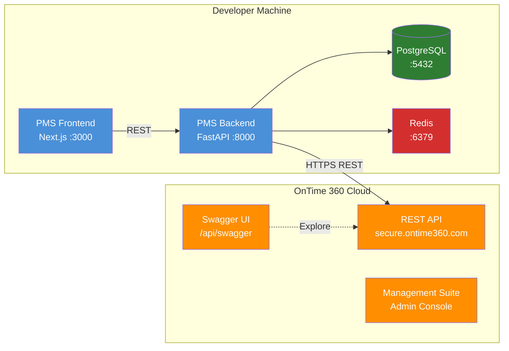

# OnTime 360 API Setup Guide for PMS Integration

**Document ID:** PMS-EXP-ONTIME360API-001
**Version:** 1.0
**Date:** 2026-03-10
**Applies To:** PMS project (all platforms)
**Prerequisites Level:** Intermediate

---

## Table of Contents

1. [Overview](#1-overview)
2. [Prerequisites](#2-prerequisites)
3. [Part A: OnTime 360 Account Setup and API Key Configuration](#3-part-a-ontime-360-account-setup-and-api-key-configuration)
4. [Part B: Integrate with PMS Backend](#4-part-b-integrate-with-pms-backend)
5. [Part C: Integrate with PMS Frontend](#5-part-c-integrate-with-pms-frontend)
6. [Part D: Testing and Verification](#6-part-d-testing-and-verification)
7. [Troubleshooting](#7-troubleshooting)
8. [Reference Commands](#8-reference-commands)

---

## 1. Overview

This guide walks you through connecting OnTime 360's REST API to the PMS backend (FastAPI), frontend (Next.js), and Android app. By the end, you will have:

- An OnTime 360 Enterprise account with API keys
- A typed Python client (`OnTimeClient`) integrated into the FastAPI backend
- A PHI De-Identification Gateway protecting patient data
- A `CourierService` FastAPI router serving courier endpoints
- A `StatusPoller` background task tracking deliveries
- A Next.js Delivery Dashboard with driver map and status cards
- HIPAA audit logging for all courier operations



## 2. Prerequisites

### 2.1 Required Software

| Software | Minimum Version | Check Command |
|---|---|---|
| Python | 3.11+ | `python --version` |
| Node.js | 18+ | `node --version` |
| PostgreSQL | 15+ | `psql --version` |
| Redis | 7+ | `redis-cli --version` |
| Docker | 24+ | `docker --version` |
| httpx | 0.27+ | `pip show httpx` |
| Git | 2.40+ | `git --version` |

### 2.2 Installation of Prerequisites

Install the Python dependencies needed for the OnTime 360 integration:

```bash
# From the PMS backend directory
pip install httpx pydantic apscheduler

# Verify installations
python -c "import httpx; print(f'httpx {httpx.__version__}')"
python -c "import pydantic; print(f'pydantic {pydantic.__version__}')"
```

### 2.3 Verify PMS Services

Confirm that the core PMS services are running before proceeding:

```bash
# Check FastAPI backend
curl -s http://localhost:8000/docs | head -5
# Expected: HTML for Swagger UI

# Check PostgreSQL
psql -U pms_user -d pms_db -c "SELECT 1;"
# Expected: 1

# Check Redis
redis-cli ping
# Expected: PONG

# Check Next.js frontend
curl -s -o /dev/null -w "%{http_code}" http://localhost:3000
# Expected: 200
```

## 3. Part A: OnTime 360 Account Setup and API Key Configuration

### Step 1: Create OnTime 360 Enterprise Account

1. Navigate to [https://www.ontime360.com/plans](https://www.ontime360.com/plans)
2. Select **Enterprise** plan ($499/month + $249 activation)
3. Complete registration with your practice's business information
4. Note your **Company ID** — this appears in your portal URL: `https://secure.ontime360.com/sites/{COMPANY_ID}/`

### Step 2: Enable Swagger/OpenAPI Access

1. Log into **OnTime Management Suite** (desktop application or web admin)
2. Navigate to **Settings → API Configuration**
3. Enable **Swagger UI** and **Swagger JSON Definitions**
4. Verify by visiting: `https://secure.ontime360.com/sites/{COMPANY_ID}/api/swagger`
5. You should see the interactive Swagger UI with all 90+ endpoints listed

### Step 3: Create API Keys

1. In OnTime Management Suite, go to **Settings → API Keys**
2. Create two API keys with different scopes:

| Key Name | Scope | Purpose |
|---|---|---|
| `pms-backend-full` | Orders, Customers, Contacts, Users, Invoices, Files | Backend service — full CRUD operations |
| `pms-readonly-status` | Orders (read), Users (read) | StatusPoller — read-only status polling |

3. Store the generated API key strings securely — they are shown only once.

### Step 4: Configure Environment Variables

Add OnTime 360 credentials to your PMS environment:

```bash
# .env (DO NOT commit this file)
ONTIME_COMPANY_ID=YOUR_COMPANY_ID
ONTIME_API_KEY=your-pms-backend-full-api-key
ONTIME_API_KEY_READONLY=your-pms-readonly-status-api-key
ONTIME_BASE_URL=https://secure.ontime360.com/sites/${ONTIME_COMPANY_ID}/api
```

For Docker deployments, use Docker secrets:

```bash
echo "your-api-key" | docker secret create ontime_api_key -
echo "your-readonly-key" | docker secret create ontime_api_key_readonly -
```

### Step 5: Set Up Initial Data in OnTime 360

Before API integration, configure foundational data in OnTime Management Suite:

1. **Locations**: Add your practice locations as pickup/origin points
2. **Vehicles**: Register delivery vehicles with license plates
3. **Users (Drivers)**: Add courier drivers with mobile app access
4. **Statuses**: Review default order statuses (Submitted, Dispatched, In Transit, Delivered, Cancelled)
5. **Price Sets**: Configure delivery pricing structures for medical courier services

**Checkpoint**: You have an Enterprise OnTime 360 account, two API keys with appropriate scopes, environment variables configured, Swagger UI accessible, and foundational data (locations, drivers, vehicles) created.

## 4. Part B: Integrate with PMS Backend

### Step 1: Create PostgreSQL Schema

```sql
-- migrations/courier_tables.sql

-- Courier orders linked to PMS encounters and patients
CREATE TABLE courier_orders (
    id UUID PRIMARY KEY DEFAULT gen_random_uuid(),
    ontime_order_id VARCHAR(50) UNIQUE,
    encounter_id UUID REFERENCES encounters(id),
    patient_id UUID REFERENCES patients(id),
    order_type VARCHAR(20) NOT NULL CHECK (order_type IN ('specimen', 'medication', 'supply', 'document')),
    pickup_location_id VARCHAR(50),
    delivery_location_id VARCHAR(50),
    priority VARCHAR(10) DEFAULT 'standard' CHECK (priority IN ('standard', 'urgent', 'stat')),
    status VARCHAR(30) DEFAULT 'pending',
    driver_user_id VARCHAR(50),
    handling_instructions TEXT,
    temperature_requirement VARCHAR(20),
    total_cost DECIMAL(10, 2),
    created_at TIMESTAMPTZ DEFAULT NOW(),
    dispatched_at TIMESTAMPTZ,
    delivered_at TIMESTAMPTZ,
    cancelled_at TIMESTAMPTZ,
    created_by UUID REFERENCES users(id)
);

-- PHI de-identification mapping
CREATE TABLE courier_phi_map (
    id UUID PRIMARY KEY DEFAULT gen_random_uuid(),
    courier_order_id UUID REFERENCES courier_orders(id),
    pms_patient_id UUID NOT NULL,
    ontime_reference_id VARCHAR(50) NOT NULL,
    ontime_contact_name VARCHAR(100) NOT NULL, -- De-identified name
    created_at TIMESTAMPTZ DEFAULT NOW()
);

-- HIPAA audit log for courier operations
CREATE TABLE courier_audit_log (
    id BIGSERIAL PRIMARY KEY,
    timestamp TIMESTAMPTZ DEFAULT NOW(),
    user_id UUID,
    action VARCHAR(50) NOT NULL,
    resource_type VARCHAR(30) NOT NULL,
    resource_id VARCHAR(50),
    request_payload JSONB, -- De-identified payload only
    response_status INT,
    ip_address INET,
    user_agent TEXT
);

-- Proof-of-delivery storage
CREATE TABLE courier_pod (
    id UUID PRIMARY KEY DEFAULT gen_random_uuid(),
    courier_order_id UUID REFERENCES courier_orders(id) UNIQUE,
    signature_data BYTEA, -- AES-256-GCM encrypted
    photo_data BYTEA, -- AES-256-GCM encrypted
    gps_latitude DECIMAL(10, 7),
    gps_longitude DECIMAL(10, 7),
    recipient_name VARCHAR(100),
    captured_at TIMESTAMPTZ,
    created_at TIMESTAMPTZ DEFAULT NOW()
);

-- Indexes for common queries
CREATE INDEX idx_courier_orders_status ON courier_orders(status);
CREATE INDEX idx_courier_orders_patient ON courier_orders(patient_id);
CREATE INDEX idx_courier_orders_encounter ON courier_orders(encounter_id);
CREATE INDEX idx_courier_audit_timestamp ON courier_audit_log(timestamp);
CREATE INDEX idx_courier_phi_map_patient ON courier_phi_map(pms_patient_id);
```

### Step 2: OnTime API Client

```python
# app/services/ontime_client.py

import httpx
from pydantic import BaseModel, Field
from typing import Optional
from datetime import datetime
from app.core.config import settings


class OnTimeOrder(BaseModel):
    """Pydantic model for OnTime 360 Order."""
    order_id: Optional[str] = Field(None, alias="OrderID")
    tracking_number: Optional[str] = Field(None, alias="TrackingNumber")
    status_id: Optional[str] = Field(None, alias="StatusID")
    status_name: Optional[str] = Field(None, alias="StatusName")
    pickup_contact_id: Optional[str] = Field(None, alias="PickupContactID")
    delivery_contact_id: Optional[str] = Field(None, alias="DeliveryContactID")
    pickup_location_id: Optional[str] = Field(None, alias="PickupLocationID")
    delivery_location_id: Optional[str] = Field(None, alias="DeliveryLocationID")
    assigned_user_id: Optional[str] = Field(None, alias="AssignedUserID")
    instructions: Optional[str] = Field(None, alias="Instructions")
    reference_number: Optional[str] = Field(None, alias="ReferenceNumber")
    total_cost: Optional[float] = Field(None, alias="TotalCost")

    model_config = {"populate_by_name": True}


class OnTimeUserPosition(BaseModel):
    """Driver GPS position from OnTime 360."""
    user_id: str = Field(alias="UserID")
    latitude: float = Field(alias="Latitude")
    longitude: float = Field(alias="Longitude")
    speed: Optional[float] = Field(None, alias="Speed")
    heading: Optional[float] = Field(None, alias="Heading")
    timestamp: Optional[datetime] = Field(None, alias="Timestamp")

    model_config = {"populate_by_name": True}


class OnTimeClient:
    """Async client for OnTime 360 REST API."""

    def __init__(self):
        self.base_url = settings.ONTIME_BASE_URL
        self.api_key = settings.ONTIME_API_KEY
        self.client = httpx.AsyncClient(
            base_url=self.base_url,
            headers={"Authorization": f"Bearer {self.api_key}"},
            timeout=30.0,
        )

    async def create_order(self, order_data: dict) -> OnTimeOrder:
        """Create a new delivery order."""
        response = await self.client.post("/order/post", json=order_data)
        response.raise_for_status()
        return OnTimeOrder.model_validate(response.json())

    async def get_order(self, order_id: str) -> OnTimeOrder:
        """Retrieve order details by ID."""
        response = await self.client.get(f"/orders/{order_id}")
        response.raise_for_status()
        return OnTimeOrder.model_validate(response.json())

    async def update_order_status(self, order_id: str, status_id: str) -> dict:
        """Update the status of an order."""
        response = await self.client.post(
            "/order/updateStatus",
            json={"OrderID": order_id, "StatusID": status_id},
        )
        response.raise_for_status()
        return response.json()

    async def get_order_status_changes(self, order_id: str) -> list[dict]:
        """Get the full status change history for an order."""
        response = await self.client.get(f"/orderStatusChanges/{order_id}")
        response.raise_for_status()
        return response.json()

    async def get_driver_position(self, user_id: str) -> OnTimeUserPosition:
        """Get real-time GPS position for a driver."""
        response = await self.client.get(f"/user/position/{user_id}")
        response.raise_for_status()
        return OnTimeUserPosition.model_validate(response.json())

    async def get_available_drivers(self) -> list[dict]:
        """List drivers currently available for dispatch."""
        response = await self.client.get("/users", params={"IsAvailable": True})
        response.raise_for_status()
        return response.json()

    async def get_signature(self, order_id: str) -> dict:
        """Retrieve signature proof-of-delivery for an order."""
        response = await self.client.get(
            "/order/signature", params={"OrderID": order_id}
        )
        response.raise_for_status()
        return response.json()

    async def get_file_attachments(self, order_id: str) -> list[dict]:
        """List file attachments (photos, documents) for an order."""
        response = await self.client.get(
            "/fileAttachments", params={"OrderID": order_id}
        )
        response.raise_for_status()
        return response.json()

    async def get_total_cost(self, order_data: dict) -> dict:
        """Calculate the total cost for a potential order."""
        response = await self.client.post("/order/getTotalCost", json=order_data)
        response.raise_for_status()
        return response.json()

    async def create_customer(self, customer_data: dict) -> dict:
        """Create or update a customer record."""
        response = await self.client.post("/customer/post", json=customer_data)
        response.raise_for_status()
        return response.json()

    async def create_contact(self, contact_data: dict) -> dict:
        """Create or update a contact record."""
        response = await self.client.post("/contact/post", json=contact_data)
        response.raise_for_status()
        return response.json()

    async def close(self):
        """Close the HTTP client."""
        await self.client.aclose()
```

### Step 3: PHI De-Identification Gateway

```python
# app/services/courier_phi_gateway.py

import uuid
from app.db.session import get_db
from app.models.courier import CourierPhiMap


class CourierPHIGateway:
    """Strips PHI from outbound OnTime API requests."""

    @staticmethod
    async def deidentify_recipient(
        patient_id: str, patient_name: str, db
    ) -> tuple[str, str]:
        """
        Replace patient name with a reference ID.
        Returns (ontime_reference_id, deidentified_name).
        """
        # Check for existing mapping
        existing = await db.execute(
            CourierPhiMap.__table__.select().where(
                CourierPhiMap.pms_patient_id == patient_id
            )
        )
        row = existing.first()

        if row:
            return row.ontime_reference_id, row.ontime_contact_name

        # Create new de-identified mapping
        ref_id = f"PMS-{uuid.uuid4().hex[:8].upper()}"
        deid_name = f"Recipient {ref_id}"

        new_mapping = CourierPhiMap(
            pms_patient_id=patient_id,
            ontime_reference_id=ref_id,
            ontime_contact_name=deid_name,
        )
        db.add(new_mapping)
        await db.commit()

        return ref_id, deid_name

    @staticmethod
    async def resolve_patient_id(ontime_reference_id: str, db) -> str | None:
        """Reverse lookup: OnTime reference ID → PMS patient ID."""
        result = await db.execute(
            CourierPhiMap.__table__.select().where(
                CourierPhiMap.ontime_reference_id == ontime_reference_id
            )
        )
        row = result.first()
        return row.pms_patient_id if row else None
```

### Step 4: CourierService FastAPI Router

```python
# app/api/routes/courier.py

from fastapi import APIRouter, Depends, HTTPException
from pydantic import BaseModel
from typing import Optional
from datetime import datetime
from app.services.ontime_client import OnTimeClient
from app.services.courier_phi_gateway import CourierPHIGateway
from app.services.courier_audit import log_courier_action
from app.db.session import get_db
from app.api.deps import get_current_user

router = APIRouter(prefix="/api/courier", tags=["courier"])


class CreateDeliveryRequest(BaseModel):
    encounter_id: Optional[str] = None
    patient_id: str
    order_type: str  # specimen, medication, supply, document
    pickup_location_id: str
    delivery_address: str
    priority: str = "standard"
    handling_instructions: Optional[str] = None
    temperature_requirement: Optional[str] = None


class DeliveryStatusResponse(BaseModel):
    order_id: str
    ontime_order_id: str
    status: str
    driver_name: Optional[str] = None
    eta_minutes: Optional[int] = None
    updated_at: datetime


@router.post("/orders")
async def create_delivery_order(
    request: CreateDeliveryRequest,
    db=Depends(get_db),
    current_user=Depends(get_current_user),
):
    """Create a new courier delivery order."""
    client = OnTimeClient()
    phi_gateway = CourierPHIGateway()

    try:
        # De-identify patient information
        ref_id, deid_name = await phi_gateway.deidentify_recipient(
            request.patient_id, "", db  # Name fetched from patient API internally
        )

        # Build OnTime order payload (PHI-free)
        ontime_payload = {
            "ReferenceNumber": ref_id,
            "PickupLocationID": request.pickup_location_id,
            "DeliveryLocationID": request.delivery_address,
            "Instructions": request.handling_instructions or "",
            "Priority": 1 if request.priority == "stat" else 0,
        }

        # Create order in OnTime 360
        order = await client.create_order(ontime_payload)

        # Log to audit trail
        await log_courier_action(
            db=db,
            user_id=current_user.id,
            action="create_order",
            resource_type="order",
            resource_id=order.order_id,
            payload={"reference": ref_id, "type": request.order_type},
        )

        return {
            "order_id": order.order_id,
            "reference": ref_id,
            "status": "submitted",
        }

    finally:
        await client.close()


@router.get("/orders/{order_id}/status")
async def get_delivery_status(
    order_id: str,
    db=Depends(get_db),
    current_user=Depends(get_current_user),
):
    """Get current delivery status and driver position."""
    client = OnTimeClient()
    try:
        order = await client.get_order(order_id)
        return DeliveryStatusResponse(
            order_id=order_id,
            ontime_order_id=order.order_id,
            status=order.status_name or "unknown",
            updated_at=datetime.utcnow(),
        )
    finally:
        await client.close()


@router.get("/orders/{order_id}/pod")
async def get_proof_of_delivery(
    order_id: str,
    db=Depends(get_db),
    current_user=Depends(get_current_user),
):
    """Retrieve proof-of-delivery (signature, photos) for a completed delivery."""
    client = OnTimeClient()
    try:
        signature = await client.get_signature(order_id)
        attachments = await client.get_file_attachments(order_id)
        return {
            "signature": signature,
            "attachments": attachments,
        }
    finally:
        await client.close()


@router.get("/drivers")
async def list_available_drivers(
    current_user=Depends(get_current_user),
):
    """List currently available courier drivers with positions."""
    client = OnTimeClient()
    try:
        drivers = await client.get_available_drivers()
        return {"drivers": drivers}
    finally:
        await client.close()


@router.get("/drivers/{user_id}/position")
async def get_driver_position(
    user_id: str,
    current_user=Depends(get_current_user),
):
    """Get real-time GPS position for a specific driver."""
    client = OnTimeClient()
    try:
        position = await client.get_driver_position(user_id)
        return position.model_dump()
    finally:
        await client.close()
```

### Step 5: StatusPoller Background Task

```python
# app/services/courier_status_poller.py

from apscheduler.schedulers.asyncio import AsyncIOScheduler
from app.services.ontime_client import OnTimeClient
from app.db.session import async_session
from app.services.notification_service import send_delivery_notification
import logging

logger = logging.getLogger(__name__)

scheduler = AsyncIOScheduler()


async def poll_active_orders():
    """Poll OnTime 360 for status changes on active delivery orders."""
    async with async_session() as db:
        # Query active orders from PostgreSQL
        result = await db.execute(
            "SELECT id, ontime_order_id, status, patient_id "
            "FROM courier_orders WHERE status NOT IN ('delivered', 'cancelled')"
        )
        active_orders = result.fetchall()

        if not active_orders:
            return

        client = OnTimeClient()
        try:
            for order in active_orders:
                try:
                    ontime_order = await client.get_order(order.ontime_order_id)
                    new_status = ontime_order.status_name

                    if new_status and new_status != order.status:
                        # Update local status
                        await db.execute(
                            "UPDATE courier_orders SET status = $1 WHERE id = $2",
                            [new_status, order.id],
                        )

                        # Send patient notification
                        await send_delivery_notification(
                            patient_id=order.patient_id,
                            order_id=str(order.id),
                            new_status=new_status,
                        )

                        logger.info(
                            f"Order {order.id} status: {order.status} → {new_status}"
                        )

                except Exception as e:
                    logger.error(f"Failed to poll order {order.id}: {e}")

            await db.commit()
        finally:
            await client.close()


def start_status_poller():
    """Start the background status polling scheduler."""
    scheduler.add_job(poll_active_orders, "interval", seconds=60, id="courier_poller")
    scheduler.start()
    logger.info("Courier status poller started (60s interval)")
```

### Step 6: HIPAA Audit Logger

```python
# app/services/courier_audit.py

from datetime import datetime
from app.db.session import get_db


async def log_courier_action(
    db,
    user_id: str,
    action: str,
    resource_type: str,
    resource_id: str,
    payload: dict | None = None,
    response_status: int = 200,
    ip_address: str | None = None,
):
    """Log a courier operation to the HIPAA audit trail."""
    await db.execute(
        """
        INSERT INTO courier_audit_log
            (user_id, action, resource_type, resource_id,
             request_payload, response_status, ip_address, timestamp)
        VALUES ($1, $2, $3, $4, $5, $6, $7, $8)
        """,
        [
            user_id,
            action,
            resource_type,
            resource_id,
            payload,
            response_status,
            ip_address,
            datetime.utcnow(),
        ],
    )
```

**Checkpoint**: The PMS backend has an `OnTimeClient`, PHI De-ID Gateway, `CourierService` router with 6 endpoints, `StatusPoller` background task, and HIPAA audit logging — all connected to the OnTime 360 REST API.

## 5. Part C: Integrate with PMS Frontend

### Step 1: Environment Variables

```bash
# .env.local (Next.js)
NEXT_PUBLIC_COURIER_API_URL=http://localhost:8000/api/courier
```

### Step 2: Courier API Client

```typescript
// src/lib/courier-api.ts

export interface DeliveryOrder {
  order_id: string;
  ontime_order_id: string;
  status: string;
  driver_name?: string;
  eta_minutes?: number;
  updated_at: string;
}

export interface DriverPosition {
  user_id: string;
  latitude: number;
  longitude: number;
  speed?: number;
  heading?: number;
  timestamp?: string;
}

export interface CreateDeliveryPayload {
  patient_id: string;
  encounter_id?: string;
  order_type: "specimen" | "medication" | "supply" | "document";
  pickup_location_id: string;
  delivery_address: string;
  priority?: "standard" | "urgent" | "stat";
  handling_instructions?: string;
  temperature_requirement?: string;
}

const BASE = process.env.NEXT_PUBLIC_COURIER_API_URL;

async function fetchWithAuth(url: string, options: RequestInit = {}) {
  const token = localStorage.getItem("auth_token");
  const res = await fetch(url, {
    ...options,
    headers: {
      "Content-Type": "application/json",
      Authorization: `Bearer ${token}`,
      ...options.headers,
    },
  });
  if (!res.ok) throw new Error(`Courier API error: ${res.status}`);
  return res.json();
}

export const courierApi = {
  createOrder: (payload: CreateDeliveryPayload) =>
    fetchWithAuth(`${BASE}/orders`, {
      method: "POST",
      body: JSON.stringify(payload),
    }),

  getOrderStatus: (orderId: string): Promise<DeliveryOrder> =>
    fetchWithAuth(`${BASE}/orders/${orderId}/status`),

  getProofOfDelivery: (orderId: string) =>
    fetchWithAuth(`${BASE}/orders/${orderId}/pod`),

  listDrivers: () => fetchWithAuth(`${BASE}/drivers`),

  getDriverPosition: (userId: string): Promise<DriverPosition> =>
    fetchWithAuth(`${BASE}/drivers/${userId}/position`),
};
```

### Step 3: Delivery Dashboard Component

```tsx
// src/components/courier/DeliveryDashboard.tsx

"use client";

import { useEffect, useState } from "react";
import { courierApi, DeliveryOrder, DriverPosition } from "@/lib/courier-api";

export function DeliveryDashboard() {
  const [orders, setOrders] = useState<DeliveryOrder[]>([]);
  const [drivers, setDrivers] = useState<DriverPosition[]>([]);
  const [loading, setLoading] = useState(true);

  useEffect(() => {
    async function loadData() {
      try {
        const [driverRes] = await Promise.all([courierApi.listDrivers()]);
        setDrivers(driverRes.drivers || []);
      } catch (err) {
        console.error("Failed to load courier data:", err);
      } finally {
        setLoading(false);
      }
    }
    loadData();
    const interval = setInterval(loadData, 30000); // Refresh every 30s
    return () => clearInterval(interval);
  }, []);

  if (loading) return <div className="p-4">Loading courier dashboard...</div>;

  return (
    <div className="grid grid-cols-1 lg:grid-cols-2 gap-4 p-4">
      {/* Active Deliveries Panel */}
      <div className="bg-white rounded-lg shadow p-4">
        <h2 className="text-lg font-semibold mb-3">Active Deliveries</h2>
        {orders.length === 0 ? (
          <p className="text-gray-500">No active deliveries</p>
        ) : (
          <ul className="space-y-2">
            {orders.map((order) => (
              <li
                key={order.order_id}
                className="border rounded p-3 flex justify-between items-center"
              >
                <div>
                  <span className="font-medium">{order.ontime_order_id}</span>
                  <span className="ml-2 text-sm text-gray-500">
                    {order.status}
                  </span>
                </div>
                {order.eta_minutes && (
                  <span className="text-sm bg-blue-100 text-blue-800 px-2 py-1 rounded">
                    ETA: {order.eta_minutes} min
                  </span>
                )}
              </li>
            ))}
          </ul>
        )}
      </div>

      {/* Driver Positions Panel */}
      <div className="bg-white rounded-lg shadow p-4">
        <h2 className="text-lg font-semibold mb-3">Driver Locations</h2>
        {drivers.length === 0 ? (
          <p className="text-gray-500">No drivers available</p>
        ) : (
          <ul className="space-y-2">
            {drivers.map((driver) => (
              <li key={driver.user_id} className="border rounded p-3">
                <span className="font-medium">Driver {driver.user_id}</span>
                <div className="text-sm text-gray-500 mt-1">
                  Lat: {driver.latitude.toFixed(5)}, Lng:{" "}
                  {driver.longitude.toFixed(5)}
                  {driver.speed && ` | ${driver.speed.toFixed(1)} mph`}
                </div>
              </li>
            ))}
          </ul>
        )}
      </div>
    </div>
  );
}
```

### Step 4: Add Route and Navigation

```tsx
// src/app/courier/page.tsx

import { DeliveryDashboard } from "@/components/courier/DeliveryDashboard";

export default function CourierPage() {
  return (
    <main className="min-h-screen bg-gray-50">
      <div className="max-w-7xl mx-auto py-6">
        <h1 className="text-2xl font-bold mb-6 px-4">
          Courier Delivery Management
        </h1>
        <DeliveryDashboard />
      </div>
    </main>
  );
}
```

**Checkpoint**: The PMS frontend has a `courierApi` client, `DeliveryDashboard` component with active deliveries and driver positions, and a `/courier` route — all connected to the backend `CourierService`.

## 6. Part D: Testing and Verification

### Step 1: Verify API Connectivity

```bash
# Test OnTime 360 API connectivity using curl
export ONTIME_BASE="https://secure.ontime360.com/sites/YOUR_COMPANY_ID/api"
export ONTIME_KEY="your-api-key"

# List available statuses
curl -s -H "Authorization: Bearer $ONTIME_KEY" \
  "$ONTIME_BASE/statuses" | python -m json.tool

# Expected: JSON array of status objects with StatusID and StatusName
```

### Step 2: Test Order Creation

```bash
# Create a test order
curl -s -X POST \
  -H "Authorization: Bearer $ONTIME_KEY" \
  -H "Content-Type: application/json" \
  -d '{
    "ReferenceNumber": "PMS-TEST-001",
    "Instructions": "Test delivery - handle with care",
    "PickupLocationID": "your-location-id"
  }' \
  "$ONTIME_BASE/order/post" | python -m json.tool

# Expected: JSON with OrderID assigned
```

### Step 3: Test PMS Backend Endpoints

```bash
# Create delivery via PMS API
curl -s -X POST \
  -H "Authorization: Bearer $PMS_TOKEN" \
  -H "Content-Type: application/json" \
  -d '{
    "patient_id": "test-patient-uuid",
    "order_type": "medication",
    "pickup_location_id": "clinic-main",
    "delivery_address": "123 Test St",
    "priority": "standard"
  }' \
  http://localhost:8000/api/courier/orders | python -m json.tool

# Expected: {"order_id": "...", "reference": "PMS-XXXXXXXX", "status": "submitted"}
```

### Step 4: Verify Audit Logging

```bash
# Check that the courier action was logged
psql -U pms_user -d pms_db -c \
  "SELECT action, resource_type, resource_id, timestamp
   FROM courier_audit_log ORDER BY timestamp DESC LIMIT 5;"

# Expected: Row showing create_order action with timestamp
```

### Step 5: Test Driver Position Tracking

```bash
# Get driver position (requires active driver with GPS)
curl -s -H "Authorization: Bearer $PMS_TOKEN" \
  http://localhost:8000/api/courier/drivers | python -m json.tool

# Expected: {"drivers": [{"user_id": "...", "latitude": ..., "longitude": ...}]}
```

### Step 6: Verify Frontend

1. Navigate to `http://localhost:3000/courier`
2. Confirm the Delivery Dashboard renders with Active Deliveries and Driver Locations panels
3. Verify data refreshes every 30 seconds (check Network tab in browser dev tools)

**Checkpoint**: OnTime 360 API is accessible, orders can be created and tracked, audit logging is working, driver positions are retrievable, and the frontend dashboard renders correctly.

## 7. Troubleshooting

### API Connection Refused

**Symptoms**: `httpx.ConnectError` or `ConnectionRefusedError` when calling OnTime API.

**Solution**:
1. Verify `ONTIME_COMPANY_ID` is correct — check your portal URL
2. Confirm API key is valid and not expired in OnTime Management Suite
3. Check Swagger UI is enabled: visit `https://secure.ontime360.com/sites/{ID}/api/swagger`
4. Verify HTTPS connectivity: `curl -I https://secure.ontime360.com`

### API Key Authentication Failures

**Symptoms**: `401 Unauthorized` responses from OnTime API.

**Solution**:
1. Regenerate API key in OnTime Management Suite → Settings → API Keys
2. Verify the key has the correct scopes (Orders, Customers, etc.)
3. Ensure the Authorization header format is correct: `Bearer {api_key}`
4. Check for trailing whitespace in environment variables

### Swagger UI Not Loading

**Symptoms**: 404 when visiting `/api/swagger` endpoint.

**Solution**:
1. Log into OnTime Management Suite as administrator
2. Navigate to Settings → API Configuration
3. Enable both "Swagger UI" and "Swagger JSON Definitions"
4. Wait 1-2 minutes for changes to propagate

### Status Poller Not Updating

**Symptoms**: Delivery statuses remain stale in PMS despite driver updates in OnTime.

**Solution**:
1. Check APScheduler is running: look for `"Courier status poller started"` in logs
2. Verify the readonly API key works: `curl -H "Authorization: Bearer $READONLY_KEY" "$BASE/orders"`
3. Confirm active orders exist in `courier_orders` table with status not 'delivered' or 'cancelled'
4. Check for rate limiting — reduce poll interval if getting 429 responses

### API Transaction Limit Exceeded

**Symptoms**: `429 Too Many Requests` or unexpected billing charges.

**Solution**:
1. Check current usage in OnTime Management Suite dashboard
2. Increase StatusPoller interval from 60s to 120s for non-urgent deliveries
3. Enable Redis caching for driver positions and order status (TTL: 30s)
4. Batch status queries where possible instead of individual order lookups

### Port Conflicts

**Symptoms**: PMS backend fails to start on port 8000.

**Solution**:
1. Check for existing processes: `lsof -i :8000`
2. Kill conflicting process or use alternate port: `uvicorn app.main:app --port 8001`
3. Update `NEXT_PUBLIC_COURIER_API_URL` in frontend `.env.local`

## 8. Reference Commands

### Daily Development Workflow

```bash
# Start PMS services
docker compose up -d postgres redis
uvicorn app.main:app --reload --port 8000
cd frontend && npm run dev

# Test API connectivity
curl -s "$ONTIME_BASE/statuses" -H "Authorization: Bearer $ONTIME_KEY" | python -m json.tool

# Create test delivery
curl -s -X POST http://localhost:8000/api/courier/orders \
  -H "Authorization: Bearer $PMS_TOKEN" \
  -H "Content-Type: application/json" \
  -d '{"patient_id":"test","order_type":"specimen","pickup_location_id":"lab","delivery_address":"ref-lab","priority":"urgent"}'

# Check audit log
psql -U pms_user -d pms_db -c "SELECT * FROM courier_audit_log ORDER BY timestamp DESC LIMIT 10;"
```

### OnTime 360 Management

| Action | Tool |
|---|---|
| Create/manage API keys | OnTime Management Suite → Settings → API Keys |
| Add drivers | OnTime Management Suite → Users |
| Add locations | OnTime Management Suite → Locations |
| Configure pricing | OnTime Management Suite → Price Sets |
| View orders | OnTime Management Suite → Orders |
| Monitor usage | OnTime Management Suite → Account → API Usage |

### Useful URLs

| Resource | URL |
|---|---|
| OnTime API Swagger UI | `https://secure.ontime360.com/sites/{ID}/api/swagger` |
| OnTime API Docs | `https://cdn.ontime360.com/resources/documentation/api/index.htm` |
| OnTime REST API Reference | `https://cdn.ontime360.com/resources/documentation/api/ws2.htm` |
| OnTime Developer Portal | `https://www.ontime360.com/developer/` |
| OnTime Postman Collection | `https://www.postman.com/vscsteam/ontime360-api/overview` |
| OnTime GitHub Samples | `https://github.com/Vesigo/ontime-api-samples` |
| PMS Courier Dashboard | `http://localhost:3000/courier` |
| PMS Courier API | `http://localhost:8000/api/courier/` |

## Next Steps

1. Complete the [OnTime 360 API Developer Tutorial](67-OnTime360API-Developer-Tutorial.md) for a hands-on integration walkthrough
2. Configure route optimization for multi-stop delivery routes
3. Integrate with [FedEx API (Experiment 65)](65-PRD-FedExAPI-PMS-Integration.md) for intelligent local vs. national routing
4. Set up the Customer Web Portal for referring physician self-service specimen pickups
5. Build the Android patient delivery tracker with push notifications

## Resources

- [OnTime API Documentation](https://cdn.ontime360.com/resources/documentation/api/index.htm) — Complete API reference
- [OnTime REST API Endpoints](https://cdn.ontime360.com/resources/documentation/api/ws2.htm) — All 90+ REST endpoints
- [OnTime Developer Resources](https://www.ontime360.com/developer/) — SDK, samples, and tools
- [OnTime API Samples (GitHub)](https://github.com/Vesigo/ontime-api-samples) — Code samples in 5 languages
- [OnTime Extension SDK](https://cdn.ontime360.com/resources/documentation/extension-sdk/index.htm) — Desktop extension development
- [PRD: OnTime 360 API PMS Integration](67-PRD-OnTime360API-PMS-Integration.md) — Product requirements document
