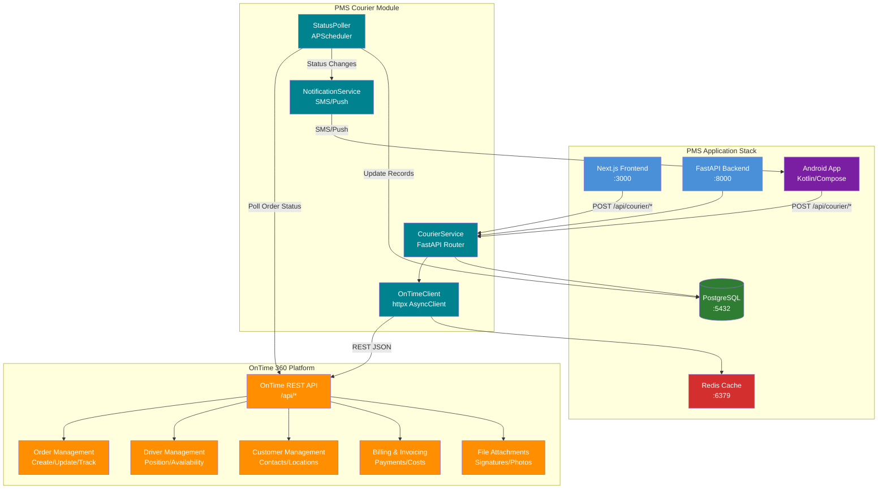

# Product Requirements Document: OnTime 360 API Integration into Patient Management System (PMS)

**Document ID:** PRD-PMS-ONTIME360API-001
**Version:** 1.0
**Date:** 2026-03-10
**Author:** Ammar (CEO, MPS Inc.)
**Status:** Draft

---

## 1. Executive Summary

OnTime 360 is a cloud-based courier and delivery management platform developed by Vesigo Studios, purpose-built for courier businesses, freight brokers, and last-mile delivery operations. The platform provides a comprehensive REST and SOAP API with 500+ properties and 90+ functions, OpenAPI/Swagger compliance, and code samples in C#, JavaScript, PHP, Python, and Ruby. OnTime 360 differentiates itself from general-purpose delivery platforms by offering deep dispatch control, flexible pricing structures, barcode scanning, proof-of-delivery capture, and — critically for healthcare — HIPAA/GDPR compliance at the Enterprise tier.

Integrating the OnTime 360 API into the PMS enables automated dispatch and tracking of medical deliveries directly from clinical workflows — lab specimen transport to reference labs, prescription medication delivery to patients, and medical supply chain management between practice locations. Staff currently coordinate deliveries via phone calls, manual spreadsheets, and disconnected tracking portals. This integration replaces those manual handoffs with programmatic order creation, real-time GPS tracking, proof-of-delivery verification, and automated patient notification — all embedded within the existing patient encounter and prescription workflows.

For an ophthalmology practice handling temperature-sensitive anti-VEGF medications (Eylea, Lucentis), lab specimens (blood draws, biopsy tissue), and medical devices (IOL lenses, surgical kits), OnTime 360 provides the operational dispatch layer that complements the FedEx API shipping integration (Experiment 65) — FedEx handles national parcel shipping while OnTime 360 manages local/regional courier dispatch with real-time driver tracking and proof-of-delivery.

## 2. Problem Statement

PMS clinical and administrative staff face several operational bottlenecks related to local courier and delivery management:

1. **No dispatch system integration**: When lab specimens need transport to reference labs or medications need local delivery to patients, staff manually call courier drivers, text addresses, and track deliveries via phone calls. There is no programmatic dispatch or status tracking.

2. **Missing chain-of-custody documentation**: Lab specimens and controlled medications require documented chain-of-custody from pickup to delivery. Currently tracked on paper logs that are difficult to audit, easy to lose, and non-compliant with HIPAA requirements for PHI-bearing shipments.

3. **No proof-of-delivery for medications**: When specialty medications are delivered to patients, there is no digital proof-of-delivery (signature, photo, GPS stamp) linked back to the patient record. This creates liability gaps and regulatory compliance issues.

4. **Driver location opacity**: Practice managers have no visibility into where courier drivers are in real-time, making it impossible to provide patients with accurate delivery ETAs or to dynamically re-route drivers for urgent specimen pickups.

5. **Manual billing reconciliation**: Courier delivery costs are tracked in spreadsheets and manually reconciled against invoices. There is no automated cost tracking per delivery linked to patient encounters or departmental budgets.

6. **No patient delivery notifications**: Patients receive no automated SMS or status updates when their prescriptions are being delivered. Front desk staff field status inquiry calls that consume clinical time.

## 3. Proposed Solution

### 3.1 Architecture Overview

### 3.2 Deployment Model

- **Cloud-hosted SaaS**: OnTime 360 is a fully managed cloud platform — no self-hosting required. All API calls go to `https://secure.ontime360.com/sites/{company-id}/api/*`.
- **Enterprise Tier Required**: HIPAA/GDPR compliance features, advanced Customer Web Portal, and 20,000 included API transactions require the Enterprise plan ($499/month).
- **API Key Authentication**: Secure access via API keys created in OnTime Management Suite with scoped permissions per key.
- **HIPAA Considerations**: Enterprise tier includes HIPAA compliance features, 90-day audit history, and SQL Server replication for backup. PHI must be de-identified before transmission — patient names and MRNs are replaced with PMS-internal reference IDs in OnTime order fields. A PHI De-Identification Gateway on the PMS backend strips/maps protected data before API calls.
- **Docker Integration**: The `OnTimeClient` runs within the existing PMS FastAPI Docker container — no additional containers needed since OnTime 360 is a remote SaaS API.

## 4. PMS Data Sources

The OnTime 360 integration interacts with the following PMS APIs and data:

- **Patient Records API (`/api/patients`)**: Retrieves patient address and contact information for delivery destination. Maps patient ID to OnTime customer/contact records. PHI is de-identified before transmission.
- **Encounter Records API (`/api/encounters`)**: Links delivery orders to specific clinical encounters — specimen pickups triggered by lab orders, medication deliveries triggered by prescription fills.
- **Medication & Prescription API (`/api/prescriptions`)**: Triggers courier dispatch when a prescription is marked for local delivery. Provides medication details for handling instructions (temperature requirements, controlled substance classification).
- **Reporting API (`/api/reports`)**: Aggregates delivery metrics (cost per delivery, average transit time, on-time percentage) for operational reporting and cost analysis by department, payer, or provider.

## 5. Component/Module Definitions

### 5.1 OnTimeClient

**Description**: Async HTTP client wrapping the OnTime 360 REST API with typed Pydantic models for all request/response schemas.

- **Input**: PMS internal delivery requests (patient ID, pickup location, destination, priority, handling instructions)
- **Output**: OnTime order IDs, tracking status, driver positions, proof-of-delivery data
- **PMS APIs Used**: None (outbound API client)
- **Key Methods**: `create_order()`, `get_order_status()`, `get_driver_position()`, `get_signature()`, `list_file_attachments()`

### 5.2 PHI De-Identification Gateway

**Description**: Middleware layer that strips PHI from outbound OnTime API requests and maps PMS-internal reference IDs.

- **Input**: Raw PMS delivery request with patient name, MRN, address
- **Output**: De-identified request with reference codes; mapping stored in `courier_phi_map` PostgreSQL table
- **PMS APIs Used**: Patient Records API (`/api/patients`)

### 5.3 CourierService (FastAPI Router)

**Description**: REST API router exposing courier operations to the PMS frontend and Android app.

- **Endpoints**:
  - `POST /api/courier/orders` — Create delivery order
  - `GET /api/courier/orders/{id}/status` — Get delivery status
  - `GET /api/courier/orders/{id}/pod` — Get proof-of-delivery (signature, photo)
  - `GET /api/courier/drivers` — List available drivers with positions
  - `GET /api/courier/drivers/{id}/position` — Real-time driver GPS position
  - `POST /api/courier/orders/{id}/cancel` — Cancel a pending delivery
  - `GET /api/courier/costs` — Delivery cost summary by date range
- **PMS APIs Used**: Patient Records, Encounter Records, Prescription API

### 5.4 StatusPoller

**Description**: Background task (APScheduler) that polls OnTime 360 for order status changes and triggers notifications.

- **Input**: List of active (in-transit) order IDs from PostgreSQL
- **Output**: Status change events → patient SMS notifications, PMS encounter timeline updates
- **PMS APIs Used**: Encounter Records API (timeline updates), Reporting API (metrics)

### 5.5 Delivery Dashboard (Next.js)

**Description**: Real-time delivery management panel in the PMS frontend showing active deliveries, driver map, and delivery history.

- **Input**: CourierService REST API responses
- **Output**: Interactive map with driver positions, delivery status cards, proof-of-delivery viewer
- **PMS APIs Used**: Patient Records (display patient info), Encounter Records (link to encounters)

### 5.6 Android Delivery Tracker

**Description**: Patient-facing delivery tracking view in the PMS Android app showing real-time ETA and delivery status.

- **Input**: CourierService REST API
- **Output**: Map with driver position, push notifications for status changes, signature confirmation

## 6. Non-Functional Requirements

### 6.1 Security and HIPAA Compliance

| Requirement | Implementation |
|---|---|
| PHI De-Identification | All patient identifiers stripped before OnTime API calls; reference ID mapping in encrypted PostgreSQL table |
| API Key Security | OnTime API keys stored in Docker secrets / environment variables, never in source code |
| Transport Encryption | All API calls over HTTPS (TLS 1.2+) to `secure.ontime360.com` |
| Audit Logging | Every API call logged with timestamp, user, action, and de-identified payload in `courier_audit_log` table |
| Access Control | RBAC: only Dispatcher and Admin roles can create/cancel orders; all roles can view status |
| Data Retention | Delivery records retained for 7 years per HIPAA; OnTime 360 Enterprise provides 90-day audit history |
| Proof-of-Delivery | Signatures and photos stored in PMS PostgreSQL (AES-256-GCM encrypted BYTEA), not in OnTime cloud |
| BAA Requirement | Business Associate Agreement (BAA) required with Vesigo Studios for HIPAA coverage |

### 6.2 Performance

| Metric | Target |
|---|---|
| Order creation latency | < 2 seconds (API call + DB write) |
| Status poll interval | Every 60 seconds for active orders |
| Driver position refresh | Every 30 seconds on dashboard map |
| Dashboard load time | < 1.5 seconds (cached driver positions) |
| API transaction budget | 20,000/month (Enterprise tier included) |
| Concurrent active orders | Up to 200 simultaneous in-transit orders |

### 6.3 Infrastructure

| Component | Requirement |
|---|---|
| OnTime 360 Plan | Enterprise ($499/month) for HIPAA, API, and advanced portal |
| API Transactions | 20,000 included; $1.00 per 1,000 overage |
| Route Optimization | $0.20 per optimization (optional add-on) |
| PMS Backend | Existing FastAPI container — no new services |
| Redis | Cache API keys, driver positions, and order status (existing instance) |
| PostgreSQL | New tables: `courier_orders`, `courier_phi_map`, `courier_audit_log`, `courier_pod` |

## 7. Implementation Phases

### Phase 1: Foundation (Sprints 1-2)

- OnTime 360 Enterprise account setup and API key provisioning
- `OnTimeClient` async client with Pydantic models for Order, Customer, Contact, and Status schemas
- PHI De-Identification Gateway with PostgreSQL mapping table
- `CourierService` FastAPI router: `POST /api/courier/orders`, `GET /api/courier/orders/{id}/status`
- HIPAA audit logging for all API interactions
- Unit and integration tests against OnTime Swagger sandbox

### Phase 2: Core Integration (Sprints 3-4)

- StatusPoller background task with APScheduler for order tracking
- Patient SMS notification on status changes (dispatched, in-transit, delivered)
- Proof-of-delivery retrieval (signatures, photos) linked to patient encounters
- Driver position tracking: `GET /api/courier/drivers/{id}/position`
- Delivery Dashboard (Next.js): active deliveries list, driver map, status timeline
- Cost tracking and invoice reconciliation endpoints

### Phase 3: Advanced Features (Sprints 5-6)

- Android patient delivery tracker with push notifications and live map
- Route optimization integration ($0.20/optimization) for multi-stop routes
- Prescription-triggered auto-dispatch: prescription fill → courier order creation
- Delivery analytics dashboard: cost per delivery, on-time %, driver performance
- Customer Web Portal configuration for referring physician self-service specimen pickups
- Integration with FedEx API (Experiment 65) for intelligent routing: local → OnTime 360, national → FedEx

## 8. Success Metrics

| Metric | Target | Measurement Method |
|---|---|---|
| Delivery dispatch time | < 2 min from request to driver assignment | PMS courier_orders table timestamps |
| Proof-of-delivery capture rate | 100% of prescription deliveries | POD records vs. completed orders |
| Patient notification delivery | > 95% SMS delivery rate | Notification service delivery receipts |
| Manual coordination calls eliminated | > 80% reduction | Staff time survey (before/after) |
| Delivery cost visibility | 100% of deliveries costed | courier_orders.total_cost not null |
| API transaction utilization | < 80% of 20,000 monthly budget | OnTime 360 usage dashboard |
| On-time delivery rate | > 95% | OnTime status change timestamps |

## 9. Risks and Mitigations

| Risk | Impact | Mitigation |
|---|---|---|
| No webhook support — polling only | Delayed status updates; higher API transaction consumption | StatusPoller with configurable interval (30-120s); batch status queries to reduce transaction count |
| OnTime 360 outage | Cannot create or track deliveries | Graceful degradation: queue orders locally in PostgreSQL, retry on recovery; manual dispatch fallback |
| API transaction overage costs | Unexpected billing at $1/1,000 transactions | Redis caching of status/position data; smart polling (only active orders); transaction counter with alerts at 80% threshold |
| BAA negotiation delays | Cannot transmit any PHI until BAA executed | PHI De-ID Gateway ensures zero PHI in API calls regardless of BAA status; pursue BAA in parallel |
| Driver adoption resistance | Drivers don't use OnTime mobile app consistently | Training program; GPS position as requirement for dispatched orders |
| API key compromise | Unauthorized access to OnTime account | API keys in Docker secrets with rotation policy; IP allowlisting if supported; scoped key permissions |
| Rate limiting / throttling | API calls rejected during peak dispatch | Exponential backoff with jitter; request queue in Redis; prioritize order creation over status polling |

## 10. Dependencies

| Dependency | Type | Notes |
|---|---|---|
| OnTime 360 Enterprise Plan | Service | $499/month + $249 activation fee |
| OnTime REST API | External API | `https://secure.ontime360.com/sites/{company-id}/api/*` |
| Vesigo Studios BAA | Legal | Required for HIPAA-covered courier operations |
| OnTime Management Suite | Configuration | Admin tool for API key creation, Swagger enablement, driver setup |
| OnTime Driver Mobile App | Mobile | iOS/Android app for drivers — provided by OnTime 360 |
| Redis (existing) | Infrastructure | Caching API responses and transaction counting |
| PostgreSQL (existing) | Infrastructure | New tables for orders, PHI mapping, audit logs, POD storage |
| APScheduler | Python Library | Background polling for order status changes |
| httpx | Python Library | Async HTTP client for REST API calls |
| FedEx API Integration (Exp. 65) | Internal | Complementary — routing logic for local vs. national shipments |

## 11. Comparison with Existing Experiments

### vs. FedEx API (Experiment 65)

The FedEx API integration handles **national parcel shipping** — creating shipping labels, tracking packages across the FedEx network, and managing cold chain logistics for temperature-sensitive medications. OnTime 360 handles **local/regional courier dispatch** — assigning drivers, tracking real-time GPS positions, capturing proof-of-delivery, and managing the operational dispatch workflow for same-day deliveries within the practice's service area.

These integrations are **complementary, not competing**:
- **Local delivery** (within metro area, same-day): OnTime 360 courier dispatch
- **National shipping** (across states, multi-day): FedEx API parcel shipping
- **Routing logic**: PMS determines delivery type based on destination distance and urgency, then routes to the appropriate API

### vs. Availity API (Experiment 47)

While Availity handles the **insurance/payer communication** layer (eligibility, prior authorization, claims), OnTime 360 handles the **physical logistics** layer. They share no functional overlap but both contribute to the end-to-end patient care workflow: Availity confirms coverage → PMS prescribes medication → OnTime 360 delivers it.

### vs. Docker (Experiment 39)

OnTime 360 is a SaaS API requiring no self-hosting — it integrates into the existing Dockerized PMS stack as an outbound API client within the FastAPI container, similar to how the FedEx Client was designed.

## 12. Research Sources

### Official Documentation
- [OnTime API Documentation](https://cdn.ontime360.com/resources/documentation/api/index.htm) — Complete API reference with SOAP and REST endpoint listings
- [OnTime REST API Endpoints](https://cdn.ontime360.com/resources/documentation/api/ws2.htm) — Full REST endpoint catalog with all 90+ functions
- [OnTime 360 Developer Resources](https://www.ontime360.com/developer/) — SDK, code samples, and Extension SDK downloads
- [OnTime API Product Page](https://www.ontime360.com/products/api) — API feature overview and capabilities

### Code Samples & SDK
- [OnTime API Samples (GitHub)](https://github.com/Vesigo/ontime-api-samples) — REST API samples in C#, JavaScript, PHP, Python, and Ruby
- [OnTime SDK Samples (GitHub)](https://github.com/Vesigo/ontime-sdk-samples) — Extension SDK samples in C# and Visual Basic
- [OnTime360 API on Postman](https://www.postman.com/vscsteam/ontime360-api/overview) — Postman collection for API exploration

### Pricing & Plans
- [OnTime 360 Plans and Prices](https://www.ontime360.com/plans) — Four-tier pricing from $49/month (Core) to $499/month (Enterprise)

### Healthcare & Compliance
- [OnTime 360 Hospital Delivery Software](https://www.ontime360.com/delivery-software/hospital) — Medical courier features, HIPAA compliance support
- [HIPAA Compliance for Last-Mile Delivery (Track-POD)](https://www.track-pod.com/blog/hipaa-compliance-for-last-mile-delivery-software/) — Industry HIPAA requirements for delivery software

### Competitive Landscape
- [OnTime 360 on Capterra](https://www.capterra.com/p/97252/OnTime-360/) — Reviews, pricing, and alternative comparisons
- [OnTime 360 vs Other Courier Software](https://www.ontime360.com/try/other-courier-software) — Vendor comparison page

## 13. Appendix: Related Documents

- [OnTime 360 API Setup Guide](67-OnTime360API-PMS-Developer-Setup-Guide.md) — Developer environment setup and PMS integration configuration
- [OnTime 360 API Developer Tutorial](67-OnTime360API-Developer-Tutorial.md) — Hands-on onboarding tutorial for building courier integrations
- [PRD: FedEx API PMS Integration](65-PRD-FedExAPI-PMS-Integration.md) — Complementary national shipping integration
- [PRD: Availity API PMS Integration](47-PRD-AvailityAPI-PMS-Integration.md) — Insurance/payer communication layer
- [OnTime API Documentation](https://cdn.ontime360.com/resources/documentation/api/index.htm) — Official API reference
