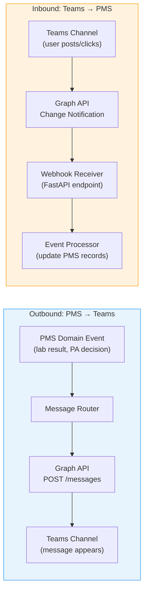
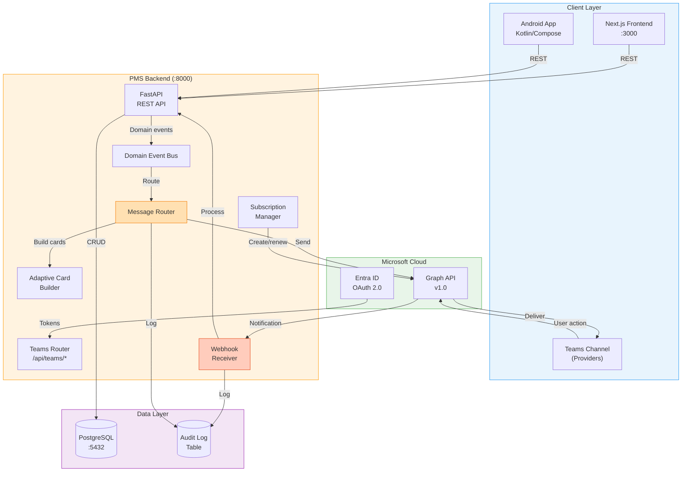

# Microsoft Teams Developer Onboarding Tutorial

**Welcome to the MPS PMS Microsoft Teams Integration Team**

This tutorial will take you from zero to building your first bi-directional Teams integration with the PMS. By the end, you will understand how Microsoft Graph API works for Teams messaging, have a running local environment, and have built and tested a custom clinical notification pipeline end-to-end — including sending Adaptive Cards to Teams channels and receiving provider responses back into PMS workflows.

**Document ID:** PMS-EXP-MSTEAMS-002
**Version:** 1.0
**Date:** 2026-03-10
**Applies To:** PMS project (all platforms)
**Prerequisite:** [MS Teams Setup Guide](68-MSTeams-PMS-Developer-Setup-Guide.md)
**Estimated time:** 2-3 hours
**Difficulty:** Beginner-friendly

---

## What You Will Learn

1. How Microsoft Graph API enables programmatic access to Teams channels
2. The difference between application permissions (daemon) and delegated permissions (user context)
3. How OAuth 2.0 client credentials flow works with Azure Entra ID
4. How to send plain-text and HTML messages to Teams channels
5. How to build and send Adaptive Cards with interactive action buttons
6. How Microsoft Graph change notifications (webhooks) enable real-time channel listening
7. How to process inbound messages from Teams and route them to PMS workflows
8. How subscription lifecycle management works (creation, renewal, expiration)
9. HIPAA considerations for transmitting PHI through Teams
10. How to debug common Teams integration issues using Graph Explorer and logs

## Part 1: Understanding Microsoft Teams Integration (15 min read)

### 1.1 What Problem Does Teams Integration Solve?

In a busy clinical environment, providers spend significant time in Microsoft Teams — communicating with colleagues, joining virtual huddles, and coordinating care. But when a critical lab result arrives, a prior authorization decision is made, or a patient is discharged, the provider must switch to PMS to see the update. This context-switching creates delays:

- **A critical potassium result of 6.8 mEq/L** sits in PMS for 45 minutes before the on-call physician sees it — because they were in a Teams meeting.
- **A medication refill request** requires the physician to log into PMS, navigate to the patient, review the prescription, and click approve. If they could approve directly from Teams, the turnaround drops from hours to minutes.
- **Care coordination discussions** happen in Teams channels, but the decisions aren't captured in the patient record, creating documentation gaps.

Teams integration solves this by **bringing PMS notifications to where providers already are** and **accepting provider actions back into PMS without requiring a login**.

### 1.2 How Teams Integration Works — The Key Pieces



The integration has two data flows:

1. **Outbound (PMS → Teams)**: When something happens in PMS (a lab result arrives, a PA is approved), the backend publishes the event. The Message Router maps the event type to a Teams channel and sends a formatted message (plain text, HTML, or Adaptive Card) via the Microsoft Graph API.

2. **Inbound (Teams → PMS)**: When a provider posts a message or clicks an Adaptive Card button in a monitored Teams channel, Microsoft Graph sends a webhook notification to the PMS backend. The Webhook Receiver validates the notification, extracts the content, and dispatches it to the appropriate PMS workflow (e.g., approve a refill, acknowledge a lab result).

3. **Subscription Management**: The inbound flow requires an active Graph subscription that tells Microsoft "notify me when something happens in this channel." Subscriptions expire (max ~3 days for non-encrypted channel messages), so the PMS must renew them automatically.

### 1.3 How Teams Integration Fits with Other PMS Technologies

| Technology | Experiment | Relationship to Teams |
|------------|------------|----------------------|
| **GWS CLI** | Exp 64 | Complementary — Google Workspace equivalent. Use GWS CLI for Google-based orgs, Teams for Microsoft-based orgs |
| **CrewAI** | Exp 55 | Teams provides human-in-the-loop for CrewAI agents. Agents post to Teams for provider approval/review |
| **MCP** | Exp 09 | A Teams MCP tool could let any MCP-connected agent send Teams messages as a tool action |
| **A2A** | Exp 63 | External agents could use Teams as a notification channel via the A2A protocol |
| **FHIR** | Exp 16 | FHIR resources (Observations, MedicationRequests) trigger Teams notifications |
| **NotebookLM** | Exp 57 | Clinical knowledge queries from NotebookLM could be posted to Teams for team discussion |

### 1.4 Key Vocabulary

| Term | Meaning |
|------|---------|
| **Microsoft Graph API** | Unified REST API for accessing Microsoft 365 services (Teams, Outlook, OneDrive, etc.) |
| **Azure Entra ID** | Microsoft's identity platform (formerly Azure Active Directory/Azure AD) for app authentication |
| **Application permission** | Permission granted to an app to act without a signed-in user (daemon/service scenario) |
| **Delegated permission** | Permission granted to an app to act on behalf of a signed-in user |
| **Client credentials flow** | OAuth 2.0 flow where the app authenticates with its own credentials (no user involved) |
| **Change notification** | A webhook message from Graph API when a subscribed resource changes (e.g., new channel message) |
| **Subscription** | A Graph API resource that registers interest in change notifications for a specific resource |
| **Adaptive Card** | A platform-agnostic card format (JSON schema) that renders interactive UI in Teams, Outlook, etc. |
| **Channel message** | A message posted to a Teams channel (not a 1:1 or group chat) |
| **chatMessage** | The Graph API resource type representing a Teams message (`microsoft.graph.chatMessage`) |
| **clientState** | A secret string included in subscription creation and echoed back in notifications for validation |
| **Lifecycle notification** | Graph API notification about subscription state changes (expiration warning, reauthorization needed) |

### 1.5 Our Architecture



## Part 2: Environment Verification (15 min)

### 2.1 Checklist

Complete each step and confirm the expected result:

1. **PMS Backend running**:
   ```bash
   curl -s http://localhost:8000/docs | grep -o "FastAPI"
   # Expected: FastAPI
   ```

2. **PMS Frontend running**:
   ```bash
   curl -s -o /dev/null -w "%{http_code}" http://localhost:3000
   # Expected: 200
   ```

3. **PostgreSQL accessible**:
   ```bash
   psql -h localhost -p 5432 -U pms -c "SELECT version();"
   # Expected: PostgreSQL 15.x or higher
   ```

4. **Microsoft Graph SDK installed**:
   ```bash
   python -c "import msgraph; print(msgraph.__version__)"
   # Expected: 1.x.x
   ```

5. **Azure Identity installed**:
   ```bash
   python -c "import azure.identity; print('OK')"
   # Expected: OK
   ```

6. **Environment variables set**:
   ```bash
   python -c "
   import os
   for var in ['TEAMS_TENANT_ID', 'TEAMS_CLIENT_ID', 'TEAMS_CLIENT_SECRET', 'TEAMS_TEAM_ID']:
       val = os.getenv(var, 'NOT SET')
       print(f'{var}: {\"SET\" if val != \"NOT SET\" else \"NOT SET\"} ({len(val)} chars)')
   "
   # Expected: All variables show SET
   ```

7. **ngrok running** (for webhook development):
   ```bash
   curl -s http://localhost:4040/api/tunnels | python -m json.tool | grep public_url
   # Expected: "public_url": "https://xxx.ngrok-free.app"
   ```

### 2.2 Quick Test

Send a test message to verify end-to-end connectivity:

```bash
curl -X POST http://localhost:8000/api/teams/send \
  -H "Content-Type: application/json" \
  -d '{
    "event_type": "care_coordination",
    "payload": {
      "patient_name": "Setup Test",
      "mrn": "TEST-000",
      "detail": "Environment verification complete"
    },
    "use_adaptive_card": false
  }'
```

Check the `#care-coordination` channel in Teams — you should see the message within 3 seconds.

## Part 3: Build Your First Integration (45 min)

### 3.1 What We Are Building

We'll build a **Critical Lab Result Alert Pipeline** that:
1. Accepts a lab result via the PMS API
2. Checks if the result is critical (outside reference range)
3. Sends an Adaptive Card to the `#lab-results` Teams channel
4. Includes an "Acknowledge" button that the provider can click
5. Records the acknowledgment back in PMS

This simulates the real clinical workflow where a lab interface sends results to PMS, and providers are immediately notified of critical values.

### 3.2 Create the Lab Result Event Model

Create `app/integrations/teams/models.py`:

```python
"""Data models for Teams integration events."""

from pydantic import BaseModel
from datetime import datetime
from typing import Optional


class LabResultEvent(BaseModel):
    """A lab result event that may trigger a Teams notification."""
    patient_id: str
    patient_name: str
    mrn: str
    test_name: str
    result_value: str
    result_numeric: Optional[float] = None
    reference_low: Optional[float] = None
    reference_high: Optional[float] = None
    reference_range: str
    is_critical: bool = False
    lab_result_id: str
    timestamp: datetime = datetime.now()

    def check_critical(self) -> bool:
        """Determine if the result is critical based on reference range."""
        if self.result_numeric is not None:
            if self.reference_low is not None and self.result_numeric < self.reference_low:
                self.is_critical = True
            if self.reference_high is not None and self.result_numeric > self.reference_high:
                self.is_critical = True
        return self.is_critical


class LabAcknowledgment(BaseModel):
    """Provider acknowledgment of a lab result via Teams."""
    lab_result_id: str
    patient_id: str
    acknowledged_by: str
    acknowledged_at: datetime = datetime.now()
    action: str  # "acknowledge"
```

### 3.3 Create the Lab Alert Endpoint

Add to `app/integrations/teams/router.py`:

```python
from app.integrations.teams.models import LabResultEvent, LabAcknowledgment


@router.post("/alerts/lab")
async def send_lab_alert(event: LabResultEvent):
    """Process a lab result and send a Teams alert if critical.

    This endpoint simulates what would happen when the lab interface
    sends a result to PMS.
    """
    event.check_critical()

    if not event.is_critical:
        return {
            "status": "normal",
            "message": f"{event.test_name}: {event.result_value} is within normal range",
        }

    # Build the payload for the Adaptive Card
    payload = {
        "patient_name": event.patient_name,
        "mrn": event.mrn,
        "patient_id": event.patient_id,
        "test_name": event.test_name,
        "result_value": event.result_value,
        "reference_range": event.reference_range,
        "lab_result_id": event.lab_result_id,
        "pms_base_url": "http://localhost:3000",
    }

    message_id = await route_event(
        event_type="lab_result_critical",
        payload=payload,
        use_adaptive_card=True,
    )

    return {
        "status": "critical_alert_sent",
        "message_id": message_id,
        "test": event.test_name,
        "value": event.result_value,
        "reference": event.reference_range,
    }
```

### 3.4 Test the Lab Alert Pipeline

First, send a **normal** lab result (should not trigger an alert):

```bash
curl -X POST http://localhost:8000/api/teams/alerts/lab \
  -H "Content-Type: application/json" \
  -d '{
    "patient_id": "pt-001",
    "patient_name": "Alice Johnson",
    "mrn": "PMS-10001",
    "test_name": "Sodium",
    "result_value": "140 mEq/L",
    "result_numeric": 140,
    "reference_low": 136,
    "reference_high": 145,
    "reference_range": "136-145 mEq/L",
    "lab_result_id": "lab-001"
  }'

# Expected response:
# {"status": "normal", "message": "Sodium: 140 mEq/L is within normal range"}
```

Now send a **critical** lab result (should trigger a Teams alert):

```bash
curl -X POST http://localhost:8000/api/teams/alerts/lab \
  -H "Content-Type: application/json" \
  -d '{
    "patient_id": "pt-002",
    "patient_name": "Bob Williams",
    "mrn": "PMS-20002",
    "test_name": "Potassium",
    "result_value": "6.8 mEq/L (CRITICAL HIGH)",
    "result_numeric": 6.8,
    "reference_low": 3.5,
    "reference_high": 5.0,
    "reference_range": "3.5-5.0 mEq/L",
    "lab_result_id": "lab-002"
  }'

# Expected response:
# {"status": "critical_alert_sent", "message_id": "...", "test": "Potassium", ...}
```

**Checkpoint**: Check the `#lab-results` channel in Teams. You should see an Adaptive Card with:
- Red "CRITICAL LAB RESULT" header
- Patient facts (name, MRN, test, result, reference range)
- "View in PMS" button (opens browser to patient labs page)
- "Acknowledge" button

### 3.5 Handle the Acknowledgment Callback

When a provider clicks "Acknowledge" on the Adaptive Card, Teams sends an `Action.Submit` callback. In a full implementation, this comes through the Bot Framework or a task module. For our integration, we'll handle it through the webhook:

Add to `app/integrations/teams/router.py`:

```python
@router.post("/callbacks/card-action")
async def handle_card_action(request: Request):
    """Handle Adaptive Card action callbacks from Teams.

    In production, this would be routed through Bot Framework.
    For this tutorial, we simulate the callback.
    """
    body = await request.json()
    action = body.get("action")
    patient_id = body.get("patient_id")
    lab_result_id = body.get("lab_result_id")

    if action == "acknowledge":
        ack = LabAcknowledgment(
            lab_result_id=lab_result_id,
            patient_id=patient_id,
            acknowledged_by=body.get("user_name", "Unknown Provider"),
            action="acknowledge",
        )
        logger.info(
            f"Lab result {ack.lab_result_id} acknowledged by {ack.acknowledged_by} "
            f"at {ack.acknowledged_at}"
        )
        # TODO: Update lab result status in PostgreSQL
        return {"status": "acknowledged", "lab_result_id": lab_result_id}

    elif action == "approve_refill":
        logger.info(f"Refill approved for prescription {body.get('prescription_id')}")
        # TODO: Update prescription status in PostgreSQL
        return {"status": "approved", "prescription_id": body.get("prescription_id")}

    elif action == "deny_refill":
        logger.info(f"Refill denied for prescription {body.get('prescription_id')}")
        return {"status": "denied", "prescription_id": body.get("prescription_id")}

    return {"status": "unknown_action", "action": action}
```

### 3.6 Test the Full Round Trip

```bash
# Simulate a provider clicking "Acknowledge" on the Adaptive Card
curl -X POST http://localhost:8000/api/teams/callbacks/card-action \
  -H "Content-Type: application/json" \
  -d '{
    "action": "acknowledge",
    "patient_id": "pt-002",
    "lab_result_id": "lab-002",
    "user_name": "Dr. Sarah Chen"
  }'

# Expected response:
# {"status": "acknowledged", "lab_result_id": "lab-002"}
```

Check the PMS backend logs — you should see:
```
INFO: Lab result lab-002 acknowledged by Dr. Sarah Chen at 2026-03-10T...
```

**Checkpoint**: You've built a complete round-trip: PMS detects critical lab → sends Adaptive Card to Teams → provider acknowledges → PMS records the acknowledgment.

## Part 4: Evaluating Strengths and Weaknesses (15 min)

### 4.1 Strengths

- **Massive enterprise adoption**: Teams has 320M+ MAU — most hospital systems already use it, reducing adoption friction to near-zero
- **Rich interactive messages**: Adaptive Cards support buttons, forms, dropdowns, and conditional visibility — providers can take action without leaving Teams
- **Real-time notifications**: Graph change notifications deliver webhook events within seconds of a channel message
- **Unified identity**: Azure Entra ID provides SSO across PMS and Teams — same login, same access controls
- **Official Python SDK**: `msgraph-sdk` is Microsoft-maintained with full type hints, async support, and automatic token management
- **HIPAA-eligible**: Teams with M365 E3/E5 is covered under Microsoft's BAA — one of the few collaboration platforms with this guarantee
- **Multi-platform**: Messages sent to channels appear on Teams desktop, web, mobile (iOS/Android), and even in Outlook

### 4.2 Weaknesses

- **Complex permission model**: Application vs delegated permissions, admin consent requirements, and tenant-specific configurations create a steep initial setup curve
- **Subscription expiration**: Channel message subscriptions expire after 60 minutes (encrypted) or 4230 minutes (~3 days, non-encrypted), requiring background renewal logic
- **Rate throttling**: Graph API enforces per-app and per-tenant throttling — high-volume clinical alert scenarios may hit limits (especially during shift changes)
- **Adaptive Card limitations**: Card actions (`Action.Submit`) require Bot Framework registration for full callback support — simple webhooks can't receive submit actions directly
- **Latency variability**: While typically < 3 seconds, Graph API message delivery can spike to 10-15 seconds during Microsoft service degradation
- **Tenant lockdown**: Some healthcare IT departments restrict app registrations and Graph API permissions, requiring extended approval cycles
- **No end-to-end encryption for channels**: Channel messages are encrypted in transit and at rest by Microsoft, but not end-to-end encrypted — Microsoft can technically access content

### 4.3 When to Use Teams vs Alternatives

| Scenario | Use Teams | Use Slack (potential Exp 70+) | Use In-App Only |
|----------|-----------|-------------------------------|-----------------|
| Organization uses M365 | ✅ | ❌ | ✅ |
| Organization uses Google Workspace | ❌ | ✅ or Google Chat | ✅ |
| HIPAA-covered notifications | ✅ (with BAA) | ✅ (Enterprise Grid + BAA) | ✅ |
| Interactive approvals (refills, PAs) | ✅ Adaptive Cards | ✅ Block Kit | ❌ (requires PMS login) |
| High-volume alerts (> 1000/hour) | ⚠️ Throttling risk | ✅ Higher rate limits | ✅ |
| Offline/low-connectivity | ❌ | ❌ | ✅ Android push |
| Audit trail required | ✅ Built-in + PMS logs | ✅ Enterprise Grid | ✅ PMS audit logs |

### 4.4 HIPAA / Healthcare Considerations

| Consideration | Assessment |
|---------------|------------|
| **BAA availability** | ✅ Microsoft offers BAA for M365 E3/E5 — must be signed before PHI transmission |
| **PHI in channel messages** | ⚠️ Minimize PHI — use MRN + alert type by default, not full clinical details |
| **Message retention** | ⚠️ Teams message retention policies must align with HIPAA (6-year minimum) — configure via M365 Compliance Center |
| **Access controls** | ✅ Teams private channels + Entra ID groups ensure only authorized staff see clinical channels |
| **Audit logging** | ✅ Microsoft 365 unified audit log + PMS-side audit table provides dual audit trail |
| **Data Loss Prevention** | ✅ Microsoft Purview DLP policies can scan Teams messages for PHI patterns and block/alert |
| **Device management** | ⚠️ Ensure provider devices have Intune/MDM enrollment — prevent PHI leakage to unmanaged devices |
| **Guest access** | ❌ Disable guest access to clinical channels — external users should not see PHI |

## Part 5: Debugging Common Issues (15 min read)

### Issue 1: "Token acquisition failed" on startup

**Symptoms**: `ClientSecretCredential` throws `ClientAuthenticationError`.
**Cause**: Incorrect tenant ID, client ID, or client secret.
**Fix**:
```bash
# Test credentials directly
python -c "
from azure.identity import ClientSecretCredential
import os
cred = ClientSecretCredential(
    os.environ['TEAMS_TENANT_ID'],
    os.environ['TEAMS_CLIENT_ID'],
    os.environ['TEAMS_CLIENT_SECRET'],
)
token = cred.get_token('https://graph.microsoft.com/.default')
print(f'Token acquired, expires: {token.expires_on}')
"
```
If this fails, double-check your `.env` values against the Azure Portal app registration.

### Issue 2: "Authorization_RequestDenied" when sending messages

**Symptoms**: Graph API returns 403 with code `Authorization_RequestDenied`.
**Cause**: The `ChannelMessage.Send` permission hasn't been admin-consented.
**Fix**: Go to Azure Portal → App registrations → API permissions → click "Grant admin consent." Wait 5 minutes for propagation.

### Issue 3: Adaptive Card renders as plain text

**Symptoms**: Instead of an interactive card, Teams shows raw JSON or a generic attachment.
**Cause**: Incorrect `contentType` in the attachment, or card schema version mismatch.
**Fix**: Ensure the attachment uses `contentType: "application/vnd.microsoft.card.adaptive"` and the card's `version` is `"1.5"` or lower (Teams supports up to 1.5).

### Issue 4: Webhook notifications arrive but contain no message content

**Symptoms**: Notification has `changeType: "created"` but no `resourceData` or message body.
**Cause**: By default, change notifications only include the resource URL, not the content. You must either (a) include `includeResourceData: true` in the subscription (requires encryption certificate) or (b) fetch the message via a separate Graph API call.
**Fix**: Use the separate fetch approach (as shown in the setup guide) or configure encrypted resource data with a certificate.

### Issue 5: Subscription creation fails with "InvalidRequest"

**Symptoms**: POST to `/subscriptions` returns 400.
**Cause**: Common reasons: (a) `notificationUrl` is not HTTPS, (b) webhook endpoint doesn't respond to validation, (c) resource path is malformed.
**Fix**:
```bash
# Verify webhook responds to validation
curl "https://your-ngrok-url/api/teams/webhook?validationToken=test123"
# Must return plain text: test123

# Verify resource path format
# Correct: /teams/{team-id}/channels/{channel-id}/messages
# Wrong: /teams/channels/messages (missing IDs)
```

### Issue 6: Messages sent successfully but don't appear in Teams

**Symptoms**: Graph API returns 201 Created but the channel shows no new message.
**Cause**: (a) You're looking at the wrong channel, (b) the team/channel IDs are for a different tenant.
**Fix**: Use the `/api/teams/channels` endpoint to list actual accessible channels and compare IDs with your `.env` configuration.

## Part 6: Practice Exercise (45 min)

### Option A: Prescription Refill Notification Pipeline

Build a complete refill workflow:

1. Create a `/api/teams/alerts/refill` endpoint that accepts a prescription refill request
2. Send an Adaptive Card to `#prescriptions` with Approve and Deny buttons
3. Handle the callback to update the prescription status
4. Send a follow-up confirmation message to the channel

**Hints**:
- Use the `_build_refill_card` function from `card_builder.py` as the card template
- The callback handler should distinguish between `approve_refill` and `deny_refill` actions
- After processing, send a plain HTML confirmation: "Dr. X approved/denied refill for Patient Y"

### Option B: Daily Census Report

Build an automated daily report:

1. Create a `/api/teams/reports/census` endpoint that generates a census summary
2. Query mock data: admitted patients, pending discharges, bed occupancy
3. Build an Adaptive Card with a table-like layout (FactSet or ColumnSet)
4. Send to the `#care-coordination` channel

**Hints**:
- Use `ColumnSet` with `Column` elements to create a table layout in Adaptive Cards
- Include a "View Full Report" button that links to `http://localhost:3000/reports/census`
- Consider using `TextBlock` with `"fontType": "Monospace"` for aligned numeric data

### Option C: Care Coordination Listener

Build a listener that processes care team messages:

1. Create a Graph subscription for the `#care-coordination` channel
2. When a message contains keywords like "discharge", "transfer", "consult", parse the intent
3. Create a structured summary and log it to the PMS backend
4. Reply to the Teams message with a confirmation (using reply-to-message API)

**Hints**:
- Graph subscription resource: `/teams/{team-id}/channels/{channel-id}/messages`
- Use simple keyword matching (not AI) for the initial implementation
- The reply API is: `POST /teams/{team-id}/channels/{channel-id}/messages/{message-id}/replies`

## Part 7: Development Workflow and Conventions

### 7.1 File Organization

```
pms-backend/
└── app/
    └── integrations/
        └── teams/
            ├── __init__.py
            ├── graph_client.py      # Microsoft Graph SDK wrapper
            ├── message_router.py    # Event → channel routing
            ├── card_builder.py      # Adaptive Card JSON builders
            ├── router.py            # FastAPI endpoints (/api/teams/*)
            ├── models.py            # Pydantic models for events
            ├── subscription_manager.py  # Graph subscription lifecycle
            └── templates/           # Adaptive Card JSON templates
                ├── critical_lab.json
                ├── refill_request.json
                └── pa_status.json

pms-frontend/
└── src/
    └── components/
        └── admin/
            └── TeamsAdmin.tsx       # Admin dashboard component
```

### 7.2 Naming Conventions

| Item | Convention | Example |
|------|-----------|---------|
| Python modules | `snake_case` | `graph_client.py`, `card_builder.py` |
| Python classes | `PascalCase` | `TeamsGraphClient`, `LabResultEvent` |
| FastAPI routes | `/api/teams/{resource}` | `/api/teams/send`, `/api/teams/alerts/lab` |
| Environment variables | `TEAMS_` prefix | `TEAMS_TENANT_ID`, `TEAMS_CLIENT_SECRET` |
| Adaptive Card templates | `snake_case.json` | `critical_lab.json` |
| Event types | `snake_case` | `lab_result_critical`, `prescription_refill` |
| Teams channels | `#kebab-case` | `#lab-results`, `#prior-auth` |

### 7.3 PR Checklist

- [ ] All new Graph API permissions are documented in the PR description
- [ ] No client secrets or tokens committed (check `.env` is in `.gitignore`)
- [ ] PHI level is configurable — no hardcoded patient details in notification templates
- [ ] Audit logging added for all new outbound messages and inbound events
- [ ] Adaptive Cards tested in [Adaptive Cards Designer](https://adaptivecards.io/designer/) before implementation
- [ ] Webhook receiver validates `clientState` on all inbound notifications
- [ ] Error handling includes retry logic for transient Graph API failures
- [ ] Unit tests cover message routing, card building, and webhook validation
- [ ] Integration tests (if applicable) use the M365 developer sandbox tenant

### 7.4 Security Reminders

1. **Never log PHI**: Log event types and IDs, not patient names or clinical details
2. **Validate all inbound webhooks**: Always check `clientState` matches `TEAMS_WEBHOOK_SECRET`
3. **Minimize PHI in messages**: Default to `TEAMS_PHI_LEVEL=minimal` (MRN + alert type only)
4. **Rotate client secrets**: Set calendar reminders for secret expiration (max 24 months)
5. **Use private channels**: Clinical notification channels must be private (not org-wide)
6. **No guest access**: Ensure clinical channels have guest access disabled
7. **Audit everything**: Every message sent/received must be logged in the PMS audit table

## Part 8: Quick Reference Card

### Key Commands

```bash
# Send a message
curl -X POST http://localhost:8000/api/teams/send \
  -H "Content-Type: application/json" \
  -d '{"event_type": "TYPE", "payload": {...}}'

# List channels
curl http://localhost:8000/api/teams/channels

# Create subscription
curl -X POST http://localhost:8000/api/teams/subscribe

# Send lab alert
curl -X POST http://localhost:8000/api/teams/alerts/lab \
  -H "Content-Type: application/json" \
  -d '{"patient_id": "...", "test_name": "...", ...}'
```

### Key Files

| File | Purpose |
|------|---------|
| `app/integrations/teams/graph_client.py` | Graph SDK wrapper |
| `app/integrations/teams/message_router.py` | Event → channel routing |
| `app/integrations/teams/card_builder.py` | Adaptive Card builder |
| `app/integrations/teams/router.py` | FastAPI endpoints |
| `app/integrations/teams/models.py` | Pydantic event models |
| `.env` | Teams credentials and channel IDs |

### Key URLs

| Resource | URL |
|----------|-----|
| PMS Teams API | http://localhost:8000/api/teams |
| PMS Admin Dashboard | http://localhost:3000/admin/teams |
| Azure Portal | https://portal.azure.com |
| Graph Explorer | https://developer.microsoft.com/graph/graph-explorer |
| Adaptive Cards Designer | https://adaptivecards.io/designer/ |
| ngrok Dashboard | http://localhost:4040 |

### Starter Template: Send a Custom Notification

```python
from app.integrations.teams.message_router import route_event

# Send from anywhere in the PMS backend
await route_event(
    event_type="care_coordination",
    payload={
        "patient_name": "Jane Doe",
        "mrn": "PMS-12345",
        "detail": "Patient transferred to ICU — notify care team",
    },
    use_adaptive_card=False,  # True for interactive cards
)
```

## Next Steps

1. **Complete a Practice Exercise** from Part 6 to solidify your understanding
2. **Read the [PRD](68-PRD-MSTeams-PMS-Integration.md)** for the full feature roadmap and implementation phases
3. **Explore [Adaptive Cards Designer](https://adaptivecards.io/designer/)** to prototype new card layouts
4. **Review [Experiment 64: GWS CLI](64-PRD-GWSCLI-PMS-Integration.md)** for the Google Workspace equivalent
5. **Plan Bot Framework integration** for full Adaptive Card callback support (Action.Submit → Bot endpoint)
